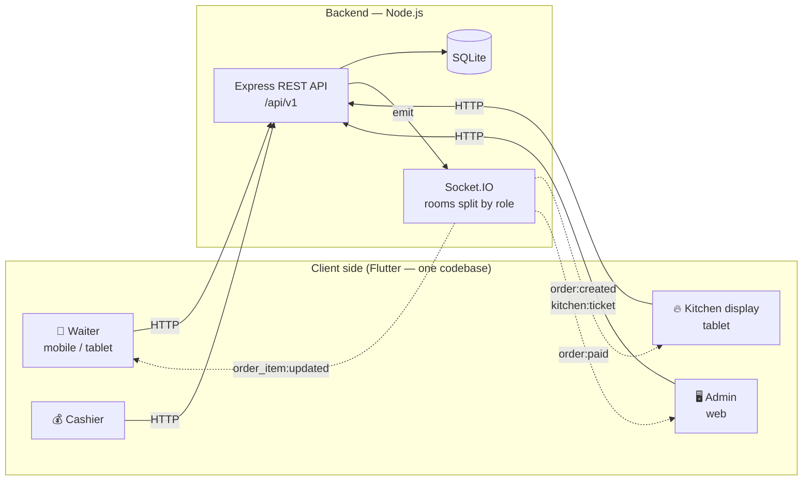
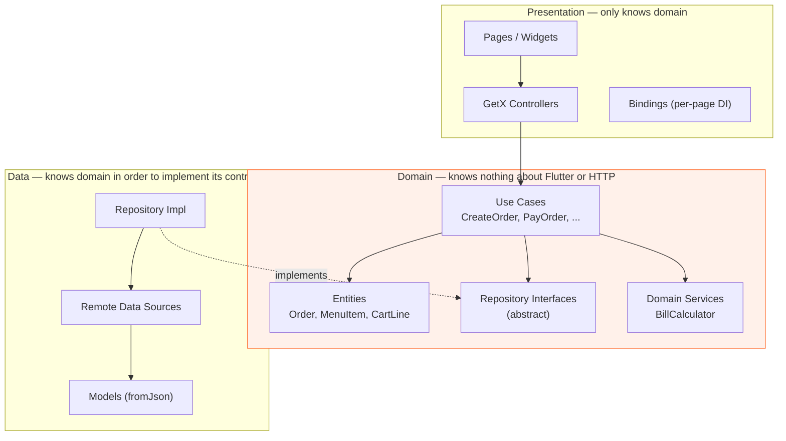

# 🍽️ PaynEat POS — Restaurant Point-of-Sale System

**Language:** [ไทย](README.md) · English

> A complete POS workflow: a waiter takes an order on a tablet → it pops up on the kitchen display instantly →
> the cashier closes the bill → the manager watches sales on the web dashboard

> **Flutter (GetX + Clean Architecture)** + **Node.js / Express + SQLite + Socket.IO** — one codebase runs on
> Android, iOS, and Web

<p align="center">
  
  
  
  
  
  
  
  <a href="LICENSE"></a>
</p>

**TL;DR** — A full restaurant point-of-sale system built to demonstrate end-to-end product engineering:
a Flutter client (mobile / tablet / web from one codebase, structured with Clean Architecture + GetX) talking to a
Node.js REST + WebSocket backend. Covers the complete floor-to-cash workflow: table map, order taking with
modifiers, live kitchen display, split payments, receipts, and management dashboards — with role-based access
control and 407 automated tests.

---

## 📸 Screenshots

<table>
<tr>
<td width="50%" align="center"><b>Table map — waiter view</b><br><sub>See every table's status and running total in one screen</sub><br><br>
</td>
<td width="50%" align="center"><b>Order taking with modifiers</b><br><sub>Spice level, extras, and a note to the kitchen</sub><br><br>
</td>
</tr>
</table>

<p align="center"><b>Kitchen display (KDS)</b> — tickets pop up in real time, split into 3 status columns, with a red border and flame icon for tickets waiting over 15 minutes</p>
<p align="center"></p>

<p align="center"><b>Admin web dashboard</b> — today's sales, an hourly chart, best sellers, and a live store status counter</p>
<p align="center"></p>

<p align="center"><b>Split payment checkout</b> — pay part by QR, the rest in cash; the system tracks the remaining balance and calculates change</p>
<p align="center"></p>

> 🎬 **Demo presentation video (1:41 · 1080p)**
> · [Thai edition](docs/video/PaynEat-POS-Demo-TH.mp4)
> · [English edition](docs/video/PaynEat-POS-Demo-EN.mp4)
>
> Walks through the real usage path from opening the table map to closing the bill, built from 11 real
> screenshots ([how it's regenerated](docs/video/README.md))

> 📄 **Full feature walkthrough — 25 screens (23-page PDF)**
> · [Thai edition](docs/PaynEat-POS-Features-TH.pdf) — explains the design and mechanics behind every screen
> · [English edition](docs/PaynEat-POS-Features-EN.pdf) — written for restaurant owners: what each screen solves for the business
>
> Every image is rendered straight from real code via the golden tests in
> [`app/tool/screenshots`](app/tool/screenshots), so they can be regenerated any time the code changes
> ([how to regenerate](docs/generator/README.md))

---

## 📋 Table of contents

- [Screenshots](#-screenshots)
- [Why this project](#-why-this-project)
- [How to run it](#-how-to-run-it)
- [Features](#-features)
- [Tech stack](#-tech-stack)
- [Architecture](#-architecture)
- [Project structure](#-project-structure)
- [Bill calculation](#-bill-calculation)
- [Realtime](#-realtime)
- [API](#-api)
- [Testing](#-testing)
- [What's next](#-whats-next)

---

## 🎯 Why this project

This project was built to be more than a to-do-list app — a system with real business rules to manage.

A restaurant is a great problem for that — it has more hidden edge cases than it looks:

- When can an order still be edited? (Once the kitchen has started cooking it, editing is locked — a manager
  has to void the item instead)
- Is VAT calculated before or after the service charge? What about discounts?
- Can the same table have two open bills at once?
- A customer wants to split payment — half by QR, half in cash — that has to be supported
- The kitchen and the waiters are on different devices and need to see the same state instantly
- Money must never drift from floating-point rounding errors

So this project prioritizes **correct business logic and a maintainable structure** over flashy UI.

---

## 🚀 How to run it

> Takes about 5 minutes · if you get stuck, see [Troubleshooting](#-troubleshooting) at the end of this section

### Step 0 — Get the code

```bash
git clone https://github.com/SuruchBoss/PaynEat.git
cd PaynEat
```

---

### 🅰️ Option A — Run locally (recommended)

**Requirements**

| Tool | Version | Check with |
|---|---|---|
| [Node.js](https://nodejs.org) | 20+ (22 recommended) | `node -v` |
| [Flutter SDK](https://docs.flutter.dev/get-started/install) | 3.35+ | `flutter --version` |

**Terminal 1 — Backend**

```bash
cd backend
npm install
npm run dev
```

Success looks like this (the database and sample data are created automatically — nothing else to configure):

```
🍽️  PaynEat POS API
   ▸ REST      : http://localhost:3000/api/v1
   ▸ Docs      : http://localhost:3000/docs
   ▸ Health    : http://localhost:3000/health
   ▸ Realtime  : ws://localhost:3000 (socket.io)
```

**Terminal 2 — App** (open a new window, keep the first one running)

```bash
cd app
flutter pub get
flutter run -d chrome        # runs on web — fastest option
```

Or if you want to see it on a phone/tablet:

```bash
flutter devices              # list connected devices
flutter run                  # pick the device it finds
```

> 📱 **Android emulator**: the app automatically points to `10.0.2.2:3000` (the host machine's loopback) —
> no extra configuration needed
> 📱 **Real phone on the same Wi-Fi**: pass your computer's IP, e.g.
> `flutter run --dart-define=API_BASE_URL=http://192.168.1.15:3000`
> (find your IP with `ipconfig` on Windows / `ifconfig | grep inet` on macOS-Linux)

---

### 🅱️ Option B — Docker (no Node or Flutter install needed)

Best if you just want to see the system working without installing any toolchain.

**Requires only:** [Docker Desktop](https://www.docker.com/products/docker-desktop/)

```bash
docker compose up --build
```

The first run takes about 5–10 minutes (it downloads the Flutter SDK to build the web app). Subsequent runs
are much faster.

Once you see `payneat-web` and `payneat-api` come up, open your browser:

| Open this | You'll find |
|---|---|
| **http://localhost:8080** | 👈 **Start here** — the app's login page |
| http://localhost:3000/docs | Interactive API docs (Swagger UI) |
| http://localhost:3000/health | Health check for the API |

Stop the system with `Ctrl+C`, then `docker compose down`
(want a clean slate? `docker compose down -v`)

---

### 🆑 Option C — Just look at the app, no backend needed

If you just want to see the Flutter side without running a server:

```bash
cd app
flutter pub get
flutter run -d chrome --dart-define=DEMO_MODE=true
```

The app uses local mock data instead — every feature works.
(No cross-device realtime updates since there's no server, and data resets on page refresh.)

> 💡 This mode is switched at a **single point** (`_bindDataSources()`) without touching any screen,
> controller, or use case — a concrete example of why the Clean Architecture split is worth it.

---

### 👤 Login accounts

The login page has one-tap buttons for each account — no need to type anything.

| Role | username | password | What they see |
|---|---|---|---|
| Admin | `admin` | `admin123` | Everything (dashboard, menu management, staff, reports, settings) |
| Manager | `manager` | `manager123` | Same as admin but can't delete user accounts |
| Waiter | `waiter1` | `waiter123` | Table map, orders, kitchen display |
| Kitchen | `kitchen` | `kitchen123` | Kitchen display only |
| Cashier | `cashier` | `cashier123` | Table map, orders, reports |

> ⚠️ **These accounts are for demo purposes only.** If you deploy this backend for real use (not just
> running it locally), always change these passwords or disable `AUTO_SEED` first — see
> [`SECURITY.md`](SECURITY.md) for the full pre-deployment checklist.

---

### 🗺 5-minute tour — follow this to see the full cycle in action

> **Tip:** open **two browser windows side by side** (one as the waiter, one as the kitchen — use an
> incognito window for the second one) to see orders bounce between screens in real time.
> *(Works with Option A and B — Option C has no server, so no realtime.)*

1. **Log in as a waiter** (`waiter1`) → see the table map split by zone; green means available
2. **Tap table A1** → opens the order-taking screen
3. **Tap "Stir-fried Pork with Basil"** → a sheet pops up to pick spice level and extras; try adding a
   "Fried Egg (+15)" and typing a note to the kitchen
4. **Look at the cart on the right** → see the subtotal + 10% Service Charge + 7% VAT calculated instantly
5. **Tap "Confirm & Send to Kitchen"** → lands on the order detail page with a bill number
6. **Switch to the kitchen window** (`kitchen`) → the ticket appears on its own, no refresh needed.
   Tap **"Start Cooking" → "Ready"** and watch the ticket move across columns
7. **Back to the waiter window** → the status updates immediately; tap **"Served"**
8. **Tap "Checkout / Close Bill"** → try a split payment: pay 100 THB by QR first, then the rest in cash
   (the system tracks the remaining balance and calculates change)
9. **You land on the receipt page** → go back to the table map; table A1 has already turned green again
10. **Log out and log back in as `admin`** → open **Dashboard**, and the sale you just made is already in the
    report, complete with the hourly chart and best sellers
11. **Open the Ingredients/Stock page** (the 📦 icon in the left nav) → "ปลาทับทิม" (tilapia — ingredient
    names aren't translated) is already highlighted with a low-stock alert straight out of the seed data

**Want to try the hidden business rules?**

- Try opening a second order at the same table → rejected, with a hint to add to the existing bill instead
- Try changing an item's quantity after the kitchen taps "Start Cooking" → can't; only a manager can cancel
  the item instead
- Log in as `waiter1` and look for a "Manage Staff" menu → it's not there (and hitting the API directly
  returns 403)
- Log in as `admin` → **Menu Management** → toggle a menu item off, then go back to order taking — it shows
  "Sold Out" and can't be tapped
- Log in as `admin` → **Ingredients/Stock** → adjust "ปลาทับทิม" → pick "Deduct" and enter 3 (its exact
  starting stock) → go back to order taking and "Steamed Fish with Lime" now shows "Sold Out" **on its own**,
  with nobody toggling it manually (automatic stock deduction — see `docs/DECISIONS.md` #15) — hit "Receive"
  to restock it and it re-enables itself the same way

---

### 🧪 Want to run the tests?

```bash
cd backend && npm test      # 165 cases — including a 17-step end-to-end walkthrough
cd app && flutter test      # 242 cases — domain / controller / widget
```

---

### 🔧 Troubleshooting

<details>
<summary><b>Click to see fixes</b></summary>

| Symptom | Cause | Fix |
|---|---|---|
| `Error: listen EADDRINUSE :::3000` | Something else is already using port 3000 | Change the port: `PORT=3001 npm run dev`, then run the app with `flutter run -d chrome --dart-define=API_BASE_URL=http://localhost:3001` |
| App shows "Can't connect to server" | The backend isn't running, or it's on a different port | Open http://localhost:3000/health in a browser — if it doesn't respond, the backend isn't running |
| Real phone can't connect | The phone doesn't know your computer's `localhost` | Pass your computer's IP: `--dart-define=API_BASE_URL=http://<your computer's IP>:3000`, and make sure it's on the same Wi-Fi |
| `npm install` fails on `better-sqlite3` | Missing build tools to compile a native module | Windows: `npm install --global windows-build-tools` · macOS: `xcode-select --install` · Linux: `sudo apt install build-essential python3` |
| `flutter run` complains about the Dart version | Flutter is older than 3.35 | `flutter upgrade` |
| Docker build hangs on the Flutter step | It's downloading the ~2GB Flutter SDK for the first time | Wait for it to finish (5–10 min) — later builds use the cache |
| The Docker web app loads but login doesn't work | The browser can't reach the API | Check that http://localhost:3000/health responds; if you changed the port, update `API_BASE_URL` in `docker-compose.yml` to match |
| Want to wipe the data and start over | — | Local: `cd backend && npm run db:reset` · Docker: `docker compose down -v` |

</details>

---

## ✨ Features

### 📱 Waiter (mobile / tablet)

- **Table map** grouped by zone, showing status (available / occupied / reserved / billing) with the running
  total and how long the table has been seated
- **Order taking** — search the menu, filter by category, pick modifiers (spice level, fried egg +15), and
  type a note to the kitchen
- **Smart cart** — identical line items merge into one row automatically
- **Live bill preview** — see Service Charge and VAT calculated the instant you order, no need to wait on
  the server
- **Adding a second round** — add items to an already-open order, and mark kitchen-finished items as
  served — if the connection drops right when you confirm, it still works: the items are queued on the
  device and sent automatically once the connection is back (see the 🔐 System section)
- **Move table** — if a customer wants to move seats, move the whole order to a new table without
  cancelling and re-ordering
- **Merge bills** — instantly combine two tables sitting together into a single bill (item list and kitchen
  status stay intact)

### 🔥 Kitchen (KDS display)

- Tickets pop up automatically in real time — no refresh needed
- Split into 3 status columns: pending → cooking → ready
- **Flags tickets waiting over 15 minutes** with a red border and flame icon
- One-tap status changes, designed to be easy to hit with messy hands in a kitchen
- Toggle a menu item sold-out instantly, without waiting on a manager

### 💰 Cashier

- **Shift open/close** — enter a starting cash float when opening a shift; count the real cash when closing
  and the system automatically compares it against the expected total (cash drawer reconciliation) — a
  shift must be open before payments can be accepted
- Accepts 4 payment methods: cash, PromptPay/QR, credit card, bank transfer
- **Split payment** — e.g. 100 THB by QR, the rest in cash — the system tracks the remaining balance
  automatically
- **Split the bill per person** — pick which items each person is paying for; the system automatically
  calculates each person's share of food cost/discount/Service Charge/VAT proportionally, paid in rounds
  until every item is settled (already-paid items can't be selected again)
- **Refunds** after a payment has gone through (full or partial), always with a required reason (audit
  trail) — refunded amounts are automatically subtracted from net sales in reports (manager role or above)
- Change calculation with shortcut buttons (exact / round up to the nearest hundred / 100 / 500 / 1000)
- **Receipts reconcile the way a Thai receipt should** — each payment line shows the cash the
  customer handed over, not the amount applied to the bill, so tendered − change equals the bill
  total exactly, both on screen and on the printed receipt (see `docs/DECISIONS.md` #16)
- Discounts in both flat-amount and percentage, with 5/10/15/20% shortcut buttons
- **Prints a real receipt** on a thermal printer over ESC/POS via LAN/Wi-Fi (configure IP/port/paper size
  from Settings), with full Thai-character support — no printer configured? The on-screen receipt still
  works as normal (Bluetooth/USB and printing directly from a web browser aren't supported yet — see
  `docs/DECISIONS.md` #11)

### 🖥️ Admin (web)

- **Dashboard** — today's sales, an hourly chart, best sellers, payment-method breakdown, and a live store
  status counter
- **Historical reports** — pick any date range to see daily totals, best sellers, and category breakdowns
- **Menu management** — add/edit/delete items, and build your own modifier groups
- **Staff management** — add accounts, change roles, deactivate accounts
- **Store settings** — store name, VAT, Service Charge, VAT-inclusive pricing mode
- **Receipt printer settings** — this device's IP/port/paper size, with a test-print button
- **Conditional promotions/discounts** — create/edit/disable 3 promotion types (percent off, amount off,
  buy-one-get-one), with conditions for day/time window, eligible categories/menu items, minimum spend, and
  campaign start/end dates — auto-applies when eligible or lets customers redeem a discount code (one promotion
  per bill, max), shown clearly and separately from manual discounts on the bill, on-screen receipt, and printed
  receipt
- **Ingredients/stock** — link a menu item to the ingredients it uses and the quantity per order directly from
  the menu edit form; stock is deducted automatically when an order is sent to the kitchen (and restored
  automatically when an item is cancelled/removed); a menu item is auto-marked sold out when any linked
  ingredient runs out, and auto-re-enabled once restocked, with a low-stock alert screen (see
  `docs/DECISIONS.md` #15)

### 🔐 System

- JWT auth with 5 role-based permission levels, enforced on both the API and the app's menu visibility
- Responsive UI: mobile (bottom nav) / tablet (nav rail) / web (expanded rail)
- A realtime connection indicator so staff instantly know if the connection drops
- **Pending-sync badge** — if the connection drops while adding items to an order, an AppBar badge shows how
  many items are queued; they're sent automatically once the connection is back, with no extra tap required
  (see the detailed scope in `docs/DECISIONS.md` #13)
- **High-contrast mode**, toggled from the **Profile** page so every role can reach it — for screens
  in direct sunlight, kitchen screens fogged by steam, and fingerprint-covered tablets. Every text
  token moves from AA (4.5:1) to AAA (7:1) and card borders from 1.24:1 to 4.10:1. The hues and
  their meanings never change; only the depth does. Remembered per device, not per account
  (see `docs/DECISIONS.md` #18)

---

## 🛠 Tech stack

### Frontend — `app/`

| Technology | Purpose |
|---|---|
| **Flutter 3.35 / Dart 3.9** | One codebase, ships to Android + iOS + Web |
| **GetX 4.7** | State management, DI (Bindings), routing |
| **Dio 5** | HTTP client + interceptor that attaches the JWT and maps errors |
| **socket_io_client** | Receives realtime events from the backend |
| **get_storage** | Stores the token/profile on-device (falls back to in-memory) |
| **intl** | Currency and date formatting |

### Backend — `backend/`

| Technology | Purpose |
|---|---|
| **Node.js 22 / Express 5** | REST API |
| **SQLite (better-sqlite3)** | Database — a single file, no DB server to install |
| **Socket.IO** | Realtime events, split into rooms by role |
| **JWT + bcrypt** | Authentication and password hashing |
| **Zod** | Request validation on every endpoint |
| **OpenAPI 3 + Swagger UI** | Interactive API documentation |
| **node:test + supertest** | Tests |

---

## 🏛 Architecture

### System overview



### Clean Architecture on the Flutter side

Dependencies always point inward, toward **domain** — inner layers never know about outer ones.



**What this layering actually buys us (not just theory):**

1. **Demo Mode** — swap in mock data sources by editing a single file; the screens don't even know it
   happened
2. **Controllers are testable without a server** — inject a fake repository directly (see
   `test/presentation/cart_controller_test.dart`)
3. **Business rules live in one place** — `BillCalculator` is used both for the cart preview and Demo Mode
4. **The backend is swappable** — moving to GraphQL or Firebase only touches the data layer

### Layered backend

```
routes  →  controller  →  service  →  repository  →  SQLite
   ↑           ↑             ↑             ↑
validate    map req/res   business      pure SQL
 (Zod)                    rules + emit
                           socket events
```

`service` doesn't know about `req`/`res`, and `repository` doesn't know about business rules — each layer
can be tested in isolation.

---

## 📁 Project structure

```
PaynEat/
├── app/                              # Flutter (mobile + tablet + web)
│   ├── lib/
│   │   ├── app/                      # Theme, routing, app-level DI, config
│   │   ├── core/                     # Shared building blocks used by every feature
│   │   │   ├── network/              # ApiClient (Dio), SocketClient, endpoints
│   │   │   ├── errors/               # Failure / Exception + mapper
│   │   │   ├── usecases/             # Result<T> (a sealed class instead of Either)
│   │   │   ├── demo/                 # ⭐ The mock backend behind Demo Mode
│   │   │   ├── services/             # StorageService, SessionService
│   │   │   ├── utils/                # Formatters, responsive helpers
│   │   │   └── widgets/              # Widgets reused across the app
│   │   └── features/                 # Split by feature, each with all 3 layers
│   │       ├── auth/  menu/  table/  order/
│   │       ├── kitchen/  payment/  report/
│   │       └── staff/  settings/  home/
│   │           ├── domain/           # entities · repositories · usecases
│   │           ├── data/             # models · datasources · repository impl
│   │           └── presentation/     # controllers · pages · widgets · bindings
│   └── test/                         # Domain / controller / widget tests
│
├── backend/                          # Node.js API
│   ├── src/
│   │   ├── config/  core/  middlewares/  realtime/
│   │   ├── db/                       # schema.sql, migrate, seed
│   │   ├── modules/                  # Split by domain
│   │   │   └── orders/
│   │   │       ├── order.routes.js
│   │   │       ├── order.controller.js
│   │   │       ├── order.service.js
│   │   │       ├── order.repository.js
│   │   │       ├── order.calculator.js   # ⭐ Billing rules (pure functions)
│   │   │       └── order.schema.js       # Zod
│   │   └── routes.js
│   ├── docs/openapi.yaml
│   └── tests/
│
├── docker-compose.yml                # Run the whole system with one command
└── .github/workflows/ci.yml          # Runs format/analyze/test checks on every push
```

---

## 💵 Bill calculation

Money is the one place mistakes aren't acceptable, so two things get special treatment:

### 1. Amounts stored as whole numbers (satang)

```js
// ❌ The classic floating-point problem
0.1 + 0.2 === 0.3   // false

// ✅ The backend stores everything in satang, converting to baht only on output
120.50 THB  →  stored as  12050
```

### 2. A clear calculation order, written as testable pure functions

```
Food subtotal
  − Discount                     (flat amount or %)
  + 10% Service Charge           (calculated on the amount after the discount)
  + 7% VAT                       (calculated on the amount after the discount + Service Charge)
  = Total due
```

A real example from the tests — Pad Krapao (75 THB) + fried egg (15 THB) × 2 plates:

| Line item | Amount |
|---|---:|
| Food subtotal | 180.00 |
| Service Charge 10% | 18.00 |
| VAT 7% (of 198) | 13.86 |
| **Grand total** | **211.86** |

This logic is written in two places but always produces the exact same result, with tests covering both:

- `backend/src/modules/orders/order.calculator.js` — the authoritative total used for payment
- `app/lib/features/order/domain/services/bill_calculator.dart` — an instant in-app preview that doesn't
  need to wait on the network

A "prices already include VAT" mode is also supported (VAT is backed out of the price for display instead
of being added on top).

---

## ⚡ Realtime

Socket.IO reuses the same JWT as the REST API and places each user into a room based on their role, so the
kitchen never receives events that don't concern it.

| Event | Who receives it | When it fires |
|---|---|---|
| `kitchen:ticket` | Kitchen room | An order is sent to the kitchen |
| `order_item:updated` | Service room | The kitchen changes an item's status |
| `order:created` / `order:updated` | Everyone | An order is opened or edited |
| `order:paid` | Everyone | A bill is closed successfully |
| `table:updated` | Everyone | A table's status changes |

On the app side, `SocketClient` always returns an unsubscribe function, which controllers keep around and
call in `onClose()` to prevent stray listeners and memory leaks.

```dart
_unsubscribers.add(socket.on(SocketEvents.kitchenTicket, (_) => load()));
```

---

## 📡 API

Open **http://localhost:3000/docs** for interactive, try-it-yourself documentation (Swagger UI)

<details>
<summary><b>Full endpoint summary (click to expand)</b></summary>

| Method | Endpoint | Access | Description |
|---|---|---|---|
| POST | `/auth/login` | — | Log in |
| GET | `/auth/me` | Anyone | Current user info |
| GET | `/menu-items` | Anyone | Menu list (searchable/filterable) |
| POST | `/menu-items` | admin, manager | Add a menu item |
| PATCH | `/menu-items/:id/availability` | + kitchen, waiter | Toggle sold-out |
| GET | `/tables` | Anyone | Table map with open orders |
| PATCH | `/tables/:id/status` | Anyone | Change table status |
| POST | `/orders` | waiter and above | Open an order |
| POST | `/orders/:id/items` | waiter and above | Add items |
| PATCH | `/orders/:id/items/:itemId` | waiter and above | Change quantity (before the kitchen starts) |
| PATCH | `/orders/:id/items/:itemId/status` | kitchen, waiter | Move an item's status forward |
| POST | `/orders/:id/send-to-kitchen` | waiter and above | Send to kitchen |
| POST | `/orders/:id/discount` | cashier and above | Apply a discount |
| POST | `/orders/:id/cancel` | admin, manager | Cancel an order |
| PATCH | `/orders/:id/move-table` | waiter and above | Move an order to another table |
| POST | `/orders/:id/merge` | waiter and above | Merge a source order into a target order |
| GET | `/orders/kitchen/queue` | kitchen | Kitchen queue |
| POST | `/payments` | cashier and above | Take a payment (full / partial / split by item) |
| POST | `/payments/:id/refund` | manager and above | Refund a payment (full or partial) |
| POST | `/payments/order/:id/split-preview` | cashier and above | Preview the amount due before splitting the bill |
| GET | `/payments/order/:id/receipt` | Anyone | Receipt data |
| GET | `/shifts/current` | admin, manager, cashier | The currently open shift, if any |
| POST | `/shifts` | admin, manager, cashier | Open a shift with a starting cash float |
| PATCH | `/shifts/:id/close` | admin, manager, cashier | Close a shift and reconcile the counted cash |
| GET | `/reports/dashboard` | Management | Dashboard data |
| GET | `/reports/summary` | Management | Sales summary for a date range |
| GET/PATCH | `/settings` | Anyone / admin | Store settings |
| GET/POST/PATCH/DELETE | `/users` | admin, manager | Staff management |

</details>

Every endpoint shares the same response shape:

```jsonc
// Success
{ "success": true, "data": { }, "meta": { "page": 1, "total": 24 } }

// Error
{
  "success": false,
  "error": {
    "code": "VALIDATION_ERROR",
    "message": "The submitted data is invalid",
    "details": [{ "field": "quantity", "message": "Quantity must be greater than 0" }]
  }
}
```

---

## 🧪 Testing

```bash
cd backend && npm test      # 165 cases
cd app && flutter test      # 242 cases
```

**Backend (165 cases)** — `node:test` + `supertest`, run over real HTTP against an isolated test database.
The centerpiece is `tests/order-flow.test.js`, which walks the entire floor-to-cash path in 17 steps:

> Pick a table → open an order with modifiers → verify the total is correct → the table becomes occupied →
> opening a second order at the same table is rejected → send to kitchen → the kitchen moves through
> statuses (and can't skip a step) → the order auto-updates once everything is served → apply a discount →
> split payment twice → verify the change → paying again is rejected → the table frees up automatically →
> the receipt is complete → the sale shows up in reports

There are also dedicated test files for all 9 modules: `menu.test.js` (validation, RBAC, can't delete a menu
item that's already been ordered), `table.test.js` (duplicate names, status changes, can't delete a table
with an open order), `payment.test.js` (splitting, overpaying/double-paying, RBAC), `categories.test.js`,
`settings.test.js`, `users.test.js` (deleting staff is admin-only), `reports.test.js` — while writing the
menu search tests, a real bug turned up in `menu.repository.js` (it used `IFNULL(m.name_en, "")`, and SQLite
treats double quotes as a column identifier rather than a string literal, so the search broke the moment a
menu item had no `nameEn` — fixed by switching to single quotes).

`order-move-merge-split.test.js` (7 new cases) covers move-table/merge-bill/split-by-item: a successful move
+ rejection when the destination table is occupied, a successful merge (correct combined total, the source
order cancelled and its table freed) + rejection of merging an order with itself, proportional split-bill
previews, paying item-by-item until the bill closes, and rejecting an item that's already been paid for.

`promotion-engine.test.js` (16 cases) tests the pure promotion-matching logic (percent/amount/bogo, day/time/
minimum-spend/menu-category conditions, `findBestAutoPromotion`, `describeIneligibility`), and
`promotion-flow.test.js` (13 cases) walks the full HTTP path: create an auto promotion → it auto-applies to an
existing order → removing it brings it back because it's still eligible → disabling it clears it → redeem a
valid/invalid code → a pinned code isn't replaced by an auto promotion even if the auto one would discount more
→ deleting a promotion already used on an order doesn't affect that order (its name/code were already
snapshotted).

`ingredients.test.js` (9 cases) tests ingredient CRUD, RBAC (waiters can't create/edit), validation, adjusting
stock and seeing `isLowStock` flip correctly, the `lowStockOnly` filter, and refusing to delete an ingredient
still linked to a menu item. `inventory-flow.test.js` (13 steps) walks the full path: order items → no
deduction yet → send to kitchen deducts stock (repeat calls don't double-deduct) → adding items to an
already-sent order deducts immediately → stock hits zero and the menu item auto-disables → ordering the
disabled item elsewhere gets a 409 → cancelling the item restores stock and re-enables the menu automatically
→ a manual stock adjustment syncs availability the same way → changing quantity/removing an item/cancelling
the whole order all restore stock correctly.

**Flutter (242 cases)** — split into 3 levels:

| Level | File | What it tests |
|---|---|---|
| Domain | `bill_calculator_test.dart` | Every billing rule, including manual discounts, promotion discounts (additive but capped at the subtotal), and VAT-inclusive mode |
| Domain | `promotion_engine_test.dart` | The backend's promotion-matching test suite ported to Dart (percent/amount/bogo, every condition type, `findBestAutoPromotion`, `describeIneligibility`) |
| Domain | `cart_line_test.dart` | Merging duplicate cart lines |
| Domain | `entities_test.dart` | Role-based permissions, order-item status transitions |
| Domain | `demo_store_test.dart` | Verifies `demo_store.dart`, split into 11 files, still works correctly across domains, including the full auto/code/remove/eligible-list promotion flow and the full stock-deduction / auto sold-out flow |
| Controller | `cart_controller_test.dart` | Cart logic, using a fake repository |
| Controller | `auth_controller_test.dart` | Validators, fillDemoAccount, guard when the form is invalid |
| Controller | `order_list_controller_test.dart` | Order status filters, sending activeOnly/dateFrom correctly |
| Controller | `table_controller_test.dart` | Combined zone/status filtering, counting available/occupied tables |
| Controller | `home_controller_test.dart` | Per-role menu visibility, tab switching |
| Controller | `menu_browse_controller_test.dart` | Menu filtering/search (debounced), counts per category |
| Controller | `menu_management_controller_test.dart` | Menu filtering on the management screen, counting sold-out items |
| Controller | `kitchen_controller_test.dart` | Grouping the kitchen queue by status, counting late items, moving status forward |
| Controller | `checkout_controller_test.dart` | Change/remaining-balance calculation, the `canPay` condition, rounding up to the nearest hundred |
| Controller | `receipt_controller_test.dart` | Loading a receipt by orderId, plus the `Payment.tendered` rule — a receipt shows the cash the customer handed over, not the amount applied to the bill (tendered − change = amount applied) |
| Controller | `settings_controller_test.dart` | Loading store settings into the correct form fields |
| Controller | `staff_controller_test.dart` | Filtering staff by role, counting by role |
| Controller | `order_detail_controller_test.dart` | Order management permissions, moving item status forward |
| Controller | `dashboard_controller_test.dart` | Loading today's sales summary + live counters |
| Controller | `report_controller_test.dart` | Selecting a report date range, silently swallowing topItems/dailySales errors |
| Controller | `split_bill_controller_test.dart` | Selecting/deselecting items, fetching the preview, `canPay`/`change` |
| Controller | `home_destinations_test.dart` | Per-role menu visibility (guards against permission leaks) |
| Controller | `storage_service_test.dart` | Storing the session, and falling back to in-memory storage |
| Widget | `widgets_test.dart` | Button taps and widget state |
| Widget | `hourly_chart_range_test.dart` | The chart's time range must come from real data, not a hardcoded value |
| Core | `app_clock_test.dart` | `AppClock` freezes and restores the clock correctly — stops a frozen time leaking across tests |
| Core | `app_colors_contrast_test.dart` | Computes real WCAG contrast ratios against **every surface actually used**, not just white — standard mode must pass AA (4.5:1), high-contrast mode AAA (7:1), and any colour used as a button/chip fill must carry a white label |
| Core | `contrast_service_test.dart` | The real toggle path — switching the palette, persisting it, restoring it on next launch, and proving the theme rebuilds its colours instead of caching them once |

> Methods that touch navigation (`Get.toNamed`, `Get.snackbar`, `Get.dialog`) aren't covered at this unit
> level — they need a real, pumped `GetMaterialApp`, so only the navigation-independent logic/state is
> tested (see `docs/CODING_STANDARDS.md` section 6.2) — while writing these tests, a real bug turned up in
> `OrderDetailController`: GetX silently skips assigning an `Rxn<Order>` when the newly returned order has
> the same id as before (because `Order.==` only compares id), leaving the screen showing stale data after
> an edit or status change — now fixed (see `docs/CODING_STANDARDS.md` section 3.5).

GitHub Actions CI runs `dart format` → `flutter analyze` → `flutter test` → `flutter build web` on the
Flutter side, and `prettier --check` → `eslint` → `npm test` on the backend, on every push.

---

## 🔭 What's next

What's not done yet, and why — so it's clear these are known gaps, not oversights.

- [x] **Move table / merge bills / split bill per person** — done: `PATCH /orders/:id/move-table`,
  `POST /orders/:id/merge`, and splitting the bill by item (`POST /payments` with `itemIds` +
  `POST /payments/order/:id/split-preview`), with full UI for all 3 features (see the ✨ Features section)
- [x] **Shift open/close / cash drawer reconciliation** — done: enter a starting cash float when opening a
  shift, count the real cash when closing and automatically compare it to the expected total; a shift must
  be open before payments can be accepted (see the ✨ Features section)
- [x] **Refunds after payment** — done: `POST /payments/:id/refund`, full or partial, with a required
  reason, automatically subtracted from net sales in reports (see the ✨ Features section)
- [x] **Printing real receipts on a thermal printer** — done, deliberately scoped to LAN/Wi-Fi first
  (Bluetooth/USB aren't supported yet since this development environment has no real hardware to test
  against — full reasoning in [`docs/DECISIONS.md`](docs/DECISIONS.md) #11)
- [x] **Offline mode** — done, deliberately scoped to "adding items to an already-open order" first (the
  lowest-conflict-risk action); items are queued on-device and synced automatically once the connection is
  back — opening a new order, taking payment, opening/closing a shift, etc. still always require being
  online, by design (full scope in [`docs/DECISIONS.md`](docs/DECISIONS.md) #13)
- [x] **Conditional promotions/discounts** (happy hour, discount codes, buy-one-get-one) — done: admin/manager
  can create/edit/disable 3 promotion types with conditions for day/time, eligible categories/menu items,
  minimum spend, and campaign dates; auto-applies when eligible or accepts a customer-entered discount code
  (one promotion per bill, additive with a manual discount but capped at the subtotal), shown clearly across
  the bill/receipt/printed receipt (see the ✨ Features section)
- [x] **Ingredient stock tracking** — done: link a menu item to the ingredients it uses and the quantity per
  order from the menu edit form; stock auto-deducts when sent to kitchen (auto-restored on cancel/removal); a
  menu item auto-disables/re-enables based on ingredient stock, with a low-stock alert screen (see the ✨
  Features section and `docs/DECISIONS.md` #15)
- [x] **High-contrast mode** — done: toggled from the **Profile** page (reachable by every role,
  not just admins) and remembered per device. Every text token moves from AA (4.5:1) to AAA (7:1)
  and card borders from 1.24:1 to 4.10:1 (see `docs/DECISIONS.md` #18)
- [ ] **Flutter integration tests** with `integration_test` against a real backend
- [ ] **Tax invoice / e-Tax invoice** — required under Thai law for serious commercial use

**Deliberately not doing** (not a backlog item — full reasoning in
[`docs/DECISIONS.md`](docs/DECISIONS.md)):

- **Printing over Bluetooth/USB** — needs real hardware to test against, which this development
  environment doesn't have (LAN/Wi-Fi is done, as noted above)
- **Offline mode for opening new orders/taking payment** — higher conflict risk (order numbers and money
  correctness must come straight from the server)
- **PostgreSQL for multi-branch support** — deliberately scoped to a single branch for now (the repository
  layer is already isolated, so this wouldn't be a hard change if it's ever needed)

---

## 📚 Further reading

- [`docs/PaynEat-POS-Features-TH.pdf`](docs/PaynEat-POS-Features-TH.pdf) — a 23-page document covering every screen with explanations (Thai)
- [`docs/PaynEat-POS-Features-EN.pdf`](docs/PaynEat-POS-Features-EN.pdf) — English edition, rewritten for business audiences
- [`docs/DECISIONS.md`](docs/DECISIONS.md) — 18 design decisions with their accepted trade-offs (e.g. why
  amounts are stored in satang, why the billing logic is deliberately written twice, why SQLite)
- [`docs/CODING_STANDARDS.md`](docs/CODING_STANDARDS.md) — coding standards from a code-quality audit
  covering Clean Code / State Management / Clean Architecture / Technical Debt / folder structure — use
  this as the guide for further development
- [`docs/PaynEat-POS-Audit-Report-TH.pdf`](docs/PaynEat-POS-Audit-Report-TH.pdf) — an easy-to-read 8-page
  code quality audit report (PDF, Thai) summarizing results across all 5 dimensions with real bugs found
  and fixed
- [`backend/docs/openapi.yaml`](backend/docs/openapi.yaml) — the full API spec
- [`CONTRIBUTING.md`](CONTRIBUTING.md) — want to help build this further? Start here (setup, coding
  standards, PR workflow)
- [`CODE_OF_CONDUCT.md`](CODE_OF_CONDUCT.md) — the code of conduct for everyone contributing to this project
- [`SECURITY.md`](SECURITY.md) — how to report a security vulnerability, and what to check before deploying
  to production

---

## 📄 License

[MIT](LICENSE) — use it, modify it, or build on top of it freely
