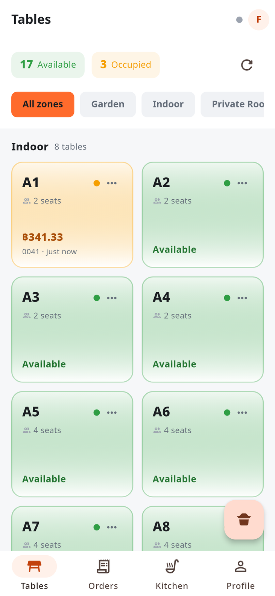
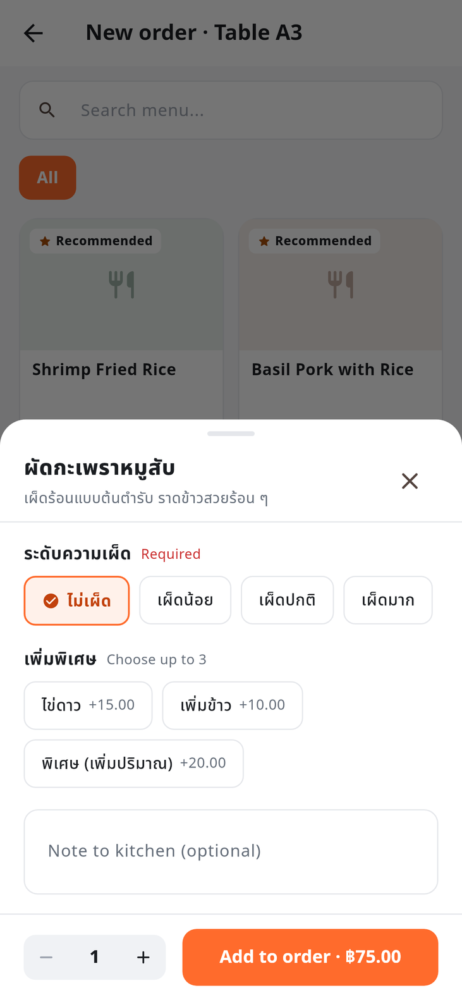
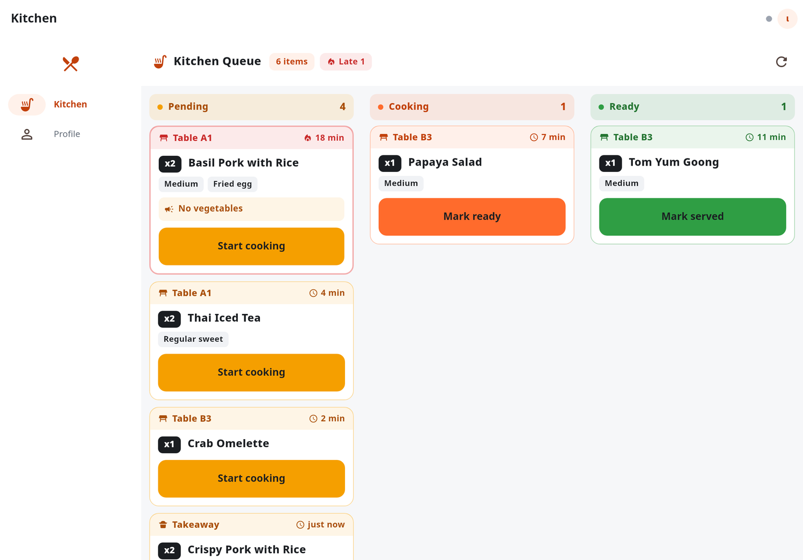
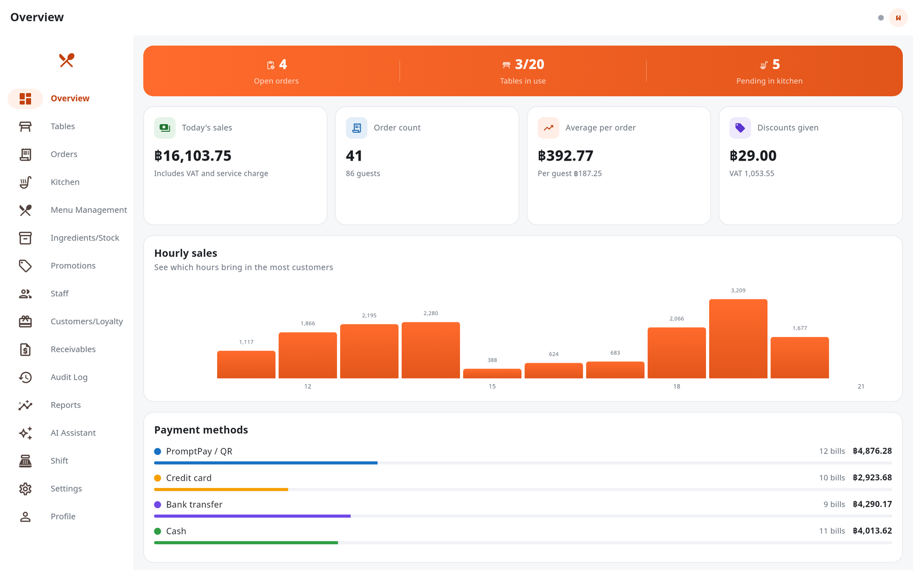
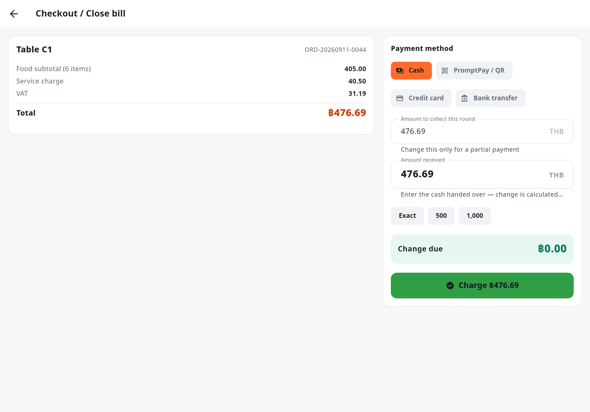
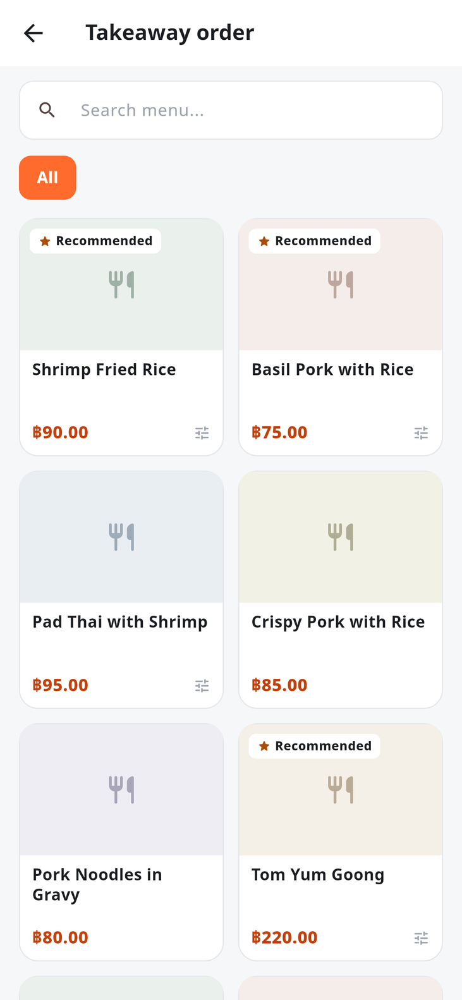
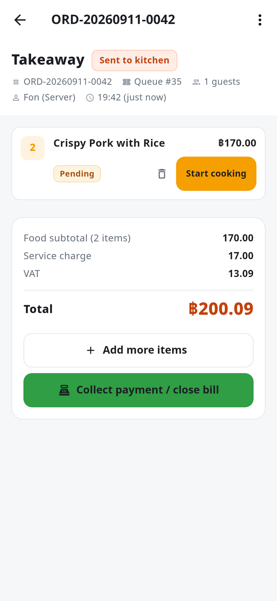
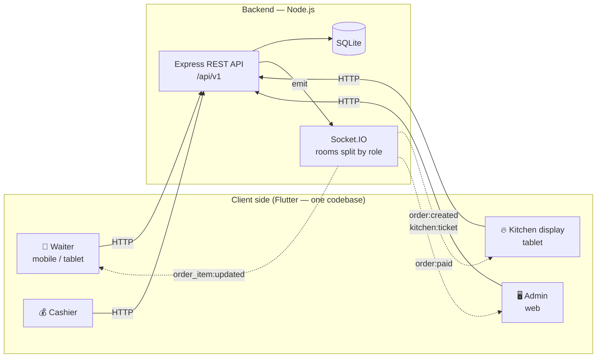
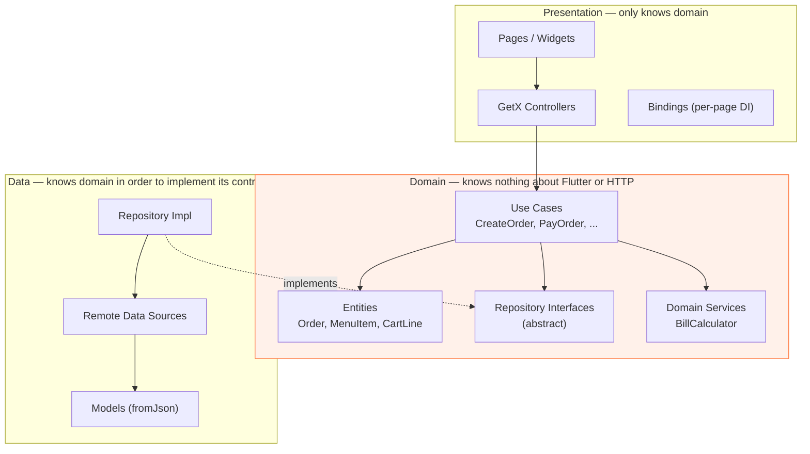

# 🍽️ PaynEat POS — Restaurant Point-of-Sale System

**Language:** [ไทย](README.md) · English · [한국어](README.ko.md)

> A complete POS workflow: a waiter takes an order on a tablet → it pops up on the kitchen display instantly →
> the cashier closes the bill → the manager watches sales on the web dashboard

> **Flutter (GetX + Clean Architecture)** + **Node.js / Express + SQLite + Socket.IO** — one codebase runs on
> Android, iOS, and Web

<p align="center">
  
  
  
  
  
  
  
  <a href="LICENSE"></a>
</p>

**TL;DR** — A full restaurant point-of-sale system built to demonstrate end-to-end product engineering:
a Flutter client (mobile / tablet / web from one codebase, structured with Clean Architecture + GetX) talking to a
Node.js REST + WebSocket backend. Covers the complete floor-to-cash workflow: table map, order taking with
modifiers, live kitchen display, split payments, receipts, and management dashboards — with role-based access
control and 876 automated tests.

> 👤 **Created and maintained by [SuruchBoss](https://github.com/SuruchBoss)** — forks and derivatives are very
> welcome, just keep the [`NOTICE`](NOTICE) file as required by the Apache License 2.0. Say hi on
> [LinkedIn](https://www.linkedin.com/in/suruchboss)

---

## 🌟 Highlights

- **Multi-branch, one system** — tables/menu/orders/reports are scoped per branch and never mix; switch
  branches or view combined totals across every branch from the same account (`docs/DECISIONS.md` #36)
- **Real PromptPay QR codes** — generates a standards-compliant EMV QR customers can scan and pay
  instantly, matched to the bill automatically, not just a button for staff to click "confirmed"
- **QR self-order** — customers scan the QR code at their table and order straight from their own
  phone, no login required; orders reach the kitchen and deduct stock automatically, exactly as if
  staff had placed them (`docs/tickets/17-qr-self-order.md`)
- **AI assistant you can ask about sales in plain language** — powered by Claude via tool-calling
  against the real restaurant data, never guessing or inventing numbers, every answer cites its source
- **Keeps selling when the Wi-Fi drops** — orders keep going mid-service; once the connection is back,
  everything syncs automatically with nothing lost
- **Report export + Z-report (shift/day close)** — hand the accountant a CSV instantly, with cash
  reconciliation and manual discounts split out from promotions
- **High-contrast mode** — stays legible in direct sunlight or a steamy kitchen; text meets WCAG AAA
- **Audit log covering every fraud-risk action** — cancelling orders, discounts, VAT changes, refunds —
  always with who/when/why, and nothing an admin can edit or delete from any UI
- **Works for a butcher counter and wholesale too** — sell by weight (price per kg), read a cabled scale
  live, scan scale labels/barcodes with a scanner or the phone camera, sell on credit to regular trade
  customers within a limit, issue billing notes, collect payments, charge late-payment interest, issue
  credit notes, and e-mail documents as Thai PDFs — and cash collected against debt still reconciles with
  the drawer at shift close (`docs/tickets/18-sell-by-weight.md`–`23-document-pdf-email.md`)
- **876 automated tests** run before every release, from bill-calculation rules to a full 17-step
  end-to-end restaurant walkthrough

---

## 📸 Screenshots

<table>
<tr>
<td width="50%" align="center"><b>Table map — waiter view</b><br><sub>See every table's status and running total in one screen</sub><br><br>
</td>
<td width="50%" align="center"><b>Order taking with modifiers</b><br><sub>Spice level, extras, and a note to the kitchen</sub><br><br>
</td>
</tr>
</table>

<p align="center"><b>Kitchen display (KDS)</b> — tickets pop up in real time, split into 3 status columns, with a red border and flame icon for tickets waiting over 15 minutes, and a distinct icon for table/takeaway/delivery on every ticket</p>
<p align="center"></p>

<p align="center"><b>Admin web dashboard</b> — today's sales, an hourly chart, best sellers, and a live store status counter</p>
<p align="center"></p>

<p align="center"><b>Split payment checkout</b> — pay part by QR, the rest in cash; the system tracks the remaining balance and calculates change</p>
<p align="center"></p>

<table>
<tr>
<td width="50%" align="center"><b>Takeaway/delivery — no table needed</b><br><sub>Tap the floating button on the table map to open an order without touching any table at all</sub><br><br>
</td>
<td width="50%" align="center"><b>Automatic queue number</b><br><sub>Runs on its own daily counter for takeaway only — delivery riders reference the order by its bill number instead</sub><br><br>
</td>
</tr>
</table>

> 🎬 **Demo presentation video (1:55 · 1080p)**
> · [Thai edition](docs/video/PaynEat-POS-Demo-TH.mp4)
> · [English edition](docs/video/PaynEat-POS-Demo-EN.mp4)
>
> Walks through the real usage path from opening the table map to closing the bill, built from 14 real
> screenshots ([how it's regenerated](docs/video/README.md))

> 📄 **Full feature walkthrough — 33 screens (30-page PDF)**
> · [Thai edition](docs/PaynEat-POS-Features-TH.pdf) — explains the design and mechanics behind every screen
> · [English edition](docs/PaynEat-POS-Features-EN.pdf) — written for restaurant owners: what each screen solves for the business
>
> Every image is rendered straight from real code via the golden tests in
> [`app/tool/screenshots`](app/tool/screenshots), so they can be regenerated any time the code changes
> ([how to regenerate](docs/generator/README.md))

> 🌐 **Landing page — static HTML, not a single line of JavaScript**
> · [Live on GitHub Pages](https://suruchboss.github.io/PaynEat/index.en.html) (English)
> · [Thai version](https://suruchboss.github.io/PaynEat/)
> · [Korean version](https://suruchboss.github.io/PaynEat/index.ko.html)
> · [Korean README](README.ko.md)
>
> The Korean edition deliberately uses a different visual world from the other two (light grounds,
> cool blue-grey, soft-shadowed rounded cards, in the idiom of modern Korean service sites). Its
> screenshots are of the app running in Korean, and the Thailand-specific features (PromptPay,
> Buddhist-era years on tax invoices, 7% VAT) are described as they actually are, each with a short
> note explaining what it is — the reader is a Korean speaker running a restaurant in Thailand,
> so they need the real thing, not a localised substitute. See `docs/DECISIONS.md` #39
>
> Tells the story of the system through the conditions it was built for — glare, steam, greasy hands,
> a Wi-Fi drop mid-service — with real screenshots embedded in the file. The animation is pure CSS.
> A demo button sits on the very first screen, and every language edition has **Security** and
> **Pricing · Contact** sections. Each edition's screenshots are genuinely in that language — not Thai
> screenshots with translated alt text.
> All three editions tell it with objects only a restaurant has: the shift conditions are kitchen tickets on a
> steel rail, timestamped across one shift; pricing is a thermal receipt (every line ฿0.00); and security is a checklist
> kept apart from a "what to do before going live" warning box — see `docs/DECISIONS.md` #53
> The **Meat counter · Wholesale** section (tickets 18–20) shows the demo's real scale label `2000101012504` — the
> barcode is drawn as a genuine EAN-13, module by module, so a scanner can read it straight off the screen into the
> demo's scan box (checked with the zxing decoder in all three languages — see #58)
> The language and figure review lives in [`docs/LANDING-PAGE-REVIEW.md`](docs/LANDING-PAGE-REVIEW.md)
>
> The sources are [`docs/landing/index.en.html`](docs/landing/index.en.html) /
> [`index.html`](docs/landing/index.html) / [`index.ko.html`](docs/landing/index.ko.html) — every screenshot is embedded **except** the AI assistant
> demo GIF, which lives in `docs/ai-demo/` (924 KB, too large to inline). `deploy-pages.yml` copies
> that folder into the site at deploy time, so the live page is complete; opening the file straight
> from the repo shows a broken image in the "AI assistant" section.

> 🤖 **Live demo of the AI ask-your-data assistant (real Claude API call, not a mock)**
>
> <br>
> <sub>Full-resolution still: <a href="docs/ai-demo/ai-assistant-live.png">ai-assistant-live.png</a></sub>
>
> Recorded from a real session: log in as admin → open the "AI Assistant" tab → type a question in
> Thai → Claude calls a tool that pulls real sales data straight from the database (no scripted
> response) → it answers with a chart and "sources" chips citing the exact endpoint it called.
> ⚠️ **Unlike the gallery above**: this asset is **not** produced by a frozen-clock golden test, so
> it isn't byte-for-byte reproducible (it needs a real `ANTHROPIC_API_KEY` and the seeded sample
> data, and the model's wording can vary run to run). How to re-capture it, and why it's kept
> separate from the golden-test set, is documented in
> [`docs/DECISIONS.md` #33](docs/DECISIONS.md)

---

## 📋 Table of contents

- [Highlights](#-highlights)
- [Screenshots](#-screenshots)
- [Why this project](#-why-this-project)
- [How to run it](#-how-to-run-it)
- [Features](#-features)
- [Tech stack](#-tech-stack)
- [Architecture](#-architecture)
- [Project structure](#-project-structure)
- [Bill calculation](#-bill-calculation)
- [Realtime](#-realtime)
- [API](#-api)
- [Testing](#-testing)
- [What's next](#-whats-next)

---

## 🎯 Why this project

This project was built to be more than a to-do-list app — a system with real business rules to manage.

A restaurant is a great problem for that — it has more hidden edge cases than it looks:

- When can an order still be edited? (Once the kitchen has started cooking it, editing is locked — a manager
  has to void the item instead)
- Is VAT calculated before or after the service charge? What about discounts?
- Can the same table have two open bills at once?
- A customer wants to split payment — half by QR, half in cash — that has to be supported
- The kitchen and the waiters are on different devices and need to see the same state instantly
- Money must never drift from floating-point rounding errors

So this project prioritizes **correct business logic and a maintainable structure** over flashy UI.

---

## 🚀 How to run it

> Takes about 5 minutes · if you get stuck, see [Troubleshooting](#-troubleshooting) at the end of this section

### Step 0 — Get the code

```bash
git clone https://github.com/SuruchBoss/PaynEat.git
cd PaynEat
```

---

### 🅰️ Option A — Run locally (recommended)

**Requirements**

| Tool | Version | Check with |
|---|---|---|
| [Node.js](https://nodejs.org) | 20+ (22 recommended) | `node -v` |
| [Flutter SDK](https://docs.flutter.dev/get-started/install) | 3.35+ | `flutter --version` |

**Terminal 1 — Backend**

```bash
cd backend
npm install
cp .env.example .env     # first time only (Windows: copy .env.example .env)
npm run dev
```

`.env` holds a `JWT_SECRET` for local runs — the backend deliberately has no built-in default and refuses to
start without one (see `SECURITY.md`).
Success looks like this (the database and sample data are created automatically — nothing else to configure):

```
🍽️  PaynEat POS API
   ▸ REST      : http://localhost:3000/api/v1
   ▸ Docs      : http://localhost:3000/docs
   ▸ Health    : http://localhost:3000/health
   ▸ Realtime  : ws://localhost:3000 (socket.io)
```

**Terminal 2 — App** (open a new window, keep the first one running)

```bash
cd app
flutter pub get
flutter run -d chrome        # runs on web — fastest option
```

Or if you want to see it on a phone/tablet:

```bash
flutter devices              # list connected devices
flutter run                  # pick the device it finds
```

> 📱 **Android emulator**: the app automatically points to `10.0.2.2:3000` (the host machine's loopback) —
> no extra configuration needed
> 📱 **Real phone on the same Wi-Fi**: pass your computer's IP, e.g.
> `flutter run --dart-define=API_BASE_URL=http://192.168.1.15:3000`
> (find your IP with `ipconfig` on Windows / `ifconfig | grep inet` on macOS-Linux)

---

### 🅱️ Option B — Docker (no Node or Flutter install needed)

Best if you just want to see the system working without installing any toolchain.

**Requires only:** [Docker Desktop](https://www.docker.com/products/docker-desktop/)

```bash
docker compose up --build
```

The first run takes about 5–10 minutes (it downloads the Flutter SDK to build the web app). Subsequent runs
are much faster.

Once you see `payneat-web` and `payneat-api` come up, open your browser:

| Open this | You'll find |
|---|---|
| **http://localhost:8080** | 👈 **Start here** — the app's login page |
| http://localhost:3000/docs | Interactive API docs (Swagger UI) |
| http://localhost:3000/health | Health check for the API |

**Want the live scale and document email (tour steps 27–28) in Docker?** Both are off by default — create a
`.env` file **next to `docker-compose.yml`** (not `backend/.env`) with these two lines, then run
`docker compose up --build` again:

```bash
SCALE_DRIVER=simulator
MAIL_TRANSPORT=json
```

You get a simulated scale that starts reporting right away, and emails are fully built but never actually sent
(never use `simulator` in a real shop — the weights are made up).

Stop the system with `Ctrl+C`, then `docker compose down`
(want a clean slate? `docker compose down -v`)

---

### 🆑 Option C — Just look at the app, no backend needed

If you just want to see the Flutter side without running a server:

```bash
cd app
flutter pub get
flutter run -d chrome --dart-define=DEMO_MODE=true
```

The app uses local mock data instead — every feature works.
(No cross-device realtime updates since there's no server, and data resets on page refresh.)

> 💡 This mode is switched at a **single point** (`_bindDataSources()`) without touching any screen,
> controller, or use case — a concrete example of why the Clean Architecture split is worth it.

---

### 👤 Login accounts

The login page (demo mode) has a demo-account chip for every role — **one tap signs you in**, no typing needed.

| Role | username | password | What they see |
|---|---|---|---|
| Admin | `admin` | `admin123` | Everything (dashboard, menu management, staff, reports, settings) |
| Manager | `manager` | `manager123` | Same as admin but can't delete user accounts |
| Waiter | `waiter1` | `waiter123` | Table map, orders, kitchen display |
| Kitchen | `kitchen` | `kitchen123` | Kitchen display only |
| Cashier | `cashier` | `cashier123` | Table map, orders, reports |
| Waiter (2 branches) | `waiter2` | `waiter123` | Same as `waiter1` but has access to both the Sukhumvit and Thonglor branches — no quick-tap button on the login page, type it manually to try the branch picker (real backend only, see the tour below) |

> ⚠️ **These accounts are for demo purposes only.** If you deploy this backend for real use (not just
> running it locally), always change these passwords or disable `AUTO_SEED` first — see
> [`SECURITY.md`](SECURITY.md) for the full pre-deployment checklist.


> 🧑‍🍳 **Letting a customer or staff try it with no one guiding them (UAT)?** — the login page and the QR menu
> have a **globe** button in the top corner that switches ไทย / English / 한국어 before anyone signs in (the first
> launch follows the device language). In demo mode (Option C / the demo link) **data lives on each device
> separately** — a waiter ordering on a phone won't show up on a kitchen tablet. To try several devices at once,
> run Option A or B and open the same address everywhere (or try every role on one device by switching accounts)
> — see what was adjusted for this UAT in `docs/DECISIONS.md` #62

---

### 🗺 5-minute tour — follow this to see the full cycle in action

> **Tip:** open **two browser windows side by side** (one as the waiter, one as the kitchen — use an
> incognito window for the second one) to see orders bounce between screens in real time.
> *(Works with Option A and B — Option C has no server, so no realtime.)*

1. **Log in as a waiter** (`waiter1`) → see the table map split by zone; green means available
2. **Tap table A1** → opens the order-taking screen
3. **Tap "Stir-fried Pork with Basil"** → a sheet pops up to pick spice level and extras; try adding a
   "Fried Egg (+15)" and typing a note to the kitchen
4. **Tap the "Link a customer to this order (optional)" bar above the cart** → search by phone number;
   if none found, tap **"Add new customer"**, enter a name + phone, then tap **"Save and select"** →
   the bar instantly switches to showing the customer's name
5. **Look at the cart on the right** → see the subtotal + 10% Service Charge + 7% VAT calculated instantly
6. **Tap "Confirm & Send to Kitchen"** → lands on the order detail page with a bill number
7. **Switch to the kitchen window** (`kitchen`) → the ticket appears on its own, no refresh needed.
   Tap **"Start Cooking" → "Ready"** and watch the ticket move across columns
8. **Back to the waiter window** → the status updates immediately; tap **"Served"**
9. **Tap "Checkout / Close Bill"** → because you linked a customer in step 4, you'll see a **"Loyalty
   points"** box showing their points balance (a brand-new customer has none to redeem yet). Try a split
   payment: pick **"QR"** and pay 100 THB first → you'll see a **real, scannable PromptPay QR code**
   (bound to the 100 THB automatically — try changing the amount and watch the QR update), then pay the
   rest in cash (the system tracks the remaining balance and calculates change) — once fully paid, the
   customer automatically earns points based on the purchase amount (25 THB per point by default)
10. **You land on the receipt page** → see a **"Request tax invoice"** button — choose abbreviated
    (issued instantly) or full (enter the customer's name + address) → get a document with a
    continuous running number (e.g. `INV69-000001`) right away
11. **Go back to the table map** → table A1 has already turned green again
12. **Tap "New takeaway/delivery"** (the floating button in the bottom-right of the table map) → opens
    the order-taking screen with no table attached (the header reads "Takeaway order") → add any menu
    item and tap **"Confirm & Send to Kitchen"** → you'll see a message reading **"Order ... opened —
    queue number N"**, and the same number shows up as a 🎫 badge on the order detail page (the queue
    number runs on its own daily counter for takeaway orders only — a delivery rider references the
    order by its bill number instead)
13. **Switch back to the kitchen window** → the new ticket shows a 🥡 "takeaway" icon instead of a table
    icon, so it's instantly distinguishable from a dine-in order without opening its details
14. **Log out and log back in as `admin`** → open **Dashboard**, and the sale you just made is already in the
    report, complete with the hourly chart and payment-method breakdown (best sellers are on the
    **Reports** page)
15. **Open the Customers/Loyalty page** (the 🎁 icon in the left nav — visible to both `admin` and
    `manager`) → see the customer you created in step 4 with the points they just earned; tap their name
    to see their purchase history (the order you just closed should be in there)
16. **Open the Ingredients/Stock page** (the 📦 icon in the left nav) → "ปลาทับทิม" (tilapia — ingredient
    names aren't translated) is already highlighted with a low-stock alert straight out of the seed data
17. **Open the Audit Log page** (the 🕘 icon in the left nav — visible to `admin` only, not `manager`) →
    filter by action type with the chips at the top; it's empty for now — go void the tax invoice you
    issued in step 10 first (tap **"Void this invoice"** on that receipt page), then come back here and
    you'll see a brand-new log entry with who did it, when, and the reason you typed — try the
    **"Date range"** button to filter to just today, then tap the **download 📥** icon to export a
    CSV file (opens in the browser, web only — see the 💰 Cashier/🖥️ Admin sections)
18. **Open the AI Assistant page** (the ✨ icon in the left nav — visible to both `admin` and `manager`) →
    type or tap an example question like **"What are today's sales?"** — the assistant always calls a
    tool to pull real data before answering (never guesses or makes up a number), which you can verify
    from the **"Sources"** chip under every answer naming exactly which tool it used — a question about
    plottable numbers (like best-selling items) comes back with a bar chart attached too (you need to set
    `ANTHROPIC_API_KEY` first for it to actually answer — without it you get a clear "not enabled" message
    instead of a crash; see `docs/tickets/15-ai-ask-your-data.md`, `docs/DECISIONS.md` #33)
19. **Log out and log back in as `cashier`** → open the **"Shift"** menu (the cashier icon in the left
    nav) → enter a starting cash amount and tap **"Open shift"** → go take an order and collect payment
    for a bill (repeat a shortened version of steps 2-9) → come back to the **"Shift"** page and tap
    **"Close shift"**, entering the actual cash counted → you'll immediately see the variance against
    what the system expected, plus a **"View Z-report"** button — tap it to see a full breakdown of that
    shift's sales/tax/discounts (manual vs. promotion, separately)/payment methods, then tap **"Export
    CSV"** to download it right away — past shifts under **"Shift history"** below can have their
    Z-report viewed the same way (an open shift can't, since its cash reconciliation isn't computed
    until it's closed; see `docs/tickets/12-report-export.md`)
20. **Open the "Reports" menu** (visible from `cashier` upward) → tap the **download 📥** icon in the
    top-right of the bar after picking a date range → export **"Sales summary"**, **"Top items"**, or
    **"Sales by day"** → get a CSV file for the currently selected date range right away (browser only,
    same as exporting the audit log in step 17)
21. **(Option A/B with a real backend only — Demo Mode has a single branch, so skip this step there)**
    Log out and log back in as `waiter2`/`waiter123` (type it manually, no quick-tap button) → you land
    straight on the **"Select branch"** page because this account has access to 2 branches → pick
    **"Thonglor branch"** → the table map now shows a completely different set of table names/menu items
    (a seafood/grill theme), with no overlap with the Sukhumvit branch you've used for the whole tour
22. **Log out and log back in as `admin`** → open the **Profile** page (the person icon in the bottom
    bar/rail) → see a **"Current branch"** card, tap **"Switch branch"** → pick **"All branches"** (only
    `admin` gets this option) → go back to **Dashboard/Reports** and you'll see sales totals combined
    across both branches immediately, without switching branch-by-branch to add them up yourself
23. **Log in as `waiter1` (or `manager`)** → back on the table map, tap the **⋯** button on table A1's card (or long-press the card) → pick
    **"View self-order QR"** → see a real, scannable QR code for that table, then tap **"Copy link"**
    and open it in a new tab/window (simulating a customer scanning it with their own phone) → you land
    straight on table A1's menu, **no login at all** — add an item to the cart and tap **"Send to
    Kitchen"** → switch back to the waiter/kitchen window and the item the customer just ordered shows
    up in table A1's existing order immediately, exactly as if a staff member had entered it (stock
    deduction/promotion calculation happen automatically too). Try it again on an **empty table** with
    no order yet — the customer's very first order lands on the kitchen screen immediately too, rather
    than sitting as a draft waiting for staff to send it (#46) — see `docs/tickets/17-qr-self-order.md`

24. **Switch the whole app's language** → open the **Profile** page (the person icon in the bottom
    bar/rail) → under **Language**, switch between **ไทย / English / 한국어** → every screen changes
    instantly without a restart, and the choice is remembered per device. Menu and zone names stay
    exactly as the restaurant typed them (Korean gets the Latin menu names rather than Thai script),
    while names already printed on kitchen tickets and past receipts do not move — those were
    captured when the order was placed (see `docs/DECISIONS.md` #39)

25. **Butcher counter: weigh + scan a scale label** (works in every option, Demo Mode included) → log
    in as `cashier` → tap **"New takeaway/delivery"** → pick the **"Fresh Meat & Take-home"** category →
    tap **"Beef Ribeye"** (its price tag reads **฿1,200.00/kg**) → a weighing dialog opens; type what the
    scale shows, e.g. `0.485` → it previews **0.485 kg = ฿582.00** before you add it to the cart — then
    use the **"Scan barcode / scale label"** field next to the menu search (a USB/Bluetooth scanner types
    straight into it; on wide screens it's already focused, on phones it just says "Scan", and it only appears once the menu has barcoded or scale-coded items): type `2000101012504` and press Enter = a
    scale label for **Sliced Pork Belly 1.250 kg** lands in the cart with no weight typed at all, and
    `8850999320014` = one bottle of Bulgogi Marinade. Each bag stays on its own line (never merged, even at
    the same weight) and you can tap the weight chip to re-weigh before sending. After payment, the
    **Ingredients/Stock** page shows ribeye down by exactly 0.485 kg (see
    `docs/tickets/18-sell-by-weight.md`, `19-barcode-scale.md`)
26. **Sell on credit to a trade customer → billing note → collect payment** → ring up another bill as in
    step 25, but before confirming, tap the customer bar, search `021234567` and pick **"บริษัท โซลบาร์บีคิว
    จำกัด"** (Soul BBQ Co., Ltd. — 50,000 limit, 30-day term) → tap **"Collect payment / close bill"** → a new **"On credit"**
    method appears (only for customers with a credit limit, and only for non-waiter users), showing the
    remaining credit and the due date → pay: the bill closes with no money in yet → open the
    **Receivables** menu (the invoice icon) and the company is listed with what it owes → tap in →
    **Issue billing note** gives document `BN69-000001` carrying both parties' tax IDs → **Collect
    payment** in cash → receipt `RC69-000001`, applied to the oldest bill first → close the shift (step
    19): the cash the customer paid against their debt is counted in the drawer's expected total
    automatically, and the Z-report lists it under its own **"Debt collected"** heading, separate from
    sales (see `docs/tickets/20-b2b-credit.md`, `docs/DECISIONS.md` #50)
27. **A cabled scale read live + scanning with the phone camera** → repeat step 25 and tap **"Beef
    Ribeye"** → above the weight field there's a **"Scale (live)"** panel whose number follows the scale —
    while it reads **"Weighing… wait until it settles"** the **"Use this weight"** button is disabled; once
    it settles it shows **"Stable = ฿582.00"** and one tap puts it in the cart with nothing typed — Demo
    Mode ships a **simulated scale** that cycles place → wobble → settle (0.485 / 1.250 / 0.730 kg) so you
    can try it right away; a real shop sets `SCALE_DRIVER=tcp` or `serial` in `backend/.env` (try it with
    no scale using `SCALE_DRIVER=simulator` — for Option B, put it in a `.env` next to `docker-compose.yml`) and every tablet/phone sees the same weight in real time —
    then on a phone or the web with a camera, tap the **camera icon** at the end of the scan field next to
    the menu search → frame the sauce bottle's barcode or a scale label (there's a torch button) →
    it behaves exactly like a scanner (see `docs/tickets/22-live-scale-camera-scan.md`,
    `docs/DECISIONS.md` #54)
28. **Late-payment interest → credit note → e-mail the PDF** → log in as `manager` → **Receivables** →
    open **"บริษัท โซลบาร์บีคิว จำกัด"** (Demo Mode seeds a credit sale of meat from 45 days ago, now 15 days
    overdue, and the shop has late interest set to 12% a year with 7 grace days under **Settings → Credit
    customers**) → tap **"Charge late interest"** → you see, per bill, how many days and on what principal
    before you tap **"Issue interest notice"** → document `LF69-000001`, and that bill's balance goes up at
    once → tap **"Issue credit note"**, pick the bill, enter 107 with the reason "fat trim over spec" → credit
    note `CN69-000001` showing the **original value / corrected value / difference** with the VAT on the
    difference split out, as the Revenue Department requires, and the balance drops by 107 → open any
    billing note or credit note and tap **"Send e-mail"**: the customer's address is pre-filled (set under
    the customer's **Edit credit** → **Billing e-mail**), add a message and send → the send history appears
    under the document right away — Demo Mode simulates the send; the web app against a real backend
    also offers **"Download PDF"**, an A4 Thai document with the amount in words (บาทถ้วน) and a
    Buddhist-era date, and sends real e-mail once `SMTP_HOST` is set in `backend/.env` (against a real
    backend: set the interest rate in Settings first, and a bill has to be past its due date plus the
    grace days before there's any interest to charge) (see `docs/tickets/21-late-fees-credit-notes.md`,
    `23-document-pdf-email.md`, `docs/DECISIONS.md` #55–#57)

**Want to try the hidden business rules?**

- Log in as `admin` → **Staff** → your own row has no ⋮ menu, just a **"You"** badge (you can't demote,
  deactivate or delete yourself — calling the API directly returns 400); other rows can change role or be
  deactivated, but only after a confirmation dialog that says what will happen
- Open an order → ⋮ → **Cancel order** → the confirm button stays disabled until you type a reason. Put items
  in the cart and press back → you're asked before they're discarded. **Merge bills** → after picking the
  other order you still confirm once more (a merge can't be undone)
- On checkout, lower "Cash received" below the bill → the pay button greys out **and says how much is still
  short** (it also explains when no shift is open). As `waiter1`, the order ⋮ menu has no "Discount" (cashier
  and above only)
- Try opening a second order at the same table → rejected, with a hint to add to the existing bill instead
- Try changing an item's quantity after the kitchen taps "Start Cooking" → can't; only a manager can cancel
  the item instead
- Log in as `waiter1` and look for a "Manage Staff" menu → it's not there (and hitting the API directly
  returns 403)
- Log in as `admin` → **Menu Management** → toggle a menu item off, then go back to order taking — it shows
  "Sold Out" and can't be tapped
- Log in as `admin` → **Ingredients/Stock** → adjust "ปลาทับทิม" → pick "Deduct" and enter 3 (its exact
  starting stock) → go back to order taking and "Steamed Fish with Lime" now shows "Sold Out" **on its own**,
  with nobody toggling it manually (automatic stock deduction — see `docs/DECISIONS.md` #15) — hit "Receive"
  to restock it and it re-enables itself the same way
- Try requesting a tax invoice again for the same bill → rejected (only 1 active invoice per bill) —
  log in as `manager` and tap **"Void this invoice"** on that same receipt page first, and you can
  issue a fresh one for that bill again with a brand-new running number (see `docs/DECISIONS.md` #19)
- Every action that's risky for front-of-house fraud (cancelling an order, voiding an item after it's
  sent to the kitchen, editing a discount, deactivating/deleting/changing the role of a staff account,
  editing VAT/service charge, a refund, voiding a tax invoice) is always recorded on the **Audit Log**
  page (`admin` only) with who did it, when, and why — try any of the above, then go check that page
  (see step 17 in the tour and `docs/DECISIONS.md` #21)
- Try redeeming more loyalty points than the customer has, or a points value greater than the amount
  due this round → both are rejected outright (never silently capped), and if the order isn't linked to
  a customer at all, the redeem control won't even show up — try paying part of a linked order's bill
  with points and see how the "amount applied to the order" differs from the "amount actually collected"
  (see `docs/DECISIONS.md` #22)
- Log in as `admin` → **Settings** → clear the **"PromptPay ID"** field and save → go back to checkout
  and pick "QR" again → you get a clear error message instead of a broken screen or an empty QR — put
  a number back (e.g. `0812345678`) and try again to see a real QR come back (see
  `docs/tickets/16-promptpay-qr.md`, `docs/DECISIONS.md` #26)
- Log in as `admin` → **Menu Management** → change a menu item's price (e.g. 75 → 80 THB) → go back
  to the **Audit Log** page → a new entry appears immediately reading "Change menu price ... 75 → 80"
  — but if you only edit the name/description without touching the price, no new entry shows up
  (deliberately logs only what actually affects the numbers, the same principle as editing an order
  item's quantity — see `docs/DECISIONS.md` #27)
- Copy table A1's QR link first (step 23), then log in as `admin`/`manager` and tap **"Regenerate
  QR"** on that same sheet → open the old link you copied again → you immediately get a clear "table
  not found" message (the old link stops working the instant you regenerate — no waiting for a token
  to expire; see `docs/DECISIONS.md` #37)
- Try typing a `/order/` link with random Latin letters/digits instead of a real token (e.g.
  `/order/abc123`) → the same "table not found" message, with a QR icon rather than a
  no-connection one and **no retry button**, because a dead link never starts working however many
  times you tap — unlike a genuine network hiccup, which does offer a retry — and there's no way to
  guess another table's token from its plain numeric table id, since the token is a separate random
  value, not a sequential id — this behaves the same in Demo Mode and against the real backend,
  including a real link whose tail got cut off when it was forwarded over LINE (#46)
- Log in as `manager` → open a bill that was paid in **cash** → **refund** 20 THB → log in as
  `cashier` → **close the shift**, counting exactly what's really in the drawer (starting float + cash
  received − 20) → the variance is **0**, because the system subtracts cash handed back to customers
  from the expected total on its own — a cashier who counts correctly is never recorded as short. And
  try a cash refund with no shift open → rejected, just like taking cash with no shift (see
  `docs/DECISIONS.md` #44)
- In step 25, change the label's last digit from `2000101012504` to `2000101012505` → **"Scale label
  misread"** and the cart doesn't change — the system never guesses a weight from a misread code (one
  smudged digit could turn 485 g into 4,850 g). And look for +/- on the meat line → there isn't one;
  you can only re-weigh (see `docs/DECISIONS.md` #48–#49)
- Log in as `manager` → **Customers/Loyalty** → open "บริษัท โซลบาร์บีคิว จำกัด" → **Edit credit** and set
  the limit to 100 → back at checkout for a bill linked to that customer, pick **"On credit"** → the credit
  box turns red, "exceeds the remaining credit", and the pay button is disabled (a direct API call gets a
  409) — log in as `waiter1` and check out the same bill → there is no "On credit" option at all
- Collect a debt payment in cash and **close the shift** first → log in as `manager`, open that receipt
  and tap **Void** → rejected, because the cash already left with a closed shift's drawer (a receipt paid
  by transfer can be voided, and the debt is owed again immediately)
- Sell on credit (step 26), then open **Customers/Loyalty** → the company has no points for that bill yet,
  because the shop hasn't been paid (checkout says so as soon as you pick "On credit") → **collect
  payment** until that bill owes nothing and look again → its purchase history shows **"Earned … points"**
  right away — a partial payment, or paying the principal while late interest is still owed, doesn't count,
  and if a `manager` voids the receipt that cleared it, the points are taken back (as far as the customer
  still has them; the balance never goes negative) (see `docs/DECISIONS.md` #59)
- After issuing a billing note, look at **Issue billing note** again → it's disabled, because every open
  bill is already on a note; void the old note first to bill again — and open any table's QR self-order
  link (step 23): the weighed-meat items don't appear at all, since customers can't weigh for themselves
- In step 27, try **"Use this weight"** while the scale still says "Weighing…" or "Scale overloaded" →
  it's disabled — only a weight the scale itself reports as stable is accepted, a reading with nothing
  new for over 3 seconds is dropped (the panel goes back to "Waiting for the scale…"), and a pulled cable
  shows **"Scale not connected"** at once rather than leaving an old number to tap — typing the weight by
  hand always still works (see `docs/DECISIONS.md` #54)
- In step 28, tap **"Charge late interest"** again the same day → "No bills need interest today" (the next
  run picks up from the following day, never double-charging a period) — collect that bill in full, then
  try voiding the interest notice → rejected; void the payment receipt first — and as `admin`, try setting
  late interest above 15% a year in Settings → it won't save (see `docs/DECISIONS.md` #55)
- Log in as `cashier` and open the same receivables account → there's no **"Charge late interest"** /
  **"Issue credit note"** (changing what a customer owes is manager-and-up; a direct API call gets 403),
  but e-mailing documents still works — void a billing note and reopen it → the **"Send e-mail"** button
  is gone, because a voided document should never reach the customer (a direct call gets 409); and clear
  the customer's e-mail under "Edit credit" → the recipient field starts empty and Send stays disabled
  until you type a valid address (a direct call with no recipient gets 400) (see `docs/DECISIONS.md`
  #56–#57)

---

### 🧪 Want to run the tests?

```bash
cd backend && npm test      # 355 cases — including a 17-step end-to-end walkthrough
cd app && flutter test      # 473 cases — domain / controller / widget
cd app && flutter test test_e2e   # 48 cases — the real app talking to the real backend (run npm ci in backend first)
```

---

### 🔧 Troubleshooting

<details>
<summary><b>Click to see fixes</b></summary>

| Symptom | Cause | Fix |
|---|---|---|
| `Error: ต้องตั้งค่า JWT_SECRET ใน environment` (JWT_SECRET must be set) | No `.env` file yet | `cp .env.example .env` (Windows: `copy .env.example .env`), then `npm run dev` again |
| `Error: listen EADDRINUSE :::3000` | Something else is already using port 3000 | Change the port: `PORT=3001 npm run dev`, then run the app with `flutter run -d chrome --dart-define=API_BASE_URL=http://localhost:3001` |
| App shows "Can't connect to server" | The backend isn't running, or it's on a different port | Open http://localhost:3000/health in a browser — if it doesn't respond, the backend isn't running |
| Real phone can't connect | The phone doesn't know your computer's `localhost` | Pass your computer's IP: `--dart-define=API_BASE_URL=http://<your computer's IP>:3000`, and make sure it's on the same Wi-Fi |
| `npm install` fails on `better-sqlite3` | Missing build tools to compile a native module | Windows: `npm install --global windows-build-tools` · macOS: `xcode-select --install` · Linux: `sudo apt install build-essential python3` |
| `flutter run` complains about the Dart version | Flutter is older than 3.35 | `flutter upgrade` |
| Docker build hangs on the Flutter step | It's downloading the ~2GB Flutter SDK for the first time | Wait for it to finish (5–10 min) — later builds use the cache |
| Docker build fails at `flutter pub get` with `payneat_lints from path which doesn't exist` | Code from before #63 — the Dockerfile didn't copy the lint package yet | `git pull` the latest code, then `docker compose up --build` again |
| The Docker web app loads but login doesn't work | The browser can't reach the API | Check that http://localhost:3000/health responds; if you changed the port, update `API_BASE_URL` in `docker-compose.yml` to match |
| Want to wipe the data and start over | — | Local: `cd backend && npm run db:reset` · Docker: `docker compose down -v` |

</details>

---

## ✨ Features

### 📱 Waiter (mobile / tablet)

- **Table map** grouped by zone, showing status (available / occupied / reserved / billing) with the running
  total and how long the table has been seated
- **Order taking** — search the menu, filter by category, pick modifiers (spice level, fried egg +15), and
  type a note to the kitchen
- **Smart cart** — identical line items merge into one row automatically
- **Sell by weight** — for items priced per kg, tap and type the weight the scale shows (e.g. 0.485) and
  see the price before adding; each bag is its own line and can be re-weighed before sending; the weight
  prints on kitchen tickets/receipts, and the price matches the backend to the satang (see
  `docs/tickets/18-sell-by-weight.md`)
- **Barcode/scale-label scanning** — a scan field next to the menu search works with any keyboard-style
  USB/Bluetooth scanner: a product barcode adds one item, an EAN-13 scale label adds the item with its
  weight already filled in, and a misread label (bad check digit) warns instead of guessing (see
  `docs/tickets/19-barcode-scale.md`)
- **A cabled scale, read live** — shops that connect a scale to the store server (USB/RS-232 cable or LAN)
  get a live-weight panel in the weighing dialog with its state — weighing/stable/overloaded/not
  connected; **"Use this weight"** works only once it's stable, and every device in the shop sees the
  same number in real time. Shops without one keep typing the weight as before
  (see `docs/tickets/22-live-scale-camera-scan.md`)
- **Scan with the phone camera** — a camera button at the end of the scan field (Android/iOS/web) reads
  barcodes and scale labels into the same path as a scanner, with a torch; it says clearly when camera
  permission is denied, and devices without a camera don't show the button
- **Live bill preview** — see Service Charge and VAT calculated the instant you order, no need to wait on
  the server
- **Adding a second round** — add items to an already-open order, and mark kitchen-finished items as
  served — if the connection drops right when you confirm, it still works: the items are queued on the
  device and sent automatically once the connection is back (see the 🔐 System section)
- **Move table** — if a customer wants to move seats, move the whole order to a new table without
  cancelling and re-ordering
- **Merge bills** — instantly combine two tables sitting together into a single bill (item list and kitchen
  status stay intact)
- **Link a customer to the order**, optionally, when opening a new order — search by phone number or add a
  new customer in the same window; leave it unlinked and the order still works as usual (see the 💰 Cashier
  section for redeeming loyalty points)
- **New takeaway/delivery button** — a floating button on the table map opens an order with no table
  attached at all; takeaway orders automatically get a daily-resetting queue number (delivery orders skip
  it — a rider references the order by its bill number instead, since nobody's standing around waiting to
  be called), shown both in the send-to-kitchen confirmation and on the order detail page
- **View self-order QR** — tap the **⋯** button on a table's card (or long-press it) to see a real, scannable QR code for that table
  plus a copy-link button; `admin`/`manager` get an extra **"Regenerate QR"** button for when a printed
  QR gets lost or photographed by someone else (invalidates the old link immediately — see
  `docs/tickets/17-qr-self-order.md`)

### 🙋 Customers (scan the table QR — no login)

- **Order from their own phone** — scan the QR code at the table and the menu loads instantly, no need
  to flag down staff or sign up/log in at all
- **See their table's current order** — if staff already opened an order (or someone else at the same
  table ordered first), its items and running total show up right away
- **Pick modifiers/leave a kitchen note, just like staff can** — add to the cart and tap "Send to
  Kitchen" — the item shows up on the table map/kitchen display in real time exactly as if a staff
  member had entered it, with the same automatic stock deduction and promotion calculation (no
  duplicated business logic — it's the same service/endpoints staff use)
- **Sold-by-weight items are hidden** (fresh meat by the kg) since staff have to weigh them — a direct
  API call is rejected too
- **Payment still goes through the cashier** — this feature is order-taking only, not self-checkout
  (see `docs/tickets/17-qr-self-order.md`, `docs/DECISIONS.md` #37)
- **A broken link says plainly that the link doesn't work** — whether the QR has been regenerated, the
  table deactivated, or the link got cut off while being forwarded (e.g. over LINE) — instead of a
  "no internet" screen whose retry button never succeeds (#46)

### 🔥 Kitchen (KDS display)

- Tickets pop up automatically in real time — no refresh needed
- Split into 3 status columns: pending → cooking → ready
- **Flags tickets waiting over 15 minutes** with a red border and flame icon
- One-tap status changes, designed to be easy to hit with messy hands in a kitchen
- Toggle a menu item sold-out instantly, without waiting on a manager
- **Distinct icon/label per order type** on every ticket — table 🍽️ / takeaway 🥡 / delivery 🛵 — obvious
  at a glance without opening the ticket's details

### 💰 Cashier

- **Shift open/close** — enter a starting cash float when opening a shift; count the real cash when closing
  and the system automatically compares it against the expected total (cash drawer reconciliation) — a
  shift must be open before payments can be accepted. The expected total **subtracts cash refunded to
  customers during the shift**, so a cashier who counts correctly is never recorded as short (see
  `docs/DECISIONS.md` #44)
- **Z-report (shift close report)** — view a breakdown of sales/tax/discounts (manual vs. promotion,
  separately)/payment methods for any shift, past or just-closed, along with its cash reconciliation
  (starting/expected/counted/variance) — export it as a CSV for accounting right away (see
  `docs/tickets/12-report-export.md`)
- Accepts 4 payment methods: cash, PromptPay/QR, credit card, bank transfer — plus **"On credit"**, which
  appears only when the order is linked to a customer with a credit limit (and the user isn't a waiter),
  showing the remaining credit and due date; over the limit, the pay button is disabled; points can't be
  combined with it, and a credit bill earns its points **when the debt is paid in full**, not when it's
  charged — on the net amount after credit notes, excluding interest, and taken back if the receipt that
  cleared it is voided (see `docs/tickets/20-b2b-credit.md`, `docs/DECISIONS.md` #59)
- **Receivables** (admin/manager/cashier) — credit customers listed longest-overdue first → a per-customer
  statement: what's owed split by age (not yet due/1–30/31–60/61–90/over 90 days), every credit bill,
  **Issue billing note** to bundle open bills (`BN69-000001`, with both parties' tax IDs), **Collect
  payment** applied oldest bill first or against the billing note the customer brings, giving receipt
  `RC69-000001` — cash collected against debt goes into the shift's drawer and counts toward the expected
  total at close, and the Z-report shows it under its own "Debt collected" heading (see
  `docs/DECISIONS.md` #50)
- **Late-payment interest** (manager and up) — "Charge late interest" first shows, per bill, how many days
  and on what principal, using the shop's annual rate and grace days (simple interest that picks up where
  the last run stopped, never overlapping), then issues an interest notice `LF69-000001` added to each
  bill's balance; it can be voided (= waiving the interest) only while that interest is unpaid (see
  `docs/tickets/21-late-fees-credit-notes.md`, `docs/DECISIONS.md` #55)
- **Separate credit notes** (manager and up) — credit a credit-sale bill (damaged/returned goods, wrong
  price) and get credit note `CN69-000001` with the original value/corrected value/difference, the VAT on
  the difference, the original tax invoice number and the reason — also issued automatically inside the
  same transaction whenever a credit-sale bill is refunded; the balance drops immediately (see
  `docs/DECISIONS.md` #56)
- **PDF + e-mail for receivables documents** — billing notes/payment receipts/credit notes/interest notices
  download as Thai A4 PDFs (amount in words, Buddhist-era dates) on the web, and can be e-mailed with the
  PDF attached from any platform; the recipient is pre-filled from the customer's account, the send
  history (to whom/when/by whom) shows under the document, and voided documents can't be sent (see
  `docs/tickets/23-document-pdf-email.md`, `docs/DECISIONS.md` #57)
- **Real PromptPay QR** — picking "QR" shows a real, scannable QR code built to the EMV QR standard,
  bound to the amount automatically (set the store's PromptPay ID in Settings first) — no payment
  gateway/callback yet, so the cashier still checks the slip/banking app before confirming, same as
  bank transfer/card (see `docs/DECISIONS.md` #26)
- **Split payment** — e.g. 100 THB by QR, the rest in cash — the system tracks the remaining balance
  automatically
- **Split the bill per person** — pick which items each person is paying for; the system automatically
  calculates each person's share of food cost/discount/Service Charge/VAT proportionally, paid in rounds
  until every item is settled (already-paid items can't be selected again)
- **Refunds** after a payment has gone through (full or partial), always with a required reason (audit
  trail) — refunded amounts are automatically subtracted from net sales in reports (manager role or above).
  A **cash** refund needs an open shift (the money leaves that shift's drawer); refunds via QR/card/
  transfer don't
- Change calculation with shortcut buttons (exact / round up to the nearest hundred / 100 / 500 / 1000)
- **Receipts reconcile the way a Thai receipt should** — each payment line shows the cash the
  customer handed over, not the amount applied to the bill, so tendered − change equals the bill
  total exactly, both on screen and on the printed receipt (see `docs/DECISIONS.md` #16)
- Discounts in both flat-amount and percentage, with 5/10/15/20% shortcut buttons
- **Prints a real receipt** on a thermal printer over ESC/POS via LAN/Wi-Fi (configure IP/port/paper size
  from Settings), with full Thai-character support — no printer configured? The on-screen receipt still
  works as normal (Bluetooth/USB and printing directly from a web browser aren't supported yet — see
  `docs/DECISIONS.md` #11)
- **Issue a tax invoice** from the receipt page of any fully-paid bill — choose abbreviated (issued
  instantly) or full (enter the customer's name + address), with a continuous, non-duplicate running
  number in the legally required format — can't issue a second one for the same bill until the earlier
  one is voided first (voiding requires manager role or above — see `docs/DECISIONS.md` #19) — the
  "value of goods/services" line is the taxable value including service charge, so it plus VAT adds up
  to the total to the last satang (#43)
- **Redeem loyalty points for a discount** at checkout, if the order is linked to a customer — their
  points balance shows right away on the checkout page; redeem up to what they have and never more than
  the amount due this round (going over either limit is rejected outright, never silently capped — see
  `docs/DECISIONS.md` #22)

### 🖥️ Admin (web)

- **Dashboard** — today's sales, an hourly chart, payment-method breakdown, and a live store status counter
  (answers "how's the store doing right now" — historical data and best sellers live on the **Reports** page)
- **Historical reports** — pick any date range to see daily totals, best sellers (items sold by weight
  also show the total kg, on screen and in the CSV), and category breakdowns,
  with an **Export CSV** button for each report type (sales summary/top items/sales by day) for the
  currently selected date range (web only — see `docs/tickets/12-report-export.md`). Files carry a
  UTF-8 BOM, so Thai text opens in Excel without garbling, in Demo Mode and against the real backend
  alike (#45)
- **Menu management** — add/edit/delete items, and build your own modifier groups — mark an item as
  **sold by weight** (price per kg) and give it a **barcode/scale PLU**; a code already used by another
  item in the same branch is rejected
- **Staff management** — add accounts, change roles, deactivate accounts — role changes and deactivation ask
  for confirmation first, and you can't demote or deactivate your own account (so one mis-tap can't lock you
  out — see `docs/DECISIONS.md` #62)
- **Store settings** — store name, VAT, Service Charge, VAT-inclusive pricing mode, tax ID/address/
  branch (for issuing tax invoices — optional if the store isn't VAT-registered), the loyalty
  points exchange rate (baht spent per point earned / point value when redeemed), and the **PromptPay
  ID** (phone number/national ID/tax ID — required before the "QR" payment method can show a real QR,
  see `docs/DECISIONS.md` #26), the **scale label format** (prefix + number of PLU digits, to match
  the store's own scale — see `docs/DECISIONS.md` #49), and a **Credit customers** section (late-payment
  interest 0–15% a year + grace days after the due date — changes are audit-logged, and it shows whether
  the server has e-mail configured; see `docs/DECISIONS.md` #55, #57)
- **Receipt printer settings** — this device's IP/port/paper size, with a test-print button
- **Conditional promotions/discounts** — create/edit/disable 3 promotion types (percent off, amount off,
  buy-one-get-one), with conditions for day/time window, eligible categories/menu items, minimum spend, and
  campaign start/end dates — auto-applies when eligible or lets customers redeem a discount code (one promotion
  per bill, max), shown clearly and separately from manual discounts on the bill, on-screen receipt, and printed
  receipt
- **Ingredients/stock** — link a menu item to the ingredients it uses and the quantity per order directly from
  the menu edit form; stock is deducted automatically when an order is sent to the kitchen — or on full
  payment for a counter bill that never went to the kitchen (#51), in kg for items sold by weight (and restored
  automatically when an item is cancelled/removed); a menu item is auto-marked sold out when any linked
  ingredient runs out, and auto-re-enabled once restocked, with a low-stock alert screen (see
  `docs/DECISIONS.md` #15)
- **Audit Log** (`admin` only) — records every action that's risky for front-of-house fraud, append-only
  (no UI anywhere can edit or delete an entry): cancelling an order, voiding an order item after it's
  been sent to the kitchen, editing a discount, deactivating/deleting/changing the role of/resetting the
  password for a staff account, editing VAT/service charge, a refund, and voiding a tax invoice — each
  with who did it, when, and the reason given; filterable by action type (see `docs/DECISIONS.md` #21).
  It also records **who placed or edited each order**, so managers and finance can review the full
  history: opening a new order (recording which waiter placed it), adding items, editing an item's
  quantity, removing an item, moving a table, and merging bills (see `docs/DECISIONS.md` #25), as well
  as **financial/accounting** audit: editing a menu price (only when the price actually changes),
  creating/editing/deleting a promotion, and manually adjusting ingredient stock — with a **date-range
  filter** and a **CSV export** button for the finance team (web only, see `docs/DECISIONS.md` #27),
  and opening/closing a shift (with the cash variance), accepting a payment, and entering/removing a
  discount code (see `docs/DECISIONS.md` #28)
- **Customers/Loyalty** (`admin` and `manager`) — search the full customer list, tap into any customer to
  see their purchase history and current points balance (see `docs/DECISIONS.md` #22), plus a **Credit
  account** card: set the credit limit/term/tax ID/billing address/**billing e-mail** (manager and up,
  audit-logged), see what's owed and the remaining credit, and jump to the receivables statement
- **AI assistant for store data** (`admin` and `manager`) — ask a question in Thai or English about
  sales, best sellers, orders, customers, or (admin only) the audit log; the assistant answers only
  through tool-calling against the system's own existing endpoints (never touches the database directly,
  never makes up a number), and every answer carries a **"Sources"** chip naming exactly which tool
  produced it, so it's always auditable, plus a chart when the question is about plottable numbers — a
  daily per-user question quota (20 by default) keeps LLM spend under control; requires setting your own
  `ANTHROPIC_API_KEY` (off by default, with a clear message instead of a crash when it isn't set — see
  `docs/tickets/15-ai-ask-your-data.md`, `docs/DECISIONS.md` #33)

### 🔐 System

- JWT auth with 5 role-based permission levels, enforced on both the API and the app's menu visibility
- Responsive UI: mobile (bottom nav) / tablet (nav rail) / web (expanded rail)
- A realtime connection indicator so staff instantly know if the connection drops
- **Pending-sync badge** — if the connection drops while adding items to an order, an AppBar badge shows how
  many items are queued; they're sent automatically once the connection is back, with no extra tap required
  (see the detailed scope in `docs/DECISIONS.md` #13)
- **High-contrast mode**, toggled from the **Profile** page so every role can reach it — for screens
  in direct sunlight, kitchen screens fogged by steam, and fingerprint-covered tablets. Every text
  token moves from AA (4.5:1) to AAA (7:1) and card borders from 1.24:1 to 4.10:1. The hues and
  their meanings never change; only the depth does. Remembered per device, not per account
  (see `docs/DECISIONS.md` #18)
- **Passed a full OWASP Top 10 security review** — all 7 findings fixed, fail-closed throughout:
  no fallback JWT secret in the code, a deactivated/role-changed account loses access immediately
  instead of waiting for its token to expire, a manager can't self-promote or touch an admin
  account, and a real deployment (`NODE_ENV=production`) refuses to seed accounts with the known
  demo passwords for you (see `docs/DECISIONS.md` #20 and `SECURITY.md`)
- **Three languages throughout: ไทย / English / 한국어** — switch from the **Profile** or
  **Settings** page, or the globe button on the login page and the customer QR menu (the first launch follows
  the device language); remembered per device. **The demo data is translated too** — menu items,
  categories, table zones and add-on options — so you never see one language's UI wrapped around
  another language's data. A real restaurant's own entries always display exactly as typed, and
  names already printed on kitchen tickets and past receipts do not move, since those were
  captured when the order was placed. All 1,094 keys are translated for every language, and the
  Korean font ships inside the app as a subset of only the characters actually used (4 weights,
  ~350 KB), so it never depends on the device's own fonts. A test parses the font file's cmap table
  to stop any translation from using a character outside that subset, and the AI assistant answers
  in the same language as the question for all three (see `docs/DECISIONS.md` #39)
- **Multi-branch support** — tables/menu items/orders/ingredients and every report are correctly
  scoped per branch. An account with access to more than one branch lands on a **branch picker**
  right after login, then can switch branch anytime from the **Profile** page — `admin` can switch
  to an **"all branches"** mode to see combined reports across every branch. Promotions, customers/
  loyalty, store settings, and shifts remain chain-wide by design (real backend only, option A/B —
  Demo Mode has a single branch; see `docs/tickets/11-multi-branch.md`, `docs/DECISIONS.md` #36)
- **A scale bridge on the store server** — set `SCALE_DRIVER=tcp|serial|simulator` in `backend/.env`; it
  reads A&D/CAS, Mettler Toledo MT-SICS and plain number+unit (kg/g/lb/oz) formats, reconnects on its
  own when the cable drops, supports poll-style scales, and broadcasts the weight to every device over
  socket.io `scale:reading` (only on change + a 1-second heartbeat); readings older than 3 seconds are
  never forwarded. The `serialport` package is optional — with no port/package the server says why and
  keeps running (see `docs/DECISIONS.md` #54)
- **Thai PDF documents + e-mail over SMTP** — PDFs are built on the server with pdfkit and the Noto Sans
  Thai font bundled with the backend, wrapping Thai lines at word boundaries, with BAHTTEXT-style amounts
  in words and Buddhist-era dates in Bangkok time; e-mail goes through nodemailer (set
  `SMTP_HOST`/`SMTP_USER`/`SMTP_PASS`/`MAIL_FROM` — unset = e-mail off, the PDF button still works), and
  every send is recorded in the history + audit log (see `docs/DECISIONS.md` #57)

---

## 🛠 Tech stack

### Frontend — `app/`

| Technology | Purpose |
|---|---|
| **Flutter 3.35 / Dart 3.9** | One codebase, ships to Android + iOS + Web |
| **GetX 4.7** | State management, DI (Bindings), routing |
| **Dio 5** | HTTP client + interceptor that attaches the JWT and maps errors |
| **socket_io_client** | Receives realtime events from the backend |
| **get_storage** | Stores the token/profile on-device (falls back to in-memory) |
| **intl** | Currency and date formatting |
| **mobile_scanner** | Scanning barcodes/scale labels with the phone/web camera |

### Backend — `backend/`

| Technology | Purpose |
|---|---|
| **Node.js 22 / Express 5** | REST API |
| **SQLite (better-sqlite3)** | Database — a single file, no DB server to install |
| **Socket.IO** | Realtime events, split into rooms by role |
| **JWT + bcrypt** | Authentication and password hashing |
| **Zod** | Request validation on every endpoint |
| **OpenAPI 3 + Swagger UI** | Interactive API documentation |
| **pdfkit + nodemailer** | Building Thai receivables PDFs and sending them over SMTP |
| **serialport** (optional) | Reading weight from a USB/RS-232 cabled scale |
| **node:test + supertest** | Tests |

---

## 🏛 Architecture

### System overview



### Clean Architecture on the Flutter side

Dependencies always point inward, toward **domain** — inner layers never know about outer ones.



**What this layering actually buys us (not just theory):**

1. **Demo Mode** — swap in mock data sources by editing a single file; the screens don't even know it
   happened
2. **Controllers are testable without a server** — inject a fake repository directly (see
   `test/presentation/cart_controller_test.dart`)
3. **Business rules live in one place** — `BillCalculator` is used both for the cart preview and Demo Mode
4. **The backend is swappable** — moving to GraphQL or Firebase only touches the data layer

### Layered backend

```
routes  →  controller  →  service  →  repository  →  SQLite
   ↑           ↑             ↑             ↑
validate    map req/res   business      pure SQL
 (Zod)                    rules + emit
                           socket events
```

`service` doesn't know about `req`/`res`, and `repository` doesn't know about business rules — each layer
can be tested in isolation.

---

## 📁 Project structure

```
PaynEat/
├── app/                              # Flutter (mobile + tablet + web)
│   ├── lib/
│   │   ├── app/                      # Theme, routing, app-level DI, config
│   │   ├── core/                     # Shared building blocks used by every feature
│   │   │   ├── network/              # ApiClient (Dio), SocketClient, endpoints
│   │   │   ├── errors/               # Failure / Exception + mapper
│   │   │   ├── usecases/             # Result<T> (a sealed class instead of Either)
│   │   │   ├── demo/                 # ⭐ The mock backend behind Demo Mode
│   │   │   ├── services/             # StorageService, SessionService
│   │   │   ├── utils/                # Formatters, responsive helpers
│   │   │   └── widgets/              # Widgets reused across the app
│   │   └── features/                 # Split by feature, each with all 3 layers
│   │       ├── auth/  menu/  table/  order/
│   │       ├── kitchen/  payment/  report/
│   │       └── staff/  settings/  home/  customer/  receivable/  scale/ …
│   │           ├── domain/           # entities · repositories · usecases
│   │           ├── data/             # models · datasources · repository impl
│   │           └── presentation/     # controllers · pages · widgets · bindings
│   └── test/                         # Domain / controller / widget tests
│
├── backend/                          # Node.js API
│   ├── src/
│   │   ├── config/  core/  middlewares/  realtime/
│   │   ├── db/                       # schema.sql, migrate, seed
│   │   ├── modules/                  # Split by domain
│   │   │   └── orders/
│   │   │       ├── order.routes.js
│   │   │       ├── order.controller.js
│   │   │       ├── order.service.js
│   │   │       ├── order.repository.js
│   │   │       ├── order.calculator.js   # ⭐ Billing rules (pure functions)
│   │   │       └── order.schema.js       # Zod
│   │   └── routes.js
│   ├── assets/fonts/                 # Thai font for receivables PDFs
│   ├── docs/openapi.yaml
│   └── tests/
│
├── docker-compose.yml                # Run the whole system with one command
└── .github/workflows/ci.yml          # Runs format/analyze/test checks on every push
```

---

## 💵 Bill calculation

Money is the one place mistakes aren't acceptable, so two things get special treatment:

### 1. Amounts stored as whole numbers (satang)

```js
// ❌ The classic floating-point problem
0.1 + 0.2 === 0.3   // false

// ✅ The backend stores everything in satang, converting to baht only on output
120.50 THB  →  stored as  12050
```

### 2. A clear calculation order, written as testable pure functions

```
Food subtotal
  − Discount                     (flat amount or %)
  + 10% Service Charge           (calculated on the amount after the discount)
  + 7% VAT                       (calculated on the amount after the discount + Service Charge)
  = Total due
```

A real example from the tests — Pad Krapao (75 THB) + fried egg (15 THB) × 2 plates:

| Line item | Amount |
|---|---:|
| Food subtotal | 180.00 |
| Service Charge 10% | 18.00 |
| VAT 7% (of 198) | 13.86 |
| **Grand total** | **211.86** |

This logic is written in two places but always produces the exact same result, with tests covering both:

- `backend/src/modules/orders/order.calculator.js` — the authoritative total used for payment
- `app/lib/features/order/domain/services/bill_calculator.dart` — an instant in-app preview that doesn't
  need to wait on the network

A "prices already include VAT" mode is also supported (VAT is backed out of the price for display instead
of being added on top).

---

## ⚡ Realtime

Socket.IO reuses the same JWT as the REST API and places each user into a room based on their role, so the
kitchen never receives events that don't concern it.

| Event | Who receives it | When it fires |
|---|---|---|
| `kitchen:ticket` | Kitchen room | An order is sent to the kitchen |
| `order_item:updated` | Service room | The kitchen changes an item's status |
| `order:created` / `order:updated` | Everyone | An order is opened or edited |
| `order:paid` | Everyone | A bill is closed successfully |
| `table:updated` | Everyone | A table's status changes |
| `scale:reading` | Service + management rooms | The weight on the cabled scale changes (+ a 1-second heartbeat) |

On the app side, `SocketClient` always returns an unsubscribe function, which controllers keep around and
call in `onClose()` to prevent stray listeners and memory leaks.

```dart
_unsubscribers.add(socket.on(SocketEvents.kitchenTicket, (_) => load()));
```

---

## 📡 API

Open **http://localhost:3000/docs** for interactive, try-it-yourself documentation (Swagger UI)

<details>
<summary><b>Full endpoint summary (click to expand)</b></summary>

| Method | Endpoint | Access | Description |
|---|---|---|---|
| POST | `/auth/login` | — | Log in |
| GET | `/auth/me` | Anyone | Current user info |
| GET | `/menu-items` | Anyone | Menu list (searchable/filterable) |
| POST | `/menu-items` | admin, manager | Add a menu item |
| PATCH | `/menu-items/:id/availability` | + kitchen, waiter | Toggle sold-out |
| GET | `/tables` | Anyone | Table map with open orders |
| PATCH | `/tables/:id/status` | Anyone | Change table status |
| POST | `/orders` | waiter and above | Open an order |
| POST | `/orders/:id/items` | waiter and above | Add items |
| PATCH | `/orders/:id/items/:itemId` | waiter and above | Change quantity (before the kitchen starts) |
| PATCH | `/orders/:id/items/:itemId/status` | kitchen, waiter | Move an item's status forward |
| POST | `/orders/:id/send-to-kitchen` | waiter and above | Send to kitchen |
| POST | `/orders/:id/discount` | cashier and above | Apply a discount |
| POST | `/orders/:id/cancel` | admin, manager | Cancel an order |
| PATCH | `/orders/:id/move-table` | waiter and above | Move an order to another table |
| POST | `/orders/:id/merge` | waiter and above | Merge a source order into a target order |
| GET | `/orders/kitchen/queue` | kitchen | Kitchen queue |
| POST | `/payments` | cashier and above | Take a payment (full / partial / split by item) |
| POST | `/payments/:id/refund` | manager and above | Refund a payment (full or partial) |
| POST | `/payments/order/:id/split-preview` | cashier and above | Preview the amount due before splitting the bill |
| GET | `/payments/order/:id/receipt` | Anyone | Receipt data |
| GET | `/shifts/current` | admin, manager, cashier | The currently open shift, if any |
| POST | `/shifts` | admin, manager, cashier | Open a shift with a starting cash float |
| PATCH | `/shifts/:id/close` | admin, manager, cashier | Close a shift and reconcile the counted cash |
| GET | `/reports/dashboard` | Management | Dashboard data |
| GET | `/reports/summary` | Management | Sales summary for a date range |
| GET/PATCH | `/settings` | Anyone / admin | Store settings |
| GET/POST/PATCH/DELETE | `/users` | admin, manager | Staff management |
| GET | `/audit-logs` | admin | Log of front-of-house-fraud-risk actions (filterable) |
| GET/POST | `/customers` | waiter and up | Search/create customers (by name or phone) |
| GET | `/customers/:id` | waiter and up | A single customer's details (including points balance) |
| PATCH | `/customers/:id/credit` | admin, manager | Set the credit limit/term/tax ID/billing address |
| GET | `/receivables/customers` · `/receivables/customers/:id` | cashier and up | Receivables list / customer statement (aging, credit bills, billing notes, receipts) |
| POST | `/receivables/receipts` · `/receivables/billing-notes` | cashier and up | Collect a payment (oldest bill first) / issue a billing note |
| POST | `/receivables/receipts/:id/void` · `/receivables/billing-notes/:id/void` | admin, manager | Void a payment receipt/billing note (reason required) |
| GET | `/receivables/customers/:id/late-fee-preview` | cashier and up | Preview per-bill late interest before issuing a notice |
| POST | `/receivables/late-fees` · `/receivables/late-fees/:id/void` | admin, manager | Issue a late-interest notice / void it (waive the interest) |
| POST | `/receivables/credit-notes` | admin, manager | Credit a credit-sale bill + issue a credit note (VAT on the difference) |
| GET | `/receivables/late-fees/:id` · `/receivables/credit-notes/:id` | cashier and up | An interest notice / credit note (with its e-mail history) |
| GET | `/receivables/{billing-notes,receipts,credit-notes,late-fees}/:id/pdf` | cashier and up | Download the document as a Thai A4 PDF |
| POST | `/receivables/{billing-notes,receipts,credit-notes,late-fees}/:id/email` | cashier and up | E-mail the document with the PDF attached (needs SMTP) |
| GET | `/scale` | waiter and up | Cabled-scale status + latest weight |
| POST | `/ai/ask` | admin, manager | Ask a natural-language question about sales/menu/orders/customers — answered via tool-calling against real data only (daily quota) |

</details>

Every endpoint shares the same response shape:

```jsonc
// Success
{ "success": true, "data": { }, "meta": { "page": 1, "total": 24 } }

// Error
{
  "success": false,
  "error": {
    "code": "VALIDATION_ERROR",
    "message": "The submitted data is invalid",
    "details": [{ "field": "quantity", "message": "Quantity must be greater than 0" }]
  }
}
```

---

## 🧪 Testing

```bash
cd backend && npm test      # 355 cases
cd app && flutter test      # 473 cases
cd app && flutter test test_e2e   # 48 cases (run npm ci in backend first)
```

**E2E — the real app talking to the real backend (48 cases)** — `app/test_e2e/` boots the real backend
(`node src/server.js`) on a random port with a brand-new temporary database per file, then drives the
app's real data/domain code (`ApiClient` → data source → repository, the same stack the app assembles at
startup) against it the way a restaurant would, with each role holding its own "device". It's the only
suite where the app **reads JSON the backend actually sent** (every other Flutter test runs on Demo Mode,
and the backend tests are pure JavaScript), and it has its own job in CI:

> `restaurant_day_e2e_test.dart` (15 steps) — every role logs in → set a PromptPay ID → open an order whose
> total matches, to the satang, the cart total the app showed the waiter → a draft neither reaches the
> kitchen nor deducts stock until "Send to Kitchen" → the kitchen cooks it through to served → a leftover
> shift must be closed, and no payment is accepted until a new one opens → the backend's PromptPay QR
> matches the Dart algorithm character for character, CRC included → cash payment with correct change,
> table freed → full tax invoice → refund (cashier can't, manager can) → shift closes with zero variance →
> Z-report + CSV → reports count exactly one more bill → the audit log holds every money event
>
> `self_order_and_access_e2e_test.dart` (15 cases) — a customer scans the QR and orders all the way to the
> kitchen screen, every kind of broken link, regenerating the QR kills the old link instantly, no personal
> data leaks onto the public page, multi-branch staff/branch switching, a 403 at every money-related
> permission, a bad token, and a deactivated staff member's still-logged-in device stops working
>
> `meat_shop_b2b_e2e_test.dart` (12 steps) — butcher counter + trade customer: scan a scale label whose
> check digit the test computes itself from the store's real settings → the weighed line's price in the
> cart matches the backend to the satang → a weighed item with no weight gets a 400 → a credit sale over
> the limit gets a 409 / a waiter gets a 403 → a credit sale is due in 30 days and deducts the meat stock
> in kg even though it never went to the kitchen → a billing note bundles two bills (issuing it again is
> a 409) → a cash payment against the note is applied oldest bill first → the shift closes with zero
> variance + the Z-report splits credit sales from debt collected (the first bill, now fully paid, earns its
> points at that moment — a credit sale earns nothing up front) → reports show total kg sold
>
> `scale_documents_e2e_test.dart` (6 steps) — the test opens its own TCP server as the "scale" and the
> real backend connects to it (`SCALE_DRIVER=tcp`): the weight travels scale → parser → socket.io → app;
> a wobbling number can't be used, a settled one can → a credit sale at that weight prices to the satang
> like the backend → a bill 20 days overdue with 5 grace days gets exactly 15 days of interest by the
> formula (a cashier gets 403) → a 107-baht credit note splits out VAT and the balance drops exactly →
> every document type downloads as a real `%PDF-` file → a billing note goes out by e-mail
> (`MAIL_TRANSPORT=json` builds the full message + PDF attachment without sending it) and a customer with
> no e-mail on file gets a 400

Its first run found **5 real bugs that all 659 existing tests passed**, all now fixed with regression
tests on both the backend and Demo Mode: a tax invoice whose three printed lines didn't add up (#43), a
cash refund making the cashier look short at shift close (#44), CSV files downloaded against the real
backend losing their BOM so Thai text garbled in Excel (#45), and a customer tapping "Send to Kitchen"
without the kitchen ever seeing it, plus a truncated QR link showing "no internet" (#46) — the suite's
design is in `docs/DECISIONS.md` #47

**Backend (355 cases)** — `node:test` + `supertest`, run over real HTTP against an isolated test database.
The centerpiece is `tests/order-flow.test.js`, which walks the entire floor-to-cash path in 17 steps:

> Pick a table → open an order with modifiers → verify the total is correct → the table becomes occupied →
> opening a second order at the same table is rejected → send to kitchen → the kitchen moves through
> statuses (and can't skip a step) → the order auto-updates once everything is served → apply a discount →
> split payment twice → verify the change → paying again is rejected → the table frees up automatically →
> the receipt is complete → the sale shows up in reports

There are also dedicated test files for all 9 modules: `menu.test.js` (validation, RBAC, can't delete a menu
item that's already been ordered), `table.test.js` (duplicate names, status changes, can't delete a table
with an open order), `payment.test.js` (splitting, overpaying/double-paying, RBAC), `categories.test.js`,
`settings.test.js`, `users.test.js` (deleting staff is admin-only), `reports.test.js` — while writing the
menu search tests, a real bug turned up in `menu.repository.js` (it used `IFNULL(m.name_en, "")`, and SQLite
treats double quotes as a column identifier rather than a string literal, so the search broke the moment a
menu item had no `nameEn` — fixed by switching to single quotes).

`order-move-merge-split.test.js` (7 new cases) covers move-table/merge-bill/split-by-item: a successful move
+ rejection when the destination table is occupied, a successful merge (correct combined total, the source
order cancelled and its table freed) + rejection of merging an order with itself, proportional split-bill
previews, paying item-by-item until the bill closes, and rejecting an item that's already been paid for.

`promotion-engine.test.js` (16 cases) tests the pure promotion-matching logic (percent/amount/bogo, day/time/
minimum-spend/menu-category conditions, `findBestAutoPromotion`, `describeIneligibility`), and
`promotion-flow.test.js` (13 cases) walks the full HTTP path: create an auto promotion → it auto-applies to an
existing order → removing it brings it back because it's still eligible → disabling it clears it → redeem a
valid/invalid code → a pinned code isn't replaced by an auto promotion even if the auto one would discount more
→ deleting a promotion already used on an order doesn't affect that order (its name/code were already
snapshotted).

`ingredients.test.js` (9 cases) tests ingredient CRUD, RBAC (waiters can't create/edit), validation, adjusting
stock and seeing `isLowStock` flip correctly, the `lowStockOnly` filter, and refusing to delete an ingredient
still linked to a menu item. `inventory-flow.test.js` (13 steps) walks the full path: order items → no
deduction yet → send to kitchen deducts stock (repeat calls don't double-deduct) → adding items to an
already-sent order deducts immediately → stock hits zero and the menu item auto-disables → ordering the
disabled item elsewhere gets a 409 → cancelling the item restores stock and re-enables the menu automatically
→ a manual stock adjustment syncs availability the same way → changing quantity/removing an item/cancelling
the whole order all restore stock correctly.

`tax-invoices.test.js` (9 cases) tests issuing abbreviated/full tax invoices, the running-number format
(`INV<Buddhist year>-<6-digit sequence>`) staying sequential across multiple orders, rejecting a second
invoice for the same bill / a bill that hasn't been paid yet / a store that hasn't set its tax ID, RBAC
(kitchen staff can't issue one), and the void-then-reissue flow producing a fresh running number.

After a full OWASP Top 10 security review, added tests covering all 7 vulnerabilities found and fixed:
`users.test.js` gained 7 cases — a manager can't create/self-promote/edit/reset-password an admin account
(privilege escalation), admin can still do all of that normally, and an old token stops carrying its
previous privileges the moment an account is deactivated or its role changes (no waiting for the token to
expire), and an admin can no longer demote or deactivate their own account (#62). `security-headers.test.js` (2 new cases) confirms the CSP header is present on every endpoint
except `/docs` (Swagger UI needs inline script/style). `seed-production-safety.test.js` (2 new cases)
confirms `NODE_ENV=production` refuses to seed accounts with the known demo passwords (`admin123` etc.) —
each account's password must be set explicitly via `SEED_*_PASSWORD` first (see `docs/DECISIONS.md` #20).

`audit-logs.test.js` (16 cases) tests that every risky action is logged correctly: cancelling an
order (with reason/actor), voiding an order item only after it's been sent to the kitchen (cancelling
while still pending must not log), editing a discount, deactivating/resetting-password/changing-role/
deleting a staff account (renaming alone must not log), editing VAT logs but editing the store name
alone doesn't, a refund, voiding a tax invoice, and RBAC (admin-only) (see `docs/DECISIONS.md` #21) —
plus 6 more cases (see `docs/tickets/13-order-audit-trail.md`, `docs/DECISIONS.md` #25) for
"who placed/edited this order" audit trail that managers and finance can review (not just
fraud-risk events like the group above): opening a new order (records which waiter placed it),
adding items to an order, editing an item's quantity (editing only the note doesn't log), removing
an item, moving a table, and merging bills.

`customers.test.js` (11 new cases) covers the full customer/loyalty flow: creating a customer / rejecting
a duplicate phone number (409), searching by partial name/phone, RBAC (kitchen staff can't call it),
linking `customerId` at order creation + rejecting a `customerId` that doesn't exist, the
`GET /orders?customerId=` filter, earning points automatically at the default rate (25 THB/point) only
when the order becomes fully paid, an order with no linked customer earning nothing, a split payment
across multiple rounds earning points exactly once (on the round that completes the bill), redeeming
points for a discount leaving the `amount` applied to the order unchanged (only `chargedAmount` drops),
and rejecting a redemption in both failure cases (no customer linked / value exceeding the amount due
this round) (see `docs/DECISIONS.md` #22).

`takeaway-delivery.test.js` (12 new cases) tests the full takeaway/delivery flow: a queue number is
assigned only for `type=takeaway` orders (`dine_in`/`delivery` always get `null`), the queue number runs
on its own daily counter fully independent from the order's bill number (3 consecutive takeaway orders
get 1, 2, 3), the KDS query (`findItemsByStatuses`) returns the correct `orderType` for all 3 order types
so they can be displayed distinctly, and checkout/payment for a takeaway order works normally with no
step anywhere requiring a table (see `docs/DECISIONS.md` #23).

`promptpay.test.js` (8 new cases) tests the pure function that builds the PromptPay QR payload to the
EMV QR standard: CRC-16/CCITT-FALSE matches the standard test vector, static QR (no amount) vs. dynamic
QR (with an amount), a 13-digit national ID/tax ID uses a different tag than a phone number, non-digit
characters get stripped from `promptPayId`, the TLV structure is self-consistent across every tag, and
it throws when `promptPayId` is empty — plus 5 more cases across `settings.test.js`/`payment.test.js`
for the new `GET /payments/promptpay-qr` endpoint and the new `promptPayId` settings field (see
`docs/tickets/16-promptpay-qr.md`, `docs/DECISIONS.md` #26).

`audit-logs.test.js` gains 3 more cases (see `docs/tickets/14-financial-audit-trail.md`,
`docs/DECISIONS.md` #27) for **financial/accounting** audit: editing a menu price
(`menu.price_change` — renaming alone doesn't log, and resubmitting the same price doesn't log
again), creating/editing/deleting a promotion (`promotion.create`/`update`/`delete`), and manually
adjusting ingredient stock (`ingredient.stock_adjust`) — plus 3 more cases for
`GET /audit-logs/export`: RBAC (admin only), correct CSV header/content (UTF-8 BOM so Excel doesn't
mangle Thai text), and filtering by action the same way the list endpoint does.

`audit-logs.test.js` gains another 3 cases (see `docs/DECISIONS.md` #28) closing the remaining audit
log gaps: opening/closing a shift (`shift.open`/`shift.close` — checking the cash-variance metadata
on close), accepting a payment (`payment.pay`), and entering/removing a discount code
(`order.promotion_redeem`/`order.promotion_remove`).

`ai-assistant.test.js` (9 cases) tests the AI assistant against a fake Anthropic client (never hits the
real API in tests — the client is swapped out with `setAnthropicClientForTests`): RBAC (waiters/kitchen/
cashiers can't reach it), an empty question gets a 422, an unconfigured `ANTHROPIC_API_KEY` returns a 503
with a dedicated error code, calling a real tool then answering with a chart and named sources, only
`admin` is offered the `list_audit_log_entries` tool (managers never see it exists, at the level of what's
offered to the model — not just filtered out of the result afterwards), a tool call with an out-of-schema
parameter gets rejected and handed back to the model to retry instead of failing the whole request, a
model that never calls `submit_answer` on its own gets forced to via `tool_choice` on the final round
(so the loop always terminates), and a refusal (`stop_reason: refusal`) comes back as a polite message
instead of crashing. A separate `ai-assistant-rate-limit.test.js` (1 case) tests the daily quota with
`AI_ASSISTANT_DAILY_LIMIT=1` (set in its own process so it doesn't affect other test files running the
default limit of 20) (see `docs/tickets/15-ai-ask-your-data.md`, `docs/DECISIONS.md` #33).

`report-export.test.js` (8 new cases) tests exporting reports as CSV (sales summary/top items/sales by
day — correct header/content + UTF-8 BOM) and the Z-report both per shift (with cash reconciliation,
computed from `payments.shift_id` rather than order creation date, to correctly handle orders opened
across a shift boundary) and per day (all shifts combined, no cash reconciliation since multiple
shifts/cashiers could be mixed together), a 404 when the shift doesn't exist, exporting a Z-report as
CSV, and RBAC (a waiter can't call it) (see `docs/tickets/12-report-export.md`).

`branches.test.js` (16 new cases) fully tests multi-branch: login returns a `pendingToken` + the list
of branches when the account has access to ≥2 branches (and isn't admin); login resolves immediately
when there's a single branch or the user is admin (always auto-selecting the first branch); `POST
/auth/select-branch` both exchanges a pendingToken for a real token and switches branch afterwards
(but a pendingToken can't be used to call any other endpoint before a branch is chosen); only admin
can pick "all branches" mode (`branchId: null`); `authenticate` re-checks branch access from the DB on
every request (a disabled branch invalidates an old token immediately, even for admin); table/menu/
order/ingredient lists are correctly filtered by `branch_id` (all-branches mode sees both branches
combined); creating a new staff member auto-assigns them to the branch the creator is currently
working in; and RBAC on `GET /branches`/`GET /branches/mine`/`PATCH /branches/:id` is correct (see
`docs/tickets/11-multi-branch.md`, `docs/DECISIONS.md` #36).

`public-order.test.js` (13 new cases) tests the public, login-free QR self-order endpoints: every
table has a unique `qrToken` from `GET /tables`, a bad token or a deactivated table returns 404,
viewing the menu/current order for a table works correctly, adding the first item auto-opens a new
order (later adds go into the same order), ordering a sold-out item returns 409, sending more than 20
items in one call returns 422, `PATCH /tables/:id/qr-token/regenerate` invalidates the old token
immediately with RBAC (admin/manager only — waiters can't call it), and `POST .../items` is rate
limited to 30 requests/5 minutes per table, returning 429 past that (see
`docs/tickets/17-qr-self-order.md`, `docs/DECISIONS.md` #37).

`sell-by-weight.test.js` (10 cases) covers selling by weight: price = per-kg price × grams rounded to
the satang (including per-kg modifiers), weight required/forbidden by item type, one bag per line with no
quantity edits, stock deducted in kg, stock deducted on full payment for a bill that never went to the
kitchen (#51), a weighed item stays on sale while stock > 0, report/CSV total weight, and QR self-order
neither shows nor accepts weighed items — `barcode-scale.test.js` (6 cases): a duplicate barcode/PLU in
the same branch gets a 409 (another branch may reuse it), PLUs drop leading zeros and only apply to
weighed items, exact-match barcode search, clearing codes, and a label format without enough weight
digits is rejected (including when only one field is sent, checked against the saved value) —
`receivables.test.js` (10 cases): credit sales (limit/no customer/waiter/points), payments applied
oldest first and never above what's owed, cash counted into the shift, no voiding a cash receipt after
its shift closed, billing notes (no duplicates/void and reissue/paid status), refunding a credit bill
capped at what's still owed, debt aging, and RBAC — `migrate-credit.test.js` (1 case) builds a real
pre-ticket-20 database and migrates it, proving the money data, the refunds pointing at it, and the
indexes all survive (see `docs/DECISIONS.md` #48–#51)

`late-fees-credit-notes.test.js` (7 cases) the 15% rate cap / cashiers can't set it / rate changes are
audited, no rate = no interest, only bills past their grace period are charged through today and a second
run the same day charges nothing, the next run continues from where the last stopped on the principal
still owed, payments cover interest too and a paid interest notice can't be voided until its receipt is,
crediting a bill issues a credit note automatically (original/corrected value, difference, VAT, the
original tax invoice number), and credit notes are for credit-sale bills only and can't exceed what's
owed without leaving a dangling document — `document-pdf-email.test.js` (7 cases) BAHTTEXT + Buddhist-era
dates in Bangkok time, a PDF for every document type, a long billing note flowing onto a new page / voided
documents still downloadable, no SMTP = 503, e-mailing the customer with the PDF attached + history +
audit log, no recipient 400 / voided document 409 / SMTP failure 502 with no history row, and saving the
customer's e-mail — `scale.test.js` (5 cases) parsing A&D/CAS/MT-SICS/number+unit with
stable/unstable/overload, TCP joining lines split mid-way / sending the poll command / reconnecting after
a dropped cable, readings older than 3 seconds not forwarded, `GET /scale` off by default / the simulator
sending weights / the kitchen denied, and serial with no port configured explaining why without crashing
(see `docs/DECISIONS.md` #54–#57)

`credit-points.test.js` (8 cases) loyalty points on credit sales: a cash bill still earns at checkout, a
credit sale / partial payment earns nothing and full payment earns by the usual formula + audit, one
receipt covering several bills rewards only the bills it clears, voiding a receipt takes the points back
and paying again doesn't double them, a customer who already spent the points loses only what's left (never
negative, never doubled), credit notes reduce the points to the net amount / a fully credited bill earns
nothing, unpaid interest keeps a bill open while waiving it earns the points without counting interest,
and a split bill whose credit part was paid off first earns when the bill closes (see
`docs/DECISIONS.md` #59) — `cors.test.js` (2 cases) `CORS_ORIGIN=*`, as `.env.example`/docker-compose set it,
must answer `Access-Control-Allow-Origin: *` so a web app on a different port from the API can log in (it used
to become `['*']`, which matches nothing — see `docs/DECISIONS.md` #61)

**Flutter (473 cases)** — split into 3 levels:

| Level | File | What it tests |
|---|---|---|
| Domain | `bill_calculator_test.dart` | Every billing rule, including manual discounts, promotion discounts (additive but capped at the subtotal), and VAT-inclusive mode |
| Domain | `promotion_engine_test.dart` | The backend's promotion-matching test suite ported to Dart (percent/amount/bogo, every condition type, `findBestAutoPromotion`, `describeIneligibility`) |
| Domain | `cart_line_test.dart` | Merging duplicate cart lines + a weighed line priced in satang before rounding, matching the backend (including prices with fractional satang), per-kg modifiers, two bags of equal weight never merging (ticket 18) |
| Domain | `barcode_resolver_test.dart` | Reading product barcodes/EAN-13 scale labels: PLUs with leading zeros, no guessing on a bad check digit, store-defined label formats, labels matching only weighed items, and a registered exact barcode winning over label parsing (ticket 19) |
| Domain | `entities_test.dart` | Role-based permissions, order-item status transitions |
| Domain | `demo_store_test.dart` | Verifies `demo_store.dart`, split into 20 files, still works correctly across domains, including the full auto/code/remove/eligible-list promotion flow, the full stock-deduction / auto sold-out flow, the tax-invoice issue/void/reissue flow with running numbers, the audit-log flow covering every risky action (ticket 08), the customer/loyalty flow: creating/searching customers, linking `customerId` at order creation, earning points exactly once when fully paid (including split-payment rounds), redeeming points for a discount without changing the order's `amount`, and rejecting every invalid redemption (ticket 09), and the takeaway queue number: only assigned for `type=takeaway`, running correctly per day even with dine-in/delivery orders interleaved (ticket 10), and the financial/accounting audit flow: menu price changes only log when the price actually changes, promotion create/edit/delete, manual ingredient stock adjustments, and `auditLogExportCsv` returning CSV correctly filtered by action (ticket 14), and every table having a unique `qrToken`, `resolveTableByQrToken` finding the right table / rejecting a bad token or a deactivated table, and `regenerateQrToken` invalidating the old token immediately (ticket 17), selling by weight/duplicate codes/kg stock deduction on payment/QR self-order hiding weighed items (tickets 18–19), credit sales/payments applied oldest first/cash into the shift/no voiding a receipt after its shift closed/billing notes/credit reduction/debt aging (ticket 20), and late interest on the seeded bill (8 days at 12%, no double charge)/no voiding paid interest/the 15% cap/credit notes + VAT on the difference/simulated e-mail defaulting to the customer's address and refusing voided documents (tickets 21, 23), and credit-sale points earned on full payment / taken back on a void as far as possible / withheld while interest is owed / net of credit notes (#59) |
| Controller | `cart_controller_test.dart` | Cart logic, using a fake repository, including the case of no `Get.arguments` at all (coming straight from the "New takeaway/delivery" button) still defaulting to takeaway rather than dine-in (ticket 10), weighed items sending `weightGrams` to the backend/no quantity edits but re-weighing allowed, scanning labels/barcodes into the cart, and a bad scan leaving the cart unchanged (tickets 18–19) |
| Controller | `receivable_controllers_test.dart` | Totals of what's owed/overdue, splitting open bills/unbilled bills/open billing notes, document voiding limited to managers and up, a successful payment sending the chosen billing note then reloading / a failed one not reloading (ticket 20), late interest/credit notes limited to managers and up and reloading on success, e-mail with no recipient using the customer's address (tickets 21, 23) |
| Widget | `live_scale_test.dart` | The live scale panel: nothing shown with no scale / no DI binding, a weight usable only when stable (wobbling/overloaded/disconnected/0 g disabled), "Use this weight" filling the weight with nothing typed, the camera button sending codes down the scanner's path / closing the camera doing nothing / no camera = no button, and the simulated scale cycling empty → wobble → stable → lifted off (ticket 22) |
| Controller | `auth_controller_test.dart` | Validators, fillDemoAccount, guard when the form is invalid, `loadMyBranches` success populates `myBranches`, guard clauses in `submitBranchSelection`/`switchBranch` when there's no pendingToken/session token yet (ticket 11) |
| Controller | `order_list_controller_test.dart` | Order status filters, sending activeOnly/dateFrom correctly |
| Controller | `table_controller_test.dart` | Combined zone/status filtering, counting available/occupied tables, `canManageQrToken` restricted to admin/manager (mirrors the backend's RBAC — ticket 17) |
| Controller | `self_order_controller_test.dart` | Loading a table + menu from a qrToken (success/failure), a link with no qrToken sets an error immediately without calling the repository, filtering the menu by category, adding/removing cart lines, tapping the same dish again merging into one line with a higher quantity (same rule as the staff cart), and dropping a line's quantity to 0 removing it from the cart (ticket 17) |
| Controller | `home_controller_test.dart` | Per-role menu visibility, tab switching |
| Controller | `menu_browse_controller_test.dart` | Menu filtering/search (debounced), counts per category |
| Controller | `menu_management_controller_test.dart` | Menu filtering on the management screen, counting sold-out items |
| Controller | `kitchen_controller_test.dart` | Grouping the kitchen queue by status, counting late items, moving status forward |
| Controller | `checkout_controller_test.dart` | Change/remaining-balance calculation, the `canPay` condition, rounding up to the nearest hundred, the "On credit" method appearing only for customers with a limit + non-waiter users, no paying over the limit, and choosing credit clearing any points (ticket 20) |
| Controller | `checkout_controller_test.dart` | (added) a greyed-out pay button always explains why below it (no shift / invalid amount / cash short) and says nothing once payment is possible (#62) |
| Controller | `receipt_controller_test.dart` | Loading a receipt by orderId, the `Payment.tendered` rule (a receipt shows the cash the customer handed over, not the amount applied to the bill: tendered − change = amount applied), silently loading the tax invoice when none has been issued yet (404 isn't an error), and tax-invoice void permission (manager role or above) |
| Controller | `settings_controller_test.dart` | Loading store settings into the correct form fields |
| Controller | `staff_controller_test.dart` | Filtering staff by role, counting by role |
| Controller | `order_detail_controller_test.dart` | Order management permissions, moving item status forward |
| Controller | `dashboard_controller_test.dart` | Loading today's sales summary + live counters |
| Controller | `report_controller_test.dart` | Selecting a report date range, silently swallowing topItems/dailySales errors |
| Controller | `shift_controller_test.dart` | Loading the current shift + history together, guarding closing a shift with none open, `startNewShift` clearing the previous close result, `loadZReport` fetching a shift's Z-report successfully (ticket 12) |
| Controller | `split_bill_controller_test.dart` | Selecting/deselecting items, fetching the preview, `canPay`/`change` |
| Controller | `home_destinations_test.dart` | Per-role menu visibility (guards against permission leaks) — also confirms waiters intentionally see the "Kitchen" tab (mirrors backend permissions), that only admin/manager/cashier see Receivables, and that an unrecognized role fails safe to account-only access instead of silently inheriting a broad permission set from a wildcard case |
| Controller | `storage_service_test.dart` | Storing the session, and falling back to in-memory storage |
| Controller | `audit_log_controller_test.dart` | Sending filters (action/date range) correctly with `load`/`loadMore`, `setDateRange` converting to ISO dates and clearing filters, `hasMore`/pagination (ticket 14) |
| Controller | `ai_assistant_controller_test.dart` | `ask` trims the question/clears the input/stores the answer+chart, guards against an empty/too-long question and sending while already waiting on one, and separates a `ServerFailure`'s `errorCode` (e.g. `AI_ASSISTANT_DISABLED`) from a generic error (ticket 15) |
| Widget | `widgets_test.dart` | Button taps and widget state, including `KitchenTicketCard` rendering the correct icon/label for all 3 order types (table/takeaway/delivery) (ticket 10) |
| Widget | `hourly_chart_range_test.dart` | The chart's time range must come from real data, not a hardcoded value |
| Widget | `weight_entry_dialog_test.dart` | Turning the typed weight (kg, a comma works as the decimal point) into whole grams, rounding, and rejecting anything outside 1–99,999 g (ticket 18) |
| Core | `destructive_labels_test.dart` | The accounts-receivable "void document" button must never share a label with the ordinary Cancel/Close buttons, in every language — the Korean edition had "취소" for both, sitting next to "닫기" (see `docs/DECISIONS.md` #60) |
| Widget | `uat_affordances_test.dart` | Found while preparing an unguided UAT: the globe button names the current language in that language and lists all 3, `StatGrid` with long captions doesn't overflow at 320/360/600 px and cards in a row share one height (was 36 overflows), table cards show a visible ⋯ button instead of relying on long-press (#62) |
| Core | `locale_service_test.dart` | (added) the first launch uses the device language (Korean/English) and an unsupported one falls back to Thai (#62) |
| Widget | `cart_panel_locale_test.dart` | The cart must show item names in the chosen language (English/Korean), matching the card just tapped — it had used the always-Thai `menuItem.name` since the first commit; also checks a weighed line doesn't overflow when glyphs are wide (see `docs/DECISIONS.md` #58) |
| Core | `formatters_due_date_test.dart` | Due dates render in the current language ("11 Oct 2026" / "2026년 10월 11일") instead of a raw `2026-10-11`, without shifting a day with the device timezone |
| Widget | `customer_picker_dialog_test.dart` | The customer picker used while taking an order — after one network blip, a successful re-search must bring the list back (it used to stay stuck on the error screen forever), the error state offers a retry button, and the debounce collapses 6 keystrokes into a single search request |
| Core | `app_clock_test.dart` | `AppClock` freezes and restores the clock correctly — stops a frozen time leaking across tests |
| Core | `app_colors_contrast_test.dart` | Computes real WCAG contrast ratios against **every surface actually used**, not just white — standard mode must pass AA (4.5:1), high-contrast mode AAA (7:1), and any colour used as a button/chip fill must carry a white label |
| Core | `contrast_service_test.dart` | The real toggle path — switching the palette, persisting it, restoring it on next launch, and proving the theme rebuilds its colours instead of caching them once |
| Core | `promptpay_test.dart` | Mirrors the backend's PromptPay QR algorithm (EMV QR + CRC-16/CCITT-FALSE) in Dart for Demo Mode — includes a golden-value test that checks the payload matches the backend's output character-for-character (ticket 16) |
| Core | `csv_test.dart` | Mirrors the backend's CSV builder in Dart — header, escaping comma/quote/newline, null values become an empty string, and the output is prefixed with a UTF-8 BOM (ticket 14) |
| Core | `bold_markdown_test.dart` | Parses `**bold**` markdown from the AI assistant's answers into `TextSpan`s, correctly splitting bold vs. plain segments — including multiple bold runs in one string and an unpaired `**` (bug fix: the plain `Text` widget used to show raw `**` asterisks instead of rendering bold) |

> Methods that touch navigation (`Get.toNamed`, `Get.snackbar`, `Get.dialog`) aren't covered at this unit
> level — they need a real, pumped `GetMaterialApp`, so only the navigation-independent logic/state is
> tested (see `docs/CODING_STANDARDS.md` section 6.2) — while writing these tests, a real bug turned up in
> `OrderDetailController`: GetX silently skips assigning an `Rxn<Order>` when the newly returned order has
> the same id as before (because `Order.==` only compares id), leaving the screen showing stale data after
> an edit or status change — now fixed (see `docs/CODING_STANDARDS.md` section 3.5).

GitHub Actions CI runs `dart format` → `flutter analyze` → `dart run custom_lint` → `flutter test` →
`flutter build web` on the Flutter side, and `prettier --check` → `eslint` → `npm test` on the backend,
on every push, plus a separate **E2E** job that installs Node and Flutter side by side and runs
`flutter test test_e2e` against a real backend process (see the E2E paragraph above).

A separate **Clean Architecture (layer rules)** job runs `tool/check-architecture.sh` — the five
dependency-direction checks from [`CODING_STANDARDS.md` §4.3](docs/CODING_STANDARDS.md). Those rules
had been written down as "run these before you commit", which means they only held as long as someone
remembered. **The first CI run found a real violation**: `promotion_engine.dart`, in the domain layer,
was calling GetX's `.tr` to translate user-facing strings — which §4.1 forbids outright. The domain now
returns a **translation key** and the calling layer translates it, which is what the line immediately
above it was already doing.

---

## 🔭 What's next

What's not done yet, and why — so it's clear these are known gaps, not oversights.

- [x] **Move table / merge bills / split bill per person** — done: `PATCH /orders/:id/move-table`,
  `POST /orders/:id/merge`, and splitting the bill by item (`POST /payments` with `itemIds` +
  `POST /payments/order/:id/split-preview`), with full UI for all 3 features (see the ✨ Features section)
- [x] **Shift open/close / cash drawer reconciliation** — done: enter a starting cash float when opening a
  shift, count the real cash when closing and automatically compare it to the expected total; a shift must
  be open before payments can be accepted (see the ✨ Features section)
- [x] **Refunds after payment** — done: `POST /payments/:id/refund`, full or partial, with a required
  reason, automatically subtracted from net sales in reports (see the ✨ Features section)
- [x] **Printing real receipts on a thermal printer** — done, deliberately scoped to LAN/Wi-Fi first
  (Bluetooth/USB aren't supported yet since this development environment has no real hardware to test
  against — full reasoning in [`docs/DECISIONS.md`](docs/DECISIONS.md) #11)
- [x] **Offline mode** — done, deliberately scoped to "adding items to an already-open order" first (the
  lowest-conflict-risk action); items are queued on-device and synced automatically once the connection is
  back — opening a new order, taking payment, opening/closing a shift, etc. still always require being
  online, by design (full scope in [`docs/DECISIONS.md`](docs/DECISIONS.md) #13)
- [x] **Conditional promotions/discounts** (happy hour, discount codes, buy-one-get-one) — done: admin/manager
  can create/edit/disable 3 promotion types with conditions for day/time, eligible categories/menu items,
  minimum spend, and campaign dates; auto-applies when eligible or accepts a customer-entered discount code
  (one promotion per bill, additive with a manual discount but capped at the subtotal), shown clearly across
  the bill/receipt/printed receipt (see the ✨ Features section)
- [x] **Ingredient stock tracking** — done: link a menu item to the ingredients it uses and the quantity per
  order from the menu edit form; stock auto-deducts when sent to kitchen (auto-restored on cancel/removal); a
  menu item auto-disables/re-enables based on ingredient stock, with a low-stock alert screen (see the ✨
  Features section and `docs/DECISIONS.md` #15)
- [x] **High-contrast mode** — done: toggled from the **Profile** page (reachable by every role,
  not just admins) and remembered per device. Every text token moves from AA (4.5:1) to AAA (7:1)
  and card borders from 1.24:1 to 4.10:1 (see `docs/DECISIONS.md` #18)
- [x] **Korean language support** — done: 1,094 translation keys across every feature (verified to
  match the Thai key set exactly), NotoSansKR embedded as a subset, a separately designed Korean
  landing page with 5 real Korean-locale app screenshots, a three-way language switcher on all
  three landing pages (now visible on mobile too, where the whole group used to be hidden), and
  the AI assistant unlocked to answer in Korean. This was not on the roadmap — it came from a
  Korean business owner in Bangkok who found the project on GitHub and got in touch
  (see `docs/DECISIONS.md` #39) — **no Korean menu names in the database**, deliberately: those
  are each restaurant's own data, not system text
- [x] **Flutter integration tests against a real backend** — done as the E2E suite `app/test_e2e/`
  (48 cases): boots the real backend on a fresh temporary database per file and drives the app's real
  data/domain code through a full restaurant business day + a customer scanning the QR + branches/
  permissions. It works at the data/domain layer rather than `integration_test`, which needs a real
  device, and runs as its own CI job — its first run found 5 real bugs that all 659 existing tests
  passed, all fixed (see the 🧪 Testing section and `docs/DECISIONS.md` #43–#47)
- [x] **Tax invoice** — done: store tax ID/address/branch can be set from Settings; abbreviated/full tax
  invoices can be issued from the receipt page of any fully-paid bill, with a continuous, non-duplicate
  running number (`INV<Buddhist year>-<sequence>`, resetting every year); voiding a wrongly-issued invoice
  and reissuing it is supported (see the ✨ Features section and `docs/DECISIONS.md` #19) — **e-Tax
  invoice** (filing directly with the Revenue Department electronically) is **not done yet**, deliberately
  deferred to a later phase
- [x] **Audit log** — done: records every action risky for front-of-house fraud, append-only (cancelling
  an order, voiding an item after it's sent to the kitchen, editing a discount, deactivating/deleting/
  changing the role of/resetting the password for a staff account, editing VAT/service charge, a refund,
  voiding a tax invoice) with who did it, when, and why; the log page is admin-only and filterable by
  action type (see the ✨ Features section and `docs/DECISIONS.md` #21)
- [x] **Customer & Loyalty** — done: search a customer by phone or add a new one, then link them to an
  order optionally when opening it; points are earned automatically off the purchase amount exactly once
  when an order becomes fully paid (never double-counted across split-payment rounds); points can be
  redeemed for a discount at checkout (rejected outright, never silently capped, if the amount exceeds
  what the customer has or what's due this round); the exchange rate is configurable from Settings
  (admin/manager); admin/manager can see any customer's purchase history and points balance from the
  **Customers/Loyalty** tab (see the ✨ Features section and `docs/DECISIONS.md` #22) — **no redeem UI
  on the split-bill-per-person page yet**, since that wasn't part of this ticket's acceptance criteria
- [x] **Full takeaway/delivery flow** — done: takeaway and delivery orders can be opened from the "New
  takeaway/delivery" button on the table map with no table attached at all; takeaway orders (`type=takeaway`
  only) automatically get a daily-resetting queue number (delivery riders reference the order by its bill
  number instead — its counter is entirely independent from the bill-number sequence); the KDS shows a
  distinct icon/label for all 3 order types on every ticket; re-verified that cashier checkout/payment for
  takeaway orders never requires picking a table (see the ✨ Features section and `docs/DECISIONS.md` #23)
  — **not connecting to any external delivery platform** (Grab, LINE MAN, etc.) yet, deliberately, exactly
  as the ticket itself recommended: that scope is large and depends on each platform's own external API,
  and should become its own follow-up ticket once it's known which platform to integrate with first
- [x] **Real PromptPay QR** — done: `qr` used to be just a label the cashier confirmed manually; now it
  generates a real QR code to the EMV QR standard for the customer to scan, bound to the amount
  automatically (set the store's PromptPay ID in Settings first) — the algorithm has full test coverage
  on both the backend (JS) and Demo Mode (Dart), with a golden value proving both sides produce the exact
  same payload (see the ✨ Features section, `docs/tickets/16-promptpay-qr.md`, `docs/DECISIONS.md` #26)
  — **no payment gateway/callback for automatic payment verification yet**, deliberately scoped out; the
  cashier still checks the slip/banking app before confirming, same as bank transfer/card
- [x] **Financial/accounting audit** — done: building on #21/#25, adds 5 new action types — editing a
  menu price (only when the price actually changes), creating/editing/deleting a promotion, manually
  adjusting ingredient stock — plus a **CSV export** button (`GET /audit-logs/export`) and a **date-range
  picker** on the Audit Log page, both of which had been outstanding since #21 (see the ✨ Features
  section, `docs/tickets/14-financial-audit-trail.md`, `docs/DECISIONS.md` #27) — **CSV export is
  web-only**, since this page lives in the admin zone, which was designed as web-only back in ticket 08
- [x] **Report export + Z-report (shift/day close)** — done: an **Export CSV** button per report type
  on the Reports page (sales summary/top items/sales by day, for the currently selected date range),
  and a **Z-report** viewable both per shift (with cash reconciliation, computed from
  `payments.shift_id` rather than order creation date, to correctly handle orders opened across a
  shift boundary) and per day (all shifts combined, no cash reconciliation) — both exportable as CSV
  too (see the ✨ Features section, `docs/tickets/12-report-export.md`) — **CSV export only**, no
  Excel/PDF yet, since CSV already opens cleanly in Excel (with a UTF-8 BOM so Thai characters don't
  garble) and the ticket's acceptance criteria accept it as an equivalent format (see
  `docs/DECISIONS.md` #35)
- [x] **Multi-branch/multi-store support** — done: added `branches`/`user_branches`, scoped
  `branch_id` to the 4 entities that are genuinely branch-level data (tables/menu items/orders/
  ingredients) including every report, accounts with access to multiple branches pick one at login
  and can switch branch later from the Profile page, and admin can switch to an "all branches" mode
  to see combined reports (see the ✨ Features section, `docs/tickets/11-multi-branch.md`,
  `docs/DECISIONS.md` #36) — **no "manage branches" screen yet** in Flutter (the backend already has
  the endpoints, but the acceptance criteria didn't require it), **no full cross-branch guard** for
  update/delete/get-by-id (scoped to list/create only), and **Demo Mode deliberately still has a
  single branch** (`branch_id` was not added to the demo store)
- [x] **QR self-order** — done: every table has a unique `qrToken`; customers scan the QR code and
  order straight from their own phone through a public, login-free endpoint that reuses 100% of the
  existing business logic (stock deduction/promotions/realtime); staff (`admin`/`manager`) can view/
  copy the link/regenerate the QR from the table map (see the ✨ Features section,
  `docs/tickets/17-qr-self-order.md`, `docs/DECISIONS.md` #37) — **no self-checkout** and **no
  printing a physical QR standee from within the app**, deliberately kept out of scope (see "Deliberately
  not doing" below)
- [x] **Sell by weight (price per kg)** — done: items can be sold by weight, stored in grams (an integer,
  like money in satang), priced by one formula that matches to the satang across the cart/backend/Demo
  Mode, with stock deducted in kg — and on full payment if the bill never went to the kitchen (see
  `docs/tickets/18-sell-by-weight.md`, `docs/DECISIONS.md` #48, #51)
- [x] **Barcodes/scale labels** — done: scan product barcodes and EAN-13 scale labels that carry the
  weight (the label format is configurable to match the store's scale), decoded on the device with no
  server round-trip, never guessing a weight from a misread label (see `docs/tickets/19-barcode-scale.md`,
  `docs/DECISIONS.md` #49)
- [x] **Credit sales/billing for trade customers (B2B)** — done: per-customer credit limit/term, credit
  sales, billing notes, payment receipts applied oldest bill first, debt aging, cash collections counted
  into the drawer at shift close, and existing databases migrate with no money data lost (see
  `docs/tickets/20-b2b-credit.md`, `docs/DECISIONS.md` #50)
- [x] **Late-payment interest/fees + separate credit notes** — done: the shop sets a late-interest rate
  (0–15% a year) + grace days; simple interest per bill continues from the previous run without
  overlapping, producing an interest notice `LF…` added to the balance and voidable only while unpaid;
  crediting a credit-sale bill always produces a credit note `CN…` with the original/corrected value,
  the difference, and the VAT on the difference (see `docs/tickets/21-late-fees-credit-notes.md`,
  `docs/DECISIONS.md` #55–#56)
- [x] **Live weight from a cabled scale + scanning with the phone camera** — done: the scale connects to
  the store server (TCP/serial) instead of each tablet, A&D/CAS/MT-SICS/number+unit formats are parsed,
  the weight is broadcast in real time and usable only when stable, and a camera button on order taking
  reads barcodes/scale labels into the scanner's path (see `docs/tickets/22-live-scale-camera-scan.md`,
  `docs/DECISIONS.md` #54)
- [x] **E-mailing billing notes as PDF** — done: all 4 receivables documents render as Thai A4 PDFs
  (amount in words, Buddhist-era dates), download on the web, and go out by e-mail with the PDF attached
  through the shop's own SMTP, with a send history (see `docs/tickets/23-document-pdf-email.md`,
  `docs/DECISIONS.md` #57)
- [x] **UI review of weight sales/scanning/credit in every language × every screen size** — done: 93 screens,
  nothing overflows; fixed the cart and option sheet showing Thai on English/Korean screens, raw due dates, the
  scan box on phones, 8 missing Korean glyphs and the broken screenshot tool, and added a meat-counter section
  with a genuinely scannable label to all three landing pages (see `docs/DECISIONS.md` #58)
- [x] **Decide when a credit sale should earn loyalty points** — done: the store owner chose **on full
  payment** — charging to the account, partial payments or unpaid interest earn nothing; once paid off it
  earns on the net amount after credit notes (excluding interest); voiding the receipt that cleared it takes
  the points back as far as the customer still has them; cash bills still earn at checkout (see
  `docs/DECISIONS.md` #58, #59)

- [x] **UX review before an unguided UAT (the customer taps around alone)** — done: every tab of every role plus
  the screens you reach by tapping, × 3 languages × 4 screen sizes (666 screens,
  `tool/screenshots/uat_walkthrough_test.dart`). Overflows went from 64 to 0; added a language switch before
  login and on the QR menu, one-tap demo sign-in, confirmations before anything irreversible (merge bills,
  role changes, discarding a cart), a reason whenever a button is disabled, and tooltips on every icon button
  (see `docs/DECISIONS.md` #62). Still open: backend error messages are Thai-only, Material's built-in
  strings/date pickers are English, and demo staff/branch names are Thai

**Deliberately not doing** (not a backlog item — full reasoning in
[`docs/DECISIONS.md`](docs/DECISIONS.md)):

- **Printing over Bluetooth/USB** — needs real hardware to test against, which this development
  environment doesn't have (LAN/Wi-Fi is done, as noted above)
- **Offline mode for opening new orders/taking payment** — higher conflict risk (order numbers and money
  correctness must come straight from the server)
- **PostgreSQL for multi-branch support** — multi-branch itself is done (see above), but it still runs
  on a single SQLite file for now (the repository layer is already isolated, so this wouldn't be a
  hard change if it's ever needed)
- **PromptPay payment gateway/automatic payment-verification callback** — more than a single-branch
  restaurant like this needs (it requires signing up as a merchant with a bank/provider); generating a
  real, scannable QR code is enough for this scope (see `docs/tickets/16-promptpay-qr.md`)
- **Printing a physical QR standee/table tent from within the app** — no new dependency
  (`printing`/`pdf`) for something that isn't core to a POS; shows a large QR image + a copy-link
  button on screen instead, and the restaurant screenshots it or uses an external design tool to make
  a physical sign (see `docs/tickets/17-qr-self-order.md`)
- **Self-checkout through the QR order-taking flow** — QR self-order is order-taking only; payment
  still goes through the cashier as before, to avoid the money-safety/fraud risk that comes with
  self-checkout, which would also need a real payment gateway (not done, per the item above)
- **Connecting a scale straight to a tablet/phone, and sending tare/zero commands to it** — Web
  Serial/Bluetooth don't work on every platform and every brand's commands differ; the scale connects
  once at the store server, which broadcasts to every device instead (see `docs/DECISIONS.md` #54)
- **Flat late fees/early-payment discounts, an automatic e-mail retry queue, PDFs of front-of-house
  receipts/tax invoices** — late interest is simple (non-compounding) interest a manager issues by hand,
  so every baht added to a debt has someone accountable for it; a failed send tells the user at once to
  retry; and front-of-house receipts still use the thermal printer / print from screen (see
  `docs/DECISIONS.md` #55, #57)

---

## 📚 Further reading

- [`docs/PORTFOLIO-SUMMARY.en.md`](docs/PORTFOLIO-SUMMARY.en.md) — a one-page summary for a portfolio or
  job application (headline numbers and highlights, much shorter than this README)
- [`docs/PaynEat-POS-Features-TH.pdf`](docs/PaynEat-POS-Features-TH.pdf) — a 30-page document covering every screen with explanations (Thai)
- [`docs/PaynEat-POS-Features-EN.pdf`](docs/PaynEat-POS-Features-EN.pdf) — English edition, rewritten for business audiences (30 pages)
- [`docs/DECISIONS.md`](docs/DECISIONS.md) — 37 design decisions with their accepted trade-offs (e.g. why
  amounts are stored in satang, why the billing logic is deliberately written twice, why SQLite)
- [`docs/CODING_STANDARDS.md`](docs/CODING_STANDARDS.md) — coding standards from a code-quality audit
  covering Clean Code / State Management / Clean Architecture / Technical Debt / folder structure — use
  this as the guide for further development
- [`docs/PaynEat-POS-Audit-Report-TH.pdf`](docs/PaynEat-POS-Audit-Report-TH.pdf) — an easy-to-read 8-page
  code quality audit report (PDF, Thai) summarizing results across all 5 dimensions with real bugs found
  and fixed
- [`backend/docs/openapi.yaml`](backend/docs/openapi.yaml) — the full API spec
- [`CONTRIBUTING.md`](CONTRIBUTING.md) — want to help build this further? Start here (setup, coding
  standards, PR workflow)
- [`CODE_OF_CONDUCT.md`](CODE_OF_CONDUCT.md) — the code of conduct for everyone contributing to this project
- [`SECURITY.md`](SECURITY.md) — how to report a security vulnerability, and what to check before deploying
  to production

---

## 📄 License

[Apache License 2.0](LICENSE) — use it, modify it, or build on top of it freely. The only condition is that if
you redistribute or build on it, you keep the [`NOTICE`](NOTICE) file, as required by the License (Section 4(d)).

## 👤 Author

Built and maintained by **[SuruchBoss](https://github.com/SuruchBoss)**
([LinkedIn](https://www.linkedin.com/in/suruchboss)) — feel free to reach out to discuss the project,
collaboration, or work opportunities.
