# 🍽️ PaynEat POS — Restaurant Point-of-Sale System

**Language:** [ไทย](README.md) · English · [한국어](README.ko.md)

> A complete POS workflow: a waiter takes an order on a tablet → the order appears on the kitchen display immediately →
> the cashier closes the bill → the manager monitors sales on the web dashboard

> **Flutter (GetX + Clean Architecture)** + **Node.js / Express + SQLite + Socket.IO** — a single codebase runs on
> Android, iOS, and Web

<p align="center">
  
  
  
  
  
  
  
  <a href="LICENSE"></a>
</p>

**Overview** — A full restaurant point-of-sale system that demonstrates end-to-end product engineering:
a Flutter client (mobile / tablet / web from one codebase, structured with Clean Architecture + GetX) communicating
with a Node.js REST + WebSocket backend. It covers the complete floor-to-cash workflow — table map, order taking with
modifiers, live kitchen display, split payments, receipts, and management dashboards — with role-based access
control and 1139 automated tests.

> 👤 **Created and maintained by [SuruchBoss](https://github.com/SuruchBoss)** — forks and derivative works are
> welcome, provided that the [`NOTICE`](NOTICE) file is retained as required by the Apache License 2.0. Contact:
> [LinkedIn](https://www.linkedin.com/in/suruchboss)

---

<!-- stories:start -->
<!-- สร้างจาก docs/generator/landing/content.py (ชุดเดียวกับหน้า Landing) — แก้ที่นั่นแล้วรัน python3 docs/generator/landing/build_landing.py อย่าแก้ส่วนนี้ตรง ๆ -->

## 🍽 The problem menu

Each item is a problem big restaurants really face every day, and each is fixed by **several features working together**, not a single button — all behind 1,139 automated tests. Every picture is captured from the real app by golden tests ([`story_test.dart`](app/tool/screenshots/story_test.dart)). Try it yourself in the **[web demo](https://suruchboss.github.io/PaynEat/app/)** or read it as a web page on the **[landing page](https://suruchboss.github.io/PaynEat/index.en.html)**.

| # | The restaurant's problem | The set that fixes it | What you get |
|---|---|---|---|
| 1 | 🔥 Order overload | Table map · Live kitchen screen · 15-minute alert · Takeaway queue numbers | The longest wait is always on top |
| 2 | 🙋 Short-staffed | QR on every table · No login · Straight to the kitchen · Same stock deduction | Guests order the moment they sit down |
| 3 | 💸 Slow payment | PromptPay QR · Split/merge bills · Thai receipts · Tax invoices | The QR matches the bill to the satang |
| 4 | 🔒 Cash leakage | Open and close shifts · Z-report · Tamper-proof history · Five roles | Even 40 baht short shows at shift close |
| 5 | 📦 Stock-outs | Automatic deduction · Auto sold-out · Low-stock alert | Nobody has to switch dishes off by hand |
| 6 | 🥩 Butcher & wholesale | Sell by weight · Connected scale · EAN-13 labels · Credit sales/billing | 0.485 kg × ฿1,200 = ฿582, no calculator |
| 7 | 📊 No overview | Live dashboard · CSV reports · Multi-branch · Ask the AI | Know the day while it is happening |
| 8 | 🎁 Guests not returning | Conditional promotions · Discount codes · Buy 1 get 1 · Loyalty points | Staff never memorise a promotion |
| 9 | 🌧 Tough floor | High contrast · Works offline · 3 languages · Any device | Status labels at 8.77:1, readable in sunlight |

### 1. 🔥 The rush-hour set

<p align="center">
  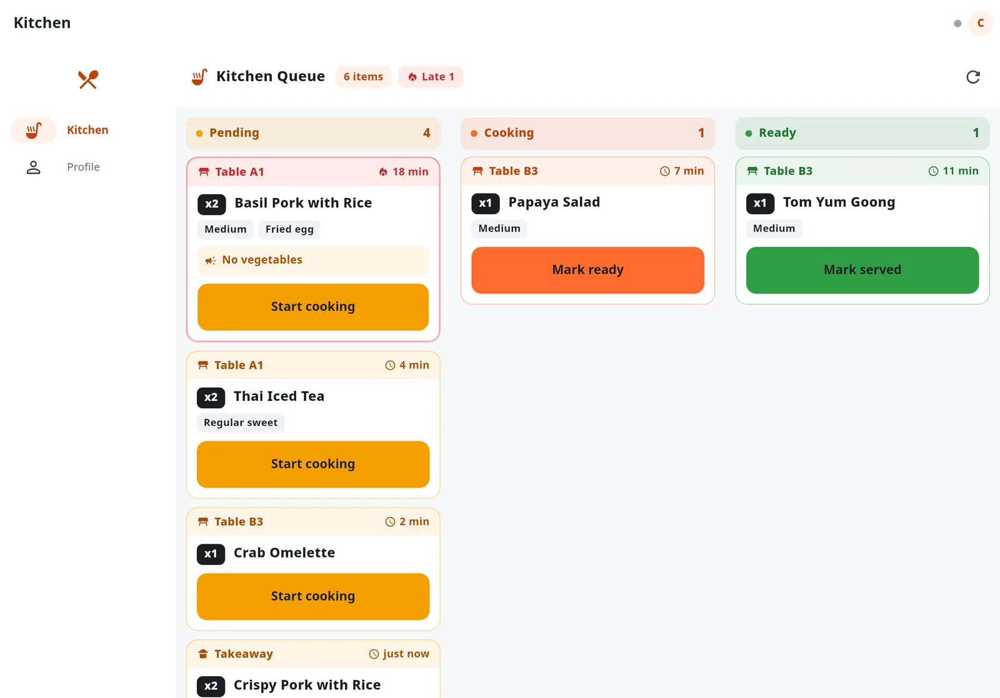
  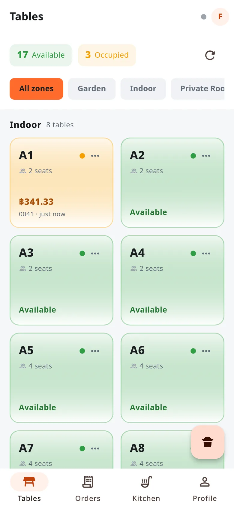
</p>

**The problem** — At peak, staff run paper tickets to the kitchen. Tickets get lost, handwriting is unreadable, and cooks work in the order they pick tickets up, not the order guests have waited — so the longest-waiting table is forgotten.

**In this set**

- **A colour-coded table map** — Free, seated, the running bill on each table, grouped by indoor and window zones.
- **Orders with options and notes** — Medium spicy, fried egg, no vegetables — it reaches the kitchen complete, no shouting.
- **A live three-column kitchen screen** — To cook → cooking → ready. The oldest ticket is on top, and anything past 15 minutes turns red by itself.
- **Dine-in, takeaway and delivery icons** — Takeaway orders get a daily queue number automatically.
- **Undo a wrong tap** — An "Undo" bar for 8 seconds after each status change, no manager needed.

✅ **The longest wait is always on top**  
🧪 **Taste it in the demo:** Open the demo and choose "Waiter" → Tap a free table, pick dishes and send them to the kitchen → Sign out and choose "Kitchen" — the new ticket is in the "to cook" column

### 2. 🙋 The self-order set

<p align="center">
  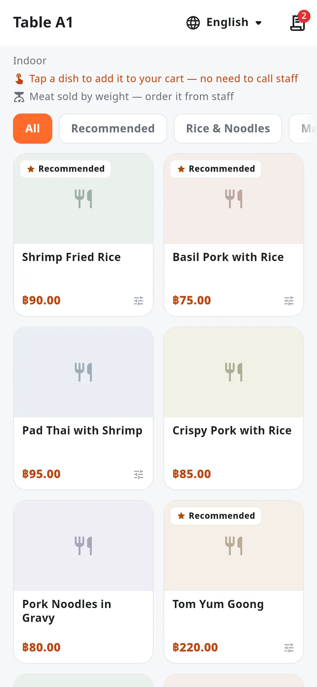
</p>

**The problem** — Big restaurants are short of waiters almost every shift. Guests wait for a menu, for someone to take the order, for someone to add more — and every minute of waiting is a table turning slower.

**In this set**

- **Scan the table QR and order** — Opens in the phone browser. No app to install, no sign-up or login.
- **The same path as a staff order** — Reaches the kitchen screen and deducts ingredient stock exactly the same way. No second system to reconcile.
- **Guests see their table's order** — Add more at any time and see what has been ordered so far.
- **Broken links say so** — A wrong QR or a deactivated table tells the guest it cannot be used. No stray orders reach the kitchen.
- **Managers can replace a QR** — Long-press a table on the map to show its QR, copy the link, or issue a new QR in place of the old one.

✅ **Guests order the moment they sit down**  
🧪 **Taste it in the demo:** Open the demo, choose "Manager" and go to Tables → Long-press any table → "View self-order QR" → "Copy link" → Open the link in a new tab and order as a guest

### 3. 💸 The fast-bill set

<p align="center">
  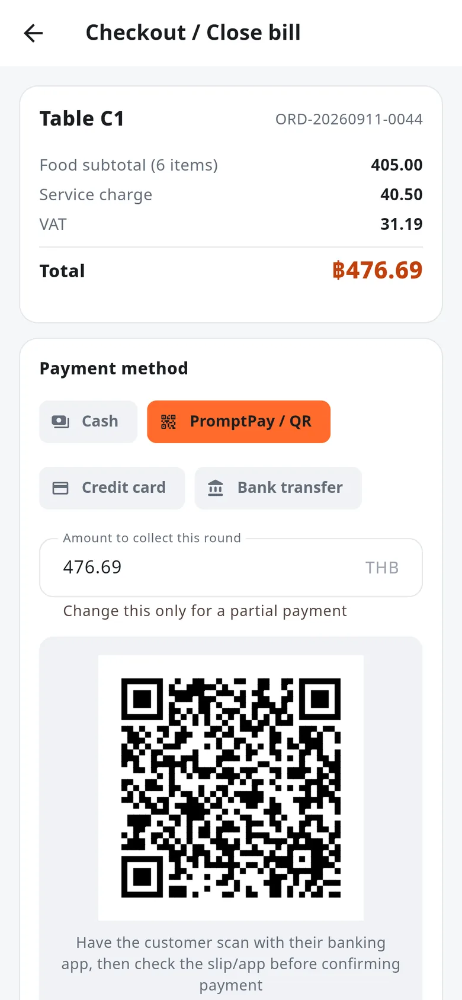
</p>

**The problem** — The cashier types the transfer amount by hand — one wrong digit and someone chases a refund. Friends want to pay their own share, and discounts and service charge get divided at the counter.

**In this set**

- **PromptPay QR to the EMV standard** — The bill total is inside the QR. Guests scan with any banking app, nobody types an amount.
- **Split by payment method or by item** — Cash, QR and card on one bill, with discount, service charge and VAT shared out proportionally.
- **Move and merge tables** — When guests change seats or join tables, their orders follow.
- **Thai receipts on thermal printers** — ESC/POS on 58 mm and 80 mm paper, over the same LAN or Wi-Fi.
- **Abbreviated tax invoices** — Numbered by the Thai Buddhist-era year, voidable while keeping the history.

✅ **The QR matches the bill to the satang**  
🧪 **Taste it in the demo:** Open the demo and choose "Cashier" → Tap a seated table and take payment → Choose "PromptPay / QR" — the QR is built from that bill at once

### 4. 🔒 The honest-drawer set

<p align="center">
  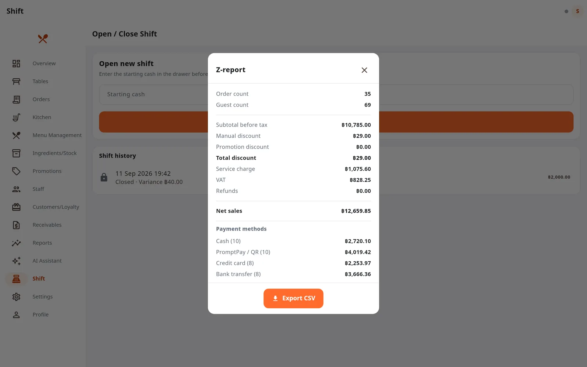
  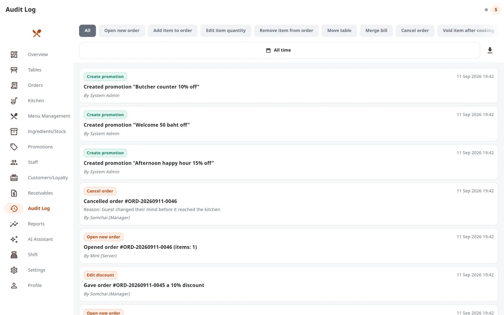
</p>

**The problem** — Bills voided after payment, discounts beyond someone's authority, refunds with no reason. In a big restaurant many hands touch the cash, and when the total is off there is no evidence of what happened.

**In this set**

- **No payment without an open shift** — Starting float on opening; every payment is tied to the open shift.
- **Instant reconciliation at close** — Count the cash; the system works out what should be there and the difference.
- **Z-report per shift and per day** — Sales, tax, manual discounts apart from promotions, payment methods, debt collected. Export CSV for accounting.
- **A history nobody can edit** — Voids, discounts, refunds, price edits and permission changes, with who, when and why — every time.
- **Five roles, enforced on the server** — Not just hidden buttons: a direct request is refused too.

✅ **Even 40 baht short shows at shift close**  
🧪 **Taste it in the demo:** Open the demo, choose "Manager" and open "Shift" → Press "Close shift" and enter a count a little short, then tap that shift in the history to see its Z-report → Sign in again as "Admin" → "Audit Log"

### 5. 📦 The never-run-out set

<p align="center">
  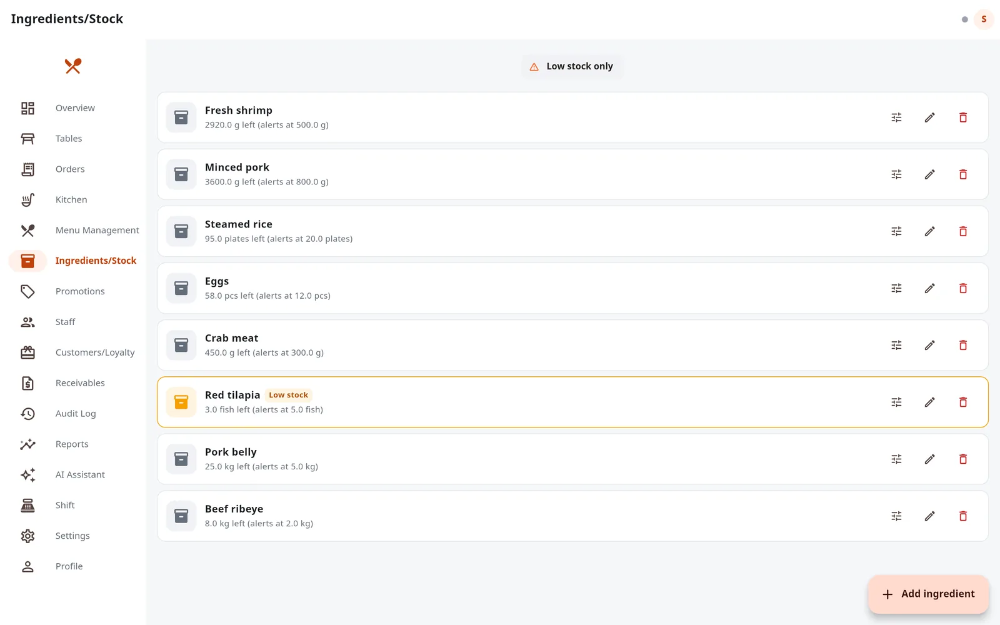
</p>

**The problem** — The fish ran out at 8 pm but the dish is still on sale. Staff take three orders before the kitchen says so — wasted time and disappointed guests.

**In this set**

- **Dishes linked to ingredients** — Stock is deducted when a dish goes to the kitchen and returned on a void or removal, in the units the kitchen counts in.
- **Sold out means off sale** — When an ingredient is short, its dishes stop selling at once and come back after a restock.
- **Low-stock alerts** — A threshold per ingredient, and a filter for only what is running low before you open.
- **Works with QR self-order too** — Guest orders deduct stock along the same path.

✅ **Nobody has to switch dishes off by hand**  
🧪 **Taste it in the demo:** Open the demo, choose "Admin" → "Ingredients/Stock" → Press "Low stock only" — red tilapia is already set below its threshold → Set the tilapia stock to zero and watch the dish that uses it go off sale

### 6. 🥩 The butcher-counter + wholesale set

<p align="center">
  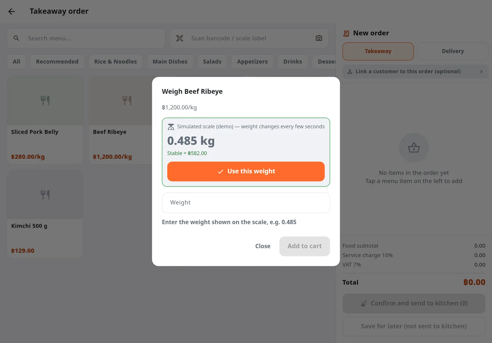
  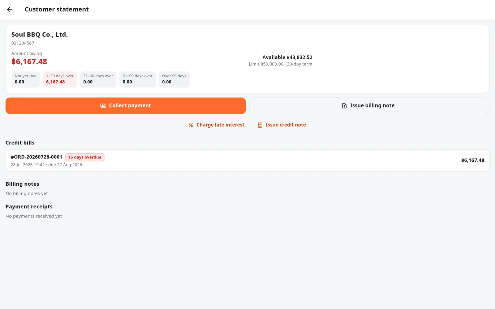
</p>

**The problem** — Weights are written by hand and priced on a calculator. Wholesale debts live in a notebook, and when it is time to chase them nobody knows which bill is how many days overdue.

**In this set**

- **Sell by weight, read live from the scale** — Price per kilo. A scale connected to the shop server sends the weight to the screen, or type it; see the price before it goes in the cart.
- **Scan scale labels and barcodes** — USB or Bluetooth scanners, or the phone camera. EAN-13 labels carry item and weight together; a misread is flagged, never guessed.
- **Credit within a limit and a term** — Over the limit cannot be charged. Aged balances, billing notes, and payments that settle the oldest bill first.
- **Late fees and credit notes as Thai PDFs** — Amounts in words, Buddhist-era dates, and email to the customer directly.
- **Debt collected reconciles with the drawer** — The Z-report shows debt collected apart from the day's sales.

✅ **0.485 kg × ฿1,200 = ฿582, no calculator**  
🧪 **Taste it in the demo:** Open the demo, choose "Cashier" → "New takeaway/delivery" → Fresh Meat & Take-home → Tap Beef Ribeye — the simulated scale sends a weight to the screen → Sign in as "Manager" → "Receivables" → the wholesale customer Soul BBQ Co., Ltd.

> 🏷 The demo's scale label `2000101012504` (sliced pork belly, 1.250 kg × 280 = 350 baht) — type or scan it into the demo's scan box. The landing page draws it as a genuine EAN-13 barcode that scans off the screen.

### 7. 📊 The live-numbers set

<p align="center">
  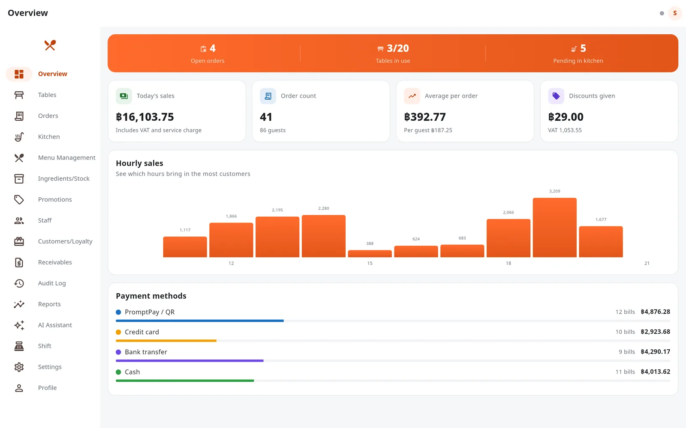
</p>

**The problem** — Owners of big restaurants decide about people and stock every day, but the numbers arrive after closing, or wait on a summary from each branch.

**In this set**

- **A live dashboard** — Sales, bill count, average bill, discounts, an hourly chart and the payment-method split.
- **History reports + CSV** — Best sellers, daily and per-category sales. CSV exports open in Excel with Thai intact.
- **Many branches in one system** — Tables, menus, orders, stock and reports per branch; admins can see all branches together (the web demo has one branch).
- **Ask in a sentence** — The AI assistant answers from the shop's real data — see the next section.

✅ **Know the day while it is happening**  
🧪 **Taste it in the demo:** Open the demo and choose "Admin" — the first screen is the Overview → Go to "Reports", pick a date range and export a CSV

### 8. 🎁 The promotions + loyalty set

<p align="center">
  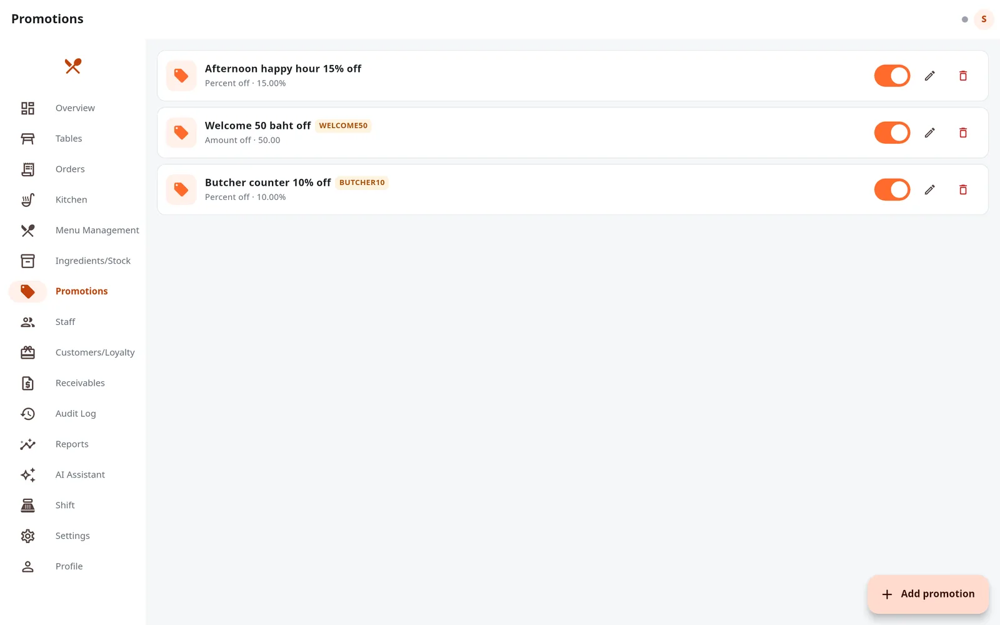
  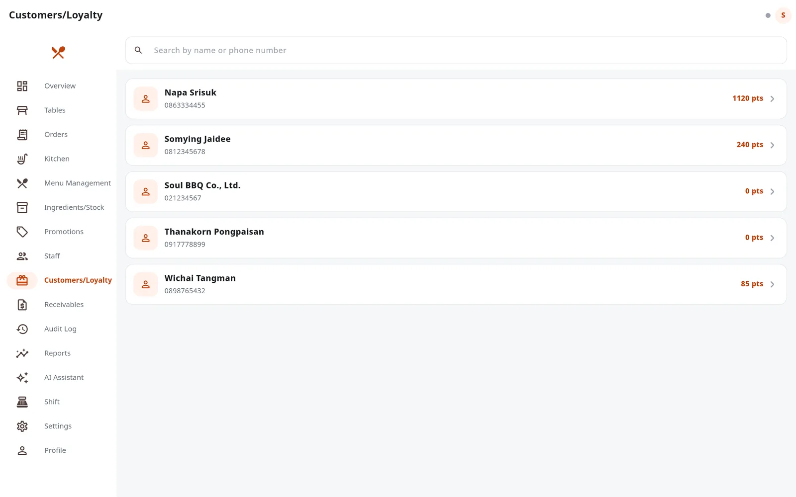
</p>

**The problem** — An afternoon happy hour, a welcome code, buy-one-get-one on some dishes — and when the floor is busy staff forget a discount or apply the wrong one.

**In this set**

- **Conditional promotions** — Days and hours, categories or dishes, a minimum spend, discount codes, buy one get one — matched to qualifying bills automatically.
- **Automatic loyalty points** — Find the guest by name or phone when taking the order; points by spend, redeemed as a discount at payment.
- **Purchase history per guest** — What your regulars order and how often they come.
- **Every promotion change is traced** — Creating, editing and switching off promotions is recorded in the audit log.

✅ **Staff never memorise a promotion**  
🧪 **Taste it in the demo:** Open the demo, choose "Admin" → "Promotions" → add a promotion → Cover the current time, then open a new bill — the discount appears by itself → See each guest's points under "Customers/Loyalty"

### 9. 🌧 The real-floor set

<p align="center">
  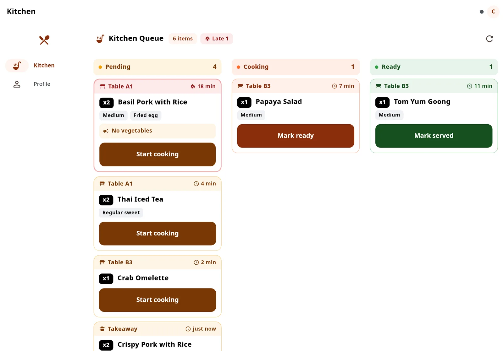
</p>

**The problem** — Screens look good in an air-conditioned office. The real floor has sun on the glass, steam, a hand holding a wok, Wi-Fi dropping mid-service and staff who do not read Thai fluently.

**In this set**

- **High-contrast mode** — Kitchen status labels at 8.77:1 (WCAG AA asks for 4.5:1). Set it on the Profile screen; each device remembers it.
- **Big buttons for busy hands** — Kitchen status buttons are almost twice the size of the phone ones.
- **Keeps taking orders offline** — Held on the device and synced when the network returns; the kitchen screen shows a full-width warning and polls for tickets every 30 seconds.
- **ไทย · English · 한국어** — Each device picks its language, and dish names follow it.
- **Phone, tablet and computer, one system** — Use the devices you already own — no brand-specific hardware.

✅ **Status labels at 8.77:1, readable in sunlight**  
🧪 **Taste it in the demo:** Open the demo with any role and go to "Profile" → Set "Screen contrast" to "High" and try switching language

<!-- stories:end -->

---

## 🎬 Video, documents and landing page

> 🎬 **Demo presentation video (1:55 · 1080p)**
> · [Thai edition](docs/video/PaynEat-POS-Demo-TH.mp4)
> · [English edition](docs/video/PaynEat-POS-Demo-EN.mp4)
>
> Follows the actual usage path from opening the table map to closing the bill, assembled from 14 screenshots
> of the running application ([regeneration instructions](docs/video/README.md))

> 📄 **Full feature walkthrough — 33 screens (30-page PDF)**
> · [Thai edition](docs/PaynEat-POS-Features-TH.pdf) — explains the design and mechanics behind every screen
> · [English edition](docs/PaynEat-POS-Features-EN.pdf) — written for restaurant owners: the business problem each screen addresses
>
> Every image is rendered directly from the application code by the golden tests in
> [`app/tool/screenshots`](app/tool/screenshots), so the images can be regenerated whenever the code changes
> ([regeneration instructions](docs/generator/README.md))

> 🌐 **Landing page — styled as a large restaurant's food-ordering site, built without any JavaScript**
> · [Live on GitHub Pages](https://suruchboss.github.io/PaynEat/index.en.html) (English)
> · [Thai version](https://suruchboss.github.io/PaynEat/)
> · [Korean version](https://suruchboss.github.io/PaynEat/index.ko.html)
> · [Install guide as a web page](https://suruchboss.github.io/PaynEat/install.en.html) — the "Install" item in the top menu (also visible on phones) and every "Install guide" link on the landing page point here rather than to the README on GitHub
> · [Korean README](README.ko.md)
>
> The system is presented as a **problem menu of nine sets**, modelled on a food-ordering site: the visitor selects the
> restaurant's symptom from round category icons → a menu card for each set (ingredients = features, "what you get" =
> the outcome) → a detail section with application screens and a "taste it in the demo" recipe → pricing presented as a
> basket in which every line is ฿0.00. On phones, a floating basket bar links to the demo. All three languages share one
> design, each with screenshots captured in that language, and the butcher-counter set includes the demo's scale label
> `2000101012504` rendered as a valid EAN-13 barcode that can be scanned from the screen — see `docs/DECISIONS.md` #70
> (which replaces the designs of #39/#53)
>
> The HTML is **generated** from [`docs/generator/landing/`](docs/generator/landing/) — `content.py` holds the copy in three
> languages, `install_content.py` the install guide, and `build_landing.py` the template. Running
> `python3 docs/generator/landing/build_landing.py` writes `docs/landing/index*.html`, `docs/landing/install*.html` and the [problem menu](#-the-problem-menu) section of all three READMEs. Images are stored in
> `docs/landing/img/story/` (39 WebP files, about 1.5 MB; recapture them with `app/tool/screenshots/story_test.dart`, then compress them with
> `publish_story.py`). The AI assistant GIF is stored in `docs/ai-demo/`, which `deploy-pages.yml` copies into the site.
>
> For search engines and AI assistants, the same script writes `docs/landing/sitemap.xml` (9 pages, with their other-language
> links and `x-default`) and adds schema.org structured data (`SoftwareApplication` + `WebSite` + the author) to the three home
> pages — only what the page actually shows, no review ratings (see `docs/DECISIONS.md` #91)

> 🤖 **Live demo of the AI ask-your-data assistant (real Claude API call, not a mock)**
>
> 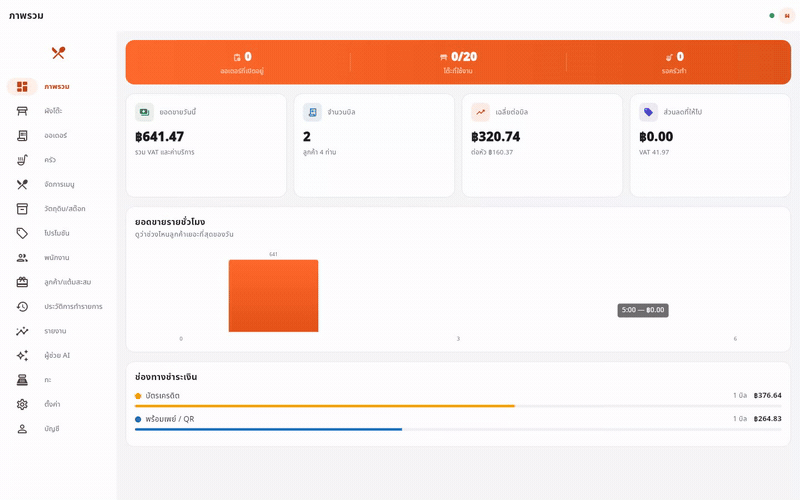<br>
> <sub>Full-resolution still: <a href="docs/ai-demo/ai-assistant-live.png">ai-assistant-live.png</a></sub>
>
> Recorded from a live session: log in as admin → open the "AI Assistant" tab → type a question in
> Thai → Claude calls a tool that retrieves sales data directly from the database (no scripted
> response) → the answer includes a chart and "sources" chips citing the exact endpoint that was called.
> ⚠️ **Unlike the gallery above**, this asset is **not** produced by a frozen-clock golden test, so
> it is not byte-for-byte reproducible (it requires a real `ANTHROPIC_API_KEY` and the seeded sample
> data, and the model's wording can vary between runs). The re-capture procedure, and the reason the asset is
> kept separate from the golden-test set, are documented in
> [`docs/DECISIONS.md` #33](docs/DECISIONS.md)

---

## 📋 Table of contents

- [The problem menu](#-the-problem-menu)
- [Video, documents and landing page](#-video-documents-and-landing-page)
- [Project goals](#-project-goals)
- [Installation and getting started](#-installation-and-getting-started)
- [Features](#-features)
- [Tech stack](#-tech-stack)
- [Architecture](#-architecture)
- [Project structure](#-project-structure)
- [Bill calculation](#-bill-calculation)
- [Realtime](#-realtime)
- [API](#-api)
- [Testing](#-testing)
- [Roadmap](#-roadmap)

---

## 🎯 Project goals

The project is intended to go beyond a to-do-list-style sample application and to model a system with real
business rules.

A restaurant is well suited to this purpose because it involves more edge cases than are apparent at first,
including:

- When an order can still be edited (once the kitchen starts cooking an item, editing is locked and a manager
  must void the item instead)
- Whether VAT is calculated before or after the service charge, and how discounts are applied
- Whether a single table may have two open bills at the same time
- Supporting split payments, such as half by QR and half in cash
- Keeping the kitchen and the waiters, who use different devices, in the same state at all times
- Preventing monetary amounts from drifting because of floating-point rounding errors

The project therefore prioritizes **correct business logic and a maintainable structure** over visual polish.

---

## 🚀 Installation and getting started

> Setup takes about 5 minutes. For common problems, see [Troubleshooting](#-troubleshooting) at the end of this section.
>
> **For non-technical users:** on Windows with Docker Desktop, use **Option D** below (a single command — no code download and no build),
> or open the [live demo](https://suruchboss.github.io/PaynEat/app/).
>
> 📘 **Web-based install guide:** the [install guide](https://suruchboss.github.io/PaynEat/install.en.html) describes all four installation methods step by step,
> with copy buttons for every command, the demo accounts, a go-live checklist, and troubleshooting. It is readable on a phone and does not
> require GitHub (also available in [Thai](https://suruchboss.github.io/PaynEat/install.html) and [Korean](https://suruchboss.github.io/PaynEat/install.ko.html)).

### Step 0 — Get the code

```bash
git clone https://github.com/SuruchBoss/PaynEat.git
cd PaynEat
```

---

### 🅰️ Option A — Run locally (recommended)

**Requirements**

| Tool | Version | Check with |
|---|---|---|
| [Node.js](https://nodejs.org) | 20+ (22 recommended) | `node -v` |
| [Flutter SDK](https://docs.flutter.dev/get-started/install) | 3.35+ | `flutter --version` |

**Terminal 1 — Backend**

```bash
cd backend
npm install
cp .env.example .env     # first time only (Windows: copy .env.example .env)
npm run dev
```

`.env` provides a `JWT_SECRET` for local use. The backend intentionally has no built-in default and refuses to
start without one (see `SECURITY.md`).
A line containing `PaynEat POS API listening on http://localhost:3000` indicates that the backend has started (the
database and sample data are created automatically; no further configuration is required). Logs are written as JSON,
one object per line, in accordance with the PaynEat ecosystem telemetry contract (ticket 24); each request from the app
produces a line similar to the following, including its request ID:

```
{"severity":"INFO","time":"2026-09-25T10:15:30.123Z","message":"PaynEat POS API listening on http://localhost:3000 (REST /api/v1, docs /docs, health /health, realtime socket.io)","labels":{"app":"payneat-pos-api","event":"app.log","correlation_id":"process-…"}}
```

**Terminal 2 — App** (open a new terminal window and leave the first one running)

```bash
cd app
flutter pub get
flutter run -d chrome        # runs on web — fastest option
```

To run the app on a phone or tablet:

```bash
flutter devices              # list connected devices
flutter run                  # pick the device it finds
```

> 📱 **Android emulator**: the app automatically connects to `10.0.2.2:3000` (the host machine's loopback address);
> no additional configuration is required
> 📱 **Physical phone on the same Wi-Fi network**: pass the computer's IP address, e.g.
> `flutter run --dart-define=API_BASE_URL=http://192.168.1.15:3000`
> (find the IP address with `ipconfig` on Windows / `ifconfig | grep inet` on macOS-Linux)

---

### 🅱️ Option B — Docker (no Node or Flutter install needed)

Suitable for evaluating the complete system without installing a development toolchain.

**Requirement:** [Docker Desktop](https://www.docker.com/products/docker-desktop/)

First set the server secret (`JWT_SECRET`) in a `.env` file next to `docker-compose.yml`. `docker-compose.yml` has no
fallback value, so `docker compose` stops and explains how to set it if it is missing. Then start the system:

```bash
echo "JWT_SECRET=$(openssl rand -hex 32)" > .env   # Windows PowerShell: see the command below
docker compose up --build
```

In Windows PowerShell, create the `.env` file with `("JWT_SECRET=" + [guid]::NewGuid().ToString("N") + [guid]::NewGuid().ToString("N")) | Out-File -Encoding ascii .env`.

The first run takes about 5–10 minutes because it downloads the Flutter SDK to build the web app. Subsequent runs
are considerably faster.

When both `payneat-web` and `payneat-api` have started, open the following in a browser:

| URL | Contents |
|---|---|
| **http://localhost:8080** | 👈 **Start here** — the app's login page |
| http://localhost:3000/docs | Interactive API docs (Swagger UI) |
| http://localhost:3000/health | Health check for the API |

**Live scale and document e-mail in Docker (tour steps 27–28).** Both features are disabled by default. To enable
them, add the following two lines to the `.env` file **next to `docker-compose.yml`** (not `backend/.env`), then run
`docker compose up --build` again:

```bash
SCALE_DRIVER=simulator
MAIL_TRANSPORT=json
```

This enables a simulated scale that begins reporting immediately; e-mails are fully composed but never sent. Do not
use `simulator` in a production shop, because the weights it reports are not real.

Stop the system with `Ctrl+C`, then run `docker compose down`
(use `docker compose down -v` to also delete all stored data).

---

### 🆑 Option C — Just look at the app, no backend needed

To run the Flutter app without a server:

```bash
cd app
flutter pub get
flutter run -d chrome --dart-define=DEMO_MODE=true
```

The app uses local mock data instead, and every feature is available.
Because there is no server, realtime updates across devices are not available, and data is reset when the page is refreshed.

> 💡 This mode is selected at a **single point** (`_bindDataSources()`) without changes to any screen,
> controller, or use case — a concrete benefit of the Clean Architecture layering.

**📱 From Google Play (closed testing)** — the same demo-mode build is available as a signed Android app, which CI builds
for every `vX.Y.Z` tag (see [`docs/store/README.md`](docs/store/README.md), in Thai). It is not yet public and **cannot
connect to a shop server** until ticket 29b adds server-address entry to the app. For production use today, run
option A/B/D and open the app in the device's browser, or build the app with `--dart-define=API_BASE_URL=...`.
Restaurants interested in joining the test can request access via [GitHub Issues](https://github.com/SuruchBoss/PaynEat/issues).

---

### 🅳 Option D — Windows + Docker Desktop in one line (no code on your machine)

Intended for non-technical users who want to run the complete system (a server, realtime updates across windows, the
simulated scale, PDFs) on their own computer without git, Node, or Flutter, and without building anything. GitHub Actions
builds the images whenever `main` changes ([`demo-images.yml`](.github/workflows/demo-images.yml)) and publishes them to the [`demo` release](https://github.com/SuruchBoss/PaynEat/releases/tag/demo).

1. Open **Docker Desktop** and wait until the bottom-left corner shows **Engine running**
2. Open **PowerShell** (press the Windows key, type `PowerShell`, and press Enter), paste the following line, and press Enter:

   ```powershell
   [Net.ServicePointManager]::SecurityProtocol = 3072; iex ((New-Object Net.WebClient).DownloadString('https://github.com/SuruchBoss/PaynEat/releases/download/demo/install-demo.ps1'))
   ```

3. Wait about 3–5 minutes (the first download is about 200 MB). The browser opens **http://localhost:8080**; log in with `admin` / `admin123`

This installation is configured for demonstrations: the simulated scale runs immediately, e-mails are fully composed but
never sent, and after a reboot PaynEat restarts automatically when Docker Desktop starts. The `PaynEat-Demo` folder in the
user's home folder contains double-click **Start / Stop / Reset PaynEat data** files (Reset deletes every test bill and
restores the sample data). Running the same line again updates to the latest version and keeps existing data. The script
is available for review at [`deploy/demo/install-demo.ps1`](deploy/demo/install-demo.ps1).

> ⚠️ Demo settings only (demo accounts, simulated scale, a published `JWT_SECRET`). A production shop should use Option A/B
> and follow [SECURITY.md](SECURITY.md). The images are x86-64 (a typical Windows PC).

---

### 👤 Login accounts

In demo mode, the login page provides a demo-account chip for every role; **a single tap signs in** without typing credentials.

| Role | username | password | Access |
|---|---|---|---|
| Admin | `admin` | `admin123` | Everything (dashboard, menu management, staff, reports, settings) |
| Manager | `manager` | `manager123` | Same as admin, but manages only waiter, kitchen and cashier accounts in their own branches (manager/admin accounts and deleting accounts are admin-only) |
| Waiter | `waiter1` | `waiter123` | Table map, orders, kitchen display |
| Kitchen | `kitchen` | `kitchen123` | Kitchen display only |
| Cashier | `cashier` | `cashier123` | Table map, orders, reports |
| Waiter (2 branches) | `waiter2` | `waiter123` | Same as `waiter1`, with access to both the Sukhumvit and Thonglor branches. There is no quick-sign-in chip on the login page; enter the credentials manually to try the branch picker (real backend only; see the tour below) |

> ⚠️ **These accounts are for demonstration purposes only.** Before deploying this backend for production use (beyond
> running it locally), change these passwords or disable `AUTO_SEED`. See
> [`SECURITY.md`](SECURITY.md) for the full pre-deployment checklist.


> 🧑‍🍳 **Unguided user acceptance testing (UAT)** — the login page and the QR menu have a **globe** button in the top
> corner that switches between ไทย / English / 한국어 before sign-in (the first launch follows the device language). In
> demo mode (Option C / the demo link), **data is stored separately on each device**, so an order placed on a waiter's
> phone does not appear on a kitchen tablet. To test several devices together, run Option B with
> `API_BASE_URL=http://<your computer's IP>:3000` in a `.env` next to `docker-compose.yml` and open
> `http://<your computer's IP>:8080` on every device (step-by-step instructions in [the install guide, way 3](https://suruchboss.github.io/PaynEat/install.en.html#docker)).
> Option D and the default Option B configuration point the app at `localhost:3000`, so they are reachable only from that
> computer (alternatively, test every role on one device by switching accounts). The adjustments made for UAT are
> described in `docs/DECISIONS.md` #62

---

### 🗺 5-minute tour — a guided walkthrough of the full workflow

> **Tip:** open **two browser windows side by side** (one as the waiter and one as the kitchen, using an
> incognito window for the second) to observe orders moving between screens in real time.
> *(Applies to Options A, B, and D. Option C has no server and therefore no realtime updates.)*

1. **Log in as a waiter** (`waiter1`) → the table map is displayed, grouped by zone; green indicates an available table
2. **Tap table A1** → the order-taking screen opens
3. **Tap "Stir-fried Pork with Basil"** → a sheet appears for selecting the spice level and extras; add a
   "Fried Egg (+15)" and enter a note for the kitchen
4. **Tap the "Link a customer to this order (optional)" bar above the cart** → search by phone number;
   if no match is found, tap **"Add new customer"**, enter a name and phone number, then tap **"Save and select"** →
   the bar immediately displays the customer's name
5. **Review the cart on the right** → the subtotal, 10% Service Charge, and 7% VAT are calculated immediately
6. **Tap "Confirm & Send to Kitchen"** → the order detail page opens with a bill number
7. **Switch to the kitchen window** (`kitchen`) → the ticket appears automatically, without a refresh.
   Tap **"Start Cooking" → "Ready"**; the ticket moves across the columns
8. **Return to the waiter window** → the status has already been updated; tap **"Served"**
9. **Tap "Checkout / Close Bill"** → because a customer was linked in step 4, a **"Loyalty
   points"** box shows the customer's points balance (a new customer has no points to redeem yet). To test a split
   payment, select **"QR"** and pay 100 THB first → the system displays a **real, scannable PromptPay QR code**
   bound to the 100 THB (changing the amount regenerates the QR); then pay the remainder in cash (the system
   tracks the remaining balance and calculates change). Once the bill is fully paid, the customer automatically
   earns points based on the purchase amount (25 THB per point by default)
10. **The receipt page opens** → tap **"Request tax invoice"** and choose abbreviated (issued immediately) or full
    (enter the customer's name and address) → a document with a continuous running number (e.g. `INV69-000001`)
    is issued immediately
11. **Return to the table map** → table A1 is green (available) again
12. **Tap "New takeaway/delivery"** (the floating button in the bottom-right corner of the table map) → the
    order-taking screen opens with no table attached (the header reads "Takeaway order") → add any menu
    item and tap **"Confirm & Send to Kitchen"** → the message **"Order ... opened — queue number N"** is
    displayed, and the same number appears as a 🎫 badge on the order detail page (the queue number uses a
    separate daily counter for takeaway orders only; delivery riders reference the order by its bill number
    instead)
13. **Switch back to the kitchen window** → the new ticket shows a 🥡 "takeaway" icon instead of a table
    icon, which distinguishes it from dine-in orders without opening its details
14. **Log out and log in as `admin`** → open **Dashboard**; the sale just completed is already included in the
    report, with the hourly chart and payment-method breakdown (best sellers are on the **Reports** page)
15. **Open the Customers/Loyalty page** (the 🎁 icon in the left navigation, visible to `admin` and
    `manager`) → the customer created in step 4 is listed with the points just earned; tap the name to view
    the purchase history, which includes the order just closed
16. **Open the Ingredients/Stock page** (the 📦 icon in the left navigation) → "ปลาทับทิม" (tilapia; ingredient
    names are not translated) is already highlighted with a low-stock alert from the seed data
17. **Open the Audit Log page** (the 🕘 icon in the left navigation, visible to `admin` only, not `manager`) →
    filter by action type with the chips at the top. The log is empty at this point; first void the tax invoice
    issued in step 10 (tap **"Void this invoice"** on that receipt page), then return here to see a new entry
    recording who performed the action, when, and the reason entered. Use the **"Date range"** button to filter
    to today, then tap the **download 📥** icon to export a CSV file (opens in the browser; web only — see the
    💰 Cashier/🖥️ Admin sections)
18. **Open the AI Assistant page** (the ✨ icon in the left navigation, visible to `admin` and `manager`) →
    type or tap an example question such as **"What are today's sales?"**. The assistant always calls a tool to
    retrieve real data before answering and never estimates or invents a number; the **"Sources"** chip under
    each answer names the tool used. Questions about plottable figures (such as best-selling items) also return
    a bar chart. `ANTHROPIC_API_KEY` must be set for the assistant to answer; without it, a clear "not enabled"
    message is shown instead of an error (see `docs/tickets/15-ai-ask-your-data.md`, `docs/DECISIONS.md` #33)
19. **Log out and log in as `cashier`** → open the **"Shift"** menu (the cashier icon in the left
    navigation) → enter a starting cash amount and tap **"Open shift"** → take an order and collect payment
    for a bill (an abbreviated version of steps 2-9) → return to the **"Shift"** page and tap
    **"Close shift"**, entering the cash actually counted → the variance against the expected amount is
    displayed immediately, together with a **"View Z-report"** button. The Z-report shows a full breakdown of
    the shift's sales/tax/discounts (manual and promotion, separately)/payment methods; tap **"Export
    CSV"** to download it. The Z-report of any past shift under **"Shift history"** can be viewed in the same
    way (not for an open shift, because its cash reconciliation is computed only at close; see
    `docs/tickets/12-report-export.md`)
20. **Open the "Reports" menu** (available to `cashier` and above) → select a date range, then tap the
    **download 📥** icon at the top right of the bar → export **"Sales summary"**, **"Top items"**, or
    **"Sales by day"** → a CSV file for the selected date range is downloaded immediately (browser only,
    as with the audit-log export in step 17)
21. **(Option A/B/D with a real backend only — Demo Mode has a single branch, so skip this step)**
    Log out and log in as `waiter2`/`waiter123` (enter the credentials manually; there is no quick-sign-in chip) →
    the **"Select branch"** page opens directly because this account has access to 2 branches → select
    **"Thonglor branch"** → the table map shows an entirely different set of table names/menu items
    (a seafood/grill theme), with no overlap with the Sukhumvit branch used throughout the tour
22. **Log out and log in as `admin`** → open the **Profile** page (the person icon in the bottom
    bar/rail) → on the **"Current branch"** card, tap **"Switch branch"** → select **"All branches"** (available
    to `admin` only) → return to **Dashboard/Reports**; sales totals are combined across both branches
    immediately, with no need to switch branches and add the figures manually
23. **Log in as `waiter1` (or `manager`)** → on the table map, tap the **⋯** button on table A1's card (or long-press the card) → select
    **"View self-order QR"** → a real, scannable QR code for the table is displayed; tap **"Copy link"**
    and open the link in a new tab/window (simulating a customer scanning it with a personal phone) → table A1's
    menu opens directly, **with no login** — add an item to the cart and tap **"Send to
    Kitchen"** → in the waiter/kitchen window, the item appears in table A1's existing order immediately,
    exactly as if a staff member had entered it (stock deduction and promotion calculation are also applied
    automatically). Repeat on an **empty table** with no open order: the customer's first order also reaches
    the kitchen screen immediately, rather than remaining as a draft for staff to send (#46) — see
    `docs/tickets/17-qr-self-order.md`

24. **Switch the application language** → open the **Profile** page (the person icon in the bottom
    bar/rail) → under **Language**, select **ไทย / English / 한국어** → every screen changes
    immediately without a restart, and the choice is stored per device. Menu and zone names remain
    exactly as entered by the restaurant (the Korean interface shows the Latin menu names rather than Thai
    script), while names already printed on kitchen tickets and past receipts do not change, because they
    were recorded when the order was placed (see `docs/DECISIONS.md` #39)

25. **Butcher counter: weigh an item and scan a scale label** (available in every option, including Demo Mode) →
    log in as `cashier` → tap **"New takeaway/delivery"** → select the **"Fresh Meat & Take-home"** category →
    tap **"Beef Ribeye"** (price **฿1,200.00/kg**) → a weighing dialog opens; enter the weight shown on the
    scale, e.g. `0.485` → the dialog previews **0.485 kg = ฿582.00** before the item is added to the cart. Next,
    use the **"Scan barcode / scale label"** field next to the menu search (a USB/Bluetooth scanner types
    directly into it; on wide screens it is focused automatically, on phones it is labelled "Scan", and it appears only when the menu contains barcoded or scale-coded items): entering `2000101012504` and pressing Enter adds a
    scale label for **Sliced Pork Belly 1.250 kg** to the cart without any weight entry, and
    `8850999320014` adds one bottle of Bulgogi Marinade. Each bag remains on its own line (never merged, even at
    the same weight), and the weight chip can be tapped to re-weigh before sending. After payment, the
    **Ingredients/Stock** page shows the ribeye stock reduced by exactly 0.485 kg (see
    `docs/tickets/18-sell-by-weight.md`, `19-barcode-scale.md`)
26. **Sell on credit to a trade customer → billing note → collect payment** → create another bill as in
    step 25, but before confirming, tap the customer bar, search for `021234567`, and select **"Soul BBQ Co.,
    Ltd."** (50,000 limit, 30-day term; the Thai and Korean demos show the name as entered in that language) → tap **"Collect payment / close bill"** → a new **"On credit"**
    method appears (only for customers with a credit limit, and only for non-waiter users), showing the
    remaining credit and the due date → complete the payment: the bill closes without any money received → open the
    **Receivables** menu (the invoice icon); the company is listed with its outstanding balance → open it →
    **Issue billing note** produces document `BN69-000001` with both parties' tax IDs → **Collect
    payment** in cash → receipt `RC69-000001`, applied to the oldest bill first → close the shift (step
    19): the cash paid against the debt is automatically included in the drawer's expected total, and the
    Z-report lists it under a separate **"Debt collected"** heading, apart from sales (see
    `docs/tickets/20-b2b-credit.md`, `docs/DECISIONS.md` #50)
27. **Live reading from a cabled scale and scanning with the phone camera** → repeat step 25 and tap **"Beef
    Ribeye"** → above the weight field, a **"Scale (live)"** panel follows the scale reading. While it shows
    **"Weighing… wait until it settles"**, the **"Use this weight"** button is disabled; once the reading
    settles, it shows **"Stable = ฿582.00"**, and a single tap adds the item to the cart without typing. Demo
    Mode includes a **simulated scale** that cycles place → wobble → settle (0.485 / 1.250 / 0.730 kg) for
    immediate testing; a production shop sets `SCALE_DRIVER=tcp` or `serial` in `backend/.env` (to test
    without a scale, use `SCALE_DRIVER=simulator`; for Option B, place it in a `.env` next to `docker-compose.yml`), and every tablet/phone receives the same weight in real time.
    Then, on a phone or on the web with a camera, tap the **camera icon** at the end of the scan field next to
    the menu search → frame the sauce bottle's barcode or a scale label (a torch button is available) →
    the code is handled exactly as scanner input (see `docs/tickets/22-live-scale-camera-scan.md`,
    `docs/DECISIONS.md` #54)
28. **Late-payment interest → credit note → e-mail the PDF** → log in as `manager` → **Receivables** →
    open **"Soul BBQ Co., Ltd."** (Demo Mode seeds a credit sale of meat from 45 days ago, now 15 days
    overdue, and the shop's late interest is set to 12% a year with 7 grace days under **Settings → Credit
    customers**) → tap **"Charge late interest"** → the number of days and the principal are shown per bill
    before **"Issue interest notice"** is tapped → document `LF69-000001` is issued, and that bill's balance
    increases immediately → tap **"Issue credit note"**, select the bill, and enter 107 with the reason "fat trim
    over spec" → credit note `CN69-000001` shows the **original value / corrected value / difference**, with the
    VAT on the difference stated separately as required by the Revenue Department, and the balance decreases by
    107 → open any billing note or credit note and tap **"Send e-mail"**: the customer's address is pre-filled
    (configured under the customer's **Edit credit** → **Billing e-mail**); add a message and send → the send
    history appears under the document immediately. Demo Mode simulates the send; the web app connected to a
    real backend also offers **"Download PDF"**, an A4 Thai document with the amount in words (บาทถ้วน) and a
    Buddhist-era date, and sends real e-mail once `SMTP_HOST` is set in `backend/.env` (with a real
    backend, set the interest rate in Settings first; interest accrues only after a bill passes its due date
    plus the grace days) (see `docs/tickets/21-late-fees-credit-notes.md`,
    `23-document-pdf-email.md`, `docs/DECISIONS.md` #55–#57)
29. **Trace a request ID from an error message to the backend log** (with a real backend, Options A/B/D —
    Demo Mode has no backend and therefore no ID) → log in as `admin` → **Staff** → add a new staff member with
    the username `cashier` (already in use) → the rejection message ends with a **"Request ID: pos-…"** line →
    search the backend log for that ID (Option A: terminal 1 · Options B/D: `docker logs payneat-api`) to
    locate the request's JSON line: `severity` is `WARNING`, and the path is recorded but the name and password
    entered are not. When a shop reports a problem with this ID, the system operator can locate that exact
    request → open `http://localhost:3000/metrics` → 404, because the Prometheus metrics are served on port 9464,
    which docker compose never exposes outside the machine (see `docs/tickets/24-telemetry-contract.md`,
    `docs/DECISIONS.md` #68)

**Business rules you can try**

- Log in as `admin` → **Staff** → the signed-in user's own row has no ⋮ menu, only a **"You"** badge (users cannot
  demote, deactivate, or delete their own account; a direct API call returns 400). Other rows allow role changes and
  deactivation, but only after a confirmation dialog that describes the effect. Deleting `cashier` (which has already
  opened a shift) is refused with a request to deactivate the account instead, so financial history still shows who
  performed each action (a direct API call returns 409)
- Log in as `manager` → **Staff** → the list holds only waiter, kitchen and cashier accounts that share a branch with the
  manager (no admin or manager accounts) → the ⋮ menu offers only those three roles and no delete, and **Add staff** offers
  only those three roles too. Resetting the password of, deactivating or changing the role of a manager or admin is for
  `admin` only (a direct API call returns 403, and staff who only have other branches return 404) (see `docs/DECISIONS.md` #92)
- Open an order → ⋮ → **Cancel order** → the confirm button remains disabled until a reason is entered. Add items
  to the cart and press back → a confirmation is required before the items are discarded. **Merge bills** → after
  the other order is selected, one further confirmation is required (a merge cannot be undone)
- At checkout, reduce "Cash received" below the bill total → the pay button is disabled **and states the remaining
  shortfall** (it also explains when no shift is open). For `waiter1`, the order ⋮ menu has no "Discount" option
  (cashier and above only)
- Open a second order at the same table → the request is rejected, with a suggestion to add items to the existing bill instead
- Change an item's quantity after the kitchen taps "Start Cooking" → not permitted; only a manager can cancel
  the item
- Take full payment for a bill, then open it from the history and try to cancel an item → refused with "This order is
  closed" for every role, managers included, and sales and stock stay unchanged. On a bill **split by item** with some items
  paid, a paid item cannot be cancelled until it is refunded, while an unpaid item still can (see `docs/DECISIONS.md` #85)
- Log in as `kitchen` → tap **Start cooking** then **Mark ready** on an item, then tap **Undo** step by step until the item is
  back in the pending column → log in as `waiter1` and open that order → the item has **no remove button** even though it is
  pending (a direct API cancel returns 403) because the system remembers how far the kitchen got → log in as `manager` → the
  item can be cancelled, and the audit log records "kitchen had reached: ready" (see `docs/DECISIONS.md` #86)
- Log in as `manager` → open an unpaid bill → Checkout, take **50 baht** in cash (a partial payment) → come back to the same bill's
  checkout and tap **Refund** (↶) next to the 50 baht payment, refunding all 50 → "Refunded 50.00" appears under it and **the amount
  due goes back to the full bill**, not the full bill − 50. A bill closes only once the net amount (paid − refunded) is collected; on a
  bill **split by item**, fully refunding an item's payment puts the item back to unpaid so it can be paid again or cancelled
  (see `docs/DECISIONS.md` #87)
- Log in as `admin` → **Promotions**, create a 50% off code → open a bill with **green curry chicken (160)** + **steamed tilapia
  with lime (320)** and apply the code (282.48) → **Split per person**, pick the green curry → the split screen shows the
  **discount shared out −80.00**, SC 8.00, VAT 6.16, **94.16** due, and the second person pays exactly **188.32**. A store set to
  "prices include VAT" shows the VAT line as "included in prices" and never adds it again (see `docs/DECISIONS.md` #88)
- Log in as `waiter1` → no "Manage Staff" menu is shown (and a direct API call returns 403)
- Log in as `admin` → **Menu Management** → switch a menu item off, then return to order taking → the item shows
  "Sold Out" and cannot be selected
- Log in as `admin` → **Ingredients/Stock** → adjust "ปลาทับทิม" → select "Deduct" and enter 3 (its exact
  starting stock) → return to order taking; "Steamed Fish with Lime" now shows "Sold Out" **automatically**,
  without a manual toggle (automatic stock deduction — see `docs/DECISIONS.md` #15). Select "Receive"
  to restock the ingredient, and the item is re-enabled in the same way
- Log in as `admin` → **Settings** → the **Connections** card → the PaynEat ERP section shows **"Standalone"**. Select **Connect** with a
  credential that does not start with `pnepos_` → the error is reported immediately, before the ERP is called (requires a real backend, option A/B/D;
  demo mode is always "Standalone"). With [PaynEat ERP](https://github.com/SuruchBoss/PaynEat-ERP) running: register a POS in the
  ERP for branch `SUKHUMVIT` and paste its credential → the ERP's items appear read-only on **Ingredients/Stock**, the add/edit/delete
  buttons are removed, and branch `THONGLOR` is flagged as not assigned to this POS by the ERP → assign this POS another branch that
  does not yet exist on this device (for example `SILOM`) and select **"Pull now"** → the branch appears in the "Branches the ERP assigns to this POS that are
  not on this device" box with a **"Create here"** button → select it and confirm → the latest data is pulled first, then the branch
  is created with the ERP's code and Thai name (and recorded in the audit log). If the ERP has just moved an existing branch to that code, the
  existing branch takes the code instead and the button reports that a branch with this code already exists, so no duplicate is created
  (see `docs/DECISIONS.md` #80)
- In the same PaynEat ERP section, enter the address `http://erp.example.com` with a credential that starts with `pnepos_` and select
  **Connect** → it is refused with the reason that the address must start with `https://`, so the credential is never sent unencrypted,
  and no request reaches the ERP. `http://` works only for an ERP on the same machine (`localhost`, `127.x`, `[::1]`), or when the server's
  administrator sets `ERP_ALLOW_INSECURE_HTTP=true` for a closed network, in which case Settings shows a permanent red warning
  (see `docs/DECISIONS.md` #82)
- Request a second tax invoice for the same bill → rejected (only 1 active invoice per bill). After logging in as
  `manager` and tapping **"Void this invoice"** on the same receipt page, a new invoice can be issued for that bill
  with a new running number (see `docs/DECISIONS.md` #19)
- Every action with front-of-house fraud risk (cancelling an order, voiding an item after it has been
  sent to the kitchen, editing a discount, deactivating/deleting/changing the role of a staff account,
  editing VAT/service charge, a refund, voiding a tax invoice) is recorded on the **Audit Log**
  page (`admin` only) with the user, time, and reason. Perform any of these actions, then review that page
  (see step 17 of the tour and `docs/DECISIONS.md` #21)
- Log in as `admin` → switch the language to **한국어** (globe button) → **변경 이력** → every entry is displayed as a
  Korean sentence, e.g. "주문 #ORD-… 취소", rather than Thai (the Thai interface continues to show the recorded sentence,
  which serves as the evidence) → open **고객/적립** and add a customer with any Korean name, e.g. "첫 손님" → the name
  renders completely, with no empty boxes (see `docs/DECISIONS.md` #74)
- Redeem more loyalty points than the customer holds, or a points value greater than the amount due in the
  current round → both are rejected outright (never silently capped), and if the order is not linked to a
  customer, the redeem control is not shown. Pay part of a linked order's bill with points to see how the
  "amount applied to the order" differs from the "amount actually collected" (see `docs/DECISIONS.md` #22)
- Log in as `manager` → **Settings** → type `0.004` in **"Baht spent per 1 point earned"** and save → the app says "Baht spent per
  point must be at least 0.01" straight away and sends nothing (the same for `0` in "Value of 1 point when redeemed"; calling the API
  directly gets a 400 with the same message in the user's language) — `0.5` saves and shows as 0.5. A store that saved a rate below
  0.01 baht before the update still sells normally but earns 0 points, and points can't be redeemed until it's set again; customer
  balances that were already broken are rebuilt from purchase history when the database is updated, with a **"Points balance
  repair"** entry in the activity history (see `docs/DECISIONS.md` #89)
- Log in as `admin` → **Settings** → clear the **"PromptPay ID"** field and save → return to checkout
  and select "QR" again → a clear error message is shown instead of a broken screen or an empty QR. Enter
  a number again (e.g. `0812345678`) and retry; a valid QR is generated (see
  `docs/tickets/16-promptpay-qr.md`, `docs/DECISIONS.md` #26)
- Log in as `admin` → **Menu Management** → change a menu item's price (e.g. 75 → 80 THB) → open the
  **Audit Log** page → a new entry reading "Change menu price ... 75 → 80" appears immediately. Editing only
  the name/description, without changing the price, creates no entry (by design, only changes that affect the
  figures are logged, following the same principle as editing an order item's quantity — see
  `docs/DECISIONS.md` #27)
- Copy table A1's QR link (step 23), then log in as `admin`/`manager` and tap **"Regenerate
  QR"** on the same sheet → open the previously copied link → a clear "table not found" message is displayed
  immediately (the old link becomes invalid as soon as the QR is regenerated, without waiting for a token
  to expire; see `docs/DECISIONS.md` #37)
- Enter a `/order/` link with random Latin letters/digits instead of a real token (e.g.
  `/order/abc123`) → the same "table not found" message is shown, with a QR icon rather than a
  no-connection icon and **no retry button**, because an invalid link cannot succeed on retry (a genuine
  network interruption, by contrast, does offer a retry). Another table's token cannot be derived from its
  numeric table id, because the token is a separate random value, not a sequential id. The behaviour is
  identical in Demo Mode and with the real backend, including a genuine link truncated when forwarded over
  LINE (#46)
- Log in as `manager` → open a bill paid in **cash** → **refund** 20 THB → log in as
  `cashier` → **close the shift**, counting exactly the cash in the drawer (starting float + cash
  received − 20) → the variance is **0**, because the system automatically subtracts cash returned to
  customers from the expected total; a cashier who counts correctly is never recorded as short. A cash refund
  with no open shift is rejected, in the same way as a cash payment with no open shift (see
  `docs/DECISIONS.md` #44)
- In step 25, change the label's last digit from `2000101012504` to `2000101012505` → **"Scale label
  misread"** is shown and the cart is unchanged; the system never infers a weight from a misread code (a
  single smudged digit could turn 485 g into 4,850 g). The meat line has no +/- controls; it can only be
  re-weighed (see `docs/DECISIONS.md` #48–#49)
- Log in as `manager` → **Customers/Loyalty** → open "Soul BBQ Co., Ltd." → **Edit credit** and set
  the limit to 100 → at checkout for a bill linked to that customer, select **"On credit"** → the credit
  box turns red with "exceeds the remaining credit", and the pay button is disabled (a direct API call receives
  409). When `waiter1` checks out the same bill, no "On credit" option is offered
- Collect a debt payment in cash and **close the shift** → log in as `manager`, open that receipt,
  and tap **Void** → rejected, because the cash is already part of a closed shift's drawer (a receipt paid
  by transfer can be voided, and the debt becomes outstanding again immediately)
- Sell on credit (step 26), then open **Customers/Loyalty** → the company has not yet earned points for that
  bill, because the shop has not been paid (checkout states this as soon as "On credit" is selected) →
  **collect payment** until the bill is fully settled and check again → the purchase history immediately shows
  **"Earned … points"**. A partial payment, or payment of the principal while late interest remains
  outstanding, does not qualify, and if a `manager` voids the receipt that settled the bill, the points are
  reversed (to the extent the customer still holds them; the balance never becomes negative) (see `docs/DECISIONS.md` #59)
- After issuing a billing note, check **Issue billing note** again → it is disabled, because every open
  bill is already on a note; void the existing note to bill again. Open any table's QR self-order
  link (step 23): weighed-meat items do not appear, because customers cannot weigh items themselves
- In step 27, select **"Use this weight"** while the scale shows "Weighing…" or "Scale overloaded" →
  the button is disabled. Only a weight that the scale itself reports as stable is accepted; a reading with no
  update for over 3 seconds is discarded (the panel returns to "Waiting for the scale…"); and a disconnected
  cable shows **"Scale not connected"** immediately rather than leaving a stale value selectable. Manual
  weight entry remains available at all times (see `docs/DECISIONS.md` #54)
- In step 28, tap **"Charge late interest"** again on the same day → "No bills need interest today" (the next
  run continues from the following day and never charges a period twice). Collect that bill in full, then
  attempt to void the interest notice → rejected; the payment receipt must be voided first. As `admin`, set
  late interest above 15% a year in Settings → the value is not saved (see `docs/DECISIONS.md` #55)
- Log in as `cashier` and open the same receivables account → **"Charge late interest"** /
  **"Issue credit note"** are not available (changing a customer's balance requires manager or above; a direct
  API call receives 403), but e-mailing documents remains available. Void a billing note and reopen it → the
  **"Send e-mail"** button is removed, because a voided document must never reach the customer (a direct call
  receives 409). Clear the customer's e-mail under "Edit credit" → the recipient field starts empty and Send
  remains disabled until a valid address is entered (a direct call with no recipient receives 400) (see
  `docs/DECISIONS.md` #56–#57)
- With a real backend, add a new customer (name, phone, e-mail), search by that phone number, then add a tax ID
  and address under "Edit credit" → search the backend log for the name, phone, or e-mail → **no matches**,
  including the search request's line (paths are logged with the query string removed). Open any table's
  self-order QR link → the log shows `/api/v1/public/tables/:qrToken/…`, never the table's actual token
  (anyone holding it can place orders for that table) (see `docs/DECISIONS.md` #68)

---

### 🧪 Running the tests

```bash
cd backend && npm test      # 516 cases — including a 17-step end-to-end walkthrough
cd app && flutter test      # 574 cases — domain / controller / widget
cd app && flutter test test_e2e   # 49 cases — the real app talking to the real backend (run npm ci in backend first)
```

---

### 🔧 Troubleshooting

<details>
<summary><b>Common problems and fixes</b></summary>

| Symptom | Cause | Fix |
|---|---|---|
| `Error: ต้องตั้งค่า JWT_SECRET ใน environment` (JWT_SECRET must be set) | No `.env` file exists yet | `cp .env.example .env` (Windows: `copy .env.example .env`), then `npm run dev` again |
| `Error: listen EADDRINUSE :::3000` | Another process is already using port 3000 | Change the port: `PORT=3001 npm run dev`, then run the app with `flutter run -d chrome --dart-define=API_BASE_URL=http://localhost:3001` |
| App shows "Can't connect to server" | The backend is not running, or it is on a different port | Open http://localhost:3000/health in a browser; if there is no response, the backend is not running |
| A physical phone cannot connect | `localhost` on the phone does not refer to the computer | Pass the computer's IP address: `--dart-define=API_BASE_URL=http://<your computer's IP>:3000`, and ensure both devices are on the same Wi-Fi network |
| `npm install` fails on `better-sqlite3` | The build tools required to compile a native module are missing | Windows: `npm install --global windows-build-tools` · macOS: `xcode-select --install` · Linux: `sudo apt install build-essential python3` |
| `flutter run` reports a Dart version error | Flutter is older than 3.35 | `flutter upgrade` |
| The Docker build appears to stall at the Flutter step | The ~2GB Flutter SDK is being downloaded for the first time | Wait for the download to finish (5–10 min); later builds use the cache |
| Docker build fails at `flutter pub get` with `payneat_lints from path which doesn't exist` | The code predates #63, and the Dockerfile does not yet copy the lint package | Run `git pull` to obtain the latest code, then `docker compose up --build` again |
| The Docker web app loads but login fails | The browser cannot reach the API | Check that http://localhost:3000/health responds; if the port was changed, update `API_BASE_URL` in `docker-compose.yml` to match |
| Resetting all data | — | Local: `cd backend && npm run db:reset` · Docker: `docker compose down -v` |

</details>

---

## ✨ Features

### 📱 Waiter (mobile / tablet)

- **Table map** grouped by zone, showing status (available / occupied / reserved / billing) with the running
  total and the time since the guests were seated
- **Order taking** — search the menu, filter by category, select modifiers (spice level, fried egg +15), and
  add a note for the kitchen
- **Smart cart** — identical line items are merged into one row automatically
- **Sell by weight** — for items priced per kg, tap the item and enter the weight shown on the scale (e.g. 0.485)
  to preview the price before adding it; each bag is a separate line and can be re-weighed before sending; the
  weight is printed on kitchen tickets/receipts, and the price matches the backend to the satang (see
  `docs/tickets/18-sell-by-weight.md`)
- **Barcode/scale-label scanning** — a scan field next to the menu search works with any keyboard-style
  USB/Bluetooth scanner: a product barcode adds one item, an EAN-13 scale label adds the item with its
  weight already filled in, and a misread label (invalid check digit) produces a warning rather than a guess (see
  `docs/tickets/19-barcode-scale.md`)
- **Live reading from a cabled scale** — shops that connect a scale to the store server (USB/RS-232 cable or LAN)
  get a live-weight panel in the weighing dialog showing the scale state (weighing/stable/overloaded/not
  connected); **"Use this weight"** is enabled only when the reading is stable, and every device in the shop sees
  the same value in real time. Shops without a connected scale continue to enter the weight manually
  (see `docs/tickets/22-live-scale-camera-scan.md`)
- **Scan with the phone camera** — a camera button at the end of the scan field (Android/iOS/web) reads
  barcodes and scale labels through the same path as a scanner, with a torch control; a clear message is shown
  when camera permission is denied, and the button is hidden on devices without a camera
- **Live bill preview** — Service Charge and VAT are calculated as items are added, without waiting for
  the server
- **Adding a second round** — add items to an open order and mark items finished by the kitchen as served.
  If the connection drops at the moment of confirmation, the items are queued on the device and sent
  automatically when the connection is restored (see the 🔐 System section)
- **Move table** — move an entire order to another table when guests change seats, without cancelling and
  re-entering it
- **Merge bills** — combine the orders of two tables into a single bill (the item list and kitchen status are
  preserved)
- **Link a customer to the order** (optional) when opening a new order — search by phone number or add a
  new customer in the same window; unlinked orders work as usual (see the 💰 Cashier section for redeeming
  loyalty points)
- **New takeaway/delivery button** — a floating button on the table map opens an order with no table
  attached; takeaway orders automatically receive a queue number that resets daily (delivery orders do not,
  because riders reference the order by its bill number and no customer is waiting to be called), shown in
  the send-to-kitchen confirmation and on the order detail page
- **View self-order QR** — tap the **⋯** button on a table's card (or long-press it) to display a scannable QR code for that table
  and a copy-link button; `admin`/`manager` also have a **"Regenerate QR"** button for when a printed
  QR is lost or photographed by an unauthorized person (the old link is invalidated immediately — see
  `docs/tickets/17-qr-self-order.md`)

### 🙋 Customers (scan the table QR — no login)

- **Order from their own phone** — scanning the QR code at the table opens the menu immediately, with no need
  to call staff or to sign up/log in
- **See their table's current order** — if staff have already opened an order (or another guest at the same
  table ordered first), its items and running total are shown immediately
- **Select modifiers and add a kitchen note, as staff can** — add items to the cart and tap "Send to
  Kitchen"; the item appears on the table map/kitchen display in real time exactly as if a staff
  member had entered it, with the same automatic stock deduction and promotion calculation (no
  duplicated business logic; the same service/endpoints as staff orders are used)
- **Sold-by-weight items (fresh meat by the kg) are hidden, with an explanatory line** — "Meat sold by weight —
  order it from staff", so customers do not assume the items are sold out (#64); staff must weigh these items,
  and a direct API call is also rejected
- **Payment is handled by the cashier** — this feature covers order taking only, not self-checkout
  (see `docs/tickets/17-qr-self-order.md`, `docs/DECISIONS.md` #37)
- **An invalid link is reported clearly as invalid** — whether the QR has been regenerated, the
  table deactivated, or the link truncated while being forwarded (e.g. over LINE) — instead of a
  "no internet" screen whose retry button can never succeed (#46)

### 🔥 Kitchen (KDS display)

- Tickets appear automatically in real time, without a refresh
- Split into 3 status columns: pending → cooking → ready
- **Flags tickets waiting over 15 minutes** with a red border and flame icon
- **Accidental taps can be undone** — after a status change, an **"Undo"** bar remains at the bottom for 8 seconds
  and reverts the item by one stage (cooking → pending, ready → cooking) without manager involvement; served items
  cannot be reverted (see `docs/DECISIONS.md` #64) — the system always remembers how far the kitchen got, so undoing never
  turns food already cooked into an item staff can remove or cancel themselves (see `docs/DECISIONS.md` #86)
- One-tap status changes, designed to be easy to operate in kitchen conditions
- Mark a menu item as sold out immediately, without manager involvement
- **Distinct icon/label per order type** on every ticket — table 🍽️ / takeaway 🥡 / delivery 🛵 — identifiable
  at a glance without opening the ticket's details

### 💰 Cashier

- **Shift open/close** — a starting cash float is entered when a shift opens; at close, the counted cash is
  compared automatically with the expected total (cash drawer reconciliation). A shift must be open before
  payments can be accepted. The expected total **excludes cash refunded to customers during the shift**, so a
  cashier who counts correctly is never recorded as short (see `docs/DECISIONS.md` #44)
- **Z-report (shift close report)** — a breakdown of sales/tax/discounts (manual and promotion,
  separately)/payment methods for any past or just-closed shift, together with its cash reconciliation
  (starting/expected/counted/variance), exportable as CSV for accounting (see
  `docs/tickets/12-report-export.md`)
- Supports 4 payment methods: cash, PromptPay/QR, credit card, and bank transfer — plus **"On credit"**, which
  appears only when the order is linked to a customer with a credit limit (and the user is not a waiter) and
  shows the remaining credit and due date. Over the limit, the pay button is disabled. Points cannot be combined
  with credit, and a credit bill earns its points **when the debt is paid in full**, not when it is charged — on
  the net amount after credit notes, excluding interest; the points are reversed if the receipt that settled the
  bill is voided (see `docs/tickets/20-b2b-credit.md`, `docs/DECISIONS.md` #59)
- **Receivables** (admin/manager/cashier) — credit customers are listed with the longest-overdue first → a
  per-customer statement shows the outstanding balance by age (not yet due/1–30/31–60/61–90/over 90 days) and
  every credit bill; **Issue billing note** bundles open bills (`BN69-000001`, with both parties' tax IDs);
  **Collect payment** is applied to the oldest bill first or against the billing note presented by the customer,
  producing receipt `RC69-000001`. Cash collected against debt goes into the shift's drawer and counts toward the
  expected total at close, and the Z-report shows it under a separate "Debt collected" heading (see
  `docs/DECISIONS.md` #50)
- **Late-payment interest** (manager and above) — "Charge late interest" first shows the number of days and the
  principal for each bill, based on the shop's annual rate and grace days (simple interest that continues from
  where the previous run stopped, without overlap), then issues an interest notice `LF69-000001` that is added to
  each bill's balance; the notice can be voided (which waives the interest) only while the interest is unpaid (see
  `docs/tickets/21-late-fees-credit-notes.md`, `docs/DECISIONS.md` #55)
- **Separate credit notes** (manager and above) — crediting a credit-sale bill (damaged/returned goods,
  incorrect price) produces credit note `CN69-000001` with the original value/corrected value/difference, the
  VAT on the difference, the original tax invoice number, and the reason. A credit note is also issued
  automatically within the same transaction whenever a credit-sale bill is refunded; the balance is reduced
  immediately (see `docs/DECISIONS.md` #56)
- **PDF + e-mail for receivables documents** — billing notes/payment receipts/credit notes/interest notices
  can be downloaded as Thai A4 PDFs (amount in words, Buddhist-era dates) on the web and e-mailed with the
  PDF attached from any platform; the recipient is pre-filled from the customer's account, the send
  history (recipient/time/sender) is shown under the document, and voided documents cannot be sent (see
  `docs/tickets/23-document-pdf-email.md`, `docs/DECISIONS.md` #57)
- **Real PromptPay QR** — selecting "QR" displays a real, scannable QR code built to the EMV QR standard and
  bound to the amount automatically (the store's PromptPay ID must first be set in Settings). There is no
  payment gateway/callback yet, so the cashier verifies the slip/banking app before confirming, as with
  bank transfer/card (see `docs/DECISIONS.md` #26)
- **Split payment** — e.g. 100 THB by QR and the remainder in cash; the system tracks the remaining balance
  automatically
- **Split the bill per person** — select the items each person pays for; the system calculates each person's
  proportional share of food cost/discount/Service Charge/VAT, with payment in rounds until every item is
  settled (items already paid cannot be selected again) — promotion discounts are shared out too, "prices include VAT" mode
  never adds VAT twice, and cumulative rounding makes everyone's shares add up to the bill exactly whoever pays first; the
  figures on the split screen always add up to the amount charged (see `docs/DECISIONS.md` #88)
- **Refunds** of completed payments (full or partial), with a mandatory reason (audit trail); refunded
  amounts are automatically subtracted from net sales in reports (manager role or above).
  A **cash** refund requires an open shift (the money leaves that shift's drawer); refunds via QR/card/
  transfer do not
- **Refunds on bills that are still open, with the amount due adjusted** — "paid" always means payments − refunds. Checkout shows how
  much of each payment was refunded, a manager can refund straight from there, and a bill closes only once the net amount is
  collected. Fully refunding a payment made for selected items puts those items back to unpaid; refunding a closed bill never opens a
  new amount due (see `docs/DECISIONS.md` #87)
- Change calculation with shortcut buttons (exact / round up to the nearest hundred / 100 / 500 / 1000)
- **Receipts reconcile as a Thai receipt requires** — each payment line shows the cash tendered by the
  customer, not the amount applied to the bill, so tendered − change equals the bill total exactly, both on
  screen and on the printed receipt (see `docs/DECISIONS.md` #16)
- Discounts as a flat amount or a percentage, with 5/10/15/20% shortcut buttons
- **Prints receipts** on a thermal printer over ESC/POS via LAN/Wi-Fi (IP/port/paper size configured
  in Settings), with full Thai-character support. Without a configured printer, the on-screen receipt works
  as normal (Bluetooth/USB and printing directly from a web browser are not yet supported — see
  `docs/DECISIONS.md` #11)
- **Issue a tax invoice** from the receipt page of any fully paid bill — abbreviated (issued immediately) or
  full (with the customer's name and address), with a continuous, non-duplicated running number in the legally
  required format. A second invoice for the same bill cannot be issued until the earlier one is voided (voiding
  requires manager role or above — see `docs/DECISIONS.md` #19). The "value of goods/services" line is the
  taxable value including service charge, so that value plus VAT equals the total to the last satang (#43)
- **Redeem loyalty points for a discount** at checkout when the order is linked to a customer — the points
  balance is shown on the checkout page; redemption is limited to the customer's balance and to the amount due
  in the current round (exceeding either limit is rejected outright, never silently capped — see
  `docs/DECISIONS.md` #22)
- **Closed bills lock their items** — once a bill is fully paid or cancelled, nobody (managers included) can cancel an
  item on it, and an item already paid in a split must be refunded before it can be cancelled, so the sales, VAT, tax
  invoice and stock of a closed bill never change unnoticed. The kitchen can still cook a takeaway order that was paid
  up front (see `docs/DECISIONS.md` #85)
- **Cancelling food the kitchen has started always needs a manager** — including items the kitchen undid back to pending.
  Staff cannot edit the quantity of or remove such an item, and every cancellation is audit-logged with how far the kitchen
  had got (see `docs/DECISIONS.md` #86)

### 🖥️ Admin (web)

- **Dashboard** — today's sales, an hourly chart, payment-method breakdown, and a live store-status counter
  (the store's current state; historical data and best sellers are on the **Reports** page)
- **Historical reports** — select any date range to view daily totals, best sellers (items sold by weight
  also show the total kg, on screen and in the CSV), and category breakdowns,
  with an **Export CSV** button for each report type (sales summary/top items/sales by day) for the
  selected date range (web only — see `docs/tickets/12-report-export.md`). Files include a
  UTF-8 BOM, so Thai text opens correctly in Excel, both in Demo Mode and with the real backend (#45)
- **Menu management** — add/edit/delete items and define custom modifier groups; mark an item as
  **sold by weight** (price per kg) and assign a **barcode/scale PLU** (a code already used by another
  item in the same branch is rejected)
- **Staff management** — add accounts, change roles, and deactivate accounts; role changes and deactivation
  require confirmation, and users cannot demote or deactivate their own account (so a single mistaken tap
  cannot cause a lockout — see `docs/DECISIONS.md` #62). An account with shift or transaction history cannot be
  deleted and is deactivated instead, so financial history always identifies who performed each action
  (`docs/DECISIONS.md` #83). A manager sees and manages only waiter, kitchen and cashier accounts in their own branches;
  manager/admin accounts and deleting accounts are admin-only (`docs/DECISIONS.md` #92)
- **Store settings** — store name, VAT, Service Charge, VAT-inclusive pricing mode, tax ID/address/
  branch (for issuing tax invoices — optional if the store is not VAT-registered), the loyalty
  points exchange rate (baht spent per point earned / point value when redeemed — both at least 0.01 baht, checked by the
  form before it sends, and a lower rate saved before the update can't break points; see `docs/DECISIONS.md` #89), the **PromptPay
  ID** (phone number/national ID/tax ID — required before the "QR" payment method can display a real QR,
  see `docs/DECISIONS.md` #26), the **scale label format** (prefix + number of PLU digits, to match
  the store's own scale — see `docs/DECISIONS.md` #49), and a **Credit customers** section (late-payment
  interest 0–15% a year + grace days after the due date — changes are recorded in the audit log, and the
  section shows whether e-mail is configured on the server; see `docs/DECISIONS.md` #55, #57)
- **Receipt printer settings** — this device's IP/port/paper size, with a test-print button
- **PaynEat ERP connection** (admin, Settings) for chains whose ingredients and branches are managed in
  [PaynEat ERP](https://github.com/SuruchBoss/PaynEat-ERP) — a single shop requires no action: it shows "Standalone" and operates exactly as before
  - Enter the ERP's address and this POS's credential (`pnepos_…`) → the POS validates the branch codes (any branch with a malformed
    code is identified, with a button to correct it) and the contract version, then immediately pulls ingredients and branches by
    version, and thereafter every 5 minutes or when "Pull now" is selected
  - An interrupted pull resumes from where it stopped
  - The credential is never displayed again and never appears in a log or an export
  - In connected mode, the ingredients page is read-only with a "Managed in PaynEat ERP" badge (the API returns 409), ERP units are
    shown in the app's language, and menu items are not closed automatically based on this device's stock, because stock on hand is managed by the ERP
  - Existing ingredients assigned their "item code in the ERP" beforehand keep their recipe links when the connection is made
  - A branch that the ERP assigns to this POS but that does not yet exist on this device has a **"Create here"** button (admin). It always
    pulls first, so no duplicate is created when the ERP has just changed an existing branch's code, and it creates the branch with the
    ERP's code and Thai name, its ingredients, and an audit log entry
  - A pull that fails for a reason that retrying cannot resolve (a response that violates the contract, a newer contract, an unusable
    credential) stops scheduled pulls and is reported on screen; once the cause is corrected, selecting "Pull now" resumes scheduled
    pulls. Pull log lines use the event names of the ecosystem's telemetry contract
  - The credential reaches the ERP only over `https://`, and certificates are always verified (ticket 32, `docs/DECISIONS.md` #82)
    - An `http://` address is refused when it is saved, except for an ERP on the same machine
    - A connection saved over `http://` before this update stops sending the credential at once, and Settings offers the address
      field to save a new `https://` one
    - A closed network (such as a demo in one Docker network) can use `ERP_ALLOW_INSECURE_HTTP=true`, with a permanent red warning in
      Settings and a `WARNING` log line when the server starts
    - An ERP whose certificate comes from the chain's internal CA uses `NODE_EXTRA_CA_CERTS`; a certificate that fails the check is
      reported on screen with the reason
  - Connected mode can be exited, and the pulled data is retained (see `docs/tickets/25-erp-connected-mode.md`, `docs/DECISIONS.md` #80)
- **Conditional promotions/discounts** — create/edit/disable 3 promotion types (percent off, amount off,
  buy-one-get-one), with conditions for day/time window, eligible categories/menu items, minimum spend, and
  campaign start/end dates; promotions apply automatically when eligible or through a customer-entered discount
  code (maximum one promotion per bill) and are shown separately from manual discounts on the bill, on-screen
  receipt, and printed receipt
- **Ingredients/stock** — link a menu item to its ingredients and the quantity per order directly from
  the menu edit form; stock is deducted automatically when an order is sent to the kitchen — or on full
  payment for a counter bill that is never sent to the kitchen (#51) — in kg for items sold by weight (and
  restored automatically when an item is cancelled/removed); a menu item is marked sold out automatically when
  any linked ingredient runs out and re-enabled once restocked, with a low-stock alert screen (see
  `docs/DECISIONS.md` #15)
- **Audit Log** (`admin` only) — records every action with front-of-house fraud risk, append-only
  (no screen can edit or delete an entry): cancelling an order, voiding an order item after it has
  been sent to the kitchen, editing a discount, deactivating/deleting/changing the role of/resetting the
  password for a staff account, editing VAT/service charge, a refund, and voiding a tax invoice — each
  with the user, time, and reason given; filterable by action type (see `docs/DECISIONS.md` #21).
  It also records **who placed or edited each order**, so managers and finance can review the full
  history: opening a new order (recording which waiter placed it), adding items, editing an item's
  quantity, removing an item, moving a table, and merging bills (see `docs/DECISIONS.md` #25), as well
  as **financial/accounting** events: editing a menu price (only when the price actually changes),
  creating/editing/deleting a promotion, and manually adjusting ingredient stock — with a **date-range
  filter** and a **CSV export** button for the finance team (web only, see `docs/DECISIONS.md` #27),
  and opening/closing a shift (with the cash variance), accepting a payment, and entering/removing a
  discount code (see `docs/DECISIONS.md` #28)
- **The audit log is displayed in the viewer's language** — each log entry also stores the values from which its
  sentence is built (names, document numbers, amounts, status codes) in `metadata.summaryArgs`, so the Korean/English
  app composes the sentence in its own language; the Thai interface and the CSV export retain the recorded Thai
  sentence as the evidence, and older entries without these values show the recorded sentence (see `docs/DECISIONS.md` #74)
- **Customers/Loyalty** (`admin` and `manager`) — search the full customer list and open any customer to
  view the purchase history and current points balance (see `docs/DECISIONS.md` #22), plus a **Credit
  account** card for setting the credit limit/term/tax ID/billing address/**billing e-mail** (manager and above,
  recorded in the audit log), viewing the outstanding balance and remaining credit, and opening the receivables statement
- **AI assistant for store data** (`admin` and `manager`) — questions in Thai or English about
  sales, best sellers, orders, customers, or (admin only) the audit log; the assistant answers only
  through tool-calling against the system's existing endpoints (it never accesses the database directly
  and never invents a number), and every answer carries a **"Sources"** chip naming the tool that
  produced it, so each answer is auditable, plus a chart when the question concerns plottable figures. A
  daily per-user question quota (20 by default) limits LLM spend. An `ANTHROPIC_API_KEY` must be supplied
  (disabled by default, with a clear message rather than an error when it is not set — see
  `docs/tickets/15-ai-ask-your-data.md`, `docs/DECISIONS.md` #33)

### 🔐 System

- JWT authentication with 5 role-based permission levels, enforced both in the API and in the app's menu visibility
- Responsive UI: mobile (bottom nav) / tablet (nav rail) / web (expanded rail)
- A realtime connection indicator that alerts staff immediately when the connection drops
- **Pending-sync badge** — if the connection drops while items are being added to an order, an AppBar badge shows
  how many items are queued; they are sent automatically when the connection is restored, with no further action
  required (detailed scope in `docs/DECISIONS.md` #13)
- **High-contrast mode**, enabled from the **Profile** page so that every role can access it — intended for screens
  in direct sunlight, kitchen screens exposed to steam, and tablets with smudged screens. Every text
  token moves from AA (4.5:1) to AAA (7:1) and card borders from 1.24:1 to 4.10:1. Hues and
  their meanings are unchanged; only the depth changes. The setting is stored per device, not per account
  (see `docs/DECISIONS.md` #18)
- **Passed a full OWASP Top 10 security review** — all 7 findings fixed, with fail-closed behaviour throughout:
  no fallback JWT secret in the code; a deactivated or role-changed account loses access immediately
  rather than when its token expires; a manager cannot self-promote or modify an admin
  account; and a production deployment (`NODE_ENV=production`) refuses to seed accounts with the known
  demo passwords (see `docs/DECISIONS.md` #20 and `SECURITY.md`)
- **Three languages throughout: ไทย / English / 한국어** — selectable from the **Profile** or
  **Settings** page, or with the globe button on the login page and the customer QR menu (the first launch follows
  the device language). Date pickers, the standard system buttons, and **error messages from the backend** also follow
  the selected language (the app sends `Accept-Language` on every request, #64); the choice is stored per device. **The demo data is also translated** —
  menu items, categories, table zones, and add-on options — so the interface of one language is never combined with
  data in another. A real restaurant's own entries are always displayed exactly as entered, and
  names already printed on kitchen tickets and past receipts do not change, because they were
  recorded when the order was placed. All 1,233 keys are translated for every language, and the
  Korean font is bundled with the app as a subset containing only the characters actually used (4 weights,
  ~350 KB), so it never depends on the device's own fonts. A test parses the font file's cmap table
  to prevent any translation from using a character outside that subset, and the AI assistant answers
  in the language of the question for all three (see `docs/DECISIONS.md` #39)
- **Multi-branch support** — tables/menu items/orders/ingredients and every report are scoped per
  branch. An account with access to more than one branch is shown a **branch picker**
  immediately after login and can switch branches at any time from the **Profile** page; `admin` can switch
  to an **"all branches"** mode to view combined reports across all branches. Promotions, customers/
  loyalty, store settings, and shifts remain chain-wide by design (real backend only, option A/B/D —
  Demo Mode has a single branch; see `docs/tickets/11-multi-branch.md`, `docs/DECISIONS.md` #36)
- **A scale bridge on the store server** — set `SCALE_DRIVER=tcp|serial|simulator` in `backend/.env`; it
  reads A&D/CAS, Mettler Toledo MT-SICS and plain number+unit (kg/g/lb/oz) formats, reconnects automatically
  when the cable is disconnected, supports poll-style scales, and broadcasts the weight to every device over
  socket.io `scale:reading` (only on change + a 1-second heartbeat); readings older than 3 seconds are
  never forwarded. The `serialport` package is optional; without a port or the package, the server reports
  the reason and continues running (see `docs/DECISIONS.md` #54)
- **Thai PDF documents + e-mail over SMTP** — PDFs are generated on the server with pdfkit and the Noto Sans
  Thai font bundled with the backend, with Thai line wrapping at word boundaries, BAHTTEXT-style amounts
  in words, and Buddhist-era dates in Bangkok time; e-mail is sent through nodemailer (configure
  `SMTP_HOST`/`SMTP_USER`/`SMTP_PASS`/`MAIL_FROM`; if unset, e-mail is disabled and the PDF button still works), and
  every send is recorded in the send history and the audit log (see `docs/DECISIONS.md` #57)
- **Logs and metrics per the PaynEat ecosystem telemetry contract** — the backend writes JSON logs, one object
  per line (`severity` as a string; `labels` with `app`/`event`/`correlation_id` and the branch's
  `location_code`), with no vendor names by default and `LOG_FORMAT=gcp` on Google Cloud · every request carries an
  `x-request-id` in both directions (the app generates one per request and shows the "Request ID" at the end of
  error messages, so a shop can report it and it leads directly to the log entry) · Prometheus `/metrics` by route
  template on port 9464, separate from the API and never exposed by docker compose · names, phone numbers,
  e-mails, tax IDs, addresses, passwords, tokens, QR tokens, request bodies, and query strings never appear in the
  log (verified by tests) (see `docs/tickets/24-telemetry-contract.md`, `docs/DECISIONS.md` #68)
- **A Google Play channel** — when a `vX.Y.Z` tag is pushed, CI builds an `.aab` signed with the upload key from GitHub
  Secrets (no key in the repository), with the `versionCode` derived from the tag and a check that it was not signed with
  a debug key, then attaches it to the GitHub Release · a PR touching Android files is built the same way with a temporary
  key to verify that signing still works · the app icon is the PaynEat logo (an adaptive icon on Android 8+, a themed icon
  on Android 13+) · a [privacy policy page](https://suruchboss.github.io/PaynEat/privacy.en.html) in three languages that
  states clearly that the barcode scanner (Google ML Kit) sends diagnostic data to Google · Data safety answers and store
  text and images in two languages under `docs/store/` (see `docs/tickets/29-android-google-play.md`, `docs/DECISIONS.md` #75)
- **Upgrades preserve the shop's data** — the database schema is a set of numbered migrations (`backend/src/db/migrations/`);
  the database records which ones have run (`schema_migrations`), and each runs once in its own transaction, so a migration
  that fails midway is rolled back completely and leaves no partially built schema. A database created before this change
  is upgraded with its data intact · if a migration that has already run is edited, or the app is rolled back to a version
  older than the database, the server refuses to start and reports the reason (see `docs/DECISIONS.md` #79; instructions for
  adding a migration are in `CONTRIBUTING.md`)

---

## 🛠 Tech stack

### Frontend — `app/`

| Technology | Purpose |
|---|---|
| **Flutter 3.35 / Dart 3.9** | One codebase, ships to Android + iOS + Web |
| **GetX 4.7** | State management, DI (Bindings), routing |
| **Dio 5** | HTTP client + interceptor that attaches the JWT and maps errors |
| **socket_io_client** | Receives realtime events from the backend |
| **get_storage** | Stores the token/profile on-device (falls back to in-memory) |
| **intl** | Currency and date formatting |
| **mobile_scanner** | Scanning barcodes/scale labels with the phone/web camera |

### Backend — `backend/`

| Technology | Purpose |
|---|---|
| **Node.js 22 / Express 5** | REST API |
| **SQLite (better-sqlite3)** | Database — a single file, no DB server to install |
| **Socket.IO** | Realtime events, split into rooms by role |
| **JWT + bcrypt** | Authentication and password hashing |
| **Zod** | Request validation on every endpoint |
| **OpenAPI 3 + Swagger UI** | Interactive API documentation |
| **pdfkit + nodemailer** | Building Thai receivables PDFs and sending them over SMTP |
| **serialport** (optional) | Reading weight from a USB/RS-232 cabled scale |
| **node:test + supertest** | Tests |

---

## 🏛 Architecture

### System overview

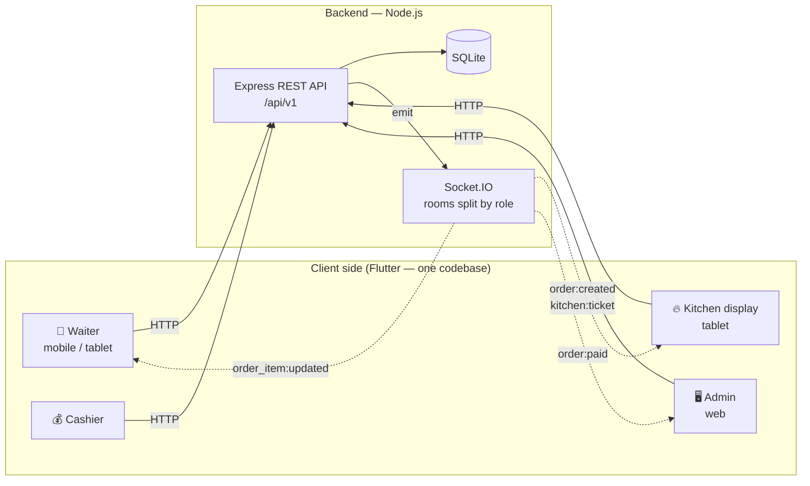
```mermaid
flowchart LR
    subgraph clients["Client side (Flutter — one codebase)"]
        W["📱 Waiter<br/>mobile / tablet"]
        K["🔥 Kitchen display<br/>tablet"]
        C["💰 Cashier"]
        A["🖥️ Admin<br/>web"]
    end

    subgraph server["Backend — Node.js"]
        API["Express REST API<br/>/api/v1"]
        WS["Socket.IO<br/>rooms split by role"]
        DB[("SQLite")]
    end

    W -->|HTTP| API
    K -->|HTTP| API
    C -->|HTTP| API
    A -->|HTTP| API

    WS -.->|order:created<br/>kitchen:ticket| K
    WS -.->|order_item:updated| W
    WS -.->|order:paid| A

    API --> DB
    API -->|emit| WS
```

### Clean Architecture on the Flutter side

Dependencies always point inward, toward **domain**; inner layers have no knowledge of outer layers.

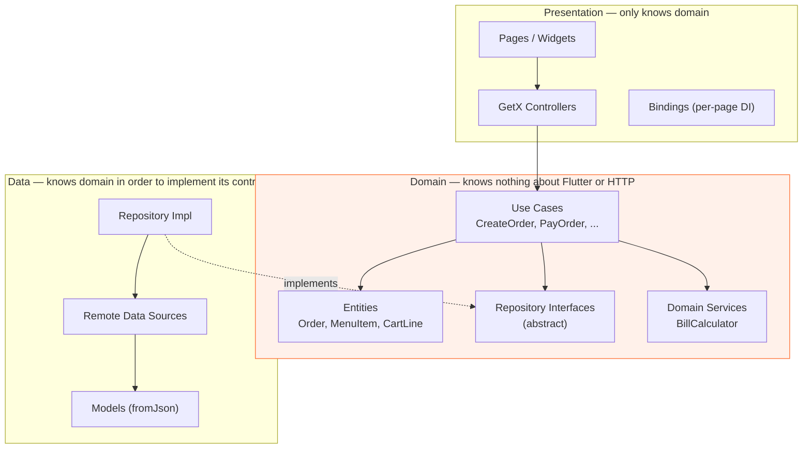
```mermaid
flowchart TB
    subgraph presentation["Presentation — only knows domain"]
        PG["Pages / Widgets"]
        PC["GetX Controllers"]
        PB["Bindings (per-page DI)"]
    end

    subgraph domain["Domain — knows nothing about Flutter or HTTP"]
        DE["Entities<br/>Order, MenuItem, CartLine"]
        DU["Use Cases<br/>CreateOrder, PayOrder, ..."]
        DR["Repository Interfaces<br/>(abstract)"]
        DS["Domain Services<br/>BillCalculator"]
    end

    subgraph data["Data — knows domain in order to implement its contracts"]
        DM["Models (fromJson)"]
        DD["Remote Data Sources"]
        DI["Repository Impl"]
    end

    PG --> PC --> DU --> DR
    DU --> DE
    DU --> DS
    DI -.implements.-> DR
    DI --> DD --> DM

    style domain fill:#FFF1EA,stroke:#FF6B2C
```

**Practical benefits of this layering:**

1. **Demo Mode** — mock data sources are substituted by editing a single file, with no change visible to the
   screens
2. **Controllers are testable without a server** — a fake repository is injected directly (see
   `test/presentation/cart_controller_test.dart`)
3. **Business rules are defined in one place** — `BillCalculator` serves both the cart preview and Demo Mode
4. **The backend is replaceable** — migrating to GraphQL or Firebase affects only the data layer

### Layered backend

```
routes  →  controller  →  service  →  repository  →  SQLite
   ↑           ↑             ↑             ↑
validate    map req/res   business      pure SQL
 (Zod)                    rules + emit
                           socket events
```

`service` has no knowledge of `req`/`res`, and `repository` has no knowledge of business rules, so each layer
can be tested in isolation.

---

## 📁 Project structure

```
PaynEat/
├── app/                              # Flutter (mobile + tablet + web)
│   ├── lib/
│   │   ├── app/                      # Theme, routing, app-level DI, config
│   │   ├── core/                     # Shared building blocks used by every feature
│   │   │   ├── network/              # ApiClient (Dio), SocketClient, endpoints
│   │   │   ├── errors/               # Failure / Exception + mapper
│   │   │   ├── usecases/             # Result<T> (a sealed class instead of Either)
│   │   │   ├── demo/                 # ⭐ The mock backend behind Demo Mode
│   │   │   ├── services/             # StorageService, SessionService
│   │   │   ├── utils/                # Formatters, responsive helpers
│   │   │   └── widgets/              # Widgets reused across the app
│   │   └── features/                 # Split by feature, each with all 3 layers
│   │       ├── auth/  menu/  table/  order/
│   │       ├── kitchen/  payment/  report/
│   │       └── staff/  settings/  home/  customer/  receivable/  scale/ …
│   │           ├── domain/           # entities · repositories · usecases
│   │           ├── data/             # models · datasources · repository impl
│   │           └── presentation/     # controllers · pages · widgets · bindings
│   └── test/                         # Domain / controller / widget tests
│
├── backend/                          # Node.js API
│   ├── src/
│   │   ├── config/  core/  middlewares/  realtime/
│   │   ├── db/                       # migrations/ (versioned), migrate, seed
│   │   ├── modules/                  # Split by domain
│   │   │   └── orders/
│   │   │       ├── order.routes.js
│   │   │       ├── order.controller.js
│   │   │       ├── order.service.js
│   │   │       ├── order.repository.js
│   │   │       ├── order.calculator.js   # ⭐ Billing rules (pure functions)
│   │   │       └── order.schema.js       # Zod
│   │   └── routes.js
│   ├── assets/fonts/                 # Thai font for receivables PDFs
│   ├── contracts/erp-pos/            # copy of the POS ↔ PaynEat ERP contract v1 1.0.0 (never edited — copied from the ERP; see ABOUT-THIS-COPY.md)
│   ├── docs/openapi.yaml
│   └── tests/
│
├── docker-compose.yml                # Run the whole system with one command (builds from source)
├── deploy/demo/                      # Option D: compose + one-line installer for Docker Desktop
└── .github/workflows/
    ├── ci.yml                        # Runs format/analyze/test checks on every push
    ├── deploy-pages.yml              # Landing page + live demo (Demo Mode) on GitHub Pages
    └── demo-images.yml               # Builds the real Docker images + smoke test → "demo" release
```

---

## 💵 Bill calculation

Monetary calculations allow no margin for error, so two measures are applied:

### 1. Amounts stored as whole numbers (satang)

```js
// ❌ The classic floating-point problem
0.1 + 0.2 === 0.3   // false

// ✅ The backend stores everything in satang, converting to baht only on output
120.50 THB  →  stored as  12050
```

### 2. A clear calculation order, written as testable pure functions

```
Food subtotal
  − Discount                     (flat amount or %)
  + 10% Service Charge           (calculated on the amount after the discount)
  + 7% VAT                       (calculated on the amount after the discount + Service Charge)
  = Total due
```

An example taken from the tests — Pad Krapao (75 THB) + fried egg (15 THB) × 2 plates:

| Line item | Amount |
|---|---:|
| Food subtotal | 180.00 |
| Service Charge 10% | 18.00 |
| VAT 7% (of 198) | 13.86 |
| **Grand total** | **211.86** |

This logic is implemented in two places that always produce identical results, and both are covered by tests:

- `backend/src/modules/orders/order.calculator.js` — the authoritative total used for payment
- `app/lib/features/order/domain/services/bill_calculator.dart` — an immediate in-app preview that does not
  depend on the network

A "prices already include VAT" mode is also supported (VAT is extracted from the price for display instead
of being added on top).

---

## ⚡ Realtime

Socket.IO uses the same JWT as the REST API and assigns each user to a room based on role, so the
kitchen never receives events that do not concern it.

| Event | Who receives it | When it fires |
|---|---|---|
| `kitchen:ticket` | Kitchen room | An order is sent to the kitchen |
| `order_item:updated` | Service room | The kitchen changes an item's status |
| `order:created` / `order:updated` | Everyone | An order is opened or edited |
| `order:paid` | Everyone | A bill is closed successfully |
| `table:updated` | Everyone | A table's status changes |
| `scale:reading` | Service + management rooms | The weight on the cabled scale changes (+ a 1-second heartbeat) |

On the app side, `SocketClient` always returns an unsubscribe function, which controllers retain and
call in `onClose()` to prevent orphaned listeners and memory leaks.

```dart
_unsubscribers.add(socket.on(SocketEvents.kitchenTicket, (_) => load()));
```

---

## 📡 API

Interactive documentation (Swagger UI) is available at **http://localhost:3000/docs**

<details>
<summary><b>Full endpoint summary</b></summary>

| Method | Endpoint | Access | Description |
|---|---|---|---|
| POST | `/auth/login` | — | Log in |
| GET | `/auth/me` | Anyone | Current user info |
| GET | `/menu-items` | Anyone | Menu list (searchable/filterable) |
| POST | `/menu-items` | admin, manager | Add a menu item |
| PATCH | `/menu-items/:id/availability` | + kitchen, waiter | Toggle sold-out |
| GET | `/tables` | Anyone | Table map with open orders |
| PATCH | `/tables/:id/status` | Anyone | Change table status |
| POST | `/orders` | waiter and above | Open an order |
| POST | `/orders/:id/items` | waiter and above | Add items |
| PATCH | `/orders/:id/items/:itemId` | waiter and above | Change quantity (before the kitchen starts) |
| PATCH | `/orders/:id/items/:itemId/status` | kitchen, waiter | Move an item's status forward |
| POST | `/orders/:id/send-to-kitchen` | waiter and above | Send to kitchen |
| POST | `/orders/:id/discount` | cashier and above | Apply a discount |
| POST | `/orders/:id/cancel` | admin, manager | Cancel an order |
| PATCH | `/orders/:id/move-table` | waiter and above | Move an order to another table |
| POST | `/orders/:id/merge` | waiter and above | Merge a source order into a target order |
| GET | `/orders/kitchen/queue` | kitchen | Kitchen queue |
| POST | `/payments` | cashier and above | Take a payment (full / partial / split by item) |
| POST | `/payments/:id/refund` | manager and above | Refund a payment (full or partial) |
| POST | `/payments/order/:id/split-preview` | cashier and above | Preview the amount due before splitting the bill |
| GET | `/payments/order/:id/receipt` | Anyone | Receipt data |
| GET | `/shifts/current` | admin, manager, cashier | The currently open shift, if any |
| POST | `/shifts` | admin, manager, cashier | Open a shift with a starting cash float |
| PATCH | `/shifts/:id/close` | admin, manager, cashier | Close a shift and reconcile the counted cash |
| GET | `/reports/dashboard` | Management | Dashboard data |
| GET | `/reports/summary` | Management | Sales summary for a date range |
| GET/PATCH | `/settings` | Anyone / admin | Store settings |
| GET/POST/PATCH/DELETE | `/users` | admin, manager (DELETE: admin) | Staff management — a manager only for waiter/kitchen/cashier in their own branches |
| GET | `/audit-logs` | admin | Log of front-of-house-fraud-risk actions (filterable) |
| GET/POST | `/customers` | waiter and up | Search/create customers (by name or phone) |
| GET | `/customers/:id` | waiter and up | A single customer's details (including points balance) |
| PATCH | `/customers/:id/credit` | admin, manager | Set the credit limit/term/tax ID/billing address |
| GET | `/receivables/customers` · `/receivables/customers/:id` | cashier and up | Receivables list / customer statement (aging, credit bills, billing notes, receipts) |
| POST | `/receivables/receipts` · `/receivables/billing-notes` | cashier and up | Collect a payment (oldest bill first) / issue a billing note |
| POST | `/receivables/receipts/:id/void` · `/receivables/billing-notes/:id/void` | admin, manager | Void a payment receipt/billing note (reason required) |
| GET | `/receivables/customers/:id/late-fee-preview` | cashier and up | Preview per-bill late interest before issuing a notice |
| POST | `/receivables/late-fees` · `/receivables/late-fees/:id/void` | admin, manager | Issue a late-interest notice / void it (waive the interest) |
| POST | `/receivables/credit-notes` | admin, manager | Credit a credit-sale bill + issue a credit note (VAT on the difference) |
| GET | `/receivables/late-fees/:id` · `/receivables/credit-notes/:id` | cashier and up | An interest notice / credit note (with its e-mail history) |
| GET | `/receivables/{billing-notes,receipts,credit-notes,late-fees}/:id/pdf` | cashier and up | Download the document as a Thai A4 PDF |
| POST | `/receivables/{billing-notes,receipts,credit-notes,late-fees}/:id/email` | cashier and up | E-mail the document with the PDF attached (needs SMTP) |
| GET | `/scale` | waiter and up | Cabled-scale status + latest weight |
| POST | `/ai/ask` | admin, manager | Ask a natural-language question about sales/menu/orders/customers — answered via tool-calling against real data only (daily quota) |

</details>

All endpoints share the same response format:

```jsonc
// Success
{ "success": true, "data": { }, "meta": { "page": 1, "total": 24 } }

// Error
{
  "success": false,
  "error": {
    "code": "VALIDATION_ERROR",
    "message": "The submitted data is invalid",
    "details": [{ "field": "quantity", "message": "Quantity must be greater than 0" }],
    "requestId": "pos-3fa2c1d09b7e4a55"   // = the x-request-id header and correlation_id in the log (ticket 24)
  }
}
```

---

## 🧪 Testing

```bash
cd backend && npm test      # 516 cases
cd app && flutter test      # 574 cases
cd app && flutter test test_e2e   # 49 cases (run npm ci in backend first)
node --test scripts/android-version.test.mjs   # 3 cases — the Google Play build's versionCode (not in the badge)
```

The badge counts the backend and app tests (516 + 574 + 49). The `android-version.mjs` script tests verify that a `vX.Y.Z` tag always
produces a higher `versionCode` and that a malformed or out-of-range tag fails with a reason; the `android-release.yml` workflow runs them
before every build (see `docs/DECISIONS.md` #75)

**E2E — the real app against the real backend (49 cases)** — `app/test_e2e/` starts the real backend
(`node src/server.js`) on a random port with a new temporary database per file, then exercises the
app's production data/domain code (`ApiClient` → data source → repository, the same stack the app assembles at
startup) against it following a restaurant's workflow, with each role using its own "device". It is the only
suite in which the app **parses JSON actually sent by the backend** (all other Flutter tests run on Demo Mode,
and the backend tests are pure JavaScript), and it runs as a separate CI job:

> `restaurant_day_e2e_test.dart` (15 steps) — every role logs in → a PromptPay ID is set → an order is opened whose
> total matches, to the satang, the cart total the app showed the waiter → a draft neither reaches the
> kitchen nor deducts stock until "Send to Kitchen" → the kitchen cooks it through to served → a leftover
> shift must be closed, and no payment is accepted until a new one opens → the backend's PromptPay QR
> matches the Dart algorithm character for character, CRC included → cash payment with correct change,
> table freed → full tax invoice → refund (cashier cannot, manager can) → shift closes with zero variance →
> Z-report + CSV → reports count exactly one more bill → the audit log holds every money event
>
> `self_order_and_access_e2e_test.dart` (16 cases) — a customer scans the QR and orders all the way to the
> kitchen screen, every type of invalid link, regenerating the QR invalidates the old link immediately, no personal
> data is exposed on the public page, multi-branch staff/branch switching, a 403 at every money-related
> permission, a bad token, and a deactivated staff member's signed-in device losing access
>
> `meat_shop_b2b_e2e_test.dart` (12 steps) — butcher counter + trade customer: scan a scale label whose
> check digit the test computes itself from the store's real settings → the weighed line's price in the
> cart matches the backend to the satang → a weighed item with no weight is rejected with 400 → a credit sale over
> the limit is rejected with 409 / a waiter receives 403 → a credit sale is due in 30 days and deducts the meat stock
> in kg even though it never went to the kitchen → a billing note bundles two bills (issuing it again returns
> 409) → a cash payment against the note is applied oldest bill first → the shift closes with zero
> variance + the Z-report separates credit sales from debt collected (the first bill, now fully paid, earns its
> points at that moment — a credit sale earns nothing up front) → reports show total kg sold
>
> `scale_documents_e2e_test.dart` (6 steps) — the test opens its own TCP server as the "scale" and the
> real backend connects to it (`SCALE_DRIVER=tcp`): the weight travels scale → parser → socket.io → app;
> an unstable reading cannot be used, a settled one can → a credit sale at that weight is priced to the satang
> as on the backend → a bill 20 days overdue with 5 grace days is charged exactly 15 days of interest by the
> formula (a cashier receives 403) → a 107-baht credit note separates out VAT and the balance decreases exactly →
> every document type downloads as a real `%PDF-` file → a billing note is sent by e-mail
> (`MAIL_TRANSPORT=json` builds the full message + PDF attachment without sending it) and a customer with
> no e-mail on file receives 400

This suite uncovered **5 defects that the 659 existing tests had not detected**; all were fixed with regression
tests on both the backend and Demo Mode: a tax invoice whose three printed lines did not sum correctly (#43), a
cash refund that made the cashier appear short at shift close (#44), CSV files downloaded from the real
backend without their BOM, causing Thai text to display incorrectly in Excel (#45), and a customer's "Send to Kitchen"
that never reached the kitchen, plus a truncated QR link that showed "no internet" (#46). The suite's
design is documented in `docs/DECISIONS.md` #47

**Docker images — full build and smoke test** — [`demo-images.yml`](.github/workflows/demo-images.yml) builds the API and web
images from the production Dockerfiles whenever `main` changes (and on every PR that modifies a Dockerfile/compose file), then runs
`deploy/demo/docker-compose.demo.yml` and checks that the API responds on `/health`, a login succeeds, the simulated scale is active,
and the web app returns 200. Only then are the images uploaded as the `demo` release for Option D. The job ensures that a broken
Dockerfile cannot go unnoticed (see `docs/DECISIONS.md` #63, #65)

**Backend (516 cases)** — `node:test` + `supertest`, run over real HTTP against an isolated test database.
The central test is `tests/order-flow.test.js`, which covers the entire floor-to-cash path in 17 steps:

> Select a table → open an order with modifiers → verify the total → the table becomes occupied →
> opening a second order at the same table is rejected → send to kitchen → the kitchen advances through
> statuses (and cannot skip a step) → the order updates automatically once everything is served → apply a discount →
> split payment twice → verify the change → paying again is rejected → the table is freed automatically →
> the receipt is complete → the sale appears in reports

Dedicated test files also cover all 9 modules: `menu.test.js` (validation, RBAC, a menu item that has already
been ordered cannot be deleted), `table.test.js` (duplicate names, status changes, a table with an open order cannot
be deleted), `payment.test.js` (splitting, overpayment/double payment, RBAC), `categories.test.js`,
`settings.test.js`, `users.test.js` (deleting staff is admin-only), and `reports.test.js`. The menu search tests
uncovered a defect in `menu.repository.js`, since fixed: it used `IFNULL(m.name_en, "")`, and SQLite
treats double quotes as a column identifier rather than a string literal, so the search failed whenever a
menu item had no `nameEn`; the query now uses single quotes.

`order-move-merge-split.test.js` (7 cases) covers move-table/merge-bill/split-by-item: a successful move
and rejection when the destination table is occupied, a successful merge (correct combined total, the source
order cancelled and its table freed) and rejection of merging an order with itself, proportional split-bill
previews, paying item by item until the bill closes, and rejection of an item that has already been paid for.

`order-transaction.test.js` (6 cases) checks that every order change shares one transaction with recalculating the totals and
the audit entry (T02): with the recalculation made to fail while opening an order, adding/editing/removing/cancelling an item,
a discount, redeeming or removing a promotion code, merging bills and cancelling an order already sent to the kitchen, the items,
totals, stock, table statuses and audit log must all stay exactly as they were; moving a table and sending to the kitchen do not
recalculate the totals (see `docs/DECISIONS.md` #84)

`closed-bill-lock.test.js` (4 cases) locks the items of closed bills (T04): on a fully paid bill neither a waiter nor a manager
can cancel an item (409, message in the request's language) and the totals, VAT, item statuses and stock stay the same; a
cancelled order gives the same reason; an item paid in a split cannot be cancelled while an unpaid one can; and the kitchen can
take a paid-up-front takeaway through every status, undo included (see `docs/DECISIONS.md` #85)

`kitchen-started-void.test.js` (7 cases) covers cancelling items the kitchen has started (T05): waiters and the kitchen get 403
in their language; ready → cooking → pending then a waiter cancel is still 403 with totals, status and stock unchanged; the same
sequence by a manager succeeds, restores stock and writes an `order_item.void` audit naming the furthest stage reached; an undone
item cannot be edited or removed (409); an item the kitchen never touched can still be cancelled by a waiter without a log; and
the kitchen can still undo one step while `kitchenReached` never goes down. `migrations.test.js` adds a case that migration 0003
fills in the stage reached for existing items (see `docs/DECISIONS.md` #86)

`refund-open-bill.test.js` (4 cases) covers net paid (T06): paying 50 then refunding 50 on an open bill puts the amount due back to the full
bill, paying only the old remainder (bill − 50) does not close it, overpaying the net amount is refused, and paying it in full closes the
bill; a partial refund raises the amount due by the refund and split-preview agrees; fully refunding a payment made for selected items
puts them back to unpaid so a waiter can cancel them (a partial refund keeps them paid); and refunding a closed bill leaves it closed with
nothing due. `migrations.test.js` adds a case that migration 0004 keeps items paid in a split before it as paid (see
`docs/DECISIONS.md` #87)

`split-share.test.js` (6 cases) covers split by item (T10): a 160 + 320 bill with 50% off pays 94.16 and 188.32 whoever pays
first; "prices include VAT" 160 + 80 pays 176.00 and 88.00; a **property test** over 2,000 random bills (every mix of discount,
promotion, SC, VAT mode, grouping and order) checks that shares add up to the bill and each is within 3 satang of its fair
portion; and through the real API the preview shows the shared-out discount and adds up to the amount charged, including a
bill that already took a fixed-amount payment (the adjustment line) (see `docs/DECISIONS.md` #88)

`points-rate.test.js` (6 cases) covers the minimum points rate (T15): an earn rate of 0.004 / 0.009 / 0 / negative gets a 400
with the minimum in Thai/English/Korean and saves none of the other fields sent with it; a point value of 0 gets a 400 while
exactly 0.01 saves; with 0 or 0.004 already stored, a cash sale and a fully collected credit sale both earn 0 points (no
Infinity in the database); with a stored point value of 0, points can't be redeemed and aren't deducted; and a points amount
that isn't an integer is refused before it reaches the database. `migrations.test.js` adds 2 cases for migration 0005, which
repairs broken balances: rebuilt from history (earned − redeemed, never below 0), broken points on a bill become 0, healthy
balances are left alone, and each repair is audited as `customer.points_repair` (see `docs/DECISIONS.md` #89)

`manager-staff-scope.test.js` (5 cases) covers what a manager can manage (T22): the list holds only waiter/kitchen/cashier
accounts sharing a branch (including staff with several branches) and no admin, manager, or staff who only have other
branches; resetting the password of, deactivating, changing the role or name of, or opening another manager's account
returns 403 in the same branch and across branches (message in the user's language, account untouched); staff who only
have other branches return 404; a manager can still create, re-role and reset staff in the branch but cannot create or
promote a manager/admin; and admin can still do everything (see `docs/DECISIONS.md` #92)

`promotion-engine.test.js` (16 cases) tests the pure promotion-matching logic (percent/amount/bogo, day/time/
minimum-spend/menu-category conditions, `findBestAutoPromotion`, `describeIneligibility`), and
`promotion-flow.test.js` (13 cases) covers the full HTTP path: create an auto promotion → it is applied automatically to an
existing order → removing it restores it because the order is still eligible → disabling it clears it → redeem a
valid/invalid code → a pinned code is not replaced by an auto promotion even if the auto promotion would discount more
→ deleting a promotion already used on an order does not affect that order (its name/code were already
snapshotted).

`ingredients.test.js` (9 cases) tests ingredient CRUD, RBAC (waiters cannot create/edit), validation, adjusting
stock with `isLowStock` changing correctly, the `lowStockOnly` filter, and refusal to delete an ingredient
still linked to a menu item. `inventory-flow.test.js` (13 steps) covers the full path: order items → no
deduction yet → send to kitchen deducts stock (repeat calls do not deduct twice) → adding items to an
already-sent order deducts immediately → stock reaches zero and the menu item is disabled automatically → ordering the
disabled item elsewhere returns 409 → cancelling the item restores stock and re-enables the menu item automatically
→ a manual stock adjustment updates availability in the same way → changing quantity/removing an item/cancelling
the whole order all restore stock correctly.

`tax-invoices.test.js` (9 cases) tests issuing abbreviated/full tax invoices, the running-number format
(`INV<Buddhist year>-<6-digit sequence>`) remaining sequential across multiple orders, rejection of a second
invoice for the same bill / a bill that has not been paid / a store without a tax ID, RBAC
(kitchen staff cannot issue one), and the void-then-reissue flow producing a new running number.

Following a full OWASP Top 10 security review, tests cover all 7 vulnerabilities that were identified and fixed:
`users.test.js` includes 7 cases — a manager cannot create/self-promote/edit/reset the password of an admin account
(privilege escalation), an admin can still perform all of these actions, an old token loses its
previous privileges as soon as an account is deactivated or its role changes (without waiting for the token to
expire), and an admin cannot demote or deactivate their own account (#62). `security-headers.test.js` (2 cases) confirms the CSP header is present on every endpoint
except `/docs` (Swagger UI requires inline script/style). `seed-production-safety.test.js` (2 cases)
confirms that `NODE_ENV=production` refuses to seed accounts with the known demo passwords (`admin123` etc.);
each account's password must first be set explicitly via `SEED_*_PASSWORD` (see `docs/DECISIONS.md` #20).

`production-defaults.test.js` (13 cases) checks the production defaults (T19, `docs/DECISIONS.md` #83):
- with `NODE_ENV=production`, the server refuses to start when `JWT_SECRET` is a sample value from the repository or
  shorter than 32 characters, starts with a long random value, and development still accepts the demo value;
- `/metrics` listens on `127.0.0.1` by default;
- a 500 response carries no stack unless `EXPOSE_ERROR_STACK=true` is set outside production;
- deleting an account that has opened a shift returns 409 with nothing deleted or logged, and the account can be
  deactivated instead;
- `docker-compose.yml` has no fallback `JWT_SECRET` and does not publish the metrics port, and the demo compose file
  binds its ports to `127.0.0.1` only.

`audit-logs.test.js` (16 cases) tests that every risky action is logged correctly: cancelling an
order (with reason/actor), voiding an order item only after it has been sent to the kitchen (cancelling
while still pending must not be logged), editing a discount, deactivating/resetting the password of/changing the role of/
deleting a staff account (renaming alone must not be logged), editing VAT (logged, whereas editing only the store name
is not), a refund, voiding a tax invoice, and RBAC (admin-only) (see `docs/DECISIONS.md` #21),
plus 6 further cases (see `docs/tickets/13-order-audit-trail.md`, `docs/DECISIONS.md` #25) for the
"who placed/edited this order" audit trail available to managers and finance (beyond the
fraud-risk events above): opening a new order (recording which waiter placed it),
adding items to an order, editing an item's quantity (editing only the note is not logged), removing
an item, moving a table, and merging bills.

`customers.test.js` (11 cases) covers the full customer/loyalty flow: creating a customer / rejecting
a duplicate phone number (409), searching by partial name/phone, RBAC (kitchen staff cannot call it),
linking `customerId` at order creation and rejecting a `customerId` that does not exist, the
`GET /orders?customerId=` filter, earning points automatically at the default rate (25 THB/point) only
when the order becomes fully paid, no points for an order with no linked customer, a split payment
across multiple rounds earning points exactly once (on the round that completes the bill), redeeming
points for a discount leaving the `amount` applied to the order unchanged (only `chargedAmount` decreases),
and rejection of a redemption in both failure cases (no customer linked / value exceeding the amount due
in the current round) (see `docs/DECISIONS.md` #22).

`takeaway-delivery.test.js` (12 cases) tests the full takeaway/delivery flow: a queue number is
assigned only for `type=takeaway` orders (`dine_in`/`delivery` always receive `null`), the queue number uses
its own daily counter, fully independent of the order's bill number (3 consecutive takeaway orders
receive 1, 2, 3), the KDS query (`findItemsByStatuses`) returns the correct `orderType` for all 3 order types
so that they can be displayed distinctly, and checkout/payment for a takeaway order works normally with no
step requiring a table (see `docs/DECISIONS.md` #23).

`promptpay.test.js` (8 cases) tests the pure function that builds the PromptPay QR payload to the
EMV QR standard: CRC-16/CCITT-FALSE matches the standard test vector, static QR (no amount) vs. dynamic
QR (with an amount), a 13-digit national ID/tax ID uses a different tag from a phone number, non-digit
characters are stripped from `promptPayId`, the TLV structure is self-consistent across every tag, and
the function throws when `promptPayId` is empty — plus 5 cases across `settings.test.js`/`payment.test.js`
for the `GET /payments/promptpay-qr` endpoint and the `promptPayId` settings field (see
`docs/tickets/16-promptpay-qr.md`, `docs/DECISIONS.md` #26).

`audit-logs.test.js` also includes 3 cases (see `docs/tickets/14-financial-audit-trail.md`,
`docs/DECISIONS.md` #27) for **financial/accounting** audit: editing a menu price
(`menu.price_change` — renaming alone is not logged, and resubmitting the same price is not logged
again), creating/editing/deleting a promotion (`promotion.create`/`update`/`delete`), and manually
adjusting ingredient stock (`ingredient.stock_adjust`) — plus 3 cases for
`GET /audit-logs/export`: RBAC (admin only), correct CSV header/content (UTF-8 BOM so that Excel displays
Thai text correctly), and filtering by action in the same way as the list endpoint.

A further 3 cases in `audit-logs.test.js` (see `docs/DECISIONS.md` #28) cover the remaining audited
events: opening/closing a shift (`shift.open`/`shift.close` — checking the cash-variance metadata
on close), accepting a payment (`payment.pay`), and entering/removing a discount code
(`order.promotion_redeem`/`order.promotion_remove`).

`audit-summary-args.test.js` (3 cases, `docs/DECISIONS.md` #74) reads every file under `src/modules` and checks
that each `auditLogService.log({…})` passes `summaryArgs` (removing it from any call makes the test fail), then checks
the actual values for opening an order / moving a table (both table names) and for a settings change (`changes`
field by field); the Thai sentence in `summary` must remain identical, character for character.

`ai-assistant.test.js` (9 cases) tests the AI assistant against a fake Anthropic client (the real API is never
called in tests; the client is replaced with `setAnthropicClientForTests`): RBAC (waiters/kitchen/
cashiers cannot access it), an empty question is rejected with 422, an unconfigured `ANTHROPIC_API_KEY` returns 503
with a dedicated error code, calling a real tool and then answering with a chart and named sources, only
`admin` is offered the `list_audit_log_entries` tool (for managers the tool is not offered to the model at all,
rather than being filtered out of the result afterwards), a tool call with an out-of-schema
parameter is rejected and returned to the model for a retry instead of failing the whole request, a
model that never calls `submit_answer` is forced to do so via `tool_choice` in the final round
(so the loop always terminates), and a refusal (`stop_reason: refusal`) is returned as a polite message
rather than an error. A separate `ai-assistant-rate-limit.test.js` (1 case) tests the daily quota with
`AI_ASSISTANT_DAILY_LIMIT=1` (set in its own process so that it does not affect other test files running the
default limit of 20) (see `docs/tickets/15-ai-ask-your-data.md`, `docs/DECISIONS.md` #33).

`report-export.test.js` (8 cases) tests exporting reports as CSV (sales summary/top items/sales by
day — correct header/content + UTF-8 BOM) and the Z-report both per shift (with cash reconciliation,
computed from `payments.shift_id` rather than the order creation date, to handle orders opened
across a shift boundary correctly) and per day (all shifts combined, without cash reconciliation, since multiple
shifts/cashiers may be combined), a 404 when the shift does not exist, exporting a Z-report as
CSV, and RBAC (a waiter cannot call it) (see `docs/tickets/12-report-export.md`).

`branches.test.js` (16 cases) covers multi-branch support: login returns a `pendingToken` + the list
of branches when the account has access to ≥2 branches (and is not admin); login completes immediately
when there is a single branch or the user is admin (always selecting the first branch automatically); `POST
/auth/select-branch` both exchanges a pendingToken for a full token and switches branch afterwards
(but a pendingToken cannot be used to call any other endpoint before a branch is selected); only admin
can select "all branches" mode (`branchId: null`); `authenticate` re-checks branch access from the DB on
every request (a disabled branch invalidates an old token immediately, even for admin); table/menu/
order/ingredient lists are filtered correctly by `branch_id` (all-branches mode sees both branches
combined); a newly created staff member is assigned automatically to the branch in which the creator is currently
working; and RBAC on `GET /branches`/`GET /branches/mine`/`PATCH /branches/:id` is correct (see
`docs/tickets/11-multi-branch.md`, `docs/DECISIONS.md` #36).

`public-order.test.js` (13 cases) tests the public, login-free QR self-order endpoints: every
table has a unique `qrToken` from `GET /tables`, a bad token or a deactivated table returns 404,
viewing the menu/current order for a table works correctly, adding the first item opens a new
order automatically (later additions go into the same order), ordering a sold-out item returns 409, sending more than 20
items in one call returns 422, `PATCH /tables/:id/qr-token/regenerate` invalidates the old token
immediately with RBAC (admin/manager only; waiters cannot call it), and `POST .../items` is rate
limited to 30 requests/5 minutes per table, returning 429 beyond that (see
`docs/tickets/17-qr-self-order.md`, `docs/DECISIONS.md` #37).

`sell-by-weight.test.js` (10 cases) covers selling by weight: price = per-kg price × grams rounded to
the satang (including per-kg modifiers), weight required/forbidden by item type, one bag per line with no
quantity edits, stock deducted in kg, stock deducted on full payment for a bill that never went to the
kitchen (#51), a weighed item remaining on sale while stock > 0, report/CSV total weight, and QR self-order
neither showing nor accepting weighed items — `barcode-scale.test.js` (6 cases): a duplicate barcode/PLU in
the same branch is rejected with 409 (another branch may reuse it), PLUs drop leading zeros and apply only to
weighed items, exact-match barcode search, clearing codes, and rejection of a label format without enough weight
digits (including when only one field is sent, checked against the saved value) —
`receivables.test.js` (10 cases): credit sales (limit/no customer/waiter/points), payments applied
oldest first and never above the amount owed, cash counted into the shift, no voiding of a cash receipt after
its shift has closed, billing notes (no duplicates/void and reissue/paid status), refunds of a credit bill
capped at the amount still owed, debt aging, and RBAC — `migrate-credit.test.js` (1 case) builds a
pre-ticket-20 database and migrates it, verifying that the monetary data, the refunds referencing it, and the
indexes are all preserved (see `docs/DECISIONS.md` #48–#51) — `migrations.test.js` (11 cases) covers versioned
migrations (T01): each runs once regardless of how often the server starts; one that fails midway is rolled back completely
(the tables and columns it created are removed, and it is not recorded as applied); one that runs without foreign keys must
pass `foreign_key_check` before committing; an edited applied migration, or an app older than its database, prevents
the server from starting; the migration files match `checksums.json` (a Windows CRLF checkout produces the same
checksum); and a database created before T01, containing seed data, a sale, and a refund, is upgraded with every table's row
count unchanged (see `docs/DECISIONS.md` #79)

`erp-connection.test.js` (20 cases) exercises PaynEat ERP connected mode (ticket 25) against a stub ERP (`tests/helpers/erpStub.js`),
from standalone operation through leaving connected mode:
- by default the ERP is never called;
- branches with a malformed or missing code are identified with the problem (in English for an English app);
- a wrong credential, a major-2 contract, and an unreachable ERP are refused without entering the mode;
- the credential never appears in responses, logs, the audit log, the CSV export, or settings;
- an ingredient assigned an item code beforehand is overwritten in place, so its recipes stay linked;
- editing ingredients or branches returns 409;
- menu items closed because of stock reopen and sell even with local stock at 0;
- pulls proceed page by page from the last version, and pulling again creates no duplicates;
- a 503 midway resumes exactly after the pages already applied;
- a superseded branch moves to its new code with its sales history;
- the "Create here" button: a non-admin receives 403; it creates the branch with the ERP's latest Thai name (pulled first) plus its
  ingredients and an audit entry; pressing it again, or for a code the ERP does not assign, returns 409; and when the ERP has just changed an
  existing branch's code, that branch is moved first, so no duplicate is created;
- a response that violates the contract is reported as ERROR `unexpected_response` and stops scheduled pulls until a manual pull succeeds;
- a revoked credential stops all calls until a new one is saved, after which pulling resumes from the same version;
- every pull log line carries `pos_instance` and uses the events `master_data.pull.completed`/`master_data.pull.failed` with a `reason`;
- after leaving connected mode, the data is retained and becomes editable again

`erp-contract.test.js` (24 cases) pins POS contract v1 at 1.0.0 (files match the checksums copied from the ERP), checks the
contract's examples against its schemas, and verifies that the POS client reads every example, ignores unknown fields and entity types,
refuses another major version before inspecting the shape, and maps 401/429/503/5xx/404/302 and network loss to the behaviour the contract
specifies, then maps every case to the `reason` and severity defined by telemetry v1.2 (`credential_revoked`, `credential_unknown`,
`erp_unreachable`, `rate_limited`, `unexpected_response`, `contract_unsupported` and a reason sent by the ERP itself; ERROR when
human action is required) (see `docs/DECISIONS.md` #80)

`erp-transport.test.js` (22 cases) covers the HTTPS rule for the credential (ticket 32):
- a table of accepted and refused addresses, including names that look like loopback or resolve to 127.0.0.1, which do not count;
- `ERP_ALLOW_INSECURE_HTTP` must be exactly `true`;
- saving an `http://` address gets a 400 (message in the request's language) with no request sent, while loopback works with no extra setting;
- with plain HTTP allowed for a closed network, `http://erp:3000` works, the status tells the app to warn, and a `WARNING` line is logged at startup;
- a connection saved over `http://` before the update sends no request to the ERP at all, logs `master_data.pull.failed` at ERROR
  (`unexpected_response`), stops scheduled pulls, answers 409 to a manual pull, and pulls normally again once a sendable address is saved;
- a stub HTTPS ERP with a test CA generated on every run: a CA the machine does not trust is refused before any HTTP request (502 naming
  `NODE_EXTRA_CA_CERTS`), trusting the CA through `NODE_EXTRA_CA_CERTS` connects, and a certificate for another name is refused
  (see `docs/DECISIONS.md` #82)

`late-fees-credit-notes.test.js` (7 cases) covers the 15% rate cap / cashiers cannot set the rate / rate changes are
audited, no rate = no interest, interest charged only on bills past their grace period through today with a second
run on the same day charging nothing, the next run continuing from where the last one stopped on the principal
still owed, payments also covering interest and a paid interest notice not being voidable until its receipt is,
crediting a bill issuing a credit note automatically (original/corrected value, difference, VAT, the
original tax invoice number), and credit notes being limited to credit-sale bills and never exceeding the amount
owed or leaving an orphaned document — `document-pdf-email.test.js` (7 cases) covers BAHTTEXT + Buddhist-era
dates in Bangkok time, a PDF for every document type, a long billing note continuing onto a new page / voided
documents remaining downloadable, no SMTP = 503, e-mailing the customer with the PDF attached + history +
audit log, no recipient 400 / voided document 409 / SMTP failure 502 with no history row, and saving the
customer's e-mail — `scale.test.js` (5 cases) covers parsing A&D/CAS/MT-SICS/number+unit with
stable/unstable/overload, TCP joining lines split mid-way / sending the poll command / reconnecting after
a disconnected cable, readings older than 3 seconds not being forwarded, `GET /scale` disabled by default / the simulator
sending weights / the kitchen being denied, and serial with no port configured reporting the reason without crashing
(see `docs/DECISIONS.md` #54–#57)

`credit-points.test.js` (8 cases) covers loyalty points on credit sales: a cash bill still earns at checkout, a
credit sale / partial payment earns nothing and full payment earns by the usual formula + audit, one
receipt covering several bills rewards only the bills it settles, voiding a receipt reverses the points
and paying again does not double them, a customer who has already spent the points loses only the remainder (never
negative, never doubled), credit notes reduce the points to the net amount / a fully credited bill earns
nothing, unpaid interest keeps a bill open while waiving it earns the points without counting interest,
and a split bill whose credit part was paid off first earns when the bill closes (see
`docs/DECISIONS.md` #59) — `cors.test.js` (2 cases) verifies that `CORS_ORIGIN=*`, as set by `.env.example`/docker-compose,
produces `Access-Control-Allow-Origin: *` so that a web app on a different port from the API can log in (the value previously
became `['*']`, which matches no origin — see `docs/DECISIONS.md` #61) — `error-i18n.test.js` (5 cases) scans every source file and fails on a Thai error
message with no English/Korean entry in the catalogue, checks that placeholders match across languages, and that real HTTP
responses follow `Accept-Language` (a missing or unsupported value falls back to Thai) — `kitchen-undo.test.js` verifies that the kitchen can revert a
status by one stage but never out of served (see `docs/DECISIONS.md` #64)

`telemetry-log-record.test.js` (13 cases) tests the telemetry contract's rules as pure functions, with the same
examples as the PaynEat ERP tests (severity by status, latency as `"0.231s"`, query strings removed, QR tokens
replaced by `:qrToken`, which `x-request-id` values are accepted, `traceparent`, labels/trace in both the
default and `LOG_FORMAT=gcp` formats), and `telemetry.test.js` (11 cases) runs the real app and checks the
log lines it actually writes: both formats, the `x-request-id` round trip (header/log/error body), severity
401/404 = INFO · 422 = WARNING · 500 = one ERROR line with `error` (stack only at `LOG_LEVEL=DEBUG`), the
branch's `location_code`, `/metrics` by route template on its own port and absent from the API port, login /
creating and editing a customer / searching by phone leaving no name, phone, e-mail, tax ID, address, password,
or token in the log, malformed JSON containing a password returning 400 (previously 500) without exposing the body, and no
table QR token in the log (see `docs/DECISIONS.md` #68)

**Flutter (574 cases)** — organized into 3 levels:

| Level | File | What it tests |
|---|---|---|
| Domain | `bill_calculator_test.dart` | Every billing rule, including manual discounts, promotion discounts (additive but capped at the subtotal), and VAT-inclusive mode |
| Domain | `promotion_engine_test.dart` | The backend's promotion-matching test suite ported to Dart (percent/amount/bogo, every condition type, `findBestAutoPromotion`, `describeIneligibility`) |
| Domain | `cart_line_test.dart` | Merging duplicate cart lines + a weighed line priced in satang before rounding, matching the backend (including prices with fractional satang), per-kg modifiers, two bags of equal weight never merging (ticket 18) |
| Domain | `barcode_resolver_test.dart` | Reading product barcodes/EAN-13 scale labels: PLUs with leading zeros, no guessing on a bad check digit, store-defined label formats, labels matching only weighed items, and a registered exact barcode winning over label parsing (ticket 19) |
| Domain | `entities_test.dart` | Role-based permissions, order-item status transitions, an item the kitchen started and then undid still cannot be edited or removed (T05), PaymentSummary/SplitPreview read refunds, included VAT and the adjustment line from the backend (T06, T10) |
| Domain | `loyalty_points_test.dart` | App-side loyalty points (mirrors the backend): computed in satang and rounded down, a rate of 0 / below 0.01 / NaN / Infinity gives 0 points instead of an exception, a point value below 0.01 baht can't be redeemed, and 0.01 baht is the lowest rate that can be set (T15) |
| Domain | `split_share_test.dart` | The app-side split share (mirrors the backend): 50% off on 160 + 320 gives 94.16/188.32 whoever pays first, included VAT on 160 + 80 gives 176/88, and a property test over 2,000 random bills adds up to the bill (T10) |
| Domain | `demo_store_test.dart` | Verifies `demo_store.dart`, split into 20 files, still works correctly across domains, including the full auto/code/remove/eligible-list promotion flow, the full stock-deduction / auto sold-out flow, the tax-invoice issue/void/reissue flow with running numbers, the audit-log flow covering every risky action (ticket 08), the customer/loyalty flow: creating/searching customers, linking `customerId` at order creation, earning points exactly once when fully paid (including split-payment rounds), redeeming points for a discount without changing the order's `amount`, and rejecting every invalid redemption (ticket 09), and the takeaway queue number: only assigned for `type=takeaway`, running correctly per day even with dine-in/delivery orders interleaved (ticket 10), and the financial/accounting audit flow: menu price changes only log when the price actually changes, promotion create/edit/delete, manual ingredient stock adjustments, and `auditLogExportCsv` returning CSV correctly filtered by action (ticket 14), and every table having a unique `qrToken`, `resolveTableByQrToken` finding the right table / rejecting a bad token or a deactivated table, and `regenerateQrToken` invalidating the old token immediately (ticket 17), selling by weight/duplicate codes/kg stock deduction on payment/QR self-order hiding weighed items (tickets 18–19), credit sales/payments applied oldest first/cash into the shift/no voiding a receipt after its shift closed/billing notes/credit reduction/debt aging (ticket 20), and late interest on the seeded bill (8 days at 12%, no double charge)/no voiding paid interest/the 15% cap/credit notes + VAT on the difference/simulated e-mail defaulting to the customer's address and refusing voided documents (tickets 21, 23), and credit-sale points earned on full payment / taken back on a void as far as possible / withheld while interest is owed / net of credit notes (#59), and closed bills or items paid in a split cannot have an item cancelled while the kitchen can still move them on (T04), and an item the kitchen started then undid: only a manager can cancel it (403 for waiters/kitchen), the audit names the stage reached and matches the backend letter for letter, it cannot be edited or removed, and the stage reached never goes down (T05), and split by item in Demo Mode gives the backend's figures for 50% off and for included VAT, with the adjustment line after a fixed-amount payment (T10), and a points rate below 0.01 baht can't be set, a stored rate of 0 earns 0 points on a cash sale or a fully collected credit sale, and a stored point value of 0 can't be redeemed (T15), and a manager sees only waiter/cashier/kitchen accounts and cannot touch manager/admin accounts, create or promote a manager, or delete an account (403), while still managing staff (T22) |
| Controller | `cart_controller_test.dart` | Cart logic, using a fake repository, including the case of no `Get.arguments` at all (coming straight from the "New takeaway/delivery" button) still defaulting to takeaway rather than dine-in (ticket 10), weighed items sending `weightGrams` to the backend/no quantity edits but re-weighing allowed, scanning labels/barcodes into the cart, and a bad scan leaving the cart unchanged (tickets 18–19) |
| Controller | `request_id_error_test.dart` | The request ID on error messages, through the real ApiClient → repository → controller chain: 500/409 give the backend's translated message + "Request ID: …" matching what was sent, 422 gets no ID, every request gets a fresh `x-request-id` in the format the backend accepts, `ServerFailure.requestId` (ticket 24) |
| Controller | `receivable_controllers_test.dart` | Totals of what's owed/overdue, splitting open bills/unbilled bills/open billing notes, document voiding limited to managers and up, a successful payment sending the chosen billing note then reloading / a failed one not reloading (ticket 20), late interest/credit notes limited to managers and up and reloading on success, e-mail with no recipient using the customer's address (tickets 21, 23) |
| Widget | `live_scale_test.dart` | The live scale panel: nothing shown with no scale / no DI binding, a weight usable only when stable (wobbling/overloaded/disconnected/0 g disabled), "Use this weight" filling the weight with nothing typed, the camera button sending codes down the scanner's path / closing the camera doing nothing / no camera = no button, and the simulated scale cycling empty → wobble → stable → lifted off (ticket 22) |
| Controller | `auth_controller_test.dart` | Validators, fillDemoAccount, guard when the form is invalid, `loadMyBranches` success populates `myBranches`, guard clauses in `submitBranchSelection`/`switchBranch` when there's no pendingToken/session token yet (ticket 11) |
| Controller | `order_list_controller_test.dart` | Order status filters, sending activeOnly/dateFrom correctly |
| Controller | `table_controller_test.dart` | Combined zone/status filtering, counting available/occupied tables, `canManageQrToken` restricted to admin/manager (mirrors the backend's RBAC — ticket 17) |
| Controller | `self_order_controller_test.dart` | Loading a table + menu from a qrToken (success/failure), a link with no qrToken sets an error immediately without calling the repository, filtering the menu by category, adding/removing cart lines, tapping the same dish again merging into one line with a higher quantity (same rule as the staff cart), and dropping a line's quantity to 0 removing it from the cart (ticket 17) |
| Controller | `home_controller_test.dart` | Per-role menu visibility, tab switching |
| Controller | `menu_browse_controller_test.dart` | Menu filtering/search (debounced), counts per category |
| Controller | `menu_management_controller_test.dart` | Menu filtering on the management screen, counting sold-out items |
| Controller | `kitchen_controller_test.dart` | Grouping the kitchen queue by status, counting late items, moving status forward |
| Controller | `checkout_controller_test.dart` | Change/remaining-balance calculation, the `canPay` condition, rounding up to the nearest hundred, the "On credit" method appearing only for customers with a limit + non-waiter users, no paying over the limit, and choosing credit clearing any points (ticket 20); refunds on an open bill: managers can refund and cashiers cannot, the refundable amount excludes what was already refunded, a refund reloads the amount due from the backend, and a failed refund shows the reason (T06) |
| Controller | `checkout_controller_test.dart` | (continued) a disabled pay button always states the reason below it (no shift / invalid amount / cash short) and shows nothing once payment is possible (#62) |
| Controller | `receipt_controller_test.dart` | Loading a receipt by orderId, the `Payment.tendered` rule (a receipt shows the cash the customer handed over, not the amount applied to the bill: tendered − change = amount applied), silently loading the tax invoice when none has been issued yet (404 isn't an error), and tax-invoice void permission (manager role or above) |
| Controller | `settings_controller_test.dart` | Loading store settings into the correct form fields |
| Widget | `settings_points_form_test.dart` | The settings form warns about an earn rate or point value below 0.01 baht before sending (no API call), exactly 0.01 sends, and a rate of 0.5 shows as 0.5 instead of being rounded to 1 and saved over (T15) |
| Controller | `erp_connection_controller_test.dart` | The PaynEat ERP connection section (ticket 25): address/credential/branch codes checked before calling the backend, a successful connect clears the credential field at once, a branch-code refusal from the backend reloads the list, 422 field messages, pull now reports the count and version / a failure reloads the status, leaving connected mode, branch codes sent in capitals, the last pull's problem in the app's language, saying when scheduled pulls have stopped, the create-branch button (success names the branch actually created / a 409 shows the reason and reloads / not in demo mode), demo mode always standalone, parsing the backend's status (including how the credential travels — an older backend that doesn't send it counts as https), and ERP unit names (unknown codes shown as they are) |
| Controller | `ingredients_controller_test.dart` | The ingredients page is read-only when connected to the ERP, an unreadable mode keeps the last value, the "low stock" filter is cleared in connected mode, item codes are sent in capitals and an edit sends null to clear one (ticket 25) |
| Controller | `staff_controller_test.dart` | Filtering staff by role, counting by role; a manager can assign only waiter/cashier/kitchen, has no menu on manager/admin accounts and cannot delete, while admin manages every role (T22) |
| Widget | `staff_page_permissions_test.dart` | The staff page for a manager: the ⋮ menu only on staff rows, no delete, no promote to manager/admin, and no admin filter chip; admin sees the menu on every row but their own, with delete (T22) |
| Controller | `order_detail_controller_test.dart` | Order management permissions, moving item status forward |
| Controller | `dashboard_controller_test.dart` | Loading today's sales summary + live counters |
| Controller | `report_controller_test.dart` | Selecting a report date range, silently swallowing topItems/dailySales errors |
| Controller | `shift_controller_test.dart` | Loading the current shift + history together, guarding closing a shift with none open, `startNewShift` clearing the previous close result, `loadZReport` fetching a shift's Z-report successfully (ticket 12) |
| Controller | `split_bill_controller_test.dart` | Selecting/deselecting items, fetching the preview, `canPay`/`change` |
| Controller | `home_destinations_test.dart` | Per-role menu visibility (guards against permission leaks) — also confirms waiters intentionally see the "Kitchen" tab (mirrors backend permissions), that only admin/manager/cashier see Receivables, and that an unrecognized role fails safe to account-only access instead of silently inheriting a broad permission set from a wildcard case |
| Controller | `storage_service_test.dart` | Storing the session, and falling back to in-memory storage |
| Controller | `audit_log_controller_test.dart` | Sending filters (action/date range) correctly with `load`/`loadMore`, `setDateRange` converting to ISO dates and clearing filters, `hasMore`/pagination (ticket 14) |
| Controller | `ai_assistant_controller_test.dart` | `ask` trims the question/clears the input/stores the answer+chart, guards against an empty/too-long question and sending while already waiting on one, and separates a `ServerFailure`'s `errorCode` (e.g. `AI_ASSISTANT_DISABLED`) from a generic error (ticket 15) |
| Widget | `widgets_test.dart` | Button taps and widget state, including `KitchenTicketCard` rendering the correct icon/label for all 3 order types (table/takeaway/delivery) (ticket 10) |
| Widget | `hourly_chart_range_test.dart` | The chart's time range must come from real data, not a hardcoded value |
| Widget | `weight_entry_dialog_test.dart` | Turning the typed weight (kg, a comma works as the decimal point) into whole grams, rounding, and rejecting anything outside 1–99,999 g (ticket 18) |
| Core | `destructive_labels_test.dart` | The accounts-receivable "void document" button must never share a label with the ordinary Cancel/Close buttons, in every language (the Korean edition previously used "취소" for both, next to "닫기") (see `docs/DECISIONS.md` #60) |
| Widget | `uat_affordances_test.dart` | Readiness checks for unguided UAT: the globe button names the current language in that language and lists all 3, `StatGrid` with long captions does not overflow at 320/360/600 px and cards in a row share one height (previously 36 overflows), and table cards show a visible ⋯ button instead of relying on long-press (#62) |
| Controller | `kitchen_controller_test.dart` | (continued) Undo after a status change sends the previous status back to the server, served items have no Undo bar, and the bar is dismissed automatically when the time expires (#64), and a failed status change (a 409 such as a closed bill) shows the reason on the kitchen screen, keeps the queue intact and offers no Undo (T04) |
| Core | `api_client_test.dart` | Every request carries `Accept-Language` for the language displayed at that moment; switching language mid-shift changes the next request (#64) |
| Core | `korean_font_coverage_test.dart` | Also covers Korean Material strings (date/time pickers, buttons) and the Korean backend error messages in `backend/src/i18n/errorMessages.js`; this check identified 18 missing glyphs before they could render as empty boxes (#64) |
| Core | `korean_font_coverage_test.dart` | (continued, #74) every Korean font weight must contain ≥ 2,350 syllables (KS X 1001) plus all jamo produced while typing; restoring the previous font makes the test fail (it contained only 474), and the test also covers the Korean name/address of the credit customer |
| Domain | `demo_store_test.dart` | (continued, #74) after every case, checks **every** audit log created by that case (28 actions): rebuilt in Thai from `summaryArgs`, it must match the recorded sentence character for character, and rebuilt in English/Korean, it must contain no Thai beyond values entered by the user — this check detected Demo Mode printing "500.0 บาท" where the backend prints "500" |
| Presentation | `audit_summary_text_test.dart` | audit sentences for the backend-only actions (payment, shift open/close, move table, merge bills, apply/remove a code, create a branch from the ERP) in every language, a recipient e-mail containing `@` is not substituted twice, old logs and unknown actions fall back to the recorded sentence, and Thai always shows the recorded sentence, and a void of an undone item names the stage the kitchen reached in the viewer's language (T05), and the points repair on database update matches the migration's Thai sentence (T15) |
| Core | `locale_service_test.dart` | The first launch uses the device language (Korean/English), and an unsupported language falls back to Thai (#62) |
| Widget | `cart_panel_locale_test.dart` | The cart must show item names in the selected language (English/Korean), matching the card just tapped, rather than the Thai-only `menuItem.name`; also checks that a weighed line does not overflow with wide glyphs (see `docs/DECISIONS.md` #58) |
| Core | `formatters_due_date_test.dart` | Due dates render in the current language ("11 Oct 2026" / "2026년 10월 11일") instead of a raw `2026-10-11`, without shifting a day with the device timezone |
| Widget | `customer_picker_dialog_test.dart` | The customer picker used while taking an order — after a transient network error, a successful new search must restore the list (rather than leaving the error screen displayed), the error state offers a retry button, and the debounce collapses 6 keystrokes into a single search request |
| Widget | `erp_transport_warning_test.dart` | The ERP connection settings (ticket 32): no warning for https or localhost; plain http allowed by the server's administrator shows a red warning naming the setting in all 3 languages and can still pull; an old http connection says to switch, offers the address field, and disables the buttons that would call the ERP |
| Widget | `order_item_tile_test.dart` | An item the kitchen started then undid back to pending has no remove button; waiters see no cancel button while managers see the cancel (void) button instead (T05, `docs/DECISIONS.md` #86) |
| Core | `app_clock_test.dart` | `AppClock` freezes and restores the clock correctly, preventing a frozen time from leaking across tests |
| Core | `app_colors_contrast_test.dart` | Computes real WCAG contrast ratios against **every surface actually used**, not just white — standard mode must pass AA (4.5:1), high-contrast mode AAA (7:1), and any colour used as a button/chip fill must carry a white label |
| Core | `contrast_service_test.dart` | The real toggle path — switching the palette, persisting it, restoring it on next launch, and proving the theme rebuilds its colours instead of caching them once |
| Core | `promptpay_test.dart` | Mirrors the backend's PromptPay QR algorithm (EMV QR + CRC-16/CCITT-FALSE) in Dart for Demo Mode — includes a golden-value test that checks the payload matches the backend's output character-for-character (ticket 16) |
| Core | `csv_test.dart` | Mirrors the backend's CSV builder in Dart — header, escaping comma/quote/newline, null values become an empty string, and the output is prefixed with a UTF-8 BOM (ticket 14) |
| Core | `bold_markdown_test.dart` | Parses `**bold**` markdown from the AI assistant's answers into `TextSpan`s, correctly splitting bold vs. plain segments — including multiple bold runs in one string and an unpaired `**` (guards against the plain `Text` widget displaying raw `**` asterisks instead of bold text) |

> Methods that involve navigation (`Get.toNamed`, `Get.snackbar`, `Get.dialog`) are not covered at this unit
> level because they require a real, pumped `GetMaterialApp`; only navigation-independent logic and state are
> tested (see `docs/CODING_STANDARDS.md` section 6.2). These tests uncovered a defect in
> `OrderDetailController`, since fixed: GetX silently skipped assigning an `Rxn<Order>` when the newly returned
> order had the same id as before (because `Order.==` compares only the id), leaving the screen with stale
> data after an edit or status change (see `docs/CODING_STANDARDS.md` section 3.5).

GitHub Actions CI runs `dart format` → `flutter analyze` → `dart run custom_lint` → `flutter test` →
`flutter build web` on the Flutter side, and `prettier --check` → `eslint` → `npm test` on the backend,
on every push, plus a separate **E2E** job that installs Node and Flutter side by side and runs
`flutter test test_e2e` against a real backend process (see the E2E paragraph above).

A separate **Clean Architecture (layer rules)** job runs `tool/check-architecture.sh`, which performs the five
dependency-direction checks from [`CODING_STANDARDS.md` §4.3](docs/CODING_STANDARDS.md), so that these rules are
enforced automatically rather than depending on a manual pre-commit step. The check identified one violation,
since corrected: `promotion_engine.dart`, in the domain layer, called GetX's `.tr` to translate user-facing
strings, which §4.1 prohibits. The domain now returns a **translation key** and the calling layer performs the
translation, consistent with the adjacent code.

---

## 🔭 Roadmap

Completed work, planned work, and known limitations, with the reasoning for each.

- [x] **Move table / merge bills / split bill per person** — `PATCH /orders/:id/move-table`,
  `POST /orders/:id/merge`, and splitting the bill by item (`POST /payments` with `itemIds` +
  `POST /payments/order/:id/split-preview`), with full UI for all 3 features (see the ✨ Features section)
- [x] **Shift open/close / cash drawer reconciliation** — a starting cash float is entered when a shift opens,
  and the counted cash is compared automatically with the expected total at close; a shift must be open
  before payments can be accepted (see the ✨ Features section)
- [x] **Refunds after payment** — `POST /payments/:id/refund`, full or partial, with a mandatory
  reason, automatically subtracted from net sales in reports (see the ✨ Features section)
- [x] **Printing receipts on a thermal printer** — intentionally limited to LAN/Wi-Fi in the first phase
  (Bluetooth/USB are not yet supported because this development environment has no hardware to test
  against — full reasoning in [`docs/DECISIONS.md`](docs/DECISIONS.md) #11)
- [x] **Offline mode** — intentionally limited to "adding items to an already-open order" in the first phase
  (the action with the lowest conflict risk); items are queued on the device and synchronized automatically when
  the connection is restored. Opening a new order, taking payment, opening/closing a shift, etc. always require a
  connection, by design (full scope in [`docs/DECISIONS.md`](docs/DECISIONS.md) #13)
- [x] **Conditional promotions/discounts** (happy hour, discount codes, buy-one-get-one) — admin/manager
  can create/edit/disable 3 promotion types with conditions for day/time, eligible categories/menu items,
  minimum spend, and campaign dates; promotions apply automatically when eligible or through a customer-entered
  discount code (one promotion per bill, additive with a manual discount but capped at the subtotal) and are shown
  clearly on the bill/receipt/printed receipt (see the ✨ Features section)
- [x] **Ingredient stock tracking** — menu items are linked to their ingredients and the quantity per
  order from the menu edit form; stock is deducted automatically when an order is sent to the kitchen (and restored
  on cancellation/removal); menu items are disabled/re-enabled automatically based on ingredient stock, with a
  low-stock alert screen (see the ✨ Features section and `docs/DECISIONS.md` #15)
- [x] **High-contrast mode** — enabled from the **Profile** page (accessible to every role,
  not only admins) and stored per device. Every text token moves from AA (4.5:1) to AAA (7:1)
  and card borders from 1.24:1 to 4.10:1 (see `docs/DECISIONS.md` #18)
- [x] **Korean language support** — 1,233 translation keys across every feature (verified to
  match the Thai key set exactly), NotoSansKR embedded as a subset (all 2,350 KS X 1001 syllables, so Korean text can be entered, #74), a separately designed Korean
  landing page with 5 Korean-locale app screenshots, a three-way language switcher on all
  three landing pages (also visible on mobile), and the AI assistant enabled to answer in Korean.
  Added to support Korean restaurants in Thailand (see `docs/DECISIONS.md` #39). **Korean menu names are
  intentionally not stored in the database**, because menu names are each restaurant's own data, not system text
- [x] **Flutter integration tests against a real backend** — implemented as the E2E suite `app/test_e2e/`
  (49 cases): it starts the real backend on a new temporary database per file and exercises the app's
  data/domain code through a full restaurant business day, a customer scanning the QR, and
  branches/permissions. It operates at the data/domain layer rather than through `integration_test`, which
  requires a physical device, and runs as a separate CI job. The suite uncovered 5 defects not detected by the
  659 existing tests; all have been fixed (see the 🧪 Testing section and `docs/DECISIONS.md` #43–#47)
- [x] **Tax invoice** — the store's tax ID/address/branch are configured in Settings; abbreviated/full tax
  invoices can be issued from the receipt page of any fully paid bill, with a continuous, non-duplicated
  running number (`INV<Buddhist year>-<sequence>`, reset annually); a wrongly issued invoice can be voided
  and reissued (see the ✨ Features section and `docs/DECISIONS.md` #19). **e-Tax
  invoice** (electronic filing directly with the Revenue Department) is **not yet implemented** and is
  deferred to a later phase
- [x] **Audit log** — records every action with front-of-house fraud risk, append-only (cancelling
  an order, voiding an item after it has been sent to the kitchen, editing a discount, deactivating/deleting/
  changing the role of/resetting the password for a staff account, editing VAT/service charge, a refund,
  voiding a tax invoice) with the user, time, and reason; the log page is admin-only and filterable by
  action type (see the ✨ Features section and `docs/DECISIONS.md` #21)
- [x] **Customer & Loyalty** — a customer can be found by phone or added, then optionally linked to an
  order when it is opened; points are earned automatically from the purchase amount exactly once
  when an order is fully paid (never double-counted across split-payment rounds); points can be
  redeemed for a discount at checkout (rejected outright, never silently capped, if the amount exceeds
  the customer's balance or the amount due in the current round); the exchange rate is configurable in Settings
  (admin/manager); admin/manager can view any customer's purchase history and points balance on the
  **Customers/Loyalty** tab (see the ✨ Features section and `docs/DECISIONS.md` #22). **Redemption is not yet
  available on the split-bill-per-person page**, as it was outside this ticket's acceptance criteria
- [x] **Full takeaway/delivery flow** — takeaway and delivery orders are opened from the "New
  takeaway/delivery" button on the table map with no table attached; takeaway orders (`type=takeaway`
  only) automatically receive a queue number that resets daily (delivery riders reference the order by its bill
  number; the queue counter is entirely independent of the bill-number sequence); the KDS shows a
  distinct icon/label for all 3 order types on every ticket; cashier checkout/payment for
  takeaway orders never requires selecting a table (see the ✨ Features section and `docs/DECISIONS.md` #23).
  **Integration with external delivery platforms** is intentionally not included, as
  recommended by the ticket: the scope is large and depends on each platform's external API,
  and it should be handled in a separate follow-up ticket once the first platform to integrate is decided
- [x] **Real PromptPay QR** — the `qr` method generates a real QR code to the EMV QR standard for the customer
  to scan, bound to the amount automatically (the store's PromptPay ID must first be set in Settings); the
  algorithm is fully tested on both the backend (JS) and Demo Mode (Dart), with a golden value proving that both
  produce an identical payload (see the ✨ Features section, `docs/tickets/16-promptpay-qr.md`, `docs/DECISIONS.md` #26).
  **A payment gateway/callback for automatic payment verification is not yet implemented** and is intentionally
  out of scope; the cashier verifies the slip/banking app before confirming, as with bank transfer/card
- [x] **Financial/accounting audit** — extends #21/#25 with 5 additional action types (editing a
  menu price, only when the price actually changes; creating/editing/deleting a promotion; manually
  adjusting ingredient stock), plus a **CSV export** button (`GET /audit-logs/export`) and a **date-range
  picker** on the Audit Log page (see the ✨ Features
  section, `docs/tickets/14-financial-audit-trail.md`, `docs/DECISIONS.md` #27). **CSV export is
  web-only**, because this page belongs to the admin zone, which is designed as web-only (ticket 08)
- [x] **Report export + Z-report (shift/day close)** — an **Export CSV** button per report type
  on the Reports page (sales summary/top items/sales by day, for the selected date range),
  and a **Z-report** available per shift (with cash reconciliation, computed from
  `payments.shift_id` rather than the order creation date, to handle orders opened across a
  shift boundary correctly) and per day (all shifts combined, without cash reconciliation), both exportable
  as CSV (see the ✨ Features section, `docs/tickets/12-report-export.md`). **Export is CSV only**, with no
  Excel/PDF yet, because CSV opens cleanly in Excel (with a UTF-8 BOM so that Thai characters display
  correctly) and the ticket's acceptance criteria accept it as an equivalent format (see
  `docs/DECISIONS.md` #35)
- [x] **Multi-branch/multi-store support** — `branches`/`user_branches` were added, and
  `branch_id` scopes the 4 entities that are genuinely branch-level data (tables/menu items/orders/
  ingredients), including every report; accounts with access to multiple branches select one at login
  and can switch branches later from the Profile page, and admin can switch to an "all branches" mode
  to view combined reports (see the ✨ Features section, `docs/tickets/11-multi-branch.md`,
  `docs/DECISIONS.md` #36). **There is no "manage branches" screen yet** in Flutter (the backend already
  provides the endpoints, but the acceptance criteria did not require it), and **Demo Mode intentionally has a
  single branch** (`branch_id` was not added to the demo store). Remaining branch-isolation work is tracked in the
  QA tickets (T19–T24, T32; details are not published, per `docs/DECISIONS.md` #81)
- [x] **QR self-order** — every table has a unique `qrToken`; customers scan the QR code and
  order directly from their own phone through a public, login-free endpoint that reuses 100% of the
  existing business logic (stock deduction/promotions/realtime); staff (`admin`/`manager`) can view the QR,
  copy the link, and regenerate the QR from the table map (see the ✨ Features section,
  `docs/tickets/17-qr-self-order.md`, `docs/DECISIONS.md` #37). **Self-checkout** and **printing a
  physical QR standee from within the app** are intentionally out of scope (see "Intentionally out of
  scope" below)
- [x] **Sell by weight (price per kg)** — items can be sold by weight, stored in grams (an integer,
  as money is stored in satang), priced by a single formula that matches to the satang across the
  cart/backend/Demo Mode, with stock deducted in kg, including on full payment when the bill was never sent
  to the kitchen (see `docs/tickets/18-sell-by-weight.md`, `docs/DECISIONS.md` #48, #51)
- [x] **Barcodes/scale labels** — product barcodes and EAN-13 scale labels that carry the
  weight can be scanned (the label format is configurable to match the store's scale), decoded on the device
  without a server round-trip, and a weight is never inferred from a misread label (see
  `docs/tickets/19-barcode-scale.md`, `docs/DECISIONS.md` #49)
- [x] **Credit sales/billing for trade customers (B2B)** — per-customer credit limit/term, credit
  sales, billing notes, payment receipts applied to the oldest bill first, debt aging, cash collections counted
  in the drawer at shift close, and migration of existing databases with no loss of monetary data (see
  `docs/tickets/20-b2b-credit.md`, `docs/DECISIONS.md` #50)
- [x] **Late-payment interest/fees + separate credit notes** — the shop sets a late-interest rate
  (0–15% a year) and grace days; simple interest per bill continues from the previous run without
  overlap, producing an interest notice `LF…` that is added to the balance and can be voided only while unpaid;
  crediting a credit-sale bill always produces a credit note `CN…` with the original/corrected value,
  the difference, and the VAT on the difference (see `docs/tickets/21-late-fees-credit-notes.md`,
  `docs/DECISIONS.md` #55–#56)
- [x] **Live weight from a cabled scale + scanning with the phone camera** — the scale connects to
  the store server (TCP/serial) rather than to each tablet; A&D/CAS/MT-SICS/number+unit formats are parsed;
  the weight is broadcast in real time and can be used only when stable; and a camera button on the
  order-taking screen reads barcodes/scale labels through the scanner's path (see
  `docs/tickets/22-live-scale-camera-scan.md`, `docs/DECISIONS.md` #54)
- [x] **E-mailing billing notes as PDF** — all 4 receivables documents are rendered as Thai A4 PDFs
  (amount in words, Buddhist-era dates), can be downloaded on the web, and are sent by e-mail with the PDF
  attached through the shop's own SMTP server, with a send history (see `docs/tickets/23-document-pdf-email.md`,
  `docs/DECISIONS.md` #57)
- [x] **UI review of weight sales/scanning/credit in every language × every screen size** — 93 screens with
  no overflow; corrected the cart and option sheet showing Thai on English/Korean screens, unformatted due
  dates, the scan box on phones, 8 missing Korean glyphs, and the screenshot tool; added a meat-counter section
  with a scannable label to all three landing pages (see `docs/DECISIONS.md` #58)
- [x] **Decide when a credit sale should earn loyalty points** — the store owner's decision is **on full
  payment**: charging to the account, partial payments, or unpaid interest earn nothing; once the debt is
  settled, points are earned on the net amount after credit notes (excluding interest); voiding the receipt
  that settled the bill reverses the points to the extent the customer still holds them; cash bills continue to
  earn at checkout (see `docs/DECISIONS.md` #58, #59)

- [x] **UX review before an unguided UAT (customers use the system without guidance)** — every tab of every role plus
  the screens reached from them, × 3 languages × 4 screen sizes (666 screens,
  `tool/screenshots/uat_walkthrough_test.dart`). Overflows were reduced from 64 to 0; added a language switch
  before login and on the QR menu, one-tap demo sign-in, confirmations before any irreversible action (merge
  bills, role changes, discarding a cart), a stated reason whenever a button is disabled, and tooltips on every
  icon button (see `docs/DECISIONS.md` #62)
- [x] **Resolve the remaining UAT review items** — backend error messages follow the app language (a
  catalogue plus a test that scans the source so that no message is missed), Material strings/date pickers
  follow the language, demo staff names are translated, the kitchen has Undo, the QR menu states that weighed
  meat is ordered from staff, and screenshots render real shadows instead of black outlines (see
  `docs/DECISIONS.md` #64). Intentionally retained: the Thai branch name/address (tax-invoice rule) and
  per-device data in demo mode. Audit-log summaries are displayed in the viewer's language (the CSV remains in
  Thai, see `docs/DECISIONS.md` #74)

- [ ] **Connect to [PaynEat ERP](https://github.com/SuruchBoss/PaynEat-ERP) (optional mode)** — the supply-side
  ERP for a chain that operates its own production plant. When connected, the ERP owns ingredients, branches,
  menus, prices, and recipes, and the POS sends sales to it through an outbox, exactly once even across outages;
  **without the ERP, the system works exactly as it does today** (see tickets 25–28 and `docs/DECISIONS.md` #66).
  Completed: **ticket 25** — connection with a credential, pulling ingredients and branches by version, read-only
  management screens, no automatic sold-out from local stock, a button to create a branch assigned by the ERP, and
  log lines under telemetry v1.2 (`docs/DECISIONS.md` #80). Remaining: 26 (sales), 27 (menus/prices/recipes), and
  28 (from config), pending the first quality-assurance round (#77)
- [x] **A Google Play channel (ticket 29a)** — CI builds an `.aab` signed with the upload key from GitHub Secrets
  when a tag is pushed (`versionCode` derived from the tag, attached to the GitHub Release), in demo mode for
  closed testing; the PaynEat app icon replaces the Flutter logo; a privacy policy page in three languages; Data
  safety answers and Thai/English store text and images under `docs/store/` (see `docs/DECISIONS.md` #75). The
  Play applicationId is `suruch.boss.payneat` (#78). The remaining steps take place in the owner's account:
  opening a Play Console account, adding the upload key to Secrets, and recruiting 12 testers for 14 consecutive days
- [ ] **One Google Play app for every restaurant (ticket 29b)** — enter the shop server's address or scan a QR code on
  first start, or open demo mode with no server. Free, like the rest of the system. Scheduled after ticket 25 and the first round of QA fixes
  (`docs/DECISIONS.md` #77). The App
  Store will follow when a restaurant requests it; the server itself is still installed in the shop (see ticket 29 and
  `docs/DECISIONS.md` #69)
- [ ] **A faster web app for users not using Korean** — the full Korean font (3.2MB) is loaded only when needed, and
  Korean data never displays as empty boxes, even in a shop without internet access (see ticket 30)
- [ ] **Resolve the September 2026 QA findings (#79)** — close the paths through which money can go missing (voiding
  paid bills, split payments that skip promotions, shift close counting points as cash), align reports with the shop's
  own business day, and address the security findings on defaults, permissions and branch isolation (T19–T24, T32; details
  are not published, per `docs/DECISIONS.md` #81), in three rounds through tickets T01–T32 (#80–#110, #117).
  The 12 open decisions have been made; for example, a partial refund on a bill paid partly in points is returned in
  proportion, and insufficient stock blocks sending to the kitchen unless a manager confirms (see
  `docs/DECISIONS.md` #77). Completed: T01 versioned migrations (`docs/DECISIONS.md` #79), T02 every order change in one
  transaction (`docs/DECISIONS.md` #84), T04 locking the items of closed bills (`docs/DECISIONS.md` #85), T05 cancelling
  food the kitchen has started needs a manager even after an undo (`docs/DECISIONS.md` #86), T06 net paid after refunds
  (`docs/DECISIONS.md` #87), T10 split by item sharing promotions and included VAT correctly (`docs/DECISIONS.md` #88), T15 a 0.01-baht
  minimum points rate and repairing broken balances (`docs/DECISIONS.md` #89), T19 production defaults (`docs/DECISIONS.md` #83)
  and T22 managers manage only lower-role staff in their own branches (`docs/DECISIONS.md` #92) — **round 1 is complete**
- [ ] **Link previews and web-app icons that match the product** — no outdated figures in the share image, and the
  PaynEat logo when the web app is installed from the browser (see ticket 31)
- [ ] **Automatic backups the owner can restore without a developer (ticket 33)** — a backup at every shift close, every six
  hours and before every database upgrade, each one checked for integrity; an optional second copy on another disk; a warning for
  the owner when no backup has succeeded for 26 hours; and a one-command restore. Required before the first real shop
  (see `docs/DECISIONS.md` #90)
- [x] **PaynEat ERP connection over HTTPS only** — the ERP address must be `https://`, except `localhost` or a closed
  network the server's operator allows explicitly (with a permanent warning); an old `http://` connection stops sending the credential
  at once; certificates are always verified, with a chain's internal CA supported through `NODE_EXTRA_CA_CERTS`; and the contract copy
  follows PaynEat-ERP#61 (see ticket 32 and `docs/DECISIONS.md` #82)
- [x] **Logs and metrics per the ecosystem telemetry contract** — JSON logs per contract v1.1 (no vendor
  names by default, `LOG_FORMAT=gcp` for Google Cloud), a full `x-request-id` round trip with the request ID
  shown in app error messages, `/metrics` by route template on port 9464, never exposed outside the machine, and
  no customer data, passwords, or QR tokens in logs (see ticket 24 and `docs/DECISIONS.md` #68). Outbox metrics
  will be delivered with ticket 26
- [x] **Present the system as a "problem menu" in the README and landing page** — nine problems faced by large
  restaurants (order overload, short staff, slow payment, cash leakage, stock-outs, butcher counter/wholesale, no
  overview, guests not returning, a tough floor), each presented with several features, application screens, and
  demo steps; a new landing page styled as a large restaurant's food-ordering site in all three languages; 39 new
  screenshots from `app/tool/screenshots/story_test.dart` (WebP files, no base64); and all three READMEs generate
  this section from the same source as the landing page (`docs/generator/landing/`, `docs/DECISIONS.md` #70)
- [x] **An install guide as a web page, without GitHub** — `docs/landing/install*.html` in three languages offers four
  installation methods by audience (try in the browser / Windows in one line / Docker so that every device in the
  restaurant connects / run from source); each lists the time required, the prerequisites, steps with copy buttons, and
  the expected result, followed by the demo accounts, a go-live checklist, and troubleshooting keyed to the installer's
  actual messages. Every "Install guide" link on the landing page points here (`docs/DECISIONS.md` #72)

**Intentionally out of scope** (not backlog items — full reasoning in
[`docs/DECISIONS.md`](docs/DECISIONS.md)):

- **Retail (bookshops, supermarkets)** — not before a restaurant uses the POS in production. If implemented, it
  will be a "shop type" in this repository that shares the core for money, tax, and shifts, not a separate project
  (`docs/DECISIONS.md` #71)
- **Printing over Bluetooth/USB** — requires physical hardware for testing, which this development
  environment does not have (LAN/Wi-Fi printing is implemented, as noted above)
- **Offline mode for opening new orders/taking payment** — higher conflict risk (order numbers and monetary
  accuracy must come directly from the server)
- **PostgreSQL for multi-branch support** — multi-branch support is implemented (see above) but currently
  runs on a single SQLite file (the repository layer is already isolated, so migration would be
  straightforward if required)
- **PromptPay payment gateway/automatic payment-verification callback** — exceeds the needs of a single-branch
  restaurant of this kind (it requires merchant registration with a bank/provider); generating a
  real, scannable QR code is sufficient for this scope (see `docs/tickets/16-promptpay-qr.md`)
- **Printing a physical QR standee/table tent from within the app** — avoids a new dependency
  (`printing`/`pdf`) for a function that is not core to a POS; the app instead shows a large QR image and a
  copy-link button on screen, and the restaurant can take a screenshot or use an external design tool to
  produce a physical sign (see `docs/tickets/17-qr-self-order.md`)
- **Self-checkout through the QR order-taking flow** — QR self-order covers order taking only; payment
  continues to go through the cashier, avoiding the financial and fraud risk associated with
  self-checkout, which would also require a real payment gateway (out of scope, per the item above)
- **Connecting a scale directly to a tablet/phone, and sending tare/zero commands to it** — Web
  Serial/Bluetooth are not supported on every platform, and commands differ by brand; instead, the scale
  connects once to the store server, which broadcasts to every device (see `docs/DECISIONS.md` #54)
- **Flat late fees/early-payment discounts, an automatic e-mail retry queue, PDFs of front-of-house
  receipts/tax invoices** — late interest is simple (non-compounding) interest issued manually by a manager,
  so every baht added to a debt has an accountable person; a failed send notifies the user immediately so
  that it can be retried; and front-of-house receipts continue to use the thermal printer / print from screen (see
  `docs/DECISIONS.md` #55, #57)

---

## 📚 Further reading

- [`docs/PORTFOLIO-SUMMARY.en.md`](docs/PORTFOLIO-SUMMARY.en.md) — a one-page summary for portfolio or
  job-application use (key figures and highlights, considerably shorter than this README)
- [`docs/PaynEat-POS-Features-TH.pdf`](docs/PaynEat-POS-Features-TH.pdf) — a 30-page document covering every screen with explanations (Thai)
- [`docs/PaynEat-POS-Features-EN.pdf`](docs/PaynEat-POS-Features-EN.pdf) — English edition, rewritten for business audiences (30 pages)
- [`docs/DECISIONS.md`](docs/DECISIONS.md) — 92 design decisions and their accepted trade-offs (e.g. why
  amounts are stored in satang, why the billing logic is intentionally implemented twice, why SQLite is used)
- [`docs/CODING_STANDARDS.md`](docs/CODING_STANDARDS.md) — coding standards derived from a code-quality audit
  covering Clean Code / State Management / Clean Architecture / Technical Debt / folder structure; the
  reference for further development
- [`docs/PaynEat-POS-Audit-Report-TH.pdf`](docs/PaynEat-POS-Audit-Report-TH.pdf) — an 8-page
  code-quality audit report (PDF, Thai) summarizing results across all 5 dimensions, including the defects
  found and fixed
- [`backend/docs/openapi.yaml`](backend/docs/openapi.yaml) — the full API specification
- [`CONTRIBUTING.md`](CONTRIBUTING.md) — the starting point for contributors (setup, coding
  standards, PR workflow)
- [`CODE_OF_CONDUCT.md`](CODE_OF_CONDUCT.md) — the code of conduct for everyone contributing to this project
- [`SECURITY.md`](SECURITY.md) — how to report a security vulnerability, and what to check before deploying
  to production

---

## 📄 License

[Apache License 2.0](LICENSE) — the software may be used, modified, and extended freely. When it is redistributed or
used as the basis of other work, the [`NOTICE`](NOTICE) file must be retained, as required by the License (Section 4(d)).

Copyright © 2026 Suruch Chakrapeesirisuk. Every source file starts with its copyright line and an SPDX identifier
(`SPDX-License-Identifier: Apache-2.0`), which CI checks on every push. External contributions are signed off,
commit by commit, under the Developer Certificate of Origin (DCO) — see [`CONTRIBUTING.md`](CONTRIBUTING.md#developer-certificate-of-origin-dco).

**The POS is entirely free and will have no paid edition** — no locked features and no limits on devices, branches,
or users. Paid installation, hardware setup, support, and training are available as optional services; every feature
is available without them. The ecosystem's paid edition is [PaynEat ERP Enterprise](https://github.com/SuruchBoss/PaynEat-ERP#editions),
intended for larger chains — see `docs/DECISIONS.md` #67.

## 👤 Author

Built and maintained by **[SuruchBoss](https://github.com/SuruchBoss)**
([LinkedIn](https://www.linkedin.com/in/suruchboss)). Enquiries about the project, collaboration, or professional
opportunities are welcome.
