# 🍽️ PaynEat POS — 레스토랑 매장 판매 시스템

**언어:** [ไทย](README.md) · [English](README.en.md) · 한국어

> 주문부터 마감까지 한 시스템에서 돌아갑니다. 홀 직원이 태블릿으로 주문을 받으면
> 주방 화면에 바로 뜨고, 캐셔가 결제를 마치면 사장님이 웹에서 매출을 확인합니다.
>
> **Flutter (GetX + Clean Architecture)** + **Node.js / Express + SQLite + Socket.IO**
> — 하나의 코드베이스로 Android, iOS, 웹에서 모두 동작합니다.

<p align="center">
  
  
  
  
  <a href="LICENSE"></a>
</p>

<p align="center">
  <b><a href="https://suruchboss.github.io/PaynEat/index.ko.html">한국어 소개 페이지</a></b> ·
  <b><a href="https://suruchboss.github.io/PaynEat/app/">데모 바로 써보기</a></b>
</p>

> 📌 **이 문서는 도입을 검토하시는 분께 필요한 내용을 중심으로 정리했습니다.**
> 아키텍처, 데이터베이스 스키마, API 레퍼런스 같은 깊은 기술 문서는 분량이 큰 관계로
> [태국어](README.md)와 [영어](README.en.md) 문서에만 있습니다. 필요하시면 Issues에 남겨주세요.

---

## 어떤 시스템인가요

태국 방콕의 식당에서 실제로 벌어지는 네 가지 조건을 기준으로 설계했습니다.
조용한 사무실의 깨끗한 화면이 기준이 아닙니다.

| 조건 | 설계에 반영한 것 |
|---|---|
| 창가 자리의 직사광선 | 글자 색을 버튼마다 실제 배경색에서 계산해 고릅니다. 고대비 모드는 계정 화면에서 바로 켤 수 있습니다 |
| 주방 모니터의 수증기 | 3미터 거리에서도 읽히는 크기. 색은 장식이 아니라 우선순위를 나타냅니다 |
| 기름 묻은 손 | 주방의 상태 변경 버튼은 같은 기능의 휴대폰 버튼보다 거의 두 배 큽니다 |
| 끊기는 와이파이 | 연결이 끊기면 전체 너비 경고 띠가 뜨고, 30초마다 직접 주문을 가져옵니다 |

---

## 지금 바로 써보기

설치도 가입도 필요 없습니다. 역할을 고르면 바로 들어갑니다.

### 👉 [데모 열기](https://suruchboss.github.io/PaynEat/app/)

데모에는 매장 데이터가 이미 들어 있습니다 — 테이블, 메뉴, 지난 주문,
그리고 리포트를 볼 수 있을 만큼의 매출까지.

**로그인 화면과 QR 메뉴 오른쪽 위의 지구본 버튼, 또는 내 정보 화면에서 언어를 한국어로 바꾸실 수 있습니다.**
처음 여실 때는 기기 언어를 따라갑니다. 날짜 선택 달력, 기본 버튼, 그리고 **백엔드가 보내는 오류 메시지**도
선택한 언어로 나옵니다.
메뉴 이름, 카테고리, 구역 이름, 옵션까지 전부 한국어로 바뀝니다.
**변경 이력**의 문장도 한국어로 나오고, 거래처·고객 이름처럼 매장이 입력하는 데이터도 한국어로 입력하시면 됩니다 —
자주 쓰는 한글 2,350자(KS X 1001)를 모두 폰트에 넣어 두어 "첫 손님"처럼 입력해도 네모 상자로 깨지지 않습니다.

### 계정

로그인 화면의 데모 계정 버튼을 **한 번 누르면 바로 로그인**됩니다. 직접 입력하지 않으셔도 됩니다.

| 역할 | 아이디 | 비밀번호 | 볼 수 있는 것 |
|---|---|---|---|
| 관리자 | `admin` | `admin123` | 전부 (대시보드, 메뉴 관리, 직원, 리포트, 설정) |
| 매니저 | `manager` | `manager123` | 관리자와 같지만 계정 삭제는 불가 |
| 홀 직원 | `waiter1` | `waiter123` | 테이블 배치도, 주문, 주방 |
| 주방 | `kitchen` | `kitchen123` | 주방 화면만 |
| 캐셔 | `cashier` | `cashier123` | 테이블 배치도, 주문, 리포트 |

> 🧑‍🍳 **아무 설명 없이 직접 눌러 보시게 할 때(UAT)** — 데모 모드는 **데이터가 기기마다 따로 저장됩니다.** 홀 직원이
> 휴대폰에서 주문해도 다른 태블릿의 주방 화면에는 나타나지 않습니다. 여러 기기로 함께 써 보시려면 백엔드를 실행하고
> [설치 안내의 방법 3](https://suruchboss.github.io/PaynEat/install.ko.html#docker)처럼 Docker에 `API_BASE_URL`을 컴퓨터 IP로 설정해 모든 기기에서 같은 주소를 여시거나
> (아래 Windows 한 줄 설치는 그 PC에서만 열립니다), 한 기기에서 계정을 바꿔 가며 역할을 체험해
> 주세요. 되돌릴 수 없는 작업(주문 합치기, 역할 변경, 장바구니 비우기)은 한 번 더 확인하고, 누를 수 없는 버튼은 그
> 이유를 버튼 아래에 알려 드립니다 (`docs/DECISIONS.md` #62)

### Windows PC에 서버까지 설치해 보기 (Docker Desktop, 한 줄)

> 📘 **단계별 설치 안내를 웹 페이지로 보시려면** → [설치 안내](https://suruchboss.github.io/PaynEat/install.ko.html) — 네 가지 방법(브라우저 체험 / Windows 한 줄 /
> Docker로 매장의 모든 기기 연결 / 소스 실행), 명령어 복사 버튼, 데모 계정, 운영 전 체크리스트, 문제 해결까지 한 페이지에
> 있습니다. GitHub에 들어가실 필요가 없습니다.

실제 서버를 내 PC에서 돌려 보시려면, 코드를 받거나 빌드하실 필요 없이, **Docker Desktop**을 켜 두고
(왼쪽 아래 **Engine running**) **PowerShell**에 아래 한 줄을 붙여 넣고 Enter를 누르세요.

```powershell
[Net.ServicePointManager]::SecurityProtocol = 3072; iex ((New-Object Net.WebClient).DownloadString('https://github.com/SuruchBoss/PaynEat/releases/download/demo/install-demo.ps1'))
```

3~5분 뒤 브라우저가 **http://localhost:8080** 을 열어 드립니다 (`admin` / `admin123`). 이 방법은 설치한 PC에서만 열립니다 —
매장의 휴대폰과 태블릿까지 연결하시려면 [설치 안내의 방법 3](https://suruchboss.github.io/PaynEat/install.ko.html#docker)을 따라 주세요. 사용자 폴더의 `PaynEat-Demo`에
시작 / 중지 / 데이터 초기화 파일이 있습니다. 데모 전용 설정입니다 (README 영문/태국어판 "Option D").

> ⚠️ **이 계정들은 둘러보기 전용입니다.** 실제 운영에 배포하실 때는 반드시 비밀번호를
> 바꾸거나 `AUTO_SEED`를 끄셔야 합니다 — 안 바꾸면 서버가 켜지지 않도록 막아두었습니다.
> 자세한 내용은 [SECURITY.md](SECURITY.md)에 있습니다.

---

<!-- stories:start -->
<!-- สร้างจาก docs/generator/landing/content.py (ชุดเดียวกับหน้า Landing) — แก้ที่นั่นแล้วรัน python3 docs/generator/landing/build_landing.py อย่าแก้ส่วนนี้ตรง ๆ -->

## 🍽 문제 해결 메뉴

대형 식당이 매일 실제로 겪는 문제들이고, 각각 버튼 하나가 아니라 **함께 움직이는 여러 기능**으로 해결합니다 — 모두 자동 테스트 929개를 통과한 뒤 배포됩니다. 모든 이미지는 골든 테스트로 실제 앱에서 캡처했습니다 ([`story_test.dart`](app/tool/screenshots/story_test.dart)). **[웹 데모](https://suruchboss.github.io/PaynEat/app/)**에서 직접 눌러 보시거나 **[랜딩 페이지](https://suruchboss.github.io/PaynEat/index.ko.html)**에서 웹 페이지로 보실 수 있습니다.

| # | 가게의 문제 | 해결하는 세트 | 얻는 것 |
|---|---|---|---|
| 1 | 🔥 주문 폭주 | 테이블 배치도 · 실시간 주방 화면 · 15분 경고 · 포장 대기번호 | 가장 오래 기다린 요리가 늘 맨 위에 |
| 2 | 🙋 일손 부족 | 테이블별 QR · 로그인 없음 · 바로 주방으로 · 재고 차감도 동일 | 앉자마자 주문 시작 |
| 3 | 💸 느린 결제 | 프롬프트페이 QR · 분할/합치기 · 태국어 영수증 · 세금계산서 | QR 금액이 계산서와 사땅(1/100바트) 단위까지 일치 |
| 4 | 🔒 현금 누수 | 근무 시작·마감 · Z 리포트 · 수정 불가 이력 · 5가지 역할 | 40바트만 모자라도 마감 때 바로 보임 |
| 5 | 📦 재료 품절 | 자동 재고 차감 · 자동 판매 중지 · 재고 부족 알림 | 메뉴를 손으로 끌 사람이 필요 없음 |
| 6 | 🥩 정육 · 도매 | 무게 판매 · 연결형 저울 · EAN-13 라벨 · 외상/청구서 | 0.485kg × ฿1,200 = ฿582, 계산기 없이 |
| 7 | 📊 전체가 안 보임 | 실시간 대시보드 · CSV 리포트 · 다지점 · AI에게 질문 | 영업 중에 오늘을 파악 |
| 8 | 🎁 재방문이 없음 | 조건부 프로모션 · 할인 코드 · 1+1 · 적립 포인트 | 직원이 프로모션 조건을 외울 필요 없음 |
| 9 | 🌧 험한 현장 | 고대비 모드 · 오프라인 주문 · 3개 언어 · 가진 기기 그대로 | 상태 라벨 대비 8.77:1, 햇빛 아래서도 또렷 |

### 1. 🔥 피크 타임 세트

<p align="center">
  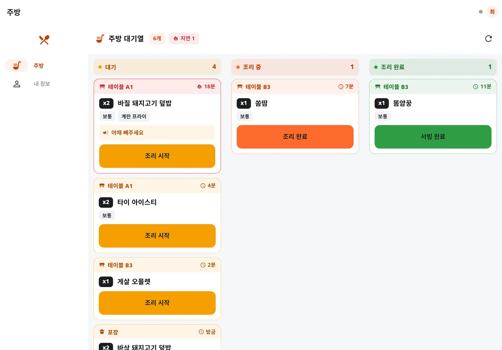
  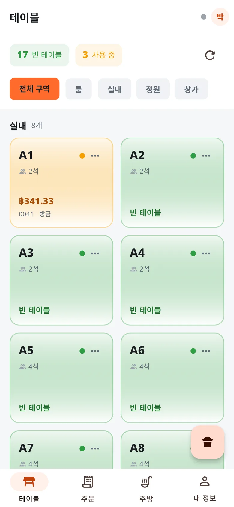
</p>

**가게가 겪는 문제** — 피크 때 직원이 종이 주문서를 들고 주방으로 뛰어갑니다. 주문서는 사라지고 글씨는 알아보기 힘들고, 주방은 손님이 기다린 순서가 아니라 집어 든 순서대로 요리해요. 그래서 가장 오래 기다린 테이블이 잊힙니다.

**이 세트에 들어 있는 것**

- **색으로 상태를 보여 주는 테이블 배치도** — 빈 테이블, 이용 중, 테이블별 미결제 금액, 실내·창가 구역별 구분.
- **옵션과 메모까지 담은 주문** — 보통 맵기, 계란 프라이 추가, 야채 빼기 — 소리칠 필요 없이 주방에 그대로 전달.
- **실시간 3열 주방 화면** — 조리 대기 → 조리 중 → 서빙 준비. 가장 오래된 주문이 맨 위, 15분을 넘기면 자동으로 빨간 경고.
- **매장·포장·배달을 아이콘으로 구분** — 포장 주문에는 하루 단위 대기번호가 자동으로 붙어요.
- **잘못 누른 건 되돌리기** — 상태를 바꾼 뒤 8초 동안 "실행 취소" 바가 떠요. 매니저를 부를 필요가 없습니다.

✅ **가장 오래 기다린 요리가 늘 맨 위에**  
🧪 **데모에서 맛보기:** 데모를 열고 "홀 직원"을 선택 → 빈 테이블을 눌러 메뉴를 고르고 주방으로 전송 → 로그아웃 후 "주방" 선택 — 방금 보낸 주문이 조리 대기 열에 떠요

### 2. 🙋 셀프 주문 세트

<p align="center">
  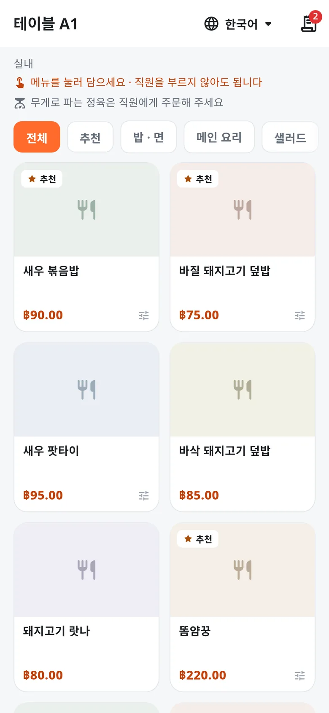
</p>

**가게가 겪는 문제** — 대형 식당은 거의 매 근무마다 홀 직원이 부족합니다. 손님은 메뉴판을, 주문 받을 사람을, 추가 주문을 기다리고 — 기다리는 1분 1분이 테이블 회전을 늦춥니다.

**이 세트에 들어 있는 것**

- **테이블 QR을 찍고 바로 주문** — 휴대폰 브라우저에서 열려요. 앱 설치도, 가입이나 로그인도 필요 없습니다.
- **직원 주문과 같은 경로** — 주방 화면에 올라가고 재료 재고도 똑같이 차감돼요. 따로 맞춰 볼 두 번째 시스템이 없습니다.
- **손님이 자기 테이블 주문을 확인** — 언제든 추가 주문하고 지금까지 주문한 내역을 볼 수 있어요.
- **끊긴 링크는 솔직하게** — 잘못된 QR이나 사용 중지된 테이블이면 손님에게 쓸 수 없다고 알려요. 떠도는 주문이 주방에 들어가지 않습니다.
- **매니저가 QR 교체** — 배치도에서 테이블을 길게 눌러 QR을 보고, 링크를 복사하거나 새 QR로 바꿀 수 있어요.

✅ **앉자마자 주문 시작**  
🧪 **데모에서 맛보기:** 데모를 열고 "매니저"를 선택한 뒤 테이블 화면으로 → 아무 테이블이나 길게 누르기 → "셀프 주문 QR 보기" → "링크 복사" → 새 탭에서 링크를 열고 손님처럼 주문

### 3. 💸 빠른 계산 세트

<p align="center">
  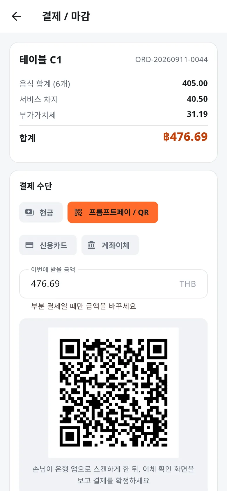
</p>

**가게가 겪는 문제** — 캐셔가 이체 금액을 손으로 입력하다 한 자리만 틀려도 환불을 쫓아다녀야 합니다. 친구들은 각자 낼 몫을 원하고, 할인과 봉사료는 카운터 앞에서 직접 나눠야 하죠.

**이 세트에 들어 있는 것**

- **EMV 표준 프롬프트페이 QR** — 계산서 금액이 QR에 담겨요. 손님은 은행 앱으로 스캔만 하면 되고, 아무도 금액을 입력하지 않아요.
- **결제 수단별·품목별 분할** — 한 계산서에 현금, QR, 카드. 할인·봉사료·VAT는 비율대로 자동 배분.
- **테이블 이동과 합치기** — 손님이 자리를 옮기거나 테이블을 합쳐도 주문이 그대로 따라가요.
- **감열 프린터로 태국어 영수증** — 같은 LAN/Wi-Fi의 ESC/POS 프린터, 58mm·80mm 용지.
- **간이 세금계산서** — 태국 불기 연도 기준 일련번호. 잘못 발행한 건 이력을 남긴 채 취소.

✅ **QR 금액이 계산서와 사땅(1/100바트) 단위까지 일치**  
🧪 **데모에서 맛보기:** 데모를 열고 "캐셔"를 선택 → 손님이 있는 테이블을 눌러 결제로 → "프롬프트페이 / QR" 선택 — 그 계산서 금액으로 QR이 바로 생성돼요

### 4. 🔒 정직한 현금 서랍 세트

<p align="center">
  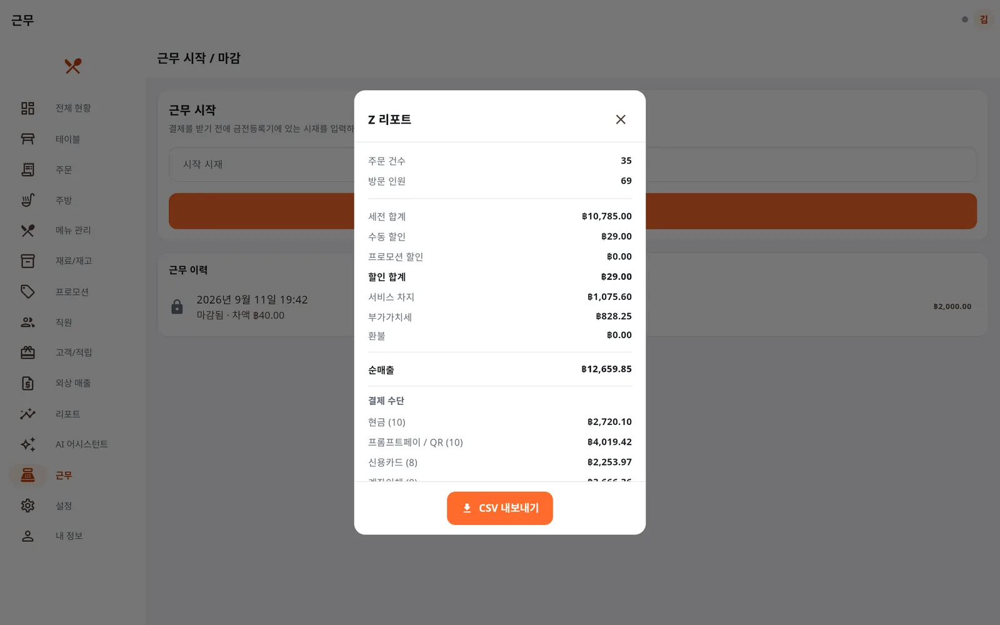
  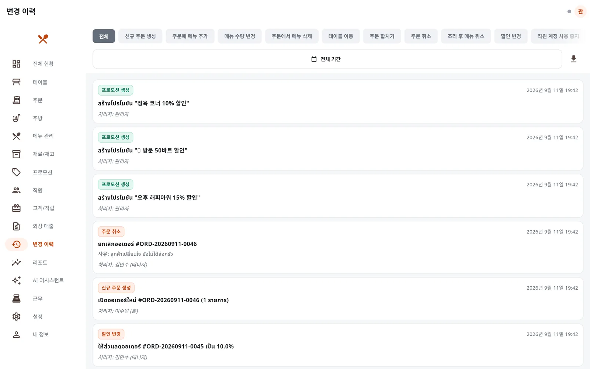
</p>

**가게가 겪는 문제** — 결제 후 취소, 권한을 넘는 할인, 사유 없는 환불. 대형 식당은 현금을 만지는 손이 많아서, 금액이 안 맞아도 무슨 일이 있었는지 증거가 없습니다.

**이 세트에 들어 있는 것**

- **근무를 열어야 결제 가능** — 시작 시재를 넣고, 모든 결제가 열려 있는 근무에 묶여요.
- **마감하면 즉시 대조** — 실제 현금을 세면 있어야 할 금액과 차액을 시스템이 계산해요.
- **근무별·일별 Z 리포트** — 매출, 세금, 프로모션과 구분된 수동 할인, 결제 수단, 외상 회수액. 회계용 CSV 내보내기.
- **누구도 고칠 수 없는 이력** — 주문 취소, 할인, 환불, 가격 수정, 권한 변경을 누가, 언제, 왜 했는지 매번 기록.
- **서버에서 강제하는 5가지 역할** — 버튼만 숨기는 게 아니라, 요청을 직접 보내도 거절됩니다.

✅ **40바트만 모자라도 마감 때 바로 보임**  
🧪 **데모에서 맛보기:** 데모를 열고 "매니저" 선택 후 "근무" 메뉴로 → "근무 마감"을 누르고 센 금액을 조금 모자라게 입력한 뒤, 이력에서 그 근무를 눌러 Z 리포트 확인 → "관리자"로 다시 들어가 "변경 이력" 확인

### 5. 📦 품절 걱정 없는 세트

<p align="center">
  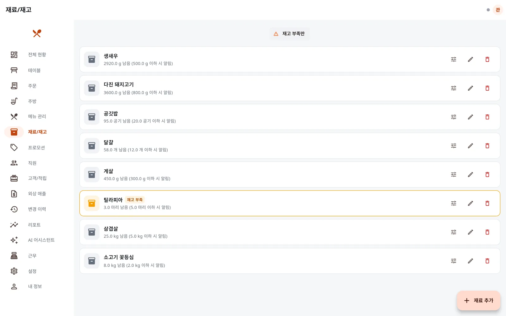
</p>

**가게가 겪는 문제** — 생선은 저녁 8시에 떨어졌는데 메뉴는 여전히 판매 중. 직원이 세 테이블 주문을 받은 뒤에야 주방이 알려 옵니다 — 시간도 손님 기분도 잃어요.

**이 세트에 들어 있는 것**

- **메뉴와 재료 연결** — 주방으로 보낼 때 차감, 취소나 삭제 시 자동 복원. 주방이 실제로 세는 단위 그대로.
- **떨어지면 판매 중지** — 재료가 부족하면 그 메뉴는 바로 판매 중지, 재고를 채우면 다시 판매.
- **재고 부족 알림** — 재료별 경고 기준을 두고, 오픈 전에 부족한 것만 걸러 보기.
- **셀프 주문에도 동일하게** — 손님이 직접 주문해도 같은 경로로 재고가 차감돼요.

✅ **메뉴를 손으로 끌 사람이 필요 없음**  
🧪 **데모에서 맛보기:** 데모를 열고 "관리자" → "재료/재고" → "재고 부족만"을 누르면 틸라피아가 이미 경고 기준 아래로 설정되어 있어요 → 틸라피아 재고를 0으로 바꾸고, 이 생선을 쓰는 메뉴가 판매 중지되는 걸 확인

### 6. 🥩 정육 코너 + 도매 세트

<p align="center">
  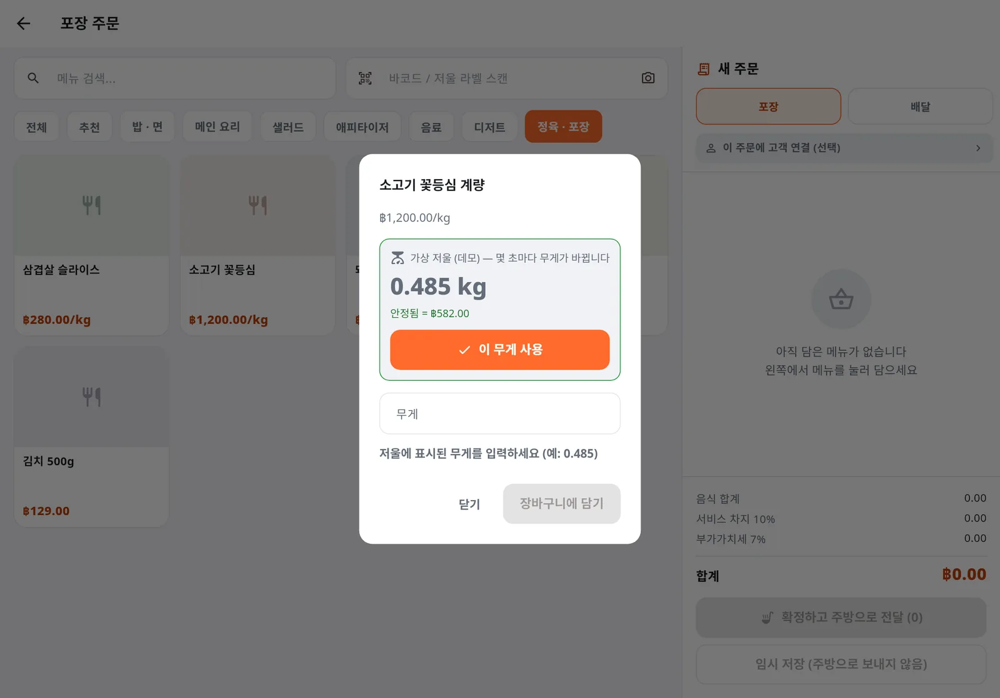
  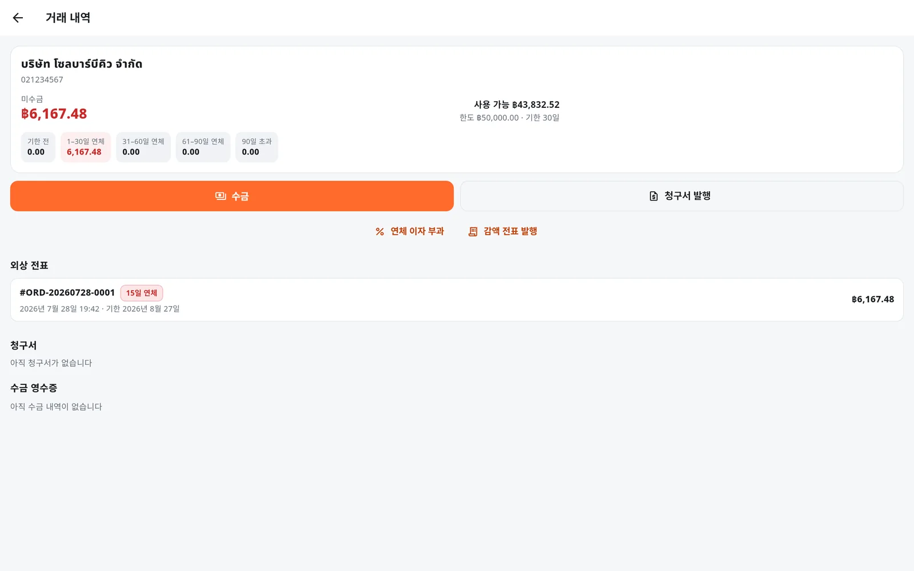
</p>

**가게가 겪는 문제** — 무게는 손으로 적고 가격은 계산기로. 도매 외상은 장부에 있고, 받으러 갈 때가 되면 어느 계산서가 며칠 연체됐는지 아무도 모릅니다.

**이 세트에 들어 있는 것**

- **무게 판매, 저울에서 실시간으로** — kg당 가격. 매장 서버에 연결된 저울이 무게를 화면으로 보내고, 직접 입력도 가능. 담기 전에 가격 확인.
- **저울 라벨과 바코드 스캔** — USB·블루투스 스캐너나 휴대폰 카메라. EAN-13 라벨은 품목과 무게를 함께 담고, 잘못 읽으면 추측하지 않고 경고.
- **한도와 결제 기한 안에서 외상** — 한도를 넘으면 결제 불가. 연령별 미수금, 청구서, 오래된 계산서부터 정산.
- **연체 이자와 대변표를 태국어 PDF로** — 금액은 글자로, 날짜는 불기로, 고객에게 바로 이메일.
- **외상 회수액도 서랍 현금과 대조** — Z 리포트가 외상 회수액을 그날 매출과 따로 보여 줘요.

✅ **0.485kg × ฿1,200 = ฿582, 계산기 없이**  
🧪 **데모에서 맛보기:** 데모를 열고 "캐셔" → "포장/배달 주문" → 정육 · 포장 → 소고기 꽃등심을 누르면 가상 저울이 무게를 화면에 보내요 → "매니저"로 들어가 "외상 매출" → 도매 고객 소울바비큐 주식회사

> 🏷 데모의 저울 라벨 `2000101012504` (삼겹살 슬라이스 1.250kg × 280 = 350바트) — 데모의 스캔 칸에 입력하거나 스캔해 보세요. 랜딩 페이지에는 화면에서 바로 스캔되는 실제 EAN-13 바코드로 그려져 있습니다.

### 7. 📊 실시간 매출 세트

<p align="center">
  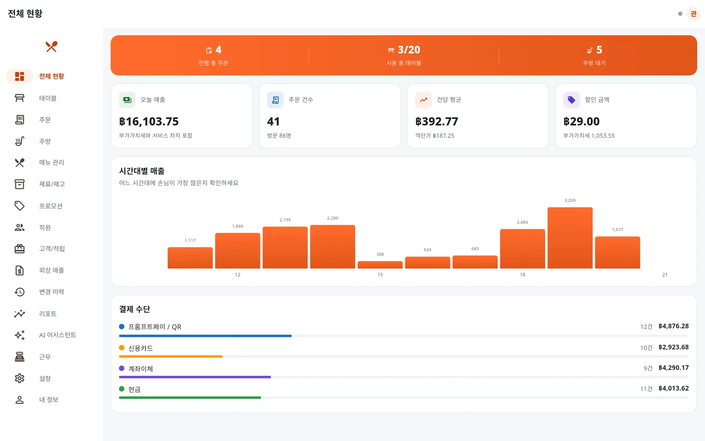
</p>

**가게가 겪는 문제** — 대형 식당 사장님은 매일 사람과 재료를 결정하지만, 숫자는 문을 닫은 뒤에야 오거나 지점별 요약을 기다려야 합니다.

**이 세트에 들어 있는 것**

- **실시간 대시보드** — 매출, 계산서 수, 객단가, 할인, 시간대별 그래프, 결제 수단 비율.
- **기간 리포트 + CSV** — 인기 메뉴, 일별·카테고리별 매출. CSV는 엑셀에서 태국어가 깨지지 않게.
- **여러 지점을 하나의 시스템에서** — 테이블, 메뉴, 주문, 재고, 리포트를 지점별로. 관리자는 전 지점 합계도 확인 (웹 데모는 지점 하나).
- **문장으로 묻기** — AI 어시스턴트가 실제 매장 데이터로 답해요 — 다음 섹션 참고.

✅ **영업 중에 오늘을 파악**  
🧪 **데모에서 맛보기:** 데모를 열고 "관리자" 선택 — 첫 화면이 전체 현황 → "리포트"에서 기간을 고르고 CSV 내보내기

### 8. 🎁 프로모션 + 적립 세트

<p align="center">
  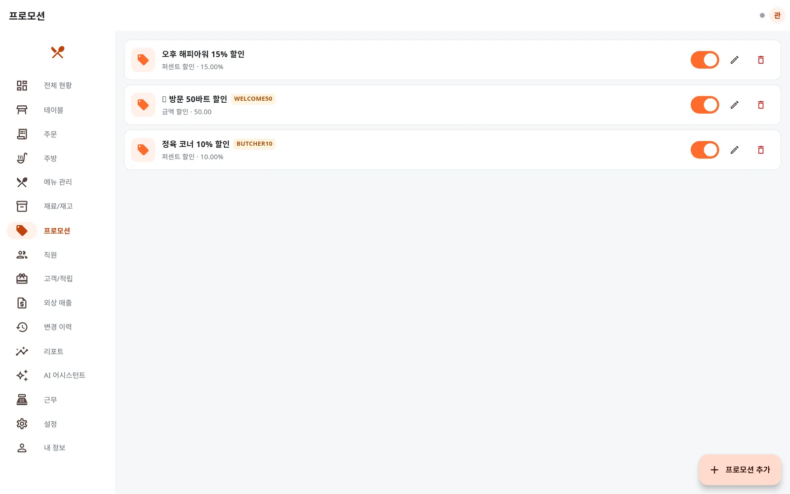
  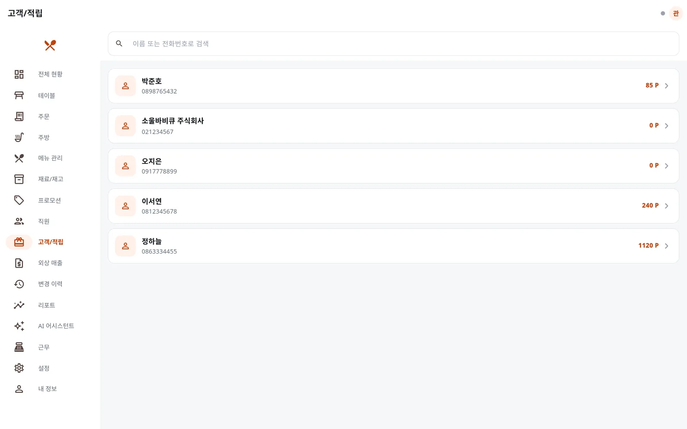
</p>

**가게가 겪는 문제** — 오후 해피아워, 첫 방문 코드, 일부 메뉴 1+1 — 홀이 바빠지면 직원이 할인을 빠뜨리거나 잘못 적용합니다.

**이 세트에 들어 있는 것**

- **조건부 프로모션** — 요일과 시간대, 카테고리나 메뉴, 최소 금액, 할인 코드, 1+1 — 조건에 맞는 계산서에 자동 적용.
- **자동 포인트 적립** — 주문 받을 때 이름이나 전화번호로 손님을 찾고, 구매 금액만큼 적립, 결제 때 할인으로 사용.
- **손님별 구매 이력** — 단골이 무엇을 얼마나 자주 주문하는지.
- **프로모션 변경도 모두 기록** — 생성, 수정, 중지가 변경 이력에 남아요.

✅ **직원이 프로모션 조건을 외울 필요 없음**  
🧪 **데모에서 맛보기:** 데모를 열고 "관리자" → "프로모션" → 프로모션 추가 → 지금 시간이 포함되게 설정한 뒤 새 계산서를 열면 할인이 알아서 붙어요 → "고객/적립"에서 손님별 포인트 확인

### 9. 🌧 진짜 현장 세트

<p align="center">
  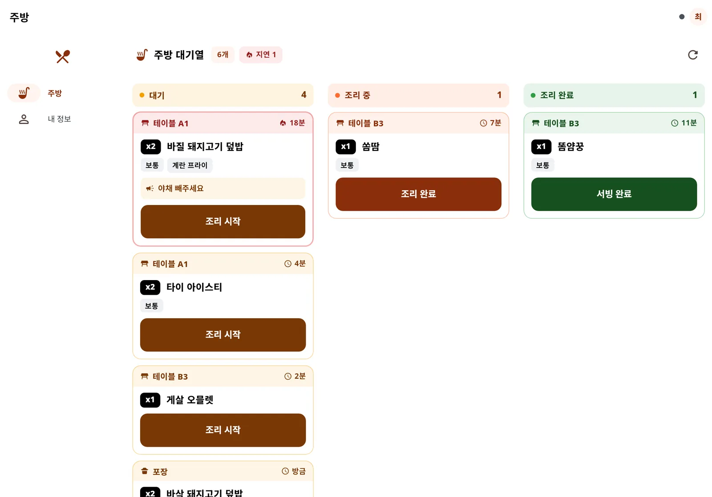
</p>

**가게가 겪는 문제** — 에어컨 나오는 사무실에서는 화면이 멋져 보여요. 하지만 실제 매장에는 유리에 비치는 햇빛, 수증기, 웍을 든 손, 영업 중 끊기는 Wi-Fi, 그리고 태국어가 서툰 직원이 있습니다.

**이 세트에 들어 있는 것**

- **고대비 모드** — 주방 상태 라벨 대비 8.77:1 (WCAG AA 기준은 4.5:1). 내 정보 화면에서 설정하고 기기마다 기억.
- **바쁜 손을 위한 큰 버튼** — 주방의 상태 버튼은 휴대폰 버튼보다 거의 두 배 커요.
- **인터넷이 끊겨도 주문 접수** — 기기에 보관했다가 연결되면 자동 동기화. 주방 화면은 전체 폭 경고를 띄우고 30초마다 주문을 다시 가져와요.
- **ไทย · English · 한국어** — 기기마다 언어를 고르고, 메뉴 이름도 그 언어로.
- **휴대폰, 태블릿, 컴퓨터를 하나의 시스템으로** — 이미 가진 기기를 그대로. 특정 브랜드 하드웨어가 필요 없어요.

✅ **상태 라벨 대비 8.77:1, 햇빛 아래서도 또렷**  
🧪 **데모에서 맛보기:** 아무 역할로 데모를 열고 "내 정보"로 → "화면 대비"를 "높음"으로 바꾸고 언어도 바꿔 보기

<!-- stories:end -->

> 메뉴 이름이 태국 음식인 것은 예시 데이터가 태국 식당이기 때문입니다 —
> 메뉴와 구역 이름은 매장에서 입력하신 문자 그대로 표시됩니다.

---

## 기능

### 홀 직원 (휴대폰 / 태블릿)
- 구역별로 나뉜 테이블 배치도, 빈 테이블과 사용 중인 테이블을 색으로 구분
- 옵션(맵기, 추가 선택)과 주방 메모를 붙여 주문
- 포장·배달 주문은 테이블 없이 버튼 하나로 열 수 있고, 포장이면 당일 대기번호 자동 부여
- 연결이 끊겨도 기존 주문에 메뉴 추가 가능, 복구되면 자동 동기화
- **무게 단위 판매** — kg당 가격 상품은 저울에 표시된 무게(예: 0.485)를 입력하면 가격이 바로 계산되고,
  봉지마다 별도 줄로 담깁니다. 주방 티켓과 영수증에 무게가 찍힙니다
- **바코드 · 저울 라벨 스캔** — USB/블루투스 스캐너로 상품 바코드를 찍으면 1개, 무게가 들어 있는
  EAN-13 저울 라벨을 찍으면 무게까지 자동 입력됩니다. 체크 디지트가 틀린 라벨은 추측하지 않고 경고합니다
- **케이블로 연결한 저울 실시간 읽기** — 저울을 매장 서버에 USB/RS-232 케이블이나 LAN으로 연결하면 무게 입력
  창에 **"저울 (실시간)"** 패널이 뜹니다. 값이 흔들리는 동안에는 **"이 무게 사용"** 버튼이 잠겨 있고, 안정되면
  한 번 눌러 바로 담깁니다. 매장의 모든 기기가 같은 무게를 실시간으로 봅니다 (데모에는 가상 저울이 있어 바로 써보실
  수 있습니다)
- **휴대폰 카메라로 스캔** — 스캔 칸 끝의 카메라 버튼(Android/iOS/웹)으로 바코드와 저울 라벨을 읽습니다.
  스캐너로 찍은 것과 똑같이 처리되고, 손전등 버튼이 있으며, 카메라가 없는 기기에는 버튼이 나타나지 않습니다

### 손님 (테이블 QR — 로그인 불필요)
- QR을 찍으면 그 테이블의 메뉴가 바로 열립니다
- 장바구니에 담아 직접 주방으로 전달
- 직원이 넣은 주문과 완전히 같은 경로로 처리됩니다 (재고 차감, 프로모션 적용 포함)
- 무게를 달아야 하는 정육 상품은 손님 메뉴에 나타나지 않습니다
- 무게로 파는 정육은 QR 메뉴에 나오지 않는 대신, "무게로 파는 정육은 직원에게 주문해 주세요" 안내가 표시됩니다

### 주방
- 대기 / 조리 중 / 조리 완료 세 개 열
- 가장 오래 기다린 주문이 항상 맨 위
- 15분을 넘기면 자동으로 경고 표시
- 매장·포장·배달을 아이콘으로 첫눈에 구분
- **잘못 누른 상태는 되돌리기** — 상태를 바꾸면 화면 아래에 8초 동안 **"되돌리기"** 막대가 떠서 한 단계 되돌릴 수
  있습니다 (조리 중 → 대기, 조리 완료 → 조리 중). 서빙 완료는 되돌릴 수 없습니다

### 캐셔
- 분할 결제, 테이블 이동, 합산 결제 — 음식값·할인·서비스 차지·부가가치세를 비율대로 자동 배분
- 현금, 신용카드, 계좌이체, **프롬프트페이 QR** — 신용 한도가 있는 거래처에는 **외상** 결제도
  (한도 초과 시 결제 버튼 비활성, 만기일 자동 계산)
- ESC/POS 영수증 프린터로 실제 출력 (58mm·80mm)
- 약식 세금계산서 발행 및 취소
- 전액·부분 환불 (사유 필수, 순매출에서 자동 차감)

### 사장님 / 매니저 (웹)
- 오늘 매출, 시간대별 그래프, 결제 수단 비율이 영업 중에도 실시간 갱신
- 근무 교대와 시재 정산
- 재료 재고 자동 차감, 떨어지면 해당 메뉴 자동 판매 중지
- 조건부 프로모션 (시간대, 메뉴, 최소 금액, 할인 코드, 1+1)
- 고객 · 적립금
- **외상 매출 관리 (B2B)** — 거래처별 신용 한도·결제 기한, 미수금 연령 분석(기한 전/1–30/31–60/61–90/
  90일 초과), 청구서 발행, 오래된 전표부터 차감하는 수금 영수증. 현금 수금은 해당 교대의 금고에 포함되어
  마감 정산이 정확히 맞습니다. 외상 계산서의 적립금은 장부에 올릴 때가 아니라 **외상을 모두 받았을 때**
  적립됩니다 (감액 후 순액 기준, 연체 이자 제외 — 수금 영수증을 취소하면 적립금도 회수)
- **연체 이자 · 감액 전표** (매니저 이상) — 매장이 정한 연이율(0–15%)과 유예일로 청구서별 단리 이자를 미리 보고
  이자 청구서(`LF…`)를 발행합니다. 같은 기간을 두 번 계산하지 않고, 아직 받지 않은 이자만 취소(면제)할 수
  있습니다. 외상 전표를 감액하면 원래 금액 / 올바른 금액 / 차액과 차액의 부가가치세가 적힌 감액 전표(`CN…`)가
  항상 함께 발행됩니다
- **PDF · 이메일 발송** — 청구서, 수금 영수증, 감액 전표, 이자 청구서를 태국어 A4 PDF(금액 문자 표기, 불기
  연도)로 웹에서 내려받고, PDF를 첨부해 거래처에 이메일로 보냅니다. 받는 주소는 고객 정보에서 자동으로 채워지고
  발송 내역이 문서 아래에 남습니다. 취소된 문서는 보낼 수 없습니다 (매장 SMTP 설정 필요, 데모는 발송을 흉내만 냅니다)
- 수정할 수 없는 변경 이력 — 문장은 보는 사람이 고른 언어로 나옵니다 (태국어 원문은 증빙으로 그대로 저장되고 CSV에도 태국어로 나갑니다)
- 여러 지점을 한 계정에서
- 직원 계정 관리 — 역할 변경·사용 중지는 확인 후 적용되고, 본인 계정은 역할을 낮추거나 사용 중지할 수 없습니다
  (잘못 눌러 스스로 잠기는 일을 막습니다)
- **AI 어시스턴트** — 한국어로 물어보면 매장 데이터베이스에 연결된 도구를 호출해
  실제 숫자를 가져와 답합니다. 모델이 추측하지 않습니다

---

## 태국에서 쓰기 위한 것들

한국에서 식당을 하시던 분께는 낯선 항목들이라 따로 정리했습니다.

| 항목 | 설명 |
|---|---|
| **프롬프트페이 (PromptPay)** | 태국 중앙은행이 정한 전국 표준 QR 결제입니다. 한국의 계좌이체 QR과 같은 위치에 있고, 태국에서는 현금 다음으로 일반적입니다. 손님이 QR을 찍어 결제하면 금액이 자동으로 대사됩니다 |
| **부가가치세 7%** | 태국 VAT 표준세율입니다. 한국의 10%와 다릅니다. 세율과 서비스 차지 비율은 매장 설정에서 바꾸실 수 있습니다 |
| **불기(佛紀) 연도** | 태국 공문서는 서기에 543을 더한 불기 연도를 씁니다. 2026년은 태국 문서에서 2569년입니다. 세금계산서 번호도 이 연도를 기준으로 채번합니다 |
| **감액 전표 (ใบลดหนี้)** | 태국에서는 세금계산서를 발행한 매출을 줄일 때 원래 금액, 올바른 금액, 차액, 차액의 부가가치세, 원래 세금계산서 번호, 사유를 적은 감액 전표를 따로 발행해야 합니다. 외상 전표를 감액하면 이 형식대로 자동 발행됩니다 |
| **세금계산서 주소는 태국어** | 화면을 한국어로 쓰셔도 세금계산서에 찍히는 매장 주소와 지점명은 태국어로 유지됩니다. 태국 국세청이 등록된 주소 그대로를 요구하기 때문입니다 |

---

## 보안

POS는 매출과 고객 정보를 동시에 들고 있습니다. 보안은 나중에 붙이는 기능이 아닙니다.

- **OWASP Top 10 점검 완료** — 발견된 7건 모두 수정, 전부 막는 쪽이 기본값
- **권한은 서버에서 막습니다** — 화면에서 버튼을 감추는 것으로 끝내지 않습니다.
  같은 요청을 직접 보내도 서버가 거부합니다
- **비활성화되거나 권한이 바뀐 계정은 즉시 접근을 잃습니다** — 토큰 만료를 기다리지 않습니다
- **코드에 예비 JWT 비밀키가 없습니다**
- **지울 수 없는 변경 이력** — 주문 취소, 할인, 권한 변경, 환불, 메뉴 가격 수정
- **데이터는 매장 안에 있습니다** — 매장의 서버나 PC에서 직접 돌아갑니다
- **로그에 고객 정보가 남지 않습니다** — 이름·전화번호·이메일·사업자 번호·주소·비밀번호·토큰·테이블 QR 토큰, 요청
  본문과 쿼리 문자열은 로그에 기록되지 않습니다 (테스트로 확인). 로그는 PaynEat 생태계 텔레메트리 규약에 따른 JSON이고
  모든 요청에 `x-request-id`가 붙습니다 — 실제 백엔드에 연결하면 오류 메시지 끝에 **요청 ID**가 표시되어, 매장에서 그
  ID로 문제를 알려 주시면 해당 요청의 로그를 바로 찾을 수 있습니다. `/metrics`(Prometheus)는 API와 다른 포트(9464)에
  있고 docker compose가 외부로 열지 않습니다 (`docs/DECISIONS.md` #68)

### 운영 배포 전에 꼭 확인하세요

이 프로젝트는 포트폴리오로 시작했습니다. 그래서 일부 기본값은 그대로 운영에 쓰기에
안전하지 않습니다. **숨기지 않고 코드로 막아두었습니다** — 운영 모드
(`NODE_ENV=production`)에서 데모 비밀번호로 계정을 만들려고 하면 서버가 아예 켜지지 않습니다.

전체 체크리스트는 [SECURITY.md](SECURITY.md)에 있습니다.
취약점은 저장소의 **Security** 탭에서 비공개로 신고해 주세요.

---

## 비용과 라이선스

**무료입니다. 앞으로도 요금제가 생기지 않습니다** — 애초에 저희 서버를 쓰지 않는 구조입니다.

| | |
|---|---|
| 라이선스 | **Apache License 2.0** — 상업적 사용, 수정, 재배포 모두 허용 |
| 월 구독료 | 없음 |
| 단말 수 제한 | 없음 |
| 드는 비용 | 기기 값, 영수증 프린터 값, 설치하실 시간 |
| 전용 하드웨어 | 필요 없음 — 쓰시던 휴대폰·태블릿·PC로 |

포크하거나 고쳐 쓰셔도 좋습니다. Apache License 2.0 조건에 따라
[`NOTICE`](NOTICE) 파일만 남겨주시면 됩니다.

저작권 © 2026 Suruch Chakrapeesirisuk. 모든 소스 파일 첫머리에 저작권 표시와 SPDX 식별자
(`SPDX-License-Identifier: Apache-2.0`)가 있으며, CI가 푸시할 때마다 확인합니다. 외부 기여는 커밋마다
Developer Certificate of Origin(DCO)에 따라 서명(sign-off)해야 합니다 — 방법은
[`CONTRIBUTING.md`](CONTRIBUTING.md#developer-certificate-of-origin-dco)를 참고하세요.

설치·기기 연결·기술 지원·교육이 필요하시면 유료 서비스를 선택하실 수 있습니다. 이용하지 않으셔도 모든 기능을 그대로 쓰실 수 있습니다.

---

## 문의

- **GitHub Issues** — 도입 문의, 기능 요청, 버그 신고 모두 같은 창구를 씁니다.
  한국어로 적으셔도 됩니다. 공개 기록으로 남기 때문에 같은 질문을 가진 다른 매장에도 도움이 됩니다
- **[LinkedIn](https://www.linkedin.com/in/suruchboss)** — 직접 연락을 원하시면

만든 사람: **[SuruchBoss](https://github.com/SuruchBoss)**

---

## 테스트

공개 전 **929건**의 자동화 테스트를 통과합니다.

```bash
cd backend && npm test      # 388건 — 매장 전체 흐름 17단계 테스트 포함
cd app && flutter test      # 492건 — domain / controller / widget
cd app && flutter test test_e2e   # 49건 — 실제 앱 ↔ 실제 백엔드 (먼저 backend에서 npm ci)
```

`app/test_e2e/`의 E2E 49건은 실제 백엔드(`node src/server.js`)를 매번 새 임시 DB로 띄우고, 앱의
실제 data/domain 코드가 매장의 하루를 처음부터 끝까지 진행합니다 — 로그인, 주문, 주방, 근무 시작,
결제, 세금계산서, 환불, 근무 마감(차액 0), Z-report와 CSV, 감사 로그, 그리고 손님의 QR 주문과
지점·권한까지. 다른 Flutter 테스트는 모두 데모 모드에서 돌기 때문에, 앱이 **백엔드가 실제로 보낸
JSON을 읽는** 테스트는 이것뿐입니다. 첫 실행에서 기존 659건이 모두 통과하던 실제 버그 5개를 찾아
모두 고쳤습니다 (`docs/DECISIONS.md` #43–#47). 정육 카운터와 거래처 시나리오도 따로 있습니다 — 저울
라벨 스캔 → 장바구니 금액이 백엔드와 1사땅 단위까지 일치 → 한도 초과 외상 거부 → 외상 판매 시 kg 단위
재고 차감 → 청구서 → 현금 수금 → 교대 마감 차액 0 (`meat_shop_b2b_e2e_test.dart`). 테스트가 직접 TCP
"저울"을 열고 실제 백엔드가 거기에 연결하는 시나리오도 있습니다 — 흔들리는 무게는 못 쓰고 안정된 무게만 사용 →
그 무게로 외상 판매 → 20일 연체·유예 5일이면 정확히 15일치 이자 → 감액 전표로 부가가치세 분리 → 모든 문서가 실제
PDF로 내려받아짐 → 청구서 이메일 발송 (`scale_documents_e2e_test.dart`).

로그와 메트릭은 `telemetry-log-record.test.js`(13건 — 규약의 규칙)와 `telemetry.test.js`(11건)가 실제 앱이 쓴 로그 줄을
직접 검사합니다 — 두 가지 형식, `x-request-id` 왕복, 상태 코드별 severity, route template별 `/metrics`, 그리고 로그인·고객
등록·수정·전화번호 검색 후에도 이름·전화번호·이메일·비밀번호가 로그에 없는지. 앱 쪽 `request_id_error_test.dart`(5건)는
오류 메시지 끝의 요청 ID가 실제로 보낸 ID와 같은지 확인합니다 (`docs/DECISIONS.md` #68).

한국어 지원에도 전용 테스트가 있습니다:

- `korean_font_coverage_test.dart` — 내장한 한글 폰트에 화면에 뜨는 모든 글자의
  글리프가 실제로 있는지 폰트 파일의 cmap 테이블을 직접 읽어 확인합니다 (재료·메뉴 설명 번역을 추가하자
  빠져 있던 8글자 `깃걀틸끈짠쌀걸쭉`을 바로 잡아냈고, 폰트를 다시 subset했습니다). 또 모든 굵기에 KS X 1001
  한글 2,350자와 입력 중에 보이는 자모가 다 있는지 확인합니다 — 예전 폰트를 다시 넣으면 474자뿐이라 실패합니다
  (`docs/DECISIONS.md` #74)
- `audit_summary_text_test.dart`, `demo_store_test.dart` — 변경 이력 문장을 `metadata.summaryArgs`로 다시 만들었을 때
  태국어는 저장된 문장과 한 글자도 다르지 않고, 한국어·영어에는 사용자가 입력한 값 말고는 태국어가 남지 않는지
  데모 모드가 만든 **모든** 로그로 확인합니다. 백엔드의 `audit-summary-args.test.js`는 로그를 쓰는 모든 곳이
  `summaryArgs`를 넘기는지 소스를 직접 읽어 확인합니다
- `cart_panel_locale_test.dart` — 장바구니에 담긴 메뉴 이름이 선택한 언어로 보이는지 확인합니다
- `destructive_labels_test.dart` — 문서 "발행 취소" 버튼이 일반 "취소"/"닫기" 버튼과 같은 이름이 되지 않도록 모든 언어에서
  확인합니다 (예전에는 둘 다 "취소"여서, 대화상자를 닫으려다 영수증을 취소할 수 있었습니다)
- `korean_leak_test.dart` — 한국어를 선택했을 때 태국어 글자가 화면에 남아 있지 않은지 확인합니다.
  메뉴 설명, 재료 이름·단위, 옵션 이름까지 화면으로 나가는 데이터를 직접 검사합니다
  (단, 세금계산서 주소와 지점명은 태국어로 남아야 하므로 반대로 검사합니다)
- `locale_service_test.dart` — 저장된 언어가 다음 실행에서 그대로 복원되는지 확인합니다
  (처음 실행할 때는 기기 언어 — 한국어 기기면 한국어로 시작합니다)
- `error-i18n.test.js` (백엔드) — 소스 전체를 훑어 영어/한국어 번역이 없는 태국어 오류 메시지가 있으면 실패합니다.
  실제 HTTP 응답이 `Accept-Language`를 따르는지도 확인합니다
- `uat_affordances_test.dart` — 설명 없이 처음 쓰는 사람을 위한 부분을 지킵니다: 지구본 버튼이 현재 언어를 그 언어로
  표시하고 세 언어를 모두 보여 주는지, 긴 한국어 설명이 들어간 통계 카드가 360px 화면에서도 넘치지 않는지, 테이블
  카드에 길게 누르지 않아도 보이는 ⋯ 버튼이 있는지
