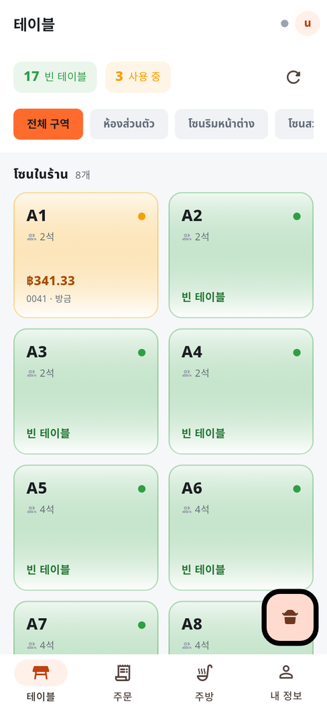
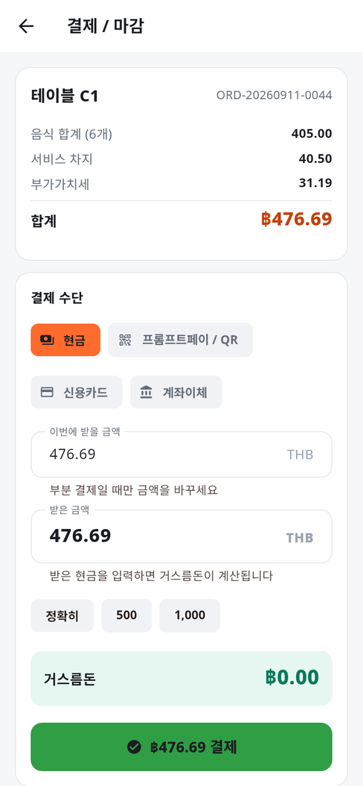
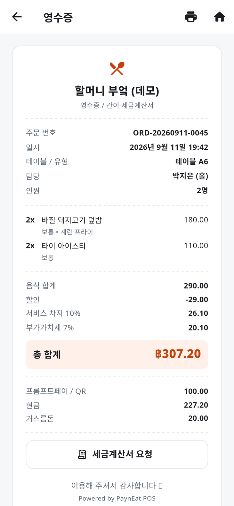
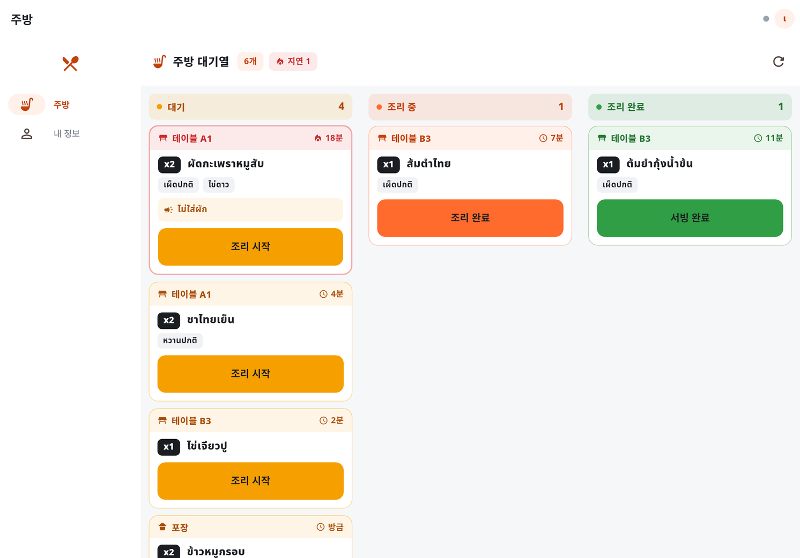
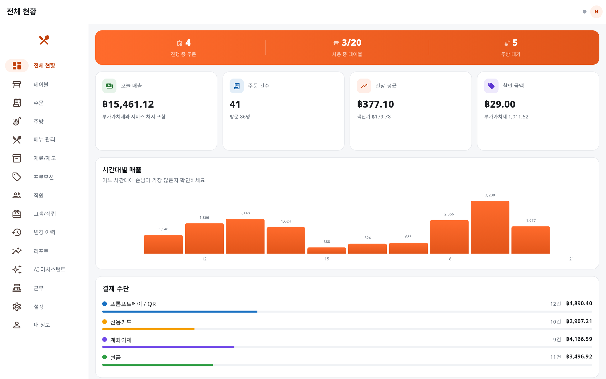
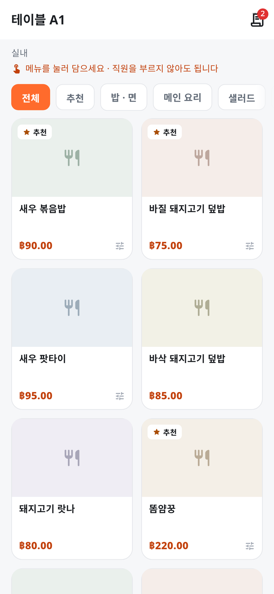
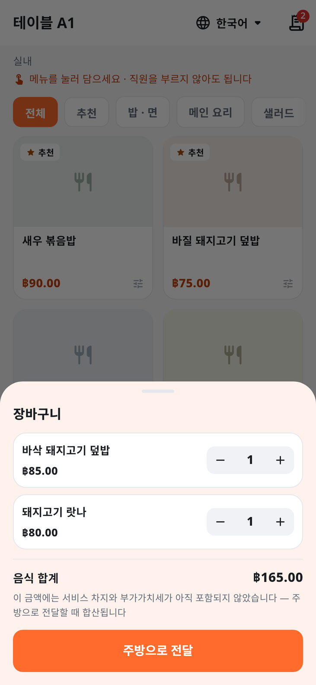
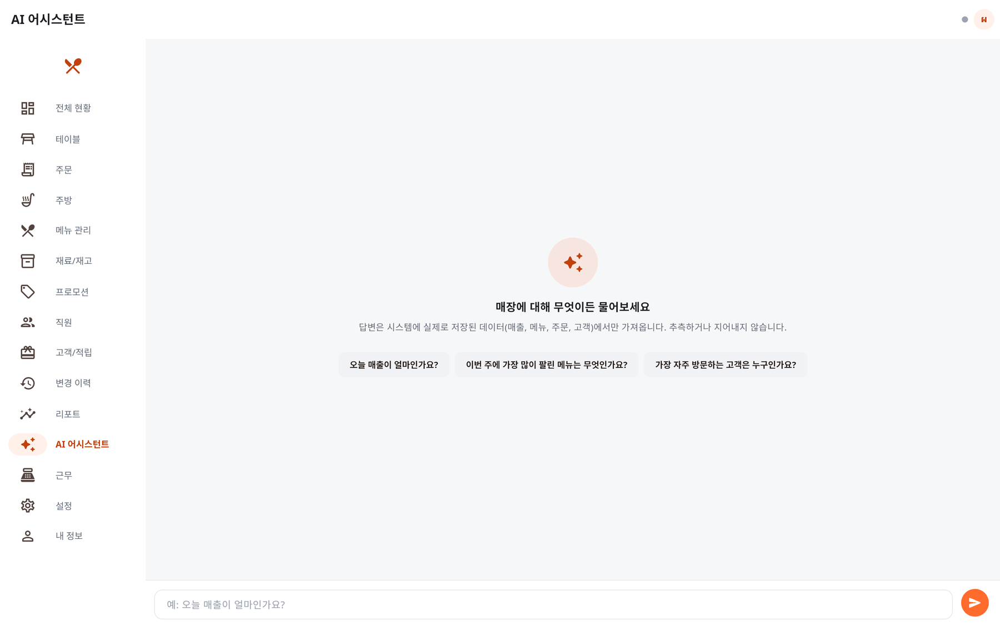

# 🍽️ PaynEat POS — 레스토랑 매장 판매 시스템

**언어:** [ไทย](README.md) · [English](README.en.md) · 한국어

> 주문부터 마감까지 한 시스템에서 돌아갑니다. 홀 직원이 태블릿으로 주문을 받으면
> 주방 화면에 바로 뜨고, 캐셔가 결제를 마치면 사장님이 웹에서 매출을 확인합니다.
>
> **Flutter (GetX + Clean Architecture)** + **Node.js / Express + SQLite + Socket.IO**
> — 하나의 코드베이스로 Android, iOS, 웹에서 모두 동작합니다.

<p align="center">
  
  
  
  
  <a href="LICENSE"></a>
</p>

<p align="center">
  <b><a href="https://suruchboss.github.io/PaynEat/index.ko.html">한국어 소개 페이지</a></b> ·
  <b><a href="https://suruchboss.github.io/PaynEat/app/">데모 바로 써보기</a></b>
</p>

> 📌 **이 문서는 도입을 검토하시는 분께 필요한 내용을 중심으로 정리했습니다.**
> 아키텍처, 데이터베이스 스키마, API 레퍼런스 같은 깊은 기술 문서는 분량이 큰 관계로
> [태국어](README.md)와 [영어](README.en.md) 문서에만 있습니다. 필요하시면 Issues에 남겨주세요.

---

## 어떤 시스템인가요

태국 방콕의 식당에서 실제로 벌어지는 네 가지 조건을 기준으로 설계했습니다.
조용한 사무실의 깨끗한 화면이 기준이 아닙니다.

| 조건 | 설계에 반영한 것 |
|---|---|
| 창가 자리의 직사광선 | 글자 색을 버튼마다 실제 배경색에서 계산해 고릅니다. 고대비 모드는 계정 화면에서 바로 켤 수 있습니다 |
| 주방 모니터의 수증기 | 3미터 거리에서도 읽히는 크기. 색은 장식이 아니라 우선순위를 나타냅니다 |
| 기름 묻은 손 | 주방의 상태 변경 버튼은 같은 기능의 휴대폰 버튼보다 거의 두 배 큽니다 |
| 끊기는 와이파이 | 연결이 끊기면 전체 너비 경고 띠가 뜨고, 30초마다 직접 주문을 가져옵니다 |

---

## 지금 바로 써보기

설치도 가입도 필요 없습니다. 역할을 고르면 바로 들어갑니다.

### 👉 [데모 열기](https://suruchboss.github.io/PaynEat/app/)

데모에는 매장 데이터가 이미 들어 있습니다 — 테이블, 메뉴, 지난 주문,
그리고 리포트를 볼 수 있을 만큼의 매출까지.

**화면 오른쪽 위 또는 내 정보 화면에서 언어를 한국어로 바꾸실 수 있습니다.**
메뉴 이름, 카테고리, 구역 이름, 옵션까지 전부 한국어로 바뀝니다.

### 계정

로그인 화면에 버튼이 있어 직접 입력하지 않으셔도 됩니다.

| 역할 | 아이디 | 비밀번호 | 볼 수 있는 것 |
|---|---|---|---|
| 관리자 | `admin` | `admin123` | 전부 (대시보드, 메뉴 관리, 직원, 리포트, 설정) |
| 매니저 | `manager` | `manager123` | 관리자와 같지만 계정 삭제는 불가 |
| 홀 직원 | `waiter1` | `waiter123` | 테이블 배치도, 주문, 주방 |
| 주방 | `kitchen` | `kitchen123` | 주방 화면만 |
| 캐셔 | `cashier` | `cashier123` | 테이블 배치도, 주문, 리포트 |

> ⚠️ **이 계정들은 둘러보기 전용입니다.** 실제 운영에 배포하실 때는 반드시 비밀번호를
> 바꾸거나 `AUTO_SEED`를 끄셔야 합니다 — 안 바꾸면 서버가 켜지지 않도록 막아두었습니다.
> 자세한 내용은 [SECURITY.md](SECURITY.md)에 있습니다.

---

## 화면

<table>
<tr>
<td align="center" width="33%"><b>테이블 배치도</b><br>
</td>
<td align="center" width="33%"><b>결제</b><br>
</td>
<td align="center" width="33%"><b>영수증</b><br>
</td>
</tr>
</table>

<p align="center"><b>주방 화면 (태블릿 가로 모드)</b><br>
</p>

<p align="center"><b>관리자 대시보드 (웹)</b><br>
</p>

<p align="center"><b>손님이 QR을 찍고 직접 주문하는 화면</b><br>

</p>

<p align="center"><b>AI 어시스턴트</b><br>
</p>

> 이 화면 사진은 모두 golden 테스트로 실제 앱에서 찍은 것입니다. 목업이 아닙니다.
> 메뉴 이름이 태국 음식인 것은 예시 데이터가 태국 식당이기 때문입니다 —
> 메뉴와 구역 이름은 매장에서 입력하신 문자 그대로 표시됩니다.

---

## 기능

### 홀 직원 (휴대폰 / 태블릿)
- 구역별로 나뉜 테이블 배치도, 빈 테이블과 사용 중인 테이블을 색으로 구분
- 옵션(맵기, 추가 선택)과 주방 메모를 붙여 주문
- 포장·배달 주문은 테이블 없이 버튼 하나로 열 수 있고, 포장이면 당일 대기번호 자동 부여
- 연결이 끊겨도 기존 주문에 메뉴 추가 가능, 복구되면 자동 동기화
- **무게 단위 판매** — kg당 가격 상품은 저울에 표시된 무게(예: 0.485)를 입력하면 가격이 바로 계산되고,
  봉지마다 별도 줄로 담깁니다. 주방 티켓과 영수증에 무게가 찍힙니다
- **바코드 · 저울 라벨 스캔** — USB/블루투스 스캐너로 상품 바코드를 찍으면 1개, 무게가 들어 있는
  EAN-13 저울 라벨을 찍으면 무게까지 자동 입력됩니다. 체크 디지트가 틀린 라벨은 추측하지 않고 경고합니다
- **케이블로 연결한 저울 실시간 읽기** — 저울을 매장 서버에 USB/RS-232 케이블이나 LAN으로 연결하면 무게 입력
  창에 **"저울 (실시간)"** 패널이 뜹니다. 값이 흔들리는 동안에는 **"이 무게 사용"** 버튼이 잠겨 있고, 안정되면
  한 번 눌러 바로 담깁니다. 매장의 모든 기기가 같은 무게를 실시간으로 봅니다 (데모에는 가상 저울이 있어 바로 써보실
  수 있습니다)
- **휴대폰 카메라로 스캔** — 스캔 칸 끝의 카메라 버튼(Android/iOS/웹)으로 바코드와 저울 라벨을 읽습니다.
  스캐너로 찍은 것과 똑같이 처리되고, 손전등 버튼이 있으며, 카메라가 없는 기기에는 버튼이 나타나지 않습니다

### 손님 (테이블 QR — 로그인 불필요)
- QR을 찍으면 그 테이블의 메뉴가 바로 열립니다
- 장바구니에 담아 직접 주방으로 전달
- 직원이 넣은 주문과 완전히 같은 경로로 처리됩니다 (재고 차감, 프로모션 적용 포함)
- 무게를 달아야 하는 정육 상품은 손님 메뉴에 나타나지 않습니다

### 주방
- 대기 / 조리 중 / 조리 완료 세 개 열
- 가장 오래 기다린 주문이 항상 맨 위
- 15분을 넘기면 자동으로 경고 표시
- 매장·포장·배달을 아이콘으로 첫눈에 구분

### 캐셔
- 분할 결제, 테이블 이동, 합산 결제 — 음식값·할인·서비스 차지·부가가치세를 비율대로 자동 배분
- 현금, 신용카드, 계좌이체, **프롬프트페이 QR** — 신용 한도가 있는 거래처에는 **외상** 결제도
  (한도 초과 시 결제 버튼 비활성, 만기일 자동 계산)
- ESC/POS 영수증 프린터로 실제 출력 (58mm·80mm)
- 약식 세금계산서 발행 및 취소
- 전액·부분 환불 (사유 필수, 순매출에서 자동 차감)

### 사장님 / 매니저 (웹)
- 오늘 매출, 시간대별 그래프, 결제 수단 비율이 영업 중에도 실시간 갱신
- 근무 교대와 시재 정산
- 재료 재고 자동 차감, 떨어지면 해당 메뉴 자동 판매 중지
- 조건부 프로모션 (시간대, 메뉴, 최소 금액, 할인 코드, 1+1)
- 고객 · 적립금
- **외상 매출 관리 (B2B)** — 거래처별 신용 한도·결제 기한, 미수금 연령 분석(기한 전/1–30/31–60/61–90/
  90일 초과), 청구서 발행, 오래된 전표부터 차감하는 수금 영수증. 현금 수금은 해당 교대의 금고에 포함되어
  마감 정산이 정확히 맞습니다. 외상 계산서의 적립금은 장부에 올릴 때가 아니라 **외상을 모두 받았을 때**
  적립됩니다 (감액 후 순액 기준, 연체 이자 제외 — 수금 영수증을 취소하면 적립금도 회수)
- **연체 이자 · 감액 전표** (매니저 이상) — 매장이 정한 연이율(0–15%)과 유예일로 청구서별 단리 이자를 미리 보고
  이자 청구서(`LF…`)를 발행합니다. 같은 기간을 두 번 계산하지 않고, 아직 받지 않은 이자만 취소(면제)할 수
  있습니다. 외상 전표를 감액하면 원래 금액 / 올바른 금액 / 차액과 차액의 부가가치세가 적힌 감액 전표(`CN…`)가
  항상 함께 발행됩니다
- **PDF · 이메일 발송** — 청구서, 수금 영수증, 감액 전표, 이자 청구서를 태국어 A4 PDF(금액 문자 표기, 불기
  연도)로 웹에서 내려받고, PDF를 첨부해 거래처에 이메일로 보냅니다. 받는 주소는 고객 정보에서 자동으로 채워지고
  발송 내역이 문서 아래에 남습니다. 취소된 문서는 보낼 수 없습니다 (매장 SMTP 설정 필요, 데모는 발송을 흉내만 냅니다)
- 수정할 수 없는 변경 이력
- 여러 지점을 한 계정에서
- **AI 어시스턴트** — 한국어로 물어보면 매장 데이터베이스에 연결된 도구를 호출해
  실제 숫자를 가져와 답합니다. 모델이 추측하지 않습니다

---

## 태국에서 쓰기 위한 것들

한국에서 식당을 하시던 분께는 낯선 항목들이라 따로 정리했습니다.

| 항목 | 설명 |
|---|---|
| **프롬프트페이 (PromptPay)** | 태국 중앙은행이 정한 전국 표준 QR 결제입니다. 한국의 계좌이체 QR과 같은 위치에 있고, 태국에서는 현금 다음으로 일반적입니다. 손님이 QR을 찍어 결제하면 금액이 자동으로 대사됩니다 |
| **부가가치세 7%** | 태국 VAT 표준세율입니다. 한국의 10%와 다릅니다. 세율과 서비스 차지 비율은 매장 설정에서 바꾸실 수 있습니다 |
| **불기(佛紀) 연도** | 태국 공문서는 서기에 543을 더한 불기 연도를 씁니다. 2026년은 태국 문서에서 2569년입니다. 세금계산서 번호도 이 연도를 기준으로 채번합니다 |
| **감액 전표 (ใบลดหนี้)** | 태국에서는 세금계산서를 발행한 매출을 줄일 때 원래 금액, 올바른 금액, 차액, 차액의 부가가치세, 원래 세금계산서 번호, 사유를 적은 감액 전표를 따로 발행해야 합니다. 외상 전표를 감액하면 이 형식대로 자동 발행됩니다 |
| **세금계산서 주소는 태국어** | 화면을 한국어로 쓰셔도 세금계산서에 찍히는 매장 주소와 지점명은 태국어로 유지됩니다. 태국 국세청이 등록된 주소 그대로를 요구하기 때문입니다 |

---

## 보안

POS는 매출과 고객 정보를 동시에 들고 있습니다. 보안은 나중에 붙이는 기능이 아닙니다.

- **OWASP Top 10 점검 완료** — 발견된 7건 모두 수정, 전부 막는 쪽이 기본값
- **권한은 서버에서 막습니다** — 화면에서 버튼을 감추는 것으로 끝내지 않습니다.
  같은 요청을 직접 보내도 서버가 거부합니다
- **비활성화되거나 권한이 바뀐 계정은 즉시 접근을 잃습니다** — 토큰 만료를 기다리지 않습니다
- **코드에 예비 JWT 비밀키가 없습니다**
- **지울 수 없는 변경 이력** — 주문 취소, 할인, 권한 변경, 환불, 메뉴 가격 수정
- **데이터는 매장 안에 있습니다** — 매장의 서버나 PC에서 직접 돌아갑니다

### 운영 배포 전에 꼭 확인하세요

이 프로젝트는 포트폴리오로 시작했습니다. 그래서 일부 기본값은 그대로 운영에 쓰기에
안전하지 않습니다. **숨기지 않고 코드로 막아두었습니다** — 운영 모드
(`NODE_ENV=production`)에서 데모 비밀번호로 계정을 만들려고 하면 서버가 아예 켜지지 않습니다.

전체 체크리스트는 [SECURITY.md](SECURITY.md)에 있습니다.
취약점은 저장소의 **Security** 탭에서 비공개로 신고해 주세요.

---

## 비용과 라이선스

**무료입니다. 앞으로도 요금제가 생기지 않습니다** — 애초에 저희 서버를 쓰지 않는 구조입니다.

| | |
|---|---|
| 라이선스 | **Apache License 2.0** — 상업적 사용, 수정, 재배포 모두 허용 |
| 월 구독료 | 없음 |
| 단말 수 제한 | 없음 |
| 드는 비용 | 기기 값, 영수증 프린터 값, 설치하실 시간 |
| 전용 하드웨어 | 필요 없음 — 쓰시던 휴대폰·태블릿·PC로 |

포크하거나 고쳐 쓰셔도 좋습니다. Apache License 2.0 조건에 따라
[`NOTICE`](NOTICE) 파일만 남겨주시면 됩니다.

---

## 문의

- **GitHub Issues** — 도입 문의, 기능 요청, 버그 신고 모두 같은 창구를 씁니다.
  한국어로 적으셔도 됩니다. 공개 기록으로 남기 때문에 같은 질문을 가진 다른 매장에도 도움이 됩니다
- **[LinkedIn](https://www.linkedin.com/in/suruchboss)** — 직접 연락을 원하시면

만든 사람: **[SuruchBoss](https://github.com/SuruchBoss)**

---

## 테스트

공개 전 **861건**의 자동화 테스트를 통과합니다.

```bash
cd backend && npm test      # 354건 — 매장 전체 흐름 17단계 테스트 포함
cd app && flutter test      # 459건 — domain / controller / widget
cd app && flutter test test_e2e   # 48건 — 실제 앱 ↔ 실제 백엔드 (먼저 backend에서 npm ci)
```

`app/test_e2e/`의 E2E 48건은 실제 백엔드(`node src/server.js`)를 매번 새 임시 DB로 띄우고, 앱의
실제 data/domain 코드가 매장의 하루를 처음부터 끝까지 진행합니다 — 로그인, 주문, 주방, 근무 시작,
결제, 세금계산서, 환불, 근무 마감(차액 0), Z-report와 CSV, 감사 로그, 그리고 손님의 QR 주문과
지점·권한까지. 다른 Flutter 테스트는 모두 데모 모드에서 돌기 때문에, 앱이 **백엔드가 실제로 보낸
JSON을 읽는** 테스트는 이것뿐입니다. 첫 실행에서 기존 659건이 모두 통과하던 실제 버그 5개를 찾아
모두 고쳤습니다 (`docs/DECISIONS.md` #43–#47). 정육 카운터와 거래처 시나리오도 따로 있습니다 — 저울
라벨 스캔 → 장바구니 금액이 백엔드와 1사탕 단위까지 일치 → 한도 초과 외상 거부 → 외상 판매 시 kg 단위
재고 차감 → 청구서 → 현금 수금 → 교대 마감 차액 0 (`meat_shop_b2b_e2e_test.dart`). 테스트가 직접 TCP
"저울"을 열고 실제 백엔드가 거기에 연결하는 시나리오도 있습니다 — 흔들리는 무게는 못 쓰고 안정된 무게만 사용 →
그 무게로 외상 판매 → 20일 연체·유예 5일이면 정확히 15일치 이자 → 감액 전표로 부가가치세 분리 → 모든 문서가 실제
PDF로 내려받아짐 → 청구서 이메일 발송 (`scale_documents_e2e_test.dart`).

한국어 지원에도 전용 테스트가 있습니다:

- `korean_font_coverage_test.dart` — 내장한 한글 폰트에 화면에 뜨는 모든 글자의
  글리프가 실제로 있는지 폰트 파일의 cmap 테이블을 직접 읽어 확인합니다 (재료·메뉴 설명 번역을 추가하자
  빠져 있던 8글자 `깃걀틸끈짠쌀걸쭉`을 바로 잡아냈고, 폰트를 다시 subset했습니다)
- `cart_panel_locale_test.dart` — 장바구니에 담긴 메뉴 이름이 선택한 언어로 보이는지 확인합니다
- `destructive_labels_test.dart` — 문서 "발행 취소" 버튼이 일반 "취소"/"닫기" 버튼과 같은 이름이 되지 않도록 모든 언어에서
  확인합니다 (예전에는 둘 다 "취소"여서, 대화상자를 닫으려다 영수증을 취소할 수 있었습니다)
- `korean_leak_test.dart` — 한국어를 선택했을 때 태국어 글자가 화면에 남아 있지 않은지 확인합니다.
  메뉴 설명, 재료 이름·단위, 옵션 이름까지 화면으로 나가는 데이터를 직접 검사합니다
  (단, 세금계산서 주소와 지점명은 태국어로 남아야 하므로 반대로 검사합니다)
- `locale_service_test.dart` — 저장된 언어가 다음 실행에서 그대로 복원되는지 확인합니다
