# 🍽️ PaynEat POS — 레스토랑 매장 판매 시스템

**언어:** [ไทย](README.md) · [English](README.en.md) · 한국어

> 주문 접수부터 영업 마감까지 하나의 시스템에서 처리합니다. 홀 직원이 태블릿으로 받은 주문은
> 즉시 주방 화면에 표시되고, 캐셔가 결제를 완료하면 점주가 웹에서 매출을 확인할 수 있습니다.
>
> **Flutter (GetX + Clean Architecture)** + **Node.js / Express + SQLite + Socket.IO**
> — 하나의 코드베이스로 Android, iOS, 웹에서 모두 동작합니다.

<p align="center">
  
  
  
  
  <a href="LICENSE"></a>
</p>

<p align="center">
  <b><a href="https://suruchboss.github.io/PaynEat/index.ko.html">한국어 소개 페이지</a></b> ·
  <b><a href="https://suruchboss.github.io/PaynEat/app/">온라인 데모</a></b>
</p>

> 📌 **이 문서는 도입 검토에 필요한 내용을 중심으로 구성되어 있습니다.**
> 아키텍처, 데이터베이스 스키마, API 레퍼런스 등 상세 기술 문서는 분량 관계상
> [태국어](README.md) 및 [영어](README.en.md) 문서에서만 제공합니다. 한국어 자료가 필요한 경우 GitHub Issues로 요청해 주십시오.

---

## 시스템 개요

이 시스템은 사무실 환경이 아니라 태국 방콕의 실제 식당 현장에서 발생하는 다음 네 가지 조건을 기준으로 설계되었습니다.

| 현장 조건 | 설계상 대응 |
|---|---|
| 창가 자리의 직사광선 | 버튼별 글자 색을 실제 배경색을 기준으로 계산하여 결정합니다. 고대비 모드는 계정 화면에서 바로 활성화할 수 있습니다 |
| 주방 모니터의 수증기 | 3미터 거리에서도 읽을 수 있는 글자 크기를 사용하며, 색상은 장식이 아니라 우선순위를 나타냅니다 |
| 기름 묻은 손 | 주방 화면의 상태 변경 버튼은 동일 기능의 휴대폰 버튼보다 거의 두 배 큽니다 |
| 불안정한 Wi-Fi | 연결이 끊기면 화면 전체 너비의 경고 띠를 표시하고, 30초마다 주문을 직접 다시 가져옵니다 |

---

## 데모 체험

별도의 설치나 가입 없이, 역할을 선택하면 바로 이용할 수 있습니다.

### 👉 [데모 열기](https://suruchboss.github.io/PaynEat/app/)

데모에는 테이블, 메뉴, 과거 주문, 그리고 리포트를 확인하기에 충분한 매출 데이터가 미리 입력되어 있습니다.

**표시 언어는 로그인 화면 및 QR 메뉴 오른쪽 위의 지구본 버튼, 또는 내 정보 화면에서 한국어로 변경할 수 있습니다.**
최초 실행 시에는 기기의 언어 설정을 따릅니다. 날짜 선택 달력, 기본 버튼, **백엔드가 반환하는 오류 메시지**도
선택한 언어로 표시되며, 메뉴 이름, 카테고리, 구역 이름, 옵션도 모두 한국어로 전환됩니다.
**변경 이력**의 문장도 한국어로 표시됩니다. 거래처·고객 이름 등 매장에서 입력하는 데이터도 한국어로 입력할 수 있으며,
앱 폰트에 상용 한글 2,350자(KS X 1001)가 모두 포함되어 있어 "첫 손님"과 같은 입력도 네모 상자로 깨지지 않고 표시됩니다.

### 계정

로그인 화면의 데모 계정 버튼을 누르면 아이디와 비밀번호를 직접 입력하지 않고 **한 번에 로그인**할 수 있습니다.

| 역할 | 아이디 | 비밀번호 | 접근 범위 |
|---|---|---|---|
| 관리자 | `admin` | `admin123` | 전체 (대시보드, 메뉴 관리, 직원, 리포트, 설정) |
| 매니저 | `manager` | `manager123` | 관리자와 동일 (계정 삭제 제외) |
| 홀 직원 | `waiter1` | `waiter123` | 테이블 배치도, 주문, 주방 |
| 주방 | `kitchen` | `kitchen123` | 주방 화면만 |
| 캐셔 | `cashier` | `cashier123` | 테이블 배치도, 주문, 리포트 |

> 🧑‍🍳 **사전 설명 없이 사용자 인수 테스트(UAT)를 진행하는 경우** — 데모 모드에서는 **데이터가 기기별로 따로 저장됩니다.**
> 홀 직원이 휴대폰에서 입력한 주문은 다른 태블릿의 주방 화면에 표시되지 않습니다. 여러 기기를 함께 사용하려면 백엔드를 실행하고
> [설치 안내의 방법 3](https://suruchboss.github.io/PaynEat/install.ko.html#docker)에 따라 Docker의 `API_BASE_URL`을 해당 컴퓨터의 IP로 설정한 뒤 모든 기기에서 같은 주소로
> 접속하십시오(아래의 Windows 한 줄 설치는 설치한 PC에서만 접속할 수 있습니다). 또는 한 기기에서 계정을 전환하며 각 역할을
> 체험할 수 있습니다. 되돌릴 수 없는 작업(주문 합치기, 역할 변경, 장바구니 비우기)은 실행 전에 한 번 더 확인하며, 누를 수 없는
> 버튼은 버튼 아래에 그 이유를 표시합니다 (`docs/DECISIONS.md` #62)

### Windows PC에 서버 설치 (Docker Desktop, 명령 한 줄)

> 📘 **단계별 설치 안내 웹 페이지** → [설치 안내](https://suruchboss.github.io/PaynEat/install.ko.html) — 네 가지 설치 방법(브라우저 체험 / Windows 한 줄 /
> Docker로 매장의 모든 기기 연결 / 소스 실행), 명령어 복사 버튼, 데모 계정, 운영 전 체크리스트, 문제 해결 방법을 한 페이지에서
> 제공합니다. GitHub에 접속하지 않고도 확인할 수 있습니다.

소스 코드를 내려받거나 빌드하지 않고도 로컬 PC에서 실제 서버를 실행할 수 있습니다. **Docker Desktop**을 실행한 상태
(왼쪽 아래에 **Engine running** 표시)에서 **PowerShell**에 아래 명령을 붙여 넣고 Enter 키를 누르십시오.

```powershell
[Net.ServicePointManager]::SecurityProtocol = 3072; iex ((New-Object Net.WebClient).DownloadString('https://github.com/SuruchBoss/PaynEat/releases/download/demo/install-demo.ps1'))
```

3~5분 후 브라우저에서 **http://localhost:8080** 이 자동으로 열립니다 (`admin` / `admin123`). 이 방법으로 설치한 서버는 해당 PC에서만
접속할 수 있습니다. 매장의 휴대폰과 태블릿까지 연결하려면 [설치 안내의 방법 3](https://suruchboss.github.io/PaynEat/install.ko.html#docker)을 참고하십시오. 사용자 폴더의 `PaynEat-Demo`에
시작 / 중지 / 데이터 초기화 파일이 있습니다. 이 구성은 데모 전용 설정입니다 (README 영문/태국어판 "Option D").

### 백업과 복원 (ticket 33)

서버가 교대 마감 후, 데이터가 바뀐 경우 6시간마다, 그리고 업데이트 전에 데이터베이스를 자동으로 백업합니다
(`backend/data/backups` 또는 Docker 볼륨의 `/app/data/backups`).

1. `admin`으로 로그인 → **설정** → **"백업"** 카드에서 마지막 백업 시각, 파일 크기, 기본 위치(`BACKUP_DIR`)와
   두 번째 위치(`BACKUP_COPY_DIR`)의 상태를 각각 확인하고 **"지금 백업"**을 누릅니다 (데모 모드는 예시 상태만 표시)
2. 디스크 고장에 대비해 `BACKUP_COPY_DIR`을 USB 드라이브나 매장 NAS 같은 다른 디스크로 지정합니다
3. 복원: 서버를 멈춘 뒤 `backend`에서 `npm run db:restore -- data/backups/<파일 이름>`을 실행합니다. 서버가 실행 중이거나
   파일이 손상되었거나 더 새로운 버전의 파일이면 거부하며, 현재 데이터는 항상 `pre-restore` 파일로 먼저 백업됩니다.
   다시 시작하면 **변경 이력**에 **"백업에서 복원"**이 기록됩니다

Docker 절차는 [설치 안내의 "백업과 복원"](https://suruchboss.github.io/PaynEat/install.ko.html#backup)을 참고하십시오
(`docs/DECISIONS.md` #90, #94).

> ⚠️ **위 계정은 데모 체험 전용입니다.** 운영 환경에 배포할 때는 반드시 비밀번호를
> 변경하거나 `AUTO_SEED`를 비활성화해야 하며, 그렇지 않으면 서버가 시작되지 않습니다.
> 자세한 내용은 [SECURITY.md](SECURITY.md)를 참고하십시오.

> 📱 **Google Play 앱은 현재 비공개 테스트 단계입니다** — 데모 모드 빌드이므로 아직 실제 매장 서버에 연결할 수 없습니다. 앱에서 서버 주소를
> 입력하는 기능(티켓 29b)이 제공될 때까지 실제 매장에서는 위의 방법으로 서버를 설치한 뒤 각 기기의 브라우저로 접속하십시오.

---

<!-- stories:start -->
<!-- สร้างจาก docs/generator/landing/content.py (ชุดเดียวกับหน้า Landing) — แก้ที่นั่นแล้วรัน python3 docs/generator/landing/build_landing.py อย่าแก้ส่วนนี้ตรง ๆ -->

## 🍽 문제 해결 메뉴

대형 식당이 매일 실제로 겪는 문제들이고, 각각 버튼 하나가 아니라 **함께 움직이는 여러 기능**으로 해결합니다 — 모두 자동 테스트 1,139개를 통과한 뒤 배포됩니다. 모든 이미지는 골든 테스트로 실제 앱에서 캡처했습니다 ([`story_test.dart`](app/tool/screenshots/story_test.dart)). **[웹 데모](https://suruchboss.github.io/PaynEat/app/)**에서 직접 눌러 보시거나 **[랜딩 페이지](https://suruchboss.github.io/PaynEat/index.ko.html)**에서 웹 페이지로 보실 수 있습니다.

| # | 가게의 문제 | 해결하는 세트 | 얻는 것 |
|---|---|---|---|
| 1 | 🔥 주문 폭주 | 테이블 배치도 · 실시간 주방 화면 · 15분 경고 · 포장 대기번호 | 가장 오래 기다린 요리가 늘 맨 위에 |
| 2 | 🙋 일손 부족 | 테이블별 QR · 로그인 없음 · 바로 주방으로 · 재고 차감도 동일 | 앉자마자 주문 시작 |
| 3 | 💸 느린 결제 | 프롬프트페이 QR · 분할/합치기 · 태국어 영수증 · 세금계산서 | QR 금액이 계산서와 사땅(1/100바트) 단위까지 일치 |
| 4 | 🔒 현금 누수 | 근무 시작·마감 · Z 리포트 · 수정 불가 이력 · 5가지 역할 | 40바트만 모자라도 마감 때 바로 보임 |
| 5 | 📦 재료 품절 | 자동 재고 차감 · 자동 판매 중지 · 재고 부족 알림 | 메뉴를 손으로 끌 사람이 필요 없음 |
| 6 | 🥩 정육 · 도매 | 무게 판매 · 연결형 저울 · EAN-13 라벨 · 외상/청구서 | 0.485kg × ฿1,200 = ฿582, 계산기 없이 |
| 7 | 📊 전체가 안 보임 | 실시간 대시보드 · CSV 리포트 · 다지점 · AI에게 질문 | 영업 중에 오늘을 파악 |
| 8 | 🎁 재방문이 없음 | 조건부 프로모션 · 할인 코드 · 1+1 · 적립 포인트 | 직원이 프로모션 조건을 외울 필요 없음 |
| 9 | 🌧 험한 현장 | 고대비 모드 · 오프라인 주문 · 3개 언어 · 가진 기기 그대로 | 상태 라벨 대비 8.77:1, 햇빛 아래서도 또렷 |

### 1. 🔥 피크 타임 세트

<p align="center">
  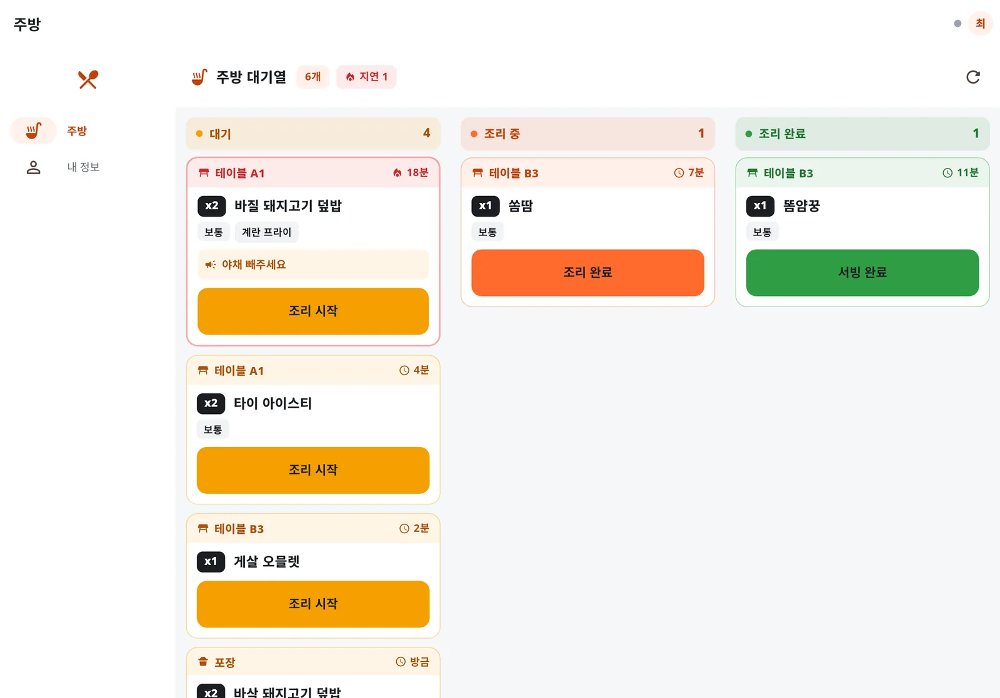
  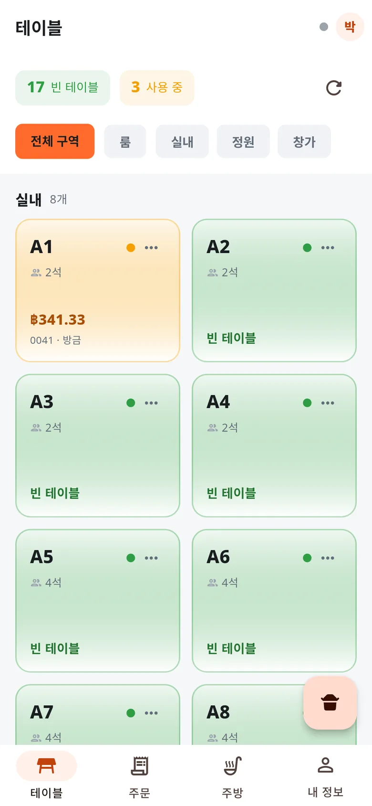
</p>

**가게가 겪는 문제** — 피크 때 직원이 종이 주문서를 들고 주방으로 뛰어갑니다. 주문서는 사라지고 글씨는 알아보기 힘들고, 주방은 손님이 기다린 순서가 아니라 집어 든 순서대로 요리해요. 그래서 가장 오래 기다린 테이블이 잊힙니다.

**이 세트에 들어 있는 것**

- **색으로 상태를 보여 주는 테이블 배치도** — 빈 테이블, 이용 중, 테이블별 미결제 금액, 실내·창가 구역별 구분.
- **옵션과 메모까지 담은 주문** — 보통 맵기, 계란 프라이 추가, 야채 빼기 — 소리칠 필요 없이 주방에 그대로 전달.
- **실시간 3열 주방 화면** — 조리 대기 → 조리 중 → 서빙 준비. 가장 오래된 주문이 맨 위, 15분을 넘기면 자동으로 빨간 경고.
- **매장·포장·배달을 아이콘으로 구분** — 포장 주문에는 하루 단위 대기번호가 자동으로 붙어요.
- **잘못 누른 건 되돌리기** — 상태를 바꾼 뒤 8초 동안 "실행 취소" 바가 떠요. 매니저를 부를 필요가 없습니다.

✅ **가장 오래 기다린 요리가 늘 맨 위에**  
🧪 **데모에서 맛보기:** 데모를 열고 "홀 직원"을 선택 → 빈 테이블을 눌러 메뉴를 고르고 주방으로 전송 → 로그아웃 후 "주방" 선택 — 방금 보낸 주문이 조리 대기 열에 떠요

### 2. 🙋 셀프 주문 세트

<p align="center">
  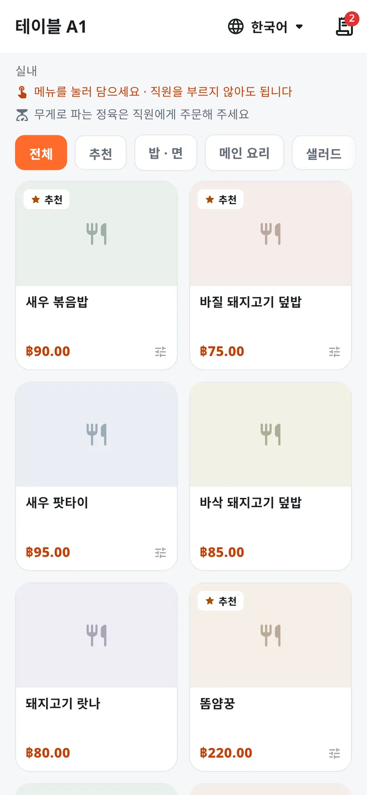
</p>

**가게가 겪는 문제** — 대형 식당은 거의 매 근무마다 홀 직원이 부족합니다. 손님은 메뉴판을, 주문 받을 사람을, 추가 주문을 기다리고 — 기다리는 1분 1분이 테이블 회전을 늦춥니다.

**이 세트에 들어 있는 것**

- **테이블 QR을 찍고 바로 주문** — 휴대폰 브라우저에서 열려요. 앱 설치도, 가입이나 로그인도 필요 없습니다.
- **직원 주문과 같은 경로** — 주방 화면에 올라가고 재료 재고도 똑같이 차감돼요. 따로 맞춰 볼 두 번째 시스템이 없습니다.
- **손님이 자기 테이블 주문을 확인** — 언제든 추가 주문하고 지금까지 주문한 내역을 볼 수 있어요.
- **끊긴 링크는 솔직하게** — 잘못된 QR이나 사용 중지된 테이블이면 손님에게 쓸 수 없다고 알려요. 떠도는 주문이 주방에 들어가지 않습니다.
- **매니저가 QR 교체** — 배치도에서 테이블을 길게 눌러 QR을 보고, 링크를 복사하거나 새 QR로 바꿀 수 있어요.

✅ **앉자마자 주문 시작**  
🧪 **데모에서 맛보기:** 데모를 열고 "매니저"를 선택한 뒤 테이블 화면으로 → 아무 테이블이나 길게 누르기 → "셀프 주문 QR 보기" → "링크 복사" → 새 탭에서 링크를 열고 손님처럼 주문

### 3. 💸 빠른 계산 세트

<p align="center">
  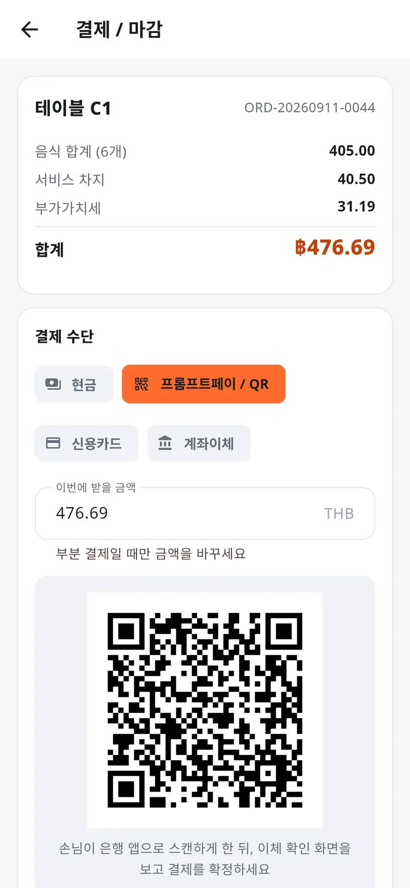
</p>

**가게가 겪는 문제** — 캐셔가 이체 금액을 손으로 입력하다 한 자리만 틀려도 환불을 쫓아다녀야 합니다. 친구들은 각자 낼 몫을 원하고, 할인과 봉사료는 카운터 앞에서 직접 나눠야 하죠.

**이 세트에 들어 있는 것**

- **EMV 표준 프롬프트페이 QR** — 계산서 금액이 QR에 담겨요. 손님은 은행 앱으로 스캔만 하면 되고, 아무도 금액을 입력하지 않아요.
- **결제 수단별·품목별 분할** — 한 계산서에 현금, QR, 카드. 할인·봉사료·VAT는 비율대로 자동 배분.
- **테이블 이동과 합치기** — 손님이 자리를 옮기거나 테이블을 합쳐도 주문이 그대로 따라가요. 이미 받은 돈(환불 차감)과 직접 입력한 할인도
  함께 옮겨지고, 프로모션은 합친 계산서에서 다시 계산하며(계산서당 하나), 확인 화면에서 두 계산서의 결제액과 할인을 먼저 보여 주고 할인이
  줄어들면 알려 줍니다 (`docs/DECISIONS.md` #98)
- **감열 프린터로 태국어 영수증** — 같은 LAN/Wi-Fi의 ESC/POS 프린터, 58mm·80mm 용지.
- **간이 세금계산서** — 태국 불기 연도 기준 일련번호. 잘못 발행한 건 이력을 남긴 채 취소.

✅ **QR 금액이 계산서와 사땅(1/100바트) 단위까지 일치**  
🧪 **데모에서 맛보기:** 데모를 열고 "캐셔"를 선택 → 손님이 있는 테이블을 눌러 결제로 → "프롬프트페이 / QR" 선택 — 그 계산서 금액으로 QR이 바로 생성돼요

### 4. 🔒 정직한 현금 서랍 세트

<p align="center">
  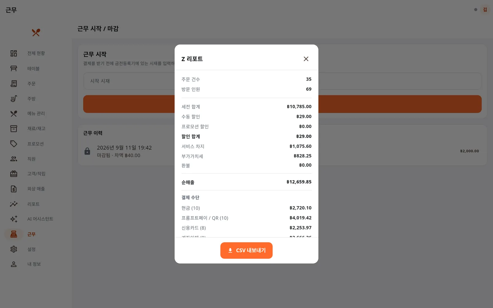
  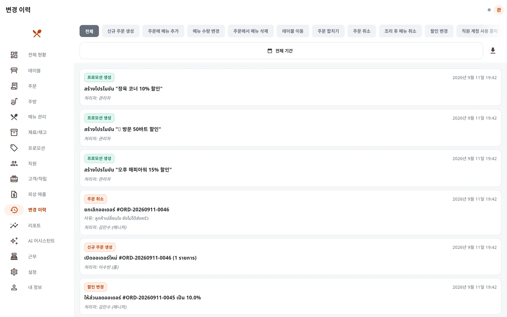
</p>

**가게가 겪는 문제** — 결제 후 취소, 권한을 넘는 할인, 사유 없는 환불. 대형 식당은 현금을 만지는 손이 많아서, 금액이 안 맞아도 무슨 일이 있었는지 증거가 없습니다.

**이 세트에 들어 있는 것**

- **근무를 열어야 결제 가능** — 시작 시재를 넣고, 모든 결제가 열려 있는 근무에 묶여요.
- **마감하면 즉시 대조** — 실제 현금을 세면 있어야 할 금액과 차액을 시스템이 계산해요.
- **근무별·일별 Z 리포트** — 매출, 세금, 프로모션과 구분된 수동 할인, 결제 수단, 외상 회수액. 회계용 CSV 내보내기.
- **누구도 고칠 수 없는 이력** — 주문 취소, 할인, 환불, 가격 수정, 권한 변경을 누가, 언제, 왜 했는지 매번 기록.
- **서버에서 강제하는 5가지 역할** — 버튼만 숨기는 게 아니라, 요청을 직접 보내도 거절됩니다.

✅ **40바트만 모자라도 마감 때 바로 보임**  
🧪 **데모에서 맛보기:** 데모를 열고 "매니저" 선택 후 "근무" 메뉴로 → "근무 마감"을 누르고 센 금액을 조금 모자라게 입력한 뒤, 이력에서 그 근무를 눌러 Z 리포트 확인 → "관리자"로 다시 들어가 "변경 이력" 확인

### 5. 📦 품절 걱정 없는 세트

<p align="center">
  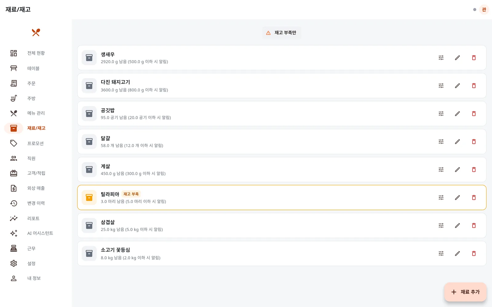
</p>

**가게가 겪는 문제** — 생선은 저녁 8시에 떨어졌는데 메뉴는 여전히 판매 중. 직원이 세 테이블 주문을 받은 뒤에야 주방이 알려 옵니다 — 시간도 손님 기분도 잃어요.

**이 세트에 들어 있는 것**

- **메뉴와 재료 연결** — 주방으로 보낼 때 차감, 취소나 삭제 시 자동 복원. 주방이 실제로 세는 단위 그대로.
- **떨어지면 판매 중지** — 재료가 부족하면 그 메뉴는 바로 판매 중지, 재고를 채우면 다시 판매.
- **재고 부족 알림** — 재료별 경고 기준을 두고, 오픈 전에 부족한 것만 걸러 보기.
- **셀프 주문에도 동일하게** — 손님이 직접 주문해도 같은 경로로 재고가 차감돼요.

✅ **메뉴를 손으로 끌 사람이 필요 없음**  
🧪 **데모에서 맛보기:** 데모를 열고 "관리자" → "재료/재고" → "재고 부족만"을 누르면 틸라피아가 이미 경고 기준 아래로 설정되어 있어요 → 틸라피아 재고를 0으로 바꾸고, 이 생선을 쓰는 메뉴가 판매 중지되는 걸 확인

### 6. 🥩 정육 코너 + 도매 세트

<p align="center">
  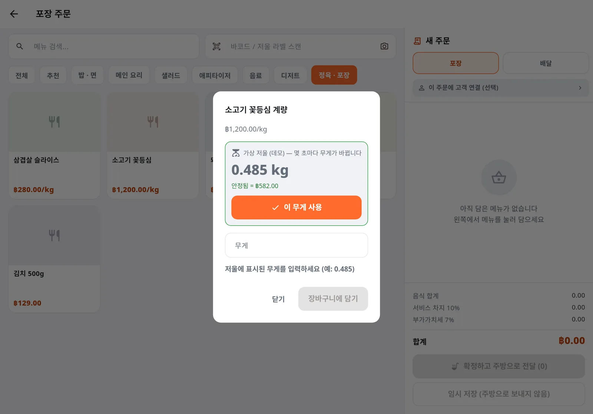
  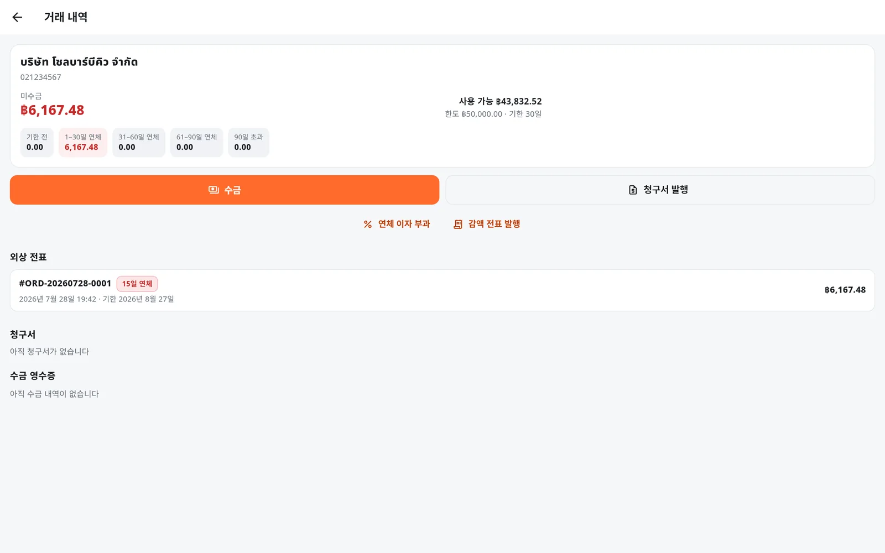
</p>

**가게가 겪는 문제** — 무게는 손으로 적고 가격은 계산기로. 도매 외상은 장부에 있고, 받으러 갈 때가 되면 어느 계산서가 며칠 연체됐는지 아무도 모릅니다.

**이 세트에 들어 있는 것**

- **무게 판매, 저울에서 실시간으로** — kg당 가격. 매장 서버에 연결된 저울이 무게를 화면으로 보내고, 직접 입력도 가능. 담기 전에 가격 확인.
- **저울 라벨과 바코드 스캔** — USB·블루투스 스캐너나 휴대폰 카메라. EAN-13 라벨은 품목과 무게를 함께 담고, 잘못 읽으면 추측하지 않고 경고.
- **한도와 결제 기한 안에서 외상** — 한도를 넘으면 결제 불가. 연령별 미수금, 청구서, 오래된 계산서부터 정산.
- **연체 이자와 대변표를 태국어 PDF로** — 금액은 글자로, 날짜는 불기로, 고객에게 바로 이메일.
- **외상 회수액도 서랍 현금과 대조** — Z 리포트가 외상 회수액을 그날 매출과 따로 보여 줘요.

✅ **0.485kg × ฿1,200 = ฿582, 계산기 없이**  
🧪 **데모에서 맛보기:** 데모를 열고 "캐셔" → "포장/배달 주문" → 정육 · 포장 → 소고기 꽃등심을 누르면 가상 저울이 무게를 화면에 보내요 → "매니저"로 들어가 "외상 매출" → 도매 고객 소울바비큐 주식회사

> 🏷 데모의 저울 라벨 `2000101012504` (삼겹살 슬라이스 1.250kg × 280 = 350바트) — 데모의 스캔 칸에 입력하거나 스캔해 보세요. 랜딩 페이지에는 화면에서 바로 스캔되는 실제 EAN-13 바코드로 그려져 있습니다.

### 7. 📊 실시간 매출 세트

<p align="center">
  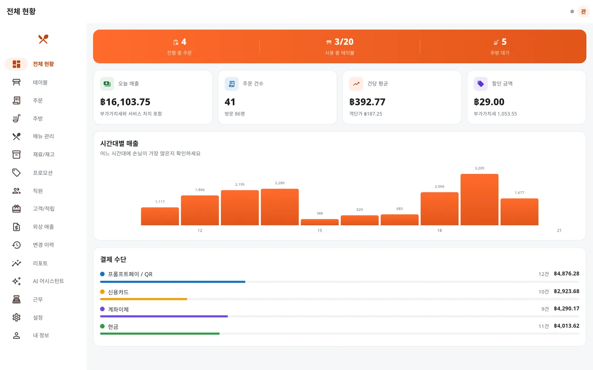
</p>

**가게가 겪는 문제** — 대형 식당 사장님은 매일 사람과 재료를 결정하지만, 숫자는 문을 닫은 뒤에야 오거나 지점별 요약을 기다려야 합니다.

**이 세트에 들어 있는 것**

- **실시간 대시보드** — 매출, 계산서 수, 객단가, 할인, 시간대별 그래프, 결제 수단 비율.
- **기간 리포트 + CSV** — 인기 메뉴, 일별·카테고리별 매출. CSV는 엑셀에서 태국어가 깨지지 않게.
- **여러 지점을 하나의 시스템에서** — 테이블, 메뉴, 주문, 재고, 리포트를 지점별로. 관리자는 전 지점 합계도 확인 (웹 데모는 지점 하나).
- **문장으로 묻기** — AI 어시스턴트가 실제 매장 데이터로 답해요 — 다음 섹션 참고.

✅ **영업 중에 오늘을 파악**  
🧪 **데모에서 맛보기:** 데모를 열고 "관리자" 선택 — 첫 화면이 전체 현황 → "리포트"에서 기간을 고르고 CSV 내보내기

### 8. 🎁 프로모션 + 적립 세트

<p align="center">
  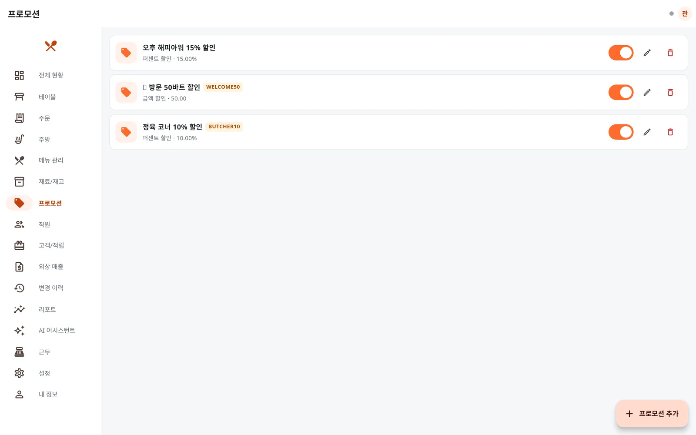
  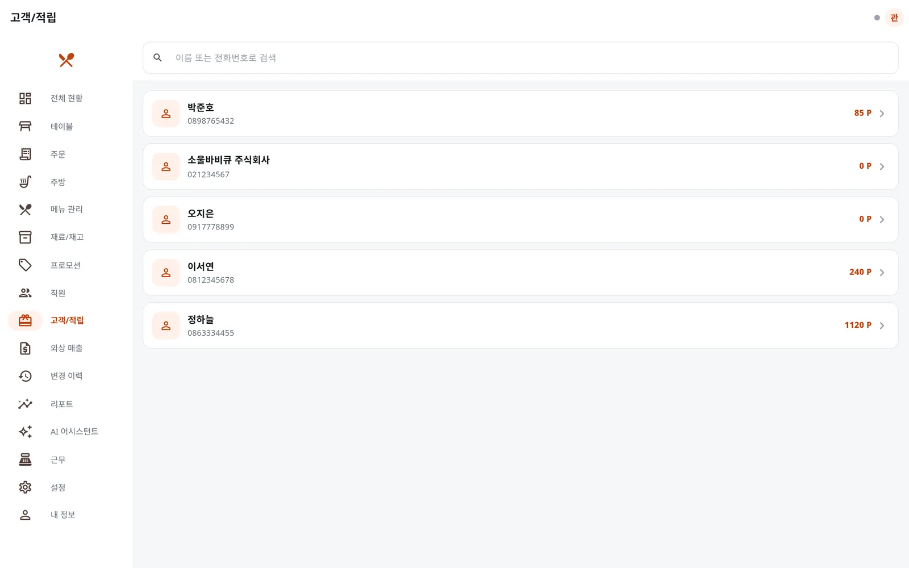
</p>

**가게가 겪는 문제** — 오후 해피아워, 첫 방문 코드, 일부 메뉴 1+1 — 홀이 바빠지면 직원이 할인을 빠뜨리거나 잘못 적용합니다.

**이 세트에 들어 있는 것**

- **조건부 프로모션** — 요일과 시간대, 카테고리나 메뉴, 최소 금액, 할인 코드, 1+1 — 조건에 맞는 계산서에 자동 적용.
- **자동 포인트 적립** — 주문 받을 때 이름이나 전화번호로 손님을 찾고, 구매 금액만큼 적립, 결제 때 할인으로 사용.
- **포인트는 돈통의 현금이 아님** — 근무 마감 시 돈통과 리포트의 현금 줄은 실제로 받은 돈만 세고, 사용한 포인트는 "포인트 사용" 줄로
  따로 보여요. 포인트로 일부 결제한 계산서를 환불하면 손님이 낸 비율대로 현금과 포인트로 나눠 돌려주고(포인트는 내림, 나머지는 현금,
  전액 환불이면 포인트 전부 반환), 확인 전에 환불할 현금과 포인트를 먼저 보여 줍니다 (`docs/DECISIONS.md` #100)
- **손님별 구매 이력** — 단골이 무엇을 얼마나 자주 주문하는지.
- **프로모션 변경도 모두 기록** — 생성, 수정, 중지가 변경 이력에 남아요.

✅ **직원이 프로모션 조건을 외울 필요 없음**  
🧪 **데모에서 맛보기:** 데모를 열고 "관리자" → "프로모션" → 프로모션 추가 → 지금 시간이 포함되게 설정한 뒤 새 계산서를 열면 할인이 알아서 붙어요 → "고객/적립"에서 손님별 포인트 확인

### 9. 🌧 진짜 현장 세트

<p align="center">
  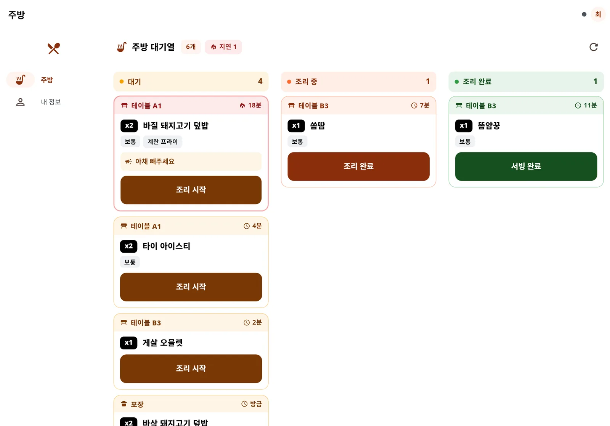
</p>

**가게가 겪는 문제** — 에어컨 나오는 사무실에서는 화면이 멋져 보여요. 하지만 실제 매장에는 유리에 비치는 햇빛, 수증기, 웍을 든 손, 영업 중 끊기는 Wi-Fi, 그리고 태국어가 서툰 직원이 있습니다.

**이 세트에 들어 있는 것**

- **고대비 모드** — 주방 상태 라벨 대비 8.77:1 (WCAG AA 기준은 4.5:1). 내 정보 화면에서 설정하고 기기마다 기억.
- **바쁜 손을 위한 큰 버튼** — 주방의 상태 버튼은 휴대폰 버튼보다 거의 두 배 커요.
- **인터넷이 끊겨도 주문 접수** — 기기에 보관했다가 연결되면 자동 동기화. 주방 화면은 전체 폭 경고를 띄우고 30초마다 주문을 다시 가져와요.
- **ไทย · English · 한국어** — 기기마다 언어를 고르고, 메뉴 이름도 그 언어로.
- **휴대폰, 태블릿, 컴퓨터를 하나의 시스템으로** — 이미 가진 기기를 그대로. 특정 브랜드 하드웨어가 필요 없어요.

✅ **상태 라벨 대비 8.77:1, 햇빛 아래서도 또렷**  
🧪 **데모에서 맛보기:** 아무 역할로 데모를 열고 "내 정보"로 → "화면 대비"를 "높음"으로 바꾸고 언어도 바꿔 보기

<!-- stories:end -->

> 예시 데이터가 태국 식당을 기준으로 작성되어 있어 메뉴 이름이 태국 음식으로 표시됩니다.
> 메뉴와 구역 이름은 매장에서 입력한 문자 그대로 표시됩니다.

---

## 기능

### 홀 직원 (휴대폰 / 태블릿)
- 구역별 테이블 배치도 — 빈 테이블과 사용 중인 테이블을 색상으로 구분
- 옵션(맵기, 추가 선택)과 주방 메모를 포함한 주문 입력
- 포장·배달 주문은 테이블 지정 없이 버튼 하나로 생성, 포장 주문에는 당일 대기번호 자동 부여
- 네트워크 연결이 끊긴 상태에서도 기존 주문에 메뉴 추가 가능, 연결 복구 시 자동 동기화
- **무게 단위 판매** — kg당 가격이 설정된 상품은 저울에 표시된 무게(예: 0.485)를 입력하면 즉시 가격이 계산되며,
  봉지마다 별도 행으로 담깁니다. 주방 티켓과 영수증에 무게가 인쇄됩니다
- **바코드 · 저울 라벨 스캔** — USB/블루투스 스캐너로 상품 바코드를 스캔하면 수량 1개로, 무게 정보가 포함된
  EAN-13 저울 라벨을 스캔하면 무게까지 자동 입력됩니다. 체크 디지트가 올바르지 않은 라벨은 값을 추정하지 않고 경고를 표시합니다
- **연결형 저울 실시간 판독** — 저울을 매장 서버에 USB/RS-232 케이블 또는 LAN으로 연결하면 무게 입력 창에
  **"저울 (실시간)"** 패널이 표시됩니다. 측정값이 흔들리는 동안에는 **"이 무게 사용"** 버튼이 비활성화되며, 값이
  안정되면 한 번 눌러 바로 담을 수 있습니다. 매장의 모든 기기에서 같은 무게를 실시간으로 확인할 수 있습니다 (데모에는
  가상 저울이 포함되어 있어 바로 체험할 수 있습니다)
- **휴대폰 카메라 스캔** — 스캔 입력란 끝의 카메라 버튼(Android/iOS/웹)으로 바코드와 저울 라벨을 읽습니다.
  스캐너 입력과 동일하게 처리되며 손전등 버튼을 제공합니다. 카메라가 없는 기기에서는 버튼이 표시되지 않습니다

### 손님 (테이블 QR — 로그인 불필요)
- QR 코드를 스캔하면 해당 테이블의 메뉴가 바로 열립니다
- 장바구니에 담은 주문을 손님이 직접 주방으로 전송합니다
- 직원이 입력한 주문과 동일한 경로로 처리됩니다 (재고 차감, 프로모션 적용 포함)
- 계량이 필요한 정육 상품은 손님 메뉴(QR 메뉴)에 표시되지 않으며, 대신 "무게로 파는 정육은 직원에게 주문해 주세요" 안내가 표시됩니다

### 주방
- 대기 / 조리 중 / 조리 완료의 3열 구성
- 가장 오래 대기한 주문을 항상 맨 위에 표시
- 대기 15분 초과 시 자동 경고 표시
- 매장·포장·배달 주문을 아이콘으로 구분
- **잘못 변경한 상태 되돌리기** — 상태를 변경하면 화면 하단에 **"되돌리기"** 막대가 8초 동안 표시되어 한 단계
  되돌릴 수 있습니다 (조리 중 → 대기, 조리 완료 → 조리 중). 서빙 완료 상태는 되돌릴 수 없습니다. 시스템은 주방이 어디까지
  진행했는지 항상 기억하므로, 되돌리기를 해도 이미 조리한 음식이 직원이 직접 삭제·취소할 수 있는 항목으로 바뀌지 않습니다
  (`docs/DECISIONS.md` #86)

### 캐셔
- 분할 결제, 테이블 이동, 합산 결제 — 음식값·할인·서비스 차지·부가가치세를 비율대로 자동 배분. 항목별로 나눠 낼 때 프로모션 할인도
  비율대로 나누고, "가격에 부가가치세 포함" 모드에서는 부가가치세를 두 번 더하지 않으며, 누적 반올림으로 누가 먼저 내든 모두의
  몫을 합하면 계산서 금액과 정확히 같습니다 (`docs/DECISIONS.md` #88)
- 현금, 신용카드, 계좌이체, **프롬프트페이 QR** 결제 — 신용 한도가 설정된 거래처는 **외상** 결제도 가능
  (한도 초과 시 결제 버튼 비활성화, 만기일 자동 계산)
- ESC/POS 영수증 프린터 출력 (58mm·80mm)
- 약식 세금계산서 발행 및 취소
- 전액·부분 환불 (사유 필수). 계산서 마감 후 환불한 금액만 리포트의 순매출에서 자동 차감합니다. 계산서가 열려 있을 때 환불한 금액은
  마감 전에 다시 받았으므로 두 번 빼지 않고, 취소된 계산서는 매출이 아니므로 그 환불도 매출을 줄이지 않습니다 (`docs/DECISIONS.md` #97)
- **결제가 끝나지 않은 계산서도 환불 가능, 남은 금액은 환불만큼 늘어남** — "결제된 금액"은 항상 결제액 − 환불액입니다. 결제 화면에
  결제 건마다 환불된 금액이 표시되고 매니저는 그 화면에서 바로 환불할 수 있으며, 순액을 모두 받아야만 계산서가 마감됩니다. 항목을
  골라 나눠 결제한 건을 전액 환불하면 그 항목은 다시 미결제가 되고, 마감된 계산서를 환불해도 새 미수금이 생기지 않습니다
  (`docs/DECISIONS.md` #87)
- **계산서 금액은 이미 받은 돈보다 작아질 수 없음** — 일부 결제 후 항목 삭제·수량 감소·취소, 할인, 프로모션으로 계산서 금액이 받아 둔
  순액보다 작아지면 먼저 환불할 금액을 알려 주며 거부되고 계산서는 그대로입니다. 새 금액이 받은 돈과 정확히 같아지면 계산서가 바로
  마감되고 테이블이 비워집니다. 이미 총액보다 많이 받은 예전 계산서는 결제 화면에 "남은 금액 0" 대신 **"고객에게 환불할 금액"**을
  보여 주고 환불 전까지 추가 결제를 받지 않습니다 (`docs/DECISIONS.md` #95)
- **받은 돈이 남아 있는 주문은 전액 환불 전까지 취소할 수 없음** — 현금·QR·카드·이체·외상 모두 같습니다. 앱이 환불할 금액을 알려 주고
  결제 화면으로 안내하며, 외상 판매는 감액 전표로 줄입니다. 취소된 주문에 돈이 남거나 취소된 계산서에 외상이 남지 않습니다 (`docs/DECISIONS.md` #96)
- **마감된 계산서의 항목 잠금** — 결제가 끝났거나 취소된 계산서의 항목은 관리자도 취소할 수 없고, 나눠서 결제된 항목은 환불한 뒤에만
  취소할 수 있습니다. 주방은 먼저 결제한 포장 주문도 평소처럼 조리 상태를 진행합니다 (`docs/DECISIONS.md` #85)

### 점주 / 매니저 (웹)
- 오늘 매출, 시간대별 그래프, 결제 수단 비율을 영업 중 실시간으로 갱신
- 근무 교대와 시재 정산
- 재료 재고 자동 차감, 재고 소진 시 해당 메뉴 자동 판매 중지
- 조건부 프로모션 (시간대, 메뉴, 최소 금액, 할인 코드, 1+1)
- 직원 관리 — 매니저는 자기 지점의 홀 직원·주방·캐셔 계정만 보고 관리합니다. 매니저·관리자 계정과 계정 삭제는 관리자만 할 수 있습니다
  (`docs/DECISIONS.md` #92)
- 고객 관리 · 적립금 — 적립 기준 금액과 1포인트 사용 금액은 최소 0.01바트 (설정 화면이 저장 전에 알려 줍니다). 업데이트 전에 더
  낮게 저장된 값이 있어도 포인트가 깨지지 않고 적립 0포인트 · 사용 불가로 처리되며, 이미 깨진 잔액은 DB 업데이트 때 구매 내역으로
  다시 계산되어 활동 기록에 **"적립금 잔액 복구"**로 남습니다 (`docs/DECISIONS.md` #89)
- **외상 매출 관리 (B2B)** — 거래처별 신용 한도·결제 기한, 미수금 연령 분석(기한 전/1–30/31–60/61–90/90일 초과),
  청구서 발행, 오래된 전표부터 차감하는 수금 영수증. 현금 수금액은 해당 교대의 금고 금액에 포함되므로 마감 정산이
  정확히 일치합니다. 외상 계산서의 적립금은 장부 등록 시점이 아니라 **외상 대금을 전액 회수한 시점**에 적립됩니다
  (감액 후 순액 기준, 연체 이자 제외 — 수금 영수증을 취소하면 적립금도 회수)
- **연체 이자 · 감액 전표** (매니저 이상) — 매장이 설정한 연이율(0–15%)과 유예일을 기준으로 청구서별 단리 이자를 미리
  확인하고 이자 청구서(`LF…`)를 발행합니다. 동일 기간에 대한 이자는 중복 계산되지 않으며, 아직 수금되지 않은 이자만
  취소(면제)할 수 있습니다. 외상 전표를 감액하면 원래 금액 / 올바른 금액 / 차액 및 차액의 부가가치세가 기재된 감액
  전표(`CN…`)가 항상 함께 발행됩니다
- **PDF · 이메일 발송** — 청구서, 수금 영수증, 감액 전표, 이자 청구서를 태국어 A4 PDF(금액 문자 표기, 불기
  연도)로 웹에서 내려받거나, PDF를 첨부하여 거래처에 이메일로 발송할 수 있습니다. 수신 주소는 고객 정보에서 자동으로
  입력되며 발송 내역은 문서 하단에 기록됩니다. 취소된 문서는 발송할 수 없습니다 (매장 SMTP 설정 필요, 데모에서는 실제로 발송하지 않고 시뮬레이션만 합니다)
- 수정할 수 없는 변경 이력 — 이력 문장은 조회하는 사용자가 선택한 언어로 표시됩니다 (태국어 원문은 증빙용으로 그대로 저장되며 CSV에도 태국어로 출력됩니다)
- **주방이 조리를 시작한 음식의 취소는 항상 매니저 권한** — 주방이 되돌리기로 대기 상태까지 되돌린 항목도 포함됩니다. 이런 항목은
  직원이 수량을 바꾸거나 삭제할 수 없고, 취소할 때마다 주방이 도달했던 단계와 함께 변경 이력에 기록됩니다 (`docs/DECISIONS.md` #86)
- 하나의 계정으로 여러 지점 관리
- **백업** (관리자, 설정 화면) — 마지막 백업 시각과 이유(교대 마감 후 / 정기 / 업데이트 전 / 수동), 파일 크기와 개수,
  기본·두 번째 위치의 상태를 각각 표시하고 **"지금 백업"** 버튼을 제공합니다. 26시간 넘게 백업에 성공하지 못했거나 마지막 백업이
  실패하면 관리자와 매니저의 홈 화면에 경고가 뜹니다. 백업 파일에는 고객 전화번호와 비밀번호 해시가 있으므로 앱에는 복원·다운로드
  버튼이 없습니다 (`docs/tickets/33-automatic-backup.md`, `docs/DECISIONS.md` #94)
- **PaynEat ERP 연동** (관리자, 설정 화면) — 체인에서 [PaynEat ERP](https://github.com/SuruchBoss/PaynEat-ERP)로 재료와 지점을
  관리하는 경우, ERP 주소와 이 POS의 자격 증명(`pnepos_…`)을 입력하면 지점 코드와 규약 버전을 확인한 후 재료·지점 데이터를
  버전 순으로 가져옵니다 (5분 주기 또는 "지금 가져오기"). 연동 중에는 재료 화면이 읽기 전용으로 전환되며, 이 기기의 재고를
  기준으로 한 메뉴 자동 판매 중지는 적용되지 않습니다. ERP에서 할당되었으나 이 기기에 없는 지점은 **"이 기기에 만들기"**
  버튼으로 생성합니다 (생성 전에 최신 데이터를 먼저 가져오므로 ERP에서 기존 지점 코드가 직전에 변경된 경우에도 중복 지점이
  생기지 않으며, 생성 내역은 변경 이력에 기록됩니다). 재시도로 해결되지 않는 오류(규약에 맞지 않는 응답, 새 규약 버전, 사용할
  수 없는 자격 증명)가 발생하면 주기적 가져오기를 중단하고 화면에 알립니다. 단독 매장은 별도 설정 없이 기존과 동일하게
  동작합니다 (`docs/DECISIONS.md` #80)
  - 자격 증명은 `https://`로만 ERP에 전송되며 인증서는 항상 검증됩니다. 같은 기기의 ERP가 아닌 `http://` 주소는 저장할 때
    거부되고, 업데이트 전에 `http://`로 저장된 연결은 즉시 자격 증명 전송을 멈추며 설정 화면에서 새 `https://` 주소를 저장하도록
    안내합니다. 닫힌 네트워크(예: 같은 Docker 네트워크의 데모)는 `ERP_ALLOW_INSECURE_HTTP=true`를 쓸 수 있으며, 이때 설정 화면에
    빨간 경고가 항상 표시됩니다. 체인의 내부 CA 인증서는 `NODE_EXTRA_CA_CERTS`로 신뢰합니다 (ticket 32, `docs/DECISIONS.md` #82)
- 직원 계정 관리 — 역할 변경·사용 중지는 확인 절차를 거쳐 적용되며, 본인 계정의 역할을 낮추거나 사용 중지할 수 없습니다
  (실수로 본인 계정이 잠기는 것을 방지)
- **AI 어시스턴트** — 한국어로 질문하면 매장 데이터베이스에 연결된 도구를 호출하여
  실제 수치를 조회한 뒤 답변합니다. 모델이 수치를 추측하지 않습니다

---

## 태국 현지 요건 지원

다음은 한국의 매장 운영 환경과 다른 태국 고유의 제도 및 관행으로, 시스템에 반영되어 있습니다.

| 항목 | 설명 |
|---|---|
| **프롬프트페이 (PromptPay)** | 태국 중앙은행이 정한 전국 표준 QR 결제 방식입니다. 한국의 계좌이체 QR과 유사한 위치를 차지하며, 태국에서는 현금 다음으로 널리 사용됩니다. 손님이 QR 코드를 스캔해 결제하면 금액이 자동으로 대사됩니다 |
| **부가가치세 7%** | 태국 부가가치세(VAT) 표준세율로, 한국의 10%와 다릅니다. 세율과 서비스 차지 비율은 매장 설정에서 변경할 수 있습니다 |
| **불기(佛紀) 연도** | 태국 공문서는 서기 연도에 543을 더한 불기 연도를 사용합니다. 2026년은 태국 문서에서 2569년으로 표기됩니다. 세금계산서 번호도 이 연도를 기준으로 채번합니다 |
| **감액 전표 (ใบลดหนี้)** | 태국에서는 세금계산서를 발행한 매출을 감액할 때 원래 금액, 올바른 금액, 차액, 차액의 부가가치세, 원래 세금계산서 번호, 사유를 기재한 감액 전표를 별도로 발행해야 합니다. 외상 전표를 감액하면 이 형식에 따라 자동 발행됩니다 |
| **세금계산서 주소는 태국어** | 화면 언어를 한국어로 설정하더라도 세금계산서에 인쇄되는 매장 주소와 지점명은 태국어로 유지됩니다. 태국 국세청이 등록된 주소를 그대로 기재하도록 요구하기 때문입니다 |
| **매장 시간대** | 태국은 한국보다 2시간 늦은 UTC+7입니다. 매장 설정의 **매장 시간대**(기본 `Asia/Bangkok`, IANA 이름)가 "매장의 오늘"을 정하며, 서버 컴퓨터의 시간대와 관계없이 같은 날짜를 계산합니다. 리포트와 문서 번호는 T16/T17에서 이 기준으로 옮겨집니다 (`docs/DECISIONS.md` #101) |

---

## 보안

POS는 매출 데이터와 고객 정보를 함께 다루므로, 보안은 사후에 추가하는 기능이 아니라 기본 설계 요건으로 다룹니다.

- **OWASP Top 10 점검 완료** — 발견된 7건 모두 수정, 모든 기본값은 차단을 우선하도록 설정
- **권한 검사는 서버에서 수행** — 화면에서 버튼을 숨기는 데 그치지 않으며,
  같은 요청을 직접 보내도 서버가 거부합니다
- **비활성화되거나 권한이 변경된 계정은 즉시 접근이 차단됩니다** — 토큰 만료를 기다리지 않습니다
- **코드에 예비 JWT 비밀키를 포함하지 않습니다**
- **삭제할 수 없는 변경 이력** — 주문 취소, 할인, 권한 변경, 환불, 메뉴 가격 수정
- **데이터는 매장 내부에 보관됩니다** — 시스템은 매장의 서버 또는 PC에서 직접 실행됩니다
- **업데이트 시에도 매장 데이터 보존** — 데이터베이스 구조 변경은 번호가 매겨진 마이그레이션으로만 수행합니다. 각 마이그레이션은
  한 번만, 개별 트랜잭션 안에서 실행되므로 도중에 실패하면 전체가 롤백됩니다. 이미 실행된 마이그레이션이 수정되었거나 앱을
  데이터베이스보다 오래된 버전으로 되돌린 경우, 서버는 원인을 표시하고 시작되지 않습니다 (`docs/DECISIONS.md` #79)
- **로그에 고객 정보를 기록하지 않습니다** — 이름·전화번호·이메일·사업자 번호·주소·비밀번호·토큰·테이블 QR 토큰, 요청
  본문과 쿼리 문자열은 로그에 기록되지 않으며, 이는 테스트로 검증됩니다. 로그는 PaynEat 생태계 텔레메트리 규약을 따르는
  JSON 형식이며 모든 요청에 `x-request-id`가 부여됩니다. 실제 백엔드에 연결된 경우 오류 메시지 끝에 **요청 ID**가 표시되므로,
  매장에서 이 ID와 함께 문제를 알려 주면 해당 요청의 로그를 즉시 찾을 수 있습니다. `/metrics`(Prometheus)는 API와 별도의
  포트(9464)에서 제공되며, docker compose 구성에서는 외부에 공개되지 않습니다 (`docs/DECISIONS.md` #68)
- **앱은 개발자에게 어떠한 데이터도 전송하지 않습니다** — 광고와 사용 분석 기능이 없습니다. 유일한 예외는 바코드 스캐너가
  사용하는 Google ML Kit로, Google에 진단 데이터를 전송합니다. 이 내용은 [개인정보 처리방침](https://suruchboss.github.io/PaynEat/privacy.ko.html)에
  명시되어 있습니다 (`docs/DECISIONS.md` #75)

### 운영 환경 배포 전 확인 사항

이 프로젝트는 포트폴리오 프로젝트로 시작되었기 때문에 일부 기본값은 운영 환경에 그대로 사용하기에
안전하지 않습니다. **이러한 기본값은 숨기지 않고 코드에서 차단합니다.** 운영 모드
(`NODE_ENV=production`)에서 데모 비밀번호로 계정을 생성하려고 하거나, `JWT_SECRET`이 예시 값이거나 32자보다 짧으면
서버가 시작되지 않습니다. 소스에서 Docker로 실행하는 경우(`docker-compose.yml`)에도 `JWT_SECRET`을 직접 설정해야 합니다.
PaynEat ERP에 연결한다면 `https://` 주소를 사용해야 하며, `ERP_ALLOW_INSECURE_HTTP`는 닫힌 네트워크에서만 설정하십시오.
백업 파일은 암호화되지 않으므로 외부인이 접근할 수 없는 곳에 보관하십시오. 파일 권한은 `0600`, 폴더는 `0700`이며,
백업 위치가 웹에 공개되는 폴더 안에 있으면 서버가 시작되지 않습니다.

전체 체크리스트는 [SECURITY.md](SECURITY.md)를 참고하십시오.
보안 취약점은 저장소의 **Security** 탭을 통해 비공개로 신고해 주십시오.

---

## 비용과 라이선스

**무료로 제공되며, 향후에도 요금제를 도입하지 않습니다** — 시스템이 개발자가 운영하는 서버를 거치지 않는 구조이기 때문입니다.

| | |
|---|---|
| 라이선스 | **Apache License 2.0** — 상업적 사용, 수정, 재배포 모두 허용 |
| 월 구독료 | 없음 |
| 단말 수 제한 | 없음 |
| 발생 비용 | 기기 구입비, 영수증 프린터 구입비, 설치에 드는 시간 |
| 전용 하드웨어 | 불필요 — 기존 휴대폰·태블릿·PC 사용 가능 |

포크 및 수정하여 사용할 수 있습니다. Apache License 2.0 조건에 따라
[`NOTICE`](NOTICE) 파일을 함께 유지해 주십시오.

저작권 © 2026 Suruch Chakrapeesirisuk. 모든 소스 파일 첫머리에는 저작권 표시와 SPDX 식별자
(`SPDX-License-Identifier: Apache-2.0`)가 포함되어 있으며, 푸시할 때마다 CI가 이를 검사합니다. 외부 기여 시에는 모든 커밋에
Developer Certificate of Origin(DCO)에 따른 서명(sign-off)이 필요합니다. 방법은
[`CONTRIBUTING.md`](CONTRIBUTING.md#developer-certificate-of-origin-dco)를 참고하십시오.

설치, 기기 연결, 기술 지원, 교육은 선택 사항인 유료 서비스로 이용할 수 있습니다. 유료 서비스를 이용하지 않아도 모든 기능을 동일하게 사용할 수 있습니다.

---

## 문의

- **GitHub Issues** — 도입 문의, 기능 요청, 버그 신고를 모두 이 창구에서 접수합니다.
  한국어로 작성하셔도 됩니다. 문의 내용은 공개 기록으로 남아 같은 질문을 가진 다른 매장에도 참고가 됩니다
- **[LinkedIn](https://www.linkedin.com/in/suruchboss)** — 개별 연락이 필요한 경우

보안 취약점은 공개 Issue가 아니라 [`SECURITY.md`](SECURITY.md)의 절차에 따라 비공개로 제보해 주십시오.

개발: **[SuruchBoss](https://github.com/SuruchBoss)**

---

## 테스트

공개 전 **1267건**의 자동화 테스트를 통과합니다.

```bash
cd backend && npm test      # 574건 — 매장 전체 흐름 17단계 테스트 포함
cd app && flutter test      # 633건 — domain / controller / widget
cd app && flutter test test_e2e   # 60건 — 실제 앱 ↔ 실제 백엔드 (먼저 backend에서 npm ci)
node --test scripts/android-version.test.mjs   # 3건 — Google Play 빌드의 versionCode (1267건에 미포함)
```

`app/test_e2e/`의 E2E 테스트 60건은 실행할 때마다 새 임시 DB로 실제 백엔드(`node src/server.js`)를 기동하고, 앱의
실제 data/domain 코드로 매장의 하루 업무를 처음부터 끝까지 수행합니다. 대상 업무는 로그인, 주문, 주방, 근무 시작,
결제, 세금계산서, 환불, 근무 마감(차액 0), Z-report와 CSV, 감사 로그, 손님의 QR 주문, 지점·권한입니다. 나머지
Flutter 테스트는 모두 데모 모드에서 실행되므로, 앱이 **백엔드가 실제로 반환한 JSON을 해석하는지** 검증하는 테스트는
이 E2E 테스트뿐입니다. 이 테스트는 기존 659건의 테스트가 모두 통과한 상태에서도 존재하던 실제 버그 5건을 발견했으며,
해당 버그는 모두 수정되었습니다 (`docs/DECISIONS.md` #43–#47). 정육 카운터 및 거래처 시나리오도 별도로 검증합니다: 저울
라벨 스캔 → 장바구니 금액이 백엔드와 1사땅 단위까지 일치 → 한도 초과 외상 거부 → 외상 판매 시 kg 단위
재고 차감 → 청구서 → 현금 수금 → 교대 마감 차액 0 (`meat_shop_b2b_e2e_test.dart`). 백업은 교대 마감 → 백업 파일 생성 → 실제 `db:restore` 명령으로 새 데이터베이스에 복원 → 복원된 데이터베이스의 Z-report가 복원 전과 일치하는지까지 확인합니다 (`backup_restore_e2e_test.dart`). 또한 테스트가 TCP
"저울"을 직접 열고 실제 백엔드가 여기에 연결하는 시나리오도 있습니다: 흔들리는 무게는 사용할 수 없고 안정된 무게만 사용 →
해당 무게로 외상 판매 → 20일 연체·유예 5일이면 정확히 15일치 이자 → 감액 전표로 부가가치세 분리 → 모든 문서를 실제
PDF로 내려받기 → 청구서 이메일 발송 (`scale_documents_e2e_test.dart`).

로그와 메트릭은 `telemetry-log-record.test.js`(13건 — 규약의 규칙)와 `telemetry.test.js`(11건)가 실제 앱이 기록한 로그 행을
직접 검사합니다. 검사 항목은 두 가지 형식, `x-request-id` 왕복, 상태 코드별 severity, route template별 `/metrics`, 그리고
로그인·고객 등록·수정·전화번호 검색 이후에도 이름·전화번호·이메일·비밀번호가 로그에 남지 않는지 여부입니다. 앱 측의
`request_id_error_test.dart`(5건)는 오류 메시지 끝에 표시되는 요청 ID가 실제로 전송한 ID와 일치하는지 확인합니다 (`docs/DECISIONS.md` #68).

한국어 지원에 대해서는 다음 전용 테스트가 있습니다.

- `korean_font_coverage_test.dart` — 폰트 파일의 cmap 테이블을 직접 읽어, 내장 한글 폰트에 화면에 표시되는 모든 글자의
  글리프가 포함되어 있는지 확인합니다 (재료·메뉴 설명 번역을 추가할 때 누락되었던 8글자 `깃걀틸끈짠쌀걸쭉`을 이 테스트로
  검출하여 폰트를 다시 subset했습니다). 또한 모든 굵기에 KS X 1001 한글 2,350자와 입력 중 표시되는 자모가 모두 포함되어
  있는지 확인하며, 474자만 포함된 이전 폰트로 되돌리면 이 테스트가 실패합니다 (`docs/DECISIONS.md` #74)
- `audit_summary_text_test.dart`, `demo_store_test.dart` — 변경 이력 문장을 `metadata.summaryArgs`로 재구성했을 때
  태국어 문장은 저장된 문장과 완전히 일치하고, 한국어·영어 문장에는 사용자 입력값 외에 태국어가 남지 않는지를
  데모 모드가 생성한 **모든** 로그를 대상으로 확인합니다. 백엔드의 `audit-summary-args.test.js`는 소스를 직접 읽어
  로그를 기록하는 모든 지점이 `summaryArgs`를 전달하는지 확인합니다
- `cart_panel_locale_test.dart` — 장바구니에 담긴 메뉴 이름이 선택한 언어로 표시되는지 확인합니다
- `destructive_labels_test.dart` — 모든 언어에서 문서의 "발행 취소" 버튼이 일반 "취소"/"닫기" 버튼과 같은 이름으로
  표시되지 않는지 확인합니다 (두 버튼의 이름이 같으면 대화상자를 닫으려다 영수증을 취소할 수 있기 때문입니다)
- `korean_leak_test.dart` — 한국어 선택 시 화면에 태국어 글자가 남아 있지 않은지 확인합니다.
  메뉴 설명, 재료 이름·단위, 옵션 이름 등 화면에 출력되는 데이터를 직접 검사합니다
  (단, 세금계산서 주소와 지점명은 태국어로 유지되어야 하므로 반대 조건으로 검사합니다)
- `locale_service_test.dart` — 저장된 언어 설정이 다음 실행 시 그대로 복원되는지 확인합니다
  (최초 실행 시에는 기기 언어를 따르므로, 한국어 기기에서는 한국어로 시작합니다)
- `error-i18n.test.js` (백엔드) — 소스 전체를 검사하여 영어/한국어 번역이 없는 태국어 오류 메시지가 있으면 실패합니다.
  실제 HTTP 응답이 `Accept-Language`를 따르는지도 확인합니다
- `uat_affordances_test.dart` — 사전 설명 없이 처음 사용하는 사용자를 위한 요소를 검증합니다. 지구본 버튼이 현재 언어를
  해당 언어로 표시하고 세 언어를 모두 제공하는지, 긴 한국어 설명이 포함된 통계 카드가 360px 화면에서도 넘치지 않는지,
  테이블 카드에 길게 누르지 않아도 보이는 ⋯ 버튼이 있는지 확인합니다
