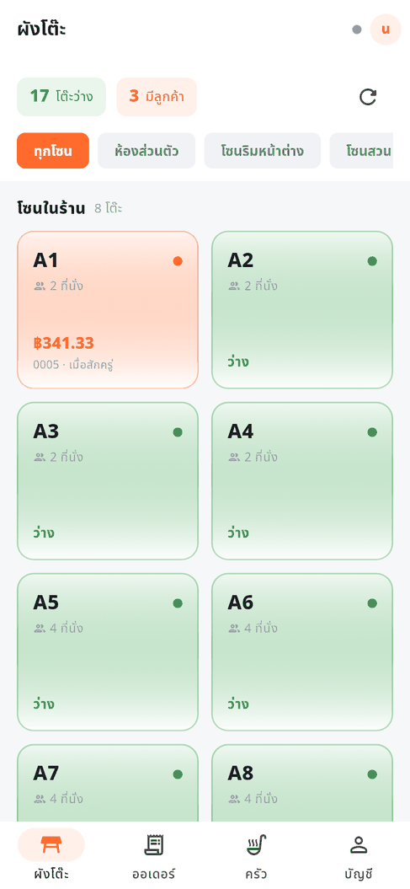
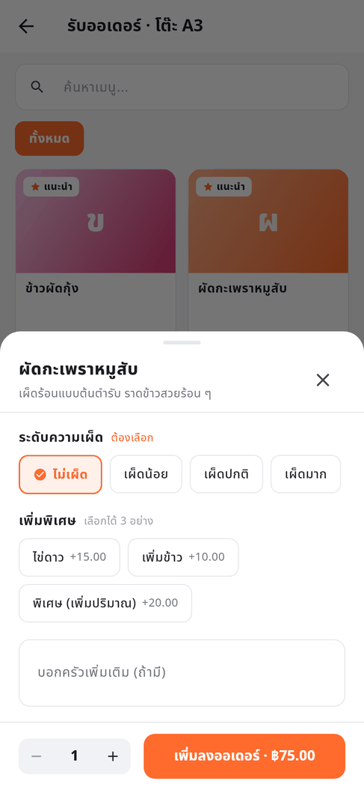
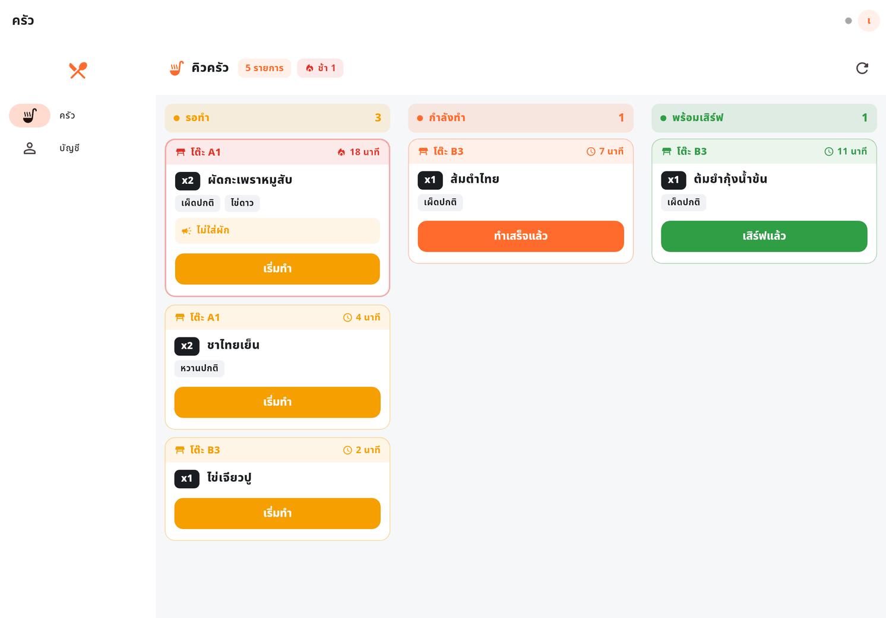
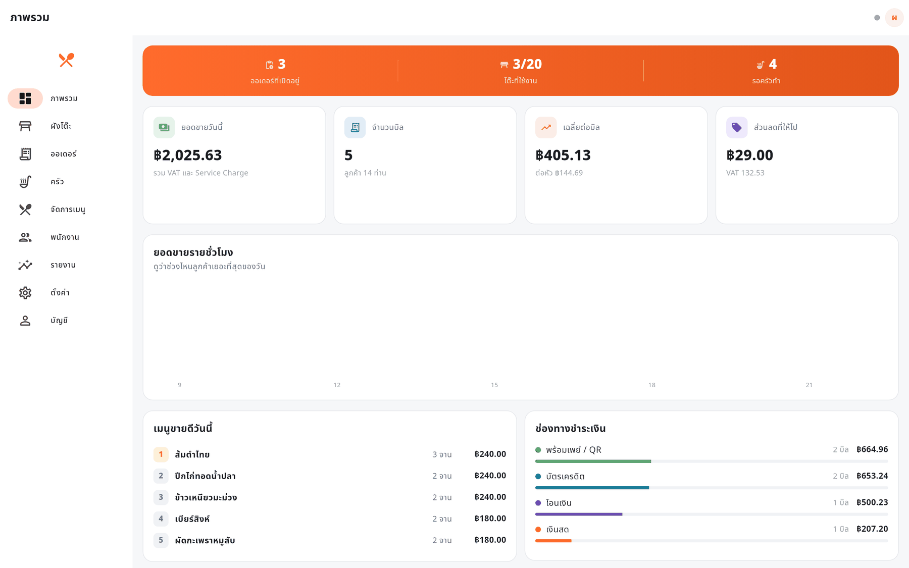
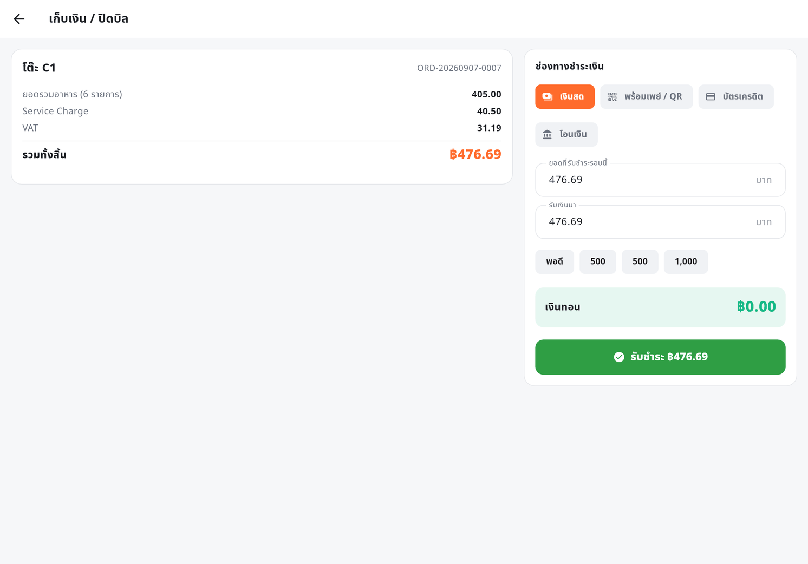
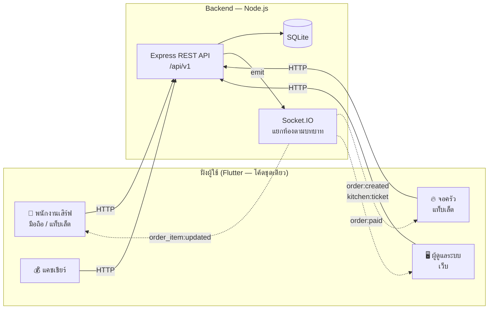
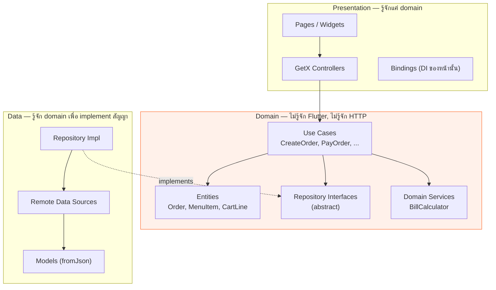

# 🍽️ PaynEat POS — ระบบขายหน้าร้านสำหรับร้านอาหาร

> ระบบ POS ครบวงจร: พนักงานเสิร์ฟรับออเดอร์บนแท็บเล็ต → เด้งเข้าจอครัวทันที → แคชเชียร์ปิดบิล → ผู้จัดการดูยอดขายบนเว็บ
>
> **Flutter (GetX + Clean Architecture)** + **Node.js / Express + SQLite + Socket.IO** — โค้ดชุดเดียวรันได้ทั้ง Android, iOS และ Web

<p align="center">
  
  
  
  
  
  
  
</p>

**English TL;DR** — A full restaurant point-of-sale system built to demonstrate end-to-end product engineering:
a Flutter client (mobile / tablet / web from one codebase, structured with Clean Architecture + GetX) talking to a
Node.js REST + WebSocket backend. Covers the complete floor-to-cash workflow: table map, order taking with
modifiers, live kitchen display, split payments, receipts, and management dashboards — with role-based access
control and 77 automated tests.

---

## 📸 หน้าตาแอป

<table>
<tr>
<td width="50%" align="center"><b>ผังโต๊ะ — พนักงานเสิร์ฟ</b><br><sub>เห็นสถานะทุกโต๊ะพร้อมยอดค้างในจอเดียว</sub><br><br>
</td>
<td width="50%" align="center"><b>รับออเดอร์พร้อมตัวเลือกเสริม</b><br><sub>ระดับความเผ็ด ของเพิ่ม และโน้ตถึงครัว</sub><br><br>
</td>
</tr>
</table>

<p align="center"><b>จอครัว (KDS)</b> — ตั๋วเด้งขึ้นเองแบบเรียลไทม์ แบ่ง 3 คอลัมน์ตามสถานะ และเตือนจานที่รอเกิน 15 นาทีด้วยกรอบแดง</p>
<p align="center"></p>

<p align="center"><b>แดชบอร์ดผู้ดูแลระบบ (เว็บ)</b> — ยอดขายวันนี้ กราฟรายชั่วโมง เมนูขายดี และสถานะร้านแบบสด</p>
<p align="center"></p>

<p align="center"><b>เก็บเงินแบบแยกจ่าย</b> — จ่าย QR บางส่วน ที่เหลือเงินสด ระบบตัดยอดคงเหลือและคำนวณเงินทอนให้</p>
<p align="center"></p>

> 📄 **[ดูเอกสารรวมฟีเจอร์และหน้าจอทั้งหมด 25 หน้าจอ (PDF)](docs/PaynEat-POS-Features.pdf)**
> — อธิบายทีละหน้าจอว่าแก้ปัญหาอะไรและเบื้องหลังทำงานยังไง
>
> ภาพทั้งหมดเรนเดอร์จากโค้ดจริงด้วย golden test ที่เขียนไว้ใน [`app/tool/screenshots`](app/tool/screenshots)
> จึงสร้างใหม่ได้ทุกครั้งที่โค้ดเปลี่ยน ([วิธีสร้าง](docs/generator/README.md))

---

## 📋 สารบัญ

- [หน้าตาแอป](#-หน้าตาแอป)
- [ทำไมถึงทำโปรเจกต์นี้](#-ทำไมถึงทำโปรเจกต์นี้)
- [วิธีรัน (สำหรับผู้ที่มาตรวจผลงาน)](#-วิธีรัน-สำหรับผู้ที่มาตรวจผลงาน)
- [ฟีเจอร์](#-ฟีเจอร์)
- [เทคโนโลยีที่ใช้](#-เทคโนโลยีที่ใช้)
- [สถาปัตยกรรม](#-สถาปัตยกรรม)
- [โครงสร้างโปรเจกต์](#-โครงสร้างโปรเจกต์)
- [การคำนวณบิล](#-การคำนวณบิล)
- [Realtime](#-realtime)
- [API](#-api)
- [การทดสอบ](#-การทดสอบ)
- [สิ่งที่จะทำต่อ](#-สิ่งที่จะทำต่อ)

---

## 🎯 ทำไมถึงทำโปรเจกต์นี้

อยากทำโปรเจกต์ที่ **ไม่ใช่ To-do list** แต่เป็นระบบที่มีกฎทางธุรกิจจริง ๆ ให้จัดการ

ร้านอาหารเป็นโจทย์ที่ดีเพราะมีเงื่อนไขที่ต้องคิดเยอะกว่าที่เห็น:

- แก้ออเดอร์ได้ถึงเมื่อไหร่? (ครัวเริ่มทำแล้วห้ามแก้ ต้องให้ผู้จัดการ void แทน)
- คิด VAT ก่อนหรือหลัง Service Charge? แล้วส่วนลดล่ะ?
- โต๊ะเดียวกันเปิดสองบิลพร้อมกันได้ไหม?
- ลูกค้าขอแยกจ่าย QR ครึ่งหนึ่ง เงินสดครึ่งหนึ่ง ต้องรองรับ
- ครัวกับพนักงานเสิร์ฟอยู่คนละเครื่อง ต้องเห็นสถานะตรงกันแบบทันที
- เงินต้องไม่เพี้ยนจาก floating point

โปรเจกต์นี้จึงเน้น **ความถูกต้องของ business logic + โครงสร้างที่ดูแลต่อได้** มากกว่าความหวือหวาของ UI

---

## 🚀 วิธีรัน (สำหรับผู้ที่มาตรวจผลงาน)

> ใช้เวลาประมาณ 5 นาที · ถ้าติดปัญหา ดูหัวข้อ [แก้ปัญหาที่พบบ่อย](#-แก้ปัญหาที่พบบ่อย) ท้ายหัวข้อนี้

### ขั้นที่ 0 — ดาวน์โหลดโค้ด

```bash
git clone https://github.com/SuruchBoss/PaynEat.git
cd PaynEat
```

---

### 🅰️ ทางเลือก A — รันตรงในเครื่อง (แนะนำ)

**ต้องมี**

| เครื่องมือ | เวอร์ชัน | ตรวจด้วย |
|---|---|---|
| [Node.js](https://nodejs.org) | 20 ขึ้นไป (แนะนำ 22) | `node -v` |
| [Flutter SDK](https://docs.flutter.dev/get-started/install) | 3.35 ขึ้นไป | `flutter --version` |

**เทอร์มินัลที่ 1 — Backend**

```bash
cd backend
npm install
npm run dev
```

ถ้าขึ้นแบบนี้คือสำเร็จ (ฐานข้อมูลและข้อมูลตัวอย่างถูกสร้างให้อัตโนมัติ ไม่ต้องตั้งค่าอะไรเพิ่ม):

```
🍽️  PaynEat POS API
   ▸ REST      : http://localhost:3000/api/v1
   ▸ Docs      : http://localhost:3000/docs
   ▸ Health    : http://localhost:3000/health
   ▸ Realtime  : ws://localhost:3000 (socket.io)
```

**เทอร์มินัลที่ 2 — แอป** (เปิดหน้าต่างใหม่ อย่าปิดอันแรก)

```bash
cd app
flutter pub get
flutter run -d chrome        # รันบนเว็บ — เร็วที่สุด
```

หรือถ้าอยากดูบนมือถือ/แท็บเล็ต:

```bash
flutter devices              # ดูอุปกรณ์ที่ต่ออยู่
flutter run                  # เลือกอุปกรณ์ที่เจอ
```

> 📱 **Android emulator**: แอปจะชี้ไป `10.0.2.2:3000` ให้อัตโนมัติ (loopback ของเครื่อง host) ไม่ต้องตั้งค่าเพิ่ม
> 📱 **มือถือจริงต่อ WiFi เดียวกัน**: ต้องบอก IP ของคอมพิวเตอร์ เช่น
> `flutter run --dart-define=API_BASE_URL=http://192.168.1.15:3000`
> (หา IP: `ipconfig` บน Windows / `ifconfig | grep inet` บน macOS-Linux)

---

### 🅱️ ทางเลือก B — Docker (ไม่ต้องติดตั้ง Node หรือ Flutter)

เหมาะกับกรณีที่แค่อยากเห็นระบบทำงานจริง โดยไม่อยากลง toolchain อะไรเลย

**ต้องมี:** [Docker Desktop](https://www.docker.com/products/docker-desktop/) เท่านั้น

```bash
docker compose up --build
```

รอครั้งแรกประมาณ 5–10 นาที (ต้องดาวน์โหลด Flutter SDK มา build เว็บให้) ครั้งต่อไปจะเร็วมาก

เมื่อขึ้นข้อความ `payneat-web` และ `payneat-api` แล้ว เปิดเบราว์เซอร์:

| เปิดที่ | จะเจออะไร |
|---|---|
| **http://localhost:8080** | 👈 **เริ่มที่นี่** — หน้าเข้าสู่ระบบของแอป |
| http://localhost:3000/docs | เอกสาร API แบบกดลองยิงได้ (Swagger UI) |
| http://localhost:3000/health | ตรวจว่า API ทำงานอยู่ |

ปิดระบบด้วย `Ctrl+C` แล้ว `docker compose down`
(อยากล้างข้อมูลให้เริ่มใหม่หมด: `docker compose down -v`)

---

### 🆑 ทางเลือก C — ดูแอปอย่างเดียว ไม่ต้องรัน backend

ถ้าอยากดูแค่ฝั่ง Flutter โดยไม่อยากเปิดเซิร์ฟเวอร์:

```bash
cd app
flutter pub get
flutter run -d chrome --dart-define=DEMO_MODE=true
```

แอปจะใช้ข้อมูลจำลองที่อยู่ในเครื่องแทน ใช้งานได้ครบทุกฟีเจอร์
(ไม่มีการอัปเดตข้อมูลข้ามเครื่องแบบเรียลไทม์ เพราะไม่มีเซิร์ฟเวอร์ และข้อมูลจะรีเซ็ตเมื่อรีเฟรชหน้า)

> 💡 โหมดนี้สลับที่ `_bindDataSources()` **จุดเดียว** โดยไม่แก้หน้าจอ, controller หรือ use case เลย
> เป็นตัวอย่างรูปธรรมว่าทำไมถึงแยกชั้นแบบ Clean Architecture

---

### 👤 บัญชีสำหรับเข้าใช้งาน

หน้าเข้าสู่ระบบมีปุ่มกดเลือกบัญชีให้อัตโนมัติ ไม่ต้องพิมพ์เอง

| บทบาท | username | password | เห็นอะไรบ้าง |
|---|---|---|---|
| ผู้ดูแลระบบ | `admin` | `admin123` | ทุกอย่าง (แดชบอร์ด, จัดการเมนู, พนักงาน, รายงาน, ตั้งค่า) |
| ผู้จัดการ | `manager` | `manager123` | เหมือน admin แต่ลบบัญชีผู้ใช้ไม่ได้ |
| พนักงานเสิร์ฟ | `waiter1` | `waiter123` | ผังโต๊ะ, ออเดอร์, จอครัว |
| ครัว | `kitchen` | `kitchen123` | จอครัวอย่างเดียว |
| แคชเชียร์ | `cashier` | `cashier123` | ผังโต๊ะ, ออเดอร์, รายงาน |

---

### 🗺 ทัวร์ 5 นาที — กดตามนี้จะเห็นระบบทำงานครบทั้งวงจร

> **เคล็ดลับ:** เปิด **2 หน้าต่างเบราว์เซอร์คู่กัน** (หน้าต่างหนึ่งเป็นพนักงานเสิร์ฟ อีกหน้าต่างเป็นครัว
> โดยหน้าต่างที่สองใช้โหมดไม่ระบุตัวตน) จะเห็นออเดอร์เด้งข้ามจอแบบเรียลไทม์
> *(ใช้ได้กับทางเลือก A และ B — ทางเลือก C ไม่มีเซิร์ฟเวอร์จึงไม่มีเรียลไทม์)*

1. **เข้าเป็นพนักงานเสิร์ฟ** (`waiter1`) → เห็นผังโต๊ะแยกโซน สีเขียวคือว่าง
2. **แตะโต๊ะ A1** → เข้าหน้ารับออเดอร์
3. **กด "ผัดกะเพราหมูสับ"** → มีหน้าต่างให้เลือกระดับความเผ็ดและของเพิ่ม ลองใส่ "ไข่ดาว (+15)" แล้วพิมพ์โน้ตถึงครัว
4. **ดูตะกร้าด้านขวา** → เห็นยอดรวม + Service Charge 10% + VAT 7% คำนวณให้ทันที
5. **กด "ยืนยันและส่งครัว"** → เข้าหน้ารายละเอียดออเดอร์ พร้อมเลขที่บิล
6. **สลับไปหน้าต่างครัว** (`kitchen`) → ตั๋วอาหารเด้งขึ้นเองโดยไม่ต้องรีเฟรช
   กด **"เริ่มทำ" → "ทำเสร็จแล้ว"** ดูตั๋ววิ่งข้ามคอลัมน์
7. **กลับหน้าต่างพนักงานเสิร์ฟ** → สถานะเปลี่ยนตามทันที กด **"เสิร์ฟแล้ว"**
8. **กด "เก็บเงิน / ปิดบิล"** → ลองแยกจ่าย: จ่าย QR 100 บาทก่อน แล้วที่เหลือจ่ายเงินสด
   (ระบบตัดยอดคงเหลือและคำนวณเงินทอนให้)
9. **จะเด้งไปหน้าใบเสร็จ** → กลับไปดูผังโต๊ะ โต๊ะ A1 กลับมาเป็นสีเขียวเองแล้ว
10. **ออกจากระบบแล้วเข้าใหม่เป็น `admin`** → เปิดหน้า **ภาพรวม** จะเห็นยอดที่เพิ่งขายไปเข้ารายงานทันที
    พร้อมกราฟรายชั่วโมงและเมนูขายดี

**อยากลองกฎทางธุรกิจที่ซ่อนอยู่?**

- ลองเปิดออเดอร์ที่โต๊ะเดิมซ้ำ → ระบบปฏิเสธ พร้อมบอกให้ไปเพิ่มในบิลเดิม
- ลองแก้จำนวนอาหารหลังครัวกด "เริ่มทำ" แล้ว → แก้ไม่ได้ ต้องให้ผู้จัดการยกเลิกรายการแทน
- เข้าเป็น `waiter1` แล้วลองหาเมนู "จัดการพนักงาน" → ไม่มีให้เห็น (และถ้ายิง API ตรง ๆ ก็ได้ 403)
- เข้าเป็น `admin` → **จัดการเมนู** → ปิดสวิตช์เมนูใดเมนูหนึ่ง แล้วกลับไปหน้าสั่งอาหาร จะขึ้น "ของหมด" กดไม่ได้

---

### 🧪 อยากรันเทสต์ดู

```bash
cd backend && npm test      # 36 เคส — รวมเทสต์ที่ไล่เส้นทางทั้งร้าน 17 ขั้น
cd app && flutter test      # 41 เคส — domain / controller / widget
```

---

### 🔧 แก้ปัญหาที่พบบ่อย

<details>
<summary><b>กดดูวิธีแก้</b></summary>

| อาการ | สาเหตุ | วิธีแก้ |
|---|---|---|
| `Error: listen EADDRINUSE :::3000` | มีโปรแกรมอื่นใช้พอร์ต 3000 อยู่ | เปลี่ยนพอร์ต: `PORT=3001 npm run dev` แล้วรันแอปด้วย `flutter run -d chrome --dart-define=API_BASE_URL=http://localhost:3001` |
| แอปขึ้น "เชื่อมต่อเซิร์ฟเวอร์ไม่ได้" | backend ยังไม่ได้รัน หรือรันคนละพอร์ต | เปิด http://localhost:3000/health ในเบราว์เซอร์ ถ้าไม่ขึ้นแปลว่า backend ยังไม่ทำงาน |
| มือถือจริงเชื่อมต่อไม่ได้ | มือถือไม่รู้จัก `localhost` ของคอม | ส่ง IP ของคอมเข้าไป: `--dart-define=API_BASE_URL=http://<IP ของคอม>:3000` และต้องอยู่ WiFi เดียวกัน |
| `npm install` ล้มเหลวที่ `better-sqlite3` | ไม่มี build tool สำหรับ compile native module | Windows: `npm install --global windows-build-tools` · macOS: `xcode-select --install` · Linux: `sudo apt install build-essential python3` |
| `flutter run` ฟ้องเวอร์ชัน Dart ไม่พอ | Flutter เก่ากว่า 3.35 | `flutter upgrade` |
| Docker build ค้างนานที่ขั้น Flutter | กำลังดาวน์โหลด Flutter SDK ~2GB ครั้งแรก | รอให้จบ (5–10 นาที) ครั้งต่อไปจะใช้ cache |
| เว็บใน Docker เปิดได้แต่ล็อกอินไม่ได้ | เบราว์เซอร์เรียก API ไม่เจอ | ตรวจว่า http://localhost:3000/health ขึ้น ถ้าเปลี่ยนพอร์ต ให้ตั้ง `API_BASE_URL` ใน `docker-compose.yml` ให้ตรงกัน |
| อยากล้างข้อมูลเริ่มใหม่ | — | ตรงในเครื่อง: `cd backend && npm run db:reset` · Docker: `docker compose down -v` |

</details>

---

## ✨ ฟีเจอร์

### 📱 พนักงานเสิร์ฟ (มือถือ / แท็บเล็ต)

- **ผังโต๊ะ** แยกตามโซน เห็นสถานะ (ว่าง / มีลูกค้า / จอง / เรียกเก็บเงิน) พร้อมยอดค้างและเวลาที่ลูกค้านั่งอยู่
- **รับออเดอร์** ค้นหาเมนู กรองตามหมวดหมู่ เลือกตัวเลือกเสริม (ระดับความเผ็ด, ไข่ดาว +15) และพิมพ์โน้ตถึงครัว
- **ตะกร้าอัจฉริยะ** รายการที่เหมือนกันทุกอย่างจะรวมเป็นบรรทัดเดียวอัตโนมัติ
- **พรีวิวยอดบิล** เห็น Service Charge และ VAT ทันทีขณะกดสั่ง ไม่ต้องรอเซิร์ฟเวอร์
- **สั่งเพิ่มรอบสอง** เข้าออเดอร์เดิมได้ และกดเสิร์ฟรายการที่ครัวทำเสร็จแล้ว

### 🔥 ครัว (จอ KDS)

- ตั๋วอาหารเด้งขึ้นเองแบบเรียลไทม์ ไม่ต้องกดรีเฟรช
- แบ่ง 3 คอลัมน์ตามสถานะ: รอทำ → กำลังทำ → พร้อมเสิร์ฟ
- **เตือนจานที่รอนานเกิน 15 นาที** ด้วยกรอบแดงและไอคอนไฟ
- ปุ่มเดียวเดินสถานะ ออกแบบให้กดง่ายด้วยมือเปื้อน ๆ ในครัว
- ปิดเมนูที่ของหมดได้เองทันที ไม่ต้องรอผู้จัดการ

### 💰 แคชเชียร์

- รับชำระ 4 ช่องทาง: เงินสด, พร้อมเพย์/QR, บัตรเครดิต, โอนเงิน
- **แยกจ่ายได้** เช่น QR 100 บาท ที่เหลือจ่ายเงินสด — ระบบตัดยอดคงเหลือให้เอง
- คำนวณเงินทอน พร้อมปุ่มลัด (พอดี / ปัดขึ้นหลักร้อย / 100 / 500 / 1000)
- ส่วนลดทั้งแบบบาทและเปอร์เซ็นต์ พร้อมปุ่มลัด 5/10/15/20%
- ออกใบเสร็จพร้อมพิมพ์

### 🖥️ ผู้ดูแลระบบ (เว็บ)

- **แดชบอร์ด** ยอดขายวันนี้, กราฟรายชั่วโมง, เมนูขายดี, สัดส่วนช่องทางชำระเงิน และตัวนับสถานะร้านแบบสด
- **รายงานย้อนหลัง** เลือกช่วงวันที่เอง ดูยอดรายวัน เมนูขายดี และยอดแยกตามหมวดหมู่
- **จัดการเมนู** เพิ่ม/แก้ไข/ลบ พร้อมสร้างกลุ่มตัวเลือกเสริมเองได้
- **จัดการพนักงาน** เพิ่มบัญชี เปลี่ยนบทบาท ปิดการใช้งาน
- **ตั้งค่าร้าน** ชื่อร้าน, VAT, Service Charge, โหมดราคารวม VAT

### 🔐 ระบบ

- JWT + แบ่งสิทธิ์ 5 บทบาท บังคับใช้ทั้งฝั่ง API และการแสดงเมนูในแอป
- UI ปรับตามขนาดจอ: มือถือ (แถบล่าง) / แท็บเล็ต (rail) / เว็บ (rail แบบขยาย)
- ไฟสถานะการเชื่อมต่อเรียลไทม์ ให้พนักงานรู้ทันทีถ้าเน็ตหลุด

---

## 🛠 เทคโนโลยีที่ใช้

### Frontend — `app/`

| เทคโนโลยี | ใช้ทำอะไร |
|---|---|
| **Flutter 3.35 / Dart 3.9** | โค้ดชุดเดียว ออก Android + iOS + Web |
| **GetX 4.7** | State management, DI (Bindings), Routing |
| **Dio 5** | HTTP client + interceptor แนบ JWT และแปลง error |
| **socket_io_client** | รับ event เรียลไทม์จาก backend |
| **get_storage** | เก็บ token/โปรไฟล์ในเครื่อง (มี fallback เป็นหน่วยความจำ) |
| **intl** | จัดรูปแบบเงินและวันที่ |

### Backend — `backend/`

| เทคโนโลยี | ใช้ทำอะไร |
|---|---|
| **Node.js 22 / Express 5** | REST API |
| **SQLite (better-sqlite3)** | ฐานข้อมูล — ไฟล์เดียว ไม่ต้องติดตั้ง DB server |
| **Socket.IO** | ส่ง event เรียลไทม์ แยกห้องตามบทบาท |
| **JWT + bcrypt** | ยืนยันตัวตนและเข้ารหัสรหัสผ่าน |
| **Zod** | ตรวจสอบข้อมูลขาเข้าทุก endpoint |
| **OpenAPI 3 + Swagger UI** | เอกสาร API ที่กดลองยิงได้จริง |
| **node:test + supertest** | เทสต์ |

---

## 🏛 สถาปัตยกรรม

### ภาพรวมระบบ



### Clean Architecture ฝั่ง Flutter

ทิศทางการพึ่งพาชี้เข้าหา **domain** เสมอ — ชั้นในไม่รู้จักชั้นนอก



**สิ่งที่ได้จากการแยกชั้นแบบนี้ (ของจริง ไม่ใช่ทฤษฎี):**

1. **Demo Mode** — สลับ data source เป็นข้อมูลจำลองได้โดยแก้ไฟล์เดียว หน้าจอไม่รู้ตัวด้วยซ้ำ
2. **เทสต์ controller ได้โดยไม่ต้องมีเซิร์ฟเวอร์** — ยัด repository ปลอมเข้าไปตรง ๆ (ดู `test/presentation/cart_controller_test.dart`)
3. **กฎธุรกิจอยู่ที่เดียว** — `BillCalculator` ใช้ได้ทั้งพรีวิวในตะกร้าและ Demo Mode
4. **เปลี่ยน backend ได้** — ถ้าย้ายไป GraphQL หรือ Firebase แก้แค่ชั้น data

### Backend แบบแยกชั้น

```
routes  →  controller  →  service  →  repository  →  SQLite
   ↑           ↑             ↑             ↑
validate    แปลง req/res  กฎธุรกิจ      SQL ล้วน ๆ
 (Zod)                    + emit socket
```

`service` ไม่รู้จัก `req`/`res` และ `repository` ไม่รู้จักกฎธุรกิจ — แต่ละชั้นเทสต์แยกได้

---

## 📁 โครงสร้างโปรเจกต์

```
PaynEat/
├── app/                              # Flutter (มือถือ + แท็บเล็ต + เว็บ)
│   ├── lib/
│   │   ├── app/                      # ธีม, routing, DI ระดับแอป, config
│   │   ├── core/                     # ของกลางที่ทุกฟีเจอร์ใช้ร่วมกัน
│   │   │   ├── network/              # ApiClient (Dio), SocketClient, endpoints
│   │   │   ├── errors/               # Failure / Exception + ตัวแปลง
│   │   │   ├── usecases/             # Result<T> (sealed class แทน Either)
│   │   │   ├── demo/                 # ⭐ เซิร์ฟเวอร์จำลองสำหรับ Demo Mode
│   │   │   ├── services/             # StorageService, SessionService
│   │   │   ├── utils/                # ตัวจัดรูปแบบ, responsive
│   │   │   └── widgets/              # widget ที่ใช้ซ้ำทั้งแอป
│   │   └── features/                 # แยกตามฟีเจอร์ แต่ละอันมี 3 ชั้นครบ
│   │       ├── auth/  menu/  table/  order/
│   │       ├── kitchen/  payment/  report/
│   │       └── staff/  settings/  home/
│   │           ├── domain/           # entities · repositories · usecases
│   │           ├── data/             # models · datasources · repository impl
│   │           └── presentation/     # controllers · pages · widgets · bindings
│   └── test/                         # เทสต์ domain / controller / widget
│
├── backend/                          # Node.js API
│   ├── src/
│   │   ├── config/  core/  middlewares/  realtime/
│   │   ├── db/                       # schema.sql, migrate, seed
│   │   ├── modules/                  # แยกตาม domain
│   │   │   └── orders/
│   │   │       ├── order.routes.js
│   │   │       ├── order.controller.js
│   │   │       ├── order.service.js
│   │   │       ├── order.repository.js
│   │   │       ├── order.calculator.js   # ⭐ กฎคิดเงิน (pure function)
│   │   │       └── order.schema.js       # Zod
│   │   └── routes.js
│   ├── docs/openapi.yaml
│   └── tests/
│
├── docker-compose.yml                # รันทั้งระบบด้วยคำสั่งเดียว
└── .github/workflows/ci.yml          # ตรวจ format, analyze, test ทุกครั้งที่ push
```

---

## 💵 การคำนวณบิล

เรื่องเงินเป็นจุดที่พลาดไม่ได้ จึงจัดการ 2 อย่างนี้เป็นพิเศษ:

### 1. เก็บเงินเป็นจำนวนเต็ม (สตางค์)

```js
// ❌ ปัญหาคลาสสิกของ floating point
0.1 + 0.2 === 0.3   // false

// ✅ ฝั่ง backend เก็บเป็นสตางค์ทั้งหมด แล้วแปลงเป็นบาทตอนส่งออก
120.50 บาท  →  เก็บเป็น  12050
```

### 2. ลำดับการคำนวณชัดเจน และเป็น pure function ที่เทสต์ได้

```
ยอดรวมอาหาร (subtotal)
  − ส่วนลด                       (บาท หรือ %)
  + Service Charge 10%           (คิดจากยอดหลังหักส่วนลด)
  + VAT 7%                       (คิดจากยอดหลังหักส่วนลด + Service Charge)
  = ยอดสุทธิ
```

ตัวอย่างจริงจากเทสต์ — ผัดกะเพรา 75 บาท + ไข่ดาว 15 บาท × 2 จาน:

| รายการ | ยอด |
|---|---:|
| ยอดรวมอาหาร | 180.00 |
| Service Charge 10% | 18.00 |
| VAT 7% (ของ 198) | 13.86 |
| **รวมทั้งสิ้น** | **211.86** |

ตรรกะนี้เขียนไว้ 2 ที่แต่ให้ผลตรงกันเป๊ะ และมีเทสต์คุมทั้งคู่:

- `backend/src/modules/orders/order.calculator.js` — ยอดจริงที่ใช้เก็บเงิน
- `app/lib/features/order/domain/services/bill_calculator.dart` — พรีวิวในแอปให้เห็นทันทีโดยไม่ต้องรอเน็ต

รองรับโหมด "ราคารวม VAT แล้ว" ด้วย (ระบบจะถอด VAT ออกมาแสดงแทนการบวกเพิ่ม)

---

## ⚡ Realtime

Socket.IO ใช้ JWT ตัวเดียวกับ REST API แล้วจับผู้ใช้เข้าห้องตามบทบาท เพื่อไม่ให้ครัวโดนยิง event ที่ไม่เกี่ยวข้อง

| Event | ใครได้รับ | เกิดเมื่อไหร่ |
|---|---|---|
| `kitchen:ticket` | ห้องครัว | กดส่งออเดอร์เข้าครัว |
| `order_item:updated` | ห้องบริการ | ครัวเปลี่ยนสถานะอาหาร |
| `order:created` / `order:updated` | ทุกคน | เปิดหรือแก้ไขออเดอร์ |
| `order:paid` | ทุกคน | ปิดบิลสำเร็จ |
| `table:updated` | ทุกคน | สถานะโต๊ะเปลี่ยน |

ฝั่งแอป `SocketClient` คืนฟังก์ชันยกเลิกการรับ event ให้ทุกครั้ง controller จึงเก็บไปเรียกตอน `onClose()`
ป้องกัน listener ค้างและ memory leak

```dart
_unsubscribers.add(socket.on(SocketEvents.kitchenTicket, (_) => load()));
```

---

## 📡 API

เปิด **http://localhost:3000/docs** เพื่อดูเอกสารและกดลองยิงได้จริง (Swagger UI)

<details>
<summary><b>สรุป endpoint ทั้งหมด (คลิกเพื่อดู)</b></summary>

| Method | Endpoint | สิทธิ์ | คำอธิบาย |
|---|---|---|---|
| POST | `/auth/login` | — | เข้าสู่ระบบ |
| GET | `/auth/me` | ทุกคน | ข้อมูลผู้ใช้ปัจจุบัน |
| GET | `/menu-items` | ทุกคน | รายการเมนู (ค้นหา/กรองได้) |
| POST | `/menu-items` | admin, manager | เพิ่มเมนู |
| PATCH | `/menu-items/:id/availability` | + kitchen, waiter | เปิด/ปิดขาย (ของหมด) |
| GET | `/tables` | ทุกคน | ผังโต๊ะพร้อมออเดอร์ที่เปิดอยู่ |
| PATCH | `/tables/:id/status` | ทุกคน | เปลี่ยนสถานะโต๊ะ |
| POST | `/orders` | เสิร์ฟขึ้นไป | เปิดออเดอร์ |
| POST | `/orders/:id/items` | เสิร์ฟขึ้นไป | สั่งเพิ่ม |
| PATCH | `/orders/:id/items/:itemId` | เสิร์ฟขึ้นไป | แก้จำนวน (ก่อนครัวเริ่มทำ) |
| PATCH | `/orders/:id/items/:itemId/status` | ครัว, เสิร์ฟ | เดินสถานะอาหาร |
| POST | `/orders/:id/send-to-kitchen` | เสิร์ฟขึ้นไป | ส่งเข้าครัว |
| POST | `/orders/:id/discount` | แคชเชียร์ขึ้นไป | ให้ส่วนลด |
| POST | `/orders/:id/cancel` | admin, manager | ยกเลิกออเดอร์ |
| GET | `/orders/kitchen/queue` | ครัว | คิวครัว |
| POST | `/payments` | แคชเชียร์ขึ้นไป | รับชำระเงิน |
| GET | `/payments/order/:id/receipt` | ทุกคน | ข้อมูลใบเสร็จ |
| GET | `/reports/dashboard` | ผู้บริหาร | ข้อมูลแดชบอร์ด |
| GET | `/reports/summary` | ผู้บริหาร | สรุปยอดตามช่วงวันที่ |
| GET/PATCH | `/settings` | ทุกคน / admin | ตั้งค่าร้าน |
| GET/POST/PATCH/DELETE | `/users` | admin, manager | จัดการพนักงาน |

</details>

รูปแบบ response เหมือนกันทุก endpoint:

```jsonc
// สำเร็จ
{ "success": true, "data": { }, "meta": { "page": 1, "total": 24 } }

// ผิดพลาด
{
  "success": false,
  "error": {
    "code": "VALIDATION_ERROR",
    "message": "ข้อมูลที่ส่งมาไม่ถูกต้อง",
    "details": [{ "field": "quantity", "message": "จำนวนต้องมากกว่า 0" }]
  }
}
```

---

## 🧪 การทดสอบ

```bash
cd backend && npm test      # 36 เคส
cd app && flutter test      # 41 เคส
```

**Backend (36 เคส)** — `node:test` + `supertest` ยิงผ่าน HTTP จริงบนฐานข้อมูลแยกต่างหาก
เทสต์เด่นคือ `tests/order-flow.test.js` ที่ไล่เส้นทางทั้งร้านตั้งแต่ต้นจนจบใน 17 ขั้น:

> เลือกโต๊ะ → เปิดออเดอร์พร้อมตัวเลือกเสริม → ตรวจว่ายอดคิดถูก → โต๊ะเปลี่ยนเป็นไม่ว่าง →
> เปิดซ้ำที่โต๊ะเดิมต้องโดนปฏิเสธ → ส่งครัว → ครัวเดินสถานะ (และข้ามขั้นต้องไม่ได้) →
> เสิร์ฟครบแล้วออเดอร์เปลี่ยนสถานะเอง → ให้ส่วนลด → แยกจ่าย 2 ครั้ง → ตรวจเงินทอน →
> จ่ายซ้ำต้องโดนปฏิเสธ → โต๊ะว่างคืนอัตโนมัติ → ใบเสร็จครบ → ยอดเข้ารายงาน

**Flutter (41 เคส)** — แบ่งเป็น 3 ระดับ:

| ระดับ | ไฟล์ | ทดสอบอะไร |
|---|---|---|
| Domain | `bill_calculator_test.dart` | กฎคิดเงินทุกกรณี รวมส่วนลดและโหมดรวม VAT |
| Domain | `cart_line_test.dart` | การรวมรายการซ้ำในตะกร้า |
| Domain | `entities_test.dart` | สิทธิ์ตามบทบาท, การเดินสถานะอาหาร |
| Controller | `cart_controller_test.dart` | ตรรกะตะกร้า โดยใช้ repository ปลอม |
| Controller | `home_destinations_test.dart` | เมนูที่แต่ละบทบาทเห็น (กันสิทธิ์รั่ว) |
| Widget | `widgets_test.dart` | การกดปุ่มและสถานะของ widget |

CI บน GitHub Actions รัน `dart format` → `flutter analyze` → `flutter test` → `flutter build web`
และเทสต์ backend ทุกครั้งที่ push

---

## 🔭 สิ่งที่จะทำต่อ

สิ่งที่ยังไม่ได้ทำและเหตุผล — เพื่อให้เห็นว่ารู้ตัวว่าอะไรยังขาด ไม่ใช่ลืม

- [ ] **พิมพ์ใบเสร็จผ่านเครื่องพิมพ์ความร้อน** (ESC/POS ผ่าน Bluetooth) — ตอนนี้แสดงบนจอให้ดูก่อน
- [ ] **โหมดออฟไลน์** เก็บออเดอร์ไว้ในเครื่องแล้ว sync เมื่อเน็ตกลับมา (ร้านจริงเน็ตหลุดบ่อย)
- [ ] **ย้ายโต๊ะ / รวมบิล / แยกบิลรายคน** — เจอบ่อยในร้านจริงแต่ยังไม่ได้ทำ
- [ ] **สต๊อกวัตถุดิบ** ตัดสต๊อกอัตโนมัติเมื่อขาย
- [ ] **PostgreSQL** — SQLite เหมาะกับ 1 สาขา ถ้าหลายสาขาต้องเปลี่ยน (ชั้น repository ถูกแยกไว้แล้วจึงเปลี่ยนไม่ยาก)
- [ ] **เทสต์ integration ฝั่ง Flutter** ด้วย `integration_test` ยิงกับ backend จริง

---

## 📚 อ่านเพิ่มเติม

- [`docs/PaynEat-POS-Features.pdf`](docs/PaynEat-POS-Features.pdf) — เอกสาร 23 หน้า รวมทุกหน้าจอพร้อมคำอธิบาย
- [`docs/DECISIONS.md`](docs/DECISIONS.md) — บันทึกการตัดสินใจเชิงออกแบบ 10 ข้อ พร้อมข้อเสียที่ยอมรับ
  (เช่น ทำไมเก็บเงินเป็นสตางค์, ทำไมยอมเขียนตรรกะคิดบิล 2 ภาษา, ทำไมเลือก SQLite)
- [`backend/docs/openapi.yaml`](backend/docs/openapi.yaml) — สเปก API ฉบับเต็ม

---

## 📄 License

MIT — นำไปใช้ ดัดแปลง หรือต่อยอดได้ตามสบาย
