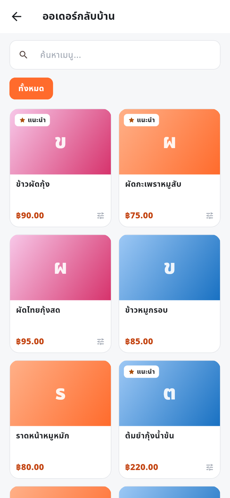
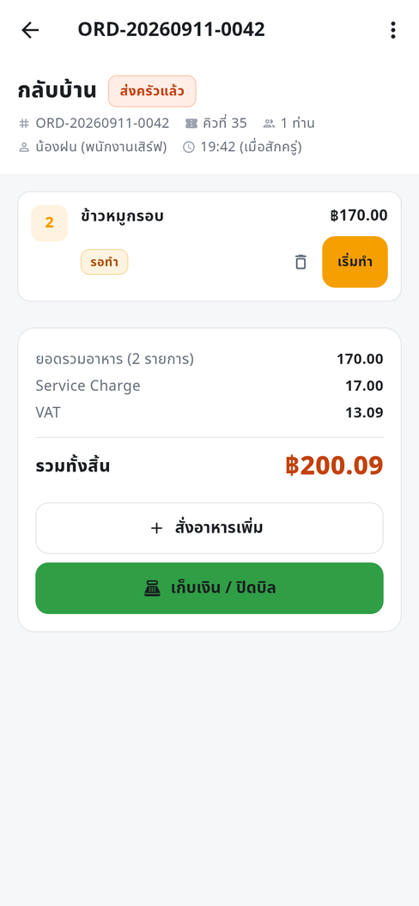
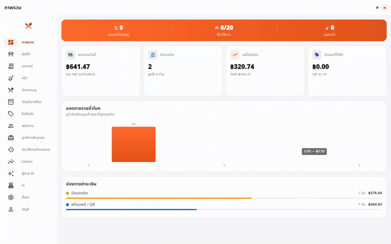
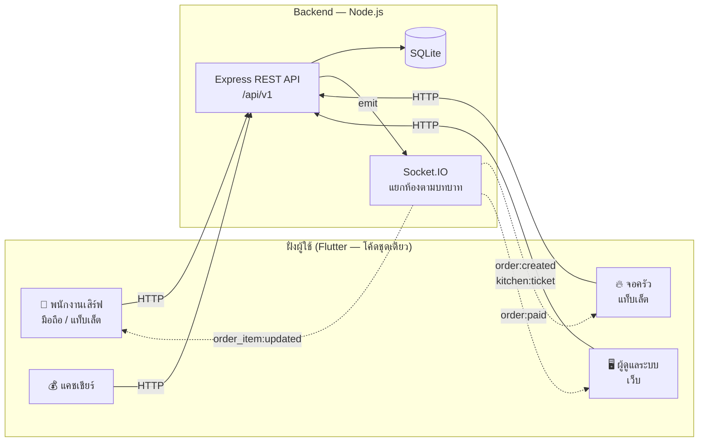
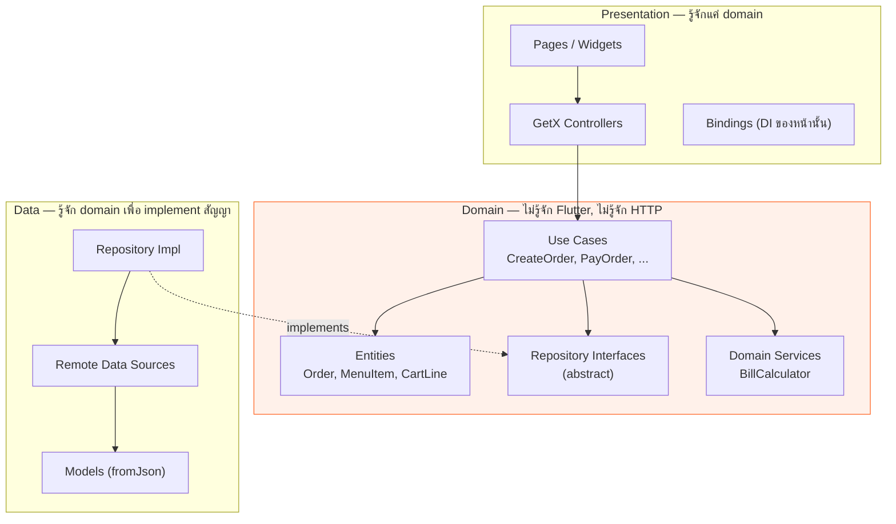

# 🍽️ PaynEat POS — ระบบขายหน้าร้านสำหรับร้านอาหาร

**ภาษา:** ไทย · [English](README.en.md) · [한국어](README.ko.md)

> ระบบ POS ครบวงจร: พนักงานเสิร์ฟรับออเดอร์บนแท็บเล็ต → เด้งเข้าจอครัวทันที → แคชเชียร์ปิดบิล → ผู้จัดการดูยอดขายบนเว็บ
>
> **Flutter (GetX + Clean Architecture)** + **Node.js / Express + SQLite + Socket.IO** — โค้ดชุดเดียวรันได้ทั้ง Android, iOS และ Web

<p align="center">
  
  
  
  
  
  
  
  <a href="LICENSE"></a>
</p>

**English TL;DR** — A full restaurant point-of-sale system built to demonstrate end-to-end product engineering:
a Flutter client (mobile / tablet / web from one codebase, structured with Clean Architecture + GetX) talking to a
Node.js REST + WebSocket backend. Covers the complete floor-to-cash workflow: table map, order taking with
modifiers, live kitchen display, split payments, receipts, and management dashboards — with role-based access
control and 659 automated tests.

> 👤 **สร้างและดูแลโดย [SuruchBoss](https://github.com/SuruchBoss)** — ถ้าคุณ fork หรือต่อยอดโปรเจกต์นี้
> ยินดีมากๆ แค่ขอให้คงไฟล์ [`NOTICE`](NOTICE) ไว้ตามเงื่อนไขของ Apache License 2.0 ทักทาย/พูดคุยได้ที่
> [LinkedIn](https://www.linkedin.com/in/suruchboss)

---

## 🌟 จุดเด่น

- **รองรับหลายสาขาในระบบเดียว** — โต๊ะ/เมนู/ออเดอร์/รายงานแยกตามสาขาไม่ปนกัน สลับสาขาหรือดูยอดรวม
  ทุกสาขาได้จากบัญชีเดียว (`docs/DECISIONS.md` #36)
- **QR พร้อมเพย์ตัวจริง** — สร้าง QR ตามมาตรฐาน EMV QR ให้ลูกค้าสแกนจ่ายได้ทันที ผูกยอดอัตโนมัติ
  ไม่ใช่แค่ปุ่มให้พนักงานกดยืนยันเองว่า "โอนแล้ว"
- **QR สั่งอาหารเอง** — ลูกค้าสแกน QR ที่โต๊ะสั่งอาหารเองได้จากมือถือตัวเองโดยไม่ต้อง login ขึ้นครัว/
  ตัดสต๊อกอัตโนมัติเหมือนพนักงานสั่งเองทุกประการ (`docs/tickets/17-qr-self-order.md`)
- **ผู้ช่วย AI ถามยอดขายด้วยคำพูด** — ขับเคลื่อนด้วย Claude ผ่าน tool-calling กับข้อมูลจริงของร้าน
  ไม่เดา/ไม่แต่งตัวเลข ทุกคำตอบระบุแหล่งข้อมูลกำกับ
- **ออฟไลน์ก็ยังขายต่อได้** — เน็ตหลุดกลางมื้อยังรับออเดอร์ได้ตามปกติ พอกลับมาระบบ sync ให้อัตโนมัติ
  ไม่มีออเดอร์หาย
- **Export รายงาน + Z-report ปิดกะ/ปิดวัน** — ส่งไฟล์ CSV ให้ฝ่ายบัญชีได้ทันที พร้อมกระทบยอดเงินสด
  แยกส่วนลดมือกับโปรโมชัน
- **โหมดคอนทราสต์สูง** — อ่านออกชัดแม้แดดจ้าริมหน้าต่างหรือไอน้ำในครัว ตัวหนังสือผ่านเกณฑ์ WCAG AAA
- **Audit log ครบทุกจุดเสี่ยงต่อการทุจริต** — ยกเลิกออเดอร์ ให้ส่วนลด แก้ VAT คืนเงิน บันทึกผู้ทำ/เวลา/
  เหตุผลไว้เสมอ แก้ไขลบไม่ได้จาก UI ไหนเลย
- **ทดสอบอัตโนมัติ 659 เคส** ก่อนปล่อยทุกครั้ง — ตั้งแต่กฎคิดเงินไปจนถึง flow เต็มร้าน 17 ขั้น

---

## 📸 หน้าตาแอป

<table>
<tr>
<td width="50%" align="center"><b>ผังโต๊ะ — พนักงานเสิร์ฟ</b><br><sub>เห็นสถานะทุกโต๊ะพร้อมยอดค้างในจอเดียว</sub><br><br>
</td>
<td width="50%" align="center"><b>รับออเดอร์พร้อมตัวเลือกเสริม</b><br><sub>ระดับความเผ็ด ของเพิ่ม และโน้ตถึงครัว</sub><br><br>
</td>
</tr>
</table>

<p align="center"><b>จอครัว (KDS)</b> — ตั๋วเด้งขึ้นเองแบบเรียลไทม์ แบ่ง 3 คอลัมน์ตามสถานะ เตือนจานที่รอเกิน 15 นาทีด้วยกรอบแดง และแยกไอคอนโต๊ะ/กลับบ้าน/เดลิเวอรีให้เห็นชัดในตั๋วเดียวกัน</p>
<p align="center"></p>

<p align="center"><b>แดชบอร์ดผู้ดูแลระบบ (เว็บ)</b> — ยอดขายวันนี้ กราฟรายชั่วโมง สัดส่วนช่องทางชำระเงิน และสถานะร้านแบบสด</p>
<p align="center"></p>

<p align="center"><b>เก็บเงินแบบแยกจ่าย</b> — จ่าย QR บางส่วน ที่เหลือเงินสด ระบบตัดยอดคงเหลือและคำนวณเงินทอนให้</p>
<p align="center"></p>

<table>
<tr>
<td width="50%" align="center"><b>สั่งกลับบ้าน/เดลิเวอรี่ — ไม่ผูกโต๊ะ</b><br><sub>กดปุ่มลอยบนหน้าผังโต๊ะ เข้าหน้ารับออเดอร์ได้ทันทีโดยไม่ต้องแตะโต๊ะไหนเลย</sub><br><br>
</td>
<td width="50%" align="center"><b>ได้เลขคิวรับอาหารอัตโนมัติ</b><br><sub>รันต่อวันเฉพาะออเดอร์กลับบ้าน — เดลิเวอรีให้ไรเดอร์อ้างอิงจากเลขที่บิลแทน</sub><br><br>
</td>
</tr>
</table>

> 🎬 **วิดีโอ demo presentation (1:55 · 1080p)**
> · [ฉบับภาษาไทย](docs/video/PaynEat-POS-Demo-TH.mp4)
> · [English edition](docs/video/PaynEat-POS-Demo-EN.mp4)
>
> เดินตามเส้นทางการใช้งานจริงตั้งแต่เปิดผังโต๊ะจนปิดบิล ประกอบภาพหน้าจอจริงทั้ง 14 จอ (รวมหน้าลูกค้าสแกน QR สั่งเอง)
> ([วิธีสร้างใหม่](docs/video/README.md))

> 📄 **เอกสารรวมฟีเจอร์และหน้าจอทั้งหมด 33 หน้าจอ (PDF 30 หน้า)**
> · [ฉบับภาษาไทย](docs/PaynEat-POS-Features-TH.pdf) — อธิบายทีละหน้าจอว่าออกแบบยังไงและเบื้องหลังทำงานยังไง
> · [English edition](docs/PaynEat-POS-Features-EN.pdf) — written for restaurant owners: what each screen solves for the business
>
> ภาพทั้งหมดเรนเดอร์จากโค้ดจริงด้วย golden test ที่เขียนไว้ใน [`app/tool/screenshots`](app/tool/screenshots)
> จึงสร้างใหม่ได้ทุกครั้งที่โค้ดเปลี่ยน ([วิธีสร้าง](docs/generator/README.md))

> 🌐 **หน้า Landing Page — static HTML ไม่มี JavaScript สักบรรทัด**
> · [หน้าจริงบน GitHub Pages](https://suruchboss.github.io/PaynEat/)
> · [English version](https://suruchboss.github.io/PaynEat/index.en.html)
> · [한국어 버전](https://suruchboss.github.io/PaynEat/index.ko.html)
> · [README ภาษาเกาหลี](README.ko.md)
>
> ฉบับเกาหลีตั้งใจใช้ดีไซน์คนละแบบกับอีกสองฉบับ (พื้นสว่าง เทาอมฟ้า การ์ดมุมมนเงานุ่ม
> ตามแบบเว็บบริการเกาหลีสมัยใหม่) ภาพประกอบเป็นภาพแอปภาษาเกาหลีจริง และฟีเจอร์เฉพาะไทย
> (พร้อมเพย์ / ปี พ.ศ. บนใบกำกับภาษี / VAT 7%) เขียนตามจริงพร้อมกล่องอธิบายสั้น ๆ ว่าคืออะไร
> เพราะคนอ่านคือคนเกาหลีที่ทำร้านอยู่ในไทย — ดู `docs/DECISIONS.md` #39
>
> เล่าเรื่องระบบจากเงื่อนไขหน้างานจริง — แสงจ้า ไอน้ำ มือเปื้อน เน็ตสะดุด — พร้อมภาพหน้าจอจริง
> ที่ฝังมาในไฟล์ แอนิเมชันเป็น CSS ล้วน มีปุ่มลองใช้งานตั้งแต่จอแรก และหัวข้อ **ความปลอดภัย** กับ
> **ราคา · ช่องทางติดต่อ** ครบทั้งสามภาษา ภาพหน้าจอแต่ละฉบับเป็นภาษาของฉบับนั้นจริง ๆ ไม่ใช่ภาพไทยใส่ alt ภาษาอื่น
> ผลตรวจความถูกต้องของภาษาและตัวเลขอยู่ใน [`docs/LANDING-PAGE-REVIEW.md`](docs/LANDING-PAGE-REVIEW.md)
>
> ไฟล์ต้นทางคือ [`docs/landing/index.html`](docs/landing/index.html) / [`index.en.html`](docs/landing/index.en.html)
> / [`index.ko.html`](docs/landing/index.ko.html)
> — ภาพหน้าจอฝังมาในไฟล์หมดแล้ว **ยกเว้น** GIF สาธิตผู้ช่วย AI ที่อยู่ใน `docs/ai-demo/`
> (ไฟล์ 924 KB ใหญ่เกินจะ inline) ตัว workflow `deploy-pages.yml` ก๊อปโฟลเดอร์นั้นเข้า site ให้
> ตอน deploy หน้าจริงจึงครบ แต่ถ้าเปิดไฟล์จากรีโปตรง ๆ หัวข้อ "ผู้ช่วย AI" จะขึ้นรูปแตก

> 🤖 **Demo จริงของผู้ช่วย AI ถามตอบข้อมูลร้าน (เรียก Claude API จริง ไม่ใช่ mock)**
>
> <br>
> <sub>ภาพนิ่งความละเอียดเต็ม: <a href="docs/ai-demo/ai-assistant-live.png">ai-assistant-live.png</a></sub>
>
> คลิปนี้บันทึกจากการใช้งานจริง: ล็อกอิน admin → เปิดแท็บ "ผู้ช่วย AI" → พิมพ์คำถามภาษาไทย →
> Claude เรียก tool ดึงข้อมูลยอดขายจริงจากฐานข้อมูล (ไม่ได้เขียนสคริปต์ตอบไว้ล่วงหน้า) → ตอบกลับ
> พร้อมกราฟและชิป "แหล่งข้อมูล" อ้างอิง endpoint ที่เรียกจริง — ดู `docs/ai-demo/ai-assistant-demo.gif`
> ⚠️ **ต่างจากภาพชุดด้านบน**: ภาพชุดนี้**ไม่ได้**มาจาก golden test ที่ freeze เวลาไว้ จึงไม่
> reproducible แบบ byte-ต่อ-byte (ต้องมี `ANTHROPIC_API_KEY` จริงและข้อมูลตัวอย่างที่ seed ไว้
> คำตอบจากโมเดลอาจเปลี่ยนคำพูดได้ทุกครั้งที่เรียกใหม่) รายละเอียดวิธี capture ใหม่และเหตุผลที่แยก
> จากชุด golden test อยู่ใน [`docs/DECISIONS.md` #33](docs/DECISIONS.md)

---

## 📋 สารบัญ

- [จุดเด่น](#-จุดเด่น)
- [หน้าตาแอป](#-หน้าตาแอป)
- [ทำไมถึงทำโปรเจกต์นี้](#-ทำไมถึงทำโปรเจกต์นี้)
- [วิธีรัน](#-วิธีรัน)
- [ฟีเจอร์](#-ฟีเจอร์)
- [เทคโนโลยีที่ใช้](#-เทคโนโลยีที่ใช้)
- [สถาปัตยกรรม](#-สถาปัตยกรรม)
- [โครงสร้างโปรเจกต์](#-โครงสร้างโปรเจกต์)
- [การคำนวณบิล](#-การคำนวณบิล)
- [Realtime](#-realtime)
- [API](#-api)
- [การทดสอบ](#-การทดสอบ)
- [สิ่งที่จะทำต่อ](#-สิ่งที่จะทำต่อ)

---

## 🎯 ทำไมถึงทำโปรเจกต์นี้

โปรเจกต์นี้ตั้งใจสร้างให้เป็นระบบที่ **ไม่ใช่ To-do list** แต่มีกฎทางธุรกิจจริง ๆ ให้จัดการ

ร้านอาหารเป็นโจทย์ที่ดีเพราะมีเงื่อนไขที่ต้องคิดเยอะกว่าที่เห็น:

- แก้ออเดอร์ได้ถึงเมื่อไหร่? (ครัวเริ่มทำแล้วห้ามแก้ ต้องให้ผู้จัดการ void แทน)
- คิด VAT ก่อนหรือหลัง Service Charge? แล้วส่วนลดล่ะ?
- โต๊ะเดียวกันเปิดสองบิลพร้อมกันได้ไหม?
- ลูกค้าขอแยกจ่าย QR ครึ่งหนึ่ง เงินสดครึ่งหนึ่ง ต้องรองรับ
- ครัวกับพนักงานเสิร์ฟอยู่คนละเครื่อง ต้องเห็นสถานะตรงกันแบบทันที
- เงินต้องไม่เพี้ยนจาก floating point

โปรเจกต์นี้จึงเน้น **ความถูกต้องของ business logic + โครงสร้างที่ดูแลต่อได้** มากกว่าความหวือหวาของ UI

---

## 🚀 วิธีรัน

> ใช้เวลาประมาณ 5 นาที · ถ้าติดปัญหา ดูหัวข้อ [แก้ปัญหาที่พบบ่อย](#-แก้ปัญหาที่พบบ่อย) ท้ายหัวข้อนี้

### ขั้นที่ 0 — ดาวน์โหลดโค้ด

```bash
git clone https://github.com/SuruchBoss/PaynEat.git
cd PaynEat
```

---

### 🅰️ ทางเลือก A — รันตรงในเครื่อง (แนะนำ)

**ต้องมี**

| เครื่องมือ | เวอร์ชัน | ตรวจด้วย |
|---|---|---|
| [Node.js](https://nodejs.org) | 20 ขึ้นไป (แนะนำ 22) | `node -v` |
| [Flutter SDK](https://docs.flutter.dev/get-started/install) | 3.35 ขึ้นไป | `flutter --version` |

**เทอร์มินัลที่ 1 — Backend**

```bash
cd backend
npm install
npm run dev
```

ถ้าขึ้นแบบนี้คือสำเร็จ (ฐานข้อมูลและข้อมูลตัวอย่างถูกสร้างให้อัตโนมัติ ไม่ต้องตั้งค่าอะไรเพิ่ม):

```
🍽️  PaynEat POS API
   ▸ REST      : http://localhost:3000/api/v1
   ▸ Docs      : http://localhost:3000/docs
   ▸ Health    : http://localhost:3000/health
   ▸ Realtime  : ws://localhost:3000 (socket.io)
```

**เทอร์มินัลที่ 2 — แอป** (เปิดหน้าต่างใหม่ อย่าปิดอันแรก)

```bash
cd app
flutter pub get
flutter run -d chrome        # รันบนเว็บ — เร็วที่สุด
```

หรือถ้าอยากดูบนมือถือ/แท็บเล็ต:

```bash
flutter devices              # ดูอุปกรณ์ที่ต่ออยู่
flutter run                  # เลือกอุปกรณ์ที่เจอ
```

> 📱 **Android emulator**: แอปจะชี้ไป `10.0.2.2:3000` ให้อัตโนมัติ (loopback ของเครื่อง host) ไม่ต้องตั้งค่าเพิ่ม
> 📱 **มือถือจริงต่อ WiFi เดียวกัน**: ต้องบอก IP ของคอมพิวเตอร์ เช่น
> `flutter run --dart-define=API_BASE_URL=http://192.168.1.15:3000`
> (หา IP: `ipconfig` บน Windows / `ifconfig | grep inet` บน macOS-Linux)

---

### 🅱️ ทางเลือก B — Docker (ไม่ต้องติดตั้ง Node หรือ Flutter)

เหมาะกับกรณีที่แค่อยากเห็นระบบทำงานจริง โดยไม่อยากลง toolchain อะไรเลย

**ต้องมี:** [Docker Desktop](https://www.docker.com/products/docker-desktop/) เท่านั้น

```bash
docker compose up --build
```

รอครั้งแรกประมาณ 5–10 นาที (ต้องดาวน์โหลด Flutter SDK มา build เว็บให้) ครั้งต่อไปจะเร็วมาก

เมื่อขึ้นข้อความ `payneat-web` และ `payneat-api` แล้ว เปิดเบราว์เซอร์:

| เปิดที่ | จะเจออะไร |
|---|---|
| **http://localhost:8080** | 👈 **เริ่มที่นี่** — หน้าเข้าสู่ระบบของแอป |
| http://localhost:3000/docs | เอกสาร API แบบกดลองยิงได้ (Swagger UI) |
| http://localhost:3000/health | ตรวจว่า API ทำงานอยู่ |

ปิดระบบด้วย `Ctrl+C` แล้ว `docker compose down`
(อยากล้างข้อมูลให้เริ่มใหม่หมด: `docker compose down -v`)

---

### 🆑 ทางเลือก C — ดูแอปอย่างเดียว ไม่ต้องรัน backend

ถ้าอยากดูแค่ฝั่ง Flutter โดยไม่อยากเปิดเซิร์ฟเวอร์:

```bash
cd app
flutter pub get
flutter run -d chrome --dart-define=DEMO_MODE=true
```

แอปจะใช้ข้อมูลจำลองที่อยู่ในเครื่องแทน ใช้งานได้ครบทุกฟีเจอร์
(ไม่มีการอัปเดตข้อมูลข้ามเครื่องแบบเรียลไทม์ เพราะไม่มีเซิร์ฟเวอร์ และข้อมูลจะรีเซ็ตเมื่อรีเฟรชหน้า)

> 💡 โหมดนี้สลับที่ `_bindDataSources()` **จุดเดียว** โดยไม่แก้หน้าจอ, controller หรือ use case เลย
> เป็นตัวอย่างรูปธรรมว่าทำไมถึงแยกชั้นแบบ Clean Architecture

---

### 👤 บัญชีสำหรับเข้าใช้งาน

หน้าเข้าสู่ระบบมีปุ่มกดเลือกบัญชีให้อัตโนมัติ ไม่ต้องพิมพ์เอง

| บทบาท | username | password | เห็นอะไรบ้าง |
|---|---|---|---|
| ผู้ดูแลระบบ | `admin` | `admin123` | ทุกอย่าง (แดชบอร์ด, จัดการเมนู, พนักงาน, รายงาน, ตั้งค่า) |
| ผู้จัดการ | `manager` | `manager123` | เหมือน admin แต่ลบบัญชีผู้ใช้ไม่ได้ |
| พนักงานเสิร์ฟ | `waiter1` | `waiter123` | ผังโต๊ะ, ออเดอร์, จอครัว |
| ครัว | `kitchen` | `kitchen123` | จอครัวอย่างเดียว |
| แคชเชียร์ | `cashier` | `cashier123` | ผังโต๊ะ, ออเดอร์, รายงาน |
| พนักงานเสิร์ฟ (2 สาขา) | `waiter2` | `waiter123` | เหมือน `waiter1` แต่มีสิทธิ์เข้าได้ทั้งสาขาสุขุมวิท/ทองหล่อ — ไม่มีปุ่มลัดที่หน้า login ต้องพิมพ์เอง ใช้ลองหน้าเลือกสาขา (ต้องต่อ backend จริงเท่านั้น ดูหัวข้อทัวร์ด้านล่าง) |

> ⚠️ **บัญชีเหล่านี้มีไว้สำหรับดูตัวอย่างเท่านั้น** ถ้าจะ deploy backend นี้ไปใช้งานจริง (ไม่ใช่แค่รันดูในเครื่อง)
> ต้องเปลี่ยนรหัสผ่านเหล่านี้หรือปิด `AUTO_SEED` ก่อนเสมอ — ดูรายละเอียดและเช็คลิสต์ก่อน deploy ใน
> [`SECURITY.md`](SECURITY.md)

---

### 🗺 ทัวร์ 5 นาที — กดตามนี้จะเห็นระบบทำงานครบทั้งวงจร

> **เคล็ดลับ:** เปิด **2 หน้าต่างเบราว์เซอร์คู่กัน** (หน้าต่างหนึ่งเป็นพนักงานเสิร์ฟ อีกหน้าต่างเป็นครัว
> โดยหน้าต่างที่สองใช้โหมดไม่ระบุตัวตน) จะเห็นออเดอร์เด้งข้ามจอแบบเรียลไทม์
> *(ใช้ได้กับทางเลือก A และ B — ทางเลือก C ไม่มีเซิร์ฟเวอร์จึงไม่มีเรียลไทม์)*

1. **เข้าเป็นพนักงานเสิร์ฟ** (`waiter1`) → เห็นผังโต๊ะแยกโซน สีเขียวคือว่าง
2. **แตะโต๊ะ A1** → เข้าหน้ารับออเดอร์
3. **กด "ผัดกะเพราหมูสับ"** → มีหน้าต่างให้เลือกระดับความเผ็ดและของเพิ่ม ลองใส่ "ไข่ดาว (+15)" แล้วพิมพ์โน้ตถึงครัว
4. **กดแถบ "ผูกลูกค้ากับออเดอร์นี้ (ไม่บังคับ)" เหนือตะกร้า** → ค้นหาจากเบอร์โทร ถ้าไม่เจอกด
   **"เพิ่มลูกค้าใหม่"** กรอกชื่อ+เบอร์โทรแล้วกด **"บันทึกและเลือก"** → แถบจะเปลี่ยนเป็นชื่อลูกค้าทันที
5. **ดูตะกร้าด้านขวา** → เห็นยอดรวม + Service Charge 10% + VAT 7% คำนวณให้ทันที
6. **กด "ยืนยันและส่งครัว"** → เข้าหน้ารายละเอียดออเดอร์ พร้อมเลขที่บิล
7. **สลับไปหน้าต่างครัว** (`kitchen`) → ตั๋วอาหารเด้งขึ้นเองโดยไม่ต้องรีเฟรช
   กด **"เริ่มทำ" → "ทำเสร็จแล้ว"** ดูตั๋ววิ่งข้ามคอลัมน์
8. **กลับหน้าต่างพนักงานเสิร์ฟ** → สถานะเปลี่ยนตามทันที กด **"เสิร์ฟแล้ว"**
9. **กด "เก็บเงิน / ปิดบิล"** → เพราะผูกลูกค้าไว้ตั้งแต่ขั้นตอน 4 จะเห็นกล่อง **"แต้มสะสม"** โชว์
   แต้มคงเหลือของลูกค้า (ลูกค้าใหม่ยังไม่มีแต้มให้ใช้) ลองแยกจ่าย: เลือกช่องทาง **"QR"** จ่าย 100
   บาทก่อน → เห็น **QR พร้อมเพย์จริง** ที่สแกนได้ (ผูกยอด 100 บาทให้อัตโนมัติ ลองพิมพ์ยอดใหม่ดู QR
   จะเปลี่ยนตาม) แล้วที่เหลือจ่ายเงินสด (ระบบตัดยอดคงเหลือและคำนวณเงินทอนให้) — จ่ายครบแล้วลูกค้า
   จะได้แต้มสะสมอัตโนมัติตามยอดซื้อ (ค่าเริ่มต้น 25 บาท/แต้ม)
10. **จะเด้งไปหน้าใบเสร็จ** → เห็นปุ่ม **"ขอใบกำกับภาษี"** ให้เลือกออกอย่างย่อ (ทันที) หรือเต็มรูป
    (กรอกชื่อ+ที่อยู่ลูกค้า) → ได้เอกสารพร้อมเลขที่รันต่อเนื่อง (เช่น `INV69-000001`) ทันที
11. **กลับไปดูผังโต๊ะ** → โต๊ะ A1 กลับมาเป็นสีเขียวเองแล้ว
12. **กดปุ่ม "สั่งกลับบ้าน/เดลิเวอรี่"** (มุมขวาล่างของหน้าผังโต๊ะ) → เข้าหน้ารับออเดอร์แบบไม่ผูก
    โต๊ะ (หัวหน้าจอขึ้น "ออเดอร์กลับบ้าน") → ลองเพิ่มเมนูสักอย่างแล้วกด **"ยืนยันและส่งครัว"** → เห็น
    ข้อความแจ้ง **"เปิดออเดอร์ ... เรียบร้อย คิวที่ N"** และตัวเลขคิวเดียวกันโชว์เป็นป้าย 🎫 บนหน้า
    รายละเอียดออเดอร์ (เลขคิวรันต่อวันเฉพาะออเดอร์กลับบ้าน — เดลิเวอรีให้ไรเดอร์อ้างอิงจากเลขที่บิลแทน)
13. **สลับไปหน้าต่างครัวอีกครั้ง** → ตั๋วใบใหม่นี้ขึ้นไอคอน 🥡 "กลับบ้าน" แทนไอคอนโต๊ะ ทำให้แยกออกจาก
    ออเดอร์ทานที่ร้านได้ทันทีโดยไม่ต้องเปิดดูรายละเอียด
14. **ออกจากระบบแล้วเข้าใหม่เป็น `admin`** → เปิดหน้า **ภาพรวม** จะเห็นยอดที่เพิ่งขายไปเข้ารายงานทันที
    พร้อมกราฟรายชั่วโมงและสัดส่วนช่องทางชำระเงิน (เมนูขายดีดูได้ที่หน้า **รายงาน**)
15. **เปิดหน้า ลูกค้า/แต้มสะสม** (ไอคอนของขวัญ 🎁 ในเมนูด้านซ้าย — เห็นได้ทั้ง `admin`/`manager`)
    → เห็นลูกค้าที่เพิ่งสร้างในขั้นตอน 4 พร้อมแต้มสะสมที่เพิ่งได้ กดเข้าไปที่ชื่อเพื่อดูประวัติการซื้อ
    ของเขารายคน (ออเดอร์ที่เพิ่งปิดบิลไปต้องอยู่ในนั้น)
16. **เปิดหน้า วัตถุดิบ/สต๊อก** (ไอคอนกล่อง 📦 ในเมนูด้านซ้าย) → เห็น "ปลาทับทิม" ถูกไฮไลต์แจ้งเตือน
    ของใกล้หมดให้ทันทีตั้งแต่ seed ข้อมูล
17. **เปิดหน้า ประวัติการทำรายการ** (ไอคอนนาฬิกา 🕘 ในเมนูด้านซ้าย — เห็นเฉพาะ `admin` เท่านั้น
    ไม่รวม `manager`) → filter ตามประเภท action ได้ด้วยชิปเลือก ตอนนี้ยังว่างอยู่ — ลองยกเลิก
    ใบกำกับภาษีที่ออกในขั้นตอน 10 ก่อน (กด **"ยกเลิกใบกำกับภาษี"** ที่หน้าใบเสร็จเดิม) แล้วกลับมา
    หน้านี้ จะเห็น log ใหม่ทันทีพร้อมชื่อผู้ทำ เวลา และเหตุผลที่กรอกไว้ — ลองกดปุ่ม **"ช่วงเวลา"**
    เพื่อกรองเฉพาะวันนี้ แล้วกดไอคอน **ดาวน์โหลด 📥** เพื่อส่งออกเป็นไฟล์ CSV (เปิดในเบราว์เซอร์
    บนเว็บเท่านั้น — ดูหัวข้อ 💰 แคชเชียร์/🖥️ ผู้ดูแลระบบ)
18. **เปิดหน้า ผู้ช่วย AI** (ไอคอนประกาย ✨ ในเมนูด้านซ้าย — เห็นได้ทั้ง `admin`/`manager`) → พิมพ์
    หรือกดคำถามตัวอย่างเช่น **"ยอดขายวันนี้เท่าไร"** → AI จะเรียกเครื่องมือดึงข้อมูลจริงจากระบบก่อน
    ตอบเสมอ (ไม่เดา/ไม่แต่งตัวเลข) เห็นได้จากชิป **"แหล่งข้อมูล"** ท้ายคำตอบทุกครั้งว่าใช้เครื่องมือไหน
    ตอบ — ถ้าคำถามเกี่ยวกับตัวเลขที่ plot เทียบกันได้ (เช่นเมนูขายดี) จะมีกราฟแท่งแนบมาด้วย
    (ต้องตั้งค่า `ANTHROPIC_API_KEY` ก่อนถึงจะตอบได้จริง — ไม่ตั้งค่าจะขึ้นข้อความแจ้งชัดเจนว่ายังไม่
    เปิดใช้งาน แทนที่จะพัง ดู `docs/tickets/15-ai-ask-your-data.md`, `docs/DECISIONS.md` #33)
19. **ออกจากระบบแล้วเข้าใหม่เป็น `cashier`** → เปิดเมนู **"กะ"** (ไอคอนแคชเชียร์ในเมนูด้านซ้าย) →
    กรอกเงินตั้งต้นแล้วกด **"เปิดกะ"** → ไปรับออเดอร์และเก็บเงินสักบิล (ทำซ้ำขั้นตอน 2-9 แบบย่อ) →
    กลับมาหน้า **"กะ"** กด **"ปิดกะ"** กรอกยอดเงินสดที่นับได้จริง → เห็นส่วนต่างเทียบกับยอดที่ระบบ
    คาดไว้ทันที พร้อมปุ่ม **"ดูใบสรุปปิดกะ (Z-report)"** — กดดูสรุปยอดขาย/ภาษี/ส่วนลด (แยกส่วนลดมือ
    กับโปรโมชัน)/ช่องทางชำระเงินของกะนั้นทั้งหมด แล้วกด **"ส่งออก CSV"** ดาวน์โหลดเป็นไฟล์ได้เลย —
    กะเก่าในหัวข้อ **"ประวัติกะย้อนหลัง"** ด้านล่างก็กดดู Z-report ย้อนหลังได้เช่นกัน (กะที่ยังเปิดอยู่
    กดไม่ได้ เพราะยอดกระทบเงินสดยังไม่ถูกคำนวณจนกว่าจะปิดกะ ดู `docs/tickets/12-report-export.md`)
20. **เปิดเมนู "รายงาน"** (เห็นได้ตั้งแต่ `cashier` ขึ้นไป) → กดไอคอน **ดาวน์โหลด 📥** มุมขวาบนแถบ
    เลือกช่วงเวลา → เลือกส่งออก **"สรุปยอดขาย"**, **"เมนูขายดี"** หรือ **"ยอดขายรายวัน"** อย่างใดอย่างหนึ่ง
    → ได้ไฟล์ CSV ตามช่วงวันที่ที่กำลังดูอยู่ทันที (เปิดในเบราว์เซอร์บนเว็บเท่านั้น เหมือนการส่งออก
    ประวัติการทำรายการในขั้นตอน 17)
21. **(เฉพาะทางเลือก A/B ที่ต่อ backend จริง — โหมดสาธิตมีสาขาเดียวจึงข้ามขั้นตอนนี้ได้)**
    ออกจากระบบแล้วเข้าใหม่เป็น `waiter2`/`waiter123` (พิมพ์เอง ไม่มีปุ่มลัด) → เจอหน้า **"เลือกสาขา"**
    ทันทีเพราะบัญชีนี้มีสิทธิ์เข้าได้ 2 สาขา → เลือก **"สาขาทองหล่อ"** → เข้าหน้าผังโต๊ะจะเห็นชื่อโต๊ะ/
    เมนูเป็นชุดใหม่ทั้งหมด (ธีมซีฟู้ด/ปิ้งย่าง) ไม่ปนกับสาขาสุขุมวิทที่ใช้มาตลอดทัวร์นี้เลย
22. **ออกจากระบบแล้วเข้าใหม่เป็น `admin`** → เปิดหน้า **บัญชี** (ไอคอนคนที่แถบล่าง/rail) → เห็นการ์ด
    **"สาขาปัจจุบัน"** กด **"สลับสาขา"** → เลือก **"ทุกสาขา"** (ตัวเลือกนี้มีเฉพาะ `admin`) → กลับไป
    หน้า **ภาพรวม/รายงาน** จะเห็นยอดขายรวมทั้ง 2 สาขาทันที ไม่ต้องสลับไปมาทีละสาขาเพื่อรวมยอดเอง
23. **เข้าเป็น `waiter1` (หรือ `manager`)** → กลับไปหน้าผังโต๊ะ กดค้างที่การ์ดโต๊ะ A1 → เลือก
    **"ดู QR สั่งอาหารเอง"** → เห็นภาพ QR จริงที่ลูกค้าสแกนได้ กด **"คัดลอกลิงก์"** แล้ววางเปิดในแท็บ/
    หน้าต่างใหม่ (จำลองลูกค้าสแกน QR ด้วยมือถือตัวเอง) → เจอหน้าเมนูของโต๊ะ A1 ทันที **ไม่ต้อง
    login เลย** เลือกเมนูใส่ตะกร้าแล้วกด **"ส่งเข้าครัว"** → สลับกลับไปหน้าต่างพนักงานเสิร์ฟ/ครัว จะเห็น
    รายการที่ลูกค้าสั่งเองขึ้นในออเดอร์เดิมของโต๊ะ A1 ทันทีเหมือนพนักงานสั่งเองทุกประการ (ตัดสต๊อก/
    คำนวณโปรโมชันอัตโนมัติเหมือนกัน) ดู `docs/tickets/17-qr-self-order.md`

24. **ลองสลับภาษาทั้งแอป** → เปิดหน้า **บัญชี** (ไอคอนคนที่แถบล่าง/rail) → ที่หัวข้อ **ภาษา**
    กดสลับระหว่าง **ไทย / English / 한국어** → ทุกหน้าจอเปลี่ยนทันทีโดยไม่ต้องรีสตาร์ต
    และจำค่าไว้กับเครื่อง เปิดแอปครั้งหน้าได้ภาษาเดิม — ชื่อเมนู/ชื่อโซนยังเป็นค่าที่ร้านพิมพ์เข้าไป
    (ภาษาเกาหลีจะได้ชื่อเมนูอักษรละตินแทนอักษรไทย) ส่วนชื่อบนตั๋วครัวและใบเสร็จของบิลเก่า
    ไม่ขยับตามภาษา เพราะเป็นค่าที่บันทึกไว้ตอนสั่ง (ดู `docs/DECISIONS.md` #39)

**อยากลองกฎทางธุรกิจที่ซ่อนอยู่?**

- ลองเปิดออเดอร์ที่โต๊ะเดิมซ้ำ → ระบบปฏิเสธ พร้อมบอกให้ไปเพิ่มในบิลเดิม
- ลองแก้จำนวนอาหารหลังครัวกด "เริ่มทำ" แล้ว → แก้ไม่ได้ ต้องให้ผู้จัดการยกเลิกรายการแทน
- เข้าเป็น `waiter1` แล้วลองหาเมนู "จัดการพนักงาน" → ไม่มีให้เห็น (และถ้ายิง API ตรง ๆ ก็ได้ 403)
- เข้าเป็น `admin` → **จัดการเมนู** → ปิดสวิตช์เมนูใดเมนูหนึ่ง แล้วกลับไปหน้าสั่งอาหาร จะขึ้น "ของหมด" กดไม่ได้
- เข้าเป็น `admin` → **วัตถุดิบ/สต๊อก** → กดปุ่มปรับสต๊อกของ "ปลาทับทิม" → เลือก "ตัดออก" ใส่ 3
  (สต๊อกเริ่มต้นพอดี) → กลับไปหน้าสั่งอาหาร เมนู "ปลาทับทิมนึ่งมะนาว" จะขึ้น "ของหมด" **เอง** โดยไม่มีใคร
  ไปกดปิดขาย (ตัดสต๊อกอัตโนมัติ ดู `docs/DECISIONS.md` #15) — กด "รับเข้า" เติมสต๊อกกลับก็เปิดขายให้เองเช่นกัน
- ลองออกใบกำกับภาษีให้บิลเดียวกันซ้ำอีกใบ → ระบบปฏิเสธ (ออกได้ 1 ใบต่อบิลที่ยังไม่ถูกยกเลิก) — เข้าเป็น
  `manager` แล้วกด **"ยกเลิกใบกำกับภาษี"** ที่หน้าใบเสร็จเดิมก่อน ถึงจะออกใบใหม่ให้บิลนั้นได้อีกครั้ง
  ด้วยเลขที่รันใหม่ (ดู `docs/DECISIONS.md` #19)
- การกระทำที่เสี่ยงต่อการทุจริตหน้าร้านทั้งหมด (ยกเลิกออเดอร์, ยกเลิกรายการหลังส่งครัว, ให้ส่วนลด,
  ปิดใช้งาน/ลบ/เปลี่ยนสิทธิ์พนักงาน, แก้ VAT/ค่าบริการ, คืนเงิน, ยกเลิกใบกำกับภาษี) ถูกบันทึกไว้ที่
  หน้า **ประวัติการทำรายการ** (เห็นเฉพาะ `admin`) เสมอ พร้อมผู้ทำ/เวลา/เหตุผล — ลองทำข้อไหนก็ได้
  ข้างบนนี้แล้วกลับไปดูหน้านั้น (ดูขั้นตอน 17 ในทัวร์ และ `docs/DECISIONS.md` #21)
- ลองแลกแต้มสะสมตอนเก็บเงินเกินยอดที่ลูกค้ามี หรือเกินยอดที่ต้องจ่ายรอบนั้น → ระบบปฏิเสธทั้งคู่
  (ไม่ปัดลดให้อัตโนมัติ) และถ้าออเดอร์ไม่ได้ผูกลูกค้าไว้ตั้งแต่แรก ช่องแลกแต้มจะไม่ให้ใช้เลย — ลองจ่าย
  ออเดอร์ที่ผูกลูกค้าด้วยแต้มบางส่วนแล้วดูว่ายอดที่ "นับเข้าออเดอร์" กับยอดที่ "เก็บเงินจริง" ต่างกัน
  ยังไง (ดู `docs/DECISIONS.md` #22)
- เข้าเป็น `admin` → **ตั้งค่า** → ลบเลขในช่อง **"เลขพร้อมเพย์"** แล้วบันทึก → กลับไปหน้าเก็บเงิน
  เลือกช่องทาง "QR" อีกครั้ง → ขึ้นข้อความแจ้งชัดเจนว่ายังไม่ได้ตั้งค่า แทนที่จะพัง/โชว์ QR เปล่าๆ
  — ใส่เลขกลับคืน (เช่น `0812345678`) แล้วลองใหม่จะเห็น QR จริงกลับมา (ดู
  `docs/tickets/16-promptpay-qr.md`, `docs/DECISIONS.md` #26)
- เข้าเป็น `admin` → **จัดการเมนู** → แก้ราคาเมนูสักอย่าง (เช่น 75 → 80 บาท) → กลับไปหน้า
  **ประวัติการทำรายการ** → เห็น log ใหม่ทันทีแบบ "แก้ราคาเมนู ... 75 → 80 บาท" — แต่ถ้าแก้แค่ชื่อ/
  คำอธิบายโดยไม่แตะราคา จะไม่มี log ใหม่ขึ้น (ตั้งใจ log เฉพาะสิ่งที่กระทบตัวเลขจริง เหมือนหลักการ
  เดียวกับการแก้จำนวนรายการในออเดอร์ ดู `docs/DECISIONS.md` #27)
- ลองคัดลอกลิงก์ QR ของโต๊ะ A1 ไว้ก่อน (ขั้นตอน 23) แล้วเข้าเป็น `admin`/`manager` กด **"เปลี่ยน QR"**
  ที่ชีทเดิม → เปิดลิงก์เก่าที่คัดลอกไว้อีกครั้ง → ขึ้นข้อความแจ้งชัดเจนว่าไม่พบโต๊ะนี้ทันที (ลิงก์เก่า
  ใช้ไม่ได้อีกเลยตั้งแต่วินาทีที่กดเปลี่ยน ไม่ต้องรอ token หมดอายุ ดู `docs/DECISIONS.md` #37)
- ลองพิมพ์ลิงก์ `/order/` ตามด้วยตัวอักษร/ตัวเลขภาษาอังกฤษมั่วๆ เอง (เช่น `/order/abc123` — ไม่ใช่
  token จริง) → ขึ้นข้อความแจ้ง "ไม่พบโต๊ะนี้" พร้อมไอคอน QR (ไม่ใช่ไอคอนเน็ตหลุด) และ**ไม่มีปุ่มลอง
  ใหม่** เพราะลิงก์เสียแล้วกดกี่ครั้งก็ไม่สำเร็จ — ต่างจากตอนเน็ตสะดุดจริงที่ยังมีปุ่มให้กดลองใหม่ —
  ไม่มีทางเดา token โต๊ะอื่นได้จากเลข table id ตรงๆ เพราะ token เป็นค่าสุ่มแยกเก็บต่างหาก ไม่ใช่เลข
  id ที่ไล่ทีละ 1

---

### 🧪 อยากรันเทสต์ดู

```bash
cd backend && npm test      # 293 เคส — รวมเทสต์ที่ไล่เส้นทางทั้งร้าน 17 ขั้น
cd app && flutter test      # 366 เคส — domain / controller / widget
```

---

### 🔧 แก้ปัญหาที่พบบ่อย

<details>
<summary><b>กดดูวิธีแก้</b></summary>

| อาการ | สาเหตุ | วิธีแก้ |
|---|---|---|
| `Error: listen EADDRINUSE :::3000` | มีโปรแกรมอื่นใช้พอร์ต 3000 อยู่ | เปลี่ยนพอร์ต: `PORT=3001 npm run dev` แล้วรันแอปด้วย `flutter run -d chrome --dart-define=API_BASE_URL=http://localhost:3001` |
| แอปขึ้น "เชื่อมต่อเซิร์ฟเวอร์ไม่ได้" | backend ยังไม่ได้รัน หรือรันคนละพอร์ต | เปิด http://localhost:3000/health ในเบราว์เซอร์ ถ้าไม่ขึ้นแปลว่า backend ยังไม่ทำงาน |
| มือถือจริงเชื่อมต่อไม่ได้ | มือถือไม่รู้จัก `localhost` ของคอม | ส่ง IP ของคอมเข้าไป: `--dart-define=API_BASE_URL=http://<IP ของคอม>:3000` และต้องอยู่ WiFi เดียวกัน |
| `npm install` ล้มเหลวที่ `better-sqlite3` | ไม่มี build tool สำหรับ compile native module | Windows: `npm install --global windows-build-tools` · macOS: `xcode-select --install` · Linux: `sudo apt install build-essential python3` |
| `flutter run` ฟ้องเวอร์ชัน Dart ไม่พอ | Flutter เก่ากว่า 3.35 | `flutter upgrade` |
| Docker build ค้างนานที่ขั้น Flutter | กำลังดาวน์โหลด Flutter SDK ~2GB ครั้งแรก | รอให้จบ (5–10 นาที) ครั้งต่อไปจะใช้ cache |
| เว็บใน Docker เปิดได้แต่ล็อกอินไม่ได้ | เบราว์เซอร์เรียก API ไม่เจอ | ตรวจว่า http://localhost:3000/health ขึ้น ถ้าเปลี่ยนพอร์ต ให้ตั้ง `API_BASE_URL` ใน `docker-compose.yml` ให้ตรงกัน |
| อยากล้างข้อมูลเริ่มใหม่ | — | ตรงในเครื่อง: `cd backend && npm run db:reset` · Docker: `docker compose down -v` |

</details>

---

## ✨ ฟีเจอร์

### 📱 พนักงานเสิร์ฟ (มือถือ / แท็บเล็ต)

- **ผังโต๊ะ** แยกตามโซน เห็นสถานะ (ว่าง / มีลูกค้า / จอง / เรียกเก็บเงิน) พร้อมยอดค้างและเวลาที่ลูกค้านั่งอยู่
- **รับออเดอร์** ค้นหาเมนู กรองตามหมวดหมู่ เลือกตัวเลือกเสริม (ระดับความเผ็ด, ไข่ดาว +15) และพิมพ์โน้ตถึงครัว
- **ตะกร้าอัจฉริยะ** รายการที่เหมือนกันทุกอย่างจะรวมเป็นบรรทัดเดียวอัตโนมัติ
- **พรีวิวยอดบิล** เห็น Service Charge และ VAT ทันทีขณะกดสั่ง ไม่ต้องรอเซิร์ฟเวอร์
- **สั่งเพิ่มรอบสอง** เข้าออเดอร์เดิมได้ และกดเสิร์ฟรายการที่ครัวทำเสร็จแล้ว — เน็ตหลุดตอนกดยืนยัน
  ก็ยังใช้งานต่อได้ รายการจะถูกเก็บไว้ในเครื่องแล้วส่งขึ้นระบบอัตโนมัติเมื่อเน็ตกลับมา (ดูหัวข้อ
  🔐 ระบบ)
- **ย้ายโต๊ะ** ลูกค้าขอย้ายที่นั่ง ก็ย้ายออเดอร์ทั้งใบไปโต๊ะใหม่ได้โดยไม่ต้องยกเลิกแล้วสั่งใหม่
- **รวมบิล** สองโต๊ะที่มานั่งด้วยกัน รวมเป็นบิลเดียวได้ทันที (รายการอาหารและสถานะครัวยังคงเดิม)
- **ผูกลูกค้ากับออเดอร์** แบบ optional ตอนเปิดออเดอร์ใหม่ ค้นหาจากเบอร์โทรหรือเพิ่มลูกค้าใหม่ได้
  ในหน้าต่างเดียว — ไม่ผูกก็สั่งอาหารได้ตามปกติ (ดูหัวข้อ 💰 แคชเชียร์ สำหรับการใช้แต้มสะสม)
- **สั่งกลับบ้าน/เดลิเวอรี่** ปุ่มลอยหน้าผังโต๊ะ เปิดออเดอร์ได้โดยไม่ต้องผูกกับโต๊ะเลย ได้เลขคิวรับ
  อาหารรันต่อวันให้อัตโนมัติเฉพาะออเดอร์กลับบ้าน (เดลิเวอรีให้ไรเดอร์อ้างอิงจากเลขที่บิลแทน — ไม่มี
  คนมายืนรอคิวหน้าร้าน) เห็นเลขคิวทั้งในข้อความแจ้งเตือนตอนส่งครัวและหน้ารายละเอียดออเดอร์
- **ดู QR สั่งอาหารเอง** กดค้างที่การ์ดโต๊ะ → เห็นภาพ QR จริงของโต๊ะนั้นให้ลูกค้าสแกน พร้อมปุ่ม
  คัดลอกลิงก์ — เฉพาะ `admin`/`manager` มีปุ่ม **"เปลี่ยน QR"** เพิ่ม สำหรับกรณี QR ที่พิมพ์ไว้ที่โต๊ะ
  หลุด/ถูกถ่ายรูปแอบอ้างไป (ปิดลิงก์เก่าทันทีที่กด ดู `docs/tickets/17-qr-self-order.md`)

### 🙋 ลูกค้า (สแกน QR ที่โต๊ะ — ไม่ต้อง login)

- **สั่งอาหารเองจากมือถือตัวเอง** สแกน QR ที่โต๊ะแล้วเห็นเมนูทันที ไม่ต้องเรียกพนักงานหรือสมัคร/
  login ใดๆ ทั้งสิ้น
- **เห็นออเดอร์ปัจจุบันของโต๊ะตัวเอง** ถ้าพนักงานเปิดออเดอร์ไว้ก่อนแล้ว (หรือคนโต๊ะเดียวกันสั่งไปก่อน)
  เห็นรายการที่มีอยู่แล้วพร้อมยอดรวมทันที
- **เลือกตัวเลือกเสริม/พิมพ์โน้ตถึงครัวได้เหมือนพนักงาน** ใส่ตะกร้าแล้วกด "ส่งเข้าครัว" — รายการขึ้น
  ที่ผังโต๊ะ/จอครัวแบบเรียลไทม์ทันทีเหมือนพนักงานสั่งเอง ตัดสต๊อกและคำนวณโปรโมชันอัตโนมัติเหมือนกัน
  ทุกประการ (ไม่มี business logic แยกซ้ำ — ใช้ endpoint/บริการเดียวกับที่พนักงานใช้)
- **ชำระเงินยังต้องผ่านแคชเชียร์เหมือนเดิม** ทิกเก็ตนี้ให้สั่งอาหารเองเท่านั้น ไม่ใช่ self-checkout
  (ดู `docs/tickets/17-qr-self-order.md`, `docs/DECISIONS.md` #37)

### 🔥 ครัว (จอ KDS)

- ตั๋วอาหารเด้งขึ้นเองแบบเรียลไทม์ ไม่ต้องกดรีเฟรช
- แบ่ง 3 คอลัมน์ตามสถานะ: รอทำ → กำลังทำ → พร้อมเสิร์ฟ
- **เตือนจานที่รอนานเกิน 15 นาที** ด้วยกรอบแดงและไอคอนไฟ
- ปุ่มเดียวเดินสถานะ ออกแบบให้กดง่ายด้วยมือเปื้อน ๆ ในครัว
- ปิดเมนูที่ของหมดได้เองทันที ไม่ต้องรอผู้จัดการ
- **แยกป้าย/ไอคอนตามประเภทออเดอร์** บนตั๋วแต่ละใบ — โต๊ะ 🍽️ / กลับบ้าน 🥡 / เดลิเวอรี 🛵 — เห็นชัด
  ตั้งแต่แวบแรกโดยไม่ต้องเปิดดูรายละเอียด

### 💰 แคชเชียร์

- **เปิด-ปิดกะ** ใส่เงินทอนตั้งต้นตอนเปิดกะ นับเงินจริงตอนปิดกะแล้วเทียบส่วนต่างกับยอดที่ระบบ
  คาดไว้อัตโนมัติ (กระทบยอดเงินสด) — ต้องเปิดกะก่อนจึงรับชำระเงินได้
- **ใบสรุปปิดกะ (Z-report)** ดูสรุปยอดขาย/ภาษี/ส่วนลด (แยกส่วนลดมือกับโปรโมชัน)/ช่องทางชำระเงิน
  ของแต่ละกะได้ทั้งกะที่เพิ่งปิดและกะเก่าในประวัติ พร้อมกระทบยอดเงินสด (ตั้งต้น/คาดไว้/นับได้จริง/
  ส่วนต่าง) ส่งออกเป็น CSV ให้ฝ่ายบัญชีได้ทันที (ดู `docs/tickets/12-report-export.md`)
- รับชำระ 4 ช่องทาง: เงินสด, พร้อมเพย์/QR, บัตรเครดิต, โอนเงิน
- **QR พร้อมเพย์จริง** เลือกช่องทาง "QR" ขึ้นภาพ QR ตามมาตรฐาน EMV QR ให้ลูกค้าสแกนจ่ายได้ทันที
  ผูกยอดเงินอัตโนมัติ (ตั้งเลขพร้อมเพย์ของร้านที่หน้าตั้งค่าก่อน) — ยังไม่เชื่อม payment
  gateway/callback ตรวจสอบอัตโนมัติ แคชเชียร์ต้องเช็คสลิป/แอปธนาคารเองก่อนกดยืนยัน เหมือนช่องทาง
  โอน/บัตร (ดู `docs/DECISIONS.md` #26)
- **แยกจ่ายได้** เช่น QR 100 บาท ที่เหลือจ่ายเงินสด — ระบบตัดยอดคงเหลือให้เอง
- **แยกบิลรายคน** เลือกเมนูที่แต่ละคนจะจ่าย ระบบคำนวณส่วนแบ่งค่าอาหาร/ส่วนลด/Service
  Charge/VAT ตามสัดส่วนให้อัตโนมัติ จ่ายทีละรอบจนครบทุกรายการ (กันเลือกเมนูซ้ำที่จ่ายไปแล้ว)
- **คืนเงิน** หลังชำระเงินแล้ว (เต็มจำนวนหรือบางส่วน) พร้อมระบุเหตุผลทุกครั้ง (audit trail) —
  ยอดคืนเงินหักออกจากยอดขายสุทธิในรายงานอัตโนมัติ (สิทธิ์ manager ขึ้นไป)
- คำนวณเงินทอน พร้อมปุ่มลัด (พอดี / ปัดขึ้นหลักร้อย / 100 / 500 / 1000)
- **ใบเสร็จกระทบยอดได้ตามธรรมเนียมใบเสร็จไทย** บรรทัดวิธีชำระเงินแสดง "เงินที่ลูกค้ายื่นมา"
  ไม่ใช่ยอดที่ตัดเข้าบิล ยื่นมา − ทอน จึงเท่ากับยอดบิลพอดี ทั้งบนจอและบนใบเสร็จที่พิมพ์จริง
  (ดู `docs/DECISIONS.md` #16)
- ส่วนลดทั้งแบบบาทและเปอร์เซ็นต์ พร้อมปุ่มลัด 5/10/15/20%
- **พิมพ์ใบเสร็จจริง** ผ่านเครื่องพิมพ์ความร้อน ESC/POS บนวง LAN/WiFi (ตั้งค่า IP/พอร์ต/ขนาด
  กระดาษได้ที่หน้าตั้งค่า) รองรับอักษรไทยเต็มรูปแบบ — ไม่มีเครื่องพิมพ์ก็ยังใช้ใบเสร็จบนจอได้
  ตามปกติ (ยังไม่รองรับ Bluetooth/USB และพิมพ์จริงบนเว็บ ดู `docs/DECISIONS.md` #11)
- **ออกใบกำกับภาษี** จากหน้าใบเสร็จของบิลที่จ่ายครบแล้ว เลือกออกอย่างย่อ (ทันที) หรือเต็มรูป
  (กรอกชื่อ+ที่อยู่ลูกค้า) ได้เลขที่รันต่อเนื่องไม่ซ้ำตามรูปแบบที่กฎหมายกำหนด — ออกซ้ำให้บิลเดียวกัน
  ไม่ได้จนกว่าจะยกเลิกใบเดิมก่อน (สิทธิ์ยกเลิก manager ขึ้นไป ดู `docs/DECISIONS.md` #19)
- **ใช้แต้มสะสมแลกส่วนลด** ตอนเก็บเงิน ถ้าออเดอร์ผูกลูกค้าไว้ — เห็นแต้มคงเหลือทันทีในหน้าเก็บเงิน
  กดใช้ได้สูงสุดเท่าที่แต้มมีและไม่เกินยอดที่ต้องจ่ายรอบนั้น (เกินจะถูกปฏิเสธ ไม่ปัดลดให้อัตโนมัติ
  ดู `docs/DECISIONS.md` #22)

### 🖥️ ผู้ดูแลระบบ (เว็บ)

- **แดชบอร์ด** ยอดขายวันนี้, กราฟรายชั่วโมง, สัดส่วนช่องทางชำระเงิน และตัวนับสถานะร้านแบบสด
  (ตั้งใจให้ตอบว่า "ตอนนี้ร้านเป็นยังไง" ส่วนการดูย้อนหลังและเมนูขายดีอยู่ที่หน้ารายงาน)
- **รายงานย้อนหลัง** เลือกช่วงวันที่เอง ดูยอดรายวัน เมนูขายดี และยอดแยกตามหมวดหมู่ พร้อมปุ่ม
  **ส่งออก CSV** แยกทีละแบบ (สรุปยอดขาย/เมนูขายดี/ยอดขายรายวัน) ตามช่วงวันที่ที่กำลังดูอยู่ (รองรับ
  เฉพาะเว็บ ดู `docs/tickets/12-report-export.md`)
- **จัดการเมนู** เพิ่ม/แก้ไข/ลบ พร้อมสร้างกลุ่มตัวเลือกเสริมเองได้
- **จัดการพนักงาน** เพิ่มบัญชี เปลี่ยนบทบาท ปิดการใช้งาน
- **ตั้งค่าร้าน** ชื่อร้าน, VAT, Service Charge, โหมดราคารวม VAT, เลขประจำตัวผู้เสียภาษี/ที่อยู่/
  สาขา (สำหรับออกใบกำกับภาษี — ไม่บังคับกรอกถ้าร้านไม่ได้จด VAT), อัตราแลกแต้มสะสม (จ่ายกี่บาท
  ได้ 1 แต้ม / มูลค่า 1 แต้มตอนใช้แลก), **เลขพร้อมเพย์** (เบอร์โทร/เลขบัตรประชาชน/เลขผู้เสียภาษี —
  ต้องตั้งก่อนช่องทางจ่าย "QR" จะแสดง QR จริงได้ ดู `docs/DECISIONS.md` #26)
- **ตั้งค่าเครื่องพิมพ์ใบเสร็จ** IP/พอร์ต/ขนาดกระดาษของเครื่องนี้ พร้อมปุ่มทดสอบพิมพ์
- **โปรโมชัน/ส่วนลดแบบมีเงื่อนไข** สร้าง/แก้ไข/ปิดใช้งานโปรโมชันได้ 3 แบบ (ลดเปอร์เซ็นต์, ลดจำนวนเงิน,
  ซื้อ 1 แถม 1) ตั้งเงื่อนไขได้ทั้งวัน/ช่วงเวลา, หมวดหมู่/เมนูที่ร่วมรายการ, ยอดขั้นต่ำ และวันที่เริ่ม-สิ้นสุด
  แคมเปญ — ระบบ apply ให้อัตโนมัติเมื่อเข้าเงื่อนไข หรือลูกค้ากรอกโค้ดส่วนลดเองก็ได้ (สูงสุด 1 โปรโมชัน
  ต่อบิล) แสดงชัดเจนแยกจากส่วนลดมือทั้งในบิล ใบเสร็จ และใบเสร็จที่พิมพ์จริง
- **วัตถุดิบ/สต๊อก** ผูกเมนูกับวัตถุดิบที่ใช้และปริมาณต่อ 1 ที่ได้จากฟอร์มแก้ไขเมนูโดยตรง ระบบตัดสต๊อก
  อัตโนมัติตอนส่งครัว (คืนสต๊อกอัตโนมัติเมื่อยกเลิก/ลบรายการ) เมนูที่วัตถุดิบหมดจะถูกปิดขายอัตโนมัติและ
  เปิดกลับให้เองเมื่อเติมสต๊อก พร้อมหน้าจอแจ้งเตือนวัตถุดิบใกล้หมด (ดู `docs/DECISIONS.md` #15)
- **ประวัติการทำรายการ (Audit Log)** เห็นเฉพาะ `admin` — บันทึกทุกการกระทำที่เสี่ยงต่อการทุจริต
  หน้าร้านแบบ append-only (แก้ไข/ลบไม่ได้จาก UI ไหนเลย): ยกเลิกออเดอร์, ยกเลิกรายการอาหารหลังส่ง
  ครัวแล้ว, แก้ไขส่วนลด, ปิดใช้งาน/ลบ/เปลี่ยนสิทธิ์/ตั้งรหัสผ่านใหม่ให้พนักงาน, แก้ค่า VAT/
  ค่าบริการ, คืนเงิน, และยกเลิกใบกำกับภาษี — พร้อมชื่อผู้ทำ เวลา และเหตุผลที่กรอกไว้ทุกครั้ง filter
  ตามประเภท action ได้ (ดู `docs/DECISIONS.md` #21) นอกจากนี้ยังบันทึก **ใครกดสั่ง/แก้ไขออเดอร์**
  ครบทุกครั้งด้วย เพื่อให้ผู้จัดการ/ฝ่ายบัญชีตรวจสอบย้อนหลังได้ — เปิดออเดอร์ใหม่ (บันทึกชื่อ
  พนักงานเสิร์ฟที่กดสั่ง), เพิ่มรายการเข้าออเดอร์, แก้ไขจำนวนรายการ, ลบรายการ, ย้ายโต๊ะ, รวมบิล
  (ดู `docs/DECISIONS.md` #25) รวมถึง audit ระดับ**บัญชี/การเงิน**: แก้ราคาเมนู (เฉพาะตอนราคา
  เปลี่ยนจริง), สร้าง/แก้ไข/ลบโปรโมชัน, ปรับสต๊อกวัตถุดิบด้วยมือ — มี **ตัวกรองช่วงวันที่** และปุ่ม
  **ส่งออกเป็น CSV** ให้ฝ่ายบัญชี (รองรับเฉพาะเว็บ ดู `docs/DECISIONS.md` #27) และเปิด/ปิดกะ (พร้อม
  ส่วนต่างเงินสด), รับชำระเงิน, กรอก/ถอดโค้ดส่วนลด (ดู `docs/DECISIONS.md` #28)
- **ลูกค้า/แต้มสะสม** เห็นได้ทั้ง `admin`/`manager` — ค้นหารายชื่อลูกค้าทั้งหมด กดเข้าไปดูประวัติ
  การซื้อและแต้มสะสมคงเหลือของลูกค้ารายคนได้ (ดู `docs/DECISIONS.md` #22)
- **ผู้ช่วย AI ถามตอบข้อมูลร้าน** เห็นได้ทั้ง `admin`/`manager` — พิมพ์คำถามภาษาไทย/อังกฤษเกี่ยวกับ
  ยอดขาย เมนูขายดี ออเดอร์ ลูกค้า และประวัติการทำรายการ (เฉพาะ `admin`) AI ตอบจากข้อมูลจริงผ่าน
  tool-calling กับ endpoint เดิมของระบบเท่านั้น (ไม่เข้าถึง DB ตรงๆ ไม่แต่งตัวเลขเอง) ทุกคำตอบแนบ
  ชิป **"แหล่งข้อมูล"** บอกว่าใช้เครื่องมือไหนตอบเสมอ ตรวจสอบย้อนกลับได้ พร้อมกราฟประกอบเมื่อคำถาม
  เกี่ยวกับตัวเลขที่ plot ได้ — จำกัดจำนวนคำถามต่อผู้ใช้ต่อวัน (ค่าเริ่มต้น 20 คำถาม/วัน กันเรียก LLM
  บ่อยเกินจนเสียค่าใช้จ่ายเกินควบคุม) ต้องตั้งค่า `ANTHROPIC_API_KEY` เองก่อนจึงเปิดใช้งานได้ (ปิดไว้
  เป็นค่าเริ่มต้น ไม่ตั้งค่าจะได้ข้อความแจ้งชัดเจนแทนที่จะพัง ดู `docs/tickets/15-ai-ask-your-data.md`,
  `docs/DECISIONS.md` #33)

### 🔐 ระบบ

- JWT + แบ่งสิทธิ์ 5 บทบาท บังคับใช้ทั้งฝั่ง API และการแสดงเมนูในแอป
- UI ปรับตามขนาดจอ: มือถือ (แถบล่าง) / แท็บเล็ต (rail) / เว็บ (rail แบบขยาย)
- ไฟสถานะการเชื่อมต่อเรียลไทม์ ให้พนักงานรู้ทันทีถ้าเน็ตหลุด
- **แจ้งจำนวนรายการรอ sync** เมื่อเน็ตหลุดตอนสั่งอาหารเพิ่ม (badge บน AppBar) ส่งขึ้นระบบให้
  อัตโนมัติเมื่อเน็ตกลับมา โดยไม่ต้องกดอะไรเพิ่ม (ดูขอบเขตแบบละเอียดใน `docs/DECISIONS.md` #13)
- **โหมดคอนทราสต์สูง** สลับได้ที่หน้า **บัญชี** (ทุกบทบาทเข้าถึงได้) สำหรับจอที่โดนแดด จอในครัว
  ที่มีไอน้ำ และแท็บเล็ตที่มีรอยนิ้วมือ — ตัวหนังสือทุกตัวขยับจากเกณฑ์ AA (4.5:1) เป็น AAA (7:1)
  ขอบการ์ดจาก 1.24:1 เป็น 4.10:1 โครงสีและความหมายของสีไม่เปลี่ยน จำค่าไว้กับเครื่อง
  ไม่ใช่กับบัญชีผู้ใช้ (ดู `docs/DECISIONS.md` #18)
- **ผ่าน security review เต็มรูปแบบ (OWASP Top 10)** แก้ครบ 7 ช่องโหว่ที่พบ — เจาะจงเป็น
  fail-closed ทุกจุด: ไม่มี JWT secret สำรองในโค้ด, บัญชีที่ถูกปิดใช้งาน/เปลี่ยนสิทธิ์มีผลทันที
  ไม่ต้องรอ token หมดอายุ, manager ยกระดับตัวเอง/แตะบัญชี admin ไม่ได้, และ deploy จริง
  (`NODE_ENV=production`) จะไม่ยอม seed บัญชีด้วยรหัสผ่านเดโมที่รู้อยู่แล้วให้เองด้วย
  (ดู `docs/DECISIONS.md` #20 และ `SECURITY.md`)
- **สามภาษาทั้งระบบ: ไทย / English / 한국어** — สลับได้ที่หน้า **บัญชี** หรือหน้า **ตั้งค่า**
  จำค่าไว้กับเครื่อง **ข้อมูลสาธิตก็แปลครบทั้งสามภาษาด้วย** (ชื่อเมนู หมวดหมู่ โซนโต๊ะ
  ตัวเลือกเสริม) ไม่ใช่ UI ภาษาเดียวบนข้อมูลอีกภาษา — ข้อมูลที่ร้านจริงกรอกเองยังแสดง
  ตามที่พิมพ์เข้าไปเสมอ และชื่อบนตั๋วครัว/ใบเสร็จของบิลเก่าไม่ขยับตามภาษา เพราะเป็น
  ค่าที่ประทับไว้ตอนสั่ง คำแปลครบ 806 คีย์เท่ากันทุกภาษา ฟอนต์เกาหลีฝังมาในแอปแบบ subset เฉพาะ
  ตัวอักษรที่ใช้จริง (4 น้ำหนัก 256KB) จึงไม่พึ่งฟอนต์ของเครื่อง มีเทสต์อ่านตาราง cmap ของไฟล์ฟอนต์
  กันไม่ให้มีคำแปลที่ใช้ตัวอักษรนอก subset หลุดเข้ามา และผู้ช่วย AI ตอบภาษาเดียวกับคำถามได้
  ทั้งสามภาษา (ดู `docs/DECISIONS.md` #39)
- **รองรับหลายสาขา (Multi-branch)** — โต๊ะ/เมนู/ออเดอร์/วัตถุดิบ และรายงานทุกตัวแยกตามสาขาไม่ปนกัน
  บัญชีที่มีสิทธิ์เข้าได้มากกว่า 1 สาขาจะเจอหน้า **เลือกสาขา** ทันทีหลัง login แล้วสลับสาขาได้ทุกเมื่อ
  ที่หน้า **บัญชี** ภายหลัง — `admin` สลับไปโหมด **"ทุกสาขา"** เพื่อดูรายงานรวมทุกสาขาได้ด้วย ส่วน
  โปรโมชัน/ลูกค้า-แต้มสะสม/ตั้งค่าร้าน/กะ ยังคงเป็นระดับเชนทั้งหมดตามที่ตั้งใจ (ต้องต่อ backend จริง
  ทางเลือก A/B เท่านั้น โหมดสาธิตมีสาขาเดียว ดู `docs/tickets/11-multi-branch.md`,
  `docs/DECISIONS.md` #36)

---

## 🛠 เทคโนโลยีที่ใช้

### Frontend — `app/`

| เทคโนโลยี | ใช้ทำอะไร |
|---|---|
| **Flutter 3.35 / Dart 3.9** | โค้ดชุดเดียว ออก Android + iOS + Web |
| **GetX 4.7** | State management, DI (Bindings), Routing |
| **Dio 5** | HTTP client + interceptor แนบ JWT และแปลง error |
| **socket_io_client** | รับ event เรียลไทม์จาก backend |
| **get_storage** | เก็บ token/โปรไฟล์ในเครื่อง (มี fallback เป็นหน่วยความจำ) |
| **intl** | จัดรูปแบบเงินและวันที่ |

### Backend — `backend/`

| เทคโนโลยี | ใช้ทำอะไร |
|---|---|
| **Node.js 22 / Express 5** | REST API |
| **SQLite (better-sqlite3)** | ฐานข้อมูล — ไฟล์เดียว ไม่ต้องติดตั้ง DB server |
| **Socket.IO** | ส่ง event เรียลไทม์ แยกห้องตามบทบาท |
| **JWT + bcrypt** | ยืนยันตัวตนและเข้ารหัสรหัสผ่าน |
| **Zod** | ตรวจสอบข้อมูลขาเข้าทุก endpoint |
| **OpenAPI 3 + Swagger UI** | เอกสาร API ที่กดลองยิงได้จริง |
| **node:test + supertest** | เทสต์ |

---

## 🏛 สถาปัตยกรรม

### ภาพรวมระบบ



### Clean Architecture ฝั่ง Flutter

ทิศทางการพึ่งพาชี้เข้าหา **domain** เสมอ — ชั้นในไม่รู้จักชั้นนอก



**สิ่งที่ได้จากการแยกชั้นแบบนี้ (ของจริง ไม่ใช่ทฤษฎี):**

1. **Demo Mode** — สลับ data source เป็นข้อมูลจำลองได้โดยแก้ไฟล์เดียว หน้าจอไม่รู้ตัวด้วยซ้ำ
2. **เทสต์ controller ได้โดยไม่ต้องมีเซิร์ฟเวอร์** — ยัด repository ปลอมเข้าไปตรง ๆ (ดู `test/presentation/cart_controller_test.dart`)
3. **กฎธุรกิจอยู่ที่เดียว** — `BillCalculator` ใช้ได้ทั้งพรีวิวในตะกร้าและ Demo Mode
4. **เปลี่ยน backend ได้** — ถ้าย้ายไป GraphQL หรือ Firebase แก้แค่ชั้น data

### Backend แบบแยกชั้น

```
routes  →  controller  →  service  →  repository  →  SQLite
   ↑           ↑             ↑             ↑
validate    แปลง req/res  กฎธุรกิจ      SQL ล้วน ๆ
 (Zod)                    + emit socket
```

`service` ไม่รู้จัก `req`/`res` และ `repository` ไม่รู้จักกฎธุรกิจ — แต่ละชั้นเทสต์แยกได้

---

## 📁 โครงสร้างโปรเจกต์

```
PaynEat/
├── app/                              # Flutter (มือถือ + แท็บเล็ต + เว็บ)
│   ├── lib/
│   │   ├── app/                      # ธีม, routing, DI ระดับแอป, config
│   │   ├── core/                     # ของกลางที่ทุกฟีเจอร์ใช้ร่วมกัน
│   │   │   ├── network/              # ApiClient (Dio), SocketClient, endpoints
│   │   │   ├── errors/               # Failure / Exception + ตัวแปลง
│   │   │   ├── usecases/             # Result<T> (sealed class แทน Either)
│   │   │   ├── demo/                 # ⭐ เซิร์ฟเวอร์จำลองสำหรับ Demo Mode
│   │   │   ├── services/             # StorageService, SessionService
│   │   │   ├── utils/                # ตัวจัดรูปแบบ, responsive
│   │   │   └── widgets/              # widget ที่ใช้ซ้ำทั้งแอป
│   │   └── features/                 # แยกตามฟีเจอร์ แต่ละอันมี 3 ชั้นครบ
│   │       ├── auth/  menu/  table/  order/
│   │       ├── kitchen/  payment/  report/
│   │       └── staff/  settings/  home/
│   │           ├── domain/           # entities · repositories · usecases
│   │           ├── data/             # models · datasources · repository impl
│   │           └── presentation/     # controllers · pages · widgets · bindings
│   └── test/                         # เทสต์ domain / controller / widget
│
├── backend/                          # Node.js API
│   ├── src/
│   │   ├── config/  core/  middlewares/  realtime/
│   │   ├── db/                       # schema.sql, migrate, seed
│   │   ├── modules/                  # แยกตาม domain
│   │   │   └── orders/
│   │   │       ├── order.routes.js
│   │   │       ├── order.controller.js
│   │   │       ├── order.service.js
│   │   │       ├── order.repository.js
│   │   │       ├── order.calculator.js   # ⭐ กฎคิดเงิน (pure function)
│   │   │       └── order.schema.js       # Zod
│   │   └── routes.js
│   ├── docs/openapi.yaml
│   └── tests/
│
├── docker-compose.yml                # รันทั้งระบบด้วยคำสั่งเดียว
└── .github/workflows/ci.yml          # ตรวจ format, analyze, test ทุกครั้งที่ push
```

---

## 💵 การคำนวณบิล

เรื่องเงินเป็นจุดที่พลาดไม่ได้ จึงจัดการ 2 อย่างนี้เป็นพิเศษ:

### 1. เก็บเงินเป็นจำนวนเต็ม (สตางค์)

```js
// ❌ ปัญหาคลาสสิกของ floating point
0.1 + 0.2 === 0.3   // false

// ✅ ฝั่ง backend เก็บเป็นสตางค์ทั้งหมด แล้วแปลงเป็นบาทตอนส่งออก
120.50 บาท  →  เก็บเป็น  12050
```

### 2. ลำดับการคำนวณชัดเจน และเป็น pure function ที่เทสต์ได้

```
ยอดรวมอาหาร (subtotal)
  − ส่วนลด                       (บาท หรือ %)
  + Service Charge 10%           (คิดจากยอดหลังหักส่วนลด)
  + VAT 7%                       (คิดจากยอดหลังหักส่วนลด + Service Charge)
  = ยอดสุทธิ
```

ตัวอย่างจริงจากเทสต์ — ผัดกะเพรา 75 บาท + ไข่ดาว 15 บาท × 2 จาน:

| รายการ | ยอด |
|---|---:|
| ยอดรวมอาหาร | 180.00 |
| Service Charge 10% | 18.00 |
| VAT 7% (ของ 198) | 13.86 |
| **รวมทั้งสิ้น** | **211.86** |

ตรรกะนี้เขียนไว้ 2 ที่แต่ให้ผลตรงกันเป๊ะ และมีเทสต์คุมทั้งคู่:

- `backend/src/modules/orders/order.calculator.js` — ยอดจริงที่ใช้เก็บเงิน
- `app/lib/features/order/domain/services/bill_calculator.dart` — พรีวิวในแอปให้เห็นทันทีโดยไม่ต้องรอเน็ต

รองรับโหมด "ราคารวม VAT แล้ว" ด้วย (ระบบจะถอด VAT ออกมาแสดงแทนการบวกเพิ่ม)

---

## ⚡ Realtime

Socket.IO ใช้ JWT ตัวเดียวกับ REST API แล้วจับผู้ใช้เข้าห้องตามบทบาท เพื่อไม่ให้ครัวโดนยิง event ที่ไม่เกี่ยวข้อง

| Event | ใครได้รับ | เกิดเมื่อไหร่ |
|---|---|---|
| `kitchen:ticket` | ห้องครัว | กดส่งออเดอร์เข้าครัว |
| `order_item:updated` | ห้องบริการ | ครัวเปลี่ยนสถานะอาหาร |
| `order:created` / `order:updated` | ทุกคน | เปิดหรือแก้ไขออเดอร์ |
| `order:paid` | ทุกคน | ปิดบิลสำเร็จ |
| `table:updated` | ทุกคน | สถานะโต๊ะเปลี่ยน |

ฝั่งแอป `SocketClient` คืนฟังก์ชันยกเลิกการรับ event ให้ทุกครั้ง controller จึงเก็บไปเรียกตอน `onClose()`
ป้องกัน listener ค้างและ memory leak

```dart
_unsubscribers.add(socket.on(SocketEvents.kitchenTicket, (_) => load()));
```

---

## 📡 API

เปิด **http://localhost:3000/docs** เพื่อดูเอกสารและกดลองยิงได้จริง (Swagger UI)

<details>
<summary><b>สรุป endpoint ทั้งหมด (คลิกเพื่อดู)</b></summary>

| Method | Endpoint | สิทธิ์ | คำอธิบาย |
|---|---|---|---|
| POST | `/auth/login` | — | เข้าสู่ระบบ |
| GET | `/auth/me` | ทุกคน | ข้อมูลผู้ใช้ปัจจุบัน |
| GET | `/menu-items` | ทุกคน | รายการเมนู (ค้นหา/กรองได้) |
| POST | `/menu-items` | admin, manager | เพิ่มเมนู |
| PATCH | `/menu-items/:id/availability` | + kitchen, waiter | เปิด/ปิดขาย (ของหมด) |
| GET | `/tables` | ทุกคน | ผังโต๊ะพร้อมออเดอร์ที่เปิดอยู่ |
| PATCH | `/tables/:id/status` | ทุกคน | เปลี่ยนสถานะโต๊ะ |
| POST | `/orders` | เสิร์ฟขึ้นไป | เปิดออเดอร์ |
| POST | `/orders/:id/items` | เสิร์ฟขึ้นไป | สั่งเพิ่ม |
| PATCH | `/orders/:id/items/:itemId` | เสิร์ฟขึ้นไป | แก้จำนวน (ก่อนครัวเริ่มทำ) |
| PATCH | `/orders/:id/items/:itemId/status` | ครัว, เสิร์ฟ | เดินสถานะอาหาร |
| POST | `/orders/:id/send-to-kitchen` | เสิร์ฟขึ้นไป | ส่งเข้าครัว |
| POST | `/orders/:id/discount` | แคชเชียร์ขึ้นไป | ให้ส่วนลด |
| POST | `/orders/:id/cancel` | admin, manager | ยกเลิกออเดอร์ |
| PATCH | `/orders/:id/move-table` | เสิร์ฟขึ้นไป | ย้ายออเดอร์ไปโต๊ะอื่น |
| POST | `/orders/:id/merge` | เสิร์ฟขึ้นไป | รวมออเดอร์ต้นทางเข้ากับปลายทาง |
| GET | `/orders/kitchen/queue` | ครัว | คิวครัว |
| POST | `/payments` | แคชเชียร์ขึ้นไป | รับชำระเงิน (ทั้งบิล/บางส่วน/แยกบิลรายการอาหาร) |
| POST | `/payments/order/:id/split-preview` | แคชเชียร์ขึ้นไป | ดูยอดล่วงหน้าก่อนแยกบิล |
| GET | `/payments/order/:id/receipt` | ทุกคน | ข้อมูลใบเสร็จ |
| GET | `/reports/dashboard` | ผู้บริหาร | ข้อมูลแดชบอร์ด |
| GET | `/reports/summary` | ผู้บริหาร | สรุปยอดตามช่วงวันที่ |
| GET/PATCH | `/settings` | ทุกคน / admin | ตั้งค่าร้าน |
| GET/POST/PATCH/DELETE | `/users` | admin, manager | จัดการพนักงาน |
| GET | `/audit-logs` | admin | ประวัติการกระทำที่เสี่ยงต่อการทุจริต (filter ได้) |
| GET/POST | `/customers` | เสิร์ฟขึ้นไป | ค้นหา/สร้างลูกค้า (จากชื่อหรือเบอร์โทร) |
| GET | `/customers/:id` | เสิร์ฟขึ้นไป | รายละเอียดลูกค้ารายคน (รวมแต้มคงเหลือ) |
| POST | `/ai/ask` | admin, manager | ถามคำถามภาษาธรรมชาติเกี่ยวกับยอดขาย/เมนู/ออเดอร์/ลูกค้า — AI ตอบผ่าน tool-calling กับข้อมูลจริงเท่านั้น (จำกัดโควตา/วัน) |

</details>

รูปแบบ response เหมือนกันทุก endpoint:

```jsonc
// สำเร็จ
{ "success": true, "data": { }, "meta": { "page": 1, "total": 24 } }

// ผิดพลาด
{
  "success": false,
  "error": {
    "code": "VALIDATION_ERROR",
    "message": "ข้อมูลที่ส่งมาไม่ถูกต้อง",
    "details": [{ "field": "quantity", "message": "จำนวนต้องมากกว่า 0" }]
  }
}
```

---

## 🧪 การทดสอบ

```bash
cd backend && npm test      # 293 เคส
cd app && flutter test      # 366 เคส
```

**Backend (293 เคส)** — `node:test` + `supertest` ยิงผ่าน HTTP จริงบนฐานข้อมูลแยกต่างหาก
เทสต์เด่นคือ `tests/order-flow.test.js` ที่ไล่เส้นทางทั้งร้านตั้งแต่ต้นจนจบใน 17 ขั้น:

> เลือกโต๊ะ → เปิดออเดอร์พร้อมตัวเลือกเสริม → ตรวจว่ายอดคิดถูก → โต๊ะเปลี่ยนเป็นไม่ว่าง →
> เปิดซ้ำที่โต๊ะเดิมต้องโดนปฏิเสธ → ส่งครัว → ครัวเดินสถานะ (และข้ามขั้นต้องไม่ได้) →
> เสิร์ฟครบแล้วออเดอร์เปลี่ยนสถานะเอง → ให้ส่วนลด → แยกจ่าย 2 ครั้ง → ตรวจเงินทอน →
> จ่ายซ้ำต้องโดนปฏิเสธ → โต๊ะว่างคืนอัตโนมัติ → ใบเสร็จครบ → ยอดเข้ารายงาน

นอกจากนั้นมีเทสต์แยกต่อโมดูลครบทั้ง 9 module: `menu.test.js` (validation, RBAC, ลบเมนูที่ถูกสั่ง
แล้วไม่ได้), `table.test.js` (ชื่อซ้ำ, เปลี่ยนสถานะ, ลบโต๊ะที่มีออเดอร์ค้าง), `payment.test.js`
(แยกจ่าย, จ่ายเกิน/จ่ายซ้ำ, RBAC), `categories.test.js`, `settings.test.js`, `users.test.js`
(สิทธิ์ลบพนักงานสงวนไว้เฉพาะ admin), `reports.test.js` — ระหว่างเขียนเทสต์ค้นหาเมนูเจอบั๊กจริงใน
`menu.repository.js` (ใช้ `IFNULL(m.name_en, "")` ซึ่ง SQLite ตีความเครื่องหมายคำพูดคู่เป็นชื่อ
คอลัมน์ ไม่ใช่ string literal ทำให้ search พังทันทีที่มีเมนูที่ไม่มี `nameEn` — แก้เป็นเครื่องหมาย
คำพูดเดี่ยวแล้ว)

`promotion-engine.test.js` (16 เคส) เทสต์ตรรกะจับคู่โปรโมชันล้วน ๆ (percent/amount/bogo, เงื่อนไข
วัน/เวลา/ยอดขั้นต่ำ/เมนู-หมวดหมู่, `findBestAutoPromotion`, `describeIneligibility`) และ
`promotion-flow.test.js` (13 เคส) ไล่เส้นทางเต็มผ่าน HTTP: สร้างโปรโมชัน auto → apply ให้ออเดอร์เดิม
อัตโนมัติ → ลบแล้วระบบใส่กลับให้เพราะยังเข้าเงื่อนไข → ปิดใช้งานแล้วหาย → กรอกโค้ดที่ถูกต้อง/ผิด →
โค้ดที่ผูกไว้ไม่ถูกแทนที่ด้วย auto แม้ให้ส่วนลดน้อยกว่า → ลบโปรโมชันที่เคยใช้ไม่กระทบออเดอร์เก่า
(snapshot ชื่อ/โค้ดไว้แล้ว)

`order-move-merge-split.test.js` (7 เคสใหม่) ครอบคลุมฟีเจอร์ย้ายโต๊ะ/รวมบิล/แยกบิลรายการอาหาร:
ย้ายโต๊ะสำเร็จ + ปฏิเสธถ้าโต๊ะปลายทางไม่ว่าง, รวมบิลสำเร็จ (ยอดรวมถูกต้อง ต้นทางถูกยกเลิกและ
คืนโต๊ะ) + ปฏิเสธการรวมกับตัวเอง, พรีวิวยอดแยกบิลตามสัดส่วน, จ่ายทีละรายการจนครบปิดบิล,
ปฏิเสธการเลือกรายการที่จ่ายไปแล้วซ้ำ

`ingredients.test.js` (9 เคส) เทสต์ CRUD วัตถุดิบ, RBAC (พนักงานเสิร์ฟสร้าง/แก้ไม่ได้), validation,
ปรับสต๊อกแล้ว `isLowStock` เปลี่ยนถูกต้อง, filter `lowStockOnly`, ลบไม่ได้ถ้ายังผูกกับเมนูอยู่ และ
`inventory-flow.test.js` (13 ขั้น) ไล่เส้นทางเต็ม: สั่งอาหาร → ยังไม่ตัดสต๊อกจนกว่าจะส่งครัว →
ส่งครัวตัดสต๊อก (กดซ้ำไม่ตัดซ้ำ) → เพิ่มรายการเข้าออเดอร์ที่ส่งครัวไปแล้วตัดทันที → สต๊อกหมดเมนูปิดขาย
อัตโนมัติ → สั่งเมนูที่ปิดขายอยู่โดน 409 → ยกเลิกรายการคืนสต๊อกเปิดขายกลับอัตโนมัติ → ปรับสต๊อกมือก็
sync เมนูเหมือนกัน → แก้จำนวน/ลบรายการ/ยกเลิกทั้งบิลคืนสต๊อกถูกต้องครบทุกเคส

`tax-invoices.test.js` (9 เคส) เทสต์ออกใบกำกับภาษีอย่างย่อ/เต็มรูป, รูปแบบเลขที่รัน
`INV<ปี พ.ศ.>-<เลขรัน 6 หลัก>` และเรียงต่อเนื่องข้ามหลายออเดอร์, ปฏิเสธออกซ้ำให้บิลเดียวกัน/บิลที่
ยังไม่จ่ายเงิน/ร้านที่ยังไม่ตั้งค่าเลขผู้เสียภาษี, RBAC (พนักงานครัวออกไม่ได้), และ flow
ยกเลิก (void) แล้วออกใหม่ได้ด้วยเลขที่รันใหม่

หลังทำ security review เต็มรูปแบบ (OWASP Top 10) เพิ่มเทสต์คุมช่องโหว่ที่พบและแก้แล้วทั้ง 7 จุด:
`users.test.js` เพิ่ม 7 เคส — manager สร้างบัญชี/เลื่อนตัวเอง/แก้ไข/รีเซ็ตรหัสผ่านบัญชี admin
ไม่ได้ (privilege escalation), admin ยังทำได้ตามปกติ, และ token เก่าใช้สิทธิ์เดิมต่อไม่ได้ทันที
หลังบัญชีถูกปิดใช้งานหรือเปลี่ยน role (ไม่ต้องรอ token หมดอายุ) — `security-headers.test.js`
(2 เคส ใหม่) ยืนยันว่า CSP header เปิดอยู่ทุก endpoint ยกเว้น `/docs` (Swagger UI ต้องใช้ inline
script/style) — `seed-production-safety.test.js` (2 เคสใหม่) ยืนยันว่า `NODE_ENV=production`
ปฏิเสธ seed บัญชีด้วยรหัสผ่านเดโมที่รู้อยู่แล้ว (`admin123` ฯลฯ) ต้องตั้ง `SEED_*_PASSWORD` เองก่อน
เสมอ (ดู `docs/DECISIONS.md` #20)

`audit-logs.test.js` (16 เคส) เทสต์ว่าทุก action เสี่ยงถูกบันทึกถูกต้อง: ยกเลิกออเดอร์
(พร้อมเหตุผล/ผู้ทำ), void รายการอาหารเฉพาะหลังครัวทำแล้ว (ยกเลิกตอนยัง pending ต้องไม่ log),
แก้ไขส่วนลด, ปิดใช้งาน/รีเซ็ตรหัสผ่าน/เปลี่ยนสิทธิ์/ลบพนักงาน (แก้ชื่อเฉยๆ ต้องไม่ log), แก้ VAT
ต้อง log แต่แก้ชื่อร้านเฉยๆ ไม่ log, คืนเงิน, ยกเลิกใบกำกับภาษี และ RBAC (เห็นเฉพาะ admin)
(ดู `docs/DECISIONS.md` #21) — เพิ่มอีก 6 เคส (ดู `docs/tickets/13-order-audit-trail.md`,
`docs/DECISIONS.md` #25) สำหรับ audit ระดับ "ใครกดสั่ง/แก้ไขออเดอร์" ที่ผู้จัดการ/ฝ่ายบัญชี
ใช้ตรวจสอบได้ (ไม่ใช่แค่เหตุการณ์เสี่ยงต่อการทุจริตเหมือนกลุ่มบนสุด): เปิดออเดอร์ใหม่ (บันทึกชื่อ
พนักงานเสิร์ฟที่กดสั่ง), เพิ่มรายการเข้าออเดอร์, แก้ไขจำนวนรายการ (แก้แค่โน้ตไม่ log), ลบรายการ,
ย้ายโต๊ะ, และรวมบิล

`customers.test.js` (11 เคสใหม่) เทสต์ครบทั้งลูกค้าและแต้มสะสม: สร้างลูกค้า/ปฏิเสธเบอร์โทรซ้ำ (409),
ค้นหาจากชื่อ/เบอร์โทรบางส่วน, RBAC (ครัวเรียกไม่ได้), ผูก `customerId` ตอนเปิดออเดอร์ + ปฏิเสธ
`customerId` ที่ไม่มีจริง, filter `GET /orders?customerId=`, สะสมแต้มอัตโนมัติตามอัตราเริ่มต้น
(25 บาท/แต้ม) เมื่อจ่ายครบเท่านั้น, ออเดอร์ที่ไม่ผูกลูกค้าไม่ได้แต้ม, แยกจ่ายหลายรอบได้แต้มครั้งเดียว
ตอนจ่ายครบ, ใช้แต้มแลกส่วนลดแล้วยอด `amount` ที่นับเข้าออเดอร์ไม่เปลี่ยน (ลดแค่ `chargedAmount`),
และปฏิเสธการใช้แต้มทั้ง 2 กรณี (ไม่มีลูกค้าผูกไว้ / มูลค่าเกินยอดที่ต้องชำระรอบนั้น) (ดู
`docs/DECISIONS.md` #22)

`takeaway-delivery.test.js` (12 เคสใหม่) เทสต์ flow takeaway/delivery เต็มรูปแบบ: เลขคิวรับอาหารมี
เฉพาะออเดอร์ `type=takeaway` เท่านั้น (`dine_in`/`delivery` ต้องได้ `null` เสมอ), เลขคิวรันต่อวันแยก
อิสระจากเลขที่บิล (3 ออเดอร์ takeaway ติดกันได้เลข 1, 2, 3), KDS query (`findItemsByStatuses`) ส่ง
`orderType` ถูกต้องครบทั้ง 3 ประเภทให้แยกแสดงผล, และ checkout/ชำระเงินสำหรับออเดอร์ takeaway ทำงาน
ได้ปกติโดยไม่มีจุดใดบังคับเลือกโต๊ะ (ดู `docs/DECISIONS.md` #23)

`promptpay.test.js` (8 เคสใหม่) เทสต์ pure function สร้าง payload QR พร้อมเพย์ตามมาตรฐาน EMV QR:
CRC-16/CCITT-FALSE ตรงกับ test vector มาตรฐาน, static QR (ไม่ระบุยอด) vs dynamic QR (ระบุยอด),
เลขบัตรประชาชน/ผู้เสียภาษี 13 หลักใช้ tag ต่างจากเบอร์โทร, ตัดอักขระที่ไม่ใช่ตัวเลขออกจาก
promptPayId, โครงสร้าง TLV self-consistent ครบทุก tag, และ throw เมื่อ promptPayId ว่างเปล่า —
เพิ่มอีก 5 เคสใน `settings.test.js`/`payment.test.js` สำหรับ endpoint
`GET /payments/promptpay-qr` และฟิลด์ `promptPayId` ใหม่ในหน้าตั้งค่า (ดู
`docs/tickets/16-promptpay-qr.md`, `docs/DECISIONS.md` #26)

`audit-logs.test.js` เพิ่มอีก 3 เคส (ดู `docs/tickets/14-financial-audit-trail.md`,
`docs/DECISIONS.md` #27) สำหรับ audit ระดับ**บัญชี/การเงิน**: แก้ราคาเมนู (`menu.price_change` —
แก้แค่ชื่อไม่ log, ส่งราคาเดิมซ้ำไม่ log ซ้ำ), สร้าง/แก้ไข/ลบโปรโมชัน
(`promotion.create`/`update`/`delete`), ปรับสต๊อกวัตถุดิบด้วยมือ (`ingredient.stock_adjust`) —
เพิ่มอีก 3 เคสสำหรับ `GET /audit-logs/export`: RBAC (admin เท่านั้น), header/เนื้อหา CSV ถูกต้อง
(UTF-8 BOM กัน Excel อ่านอักษรไทยเพี้ยน), filter ตาม action ได้เหมือน list

`audit-logs.test.js` เพิ่มอีก 3 เคส (ดู `docs/DECISIONS.md` #28) ปิดรู audit log ที่เหลือ: เปิด/ปิดกะ
(`shift.open`/`shift.close` — ตรวจ metadata ส่วนต่างเงินสดตอนปิดกะ), รับชำระเงิน (`payment.pay`),
และกรอก/ถอดโค้ดส่วนลด (`order.promotion_redeem`/`order.promotion_remove`)

`ai-assistant.test.js` (9 เคส) เทสต์ผู้ช่วย AI ผ่าน fake Anthropic client (ไม่เรียก API จริงในเทสต์ —
สลับ client ด้วย `setAnthropicClientForTests`): RBAC (เสิร์ฟ/ครัว/แคชเชียร์เข้าไม่ได้), คำถามว่าง
โดน 422, ยังไม่ตั้งค่า `ANTHROPIC_API_KEY` ตอบ 503 พร้อม error code เฉพาะ, เรียก tool จริงแล้วตอบ
พร้อมกราฟและระบุแหล่งข้อมูล, `list_audit_log_entries` ยื่นให้เฉพาะ `admin` (manager ไม่เห็น tool นี้
เลยตั้งแต่ระดับที่ส่งให้โมเดิลเลือก ไม่ใช่แค่กรองผลลัพธ์), พารามิเตอร์ tool ผิด schema ถูกปฏิเสธและ
ให้โมเดลแก้ไขเองแทนที่จะล้มทั้งคำขอ, โมเดลไม่ยอมเรียก `submit_answer` เองถูกบังคับด้วย `tool_choice`
ในรอบสุดท้ายเสมอ (กันวนไม่จบ), และโมเดลถูกปฏิเสธ (`stop_reason: refusal`) ตอบข้อความสุภาพแทนที่จะพัง
— แยกอีกไฟล์ `ai-assistant-rate-limit.test.js` (1 เคส) ทดสอบโควตาต่อวันด้วย
`AI_ASSISTANT_DAILY_LIMIT=1` (ตั้ง env แยก process เพื่อไม่กระทบเทสต์ไฟล์อื่นที่ใช้ค่าเริ่มต้น 20)
(ดู `docs/tickets/15-ai-ask-your-data.md`, `docs/DECISIONS.md` #33)

`report-export.test.js` (8 เคสใหม่) เทสต์ export รายงานเป็น CSV (สรุปยอดขาย/เมนูขายดี/ยอดขายรายวัน
— header/เนื้อหา + UTF-8 BOM ถูกต้อง) และ Z-report ทั้งต่อกะ (พร้อมกระทบยอดเงินสด คิดจาก
`payments.shift_id` ไม่ใช่วันที่เปิดออเดอร์ กัน edge case ออเดอร์เปิดคาบเกี่ยวกะ) และต่อวัน (รวมทุกกะ
ไม่มีกระทบยอดเงินสดเพราะอาจมีหลายกะ/หลายแคชเชียร์ปนกัน), 404 เมื่อกะไม่มีจริง, export Z-report เป็น
CSV, และ RBAC (พนักงานเสิร์ฟเรียกไม่ได้) (ดู `docs/tickets/12-report-export.md`)

`branches.test.js` (16 เคสใหม่) เทสต์ multi-branch เต็มรูปแบบ: login คืน `pendingToken` +
รายชื่อสาขาเมื่อมีสิทธิ์ ≥2 สาขา (ไม่ใช่ admin), login ตรงทันทีเมื่อมีสาขาเดียวหรือเป็น admin
(auto-select สาขาแรกเสมอ), `POST /auth/select-branch` แลก pendingToken เป็น token จริง + ใช้สลับสาขา
ภายหลังได้ทั้งคู่ (แต่ pendingToken ใช้เรียก endpoint อื่นก่อนเลือกสาขาไม่ได้), เฉพาะ admin เลือก
โหมด "ทุกสาขา" (`branchId: null`) ได้, `authenticate` เช็คสิทธิ์สาขาจาก DB ทุก request (ปิดสาขาแล้ว
token เก่าใช้ต่อไม่ได้ทันทีแม้แต่ของ admin), โต๊ะ/เมนู/ออเดอร์/วัตถุดิบ list ถูก filter ตาม
`branch_id` ถูกต้อง (โหมดทุกสาขาเห็นของทั้งสองสาขารวมกัน), สร้างพนักงานใหม่ผูกสาขาอัตโนมัติจาก
สาขาที่ผู้สร้างทำงานอยู่ และ `GET /branches`/`GET /branches/mine`/`PATCH /branches/:id` RBAC
ถูกต้อง (ดู `docs/tickets/11-multi-branch.md`, `docs/DECISIONS.md` #36)

`public-order.test.js` (13 เคสใหม่) เทสต์ endpoint สาธารณะสั่งอาหารเองผ่าน QR แบบไม่ต้อง login:
ทุกโต๊ะมี `qrToken` ไม่ซ้ำกันตั้งแต่ `GET /tables`, token ผิด/โต๊ะถูกปิดใช้งานได้ 404, ดูเมนู/ออเดอร์
ปัจจุบันของโต๊ะได้ถูกต้อง, เพิ่มรายการครั้งแรกเปิดออเดอร์ใหม่ให้อัตโนมัติ ครั้งต่อไปเพิ่มเข้าออเดอร์เดิม,
สั่งเมนูที่ปิดขายอยู่โดน 409, ส่งเกิน 20 รายการต่อครั้งโดน 422, `PATCH /tables/:id/qr-token/regenerate`
ปิด token เก่าทันทีและ RBAC (เฉพาะ admin/manager — พนักงานเสิร์ฟเรียกไม่ได้), และจำกัดอัตรายิง
`POST .../items` ได้ 30 ครั้ง/5 นาทีต่อโต๊ะ เกินแล้วโดน 429 (ดู `docs/tickets/17-qr-self-order.md`,
`docs/DECISIONS.md` #37)

**Flutter (366 เคส)** — แบ่งเป็น 3 ระดับ:

| ระดับ | ไฟล์ | ทดสอบอะไร |
|---|---|---|
| Domain | `bill_calculator_test.dart` | กฎคิดเงินทุกกรณี รวมส่วนลด ส่วนลดโปรโมชัน (รวมกันได้แต่ไม่เกินยอดรวม) และโหมดรวม VAT |
| Domain | `promotion_engine_test.dart` | พอร์ตเทสต์ตรรกะจับคู่โปรโมชันจาก backend มาที่ Dart (percent/amount/bogo, เงื่อนไขต่าง ๆ, `findBestAutoPromotion`, `describeIneligibility`) |
| Domain | `cart_line_test.dart` | การรวมรายการซ้ำในตะกร้า |
| Domain | `entities_test.dart` | สิทธิ์ตามบทบาท, การเดินสถานะอาหาร |
| Domain | `demo_store_test.dart` | ตรวจว่าแยก `demo_store.dart` เป็น 15 ไฟล์แล้วเมธอดข้ามโดเมนยังทำงานถูก รวมถึง flow โปรโมชัน auto/โค้ด/ลบ/eligible list, flow ตัดสต๊อกอัตโนมัติ/ปิด-เปิดขายเมนูตามสต๊อกเต็มรูปแบบ, flow ออก/ยกเลิก/ออกใหม่ใบกำกับภาษีพร้อมเลขที่รัน, flow บันทึก audit log ครบทุก action เสี่ยง (ticket 08), flow ลูกค้า/แต้มสะสม: สร้าง/ค้นหาลูกค้า, ผูก customerId ตอนเปิดออเดอร์, สะสมแต้มครั้งเดียวตอนจ่ายครบ (รวมกรณีแยกจ่ายหลายรอบ), ใช้แต้มแลกส่วนลดโดยยอด amount ไม่เปลี่ยน และปฏิเสธการใช้แต้มที่ไม่ถูกต้องทุกกรณี (ticket 09) และเลขคิวรับอาหารมีเฉพาะ `type=takeaway`, รันต่อวันเรียงถูกต้องแม้มีออเดอร์ dine-in/delivery แทรกกลาง (ticket 10), flow audit ระดับบัญชี/การเงิน: แก้ราคาเมนู log เฉพาะตอนราคาเปลี่ยนจริง, สร้าง/แก้ไข/ลบโปรโมชัน, ปรับสต๊อกวัตถุดิบมือ, และ `auditLogExportCsv` คืน CSV ที่กรองตาม action ถูกต้อง (ticket 14), และทุกโต๊ะมี `qrToken` ไม่ซ้ำกัน, `resolveTableByQrToken` หาโต๊ะถูกตัว/ปฏิเสธ token ผิดหรือโต๊ะปิดใช้งาน, `regenerateQrToken` ปิด token เก่าทันที (ticket 17) |
| Controller | `cart_controller_test.dart` | ตรรกะตะกร้า โดยใช้ repository ปลอม รวมกรณีไม่มี `Get.arguments` เลย (มาจากปุ่ม "สั่งกลับบ้าน/เดลิเวอรี่" ตรงๆ) ต้องตกเป็นกลับบ้านเหมือนกัน ไม่ใช่ทานที่ร้าน (ticket 10) |
| Controller | `auth_controller_test.dart` | validator, fillDemoAccount, guard ตอนฟอร์มไม่ผ่าน, `loadMyBranches` สำเร็จเติม `myBranches`, guard clause ของ `submitBranchSelection`/`switchBranch` เมื่อยังไม่มี pendingToken/session token (ticket 11) |
| Controller | `order_list_controller_test.dart` | ตัวกรองสถานะออเดอร์ ส่ง activeOnly/dateFrom ถูกเงื่อนไข |
| Controller | `table_controller_test.dart` | กรองโซน/สถานะพร้อมกัน, นับโต๊ะว่าง/มีลูกค้า, `canManageQrToken` เฉพาะ admin/manager (mirror สิทธิ์ backend ticket 17) |
| Controller | `self_order_controller_test.dart` | โหลดโต๊ะ+เมนูจาก qrToken สำเร็จ/ล้มเหลว, ลิงก์ไม่มี qrToken ตั้ง errorMessage ทันทีโดยไม่เรียก repository, กรองเมนูตามหมวด, เพิ่ม/ลบรายการในตะกร้า, กดเมนูเดิมซ้ำรวมเป็นบรรทัดเดียวแล้วบวกจำนวน (กฎเดียวกับตะกร้าพนักงาน) และปรับจำนวนเหลือ 0 = เอาออกจากตะกร้า (ticket 17) |
| Controller | `home_controller_test.dart` | เมนูที่แต่ละบทบาทเห็น, การสลับแท็บ |
| Controller | `menu_browse_controller_test.dart` | กรอง/ค้นหาเมนู (มี debounce), นับตามหมวดหมู่ |
| Controller | `menu_management_controller_test.dart` | กรองเมนูฝั่งจัดการ, นับเมนูที่ปิดขาย |
| Controller | `kitchen_controller_test.dart` | จัดกลุ่มคิวครัวตามสถานะ, นับรายการที่ช้า, เดินสถานะสำเร็จ |
| Controller | `checkout_controller_test.dart` | คำนวณเงินทอน/ยอดคงเหลือ, เงื่อนไข `canPay`, ปัดยอดขึ้นหลักร้อย |
| Controller | `receipt_controller_test.dart` | โหลดใบเสร็จจาก orderId, กฎ `Payment.tendered` (ใบเสร็จต้องโชว์เงินที่ลูกค้ายื่นมา ไม่ใช่ยอดที่ตัดเข้าบิล: ยื่นมา − ทอน = ยอดที่ตัดเข้าบิล), โหลดใบกำกับภาษีแบบเงียบๆ ถ้ายังไม่เคยออก (404 ไม่ใช่ error), และสิทธิ์ยกเลิกใบกำกับภาษี (manager ขึ้นไป) |
| Controller | `settings_controller_test.dart` | โหลดค่าตั้งค่าร้านเข้าช่องกรอกให้ตรงกัน |
| Controller | `checkout_controller_test.dart` | (เพิ่ม) ปุ่มลัดเงินสดต้องไม่ซ้ำกับปุ่มปัดขึ้นหลักร้อย |
| Controller | `staff_controller_test.dart` | กรองพนักงานตามบทบาท, นับจำนวนแยกตามบทบาท |
| Controller | `order_detail_controller_test.dart` | สิทธิ์จัดการออเดอร์, เดินสถานะรายการอาหาร |
| Controller | `dashboard_controller_test.dart` | โหลดสรุปยอดขายวันนี้ + ตัวนับสด |
| Controller | `report_controller_test.dart` | เลือกช่วงเวลารายงาน, กลืน error ของ topItems/dailySales เงียบๆ |
| Controller | `shift_controller_test.dart` | โหลดกะปัจจุบัน+ประวัติพร้อมกัน, guard ปิดกะโดยไม่มีกะเปิดอยู่, `startNewShift` เคลียร์ผลปิดกะเดิม, `loadZReport` ดึง Z-report ของกะที่ระบุสำเร็จ (ticket 12) |
| Controller | `split_bill_controller_test.dart` | เลือก/ยกเลิกเลือกรายการ, ดึงพรีวิว, `canPay`/`change` |
| Controller | `home_destinations_test.dart` | เมนูที่แต่ละบทบาทเห็น (กันสิทธิ์รั่ว) — รวมยืนยันว่าพนักงานเสิร์ฟเห็นเมนู "ครัว" ด้วยตั้งใจ (mirror สิทธิ์ backend) และ role ที่ไม่รู้จักต้อง fail-safe เห็นแค่บัญชีตัวเอง ไม่ใช่ได้ชุดสิทธิ์กว้างๆ จาก wildcard เงียบๆ |
| Controller | `storage_service_test.dart` | เก็บเซสชัน และการถอยไปใช้หน่วยความจำ |
| Controller | `audit_log_controller_test.dart` | ส่ง filter (action/ช่วงวันที่) ไปกับ `load`/`loadMore` ถูกต้อง, `setDateRange` แปลงเป็น ISO date และล้าง filter ได้, `hasMore`/pagination (ticket 14) |
| Controller | `ai_assistant_controller_test.dart` | `ask` trim คำถาม/ล้างช่องพิมพ์/เก็บคำตอบ+กราฟ, กันคำถามว่าง/ยาวเกิน/ส่งซ้อนกันขณะรอคำตอบเดิม, แยก `errorCode` จาก `ServerFailure` (เช่น `AI_ASSISTANT_DISABLED`) ออกจาก error ทั่วไป (ticket 15) |
| Widget | `widgets_test.dart` | การกดปุ่มและสถานะของ widget รวมถึง `KitchenTicketCard` ต้องแยกไอคอน/ป้ายถูกต้องครบทั้ง 3 ประเภทออเดอร์ (โต๊ะ/กลับบ้าน/เดลิเวอรี) (ticket 10) |
| Widget | `hourly_chart_range_test.dart` | ช่วงเวลาบนกราฟต้องมาจากยอดจริง ไม่ใช่ค่าตายตัว |
| Widget | `customer_picker_dialog_test.dart` | กล่องผูกลูกค้ากับออเดอร์ — เน็ตสะดุดครั้งเดียวแล้วค้นใหม่สำเร็จต้องกลับมาเห็นรายชื่อ (เคยค้างที่หน้า error ถาวร), มีปุ่มลองใหม่ให้กดกู้ได้, และดีบาวซ์ต้องยุบการพิมพ์ 6 ตัวอักษรเหลือยิงค้นหาครั้งเดียว |
| Core | `app_clock_test.dart` | `AppClock` ตรึง/คืนนาฬิกาได้ถูกต้อง — กันเวลาที่ตรึงไว้รั่วข้ามเทสต์ |
| Core | `app_colors_contrast_test.dart` | คำนวณคอนทราสต์ตามสูตร WCAG จริง เทียบกับ **ทุกพื้นที่ใช้จริง** ไม่ใช่แค่พื้นขาว — โหมดปกติต้องผ่าน AA (4.5:1) โหมดคอนทราสต์สูงต้องผ่าน AAA (7:1) และสีที่เอาไปเป็นพื้นปุ่ม/ชิปต้องอ่านป้ายสีขาวออก |
| Core | `contrast_service_test.dart` | เส้นทางกดสลับโหมดจริง — เปลี่ยนพาเลตต์ บันทึกลงเครื่อง อ่านกลับมาตอนเปิดแอปใหม่ และธีมต้องสร้างสีใหม่ทุกครั้งไม่ใช่คำนวณครั้งเดียวแล้วค้าง |
| Core | `promptpay_test.dart` | mirror อัลกอริทึม QR พร้อมเพย์ (EMV QR + CRC-16/CCITT-FALSE) ของ backend มาที่ Dart สำหรับ Demo Mode — มี golden-value test เทียบ payload กับฝั่ง backend ให้ตรงกันเป๊ะทุกตัวอักษร (ticket 16) |
| Core | `csv_test.dart` | mirror ตัวสร้าง CSV ของ backend มาที่ Dart — header, escape comma/quote/newline, ค่า null เป็นสตริงว่าง, ขึ้นต้นด้วย UTF-8 BOM (ticket 14) |
| Core | `bold_markdown_test.dart` | parse `**ตัวหนา**` แบบ markdown จากคำตอบผู้ช่วย AI เป็น `TextSpan` แยกส่วนตัวหนา/ปกติถูกต้อง รวมกรณีมีหลายจุดในข้อความเดียวและกรณี `**` ไม่ครบคู่ (แก้บั๊ก: เดิม `Text` ธรรมดาโชว์ `**` ดิบๆ ไม่ตีความเป็นตัวหนา) |

> เมธอดที่แตะการนำทาง (`Get.toNamed`, `Get.snackbar`, `Get.dialog`) ไม่ได้ครอบคลุมในเทสต์ระดับ
> unit นี้ — ต้องมี `GetMaterialApp` ที่ pump จริง จึงทดสอบเฉพาะตรรกะ/state ที่ไม่พึ่งการนำทาง
> (ดู `docs/CODING_STANDARDS.md` หัวข้อ 6.2) — ระหว่างเขียนเทสต์เจอบั๊กจริงใน
> `OrderDetailController`: GetX ข้าม assignment ของ `Rxn<Order>` เงียบๆ เมื่อออเดอร์ใหม่ที่ได้
> กลับมามี id เดิม (เพราะ `Order.==` เทียบแค่ id) ทำให้จอค้างข้อมูลเก่าหลังแก้ไข/เปลี่ยนสถานะ — แก้แล้ว
> (ดู `docs/CODING_STANDARDS.md` หัวข้อ 3.5)

CI บน GitHub Actions รัน `dart format` → `flutter analyze` → `dart run custom_lint` → `flutter test`
→ `flutter build web` ฝั่ง Flutter และ `prettier --check` → `eslint` → `npm test` ฝั่ง backend ทุกครั้งที่ push

และมี job แยกชื่อ **Clean Architecture (layer rules)** รัน `tool/check-architecture.sh` ซึ่งเป็น
คำสั่งตรวจทิศทาง dependency 5 ข้อจาก [`CODING_STANDARDS.md` §4.3](docs/CODING_STANDARDS.md)
— เดิมกฎพวกนี้เขียนไว้ว่า "ให้รันก่อน commit" ซึ่งแปลว่าต้องมีคนจำได้เอง ตอนเอามาแขวนใน CI
**ครั้งแรกที่รันก็เจอของจริงทันที**: `promotion_engine.dart` ใน domain เรียก `.tr` ของ GetX
แปลข้อความให้ผู้ใช้อยู่ ทั้งที่ §4.1 เขียนห้ามไว้ — ย้ายการแปลไปไว้ที่ชั้นที่เรียกใช้แล้ว
โดย domain คืน**คีย์คำแปล**แทนข้อความ

---

## 🔭 สิ่งที่จะทำต่อ

สิ่งที่ยังไม่ได้ทำและเหตุผล — เพื่อให้เห็นว่ารู้ตัวว่าอะไรยังขาด ไม่ใช่ลืม

- [x] **ย้ายโต๊ะ / รวมบิล / แยกบิลรายคน** — ทำแล้ว: `PATCH /orders/:id/move-table`,
  `POST /orders/:id/merge`, และแยกบิลรายการอาหาร (`POST /payments` แบบ `itemIds` +
  `POST /payments/order/:id/split-preview`) พร้อม UI ครบทั้ง 3 ฟีเจอร์ (ดูหัวข้อ ✨ ฟีเจอร์)
- [x] **เปิด-ปิดกะ / นับเงินสด** (cash drawer reconciliation) — ทำแล้ว: เปิดกะใส่เงินทอนตั้งต้น
  ปิดกะนับเงินจริงเทียบกับยอดระบบอัตโนมัติ ต้องเปิดกะก่อนจึงรับชำระเงินได้ (ดูหัวข้อ ✨ ฟีเจอร์)
- [x] **คืนเงินหลังชำระเงินแล้ว** — ทำแล้ว: `POST /payments/:id/refund` เต็มจำนวน/บางส่วน
  พร้อมเหตุผล หักออกจากยอดขายสุทธิในรายงานอัตโนมัติ (ดูหัวข้อ ✨ ฟีเจอร์)
- [x] **พิมพ์ใบเสร็จผ่านเครื่องพิมพ์ความร้อนจริง** — ทำแล้ว เจาะจงขอบเขตที่ LAN/WiFi ก่อน
  (ยังไม่รองรับ Bluetooth/USB เพราะสภาพแวดล้อมพัฒนานี้ไม่มีฮาร์ดแวร์จริงให้ทดสอบ — ดูเหตุผล
  เต็มใน [`docs/DECISIONS.md`](docs/DECISIONS.md) #11)
- [x] **โหมดออฟไลน์** — ทำแล้วเจาะจงขอบเขตที่ "สั่งอาหารเพิ่มเข้าออเดอร์เดิม" ก่อน (ความเสี่ยง
  conflict ต่ำสุด) เก็บคิวไว้ในเครื่องแล้ว sync อัตโนมัติเมื่อเน็ตกลับมา — เปิดออเดอร์ใหม่/
  ชำระเงิน/เปิดปิดกะ ฯลฯ ยังต้องออนไลน์เสมอตามที่ตั้งใจ (ดูขอบเขตเต็มใน
  [`docs/DECISIONS.md`](docs/DECISIONS.md) #13)
- [x] **โปรโมชัน/ส่วนลดแบบมีเงื่อนไข** (happy hour, โค้ดส่วนลด, ซื้อ 1 แถม 1) — ทำแล้ว: admin/manager
  สร้าง/แก้ไข/ปิดใช้งานโปรโมชันได้ 3 แบบ ตั้งเงื่อนไขวัน/เวลา/เมนู-หมวดหมู่/ยอดขั้นต่ำ/วันที่แคมเปญ
  apply อัตโนมัติเมื่อเข้าเงื่อนไขหรือรับโค้ดส่วนลดจากลูกค้า (สูงสุด 1 โปรโมชันต่อบิล รวมกับส่วนลดมือ
  ได้แต่ไม่เกินยอดรวม) แสดงแยกชัดเจนในบิล/ใบเสร็จ/ใบเสร็จพิมพ์จริง (ดูหัวข้อ ✨ ฟีเจอร์)
- [x] **สต๊อกวัตถุดิบ** — ทำแล้ว: ผูกเมนูกับวัตถุดิบ+ปริมาณต่อ 1 ที่ได้จากฟอร์มเมนู ตัดสต๊อกอัตโนมัติ
  ตอนส่งครัว (คืนสต๊อกอัตโนมัติเมื่อยกเลิก/ลบรายการ) เมนูที่วัตถุดิบหมดปิด-เปิดขายอัตโนมัติ พร้อมหน้าจอ
  แจ้งเตือนวัตถุดิบใกล้หมด (ดูหัวข้อ ✨ ฟีเจอร์ และ `docs/DECISIONS.md` #15)
- [x] **โหมดคอนทราสต์สูง** — ทำแล้ว: สลับได้ที่หน้า **บัญชี** (ทุกบทบาทเข้าถึงได้ ไม่ใช่แค่แอดมิน)
  จำค่าไว้กับเครื่อง ตัวหนังสือทุกตัวขยับจากเกณฑ์ AA (4.5:1) เป็น AAA (7:1) และขอบการ์ดจาก
  1.24:1 เป็น 4.10:1 ให้ยังอ่านออกกลางแดดและบนจอครัว (ดู `docs/DECISIONS.md` #18)
  — ระหว่างทำเจอว่าพาเลตต์เดิมวัดคอนทราสต์บนพื้นขาวอย่างเดียว พอวัดกับพื้นที่ใช้จริงพบว่า
  `textSecondary` `warningInk` `infoInk` และพื้นปุ่มสีเขียว/ส้ม/เหลือง ตกเกณฑ์ AA แก้ครบแล้ว
- [x] **รองรับภาษาเกาหลี** — ทำแล้ว: คำแปล 806 คีย์ครบทุกฟีเจอร์ (ตรวจแล้วว่าชุดคีย์ตรงกับ
  ภาษาไทยเป๊ะ), ฝังฟอนต์ NotoSansKR แบบ subset, หน้า Landing ฉบับเกาหลีดีไซน์แยกต่างหาก
  พร้อมภาพแอปภาษาเกาหลีจริง 5 ภาพ, ตัวสลับภาษาสามทางทุกหน้า Landing (และแสดงบนมือถือด้วย
  ซึ่งเดิมซ่อนไว้ทั้งก้อน) และปลดล็อกให้ผู้ช่วย AI ตอบเกาหลีได้ — งานนี้ไม่ได้อยู่ในแผนเดิม
  แต่มาจากเจ้าของธุรกิจเกาหลีในกรุงเทพฯ ที่เจอโปรเจกต์บน GitHub แล้วติดต่อเข้ามา
  (ดู `docs/DECISIONS.md` #39) — **ยังไม่มีชื่อเมนูภาษาเกาหลีในฐานข้อมูล** ตั้งใจไม่ทำ
  เพราะเป็นข้อมูลของร้านแต่ละร้าน ไม่ใช่ข้อความของระบบ
- [ ] **เทสต์ integration ฝั่ง Flutter** ด้วย `integration_test` ยิงกับ backend จริง
- [x] **ใบกำกับภาษี** — ทำแล้ว: ตั้งค่าเลขผู้เสียภาษี/ที่อยู่/สาขาร้านได้ที่หน้าตั้งค่า ออกใบกำกับ
  ภาษีอย่างย่อ/เต็มรูปจากหน้าใบเสร็จของบิลที่จ่ายครบแล้ว พร้อมเลขที่รันต่อเนื่องไม่ซ้ำ
  (`INV<ปี พ.ศ.>-<เลขรัน>` รีเซ็ตทุกปี) รองรับยกเลิก (void) ใบที่ออกผิดแล้วออกใหม่ได้
  (ดูหัวข้อ ✨ ฟีเจอร์ และ `docs/DECISIONS.md` #19) — **ยังไม่ทำ e-Tax invoice** (ยื่นอิเล็กทรอนิกส์
  ต่อกรมสรรพากรโดยตรง) ตามที่วางแผนเลื่อนไปเฟสถัดไป
- [x] **Audit log** — ทำแล้ว: บันทึก action เสี่ยงต่อการทุจริตหน้าร้านแบบ append-only (ยกเลิกออเดอร์,
  ยกเลิกรายการหลังส่งครัว, แก้ไขส่วนลด, ปิดใช้งาน/ลบ/เปลี่ยนสิทธิ์/ตั้งรหัสผ่านใหม่ให้พนักงาน,
  แก้ VAT/ค่าบริการ, คืนเงิน, ยกเลิกใบกำกับภาษี) พร้อมผู้ทำ/เวลา/เหตุผล หน้าจอดูประวัติเห็นเฉพาะ
  admin filter ตามประเภท action ได้ (ดูหัวข้อ ✨ ฟีเจอร์ และ `docs/DECISIONS.md` #21)
- [x] **ลูกค้า/สมาชิก/แต้มสะสม (Customer & Loyalty)** — ทำแล้ว: ค้นหาลูกค้าจากเบอร์โทรหรือสร้างใหม่
  แล้วผูกกับออเดอร์แบบ optional ได้ตอนรับออเดอร์ สะสมแต้มอัตโนมัติตามยอดซื้อครั้งเดียวตอนจ่ายครบ
  (ป้องกันพอกซ้ำตอนแยกจ่ายหลายรอบ) ใช้แต้มแลกส่วนลดตอนเก็บเงินได้ (ปฏิเสธถ้าแต้ม/มูลค่าเกินที่มี
  ไม่ปัดลดให้อัตโนมัติ) อัตราแลกตั้งค่าได้ที่หน้าตั้งค่า admin/manager ดูประวัติการซื้อ/แต้มสะสมของ
  ลูกค้ารายคนได้ที่แท็บ **ลูกค้า/แต้มสะสม** (ดูหัวข้อ ✨ ฟีเจอร์ และ `docs/DECISIONS.md` #22)
  — **ยังไม่มี UI ใช้แต้มที่หน้าแยกบิลรายการอาหาร** (split bill) เพราะไม่ได้อยู่ใน acceptance
  criteria ของทิกเก็ตนี้
- [x] **Takeaway/Delivery flow เต็มรูปแบบ** — ทำแล้ว: เปิดออเดอร์กลับบ้าน/เดลิเวอรีได้จากปุ่ม
  "สั่งกลับบ้าน/เดลิเวอรี่" บนหน้าผังโต๊ะโดยไม่ต้องผูกโต๊ะเลย ได้เลขคิวรับอาหารรันต่อวันอัตโนมัติ
  เฉพาะออเดอร์ `type=takeaway` (เดลิเวอรีให้ไรเดอร์อ้างอิงจากเลขที่บิลแทน แยกตัวนับออกจากเลขที่บิล
  โดยสิ้นเชิง), KDS แยกไอคอน/ป้ายชัดเจนทั้ง 3 ประเภทออเดอร์บนตั๋วแต่ละใบ, ตรวจสอบซ้ำแล้วว่า
  cashier เช็คบิล/ชำระเงินสำหรับ takeaway ไม่ติด flow ที่บังคับเลือกโต๊ะ (ดูหัวข้อ ✨ ฟีเจอร์ และ
  `docs/DECISIONS.md` #23) — **ยังไม่เชื่อมต่อแพลตฟอร์มเดลิเวอรีภายนอก** (Grab/LINE MAN ฯลฯ)
  ตั้งใจไม่ทำตามที่ทิกเก็ตแนะนำเอง เพราะขอบเขตใหญ่และขึ้นกับ external API ของแต่ละเจ้า ควรแยกเป็น
  ทิกเก็ตย่อยต่างหากเมื่อรู้ว่าจะเชื่อมกับเจ้าไหนจริง
- [x] **PromptPay QR จริง** — ทำแล้ว: `qr` เคยเป็นแค่ label ให้ cashier กดยืนยันเอง ตอนนี้ generate
  QR จริงตามมาตรฐาน EMV QR ให้ลูกค้าสแกนจ่ายได้ ผูกยอดเงินอัตโนมัติ (ตั้งเลขพร้อมเพย์ของร้านที่หน้า
  ตั้งค่าก่อน) — อัลกอริทึมมีเทสต์ครบทั้งฝั่ง backend (JS) และ Demo Mode (Dart) พร้อม golden value
  เทียบกันตรงเป๊ะ (ดูหัวข้อ ✨ ฟีเจอร์, `docs/tickets/16-promptpay-qr.md`, `docs/DECISIONS.md`
  #26) — **ยังไม่มี payment gateway/callback ตรวจสอบการจ่ายอัตโนมัติ** ตามขอบเขตที่ตั้งใจไว้
  แคชเชียร์ยังต้องเช็คสลิป/แอปธนาคารเองก่อนกดยืนยัน เหมือนช่องทางโอน/บัตร
- [x] **Audit ระดับบัญชี/การเงิน** — ทำแล้ว: ต่อยอดจาก #21/#25 เพิ่ม action ใหม่ 5 รายการ — แก้ราคา
  เมนู (เฉพาะตอนราคาเปลี่ยนจริง), สร้าง/แก้ไข/ลบโปรโมชัน, ปรับสต๊อกวัตถุดิบด้วยมือ — เพิ่มปุ่ม
  **ส่งออก CSV** (`GET /audit-logs/export`) และ **date range picker** บนหน้า "ประวัติการทำรายการ"
  ที่ค้างมาตั้งแต่ #21 (ดูหัวข้อ ✨ ฟีเจอร์, `docs/tickets/14-financial-audit-trail.md`,
  `docs/DECISIONS.md` #27) — **ส่งออก CSV รองรับเฉพาะเว็บ** เพราะหน้านี้อยู่ในโซนผู้ดูแลระบบซึ่งเป็น
  เว็บเท่านั้นตามที่ออกแบบไว้ตั้งแต่ ticket 08
- [x] **Export รายงาน + Z-report ปิดกะ/ปิดวัน** — ทำแล้ว: ปุ่ม **ส่งออก CSV** แยกทีละแบบที่หน้า
  รายงาน (สรุปยอดขาย/เมนูขายดี/ยอดขายรายวัน ตามช่วงวันที่ที่กำลังดูอยู่) และ **ใบสรุปปิดกะ
  (Z-report)** ดูได้ทั้งต่อกะ (พร้อมกระทบยอดเงินสด คิดจาก `payments.shift_id` ไม่ใช่วันที่เปิดออเดอร์
  กัน edge case ออเดอร์เปิดคาบเกี่ยวกะ) และต่อวัน (รวมทุกกะ ไม่มีกระทบยอดเงินสด) ส่งออกเป็น CSV ได้
  ทั้งคู่ (ดูหัวข้อ ✨ ฟีเจอร์, `docs/tickets/12-report-export.md`) — **export เป็น CSV เท่านั้น**
  ยังไม่ทำ Excel/PDF เพราะ CSV เปิดกับ Excel ได้ตรงอยู่แล้ว (มี UTF-8 BOM กันอักษรไทยเพี้ยน)
  และเทียบเท่าตามที่ acceptance criteria ของทิกเก็ตยอมรับ (ดู `docs/DECISIONS.md` #35)
- [x] **Multi-branch/multi-store** — ทำแล้ว: เพิ่ม `branches`/`user_branches`, ผูก `branch_id` ให้ 4
  entity ที่เป็นข้อมูลระดับสาขาจริง (โต๊ะ/เมนู/ออเดอร์/วัตถุดิบ) รวมถึงรายงานทุกตัว, บัญชีที่มีสิทธิ์
  หลายสาขาเลือกสาขาตอน login ได้ แล้วสลับสาขาที่หน้าบัญชีได้ภายหลัง, admin สลับเป็นโหมด "ทุกสาขา"
  ดูรายงานรวมได้ (ดูหัวข้อ ✨ ฟีเจอร์, `docs/tickets/11-multi-branch.md`, `docs/DECISIONS.md` #36)
  — **ยังไม่มีหน้าจอ "จัดการสาขา"** ใน Flutter (backend มี endpoint ครบแล้ว แต่ acceptance criteria
  ไม่ได้บังคับ), **ไม่ทำ cross-branch guard เต็มรูปแบบ** สำหรับ update/delete/get-by-id (scope แค่
  list/create), และ **โหมดสาธิตยังมีสาขาเดียวโดยตั้งใจ** (ไม่ได้ทำ `branch_id` ให้ demo store)
- [x] **QR สั่งอาหารเอง (QR Self-Order)** — ทำแล้ว: ทุกโต๊ะมี `qrToken` ไม่ซ้ำกัน ลูกค้าสแกน QR แล้ว
  สั่งอาหารเองได้จากมือถือตัวเองผ่าน endpoint สาธารณะที่ไม่ต้อง login (reuse business logic เดิม —
  ตัดสต๊อก/โปรโมชัน/realtime — 100%) พนักงาน (admin/manager) ดู/คัดลอกลิงก์/เปลี่ยน QR ใหม่ได้จาก
  หน้าผังโต๊ะ (ดูหัวข้อ ✨ ฟีเจอร์, `docs/tickets/17-qr-self-order.md`, `docs/DECISIONS.md` #37) —
  **ยังไม่รองรับชำระเงินเอง (self-checkout)** และ **ยังไม่พิมพ์ QR standee จริงจากในแอป** ตามที่
  ตั้งใจแยกขอบเขตไว้ (ดูรายการ "ตั้งใจไม่ทำ" ด้านล่าง)

**ตั้งใจไม่ทำ** (ไม่ใช่ของค้าง — ดูเหตุผลเต็มใน [`docs/DECISIONS.md`](docs/DECISIONS.md)):

- **พิมพ์ใบเสร็จผ่าน Bluetooth/USB** — ต้องมีอุปกรณ์จริงมาทดสอบ ซึ่งไม่มีในสภาพแวดล้อมพัฒนานี้
  (LAN/WiFi ทำแล้วตามด้านบน)
- **โหมดออฟไลน์สำหรับเปิดออเดอร์ใหม่/ชำระเงิน** — ความเสี่ยง conflict สูงกว่า (เลขที่ออเดอร์/
  ความถูกต้องของเงินต้องมาจากเซิร์ฟเวอร์โดยตรง)
- **PostgreSQL สำหรับหลายสาขา** — multi-branch เองทำแล้ว (ดูด้านบน) แต่ยังใช้ SQLite ไฟล์เดียวอยู่
  ตามสโคปปัจจุบัน (ชั้น repository ถูกแยกไว้แล้วจึงเปลี่ยนได้ไม่ยากถ้าต้องขยายจริงในอนาคต)
- **PromptPay payment gateway/callback ตรวจสอบการจ่ายอัตโนมัติ** — เกินความจำเป็นสำหรับร้านอาหาร
  สาขาเดียวขนาดนี้ (ต้องสมัคร merchant กับธนาคาร/ผู้ให้บริการ) generate QR จริงให้สแกนได้แล้วถือว่า
  พอสำหรับขอบเขตนี้ (ดู `docs/tickets/16-promptpay-qr.md`)
- **พิมพ์ QR standee/table tent จริงจากในแอป** — ไม่เพิ่ม dependency ใหม่ (`printing`/`pdf`) สำหรับ
  งานที่ไม่ใช่ core ของ POS แสดงภาพ QR ขนาดใหญ่ + ปุ่มคัดลอกลิงก์บนจอแทน ร้านถ่ายภาพหน้าจอ/ใช้
  เครื่องมือออกแบบภายนอกไปทำป้ายเอง (ดู `docs/tickets/17-qr-self-order.md`)
- **ชำระเงินเองผ่าน QR (self-checkout)** — ทิกเก็ต QR สั่งอาหารเองให้ลูกค้าสั่งอาหารเองเท่านั้น
  การเก็บเงินยังต้องผ่านแคชเชียร์เหมือนเดิม กันความเสี่ยงเงินหาย/ทุจริตที่มาพร้อม self-checkout ซึ่ง
  ต้องมี payment gateway จริงที่ยังไม่ทำตามข้อบนนี้ด้วย

---

## 📚 อ่านเพิ่มเติม

- [`docs/PORTFOLIO-SUMMARY.md`](docs/PORTFOLIO-SUMMARY.md) — สรุป 1 หน้าสำหรับแปะ portfolio/สมัครงาน
  (ตัวเลขเด่นๆ + จุดขาย ไม่ยาวเท่า README นี้)
- [`docs/PaynEat-POS-Features-TH.pdf`](docs/PaynEat-POS-Features-TH.pdf) — เอกสาร 30 หน้า รวมทุกหน้าจอพร้อมคำอธิบาย
- [`docs/PaynEat-POS-Features-EN.pdf`](docs/PaynEat-POS-Features-EN.pdf) — ฉบับภาษาอังกฤษ เขียนใหม่สำหรับลูกค้าธุรกิจ
- [`docs/DECISIONS.md`](docs/DECISIONS.md) — บันทึกการตัดสินใจเชิงออกแบบ 37 ข้อ พร้อมข้อเสียที่ยอมรับ
  (เช่น ทำไมเก็บเงินเป็นสตางค์, ทำไมยอมเขียนตรรกะคิดบิล 2 ภาษา, ทำไมเลือก SQLite)
- [`docs/CODING_STANDARDS.md`](docs/CODING_STANDARDS.md) — มาตรฐานการเขียนโค้ดจากผลตรวจ Clean Code /
  State Management / Clean Architecture / Technical Debt / โครงสร้างโฟลเดอร์ ใช้เป็นแนวทางพัฒนาต่อจากนี้
- [`docs/PaynEat-POS-Audit-Report-TH.pdf`](docs/PaynEat-POS-Audit-Report-TH.pdf) — รายงานผลตรวจคุณภาพโค้ด
  ฉบับอ่านง่าย 8 หน้า (PDF) สรุปผลตรวจทั้ง 5 มิติพร้อมตัวอย่างบั๊กจริงที่พบและแก้แล้ว
- [`backend/docs/openapi.yaml`](backend/docs/openapi.yaml) — สเปก API ฉบับเต็ม
- [`CONTRIBUTING.md`](CONTRIBUTING.md) — อยากช่วยพัฒนาต่อ? เริ่มที่นี่ (setup, มาตรฐานโค้ด, PR workflow)
- [`CODE_OF_CONDUCT.md`](CODE_OF_CONDUCT.md) — จรรยาบรรณของผู้มีส่วนร่วมในโปรเจกต์
- [`SECURITY.md`](SECURITY.md) — วิธีรายงานช่องโหว่ด้านความปลอดภัย และข้อควรระวังก่อน deploy ใช้งานจริง

---

## 📄 License

[Apache License 2.0](LICENSE) — นำไปใช้ ดัดแปลง หรือต่อยอดได้ตามสบาย เงื่อนไขเดียวคือถ้า
แจกจ่าย/ต่อยอดต่อ ให้คงไฟล์ [`NOTICE`](NOTICE) ไว้ด้วยตามที่ Apache License กำหนด (Section 4(d))

## 👤 ผู้สร้าง

โปรเจกต์นี้สร้างและดูแลโดย **[SuruchBoss](https://github.com/SuruchBoss)**
([LinkedIn](https://www.linkedin.com/in/suruchboss)) — ถ้าสนใจพูดคุย จ้างงาน หรือติดต่อเรื่อง
โปรเจกต์นี้ ทักมาได้เลย
