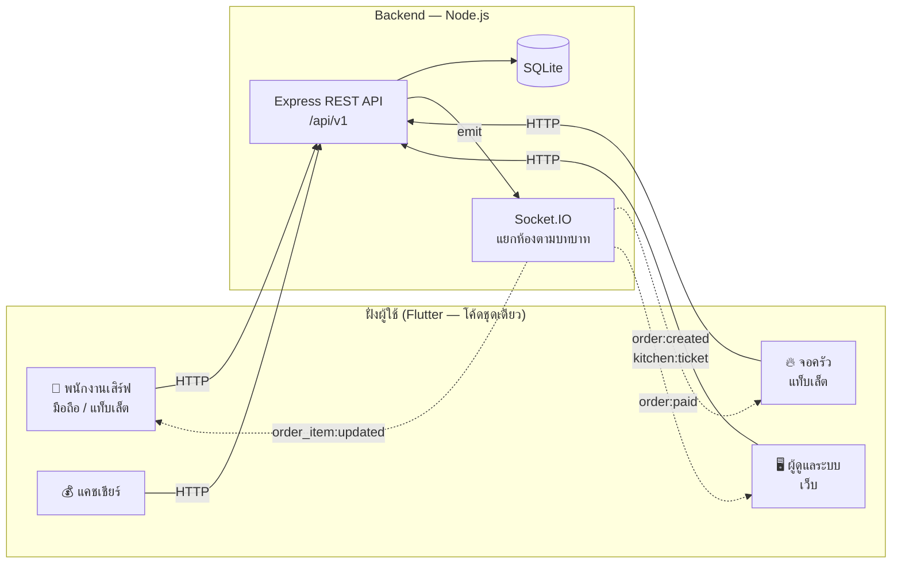
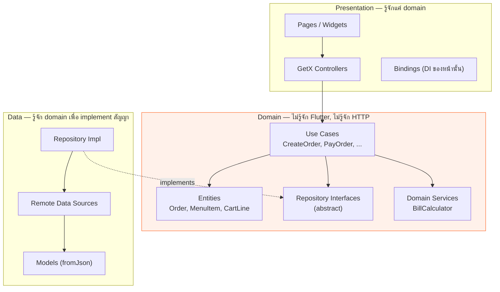

# 🍽️ PaynEat POS — ระบบขายหน้าร้านสำหรับร้านอาหาร

> ระบบ POS ครบวงจร: พนักงานเสิร์ฟรับออเดอร์บนแท็บเล็ต → เด้งเข้าจอครัวทันที → แคชเชียร์ปิดบิล → ผู้จัดการดูยอดขายบนเว็บ
>
> **Flutter (GetX + Clean Architecture)** + **Node.js / Express + SQLite + Socket.IO** — โค้ดชุดเดียวรันได้ทั้ง Android, iOS และ Web

<p align="center">
  
  
  
  
  
  
  
</p>

**English TL;DR** — A full restaurant point-of-sale system built to demonstrate end-to-end product engineering:
a Flutter client (mobile / tablet / web from one codebase, structured with Clean Architecture + GetX) talking to a
Node.js REST + WebSocket backend. Covers the complete floor-to-cash workflow: table map, order taking with
modifiers, live kitchen display, split payments, receipts, and management dashboards — with role-based access
control and 77 automated tests.

---

## 📋 สารบัญ

- [ทำไมถึงทำโปรเจกต์นี้](#-ทำไมถึงทำโปรเจกต์นี้)
- [ลองใช้งาน](#-ลองใช้งาน)
- [ฟีเจอร์](#-ฟีเจอร์)
- [เทคโนโลยีที่ใช้](#-เทคโนโลยีที่ใช้)
- [สถาปัตยกรรม](#-สถาปัตยกรรม)
- [โครงสร้างโปรเจกต์](#-โครงสร้างโปรเจกต์)
- [การคำนวณบิล](#-การคำนวณบิล)
- [Realtime](#-realtime)
- [API](#-api)
- [การทดสอบ](#-การทดสอบ)
- [สิ่งที่จะทำต่อ](#-สิ่งที่จะทำต่อ)

---

## 🎯 ทำไมถึงทำโปรเจกต์นี้

อยากทำโปรเจกต์ที่ **ไม่ใช่ To-do list** แต่เป็นระบบที่มีกฎทางธุรกิจจริง ๆ ให้จัดการ

ร้านอาหารเป็นโจทย์ที่ดีเพราะมีเงื่อนไขที่ต้องคิดเยอะกว่าที่เห็น:

- แก้ออเดอร์ได้ถึงเมื่อไหร่? (ครัวเริ่มทำแล้วห้ามแก้ ต้องให้ผู้จัดการ void แทน)
- คิด VAT ก่อนหรือหลัง Service Charge? แล้วส่วนลดล่ะ?
- โต๊ะเดียวกันเปิดสองบิลพร้อมกันได้ไหม?
- ลูกค้าขอแยกจ่าย QR ครึ่งหนึ่ง เงินสดครึ่งหนึ่ง ต้องรองรับ
- ครัวกับพนักงานเสิร์ฟอยู่คนละเครื่อง ต้องเห็นสถานะตรงกันแบบทันที
- เงินต้องไม่เพี้ยนจาก floating point

โปรเจกต์นี้จึงเน้น **ความถูกต้องของ business logic + โครงสร้างที่ดูแลต่อได้** มากกว่าความหวือหวาของ UI

---

## 🚀 ลองใช้งาน

### วิธีที่ 1 — Docker Compose (ได้ระบบเต็ม เร็วที่สุด)

```bash
git clone https://github.com/SuruchBoss/PaynEat.git
cd PaynEat
docker compose up --build
```

| บริการ | URL |
|---|---|
| เว็บแอป (ใช้ได้ทุกบทบาท) | http://localhost:8080 |
| REST API | http://localhost:3000/api/v1 |
| เอกสาร API (Swagger UI) | http://localhost:3000/docs |

### วิธีที่ 2 — รันแยกทีละส่วน (สำหรับพัฒนาต่อ)

```bash
# Terminal 1 — Backend
cd backend
npm install
npm run dev                 # http://localhost:3000 (สร้าง DB + ใส่ข้อมูลตัวอย่างให้อัตโนมัติ)

# Terminal 2 — Flutter
cd app
flutter pub get
flutter run -d chrome       # เว็บ
flutter run                 # มือถือ/แท็บเล็ตที่ต่ออยู่
```

> **Android emulator** ใช้ `10.0.2.2` แทน `localhost` โดยอัตโนมัติ
> ถ้าต่อมือถือจริงให้ระบุ IP ของเครื่อง: `flutter run --dart-define=API_BASE_URL=http://192.168.1.x:3000`

### วิธีที่ 3 — Demo Mode (ไม่ต้องมี backend เลย)

```bash
cd app
flutter run -d chrome --dart-define=DEMO_MODE=true
```

ข้อมูลทั้งหมดจำลองอยู่ในเครื่อง ใช้ deploy ขึ้น static hosting อย่าง GitHub Pages ได้ฟรี
(ดู `.github/workflows/deploy-demo.yml`) — ผู้ที่มาดูผลงานกดลิงก์เดียวก็ลองใช้ได้ทันที

> 💡 **โหมดนี้เป็นตัวพิสูจน์ว่า Clean Architecture คุ้มค่า** — สลับจาก REST เป็นข้อมูลจำลอง
> โดยแก้แค่ `_bindDataSources()` ที่เดียว ไม่ต้องแตะโค้ดหน้าจอ, controller หรือ use case แม้แต่บรรทัดเดียว

### 👤 บัญชีทดลองใช้

| บทบาท | username | password | เห็นอะไรบ้าง |
|---|---|---|---|
| ผู้ดูแลระบบ | `admin` | `admin123` | ทุกอย่าง |
| ผู้จัดการ | `manager` | `manager123` | ทุกอย่าง |
| พนักงานเสิร์ฟ | `waiter1` | `waiter123` | ผังโต๊ะ, ออเดอร์, ครัว |
| ครัว | `kitchen` | `kitchen123` | จอครัวอย่างเดียว |
| แคชเชียร์ | `cashier` | `cashier123` | ผังโต๊ะ, ออเดอร์, รายงาน |

> หน้า Login มีปุ่มกดเลือกบัญชีให้อัตโนมัติ ไม่ต้องพิมพ์เอง

---

## ✨ ฟีเจอร์

### 📱 พนักงานเสิร์ฟ (มือถือ / แท็บเล็ต)

- **ผังโต๊ะ** แยกตามโซน เห็นสถานะ (ว่าง / มีลูกค้า / จอง / เรียกเก็บเงิน) พร้อมยอดค้างและเวลาที่ลูกค้านั่งอยู่
- **รับออเดอร์** ค้นหาเมนู กรองตามหมวดหมู่ เลือกตัวเลือกเสริม (ระดับความเผ็ด, ไข่ดาว +15) และพิมพ์โน้ตถึงครัว
- **ตะกร้าอัจฉริยะ** รายการที่เหมือนกันทุกอย่างจะรวมเป็นบรรทัดเดียวอัตโนมัติ
- **พรีวิวยอดบิล** เห็น Service Charge และ VAT ทันทีขณะกดสั่ง ไม่ต้องรอเซิร์ฟเวอร์
- **สั่งเพิ่มรอบสอง** เข้าออเดอร์เดิมได้ และกดเสิร์ฟรายการที่ครัวทำเสร็จแล้ว

### 🔥 ครัว (จอ KDS)

- ตั๋วอาหารเด้งขึ้นเองแบบเรียลไทม์ ไม่ต้องกดรีเฟรช
- แบ่ง 3 คอลัมน์ตามสถานะ: รอทำ → กำลังทำ → พร้อมเสิร์ฟ
- **เตือนจานที่รอนานเกิน 15 นาที** ด้วยกรอบแดงและไอคอนไฟ
- ปุ่มเดียวเดินสถานะ ออกแบบให้กดง่ายด้วยมือเปื้อน ๆ ในครัว
- ปิดเมนูที่ของหมดได้เองทันที ไม่ต้องรอผู้จัดการ

### 💰 แคชเชียร์

- รับชำระ 4 ช่องทาง: เงินสด, พร้อมเพย์/QR, บัตรเครดิต, โอนเงิน
- **แยกจ่ายได้** เช่น QR 100 บาท ที่เหลือจ่ายเงินสด — ระบบตัดยอดคงเหลือให้เอง
- คำนวณเงินทอน พร้อมปุ่มลัด (พอดี / ปัดขึ้นหลักร้อย / 100 / 500 / 1000)
- ส่วนลดทั้งแบบบาทและเปอร์เซ็นต์ พร้อมปุ่มลัด 5/10/15/20%
- ออกใบเสร็จพร้อมพิมพ์

### 🖥️ ผู้ดูแลระบบ (เว็บ)

- **แดชบอร์ด** ยอดขายวันนี้, กราฟรายชั่วโมง, เมนูขายดี, สัดส่วนช่องทางชำระเงิน และตัวนับสถานะร้านแบบสด
- **รายงานย้อนหลัง** เลือกช่วงวันที่เอง ดูยอดรายวัน เมนูขายดี และยอดแยกตามหมวดหมู่
- **จัดการเมนู** เพิ่ม/แก้ไข/ลบ พร้อมสร้างกลุ่มตัวเลือกเสริมเองได้
- **จัดการพนักงาน** เพิ่มบัญชี เปลี่ยนบทบาท ปิดการใช้งาน
- **ตั้งค่าร้าน** ชื่อร้าน, VAT, Service Charge, โหมดราคารวม VAT

### 🔐 ระบบ

- JWT + แบ่งสิทธิ์ 5 บทบาท บังคับใช้ทั้งฝั่ง API และการแสดงเมนูในแอป
- UI ปรับตามขนาดจอ: มือถือ (แถบล่าง) / แท็บเล็ต (rail) / เว็บ (rail แบบขยาย)
- ไฟสถานะการเชื่อมต่อเรียลไทม์ ให้พนักงานรู้ทันทีถ้าเน็ตหลุด

---

## 🛠 เทคโนโลยีที่ใช้

### Frontend — `app/`

| เทคโนโลยี | ใช้ทำอะไร |
|---|---|
| **Flutter 3.35 / Dart 3.9** | โค้ดชุดเดียว ออก Android + iOS + Web |
| **GetX 4.7** | State management, DI (Bindings), Routing |
| **Dio 5** | HTTP client + interceptor แนบ JWT และแปลง error |
| **socket_io_client** | รับ event เรียลไทม์จาก backend |
| **get_storage** | เก็บ token/โปรไฟล์ในเครื่อง (มี fallback เป็นหน่วยความจำ) |
| **intl** | จัดรูปแบบเงินและวันที่ |

### Backend — `backend/`

| เทคโนโลยี | ใช้ทำอะไร |
|---|---|
| **Node.js 22 / Express 5** | REST API |
| **SQLite (better-sqlite3)** | ฐานข้อมูล — ไฟล์เดียว ไม่ต้องติดตั้ง DB server |
| **Socket.IO** | ส่ง event เรียลไทม์ แยกห้องตามบทบาท |
| **JWT + bcrypt** | ยืนยันตัวตนและเข้ารหัสรหัสผ่าน |
| **Zod** | ตรวจสอบข้อมูลขาเข้าทุก endpoint |
| **OpenAPI 3 + Swagger UI** | เอกสาร API ที่กดลองยิงได้จริง |
| **node:test + supertest** | เทสต์ |

---

## 🏛 สถาปัตยกรรม

### ภาพรวมระบบ



### Clean Architecture ฝั่ง Flutter

ทิศทางการพึ่งพาชี้เข้าหา **domain** เสมอ — ชั้นในไม่รู้จักชั้นนอก



**สิ่งที่ได้จากการแยกชั้นแบบนี้ (ของจริง ไม่ใช่ทฤษฎี):**

1. **Demo Mode** — สลับ data source เป็นข้อมูลจำลองได้โดยแก้ไฟล์เดียว หน้าจอไม่รู้ตัวด้วยซ้ำ
2. **เทสต์ controller ได้โดยไม่ต้องมีเซิร์ฟเวอร์** — ยัด repository ปลอมเข้าไปตรง ๆ (ดู `test/presentation/cart_controller_test.dart`)
3. **กฎธุรกิจอยู่ที่เดียว** — `BillCalculator` ใช้ได้ทั้งพรีวิวในตะกร้าและ Demo Mode
4. **เปลี่ยน backend ได้** — ถ้าย้ายไป GraphQL หรือ Firebase แก้แค่ชั้น data

### Backend แบบแยกชั้น

```
routes  →  controller  →  service  →  repository  →  SQLite
   ↑           ↑             ↑             ↑
validate    แปลง req/res  กฎธุรกิจ      SQL ล้วน ๆ
 (Zod)                    + emit socket
```

`service` ไม่รู้จัก `req`/`res` และ `repository` ไม่รู้จักกฎธุรกิจ — แต่ละชั้นเทสต์แยกได้

---

## 📁 โครงสร้างโปรเจกต์

```
PaynEat/
├── app/                              # Flutter (มือถือ + แท็บเล็ต + เว็บ)
│   ├── lib/
│   │   ├── app/                      # ธีม, routing, DI ระดับแอป, config
│   │   ├── core/                     # ของกลางที่ทุกฟีเจอร์ใช้ร่วมกัน
│   │   │   ├── network/              # ApiClient (Dio), SocketClient, endpoints
│   │   │   ├── errors/               # Failure / Exception + ตัวแปลง
│   │   │   ├── usecases/             # Result<T> (sealed class แทน Either)
│   │   │   ├── demo/                 # ⭐ เซิร์ฟเวอร์จำลองสำหรับ Demo Mode
│   │   │   ├── services/             # StorageService, SessionService
│   │   │   ├── utils/                # ตัวจัดรูปแบบ, responsive
│   │   │   └── widgets/              # widget ที่ใช้ซ้ำทั้งแอป
│   │   └── features/                 # แยกตามฟีเจอร์ แต่ละอันมี 3 ชั้นครบ
│   │       ├── auth/  menu/  table/  order/
│   │       ├── kitchen/  payment/  report/
│   │       └── staff/  settings/  home/
│   │           ├── domain/           # entities · repositories · usecases
│   │           ├── data/             # models · datasources · repository impl
│   │           └── presentation/     # controllers · pages · widgets · bindings
│   └── test/                         # เทสต์ domain / controller / widget
│
├── backend/                          # Node.js API
│   ├── src/
│   │   ├── config/  core/  middlewares/  realtime/
│   │   ├── db/                       # schema.sql, migrate, seed
│   │   ├── modules/                  # แยกตาม domain
│   │   │   └── orders/
│   │   │       ├── order.routes.js
│   │   │       ├── order.controller.js
│   │   │       ├── order.service.js
│   │   │       ├── order.repository.js
│   │   │       ├── order.calculator.js   # ⭐ กฎคิดเงิน (pure function)
│   │   │       └── order.schema.js       # Zod
│   │   └── routes.js
│   ├── docs/openapi.yaml
│   └── tests/
│
├── docker-compose.yml                # รันทั้งระบบด้วยคำสั่งเดียว
└── .github/workflows/                # CI + deploy เดโมขึ้น GitHub Pages
```

---

## 💵 การคำนวณบิล

เรื่องเงินเป็นจุดที่พลาดไม่ได้ จึงจัดการ 2 อย่างนี้เป็นพิเศษ:

### 1. เก็บเงินเป็นจำนวนเต็ม (สตางค์)

```js
// ❌ ปัญหาคลาสสิกของ floating point
0.1 + 0.2 === 0.3   // false

// ✅ ฝั่ง backend เก็บเป็นสตางค์ทั้งหมด แล้วแปลงเป็นบาทตอนส่งออก
120.50 บาท  →  เก็บเป็น  12050
```

### 2. ลำดับการคำนวณชัดเจน และเป็น pure function ที่เทสต์ได้

```
ยอดรวมอาหาร (subtotal)
  − ส่วนลด                       (บาท หรือ %)
  + Service Charge 10%           (คิดจากยอดหลังหักส่วนลด)
  + VAT 7%                       (คิดจากยอดหลังหักส่วนลด + Service Charge)
  = ยอดสุทธิ
```

ตัวอย่างจริงจากเทสต์ — ผัดกะเพรา 75 บาท + ไข่ดาว 15 บาท × 2 จาน:

| รายการ | ยอด |
|---|---:|
| ยอดรวมอาหาร | 180.00 |
| Service Charge 10% | 18.00 |
| VAT 7% (ของ 198) | 13.86 |
| **รวมทั้งสิ้น** | **211.86** |

ตรรกะนี้เขียนไว้ 2 ที่แต่ให้ผลตรงกันเป๊ะ และมีเทสต์คุมทั้งคู่:

- `backend/src/modules/orders/order.calculator.js` — ยอดจริงที่ใช้เก็บเงิน
- `app/lib/features/order/domain/services/bill_calculator.dart` — พรีวิวในแอปให้เห็นทันทีโดยไม่ต้องรอเน็ต

รองรับโหมด "ราคารวม VAT แล้ว" ด้วย (ระบบจะถอด VAT ออกมาแสดงแทนการบวกเพิ่ม)

---

## ⚡ Realtime

Socket.IO ใช้ JWT ตัวเดียวกับ REST API แล้วจับผู้ใช้เข้าห้องตามบทบาท เพื่อไม่ให้ครัวโดนยิง event ที่ไม่เกี่ยวข้อง

| Event | ใครได้รับ | เกิดเมื่อไหร่ |
|---|---|---|
| `kitchen:ticket` | ห้องครัว | กดส่งออเดอร์เข้าครัว |
| `order_item:updated` | ห้องบริการ | ครัวเปลี่ยนสถานะอาหาร |
| `order:created` / `order:updated` | ทุกคน | เปิดหรือแก้ไขออเดอร์ |
| `order:paid` | ทุกคน | ปิดบิลสำเร็จ |
| `table:updated` | ทุกคน | สถานะโต๊ะเปลี่ยน |

ฝั่งแอป `SocketClient` คืนฟังก์ชันยกเลิกการรับ event ให้ทุกครั้ง controller จึงเก็บไปเรียกตอน `onClose()`
ป้องกัน listener ค้างและ memory leak

```dart
_unsubscribers.add(socket.on(SocketEvents.kitchenTicket, (_) => load()));
```

---

## 📡 API

เปิด **http://localhost:3000/docs** เพื่อดูเอกสารและกดลองยิงได้จริง (Swagger UI)

<details>
<summary><b>สรุป endpoint ทั้งหมด (คลิกเพื่อดู)</b></summary>

| Method | Endpoint | สิทธิ์ | คำอธิบาย |
|---|---|---|---|
| POST | `/auth/login` | — | เข้าสู่ระบบ |
| GET | `/auth/me` | ทุกคน | ข้อมูลผู้ใช้ปัจจุบัน |
| GET | `/menu-items` | ทุกคน | รายการเมนู (ค้นหา/กรองได้) |
| POST | `/menu-items` | admin, manager | เพิ่มเมนู |
| PATCH | `/menu-items/:id/availability` | + kitchen, waiter | เปิด/ปิดขาย (ของหมด) |
| GET | `/tables` | ทุกคน | ผังโต๊ะพร้อมออเดอร์ที่เปิดอยู่ |
| PATCH | `/tables/:id/status` | ทุกคน | เปลี่ยนสถานะโต๊ะ |
| POST | `/orders` | เสิร์ฟขึ้นไป | เปิดออเดอร์ |
| POST | `/orders/:id/items` | เสิร์ฟขึ้นไป | สั่งเพิ่ม |
| PATCH | `/orders/:id/items/:itemId` | เสิร์ฟขึ้นไป | แก้จำนวน (ก่อนครัวเริ่มทำ) |
| PATCH | `/orders/:id/items/:itemId/status` | ครัว, เสิร์ฟ | เดินสถานะอาหาร |
| POST | `/orders/:id/send-to-kitchen` | เสิร์ฟขึ้นไป | ส่งเข้าครัว |
| POST | `/orders/:id/discount` | แคชเชียร์ขึ้นไป | ให้ส่วนลด |
| POST | `/orders/:id/cancel` | admin, manager | ยกเลิกออเดอร์ |
| GET | `/orders/kitchen/queue` | ครัว | คิวครัว |
| POST | `/payments` | แคชเชียร์ขึ้นไป | รับชำระเงิน |
| GET | `/payments/order/:id/receipt` | ทุกคน | ข้อมูลใบเสร็จ |
| GET | `/reports/dashboard` | ผู้บริหาร | ข้อมูลแดชบอร์ด |
| GET | `/reports/summary` | ผู้บริหาร | สรุปยอดตามช่วงวันที่ |
| GET/PATCH | `/settings` | ทุกคน / admin | ตั้งค่าร้าน |
| GET/POST/PATCH/DELETE | `/users` | admin, manager | จัดการพนักงาน |

</details>

รูปแบบ response เหมือนกันทุก endpoint:

```jsonc
// สำเร็จ
{ "success": true, "data": { }, "meta": { "page": 1, "total": 24 } }

// ผิดพลาด
{
  "success": false,
  "error": {
    "code": "VALIDATION_ERROR",
    "message": "ข้อมูลที่ส่งมาไม่ถูกต้อง",
    "details": [{ "field": "quantity", "message": "จำนวนต้องมากกว่า 0" }]
  }
}
```

---

## 🧪 การทดสอบ

```bash
cd backend && npm test      # 36 เคส
cd app && flutter test      # 41 เคส
```

**Backend (36 เคส)** — `node:test` + `supertest` ยิงผ่าน HTTP จริงบนฐานข้อมูลแยกต่างหาก
เทสต์เด่นคือ `tests/order-flow.test.js` ที่ไล่เส้นทางทั้งร้านตั้งแต่ต้นจนจบใน 17 ขั้น:

> เลือกโต๊ะ → เปิดออเดอร์พร้อมตัวเลือกเสริม → ตรวจว่ายอดคิดถูก → โต๊ะเปลี่ยนเป็นไม่ว่าง →
> เปิดซ้ำที่โต๊ะเดิมต้องโดนปฏิเสธ → ส่งครัว → ครัวเดินสถานะ (และข้ามขั้นต้องไม่ได้) →
> เสิร์ฟครบแล้วออเดอร์เปลี่ยนสถานะเอง → ให้ส่วนลด → แยกจ่าย 2 ครั้ง → ตรวจเงินทอน →
> จ่ายซ้ำต้องโดนปฏิเสธ → โต๊ะว่างคืนอัตโนมัติ → ใบเสร็จครบ → ยอดเข้ารายงาน

**Flutter (41 เคส)** — แบ่งเป็น 3 ระดับ:

| ระดับ | ไฟล์ | ทดสอบอะไร |
|---|---|---|
| Domain | `bill_calculator_test.dart` | กฎคิดเงินทุกกรณี รวมส่วนลดและโหมดรวม VAT |
| Domain | `cart_line_test.dart` | การรวมรายการซ้ำในตะกร้า |
| Domain | `entities_test.dart` | สิทธิ์ตามบทบาท, การเดินสถานะอาหาร |
| Controller | `cart_controller_test.dart` | ตรรกะตะกร้า โดยใช้ repository ปลอม |
| Controller | `home_destinations_test.dart` | เมนูที่แต่ละบทบาทเห็น (กันสิทธิ์รั่ว) |
| Widget | `widgets_test.dart` | การกดปุ่มและสถานะของ widget |

CI บน GitHub Actions รัน `dart format` → `flutter analyze` → `flutter test` → `flutter build web`
และเทสต์ backend ทุกครั้งที่ push

---

## 🔭 สิ่งที่จะทำต่อ

สิ่งที่ยังไม่ได้ทำและเหตุผล — เพื่อให้เห็นว่ารู้ตัวว่าอะไรยังขาด ไม่ใช่ลืม

- [ ] **พิมพ์ใบเสร็จผ่านเครื่องพิมพ์ความร้อน** (ESC/POS ผ่าน Bluetooth) — ตอนนี้แสดงบนจอให้ดูก่อน
- [ ] **โหมดออฟไลน์** เก็บออเดอร์ไว้ในเครื่องแล้ว sync เมื่อเน็ตกลับมา (ร้านจริงเน็ตหลุดบ่อย)
- [ ] **ย้ายโต๊ะ / รวมบิล / แยกบิลรายคน** — เจอบ่อยในร้านจริงแต่ยังไม่ได้ทำ
- [ ] **สต๊อกวัตถุดิบ** ตัดสต๊อกอัตโนมัติเมื่อขาย
- [ ] **PostgreSQL** — SQLite เหมาะกับ 1 สาขา ถ้าหลายสาขาต้องเปลี่ยน (ชั้น repository ถูกแยกไว้แล้วจึงเปลี่ยนไม่ยาก)
- [ ] **เทสต์ integration ฝั่ง Flutter** ด้วย `integration_test` ยิงกับ backend จริง

---

## 📚 อ่านเพิ่มเติม

- [`docs/DECISIONS.md`](docs/DECISIONS.md) — บันทึกการตัดสินใจเชิงออกแบบ 10 ข้อ พร้อมข้อเสียที่ยอมรับ
  (เช่น ทำไมเก็บเงินเป็นสตางค์, ทำไมยอมเขียนตรรกะคิดบิล 2 ภาษา, ทำไมเลือก SQLite)
- [`backend/docs/openapi.yaml`](backend/docs/openapi.yaml) — สเปก API ฉบับเต็ม

---

## 📄 License

MIT — นำไปใช้ ดัดแปลง หรือต่อยอดได้ตามสบาย
