# 🍽️ PaynEat POS — ระบบขายหน้าร้านสำหรับร้านอาหาร

**ภาษา:** ไทย · [English](README.en.md) · [한국어](README.ko.md)

> ระบบ POS ครบวงจร: พนักงานเสิร์ฟรับออเดอร์บนแท็บเล็ต → ออเดอร์ส่งเข้าจอครัวทันที → แคชเชียร์ปิดบิล → ผู้จัดการติดตามยอดขายบนเว็บ
>
> **Flutter (GetX + Clean Architecture)** + **Node.js / Express + SQLite + Socket.IO** — โค้ดชุดเดียวรันได้ทั้ง Android, iOS และ Web

<p align="center">
  
  
  
  
  
  
  
  <a href="LICENSE"></a>
</p>

**English overview** — A full restaurant point-of-sale system that demonstrates end-to-end product engineering:
a Flutter client (mobile / tablet / web from one codebase, structured with Clean Architecture + GetX) communicating
with a Node.js REST + WebSocket backend. It covers the complete floor-to-cash workflow — table map, order taking with
modifiers, live kitchen display, split payments, receipts, and management dashboards — with role-based access
control and 1267 automated tests.

> 👤 **พัฒนาและดูแลโดย [SuruchBoss](https://github.com/SuruchBoss)** — การ fork หรือนำโปรเจกต์นี้ไปต่อยอดทำได้
> โดยต้องคงไฟล์ [`NOTICE`](NOTICE) ไว้ตามเงื่อนไขของ Apache License 2.0 · ติดต่อผู้พัฒนาได้ทาง
> [LinkedIn](https://www.linkedin.com/in/suruchboss)

---

<!-- stories:start -->
<!-- สร้างจาก docs/generator/landing/content.py (ชุดเดียวกับหน้า Landing) — แก้ที่นั่นแล้วรัน python3 docs/generator/landing/build_landing.py อย่าแก้ส่วนนี้ตรง ๆ -->

## 🍽 เมนูแก้ปัญหาร้านอาหาร

ทุกข้อคือปัญหาที่ร้านอาหารขนาดใหญ่เจอจริงทุกวัน และแต่ละข้อแก้ด้วย**หลายฟีเจอร์ที่ทำงานต่อกัน** ไม่ใช่ปุ่มเดียว — ทั้งหมดผ่านเทสต์อัตโนมัติ 1,139 เคสก่อนปล่อย ภาพทุกภาพถ่ายจากแอปจริงด้วย golden test ([`story_test.dart`](app/tool/screenshots/story_test.dart)) ลองกดเองได้ที่ **[เดโมบนเว็บ](https://suruchboss.github.io/PaynEat/app/)** หรืออ่านแบบหน้าเว็บที่ **[หน้า Landing](https://suruchboss.github.io/PaynEat/)**

| # | ปัญหาของร้าน | ชุดที่แก้ | ได้อะไร |
|---|---|---|---|
| 1 | 🔥 ออเดอร์ล้น | ผังโต๊ะ · จอครัวเรียลไทม์ · เตือนเกิน 15 นาที · เลขคิวกลับบ้าน | จานที่รอนานสุดอยู่บนสุดเสมอ |
| 2 | 🙋 คนไม่พอ | QR ประจำโต๊ะ · ไม่ต้องล็อกอิน · ขึ้นครัวทันที · ตัดสต๊อกเหมือนกัน | ลูกค้าสั่งได้ตั้งแต่นั่งลง |
| 3 | 💸 จ่ายช้า | พร้อมเพย์ QR · แยกบิล/รวมบิล · ใบเสร็จไทย · ใบกำกับภาษี | ยอดบน QR ตรงบิลทุกสตางค์ |
| 4 | 🔒 เงินรั่ว | เปิด-ปิดกะ · Z-report · ประวัติแก้ไม่ได้ · สิทธิ์ 5 บทบาท | ขาด 40 บาทก็เห็นตั้งแต่ปิดกะ |
| 5 | 📦 ของหมด | ตัดสต๊อกอัตโนมัติ · ปิดขายเมนูเอง · เตือนใกล้หมด | ไม่ต้องมีใครคอยกดปิดเมนู |
| 6 | 🥩 ขายเนื้อ · ขายส่ง | ขายตามน้ำหนัก · ตาชั่งต่อสาย · ฉลาก EAN-13 · ขายเชื่อ/วางบิล | 0.485 กก. × ฿1,200 = ฿582 ไม่ต้องกดเครื่องคิดเลข |
| 7 | 📊 มองไม่เห็นภาพรวม | แดชบอร์ดสด · รายงาน CSV · หลายสาขา · ถาม AI | รู้ยอดระหว่างวัน ไม่ต้องรอปิดกะ |
| 8 | 🎁 ลูกค้าไม่กลับมา | โปรมีเงื่อนไข · โค้ดส่วนลด · ซื้อ 1 แถม 1 · แต้มสะสม | พนักงานไม่ต้องจำเงื่อนไขโปร |
| 9 | 🌧 หน้างานโหด | คอนทราสต์สูง · เน็ตหลุดยังขายได้ · 3 ภาษา · ใช้เครื่องที่มีอยู่ | ป้ายสถานะคมชัด 8.77:1 อ่านออกแม้แดดส่องจอ |

### 1. 🔥 ชุดชั่วโมงเร่งด่วน

<p align="center">
  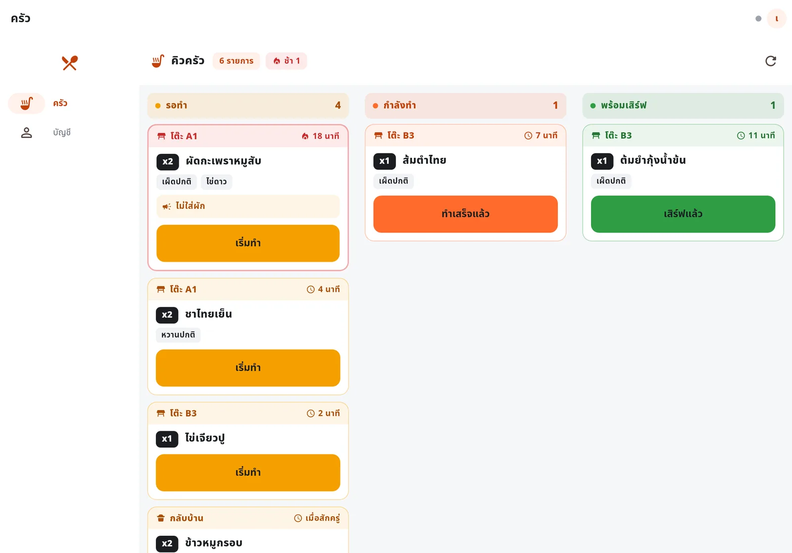
  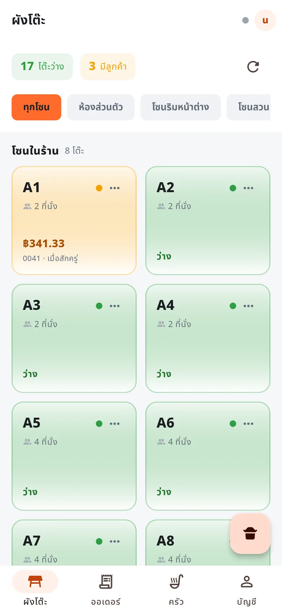
</p>

**ปัญหาที่ร้านเจอ** — ช่วงพีค พนักงานวิ่งส่งใบสั่งเข้าครัว ใบหาย ลายมืออ่านไม่ออก ครัวทำตามใบที่หยิบได้ ไม่ใช่ตามลำดับที่ลูกค้ารอ โต๊ะที่รอนานสุดจึงโดนลืม

**ในชุดนี้มี**

- **ผังโต๊ะบอกสถานะด้วยสี** — ว่าง มีลูกค้า ยอดค้างบนโต๊ะ แยกโซนในร้าน ริมหน้าต่าง
- **สั่งพร้อมตัวเลือกเสริมและหมายเหตุ** — เผ็ดกลาง ไข่ดาว ไม่ใส่ผัก ส่งถึงครัวครบ ไม่ต้องตะโกนบอก
- **จอครัวเรียลไทม์ 3 คอลัมน์** — รอทำ → กำลังทำ → พร้อมเสิร์ฟ ตั๋วที่รอนานสุดอยู่บนสุด เกิน 15 นาทีขึ้นเตือนแดงเอง
- **โต๊ะ กลับบ้าน เดลิเวอรี แยกด้วยไอคอน** — ออเดอร์กลับบ้านได้เลขคิวรันต่อวันอัตโนมัติ
- **กดผิดย้อนได้** — แถบ "เลิกทำ" 8 วินาทีหลังกดเดินสถานะ ไม่ต้องตามผู้จัดการ

✅ **จานที่รอนานสุดอยู่บนสุดเสมอ**  
🧪 **ลองชิมในเดโม:** เข้าเดโม เลือก "พนักงานเสิร์ฟ" → แตะโต๊ะว่าง เลือกเมนู แล้วส่งครัว → ออกจากระบบ เลือก "ครัว" — ตั๋วที่เพิ่งสั่งขึ้นในคอลัมน์รอทำ

### 2. 🙋 ชุดลูกค้าสั่งเอง

<p align="center">
  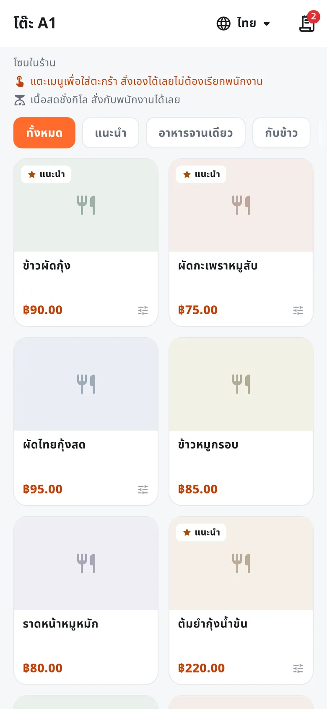
</p>

**ปัญหาที่ร้านเจอ** — ร้านใหญ่ขาดพนักงานเสิร์ฟเกือบทุกกะ ลูกค้านั่งรอเมนู รอคนมารับออเดอร์ รอสั่งเพิ่ม ทุกนาทีที่รอคือโต๊ะที่หมุนช้าลง

**ในชุดนี้มี**

- **สแกน QR ที่โต๊ะแล้วสั่งได้เลย** — เปิดในเบราว์เซอร์มือถือ ไม่ต้องติดตั้งแอป ไม่ต้องสมัครหรือล็อกอิน
- **เส้นทางเดียวกับพนักงานสั่ง** — ขึ้นจอครัวและตัดสต๊อกวัตถุดิบเหมือนกันทุกประการ ไม่มีระบบแยกให้ตามกระทบยอด
- **ลูกค้าเห็นออเดอร์ของโต๊ะตัวเอง** — สั่งเพิ่มได้เรื่อย ๆ และดูได้ว่าสั่งอะไรไปแล้วบ้าง
- **ลิงก์เสียบอกตรง ๆ** — QR ผิดหรือโต๊ะถูกปิดใช้งาน ลูกค้าเห็นว่าใช้ไม่ได้ ไม่มีออเดอร์ลอยเข้าครัว
- **ผู้จัดการเปลี่ยน QR ได้เอง** — กดค้างที่โต๊ะบนผัง เปิด QR คัดลอกลิงก์ หรือสร้าง QR ใหม่แทนใบเก่า

✅ **ลูกค้าสั่งได้ตั้งแต่นั่งลง**  
🧪 **ลองชิมในเดโม:** เข้าเดโม เลือก "ผู้จัดการ" แล้วไปที่ผังโต๊ะ → กดค้างที่โต๊ะใดก็ได้ → "ดู QR สั่งอาหารเอง" → คัดลอกลิงก์ → เปิดลิงก์ในแท็บใหม่ แล้วสั่งแบบลูกค้า

### 3. 💸 ชุดจ่ายไว ไม่ต้องคิดเลข

<p align="center">
  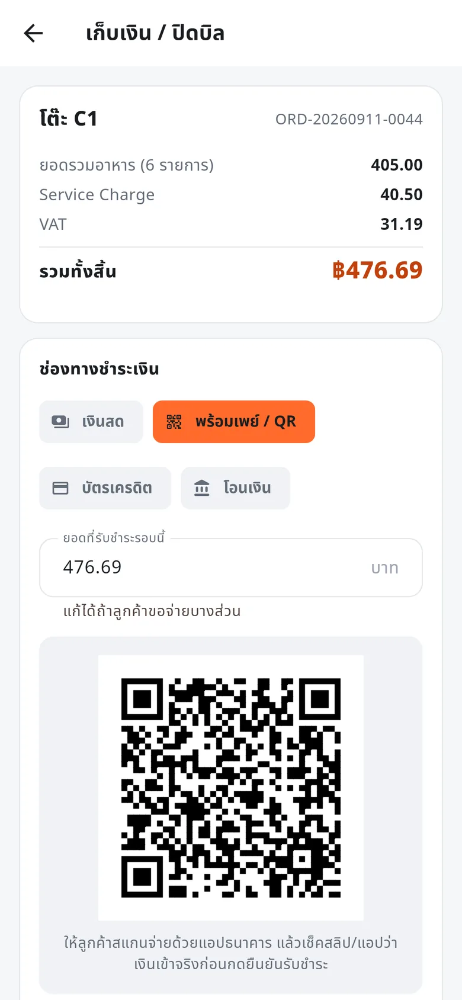
</p>

**ปัญหาที่ร้านเจอ** — แคชเชียร์พิมพ์ยอดโอนเอง พิมพ์ผิดหลักเดียวต้องตามคืนเงิน กลุ่มเพื่อนขอจ่ายคนละส่วน ส่วนลดกับค่าบริการต้องมานั่งเฉลี่ยกันเองหน้าเคาน์เตอร์

**ในชุดนี้มี**

- **QR พร้อมเพย์ตามมาตรฐาน EMV** — ฝังยอดบิลลงใน QR ลูกค้าสแกนจากแอปธนาคารได้ทันที ไม่ต้องพิมพ์ยอดเอง
- **แยกจ่ายหลายช่องทาง แยกบิลตามรายการ** — เงินสด QR บัตร ในบิลเดียว เฉลี่ยส่วนลด ค่าบริการ และ VAT ตามสัดส่วนให้เอง
- **ย้ายโต๊ะ รวมบิล** — ลูกค้าย้ายที่นั่งหรือรวมโต๊ะ ออเดอร์ตามไปครบ
- **ใบเสร็จไทยผ่านเครื่องพิมพ์ความร้อน** — ESC/POS กระดาษ 58 และ 80 มม. ในวง LAN/Wi-Fi เดียวกัน
- **ใบกำกับภาษีอย่างย่อ** — เลขที่เรียงตามปี พ.ศ. ยกเลิกใบที่ออกผิดได้โดยเก็บประวัติไว้

✅ **ยอดบน QR ตรงบิลทุกสตางค์**  
🧪 **ลองชิมในเดโม:** เข้าเดโม เลือก "แคชเชียร์" → แตะโต๊ะที่มีลูกค้า แล้วกดเก็บเงิน → เลือก "พร้อมเพย์ / QR" — QR สร้างจากยอดของบิลนั้นทันที

### 4. 🔒 ชุดปิดกะเงินตรง

<p align="center">
  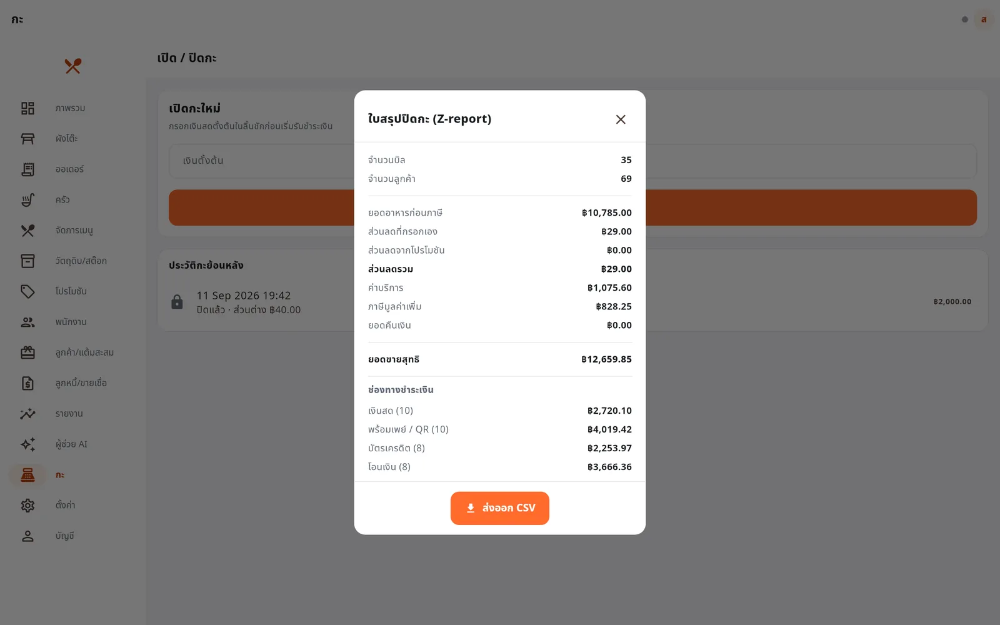
  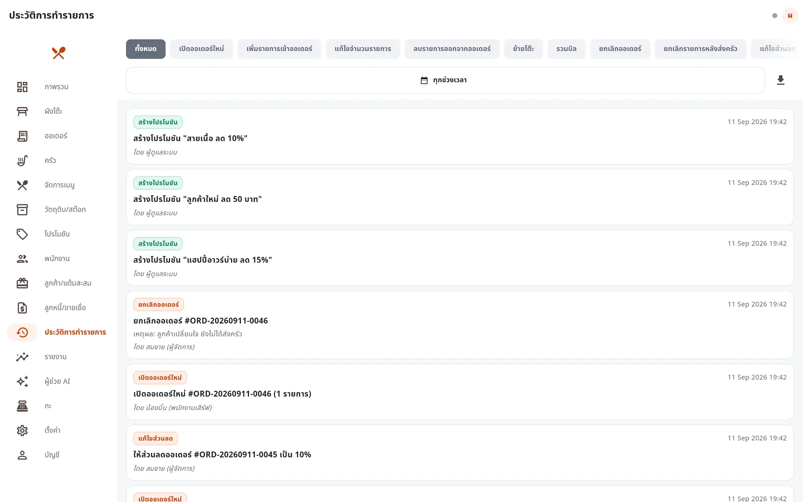
</p>

**ปัญหาที่ร้านเจอ** — ยกเลิกบิลหลังรับเงิน ให้ส่วนลดเกินสิทธิ์ คืนเงินไม่มีเหตุผล ร้านใหญ่มีคนแตะเงินหลายมือ พอยอดไม่ตรงก็ไม่มีหลักฐานว่าเกิดอะไรขึ้น

**ในชุดนี้มี**

- **ต้องเปิดกะก่อนรับเงิน** — ใส่เงินทอนตั้งต้น ทุกการรับเงินผูกกับกะที่เปิดอยู่
- **ปิดกะแล้วเทียบให้ทันที** — นับเงินจริง ระบบคำนวณเงินที่ควรมีและส่วนต่างให้เอง
- **Z-report ปิดกะและปิดวัน** — ยอดขาย ภาษี ส่วนลดมือแยกจากโปรโมชัน ช่องทางชำระ รับชำระหนี้ ส่งออก CSV ให้ฝ่ายบัญชี
- **ประวัติการทำรายการที่แก้ไม่ได้** — ยกเลิกออเดอร์ ให้ส่วนลด คืนเงิน แก้ราคา เปลี่ยนสิทธิ์ บันทึกผู้ทำ เวลา และเหตุผลทุกครั้ง
- **สิทธิ์ 5 บทบาท บังคับที่เซิร์ฟเวอร์** — ไม่ใช่แค่ซ่อนปุ่ม ยิงคำขอตรง ๆ ก็ถูกปฏิเสธ

✅ **ขาด 40 บาทก็เห็นตั้งแต่ปิดกะ**  
🧪 **ลองชิมในเดโม:** เข้าเดโม เลือก "ผู้จัดการ" แล้วไปที่เมนู "กะ" → กด "ปิดกะ" กรอกเงินที่นับได้ให้ขาดสักนิด แล้วแตะกะนั้นในประวัติเพื่อดู Z-report → เข้าใหม่เป็น "ผู้ดูแลระบบ" → "ประวัติการทำรายการ"

### 5. 📦 ชุดสต๊อกไม่ขาดกลางเซอร์วิส

<p align="center">
  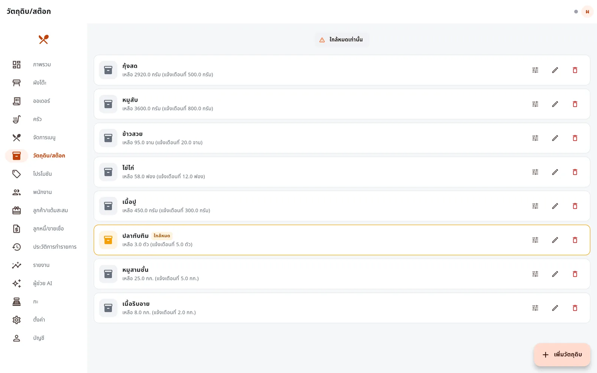
</p>

**ปัญหาที่ร้านเจอ** — ปลาหมดตั้งแต่สองทุ่ม แต่เมนูยังขายอยู่ในเครื่อง พนักงานรับออเดอร์ไปสามโต๊ะ ครัวเพิ่งมาบอก เสียทั้งเวลาและความรู้สึกลูกค้า

**ในชุดนี้มี**

- **ผูกเมนูกับวัตถุดิบ** — ตัดสต๊อกตอนส่งครัว คืนให้เองเมื่อยกเลิกหรือลบรายการ ใช้หน่วยตามที่ครัวนับจริง
- **หมดแล้วปิดขายเอง** — วัตถุดิบไม่พอ เมนูนั้นปิดขายทันที เติมสต๊อกแล้วเปิดกลับให้เอง
- **เตือนวัตถุดิบใกล้หมด** — ตั้งจุดเตือนรายตัว กรองดูเฉพาะของที่ใกล้หมดก่อนเปิดร้าน
- **ใช้กับ QR สั่งเองด้วย** — ลูกค้าสั่งเองก็ตัดสต๊อกเส้นทางเดียวกัน

✅ **ไม่ต้องมีใครคอยกดปิดเมนู**  
🧪 **ลองชิมในเดโม:** เข้าเดโม เลือก "ผู้ดูแลระบบ" → "วัตถุดิบ/สต๊อก" → กด "ใกล้หมดเท่านั้น" — ปลาทับทิมถูกตั้งให้ต่ำกว่าจุดเตือนไว้แล้ว → ลองปรับสต๊อกปลาทับทิมเป็นศูนย์ แล้วดูเมนูที่ใช้ปลาถูกปิดขาย

### 6. 🥩 ชุดเคาน์เตอร์เนื้อ + ขายส่ง

<p align="center">
  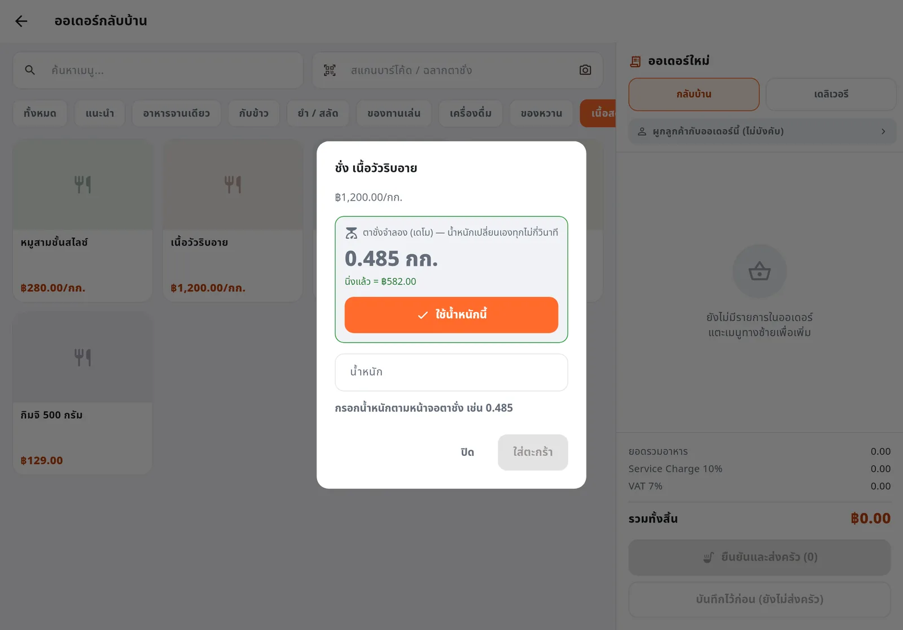
  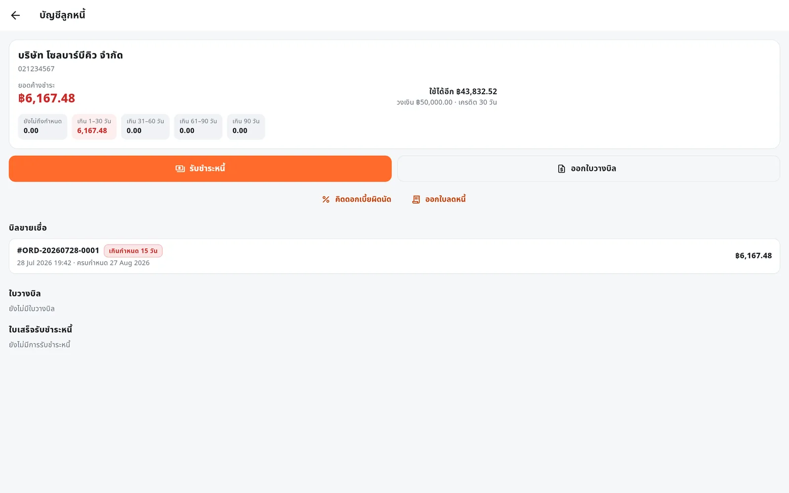
</p>

**ปัญหาที่ร้านเจอ** — น้ำหนักจดด้วยมือ คิดราคาด้วยเครื่องคิดเลข ลูกค้าขายส่งค้างจ่ายอยู่ในสมุด ถึงเวลาทวงก็ไม่รู้ว่าบิลไหนเกินกำหนดกี่วัน

**ในชุดนี้มี**

- **ขายตามน้ำหนัก อ่านจากตาชั่งสด** — ตั้งราคาต่อกิโล ตาชั่งที่ต่อเข้าเซิร์ฟเวอร์ร้านส่งน้ำหนักขึ้นจอเอง หรือกรอกเองก็ได้ เห็นราคาก่อนใส่ตะกร้า
- **สแกนฉลากตาชั่งและบาร์โค้ด** — เครื่องสแกน USB/บลูทูธ หรือกล้องมือถือ ฉลาก EAN-13 ได้ทั้งสินค้าและน้ำหนัก อ่านผิดระบบเตือน ไม่เดา
- **ขายเชื่อตามวงเงินและเครดิตเทอม** — ยอดเกินวงเงินกดจ่ายไม่ได้ ดูยอดค้างตามอายุหนี้ ออกใบวางบิล รับชำระแล้วตัดบิลเก่าสุดก่อน
- **ดอกเบี้ยผิดนัด ใบลดหนี้ PDF ภาษาไทย** — เอกสาร PDF ยอดเป็นตัวอักษร วันที่ พ.ศ. ส่งอีเมลถึงลูกค้าได้เลย
- **เงินรับชำระหนี้กระทบยอดลิ้นชัก** — Z-report แยกยอดรับชำระหนี้ออกจากยอดขายของวัน

✅ **0.485 กก. × ฿1,200 = ฿582 ไม่ต้องกดเครื่องคิดเลข**  
🧪 **ลองชิมในเดโม:** เข้าเดโม เลือก "แคชเชียร์" → ปุ่ม "สั่งกลับบ้าน/เดลิเวอรี่" → หมวดเนื้อสด → แตะเนื้อวัวริบอาย — ตาชั่งจำลองส่งน้ำหนักขึ้นจอ → เข้าเป็น "ผู้จัดการ" → "ลูกหนี้/ขายเชื่อ" → บริษัท โซลบาร์บีคิว จำกัด

> 🏷 ฉลากตาชั่งของเดโม `2000101012504` (หมูสามชั้นสไลซ์ 1.250 กก. × 280 = 350 บาท) — พิมพ์หรือยิงสแกนเข้าช่องสแกนในเดโมได้เลย หน้า Landing วาดบาร์โค้ดนี้เป็น EAN-13 จริงที่สแกนจากจอได้

### 7. 📊 ชุดเจ้าของร้านดูยอดสด

<p align="center">
  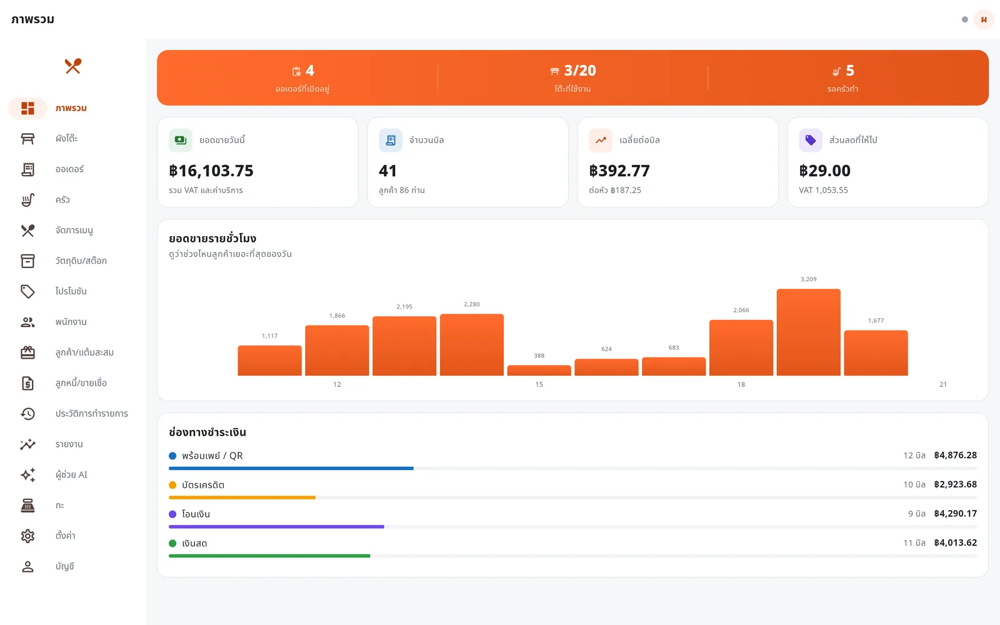
</p>

**ปัญหาที่ร้านเจอ** — เจ้าของร้านใหญ่ตัดสินใจเรื่องคนและของทุกวัน แต่ตัวเลขมาถึงตอนร้านปิดไปแล้ว หรือต้องรอสรุปจากแต่ละสาขา

**ในชุดนี้มี**

- **แดชบอร์ดอัปเดตสด** — ยอดขาย จำนวนบิล เฉลี่ยต่อบิล ส่วนลด กราฟรายชั่วโมง และสัดส่วนช่องทางชำระ
- **รายงานย้อนหลัง + CSV** — เมนูขายดี ยอดรายวัน ยอดตามหมวด ส่งออก CSV เปิดใน Excel แล้วภาษาไทยไม่เพี้ยน
- **หลายสาขาในระบบเดียว** — โต๊ะ เมนู ออเดอร์ สต๊อก รายงาน แยกตามสาขา แอดมินดูยอดรวมทุกสาขาได้ (เดโมบนเว็บมีสาขาเดียว)
- **ถามยอดเป็นประโยค** — ผู้ช่วย AI ดึงตัวเลขจากข้อมูลร้านจริงมาตอบ ดูหัวข้อถัดไป

✅ **รู้ยอดระหว่างวัน ไม่ต้องรอปิดกะ**  
🧪 **ลองชิมในเดโม:** เข้าเดโม เลือก "ผู้ดูแลระบบ" — หน้าแรกคือภาพรวม → ไปที่ "รายงาน" เลือกช่วงวันที่ แล้วกดส่งออก CSV

### 8. 🎁 ชุดโปรโมชัน + สะสมแต้ม

<p align="center">
  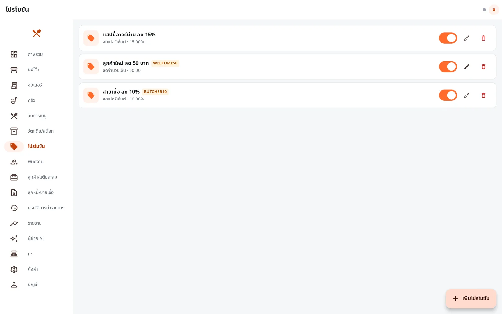
  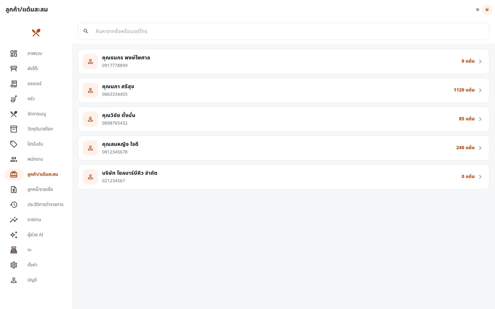
</p>

**ปัญหาที่ร้านเจอ** — แฮปปี้อาวร์เฉพาะบ่าย โค้ดลูกค้าใหม่ ซื้อ 1 แถม 1 เฉพาะบางเมนู พอหน้าร้านยุ่ง พนักงานลืมให้ส่วนลดบ้าง ให้ผิดโปรบ้าง

**ในชุดนี้มี**

- **โปรโมชันมีเงื่อนไข** — วันและช่วงเวลา หมวดหรือเมนูที่ร่วม ยอดขั้นต่ำ โค้ดส่วนลด ซื้อ 1 แถม 1 ระบบจับคู่ให้บิลที่เข้าเงื่อนไขเอง
- **สมาชิกสะสมแต้มอัตโนมัติ** — ค้นลูกค้าด้วยชื่อหรือเบอร์โทรตอนรับออเดอร์ ได้แต้มตามยอดซื้อ แลกเป็นส่วนลดตอนจ่าย
- **ประวัติการซื้อรายคน** — รู้ว่าลูกค้าประจำสั่งอะไร มาบ่อยแค่ไหน
- **ทุกการแก้โปรมีร่องรอย** — สร้าง แก้ ปิดโปร บันทึกในประวัติการทำรายการ

✅ **พนักงานไม่ต้องจำเงื่อนไขโปร**  
🧪 **ลองชิมในเดโม:** เข้าเดโม เลือก "ผู้ดูแลระบบ" → "โปรโมชัน" → เพิ่มโปรโมชัน → ตั้งช่วงเวลาให้ครอบคลุมตอนนี้ แล้วเปิดบิลใหม่ — ส่วนลดขึ้นเอง → ดูแต้มสะสมรายคนที่ "ลูกค้า/แต้มสะสม"

### 9. 🌧 ชุดหน้างานจริง

<p align="center">
  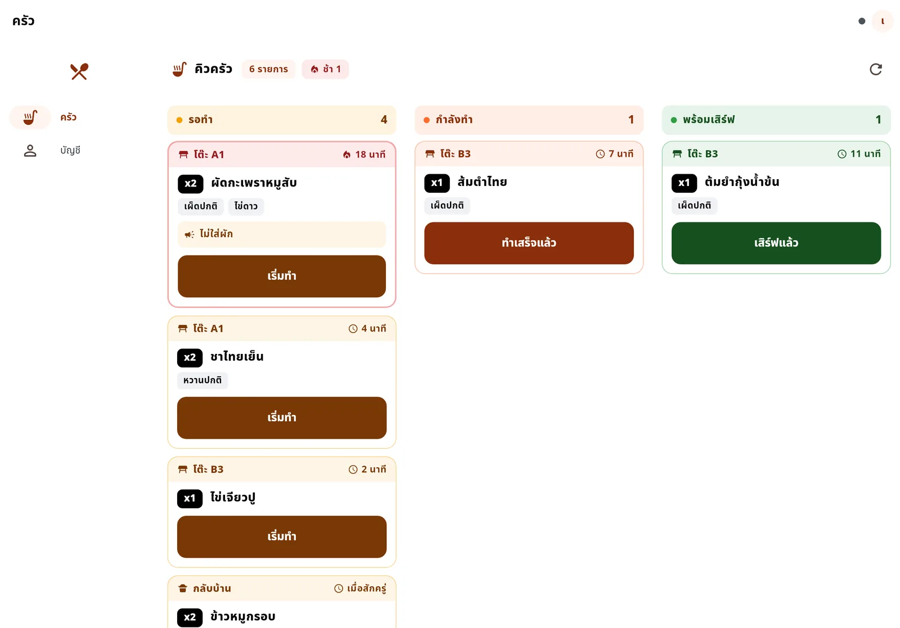
</p>

**ปัญหาที่ร้านเจอ** — จอสวยในห้องแอร์ แต่หน้าร้านจริงมีแดดส่องจอ ไอน้ำเกาะ มือถือกระทะ Wi-Fi หลุดกลางมื้อ และพนักงานที่อ่านภาษาไทยไม่คล่อง

**ในชุดนี้มี**

- **โหมดคอนทราสต์สูง** — ป้ายสถานะในครัวคมชัด 8.77:1 (เกณฑ์ WCAG AA คือ 4.5:1) ตั้งได้จากหน้าบัญชี จำค่าไว้กับเครื่อง
- **ปุ่มใหญ่สำหรับมือไม่ว่าง** — ปุ่มเดินสถานะในครัวใหญ่กว่าบนมือถือเกือบเท่าตัว
- **เน็ตหลุดยังรับออเดอร์ได้** — เก็บไว้ในเครื่องแล้วซิงค์เองเมื่อเน็ตกลับ จอครัวเตือนเต็มจอและดึงตั๋วสำรองทุก 30 วินาที
- **ไทย · English · 한국어** — สลับภาษาได้ทุกเครื่อง ชื่อเมนูเปลี่ยนตามภาษาที่เลือก
- **มือถือ แท็บเล็ต คอมพิวเตอร์ ระบบเดียว** — ใช้เครื่องที่ร้านมีอยู่ ไม่ต้องซื้อฮาร์ดแวร์เฉพาะยี่ห้อ

✅ **ป้ายสถานะคมชัด 8.77:1 อ่านออกแม้แดดส่องจอ**  
🧪 **ลองชิมในเดโม:** เข้าเดโมด้วยบทบาทใดก็ได้ แล้วไปที่ "บัญชี" → ตั้ง "ความคมชัดของหน้าจอ" เป็น "สูง" และลองสลับภาษา

<!-- stories:end -->

---

## 🎬 วิดีโอ เอกสาร และหน้า Landing

> 🎬 **วิดีโอนำเสนอระบบ (demo presentation · 1:55 · 1080p)**
> · [ฉบับภาษาไทย](docs/video/PaynEat-POS-Demo-TH.mp4)
> · [English edition](docs/video/PaynEat-POS-Demo-EN.mp4)
>
> นำเสนอเส้นทางการใช้งานจริงตั้งแต่เปิดผังโต๊ะจนปิดบิล ประกอบด้วยภาพหน้าจอจริงทั้ง 14 จอ (รวมหน้าที่ลูกค้าสแกน QR เพื่อสั่งอาหารเอง)
> ([วิธีสร้างใหม่](docs/video/README.md))

> 📄 **เอกสารรวมฟีเจอร์และหน้าจอทั้งหมด 33 หน้าจอ (PDF 30 หน้า)**
> · [ฉบับภาษาไทย](docs/PaynEat-POS-Features-TH.pdf) — อธิบายการออกแบบและการทำงานเบื้องหลังของแต่ละหน้าจอ
> · [English edition](docs/PaynEat-POS-Features-EN.pdf) — written for restaurant owners: what each screen solves for the business
>
> ภาพทั้งหมดเรนเดอร์จากโค้ดจริงด้วย golden test ใน [`app/tool/screenshots`](app/tool/screenshots)
> จึงสร้างใหม่ได้ทุกครั้งที่โค้ดเปลี่ยน ([วิธีสร้าง](docs/generator/README.md))

> 🌐 **หน้า Landing Page — ธีมเว็บสั่งอาหารของร้านขนาดใหญ่ ไม่ใช้ JavaScript**
> · [หน้าเว็บบน GitHub Pages](https://suruchboss.github.io/PaynEat/)
> · [English version](https://suruchboss.github.io/PaynEat/index.en.html)
> · [한국어 버전](https://suruchboss.github.io/PaynEat/index.ko.html)
> · [README ภาษาเกาหลี](README.ko.md)
> · [คู่มือติดตั้งแบบหน้าเว็บ](https://suruchboss.github.io/PaynEat/install.html) — เมนู "วิธีติดตั้ง" ด้านบน (แสดงบนมือถือด้วย) และปุ่ม "คู่มือติดตั้ง" ทุกจุดในหน้า Landing ลิงก์มาที่หน้านี้แทน README บน GitHub
>
> นำเสนอระบบเป็น **เมนูแก้ปัญหา 9 ชุด** ในรูปแบบเว็บสั่งอาหาร: เลือกปัญหาของร้านจากหมวดวงกลม → การ์ดเมนูของแต่ละชุด
> (ส่วนประกอบ = ฟีเจอร์, "ได้อะไร" = ผลลัพธ์) → หน้ารายละเอียดพร้อมหน้าจอจริงและขั้นตอน "ลองชิมในเดโม" → หน้าราคาในรูปแบบตะกร้าที่ทุกบรรทัดเป็น
> ฿0.00 บนมือถือมีแถบตะกร้าลอยด้านล่างจอที่ลิงก์ไปยังเดโม ทั้งสามภาษาใช้ดีไซน์เดียวกันและใช้ภาพตามภาษาของฉบับนั้น ส่วนเคาน์เตอร์เนื้อมี
> ฉลากตาชั่ง `2000101012504` ที่บาร์โค้ดวาดเป็น EAN-13 จริง สแกนจากจอเพื่อใช้ในเดโมได้ — ดู `docs/DECISIONS.md` #70 (แทนดีไซน์ #39/#53)
>
> ไฟล์ HTML **สร้างจาก** [`docs/generator/landing/`](docs/generator/landing/) — `content.py` เก็บเนื้อหาสามภาษา `build_landing.py`
> เป็นเทมเพลต (`install_content.py` เก็บเนื้อหาคู่มือติดตั้ง) คำสั่ง `python3 docs/generator/landing/build_landing.py` สร้างทั้ง
> `docs/landing/index*.html`, `docs/landing/install*.html` และหัวข้อ
> [เมนูแก้ปัญหาร้านอาหาร](#-เมนูแก้ปัญหาร้านอาหาร) ใน README ทั้งสามภาษาพร้อมกัน ภาพอยู่ที่ `docs/landing/img/story/` (WebP
> 39 ไฟล์ รวมประมาณ 1.5 MB ถ่ายใหม่ด้วย `app/tool/screenshots/story_test.dart` และย่อขนาดด้วย `publish_story.py`) GIF ผู้ช่วย AI
> อยู่ที่ `docs/ai-demo/` ซึ่ง `deploy-pages.yml` คัดลอกเข้า site ขณะ deploy
>
> สำหรับ search engine และผู้ช่วย AI: สคริปต์เดียวกันสร้าง `docs/landing/sitemap.xml` (9 หน้า พร้อมลิงก์ภาษาอื่นและ `x-default`)
> และใส่ข้อมูลโครงสร้าง schema.org (`SoftwareApplication` + `WebSite` + ผู้สร้าง) ในหน้าหลักทั้งสามภาษา เฉพาะสิ่งที่หน้าแสดงจริง
> ไม่มีคะแนนรีวิว — ดู `docs/DECISIONS.md` #91

> 🤖 **ตัวอย่างการทำงานจริงของผู้ช่วย AI ถามตอบข้อมูลร้าน (เรียก Claude API จริง ไม่ใช่ mock)**
>
> <br>
> <sub>ภาพนิ่งความละเอียดเต็ม: <a href="docs/ai-demo/ai-assistant-live.png">ai-assistant-live.png</a></sub>
>
> คลิปนี้บันทึกจากการใช้งานจริง: เข้าสู่ระบบด้วย admin → เปิดแท็บ "ผู้ช่วย AI" → พิมพ์คำถามภาษาไทย →
> Claude เรียก tool เพื่อดึงข้อมูลยอดขายจริงจากฐานข้อมูล (ไม่มีคำตอบที่เขียนสคริปต์ไว้ล่วงหน้า) → ตอบกลับ
> พร้อมกราฟและชิป "แหล่งข้อมูล" ที่อ้างอิง endpoint ที่เรียกจริง — ดู `docs/ai-demo/ai-assistant-demo.gif`
> ⚠️ **ข้อแตกต่างจากภาพชุดด้านบน**: ภาพชุดนี้**ไม่ได้**สร้างจาก golden test ที่ตรึงเวลาไว้ จึงไม่
> reproducible แบบ byte-ต่อ-byte (ต้องใช้ `ANTHROPIC_API_KEY` จริงและข้อมูลตัวอย่างที่ seed ไว้ และ
> คำตอบจากโมเดลอาจใช้ถ้อยคำต่างกันในแต่ละครั้ง) รายละเอียดวิธี capture ใหม่และเหตุผลที่แยก
> จากชุด golden test อยู่ใน [`docs/DECISIONS.md` #33](docs/DECISIONS.md)

---

## 📋 สารบัญ

- [เมนูแก้ปัญหาร้านอาหาร](#-เมนูแก้ปัญหาร้านอาหาร)
- [วิดีโอ เอกสาร และหน้า Landing](#-วิดีโอ-เอกสาร-และหน้า-landing)
- [วัตถุประสงค์ของโปรเจกต์](#-วัตถุประสงค์ของโปรเจกต์)
- [การติดตั้งและเริ่มใช้งาน](#-การติดตั้งและเริ่มใช้งาน)
- [ฟีเจอร์](#-ฟีเจอร์)
- [เทคโนโลยีที่ใช้](#-เทคโนโลยีที่ใช้)
- [สถาปัตยกรรม](#-สถาปัตยกรรม)
- [โครงสร้างโปรเจกต์](#-โครงสร้างโปรเจกต์)
- [การคำนวณบิล](#-การคำนวณบิล)
- [Realtime](#-realtime)
- [API](#-api)
- [การทดสอบ](#-การทดสอบ)
- [สิ่งที่จะทำต่อ](#-สิ่งที่จะทำต่อ)

---

## 🎯 วัตถุประสงค์ของโปรเจกต์

โปรเจกต์นี้พัฒนาขึ้นเป็นระบบที่มีกฎทางธุรกิจจริงให้จัดการ **ไม่ใช่แอปตัวอย่างประเภท To-do list**

ร้านอาหารเป็นโจทย์ที่เหมาะสม เนื่องจากมีเงื่อนไขที่ต้องพิจารณามากกว่าที่ปรากฏภายนอก ได้แก่

- ขอบเขตเวลาที่แก้ไขออเดอร์ได้ (เมื่อครัวเริ่มทำแล้วแก้ไขไม่ได้ ต้องให้ผู้จัดการ void แทน)
- ลำดับการคิด VAT เทียบกับ Service Charge และส่วนลด
- การป้องกันการเปิดสองบิลพร้อมกันบนโต๊ะเดียวกัน
- การแยกชำระ เช่น QR ครึ่งหนึ่งและเงินสดครึ่งหนึ่ง
- สถานะที่ต้องตรงกันแบบทันทีระหว่างครัวและพนักงานเสิร์ฟซึ่งใช้งานคนละเครื่อง
- ยอดเงินที่ต้องไม่คลาดเคลื่อนจาก floating point

โปรเจกต์นี้จึงเน้น **ความถูกต้องของ business logic และโครงสร้างที่ดูแลต่อได้** มากกว่าความโดดเด่นของ UI

---

## 🚀 การติดตั้งและเริ่มใช้งาน

> ใช้เวลาประมาณ 5 นาที · หากพบปัญหา ดูหัวข้อ [การแก้ไขปัญหาเบื้องต้น](#-การแก้ไขปัญหาเบื้องต้น) ท้ายหัวข้อนี้
>
> **สำหรับผู้ใช้ทั่วไป:** เครื่อง Windows ที่มี Docker Desktop ใช้ **ทางเลือก D** ด้านล่างได้ (วางคำสั่งบรรทัดเดียว ไม่ต้องดาวน์โหลดโค้ดหรือ build เอง)
> หรือทดลองใช้งานได้ทันทีผ่าน [ลิงก์เดโม](https://suruchboss.github.io/PaynEat/app/)
>
> 📘 **คู่มือติดตั้งแบบหน้าเว็บ:** [คู่มือติดตั้ง](https://suruchboss.github.io/PaynEat/install.html) อธิบายทั้ง 4 วิธีทีละขั้นตอน พร้อมปุ่มคัดลอกคำสั่ง บัญชีทดลอง
> เช็คลิสต์ก่อนใช้งานจริง และวิธีแก้ไขปัญหา — เปิดบนมือถือได้โดยไม่ต้องเข้า GitHub (มีฉบับ [English](https://suruchboss.github.io/PaynEat/install.en.html) และ
> [한국어](https://suruchboss.github.io/PaynEat/install.ko.html))

### ขั้นที่ 0 — ดาวน์โหลดโค้ด

```bash
git clone https://github.com/SuruchBoss/PaynEat.git
cd PaynEat
```

---

### 🅰️ ทางเลือก A — รันตรงในเครื่อง (แนะนำ)

**สิ่งที่ต้องมี**

| เครื่องมือ | เวอร์ชัน | ตรวจด้วย |
|---|---|---|
| [Node.js](https://nodejs.org) | 20 ขึ้นไป (แนะนำ 22) | `node -v` |
| [Flutter SDK](https://docs.flutter.dev/get-started/install) | 3.35 ขึ้นไป | `flutter --version` |

**เทอร์มินัลที่ 1 — Backend**

```bash
cd backend
npm install
cp .env.example .env     # ครั้งแรกครั้งเดียว (Windows: copy .env.example .env)
npm run dev
```

`.env` มี `JWT_SECRET` สำหรับการรันในเครื่อง — backend ไม่มีค่าเริ่มต้นให้โดยเจตนา และจะไม่เริ่มทำงานหากไม่ได้ตั้งค่า (ดู `SECURITY.md`)
เมื่อปรากฏบรรทัดที่มี `PaynEat POS API listening on http://localhost:3000` แสดงว่าเริ่มทำงานสำเร็จ (ระบบสร้างฐานข้อมูลและข้อมูลตัวอย่าง
ให้อัตโนมัติ ไม่ต้องตั้งค่าเพิ่มเติม) — log อยู่ในรูปแบบ JSON บรรทัดละหนึ่ง object ตามสัญญา telemetry ของระบบนิเวศ PaynEat
(ticket 24) และทุกคำขอจากแอปจะถูกบันทึกเป็นบรรทัดในรูปแบบเดียวกันนี้พร้อมรหัสคำขอ:

```
{"severity":"INFO","time":"2026-09-25T10:15:30.123Z","message":"PaynEat POS API listening on http://localhost:3000 (REST /api/v1, docs /docs, health /health, realtime socket.io)","labels":{"app":"payneat-pos-api","event":"app.log","correlation_id":"process-…"}}
```

**เทอร์มินัลที่ 2 — แอป** (เปิดหน้าต่างใหม่โดยไม่ปิดหน้าต่างแรก)

```bash
cd app
flutter pub get
flutter run -d chrome        # รันบนเว็บ — เร็วที่สุด
```

สำหรับการรันบนมือถือหรือแท็บเล็ต:

```bash
flutter devices              # ดูอุปกรณ์ที่ต่ออยู่
flutter run                  # เลือกอุปกรณ์ที่เจอ
```

> 📱 **Android emulator**: แอปจะชี้ไปที่ `10.0.2.2:3000` โดยอัตโนมัติ (loopback ของเครื่อง host) ไม่ต้องตั้งค่าเพิ่มเติม
> 📱 **มือถือจริงที่เชื่อมต่อ WiFi เดียวกัน**: ต้องระบุ IP ของคอมพิวเตอร์ เช่น
> `flutter run --dart-define=API_BASE_URL=http://192.168.1.15:3000`
> (ตรวจสอบ IP ด้วย `ipconfig` บน Windows / `ifconfig | grep inet` บน macOS-Linux)

---

### 🅱️ ทางเลือก B — Docker (ไม่ต้องติดตั้ง Node หรือ Flutter)

เหมาะสำหรับการทดลองระบบจริงโดยไม่ต้องติดตั้ง toolchain ใด ๆ

**สิ่งที่ต้องมี:** [Docker Desktop](https://www.docker.com/products/docker-desktop/) เท่านั้น

ตั้งรหัสลับของเซิร์ฟเวอร์ (`JWT_SECRET`) ในไฟล์ `.env` ข้าง `docker-compose.yml` ก่อน — `docker-compose.yml` ไม่มีค่าสำรองให้
หากไม่ได้ตั้งค่า `docker compose` จะหยุดพร้อมวิธีตั้งค่า แล้วจึงเริ่มระบบ:

```bash
echo "JWT_SECRET=$(openssl rand -hex 32)" > .env   # Windows PowerShell: ดูคำสั่งด้านล่าง
docker compose up --build
```

Windows PowerShell สร้างไฟล์ `.env` ด้วย `("JWT_SECRET=" + [guid]::NewGuid().ToString("N") + [guid]::NewGuid().ToString("N")) | Out-File -Encoding ascii .env`

การ build ครั้งแรกใช้เวลาประมาณ 5–10 นาที (ต้องดาวน์โหลด Flutter SDK เพื่อ build เว็บ) ครั้งถัดไปจะเร็วขึ้นมาก

เมื่อปรากฏข้อความ `payneat-web` และ `payneat-api` แล้ว ให้เปิดเบราว์เซอร์:

| URL | รายละเอียด |
|---|---|
| **http://localhost:8080** | 👈 **เริ่มที่นี่** — หน้าเข้าสู่ระบบของแอป |
| http://localhost:3000/docs | เอกสาร API ที่ทดลองเรียกใช้ได้ (Swagger UI) |
| http://localhost:3000/health | ตรวจสอบว่า API ทำงานอยู่ |

**การเปิดตาชั่งอ่านสดและการส่งอีเมล (ทัวร์ข้อ 27–28) ใน Docker** — ค่าเริ่มต้นปิดทั้งสองอย่าง ให้เพิ่ม 2 บรรทัดต่อไปนี้ในไฟล์ `.env`
ข้าง **`docker-compose.yml`** (ไม่ใช่ `backend/.env`) แล้วรัน `docker compose up --build` ใหม่:

```bash
SCALE_DRIVER=simulator
MAIL_TRANSPORT=json
```

ระบบจะเปิดตาชั่งจำลองทันที และสร้างอีเมลครบทุกส่วนโดยไม่ส่งออกจริง (ห้ามตั้งค่า `simulator` ในร้านจริง เนื่องจากน้ำหนักเป็นค่าจำลอง)

ปิดระบบด้วย `Ctrl+C` แล้วตามด้วย `docker compose down`
(ล้างข้อมูลทั้งหมดเพื่อเริ่มใหม่: `docker compose down -v`)

---

### 🆑 ทางเลือก C — ดูแอปอย่างเดียว ไม่ต้องรัน backend

สำหรับการดูเฉพาะฝั่ง Flutter โดยไม่ต้องเปิดเซิร์ฟเวอร์:

```bash
cd app
flutter pub get
flutter run -d chrome --dart-define=DEMO_MODE=true
```

แอปจะใช้ข้อมูลจำลองภายในเครื่องแทน และใช้งานได้ครบทุกฟีเจอร์
(ไม่มีการอัปเดตข้อมูลข้ามเครื่องแบบเรียลไทม์เนื่องจากไม่มีเซิร์ฟเวอร์ และข้อมูลจะรีเซ็ตเมื่อรีเฟรชหน้า)

> 💡 โหมดนี้สลับที่ `_bindDataSources()` เพียง**จุดเดียว** โดยไม่ต้องแก้ไขหน้าจอ, controller หรือ use case
> ซึ่งเป็นตัวอย่างที่เป็นรูปธรรมของประโยชน์จากการแยกชั้นแบบ Clean Architecture

**📱 Google Play (อยู่ระหว่างการทดสอบแบบปิด)** — โหมดสาธิตเดียวกันนี้ถูก build เป็นแอป Android ที่ลงนามแล้ว โดย CI สร้างให้ทุกครั้งที่ติด
tag `vX.Y.Z` (ดู [`docs/store/README.md`](docs/store/README.md)) ขณะนี้ยังไม่เปิดให้ใช้งานสาธารณะ และยัง**เชื่อมต่อเซิร์ฟเวอร์ของร้านไม่ได้**
จนกว่า ticket 29b จะรองรับการระบุที่อยู่เซิร์ฟเวอร์ขณะใช้งาน — การใช้งานในร้านจริงปัจจุบันให้ใช้ทางเลือก A/B/D แล้วเปิดแอปผ่านเบราว์เซอร์ของเครื่อง
หรือ build แอปเองด้วย `--dart-define=API_BASE_URL=...` ร้านที่ต้องการร่วมทดสอบติดต่อได้ที่ [GitHub Issues](https://github.com/SuruchBoss/PaynEat/issues)

---

### 🅳 ทางเลือก D — Windows + Docker Desktop บรรทัดเดียว (ไม่ต้องมีโค้ดในเครื่อง)

เหมาะสำหรับผู้ใช้ที่ไม่มีพื้นฐานด้านเทคนิคแต่ต้องการรันระบบเต็มรูปแบบ (มีเซิร์ฟเวอร์, realtime ข้ามหน้าต่าง, ตาชั่งจำลอง, PDF) บนเครื่อง
ของตนเอง — ไม่ต้องใช้ git, Node หรือ Flutter และไม่ต้อง build เอง เนื่องจาก GitHub Actions build image ไว้ทุกครั้งที่
`main` เปลี่ยน ([`demo-images.yml`](.github/workflows/demo-images.yml)) และเผยแพร่ไว้ที่ [release `demo`](https://github.com/SuruchBoss/PaynEat/releases/tag/demo)

1. เปิด **Docker Desktop** และรอจนมุมซ้ายล่างแสดง **Engine running**
2. เปิด **PowerShell** (กดปุ่ม Windows พิมพ์ `PowerShell` แล้วกด Enter) วางคำสั่งต่อไปนี้แล้วกด Enter:

   ```powershell
   [Net.ServicePointManager]::SecurityProtocol = 3072; iex ((New-Object Net.WebClient).DownloadString('https://github.com/SuruchBoss/PaynEat/releases/download/demo/install-demo.ps1'))
   ```

3. รอประมาณ 3–5 นาที (ดาวน์โหลดครั้งแรกประมาณ 200 MB) เบราว์เซอร์จะเปิด **http://localhost:8080** โดยอัตโนมัติ → เข้าสู่ระบบด้วย `admin` / `admin123`

ค่าเริ่มต้นของเดโม: ตาชั่งจำลองทำงานทันที อีเมลถูกสร้างครบถ้วนแต่ไม่ส่งออกจริง และระบบเริ่มทำงานเองเมื่อเปิด Docker Desktop ใหม่หลังปิดเครื่อง
โฟลเดอร์ `PaynEat-Demo` ในโฟลเดอร์ผู้ใช้มีไฟล์ **Start / Stop / Reset PaynEat data** สำหรับดับเบิลคลิก (Reset = ล้างบิลทั้งหมดที่ทดลองทำ
และคืนค่าเป็นข้อมูลตัวอย่าง) — การอัปเดตเป็นเวอร์ชันล่าสุดทำได้โดยวางคำสั่งเดิมซ้ำ (ข้อมูลเดิมยังคงอยู่)
สคริปต์ที่รันคือ [`deploy/demo/install-demo.ps1`](deploy/demo/install-demo.ps1) ซึ่งตรวจสอบเนื้อหาได้ก่อนรัน

> ⚠️ การตั้งค่านี้สำหรับเดโมเท่านั้น (บัญชีเดโม, ตาชั่งจำลอง, `JWT_SECRET` ที่เผยแพร่เป็นสาธารณะ) — การใช้งานในร้านจริงให้ใช้ทางเลือก A/B
> ตาม [SECURITY.md](SECURITY.md) · image เป็น x86-64 (เครื่อง Windows ทั่วไป)

---

### 👤 บัญชีสำหรับเข้าใช้งาน

หน้าเข้าสู่ระบบ (โหมดสาธิต) มีปุ่มบัญชีทดลองสำหรับทุกบทบาท **แตะครั้งเดียวเพื่อเข้าสู่ระบบทันที** โดยไม่ต้องพิมพ์

| บทบาท | username | password | สิทธิ์การเข้าถึง |
|---|---|---|---|
| ผู้ดูแลระบบ | `admin` | `admin123` | ทุกส่วน (แดชบอร์ด, จัดการเมนู, พนักงาน, รายงาน, ตั้งค่า) |
| ผู้จัดการ | `manager` | `manager123` | เช่นเดียวกับ admin แต่จัดการพนักงานได้เฉพาะพนักงานเสิร์ฟ ครัว และแคชเชียร์ในสาขาของตัวเอง (บัญชีผู้จัดการ/แอดมินและการลบบัญชีเป็นของ admin) |
| พนักงานเสิร์ฟ | `waiter1` | `waiter123` | ผังโต๊ะ, ออเดอร์, จอครัว |
| ครัว | `kitchen` | `kitchen123` | จอครัวเท่านั้น |
| แคชเชียร์ | `cashier` | `cashier123` | ผังโต๊ะ, ออเดอร์, รายงาน |
| พนักงานเสิร์ฟ (2 สาขา) | `waiter2` | `waiter123` | เช่นเดียวกับ `waiter1` แต่เข้าถึงได้ทั้งสาขาสุขุมวิท/ทองหล่อ — ไม่มีปุ่มลัดที่หน้า login ต้องพิมพ์เอง ใช้ทดลองหน้าเลือกสาขา (ต้องเชื่อมต่อ backend จริงเท่านั้น ดูหัวข้อทัวร์ด้านล่าง) |

> ⚠️ **บัญชีเหล่านี้มีไว้สำหรับการสาธิตเท่านั้น** หากนำ backend นี้ไป deploy ใช้งานจริง (นอกเหนือจากการรันทดสอบในเครื่อง)
> ต้องเปลี่ยนรหัสผ่านเหล่านี้หรือปิด `AUTO_SEED` ก่อนทุกครั้ง — ดูรายละเอียดและเช็คลิสต์ก่อน deploy ใน
> [`SECURITY.md`](SECURITY.md)


> 🧑‍🍳 **การทดสอบโดยให้ลูกค้าหรือพนักงานใช้งานเองโดยไม่มีผู้แนะนำ (UAT)** — มุมขวาบนของหน้าเข้าสู่ระบบและหน้าเมนู QR มีปุ่ม
> **ลูกโลก** สำหรับสลับ ไทย / English / 한국어 ได้ตั้งแต่ก่อนเข้าสู่ระบบ (การเปิดครั้งแรกใช้ภาษาของเครื่อง) ส่วนโหมดสาธิต
> (ทางเลือก C / ลิงก์เดโม) **เก็บข้อมูลแยกในแต่ละเครื่อง** — ออเดอร์ที่พนักงานเสิร์ฟสั่งบนมือถือจะไม่ปรากฏบนแท็บเล็ตของครัว
> หากต้องการทดสอบหลายเครื่องพร้อมกัน ให้รันทางเลือก B โดยตั้ง `API_BASE_URL=http://<IP ของคอม>:3000` ในไฟล์ `.env` ข้าง
> `docker-compose.yml` แล้วให้ทุกเครื่องเปิด `http://<IP ของคอม>:8080` (ดูขั้นตอนโดยละเอียดที่ [คู่มือติดตั้ง ทางที่ 3](https://suruchboss.github.io/PaynEat/install.html#docker))
> — ทางเลือก D และค่าเริ่มต้นของทางเลือก B ชี้แอปไปที่ `localhost:3000` จึงใช้ได้เฉพาะบนคอมพิวเตอร์เครื่องนั้น (หรือทดลองทุกบทบาทบน
> เครื่องเดียวโดยสลับบัญชี) — ดูรายการปรับปรุงสำหรับ UAT ใน `docs/DECISIONS.md` #62

---

### 🗺 ทัวร์ 5 นาที — ขั้นตอนทดลองใช้งานครบวงจร

> **คำแนะนำ:** เปิด **หน้าต่างเบราว์เซอร์ 2 หน้าต่างคู่กัน** (หน้าต่างแรกสำหรับพนักงานเสิร์ฟ หน้าต่างที่สองสำหรับครัว
> โดยเปิดในโหมดไม่ระบุตัวตน) เพื่อดูออเดอร์ส่งข้ามจอแบบเรียลไทม์
> *(ใช้ได้กับทางเลือก A, B และ D — ทางเลือก C ไม่มีเซิร์ฟเวอร์จึงไม่มีการอัปเดตแบบเรียลไทม์)*

1. **เข้าสู่ระบบเป็นพนักงานเสิร์ฟ** (`waiter1`) → ระบบแสดงผังโต๊ะแยกตามโซน โต๊ะสีเขียวคือโต๊ะว่าง
2. **แตะโต๊ะ A1** → ระบบเปิดหน้ารับออเดอร์
3. **กด "ผัดกะเพราหมูสับ"** → ระบบแสดงหน้าต่างเลือกระดับความเผ็ดและของเพิ่ม เลือก "ไข่ดาว (+15)" แล้วพิมพ์หมายเหตุถึงครัว
4. **กดแถบ "ผูกลูกค้ากับออเดอร์นี้ (ไม่บังคับ)" เหนือตะกร้า** → ค้นหาด้วยเบอร์โทร หากไม่พบให้กด
   **"เพิ่มลูกค้าใหม่"** กรอกชื่อและเบอร์โทร แล้วกด **"บันทึกและเลือก"** → แถบจะแสดงชื่อลูกค้าทันที
5. **ตรวจสอบตะกร้าด้านขวา** → ระบบแสดงยอดรวม Service Charge 10% และ VAT 7% ทันที
6. **กด "ยืนยันและส่งครัว"** → ระบบเปิดหน้ารายละเอียดออเดอร์พร้อมเลขที่บิล
7. **สลับไปหน้าต่างครัว** (`kitchen`) → ตั๋วอาหารปรากฏขึ้นโดยไม่ต้องรีเฟรช
   กด **"เริ่มทำ" → "ทำเสร็จแล้ว"** ตั๋วจะย้ายไปยังคอลัมน์ถัดไป
8. **กลับไปหน้าต่างพนักงานเสิร์ฟ** → สถานะอัปเดตตามทันที จากนั้นกด **"เสิร์ฟแล้ว"**
9. **กด "เก็บเงิน / ปิดบิล"** → เนื่องจากผูกลูกค้าไว้ในขั้นตอน 4 ระบบจะแสดงกล่อง **"แต้มสะสม"** พร้อม
   แต้มคงเหลือของลูกค้า (ลูกค้าใหม่ยังไม่มีแต้มให้ใช้) จากนั้นทดลองแยกจ่าย: เลือกช่องทาง **"QR"** จ่าย 100
   บาทก่อน → ระบบแสดง **QR พร้อมเพย์จริง** ที่สแกนได้ (ผูกยอด 100 บาทอัตโนมัติ และ QR จะเปลี่ยนตาม
   เมื่อแก้ยอด) แล้วชำระส่วนที่เหลือด้วยเงินสด (ระบบตัดยอดคงเหลือและคำนวณเงินทอนให้) — เมื่อชำระครบ ลูกค้า
   จะได้รับแต้มสะสมอัตโนมัติตามยอดซื้อ (ค่าเริ่มต้น 25 บาท/แต้ม)
10. **ระบบเปิดหน้าใบเสร็จ** → กดปุ่ม **"ขอใบกำกับภาษี"** เพื่อเลือกออกแบบอย่างย่อ (ทันที) หรือแบบเต็มรูป
    (กรอกชื่อและที่อยู่ลูกค้า) → ระบบออกเอกสารพร้อมเลขที่เรียงต่อเนื่อง (เช่น `INV69-000001`) ทันที
11. **กลับไปที่ผังโต๊ะ** → โต๊ะ A1 กลับเป็นสีเขียวโดยอัตโนมัติ
12. **กดปุ่ม "สั่งกลับบ้าน/เดลิเวอรี่"** (มุมขวาล่างของหน้าผังโต๊ะ) → ระบบเปิดหน้ารับออเดอร์แบบไม่ผูก
    โต๊ะ (หัวหน้าจอแสดง "ออเดอร์กลับบ้าน") → เพิ่มเมนูอย่างน้อยหนึ่งรายการแล้วกด **"ยืนยันและส่งครัว"** → ระบบแสดง
    ข้อความ **"เปิดออเดอร์ ... เรียบร้อย คิวที่ N"** และแสดงเลขคิวเดียวกันเป็นป้าย 🎫 บนหน้า
    รายละเอียดออเดอร์ (เลขคิวเรียงต่อเนื่องรายวันเฉพาะออเดอร์กลับบ้าน — ออเดอร์เดลิเวอรีใช้เลขที่บิลเป็นเลขอ้างอิงสำหรับไรเดอร์แทน)
13. **สลับไปหน้าต่างครัวอีกครั้ง** → ตั๋วใบใหม่แสดงไอคอน 🥡 "กลับบ้าน" แทนไอคอนโต๊ะ จึงแยกจาก
    ออเดอร์ทานที่ร้านได้ทันทีโดยไม่ต้องเปิดดูรายละเอียด
14. **ออกจากระบบแล้วเข้าสู่ระบบใหม่เป็น `admin`** → เปิดหน้า **ภาพรวม** ยอดขายที่เพิ่งเกิดขึ้นจะปรากฏในรายงานทันที
    พร้อมกราฟรายชั่วโมงและสัดส่วนช่องทางชำระเงิน (ดูเมนูขายดีได้ที่หน้า **รายงาน**)
15. **เปิดหน้า ลูกค้า/แต้มสะสม** (ไอคอนของขวัญ 🎁 ในเมนูด้านซ้าย — `admin` และ `manager` เข้าถึงได้)
    → ระบบแสดงลูกค้าที่สร้างในขั้นตอน 4 พร้อมแต้มสะสมที่เพิ่งได้รับ กดที่ชื่อเพื่อดูประวัติการซื้อ
    รายบุคคล (ออเดอร์ที่เพิ่งปิดบิลจะอยู่ในรายการ)
16. **เปิดหน้า วัตถุดิบ/สต๊อก** (ไอคอนกล่อง 📦 ในเมนูด้านซ้าย) → "ปลาทับทิม" ถูกไฮไลต์เป็นวัตถุดิบ
    ใกล้หมดตั้งแต่ข้อมูลตัวอย่าง (seed)
17. **เปิดหน้า ประวัติการทำรายการ** (ไอคอนนาฬิกา 🕘 ในเมนูด้านซ้าย — เฉพาะ `admin`
    ไม่รวม `manager`) → กรองตามประเภท action ได้ด้วยชิปตัวเลือก ขณะนี้รายการยังว่างอยู่ — ให้ยกเลิก
    ใบกำกับภาษีที่ออกในขั้นตอน 10 ก่อน (กด **"ยกเลิกใบกำกับภาษี"** ที่หน้าใบเสร็จเดิม) แล้วกลับมาที่
    หน้านี้ ระบบจะแสดงรายการใหม่ทันทีพร้อมชื่อผู้ทำ เวลา และเหตุผลที่กรอกไว้ — กดปุ่ม **"ช่วงเวลา"**
    เพื่อกรองเฉพาะวันนี้ แล้วกดไอคอน **ดาวน์โหลด 📥** เพื่อส่งออกเป็นไฟล์ CSV (ใช้ได้เฉพาะ
    แอปบนเว็บ — ดูหัวข้อ 💰 แคชเชียร์/🖥️ ผู้ดูแลระบบ)
18. **เปิดหน้า ผู้ช่วย AI** (ไอคอนประกาย ✨ ในเมนูด้านซ้าย — `admin` และ `manager` เข้าถึงได้) → พิมพ์
    หรือกดคำถามตัวอย่าง เช่น **"ยอดขายวันนี้เท่าไร"** → AI จะเรียกเครื่องมือดึงข้อมูลจริงจากระบบก่อน
    ตอบทุกครั้ง (ไม่คาดเดาหรือสร้างตัวเลขขึ้นเอง) โดยชิป **"แหล่งข้อมูล"** ท้ายคำตอบระบุเครื่องมือที่ใช้
    ตอบ — หากคำถามเกี่ยวกับตัวเลขที่เปรียบเทียบกันได้ (เช่น เมนูขายดี) ระบบจะแนบกราฟแท่งมาด้วย
    (ต้องตั้งค่า `ANTHROPIC_API_KEY` ก่อนจึงจะตอบได้ — หากไม่ตั้งค่า ระบบจะแสดงข้อความแจ้งว่ายังไม่
    เปิดใช้งานแทนการเกิดข้อผิดพลาด ดู `docs/tickets/15-ai-ask-your-data.md`, `docs/DECISIONS.md` #33)
19. **ออกจากระบบแล้วเข้าสู่ระบบใหม่เป็น `cashier`** → เปิดเมนู **"กะ"** (ไอคอนแคชเชียร์ในเมนูด้านซ้าย) →
    กรอกเงินตั้งต้นแล้วกด **"เปิดกะ"** → รับออเดอร์และเก็บเงินหนึ่งบิล (ทำซ้ำขั้นตอน 2-9 แบบย่อ) →
    กลับมาที่หน้า **"กะ"** กด **"ปิดกะ"** และกรอกยอดเงินสดที่นับได้จริง → ระบบแสดงส่วนต่างเทียบกับยอดที่ระบบ
    คาดไว้ทันที พร้อมปุ่ม **"ดูใบสรุปปิดกะ (Z-report)"** สำหรับดูสรุปยอดขาย/ภาษี/ส่วนลด (แยกส่วนลดมือ
    กับโปรโมชัน)/ช่องทางชำระเงินของกะนั้นทั้งหมด และปุ่ม **"ส่งออก CSV"** สำหรับดาวน์โหลดเป็นไฟล์ —
    กะก่อนหน้าในหัวข้อ **"ประวัติกะย้อนหลัง"** ด้านล่างเปิดดู Z-report ได้เช่นกัน (ยกเว้นกะที่ยังเปิดอยู่
    เนื่องจากยอดกระทบเงินสดจะคำนวณเมื่อปิดกะเท่านั้น ดู `docs/tickets/12-report-export.md`)
20. **เปิดเมนู "รายงาน"** (`cashier` ขึ้นไปเข้าถึงได้) → กดไอคอน **ดาวน์โหลด 📥** มุมขวาบนของแถบ
    เลือกช่วงเวลา → เลือกส่งออก **"สรุปยอดขาย"**, **"เมนูขายดี"** หรือ **"ยอดขายรายวัน"** อย่างใดอย่างหนึ่ง
    → ระบบสร้างไฟล์ CSV ตามช่วงวันที่ที่กำลังแสดงทันที (ใช้ได้เฉพาะแอปบนเว็บ เช่นเดียวกับการส่งออก
    ประวัติการทำรายการในขั้นตอน 17)
21. **(เฉพาะทางเลือก A/B/D ที่เชื่อมต่อ backend จริง — โหมดสาธิตมีสาขาเดียว จึงข้ามขั้นตอนนี้ได้)**
    ออกจากระบบแล้วเข้าสู่ระบบใหม่เป็น `waiter2`/`waiter123` (พิมพ์เอง เนื่องจากไม่มีปุ่มลัด) → ระบบแสดงหน้า **"เลือกสาขา"**
    ทันที เนื่องจากบัญชีนี้มีสิทธิ์เข้าถึง 2 สาขา → เลือก **"สาขาทองหล่อ"** → หน้าผังโต๊ะจะแสดงชื่อโต๊ะและ
    เมนูชุดใหม่ทั้งหมด (ธีมซีฟู้ด/ปิ้งย่าง) แยกจากสาขาสุขุมวิทที่ใช้ตลอดทัวร์นี้
22. **ออกจากระบบแล้วเข้าสู่ระบบใหม่เป็น `admin`** → เปิดหน้า **บัญชี** (ไอคอนรูปคนที่แถบล่าง/rail) → ที่การ์ด
    **"สาขาปัจจุบัน"** กด **"สลับสาขา"** → เลือก **"ทุกสาขา"** (ตัวเลือกนี้มีเฉพาะ `admin`) → กลับไปที่
    หน้า **ภาพรวม/รายงาน** ระบบจะแสดงยอดขายรวมทั้ง 2 สาขาทันที โดยไม่ต้องสลับทีละสาขาเพื่อรวมยอดเอง
23. **เข้าสู่ระบบเป็น `waiter1` (หรือ `manager`)** → ที่หน้าผังโต๊ะ กดปุ่ม **⋯** มุมการ์ดโต๊ะ A1 (หรือกดค้างที่การ์ด) → เลือก
    **"ดู QR สั่งอาหารเอง"** → ระบบแสดงภาพ QR จริงที่ลูกค้าสแกนได้ กด **"คัดลอกลิงก์"** แล้วเปิดในแท็บหรือ
    หน้าต่างใหม่ (จำลองการสแกน QR ด้วยมือถือของลูกค้า) → ระบบแสดงหน้าเมนูของโต๊ะ A1 ทันที **โดยไม่ต้อง
    login** เลือกเมนูใส่ตะกร้าแล้วกด **"ส่งเข้าครัว"** → เมื่อสลับกลับไปหน้าต่างพนักงานเสิร์ฟหรือครัว
    รายการที่ลูกค้าสั่งจะปรากฏในออเดอร์เดิมของโต๊ะ A1 ทันที เหมือนพนักงานเป็นผู้สั่งทุกประการ (ตัดสต๊อกและ
    คำนวณโปรโมชันอัตโนมัติเช่นเดียวกัน) ขั้นตอนเดียวกันนี้ใช้กับ**โต๊ะว่าง**ที่ยังไม่มีออเดอร์ได้ — ออเดอร์แรกของ
    ลูกค้าจะขึ้นจอครัวทันทีเช่นกัน ไม่ค้างเป็นร่างรอพนักงานกดส่ง (`docs/DECISIONS.md` #46) ดู `docs/tickets/17-qr-self-order.md`

24. **สลับภาษาทั้งแอป** → เปิดหน้า **บัญชี** (ไอคอนรูปคนที่แถบล่าง/rail) → ที่หัวข้อ **ภาษา**
    เลือก **ไทย / English / 한국어** → ทุกหน้าจอเปลี่ยนภาษาทันทีโดยไม่ต้องรีสตาร์ต
    และระบบจำค่าไว้ในเครื่องสำหรับการเปิดแอปครั้งถัดไป — ชื่อเมนูและชื่อโซนยังคงเป็นค่าที่ร้านบันทึกไว้
    (ภาษาเกาหลีแสดงชื่อเมนูเป็นอักษรละตินแทนอักษรไทย) ส่วนชื่อบนตั๋วครัวและใบเสร็จของบิลเก่า
    ไม่เปลี่ยนตามภาษา เนื่องจากเป็นค่าที่บันทึกไว้ขณะสั่ง (ดู `docs/DECISIONS.md` #39)

25. **เคาน์เตอร์เนื้อสด: ชั่งน้ำหนักและสแกนฉลากตาชั่ง** (ใช้ได้ทุกทางเลือก รวมถึงโหมดสาธิต) → เข้าสู่ระบบเป็น
    `cashier` → กด **"สั่งกลับบ้าน/เดลิเวอรี่"** → เลือกหมวด **"เนื้อสด & ของกลับบ้าน"** → แตะ
    **"เนื้อวัวริบอาย"** (ป้ายราคา **฿1,200.00/กก.**) → ระบบแสดงกล่องชั่งน้ำหนัก กรอกน้ำหนักตามหน้าจอตาชั่ง
    เช่น `0.485` → ระบบแสดงราคา **0.485 กก. = ฿582.00** ก่อนเพิ่มลงตะกร้า — จากนั้นใช้ช่อง **"สแกนบาร์โค้ด /
    ฉลากตาชั่ง"** ข้างช่องค้นหาเมนู (รับข้อมูลจากเครื่องสแกน USB/บลูทูธได้โดยตรง และบนจอกว้างช่องนี้ได้รับ focus ไว้แล้ว)
    (บนมือถือแสดงเป็นคำสั้น "สแกน" และช่องนี้แสดงเฉพาะร้านที่มีสินค้าติดบาร์โค้ดหรือรหัสตาชั่ง) พิมพ์ `2000101012504` แล้วกด Enter เพื่อสแกนฉลากตาชั่ง ระบบจะเพิ่ม **หมูสามชั้นสไลซ์ 1.250 กก.** ลงตะกร้าทันที
    โดยไม่ต้องกรอกน้ำหนัก และ `8850999320014` คือซอสหมักบุลโกกิ 1 ขวด — แต่ละถุงแยกเป็นคนละบรรทัด (ไม่รวม
    กันแม้น้ำหนักเท่ากัน) กดชิปน้ำหนักในตะกร้าเพื่อชั่งใหม่ได้ก่อนส่ง เมื่อชำระเงินแล้ว หน้า **วัตถุดิบ/สต๊อก**
    จะแสดงเนื้อริบอายลดลง 0.485 กก. พอดี (ดู `docs/tickets/18-sell-by-weight.md`, `19-barcode-scale.md`)
26. **ขายเชื่อลูกค้าขายส่ง → วางบิล → รับชำระหนี้** → ทำขั้นตอน 25 อีกหนึ่งบิล แต่ก่อนยืนยันให้กดแถบผูกลูกค้า
    ค้นหา `021234567` แล้วเลือก **"บริษัท โซลบาร์บีคิว จำกัด"** (วงเงิน 50,000 เครดิต 30 วัน) → กด
    **"เก็บเงิน / ปิดบิล"** → ระบบแสดงช่องทาง **"ขายเชื่อ"** เพิ่มเติม (แสดงเฉพาะลูกค้าที่มีวงเงินและผู้ใช้ที่ไม่ใช่พนักงาน
    เสิร์ฟ) พร้อมวงเงินคงเหลือและวันครบกำหนด → กดจ่าย บิลจะปิดโดยยังไม่มีเงินรับเข้า → เปิดเมนู
    **"ลูกหนี้/ขายเชื่อ"** (ไอคอนใบแจ้งหนี้) ระบบแสดงบริษัทพร้อมยอดค้าง → เปิดรายการแล้วกด **"ออกใบวางบิล"** จะได้
    เอกสารเลข `BN69-000001` พร้อมเลขประจำตัวผู้เสียภาษีของทั้งสองฝ่าย → กด **"รับชำระหนี้"** เลือกเงินสด → ได้
    ใบเสร็จ `RC69-000001` ซึ่งตัดชำระบิลที่เก่าที่สุดก่อน → เมื่อปิดกะ (ขั้นตอน 19) เงินสดที่ลูกค้านำมาชำระหนี้จะถูกนับรวมใน
    ยอดที่ควรมีในลิ้นชักโดยอัตโนมัติ และ Z-report แยกหัวข้อ **"รับชำระหนี้"** ออกจากยอดขาย
    (ดู `docs/tickets/20-b2b-credit.md`, `docs/DECISIONS.md` #50)
27. **ตาชั่งต่อสาย อ่านน้ำหนักสด และสแกนด้วยกล้องมือถือ** → ทำขั้นตอน 25 อีกครั้ง แตะ **"เนื้อวัวริบอาย"**
    → เหนือช่องกรอกน้ำหนักจะมีแผง **"ตาชั่ง (อ่านสด)"** ที่แสดงตัวเลขตามตาชั่ง — ขณะแสดง **"กำลังชั่ง… รอ
    ตัวเลขนิ่งก่อน"** ปุ่ม **"ใช้น้ำหนักนี้"** จะกดไม่ได้ เมื่อค่านิ่งจะแสดง **"นิ่งแล้ว = ฿582.00"** และกดปุ่มเดียวเพื่อเพิ่มลงตะกร้า
    โดยไม่ต้องกรอกตัวเลข — โหมดสาธิตมี **ตาชั่งจำลอง** ที่วนรอบ วางสินค้า → แกว่ง → นิ่ง (0.485 / 1.250 / 0.730 กก.)
    ให้ทดลองได้ทันที สำหรับร้านจริงให้ตั้ง `SCALE_DRIVER=tcp` หรือ `serial` ใน `backend/.env` (ทดลองโดยไม่มีตาชั่งด้วย
    `SCALE_DRIVER=simulator` — ทางเลือก B ให้ตั้งในไฟล์ `.env` ข้าง `docker-compose.yml` แทน) แท็บเล็ตและมือถือทุกเครื่องเห็นน้ำหนักเดียวกันผ่าน realtime — บนมือถือหรือเว็บ
    ที่มีกล้อง กด **ไอคอนกล้อง** ท้ายช่องสแกนข้างช่องค้นหาเมนู → เล็งบาร์โค้ดขวดซอสหรือฉลาก
    ตาชั่งให้อยู่ในกรอบ (มีปุ่มไฟฉาย) → ได้ผลเช่นเดียวกับการใช้เครื่องสแกนทุกประการ (ดู
    `docs/tickets/22-live-scale-camera-scan.md`, `docs/DECISIONS.md` #54)
28. **ดอกเบี้ยผิดนัด → ใบลดหนี้ → ส่ง PDF ทางอีเมล** → เข้าสู่ระบบเป็น `manager` → **"ลูกหนี้/ขายเชื่อ"** → เปิด
    **"บริษัท โซลบาร์บีคิว จำกัด"** (โหมดสาธิตมีบิลขายเชื่อเนื้อที่ขายไว้ 45 วันก่อน เลยกำหนดมา 15 วัน
    และร้านตั้งดอกเบี้ยผิดนัด 12% ต่อปี ผ่อนผัน 7 วัน ไว้ที่ **ตั้งค่า → ลูกหนี้ขายเชื่อ**) → กด
    **"คิดดอกเบี้ยผิดนัด"** → ระบบแสดงจำนวนวันและเงินต้นที่ใช้คิดของแต่ละบิล ก่อนกด **"ออกใบแจ้งดอกเบี้ย"** เพื่อออกเอกสาร
    `LF69-000001` และยอดค้างของบิลนั้นจะเพิ่มขึ้นทันที → กด **"ออกใบลดหนี้"** เลือกบิล ระบุยอด 107 และเหตุผล
    "เนื้อติดมันเกินสเปก" → ได้ใบลดหนี้ `CN69-000001` ที่แสดง **มูลค่าเดิม / มูลค่าที่ถูกต้อง / ผลต่าง** และ
    VAT ของผลต่างแยกตามรูปแบบที่กรมสรรพากรกำหนด ยอดค้างลดลง 107 → เปิดใบวางบิลหรือใบลดหนี้ใบใดก็ได้ แล้วกด
    **"ส่งอีเมล"** ระบบเติมอีเมลลูกค้าให้อัตโนมัติ (ตั้งไว้ที่ **"แก้วงเงิน"** ของลูกค้า) ใส่ข้อความแล้วส่ง → ประวัติการส่ง
    จะแสดงใต้เอกสารทันที — โหมดสาธิตจำลองการส่ง ส่วนแอปเว็บที่เชื่อมต่อ backend จริงกด **"ดาวน์โหลด PDF"** เพื่อรับ
    ไฟล์ A4 ภาษาไทยพร้อมยอดเป็นตัวอักษร (บาทถ้วน) และวันที่ พ.ศ. และส่งอีเมลจริงเมื่อตั้ง `SMTP_HOST` ใน
    `backend/.env` (เมื่อเชื่อมต่อ backend จริง ต้องตั้งอัตราดอกเบี้ยที่หน้าตั้งค่าก่อน และบิลต้องเลยกำหนดรวมวันผ่อนผันแล้ว
    จึงจะมีดอกเบี้ยให้คิด) (ดู `docs/tickets/21-late-fees-credit-notes.md`, `23-document-pdf-email.md`,
    `docs/DECISIONS.md` #55–#57)
29. **รหัสคำขอบนข้อความ error และการค้นหาใน log ของ backend** (เชื่อมต่อ backend จริง ทางเลือก A/B/D — โหมดสาธิตไม่มี
    backend จึงไม่มีรหัสคำขอ) → เข้าสู่ระบบเป็น `admin` → **จัดการพนักงาน** → เพิ่มพนักงานใหม่ด้วย username `cashier` (ซึ่งมีอยู่แล้ว)
    → ข้อความปฏิเสธจะมีบรรทัด **"รหัสคำขอ: pos-…"** ต่อท้าย → ค้นหารหัสนั้นใน log ของ backend (ทางเลือก A: เทอร์มินัลที่ 1 ·
    ทางเลือก B/D: `docker logs payneat-api`) จะพบบรรทัด JSON ของคำขอนั้น — `severity` เป็น `WARNING` มี path แต่
    ไม่มีชื่อพนักงานหรือรหัสผ่านที่เพิ่งกรอก เมื่อร้านแจ้งปัญหาพร้อมรหัสนี้ ผู้ดูแลระบบจึงค้นหา log ของคำขอนั้นได้ทันที → เปิด
    `http://localhost:3000/metrics` → ได้รับ 404 เนื่องจาก metric แบบ Prometheus อยู่ที่พอร์ต 9464 ซึ่ง docker compose ไม่เปิดออก
    นอกเครื่อง (ดู `docs/tickets/24-telemetry-contract.md`, `docs/DECISIONS.md` #68)
30. **สำรองและกู้คืนข้อมูล** → เข้าสู่ระบบเป็น `admin` → **ตั้งค่า** → การ์ด **"สำรองข้อมูล"** แสดงเวลาที่สำรองสำเร็จล่าสุด ขนาดไฟล์
    ที่เก็บหลัก (`BACKUP_DIR`) และที่เก็บชุดที่สอง (`BACKUP_COPY_DIR`) พร้อมสถานะแยกกัน → กด **"สำรองข้อมูลตอนนี้"** → การ์ดแสดงชื่อไฟล์ใหม่
    (ทางเลือก A: `backend/data/backups/` · ทางเลือก B/D: `/app/data/backups` ใน volume · ทางเลือก C แสดงสถานะตัวอย่าง ไม่สร้างไฟล์จริง)
    → ปิดกะตามขั้นตอน 19 แล้วจะมีไฟล์ `…-shift-close.sqlite` เพิ่มอีกไฟล์ → ลองกู้คืน (ทางเลือก A): กด <kbd>Ctrl</kbd>+<kbd>C</kbd> หยุดเซิร์ฟเวอร์
    แล้วรัน `npm run db:restore -- data/backups/<ชื่อไฟล์>` ในโฟลเดอร์ `backend` → เปิดเซิร์ฟเวอร์ใหม่ หน้า **ประวัติการทำรายการ** มีรายการ
    **"กู้คืนข้อมูลจากไฟล์สำรอง"** และฐานข้อมูลก่อนกู้คืนถูกเก็บเป็นไฟล์ `…-pre-restore.sqlite` (ขั้นตอนบน Docker อยู่ใน
    [คู่มือติดตั้ง](https://suruchboss.github.io/PaynEat/install.html#backup) หัวข้อสำรองและกู้คืนข้อมูล · ดู `docs/tickets/33-automatic-backup.md`,
    `docs/DECISIONS.md` #94)

**กฎทางธุรกิจที่ทดลองได้**

- **สำรองข้อมูล** (ทางเลือก A/B/D) → รัน `npm run db:restore` ระหว่างเซิร์ฟเวอร์ยังเปิดอยู่ → คำสั่งปฏิเสธพร้อมบอกวิธีหยุดเซิร์ฟเวอร์
  (กู้คืนทับข้อมูลที่กำลังใช้ไม่ได้) · เข้าสู่ระบบเป็น `cashier` หรือ `waiter` → ไม่เห็นการ์ดสำรองข้อมูลและแถบเตือน (API ได้รับ 403) ·
  `manager` เห็นแถบเตือนบนหน้าหลักเมื่อไม่ได้สำรองสำเร็จเกิน 26 ชั่วโมง แต่ไม่มีปุ่มสำรอง · ตั้ง `BACKUP_DIR=../docs/backups` แล้วเปิดเซิร์ฟเวอร์
  → เซิร์ฟเวอร์ไม่ยอมเปิด เพราะไฟล์สำรองต้องไม่อยู่ในโฟลเดอร์ที่เผยแพร่บนเว็บ · ถ้าสำรองหลังปิดกะไม่สำเร็จ กะยังปิดได้ตามปกติ
  และการ์ดสรุปกะแสดงคำเตือนให้แจ้งเจ้าของร้าน

- เข้าสู่ระบบเป็น `admin` → **จัดการพนักงาน** → แถวบัญชีของตนเองไม่มีปุ่ม ⋮ มีเพียงป้าย **"คุณ"** (ลดสิทธิ์ ปิด หรือลบบัญชีของตนเอง
  ไม่ได้ — การเรียก API โดยตรงได้รับ 400) ส่วนแถวของผู้ใช้อื่นเปลี่ยนบทบาทหรือปิดการใช้งานได้ แต่ต้องยืนยันในกล่องที่แสดงผลลัพธ์ก่อนทุกครั้ง
  — ลบบัญชี `cashier` (ซึ่งเคยเปิดกะแล้ว) → ระบบไม่ลบ และแจ้งให้ปิดการใช้งานบัญชีแทน เพื่อให้ประวัติการเงินยังระบุได้ว่าใครทำ
  (การเรียก API โดยตรงได้รับ 409)
- เข้าสู่ระบบเป็น `manager` → **จัดการพนักงาน** → รายการมีเฉพาะพนักงานเสิร์ฟ ครัว และแคชเชียร์ที่มีสิทธิ์ในสาขาเดียวกับผู้จัดการ
  (ไม่เห็นบัญชีแอดมินและผู้จัดการ) → เมนู ⋮ เปลี่ยนบทบาทได้เฉพาะสามบทบาทนี้และไม่มีปุ่มลบ ส่วนปุ่มเพิ่มพนักงานเลือกบทบาทได้เฉพาะสามบทบาทนี้เช่นกัน
  — การตั้งรหัสผ่านใหม่ ปิดบัญชี หรือเปลี่ยนบทบาทของผู้จัดการ/แอดมินเป็นของ `admin` เท่านั้น (การเรียก API โดยตรงได้รับ 403 และพนักงานที่มีสิทธิ์
  เฉพาะสาขาอื่นได้รับ 404) (ดู `docs/DECISIONS.md` #92)
- เปิดออเดอร์ → ⋮ → **ยกเลิกออเดอร์** → ปุ่มยืนยันจะกดไม่ได้จนกว่าจะกรอกเหตุผล — เมื่อมีรายการในตะกร้าแล้วกดย้อนกลับ
  → ระบบถามยืนยันก่อนทิ้งรายการ, **รวมบิล** → หลังเลือกออเดอร์ต้องยืนยันอีกครั้งบนหน้าที่แสดงยอดของทั้งสองบิล (รวมแล้วย้อนกลับไม่ได้)
- หน้าเก็บเงิน: แก้ยอด "รับเงินมา" ให้น้อยกว่ายอดบิล → ปุ่มรับเงินเป็นสีเทา **พร้อมแสดงยอดที่ยังขาดใต้ปุ่ม**
  (กรณียังไม่เปิดกะก็แสดงเหตุผลเช่นกัน) และเมื่อเข้าสู่ระบบเป็น `waiter1` เมนู ⋮ ในหน้าออเดอร์จะไม่มี "ส่วนลด" (สิทธิ์แคชเชียร์ขึ้นไป)
- เปิดออเดอร์ซ้ำที่โต๊ะเดิม → ระบบปฏิเสธ และแจ้งให้เพิ่มรายการในบิลเดิม
- แก้จำนวนอาหารหลังครัวกด "เริ่มทำ" แล้ว → แก้ไขไม่ได้ ต้องให้ผู้จัดการยกเลิกรายการแทน
- รับชำระบิลครบแล้ว เปิดบิลนั้นจากประวัติแล้วลองยกเลิกรายการ → ปฏิเสธว่า "ออเดอร์นี้ปิดแล้ว" ทุกบทบาทรวมผู้จัดการ และยอดขาย/สต๊อกไม่เปลี่ยน
  ส่วนบิลที่ **แยกจ่ายตามรายการ** ไปบางรายการ → รายการที่จ่ายแล้วยกเลิกไม่ได้จนกว่าจะคืนเงิน แต่รายการที่ยังไม่จ่ายยกเลิกได้ (ดู `docs/DECISIONS.md` #85)
- เข้าสู่ระบบเป็น `kitchen` → กด **เริ่มทำ** แล้ว **ทำเสร็จแล้ว** ที่รายการหนึ่ง จากนั้นกด **เลิกทำ** ย้อนทีละขั้นจนรายการกลับไปคอลัมน์รอทำ
  → เข้าสู่ระบบเป็น `waiter1` เปิดออเดอร์นั้น → รายการนั้น**ไม่มีปุ่มลบ**แม้สถานะเป็นรอทำ (การเรียก API ยกเลิกโดยตรงได้รับ 403) เพราะระบบจำว่า
  ครัวเคยทำถึงขั้นไหน → เข้าสู่ระบบเป็น `manager` → กดยกเลิกรายการได้ และ audit log บันทึกว่า "ครัวเคยทำถึง: พร้อมเสิร์ฟ" (ดู `docs/DECISIONS.md` #86)
- เข้าสู่ระบบเป็น `manager` → เปิดบิลที่ยังไม่จ่าย → หน้าชำระเงิน รับเงินสด **50 บาท** (จ่ายบางส่วน) → กลับมาหน้าชำระเงินของบิลเดิม
  กดปุ่ม **คืนเงิน** (↶) ข้างรายการ 50 บาท แล้วคืนทั้ง 50 บาท → ใต้ยอดที่รับไว้ขึ้น "คืนแล้ว 50.00" และ**ยอดคงเหลือกลับเป็นยอดเต็มของบิล**
  ไม่ใช่ยอดเต็ม − 50 ระบบปิดบิลเมื่อเก็บครบตามยอดสุทธิ (ชำระ − คืน) เท่านั้น ส่วนบิลที่**แยกจ่ายตามรายการ** คืน payment ของรายการนั้นครบแล้ว
  รายการกลับไปเลือกจ่ายใหม่หรือยกเลิกได้ (ดู `docs/DECISIONS.md` #87)
- เปิดบิลที่ยังไม่จ่าย รับเงินสดไปบางส่วนให้เหลือยอดค้างน้อยกว่าครึ่งบิล → เข้าสู่ระบบเป็น `cashier` ใส่**ส่วนลด 50%** → ระบบปฏิเสธพร้อมบอก
  **"ต้องคืนเงิน … บาทก่อน"** และยอดบิลไม่เปลี่ยน ใช้ได้กับการลบ ลดจำนวน หรือยกเลิกรายการเช่นกัน — ยอดบิลที่ยังเปิดต้องไม่ต่ำกว่าเงินที่รับไว้
  ให้ผู้จัดการคืนส่วนต่างที่หน้าชำระเงินก่อน แล้วใส่ส่วนลดอีกครั้ง → ยอดใหม่เท่ากับเงินที่รับไว้พอดี **บิลปิดและโต๊ะว่างทันที**
  ไม่ค้างเปิดที่ "คงเหลือ 0" (ดู `docs/DECISIONS.md` #95)
- เข้าสู่ระบบเป็น `manager` → เปิดบิลที่ยังไม่จ่าย รับเงินสด **100 บาท** → ⋮ → **ยกเลิกออเดอร์** กรอกเหตุผลแล้วยืนยัน → ระบบ**ไม่ยกเลิก**
  ขึ้นหน้าต่าง **"ต้องคืนเงินก่อนยกเลิก"** บอกว่ารับเงินไว้แล้ว 100.00 บาท → กด **ไปหน้าคืนเงิน** → คืน 100 บาทที่ปุ่มคืนเงิน (↶)
  → กลับมายกเลิกอีกครั้ง → ยกเลิกได้ ลิ้นชักไม่มีเงินที่ไม่มียอดขายรองรับ บิลขายเชื่อก็เหมือนกัน การคืนเงินบิลเชื่อออกใบลดหนี้ให้เอง
  ลูกค้าจึงไม่มีหนี้ค้างบนบิลที่ยกเลิก (ดู `docs/DECISIONS.md` #96)
- ต่อจากบิลที่คืน 50 บาทตอนยังเปิดอยู่ (ข้อคืนเงินบนบิลที่ยังไม่ปิดด้านบน) → เก็บเงินจนครบ บิลปิด → เข้าสู่ระบบเป็น `admin` เปิด **รายงาน** ของวันนี้
  หรือ Z-report ของกะ → **ยอดขายสุทธิ**เพิ่มขึ้นเท่ายอดบิลเต็ม ไม่ถูกหัก 50 บาทที่คืนไปตอนบิลยังเปิด (เงินก้อนนั้นเก็บกลับมาแล้วก่อนบิลปิด)
  และช่องทางเงินสดนับเฉพาะเงินที่ร้านเก็บไว้จริง ส่วนบิลที่คืนเงินแล้วยกเลิก (ข้อด้านบน) ไม่ทำให้ยอดขายลดลง เงินที่คืน**หลัง**บิลปิดเท่านั้น
  ที่หักจากยอดขายสุทธิ (ดู `docs/DECISIONS.md` #97)
- เปิดบิลโต๊ะหนึ่ง (**ข้าวหมูกรอบ** 100.05) ใส่ส่วนลด 10 บาทแล้วรับเงินสด **50 บาท** → เปิดบิลอีกโต๊ะ (**ราดหน้าหมูหมัก** 94.16) → ⋮ →
  **รวมบิลจากออเดอร์อื่น** เลือกโต๊ะแรก → หน้ายืนยันแสดงยอด ยอดจ่ายแล้ว และส่วนลดของทั้งสองบิล หลังรวมยอด 182.44 จ่ายแล้ว 50 **คงเหลือ 132.44**
  กดรวม → หน้าชำระเงินของบิลนี้เห็นเงิน 50 บาทที่รับไว้ บิลเดิมปิดโดยไม่มีเงินค้าง ถ้าทั้งสองบิลใส่โค้ดส่วนลดคนละตัว หน้ายืนยันบอกว่าส่วนลดรวม
  จะลดลงเท่าไร เพราะบิลหนึ่งใช้โปรโมชันได้ตัวเดียว (ดู `docs/DECISIONS.md` #98)
- เปิดบิลกลับบ้านที่ผูกลูกค้าซึ่งมีแต้ม (**ข้าวหมูกรอบ** 100.05) → หน้าเก็บเงินใช้ **40 แต้ม** แล้วรับเงินสด **60.05** → Z-report ของกะแสดงเงินสด
  60.05 กับบรรทัด **แลกแต้ม 40** แยกกัน → เข้าเป็น `manager` ที่ใบเสร็จกดคืนเงิน 50 บาท → กล่องคืนเงินบอกก่อนว่า **จะคืนเงิน 31 และคืน 19 แต้ม**
  ต้องกดยืนยันอีกครั้งจึงคืน ใบเสร็จแสดงเงินกับแต้มที่คืนทุกรอบ แต้มกลับเข้าบัญชีลูกค้า และตอนปิดกะลิ้นชักลดแค่เงินสดที่คืนจริง (ดู `docs/DECISIONS.md` #100)
- เข้าสู่ระบบเป็น `manager` → **ตั้งค่า** → ช่อง **เขตเวลาของร้าน** ขึ้น `Asia/Bangkok` → พิมพ์ `seo` แล้วเลือก **Asia/Seoul** จากรายการ
  กดบันทึกได้ ส่วนชื่อที่ไม่ใช่เขตเวลา IANA (เช่น `Bangkok` หรือ `+07:00`) ถูกปฏิเสธพร้อมเหตุผล เขตเวลานี้คือ "วันของร้าน" ที่รายงาน
  โปรโมชัน และเลขเอกสารจะย้ายมาใช้ใน T16/T17 ไม่ขึ้นกับเขตเวลาของเครื่องเซิร์ฟเวอร์ (ดู `docs/DECISIONS.md` #101)
- เข้าสู่ระบบเป็น `admin` → **โปรโมชัน** สร้างโค้ดลด 50% → เปิดบิลที่มี **แกงเขียวหวานไก่ (160)** + **ปลาทับทิมนึ่งมะนาว (320)** แล้วใส่โค้ด
  (ยอด 282.48) → **แยกบิลรายคน** เลือกแกงเขียวหวาน → หน้าแยกบิลแสดง**ส่วนลดที่ปันแล้ว −80.00**, SC 8.00, VAT 6.16 ยอด **94.16** และคนที่สอง
  จ่าย **188.32** พอดี ร้านที่ตั้ง "ราคารวม VAT" บรรทัด VAT ขึ้นว่า "รวมในราคาแล้ว" และไม่บวกซ้ำ (ดู `docs/DECISIONS.md` #88)
- เข้าสู่ระบบเป็น `waiter1` แล้วค้นหาเมนู "จัดการพนักงาน" → ระบบไม่แสดงเมนูนี้ (และการเรียก API โดยตรงได้รับ 403)
- เข้าสู่ระบบเป็น `admin` → **จัดการเมนู** → ปิดสวิตช์ของเมนูใดเมนูหนึ่ง แล้วกลับไปหน้าสั่งอาหาร เมนูนั้นจะแสดง "ของหมด" และกดเลือกไม่ได้
- เข้าสู่ระบบเป็น `admin` → **วัตถุดิบ/สต๊อก** → กดปุ่มปรับสต๊อกของ "ปลาทับทิม" → เลือก "ตัดออก" ระบุ 3
  (เท่ากับสต๊อกเริ่มต้น) → กลับไปหน้าสั่งอาหาร เมนู "ปลาทับทิมนึ่งมะนาว" จะแสดง "ของหมด" **โดยอัตโนมัติ** โดยไม่ต้องมีผู้ใด
  ปิดการขาย (ตัดสต๊อกอัตโนมัติ ดู `docs/DECISIONS.md` #15) — เมื่อกด "รับเข้า" เพื่อเติมสต๊อก เมนูจะเปิดขายอีกครั้งโดยอัตโนมัติเช่นกัน
- เข้าสู่ระบบเป็น `admin` → **ตั้งค่า** → การ์ด **การเชื่อมต่อ** → ส่วน PaynEat ERP แสดง **"ใช้งานเดี่ยว"** — กด **เชื่อมต่อ** โดยใส่
  credential ที่ไม่ขึ้นต้นด้วย `pnepos_` → ระบบแจ้งทันทีโดยยังไม่เรียก ERP (เชื่อมต่อ backend จริง ทางเลือก A/B/D; โหมดสาธิตแสดง
  "ใช้งานเดี่ยว" เสมอ) หากมี [PaynEat ERP](https://github.com/SuruchBoss/PaynEat-ERP) ทำงานอยู่: ลงทะเบียน POS ใน ERP ให้ดูแลสาขา
  `SUKHUMVIT` แล้วนำ credential มากรอก → วัตถุดิบจาก ERP จะแสดงที่หน้า **วัตถุดิบ/สต๊อก** แบบอ่านอย่างเดียว และปุ่มเพิ่ม/แก้/ลบจะถูกซ่อน
  ส่วนสาขา `THONGLOR` แสดงคำเตือนว่า ERP ไม่ได้มอบหมายให้เครื่องนี้ดูแล → กำหนดให้ ERP มอบหมายอีกสาขาที่ยังไม่มีในเครื่อง (เช่น `SILOM`) แล้วกด
  **"ดึงทันที"** → สาขานั้นจะแสดงในกล่อง "สาขาที่ ERP ให้ดูแลแต่ในเครื่องยังไม่มี" พร้อมปุ่ม **"สร้างในเครื่อง"** → กดแล้วยืนยัน
  → ระบบดึงข้อมูลล่าสุดก่อน แล้วสร้างสาขาด้วยรหัสและชื่อภาษาไทยจาก ERP (บันทึกใน audit log) — หาก ERP เพิ่งเปลี่ยนรหัสของสาขาเดิมมาเป็น
  รหัสนั้น สาขาเดิมจะย้ายมาใช้รหัสนี้แทน และปุ่มจะแจ้งว่ามีสาขารหัสนี้อยู่แล้ว จึงไม่เกิดสาขาซ้ำ (ดู `docs/DECISIONS.md` #80)
- ในส่วน PaynEat ERP เดียวกัน ใส่ที่อยู่ `http://erp.example.com` พร้อม credential ที่ขึ้นต้นด้วย `pnepos_` แล้วกด **เชื่อมต่อ** → ระบบปฏิเสธ
  พร้อมเหตุผลว่าที่อยู่ต้องขึ้นต้นด้วย `https://` เพื่อไม่ให้ credential ถูกส่งแบบไม่เข้ารหัส โดยไม่มีคำขอไปที่ ERP เลย — `http://` ใช้ได้เฉพาะ ERP
  ในเครื่องเดียวกัน (`localhost`, `127.x`, `[::1]`) หรือเมื่อผู้ดูแลเซิร์ฟเวอร์ตั้ง `ERP_ALLOW_INSECURE_HTTP=true` สำหรับเครือข่ายปิด ซึ่งหน้าตั้งค่า
  จะแสดงคำเตือนสีแดงตลอดเวลา (ดู `docs/DECISIONS.md` #82)
- ออกใบกำกับภาษีซ้ำให้บิลเดียวกัน → ระบบปฏิเสธ (ออกได้ 1 ใบต่อบิล สำหรับใบที่ยังไม่ถูกยกเลิก) — ต้องเข้าสู่ระบบเป็น
  `manager` แล้วกด **"ยกเลิกใบกำกับภาษี"** ที่หน้าใบเสร็จเดิมก่อน จึงจะออกใบใหม่ให้บิลนั้นได้อีกครั้ง
  ด้วยเลขที่ใหม่ (ดู `docs/DECISIONS.md` #19)
- การกระทำที่มีความเสี่ยงต่อการทุจริตหน้าร้านทั้งหมด (ยกเลิกออเดอร์, ยกเลิกรายการหลังส่งครัว, ให้ส่วนลด,
  ปิดใช้งาน/ลบ/เปลี่ยนสิทธิ์พนักงาน, แก้ VAT/ค่าบริการ, คืนเงิน, ยกเลิกใบกำกับภาษี) ถูกบันทึกไว้ที่
  หน้า **ประวัติการทำรายการ** (เฉพาะ `admin`) ทุกครั้ง พร้อมผู้ทำ/เวลา/เหตุผล — ทำรายการใดรายการหนึ่ง
  ข้างต้นแล้วตรวจสอบได้ที่หน้านั้น (ดูขั้นตอน 17 ในทัวร์ และ `docs/DECISIONS.md` #21)
- เข้าสู่ระบบเป็น `admin` → สลับภาษาเป็น **한국어** (ปุ่มลูกโลก) → **변경 이력** → ข้อความของทุกรายการแสดงเป็นภาษาเกาหลี เช่น
  "주문 #ORD-… 취소" ไม่ใช่ประโยคภาษาไทย (ภาษาไทยยังแสดงประโยคที่บันทึกไว้จริงเป็นหลักฐาน) → ที่ **고객/적립** เพิ่มลูกค้า
  ชื่อภาษาเกาหลี เช่น "첫 손님" → ชื่อแสดงครบถ้วน ไม่แสดงเป็นกล่องสี่เหลี่ยม (ดู `docs/DECISIONS.md` #74)
- แลกแต้มสะสมขณะเก็บเงินเกินแต้มที่ลูกค้ามี หรือเกินยอดที่ต้องชำระในรอบนั้น → ระบบปฏิเสธทั้งสองกรณี
  (ไม่ปรับลดให้อัตโนมัติ) และหากออเดอร์ไม่ได้ผูกลูกค้าไว้ตั้งแต่ต้น ช่องแลกแต้มจะใช้งานไม่ได้ — เมื่อชำระ
  ออเดอร์ที่ผูกลูกค้าด้วยแต้มบางส่วน จะเห็นความแตกต่างระหว่างยอดที่ "นับเข้าออเดอร์" กับยอดที่ "เก็บเงินจริง"
  (ดู `docs/DECISIONS.md` #22)
- เข้าสู่ระบบเป็น `manager` → **ตั้งค่า** → ช่อง **"จ่ายกี่บาทได้ 1 แต้ม"** ใส่ `0.004` แล้วกดบันทึก → แอปแจ้ง "ยอดซื้อต่อ 1 แต้ม
  ต้องอย่างน้อย 0.01 บาท" ทันทีโดยไม่ส่งไปบันทึก (ช่อง "มูลค่า 1 แต้ม" ใส่ `0` ก็เช่นกัน การเรียก API โดยตรงได้รับ 400 พร้อมข้อความเดียวกัน
  เป็นภาษาของผู้ใช้) — ใส่ `0.5` บันทึกได้และแสดงเป็น 0.5 ตามจริง ร้านที่เคยบันทึกอัตราต่ำกว่า 0.01 บาทไว้ก่อนอัปเดตยังขายได้ตามปกติ
  แต่ได้ 0 แต้มและแลกแต้มไม่ได้จนกว่าจะตั้งค่าใหม่ ส่วนยอดแต้มของลูกค้าที่เสียไปแล้วถูกคิดใหม่จากประวัติการซื้อตอนอัปเดตฐานข้อมูล
  และมีรายการ **"ซ่อมยอดแต้มลูกค้า"** ในหน้าประวัติการทำรายการ (ดู `docs/DECISIONS.md` #89)
- เข้าสู่ระบบเป็น `admin` → **ตั้งค่า** → ลบเลขในช่อง **"เลขพร้อมเพย์"** แล้วบันทึก → กลับไปหน้าเก็บเงิน
  เลือกช่องทาง "QR" อีกครั้ง → ระบบแสดงข้อความแจ้งว่ายังไม่ได้ตั้งค่า แทนการเกิดข้อผิดพลาดหรือแสดง QR ว่าง
  — เมื่อใส่เลขกลับคืน (เช่น `0812345678`) แล้วลองอีกครั้ง ระบบจะแสดง QR จริงตามเดิม (ดู
  `docs/tickets/16-promptpay-qr.md`, `docs/DECISIONS.md` #26)
- เข้าสู่ระบบเป็น `admin` → **จัดการเมนู** → แก้ราคาเมนู (เช่น 75 → 80 บาท) → ที่หน้า
  **ประวัติการทำรายการ** จะมีรายการใหม่ทันที เช่น "แก้ราคาเมนู ... 75 → 80 บาท" — หากแก้เฉพาะชื่อหรือ
  คำอธิบายโดยไม่เปลี่ยนราคา จะไม่มีรายการใหม่ (บันทึกเฉพาะการเปลี่ยนแปลงที่กระทบตัวเลข ตามหลักการ
  เดียวกับการแก้จำนวนรายการในออเดอร์ ดู `docs/DECISIONS.md` #27)
- คัดลอกลิงก์ QR ของโต๊ะ A1 เก็บไว้ (ขั้นตอน 23) แล้วเข้าสู่ระบบเป็น `admin`/`manager` กด **"เปลี่ยน QR"**
  ที่ชีทเดิม → เปิดลิงก์เก่าอีกครั้ง → ระบบแจ้งว่าไม่พบโต๊ะนี้ทันที (ลิงก์เก่าใช้งานไม่ได้
  ตั้งแต่กดเปลี่ยน โดยไม่ต้องรอ token หมดอายุ ดู `docs/DECISIONS.md` #37)
- พิมพ์ลิงก์ `/order/` ตามด้วยตัวอักษรหรือตัวเลขภาษาอังกฤษแบบสุ่ม (เช่น `/order/abc123` ซึ่งไม่ใช่
  token จริง) → ระบบแสดงข้อความ "ไม่พบโต๊ะนี้" พร้อมไอคอน QR (ไม่ใช่ไอคอนการเชื่อมต่อขาด) และ**ไม่มีปุ่มลอง
  ใหม่** เนื่องจากลิงก์ที่ไม่ถูกต้องจะไม่สำเร็จไม่ว่าจะลองกี่ครั้ง — ต่างจากกรณีการเชื่อมต่อขัดข้องจริงซึ่งยังมีปุ่มลองใหม่ —
  token ของโต๊ะอื่นไม่สามารถคาดเดาได้จากเลข table id เนื่องจาก token เป็นค่าสุ่มที่เก็บแยกต่างหาก ไม่ใช่เลข
  id ที่เพิ่มทีละ 1 — ผลลัพธ์เหมือนกันทั้งโหมดสาธิตและเมื่อเชื่อมต่อ backend จริง รวมถึงลิงก์จริงที่ถูกตัดท้ายเมื่อ
  ส่งต่อทาง LINE (ดู `docs/DECISIONS.md` #46)
- เข้าสู่ระบบเป็น `manager` → เปิดบิลที่ชำระด้วย**เงินสด**แล้ว → **คืนเงิน** 20 บาท → เข้าสู่ระบบเป็น `cashier` →
  **ปิดกะ** โดยนับเงินให้ตรงกับที่อยู่ในลิ้นชักจริง (เงินทอนตั้งต้น + เงินสดที่รับ − 20) → ส่วนต่างเป็น **0**
  เนื่องจากระบบหักเงินที่คืนลูกค้าออกจากยอดที่คาดไว้ให้อัตโนมัติ — แคชเชียร์ที่นับถูกต้องจะไม่ถูกบันทึกว่าเงินขาด
  และการคืนเงินสดขณะยังไม่เปิดกะจะถูกปฏิเสธ เช่นเดียวกับการรับเงินสดเมื่อไม่มีกะ (ดู `docs/DECISIONS.md` #44)
- ในขั้นตอน 25 เปลี่ยนเลขท้ายของฉลาก `2000101012504` เป็น `2000101012505` → ระบบแสดง **"ฉลากตาชั่ง
  อ่านไม่ถูกต้อง"** และตะกร้าไม่เปลี่ยนแปลง — ระบบไม่คาดเดาน้ำหนักจากรหัสที่อ่านผิด (ฉลากที่เปื้อนเพียงหนึ่งหลักอาจกลายเป็น
  4,850 กรัมแทน 485) และบรรทัดเนื้อไม่มีปุ่ม +/- ต้องชั่งใหม่เท่านั้น (ดู `docs/DECISIONS.md` #48–#49)
- เข้าสู่ระบบเป็น `manager` → **ลูกค้า/แต้มสะสม** → เปิด "บริษัท โซลบาร์บีคิว จำกัด" → **"แก้วงเงิน"** ตั้งเป็น 100
  → กลับไปเก็บเงินบิลที่ผูกบริษัทนี้ เลือก **"ขายเชื่อ"** → กล่องวงเงินแสดงสีแดง "เกินวงเงินที่เหลือ" และปุ่ม
  จ่ายกดไม่ได้ (การเรียก API โดยตรงได้รับ 409) — เมื่อเข้าสู่ระบบเป็น `waiter1` และเก็บเงินบิลเดียวกัน จะไม่มีช่องทางขายเชื่อให้เลือก
- รับชำระหนี้เป็นเงินสดแล้ว**ปิดกะ**ก่อน → เข้าสู่ระบบเป็น `manager` เปิดใบเสร็จนั้นแล้วกด **"ยกเลิกเอกสาร"** → ระบบ
  ปฏิเสธ เนื่องจากเงินออกจากลิ้นชักของกะที่ปิดไปแล้ว (ใบเสร็จที่รับชำระด้วยเงินโอนยกเลิกได้ และหนี้จะกลับมาค้างทันที)
- ขายเชื่อ (ขั้นตอน 26) แล้วเปิด **ลูกค้า/แต้มสะสม** → บริษัทยังไม่ได้รับแต้มจากบิลนั้น เนื่องจากร้านยังไม่ได้รับเงิน (หน้าเก็บเงิน
  แจ้งไว้ตั้งแต่เลือก "ขายเชื่อ") → **รับชำระหนี้**จนบิลนั้นไม่มียอดค้าง แล้วกลับไปตรวจสอบ → ประวัติการซื้อจะแสดง
  **"ได้รับ … แต้ม"** ทันที — กรณีชำระบางส่วน หรือชำระเงินต้นครบแต่ดอกเบี้ยผิดนัดยังค้าง จะยังไม่ได้รับแต้ม และหาก `manager`
  ยกเลิกใบเสร็จที่ปิดยอดนั้น แต้มจะถูกดึงคืน (เท่าที่ลูกค้ายังมีอยู่ ยอดแต้มไม่ติดลบ) (ดู `docs/DECISIONS.md` #59)
- ออกใบวางบิลแล้วกด **"ออกใบวางบิล"** ซ้ำ → ปุ่มกดไม่ได้ เนื่องจากบิลค้างทุกใบอยู่ในใบวางบิลแล้ว ต้องยกเลิก
  ใบเดิมก่อนจึงจะวางบิลใหม่ได้ — และเมื่อเปิดลิงก์ QR สั่งเองของโต๊ะใดก็ได้ (ขั้นตอน 23) จะไม่พบหมวดเนื้อชั่ง
  น้ำหนัก เนื่องจากลูกค้าไม่สามารถชั่งเองได้
- ในขั้นตอน 27 กด **"ใช้น้ำหนักนี้"** ขณะตาชั่งแสดง "กำลังชั่ง…" หรือ "เกินพิกัดตาชั่ง" → กดไม่ได้ —
  ระบบรับเฉพาะน้ำหนักที่ตาชั่งระบุว่านิ่งแล้ว และค่าที่ไม่มีการอัปเดตเกิน 3 วินาทีจะไม่ถูกนำมาใช้ (แผงจะกลับไปแสดง
  "รอน้ำหนักจากตาชั่ง…") เมื่อสายหลุดจะแสดง **"ตาชั่งไม่ได้เชื่อมต่อ"** ทันที โดยไม่คงตัวเลขเก่าไว้ให้กดใช้ — ช่องกรอก
  น้ำหนักด้วยตนเองยังใช้ได้เสมอ (ดู `docs/DECISIONS.md` #54)
- ในขั้นตอน 28 กด **"คิดดอกเบี้ยผิดนัด"** ซ้ำในวันเดียวกัน → ระบบแสดง "ไม่มีบิลที่ต้องคิดดอกเบี้ยเพิ่ม ณ วันนี้" (การคิดครั้งถัดไป
  เริ่มจากวันถัดไป ไม่คิดซ้อนช่วงเดิม) — เมื่อรับชำระหนี้บิลนั้นครบแล้วยกเลิกใบแจ้งดอกเบี้ย → ระบบปฏิเสธ ต้องยกเลิก
  ใบเสร็จรับชำระก่อน — และหาก `admin` ตั้งอัตราดอกเบี้ยเกิน 15% ต่อปีที่หน้าตั้งค่า → บันทึกไม่ได้ (ดู `docs/DECISIONS.md` #55)
- เข้าสู่ระบบเป็น `cashier` แล้วเปิดบัญชีลูกหนี้เดียวกัน → ไม่มีปุ่ม **"คิดดอกเบี้ยผิดนัด"** / **"ออกใบลดหนี้"** (การเปลี่ยนยอดหนี้ของ
  ลูกค้าเป็นสิทธิ์ของผู้จัดการขึ้นไป การเรียก API โดยตรงได้รับ 403) แต่ยังส่งอีเมลเอกสารได้ — เมื่อยกเลิกใบวางบิลแล้วเปิดใหม่ → ปุ่ม
  **"ส่งอีเมล"** จะถูกซ่อน เนื่องจากเอกสารที่ยกเลิกแล้วไม่ควรส่งถึงลูกค้า (การเรียก API โดยตรงได้รับ 409) และหากลบอีเมลลูกค้าออกที่
  "แก้วงเงิน" → ช่องผู้รับจะว่างและปุ่มส่งกดไม่ได้จนกว่าจะกรอกอีเมลที่ถูกรูปแบบ (การเรียก API โดยตรงโดยไม่ระบุผู้รับได้รับ 400)
  (ดู `docs/DECISIONS.md` #56–#57)
- เมื่อเชื่อมต่อ backend จริง เพิ่มลูกค้าใหม่ (ชื่อ เบอร์ อีเมล) ค้นหาด้วยเบอร์ แล้วกรอกเลขผู้เสียภาษีและที่อยู่ที่ "แก้วงเงิน" → ค้นหาชื่อ
  เบอร์ หรืออีเมลนั้นใน log ของ backend → **ไม่พบ** แม้ในบรรทัดของคำขอค้นหา (path ถูกบันทึกโดยตัด query string ออก)
  และเมื่อเปิดลิงก์ QR สั่งเองของโต๊ะใดก็ได้ → log จะบันทึกเป็น `/api/v1/public/tables/:qrToken/…` ไม่ใช่ token จริงของโต๊ะ
  (ผู้ที่ได้ token ไปจะสั่งอาหารเข้าโต๊ะนั้นได้) (ดู `docs/DECISIONS.md` #68)

---

### 🧪 การรันเทสต์

```bash
cd backend && npm test      # 574 เคส — รวมเทสต์ที่ไล่เส้นทางทั้งร้าน 17 ขั้น
cd app && flutter test      # 633 เคส — domain / controller / widget
cd app && flutter test test_e2e   # 60 เคส — แอปจริงคุยกับ backend จริง (ต้อง npm ci ใน backend ก่อน)
```

---

### 🔧 การแก้ไขปัญหาเบื้องต้น

<details>
<summary><b>แสดงวิธีแก้ไข</b></summary>

| อาการ | สาเหตุ | วิธีแก้ไข |
|---|---|---|
| `Error: ต้องตั้งค่า JWT_SECRET ใน environment` | ยังไม่ได้สร้างไฟล์ `.env` | `cp .env.example .env` (Windows: `copy .env.example .env`) แล้วรัน `npm run dev` ใหม่ |
| `Error: listen EADDRINUSE :::3000` | มีโปรแกรมอื่นใช้พอร์ต 3000 อยู่ | เปลี่ยนพอร์ต: `PORT=3001 npm run dev` แล้วรันแอปด้วย `flutter run -d chrome --dart-define=API_BASE_URL=http://localhost:3001` |
| แอปแสดง "เชื่อมต่อเซิร์ฟเวอร์ไม่ได้" | backend ยังไม่ได้รัน หรือรันคนละพอร์ต | เปิด http://localhost:3000/health ในเบราว์เซอร์ หากไม่แสดงผลแสดงว่า backend ยังไม่ทำงาน |
| มือถือจริงเชื่อมต่อไม่ได้ | มือถือเข้าถึง `localhost` ของคอมพิวเตอร์ไม่ได้ | ระบุ IP ของคอมพิวเตอร์: `--dart-define=API_BASE_URL=http://<IP ของคอม>:3000` และต้องเชื่อมต่อ WiFi เดียวกัน |
| `npm install` ล้มเหลวที่ `better-sqlite3` | ไม่มี build tool สำหรับ compile native module | Windows: `npm install --global windows-build-tools` · macOS: `xcode-select --install` · Linux: `sudo apt install build-essential python3` |
| `flutter run` แจ้งว่าเวอร์ชัน Dart ไม่เพียงพอ | Flutter เก่ากว่า 3.35 | `flutter upgrade` |
| Docker build ใช้เวลานานที่ขั้น Flutter | กำลังดาวน์โหลด Flutter SDK ~2GB ในครั้งแรก | รอจนเสร็จ (5–10 นาที) ครั้งถัดไปจะใช้ cache |
| Docker build ล้มเหลวที่ `flutter pub get` ว่า `payneat_lints from path which doesn't exist` | โค้ดรุ่นก่อนการแก้ไขตาม `docs/DECISIONS.md` #63 — Dockerfile ยังไม่คัดลอกแพ็กเกจ lint | `git pull` เพื่ออัปเดตเป็นโค้ดล่าสุด แล้วรัน `docker compose up --build` ใหม่ |
| เว็บใน Docker เปิดได้แต่เข้าสู่ระบบไม่ได้ | เบราว์เซอร์เรียก API ไม่สำเร็จ | ตรวจสอบว่า http://localhost:3000/health ตอบกลับ หากเปลี่ยนพอร์ต ให้ตั้ง `API_BASE_URL` ใน `docker-compose.yml` ให้ตรงกัน |
| ต้องการล้างข้อมูลเพื่อเริ่มใหม่ | — | รันในเครื่อง: `cd backend && npm run db:reset` · Docker: `docker compose down -v` |

</details>

---

## ✨ ฟีเจอร์

### 📱 พนักงานเสิร์ฟ (มือถือ / แท็บเล็ต)

- **ผังโต๊ะ** แยกตามโซน แสดงสถานะ (ว่าง / มีลูกค้า / จอง / เรียกเก็บเงิน) พร้อมยอดค้างและระยะเวลาที่ลูกค้านั่ง
- **รับออเดอร์** ค้นหาเมนู กรองตามหมวดหมู่ เลือกตัวเลือกเสริม (ระดับความเผ็ด, ไข่ดาว +15) และพิมพ์หมายเหตุถึงครัว
- **ตะกร้าอัจฉริยะ** รวมรายการที่เหมือนกันทุกประการเป็นบรรทัดเดียวโดยอัตโนมัติ
- **ขายตามน้ำหนัก** เมนูที่ตั้งราคาต่อกิโลกรัม เมื่อแตะจะให้กรอกน้ำหนักตามหน้าจอตาชั่ง (เช่น 0.485) และแสดงราคาก่อน
  เพิ่มลงตะกร้า แต่ละถุงแยกเป็นคนละบรรทัดและชั่งใหม่ได้ก่อนส่ง น้ำหนักพิมพ์บนตั๋วครัวและใบเสร็จ ราคาตรงกับ
  backend ทุกสตางค์ (ดู `docs/tickets/18-sell-by-weight.md`)
- **สแกนบาร์โค้ด/ฉลากตาชั่ง** ช่องสแกนข้างช่องค้นหาเมนู รองรับเครื่องสแกน USB/บลูทูธแบบคีย์บอร์ด —
  บาร์โค้ดสินค้าเพิ่มลงตะกร้า 1 ชิ้น ฉลากตาชั่ง EAN-13 เพิ่มลงตะกร้าพร้อมน้ำหนักทันที ฉลากที่อ่านผิด (check digit ไม่ตรง)
  จะแสดงคำเตือนแทนการคาดเดาน้ำหนัก (ดู `docs/tickets/19-barcode-scale.md`)
- **ตาชั่งต่อสาย อ่านน้ำหนักสด** สำหรับร้านที่ต่อตาชั่งเข้ากับเซิร์ฟเวอร์ร้าน (สาย USB/RS-232 หรือ LAN) กล่องชั่งน้ำหนักจะมี
  แผงตัวเลขสดพร้อมสถานะ กำลังชั่ง/นิ่งแล้ว/เกินพิกัด/ไม่ได้เชื่อมต่อ ปุ่ม **"ใช้น้ำหนักนี้"** กดได้เฉพาะเมื่อค่านิ่ง
  ทุกเครื่องในร้านเห็นค่าเดียวกันผ่าน realtime ร้านที่ไม่ได้ต่อตาชั่งยังกรอกน้ำหนักเองได้ตามเดิม
  (ดู `docs/tickets/22-live-scale-camera-scan.md`)
- **สแกนด้วยกล้องมือถือ** ปุ่มกล้องท้ายช่องสแกน (Android/iOS/เว็บ) อ่านบาร์โค้ดและฉลากตาชั่งผ่านเส้นทางเดียวกับ
  เครื่องสแกน มีไฟฉาย แจ้งชัดเจนเมื่อไม่ได้รับสิทธิ์ใช้กล้อง และไม่แสดงปุ่มบนเครื่องที่ไม่มีกล้อง
- **พรีวิวยอดบิล** แสดง Service Charge และ VAT ทันทีขณะสั่ง โดยไม่ต้องรอเซิร์ฟเวอร์
- **สั่งเพิ่มรอบสอง** เพิ่มรายการเข้าออเดอร์เดิม และกดเสิร์ฟรายการที่ครัวทำเสร็จแล้ว — หากการเชื่อมต่อขาดขณะกดยืนยัน
  ยังใช้งานต่อได้ โดยรายการจะถูกเก็บไว้ในเครื่องและส่งขึ้นระบบอัตโนมัติเมื่อการเชื่อมต่อกลับมา (ดูหัวข้อ
  🔐 ระบบ)
- **ย้ายโต๊ะ** ย้ายออเดอร์ทั้งใบไปโต๊ะใหม่เมื่อลูกค้าขอเปลี่ยนที่นั่ง โดยไม่ต้องยกเลิกและสั่งใหม่
- **รวมบิล** รวมสองโต๊ะที่มาด้วยกันเป็นบิลเดียวได้ทันที (รายการอาหารและสถานะครัวคงเดิม) — เงินที่จ่ายไปแล้ว (รวมยอดที่คืน)
  และส่วนลดที่กรอกเองของบิลที่ย้ายมาตามไปที่บิลปลายทาง โปรโมชันประเมินใหม่บนบิลที่รวมแล้ว (ใช้ได้ตัวเดียวต่อบิล) และหน้ายืนยัน
  แสดงยอดจ่ายแล้วกับส่วนลดของทั้งสองบิลก่อนกด พร้อมเตือนถ้าส่วนลดรวมจะลดลง บิลเดิมปิดโดยไม่มียอดเงินค้างและไม่ถูกนับในรายงาน
  ส่วนบิลที่ขายเชื่อหรือใช้แต้มของลูกค้าไว้แล้วรวมได้เฉพาะกับบิลของลูกค้าคนเดียวกัน (ดู `docs/DECISIONS.md` #98)
- **ผูกลูกค้ากับออเดอร์** (ไม่บังคับ) ขณะเปิดออเดอร์ใหม่ ค้นหาด้วยเบอร์โทรหรือเพิ่มลูกค้าใหม่ได้
  ในหน้าต่างเดียว — หากไม่ผูกก็สั่งอาหารได้ตามปกติ (ดูหัวข้อ 💰 แคชเชียร์ สำหรับการใช้แต้มสะสม)
- **สั่งกลับบ้าน/เดลิเวอรี่** ปุ่มลอยบนหน้าผังโต๊ะ เปิดออเดอร์ได้โดยไม่ต้องผูกกับโต๊ะ ออเดอร์กลับบ้านได้รับเลขคิวรับ
  อาหารที่เรียงต่อเนื่องรายวันโดยอัตโนมัติ (ออเดอร์เดลิเวอรีใช้เลขที่บิลเป็นเลขอ้างอิงสำหรับไรเดอร์ เนื่องจากไม่มี
  ลูกค้ารอคิวหน้าร้าน) เลขคิวแสดงทั้งในข้อความแจ้งเตือนเมื่อส่งครัวและในหน้ารายละเอียดออเดอร์
- **ดู QR สั่งอาหารเอง** กดปุ่ม **⋯** ที่การ์ดโต๊ะ (หรือกดค้าง) → แสดงภาพ QR จริงของโต๊ะให้ลูกค้าสแกน พร้อมปุ่ม
  คัดลอกลิงก์ — `admin`/`manager` มีปุ่ม **"เปลี่ยน QR"** เพิ่มเติม สำหรับกรณี QR ที่วางไว้บนโต๊ะ
  สูญหายหรือถูกถ่ายภาพไปใช้แอบอ้าง (ลิงก์เก่าใช้งานไม่ได้ทันทีที่กด ดู `docs/tickets/17-qr-self-order.md`)

### 🙋 ลูกค้า (สแกน QR ที่โต๊ะ — ไม่ต้อง login)

- **สั่งอาหารด้วยมือถือของลูกค้าเอง** สแกน QR ที่โต๊ะแล้วเห็นเมนูทันที โดยไม่ต้องเรียกพนักงาน สมัครสมาชิก
  หรือ login
- **แสดงออเดอร์ปัจจุบันของโต๊ะ** หากพนักงานเปิดออเดอร์ไว้แล้ว (หรือผู้ร่วมโต๊ะสั่งไปก่อน)
  ลูกค้าจะเห็นรายการที่มีอยู่พร้อมยอดรวมทันที
- **เลือกตัวเลือกเสริมและพิมพ์หมายเหตุถึงครัวได้เช่นเดียวกับพนักงาน** เพิ่มลงตะกร้าแล้วกด "ส่งเข้าครัว" — รายการจะปรากฏ
  ที่ผังโต๊ะและจอครัวแบบเรียลไทม์เหมือนพนักงานสั่ง ตัดสต๊อกและคำนวณโปรโมชันอัตโนมัติเหมือนกัน
  ทุกประการ (ไม่มี business logic แยก — ใช้ endpoint และบริการเดียวกับที่พนักงานใช้)
- **แจ้งชัดเจนเมื่อลิงก์ใช้งานไม่ได้** ทั้ง QR ที่ถูกสร้างใหม่แล้ว โต๊ะที่ปิดใช้งาน และลิงก์ที่ถูกตัดท้าย
  เมื่อส่งต่อ (เช่น ทาง LINE) — ไม่แสดงหน้า "ไม่มีอินเทอร์เน็ต" ที่ลองใหม่อย่างไรก็ไม่สำเร็จ (ดู `docs/DECISIONS.md` #46)
- **ไม่แสดงสินค้าขายตามน้ำหนัก แต่มีบรรทัดแจ้ง** "เนื้อสดชั่งกิโล สั่งกับพนักงานได้เลย" (ไม่ซ่อนไปโดยไม่แจ้งจนลูกค้าเข้าใจว่าสินค้าหมด — ดู `docs/DECISIONS.md` #64) เนื่องจากต้องให้พนักงานเป็นผู้ชั่ง — การเรียก API โดยตรงจะถูกปฏิเสธ
- **การชำระเงินยังต้องผ่านแคชเชียร์** ticket นี้รองรับเฉพาะการสั่งอาหาร ไม่ใช่ self-checkout
  (ดู `docs/tickets/17-qr-self-order.md`, `docs/DECISIONS.md` #37)

### 🔥 ครัว (จอ KDS)

- ตั๋วอาหารปรากฏแบบเรียลไทม์ โดยไม่ต้องรีเฟรช
- แบ่ง 3 คอลัมน์ตามสถานะ: รอทำ → กำลังทำ → พร้อมเสิร์ฟ
- **เตือนจานที่รอนานเกิน 15 นาที** ด้วยกรอบสีแดงและไอคอนไฟ
- **ย้อนกลับเมื่อกดผิดได้** — หลังเปลี่ยนสถานะจะมีแถบ **"เลิกทำ"** ที่ด้านล่างจอเป็นเวลา 8 วินาที เพื่อย้อนกลับได้หนึ่งขั้น (กำลังทำ → รอทำ, พร้อมเสิร์ฟ →
  กำลังทำ) โดยไม่ต้องให้ผู้จัดการดำเนินการ ส่วนรายการที่เสิร์ฟแล้วย้อนกลับไม่ได้ (ดู `docs/DECISIONS.md` #64) — ระบบจำขั้นที่ครัวเคยทำถึงไว้
  เสมอ การเลิกทำจึงไม่ทำให้รายการที่ทำไปแล้วกลายเป็นรายการที่พนักงานลบหรือยกเลิกเองได้ (ดู `docs/DECISIONS.md` #86)
- เปลี่ยนสถานะด้วยปุ่มเดียว ออกแบบให้กดได้ง่ายแม้มือเปื้อนขณะทำงานในครัว
- ปิดการขายเมนูที่วัตถุดิบหมดได้ทันที โดยไม่ต้องรอผู้จัดการ
- **ป้ายและไอคอนแยกตามประเภทออเดอร์** บนตั๋วแต่ละใบ — โต๊ะ 🍽️ / กลับบ้าน 🥡 / เดลิเวอรี 🛵 — แยกได้
  ทันทีโดยไม่ต้องเปิดดูรายละเอียด

### 💰 แคชเชียร์

- **เปิด-ปิดกะ** ระบุเงินทอนตั้งต้นเมื่อเปิดกะ และนับเงินจริงเมื่อปิดกะเพื่อเทียบส่วนต่างกับยอดที่ระบบ
  คาดไว้โดยอัตโนมัติ (กระทบยอดเงินสด) — ต้องเปิดกะก่อนจึงจะรับชำระเงินได้ ยอดที่คาดไว้**หักเงินสดที่คืน
  ลูกค้าระหว่างกะออกโดยอัตโนมัติ** แคชเชียร์ที่นับเงินถูกต้องจึงไม่ถูกบันทึกว่าเงินขาด (ดู `docs/DECISIONS.md` #44)
- **ใบสรุปปิดกะ (Z-report)** แสดงสรุปยอดขาย/ภาษี/ส่วนลด (แยกส่วนลดมือกับโปรโมชัน)/ช่องทางชำระเงิน
  ของแต่ละกะ ทั้งกะที่เพิ่งปิดและกะก่อนหน้าในประวัติ พร้อมกระทบยอดเงินสด (ตั้งต้น/คาดไว้/นับได้จริง/
  ส่วนต่าง) และส่งออกเป็น CSV สำหรับฝ่ายบัญชีได้ทันที (ดู `docs/tickets/12-report-export.md`)
- รับชำระ 4 ช่องทาง: เงินสด, พร้อมเพย์/QR, บัตรเครดิต, โอนเงิน — และช่องทาง **"ขายเชื่อ"** ซึ่งแสดงเฉพาะเมื่อออเดอร์
  ผูกกับลูกค้าที่มีวงเงินเครดิต (และผู้ใช้ไม่ใช่พนักงานเสิร์ฟ) พร้อมวงเงินคงเหลือและวันครบกำหนด หากยอดเกินวงเงินจะ
  กดจ่ายไม่ได้ ใช้ร่วมกับแต้มสะสมไม่ได้ และลูกค้าได้รับแต้มของบิลขายเชื่อ**เมื่อชำระหนี้ครบ** ไม่ใช่เมื่อลงบัญชี — คิดจากยอดสุทธิ
  หลังลดหนี้ ไม่รวมดอกเบี้ย และหากยกเลิกใบเสร็จที่ปิดยอดแล้ว แต้มจะถูกดึงคืน (ดู `docs/tickets/20-b2b-credit.md`,
  `docs/DECISIONS.md` #59)
- **ลูกหนี้/ขายเชื่อ** (admin/manager/cashier) รายชื่อลูกค้าเครดิตเรียงตามระยะเวลาค้างนานที่สุดก่อน → หน้าบัญชีลูกหนี้
  รายบุคคล: ยอดค้างแยกตามอายุหนี้ (ยังไม่ถึงกำหนด/1–30/31–60/61–90/เกิน 90 วัน), บิลขายเชื่อทุกใบ,
  **ออกใบวางบิล** รวมบิลค้าง (`BN69-000001` พร้อมเลขประจำตัวผู้เสียภาษีของทั้งสองฝ่าย), **รับชำระหนี้** โดยตัดบิล
  ที่เก่าที่สุดก่อนหรือตามใบวางบิลที่ลูกค้านำมา และออกใบเสร็จ `RC69-000001` — เงินสดที่รับชำระหนี้เข้าลิ้นชักของกะ
  นับรวมในยอดที่ควรมีเมื่อปิดกะ และ Z-report แยกหัวข้อ "รับชำระหนี้" (ดู `docs/DECISIONS.md` #50)
- **ดอกเบี้ยผิดนัดชำระ** (manager ขึ้นไป) กด "คิดดอกเบี้ยผิดนัด" เพื่อดูรายละเอียดรายบิลก่อน ทั้งจำนวนวันและเงินต้น ตาม
  อัตราต่อปีและวันผ่อนผันที่ร้านกำหนด (ดอกเบี้ยแบบธรรมดา คิดต่อจากรอบก่อนโดยไม่ซ้อนช่วง) แล้วออกใบแจ้งดอกเบี้ย `LF69-000001`
  ที่บวกเข้ายอดค้างของแต่ละบิล ยกเลิกได้ (= ยกเว้นดอกเบี้ย) เฉพาะเมื่อดอกเบี้ยยังไม่ถูกชำระ
  (ดู `docs/tickets/21-late-fees-credit-notes.md`, `docs/DECISIONS.md` #55)
- **ใบลดหนี้แยกเอกสาร** (manager ขึ้นไป) ลดหนี้บิลขายเชื่อ (สินค้าชำรุด/ส่งคืน/ราคาผิด) และออกใบลดหนี้ `CN69-000001`
  ที่มีมูลค่าเดิม/มูลค่าที่ถูกต้อง/ผลต่าง, VAT ของผลต่าง, อ้างอิงเลขใบกำกับภาษีเดิม และเหตุผล — ระบบออกให้อัตโนมัติ
  ในธุรกรรมเดียวกับการคืนเงินบิลขายเชื่อ และยอดค้างลดลงทันที (ดู `docs/DECISIONS.md` #56)
- **PDF และการส่งอีเมลเอกสารลูกหนี้** ใบวางบิล/ใบเสร็จรับชำระ/ใบลดหนี้/ใบแจ้งดอกเบี้ย ดาวน์โหลดเป็น PDF A4 ภาษาไทย
  (ยอดเป็นตัวอักษร วันที่ พ.ศ.) บนเว็บ และส่งอีเมลแนบ PDF ถึงลูกค้าได้ทุกแพลตฟอร์ม ระบบเติมอีเมลผู้รับจากบัญชี
  ลูกค้าให้อัตโนมัติ และเก็บประวัติการส่ง (ผู้รับ/เวลา/ผู้ส่ง) ไว้ใต้เอกสาร เอกสารที่ยกเลิกแล้วส่งไม่ได้
  (ดู `docs/tickets/23-document-pdf-email.md`, `docs/DECISIONS.md` #57)
- **QR พร้อมเพย์จริง** เมื่อเลือกช่องทาง "QR" ระบบแสดงภาพ QR ตามมาตรฐาน EMV QR ให้ลูกค้าสแกนชำระได้ทันที
  โดยผูกยอดเงินอัตโนมัติ (ต้องตั้งเลขพร้อมเพย์ของร้านที่หน้าตั้งค่าก่อน) — ยังไม่เชื่อมต่อ payment
  gateway/callback สำหรับตรวจสอบอัตโนมัติ แคชเชียร์ต้องตรวจสอบสลิปหรือแอปธนาคารเองก่อนกดยืนยัน เช่นเดียวกับช่องทาง
  โอนและบัตร (ดู `docs/DECISIONS.md` #26)
- **แยกจ่าย** เช่น QR 100 บาท ส่วนที่เหลือชำระด้วยเงินสด — ระบบตัดยอดคงเหลือให้อัตโนมัติ
- **แยกบิลรายคน** เลือกเมนูที่แต่ละคนชำระ ระบบคำนวณส่วนแบ่งค่าอาหาร/ส่วนลด/Service
  Charge/VAT ตามสัดส่วนให้อัตโนมัติ ชำระทีละรอบจนครบทุกรายการ (ป้องกันการเลือกเมนูที่ชำระแล้วซ้ำ) — ส่วนลดโปรโมชันถูกปันด้วย
  โหมด "ราคารวม VAT" ไม่บวก VAT ซ้ำ และปัดเศษแบบสะสมให้ผลรวมทุกคนเท่ายอดบิลพอดีไม่ว่าใครจ่ายก่อน ตัวเลขในหน้าแยกบิลรวมกันได้เท่ายอดที่เก็บจริงเสมอ
  (ดู `docs/DECISIONS.md` #88)
- **คืนเงิน** หลังชำระเงินแล้ว (เต็มจำนวนหรือบางส่วน) โดยต้องระบุเหตุผลทุกครั้ง (audit trail) —
  เงินที่คืนหลังบิลปิดหักออกจากยอดขายสุทธิในรายงานอัตโนมัติ (สิทธิ์ manager ขึ้นไป) เงินที่คืนตอนบิลยังเปิดถูกเก็บกลับมาก่อนบิลปิดแล้ว
  จึงไม่หักซ้ำ และบิลที่ยกเลิกไม่ใช่ยอดขาย การคืนเงินของบิลนั้นจึงไม่ลดยอดขาย (ดู `docs/DECISIONS.md` #97) การคืนเป็น**เงินสด**ต้องมีกะ
  เปิดอยู่ (เงินออกจากลิ้นชักของกะนั้น) ส่วนการคืนผ่าน QR/บัตร/โอนไม่มีเงื่อนไขนี้
- **คืนเงินบนบิลที่ยังไม่ปิดได้ และยอดคงเหลือหักยอดคืนตามจริง** — ยอด "จ่ายแล้ว" = ยอดชำระ − ยอดคืนเงินทุกจุด หน้าชำระเงินแสดงยอดที่คืนไปแล้ว
  ใต้ payment แต่ละรายการ ผู้จัดการกดคืนเงินได้จากหน้านี้เลย และบิลปิดเมื่อเก็บครบตามยอดสุทธิเท่านั้น คืน payment ที่แยกจ่ายตามรายการครบแล้ว
  รายการกลับเป็นยังไม่จ่าย ส่วนบิลที่ปิดแล้วคืนเงินได้โดยไม่เปิดยอดค้างใหม่ (ดู `docs/DECISIONS.md` #87)
- **ยอดบิลต้องไม่ต่ำกว่าเงินที่รับไว้แล้ว** — หลังรับเงินบางส่วน การลบ ลดจำนวน ยกเลิกรายการ ส่วนลด หรือโปรโมชันที่จะทำให้ยอดบิลต่ำกว่าเงินสุทธิ
  ที่ร้านถือไว้ถูกปฏิเสธพร้อมบอกยอดที่ต้องคืนก่อน และไม่มีอะไรในบิลเปลี่ยน ยอดใหม่ที่เท่ากับเงินที่รับไว้พอดีปิดบิลทันที บิลเก่าที่ถือเงินเกินยอด
  อยู่แล้วหน้าชำระเงินแสดง **"ต้องคืนเงินลูกค้า"** แทน "คงเหลือ 0" และรับเงินเพิ่มไม่ได้จนกว่าจะคืน (ดู `docs/DECISIONS.md` #95)
- **ยกเลิกออเดอร์ที่รับเงินไว้แล้วไม่ได้จนกว่าจะคืนครบ** — ทั้งเงินสด QR บัตร โอน และขายเชื่อ ระบบบอกยอดที่ต้องคืนแล้วพาไปหน้าชำระเงินเพื่อคืน
  บิลเชื่อลดหนี้ด้วยใบลดหนี้ ไม่มีเงินค้างบนออเดอร์ที่ยกเลิกและไม่มีหนี้ค้างบนบิลที่ยกเลิก (ดู `docs/DECISIONS.md` #96)
- คำนวณเงินทอน พร้อมปุ่มลัด (พอดี / ปัดขึ้นหลักร้อย / 100 / 500 / 1000)
- **ใบเสร็จที่กระทบยอดได้ตามธรรมเนียมใบเสร็จไทย** บรรทัดวิธีชำระเงินแสดง "เงินที่ลูกค้ายื่นมา"
  ไม่ใช่ยอดที่ตัดเข้าบิล ยอดที่ยื่นมา − เงินทอน จึงเท่ากับยอดบิลพอดี ทั้งบนจอและบนใบเสร็จที่พิมพ์
  (ดู `docs/DECISIONS.md` #16)
- ส่วนลดทั้งแบบบาทและเปอร์เซ็นต์ พร้อมปุ่มลัด 5/10/15/20%
- **พิมพ์ใบเสร็จ** ผ่านเครื่องพิมพ์ความร้อน ESC/POS บนเครือข่าย LAN/WiFi (ตั้งค่า IP/พอร์ต/ขนาด
  กระดาษได้ที่หน้าตั้งค่า) รองรับอักษรไทยเต็มรูปแบบ — หากไม่มีเครื่องพิมพ์ยังใช้ใบเสร็จบนจอได้
  ตามปกติ (ยังไม่รองรับ Bluetooth/USB และการพิมพ์จริงบนเว็บ ดู `docs/DECISIONS.md` #11)
- **ออกใบกำกับภาษี** จากหน้าใบเสร็จของบิลที่ชำระครบแล้ว เลือกออกแบบอย่างย่อ (ทันที) หรือแบบเต็มรูป
  (กรอกชื่อและที่อยู่ลูกค้า) พร้อมเลขที่เรียงต่อเนื่องไม่ซ้ำตามรูปแบบที่กฎหมายกำหนด — ออกซ้ำให้บิลเดียวกัน
  ไม่ได้จนกว่าจะยกเลิกใบเดิม (สิทธิ์ยกเลิก manager ขึ้นไป ดู `docs/DECISIONS.md` #19) — บรรทัด
  "มูลค่าสินค้า/บริการ" คือฐานภาษีที่รวมค่าบริการแล้ว เมื่อบวก VAT จะได้ยอดรวมตรงทุกสตางค์ (ดู `docs/DECISIONS.md` #43)
- **ใช้แต้มสะสมแลกส่วนลด** ขณะเก็บเงิน หากออเดอร์ผูกลูกค้าไว้ — หน้าเก็บเงินแสดงแต้มคงเหลือทันที
  ใช้ได้สูงสุดเท่าที่มีแต้มและไม่เกินยอดที่ต้องชำระในรอบนั้น (หากเกินจะถูกปฏิเสธ โดยไม่ปรับลดให้อัตโนมัติ
  ดู `docs/DECISIONS.md` #22)
- **แต้มไม่ใช่เงินในลิ้นชัก** — ลิ้นชักตอนปิดกะและช่องทางเงินสดในรายงานนับเฉพาะเงินที่รับจริง มูลค่าแต้มที่ลูกค้าใช้แยกเป็นบรรทัด "แลกแต้ม"
  และการคืนเงินบิลที่ใช้แต้มแบ่งเป็นเงินกับแต้มตามสัดส่วนที่ลูกค้าจ่ายมา (แต้มปัดลง เศษคืนเป็นเงิน เงินที่คืนไม่เกินเงินที่รับจริง คืนเต็มบิลได้แต้มคืนครบ)
  กล่องคืนเงินแสดงเงินกับแต้มที่จะคืนก่อนกดยืนยัน และแต้มกลับเข้าบัญชีลูกค้าทันที (ดู `docs/DECISIONS.md` #100)
- **บิลที่ปิดแล้วล็อกรายการ** — เมื่อบิลจ่ายครบหรือถูกยกเลิกแล้ว ไม่มีใครยกเลิกรายการในบิลได้อีก (รวมผู้จัดการ) และรายการที่แยกจ่ายไปแล้ว
  ต้องคืนเงินก่อนจึงจะยกเลิกได้ ยอดขาย VAT ใบกำกับภาษี และสต๊อกของบิลที่ปิดแล้วจึงไม่เปลี่ยนโดยไม่มีใครรู้ ส่วนครัวยังทำอาหารของบิลกลับบ้าน
  ที่จ่ายก่อนได้ตามปกติ (ดู `docs/DECISIONS.md` #85)
- **ยกเลิกอาหารที่ครัวเคยลงมือทำต้องใช้ผู้จัดการเสมอ** — นับรวมรายการที่ครัวกดเลิกทำถอยกลับไปรอทำ รายการแบบนี้พนักงานแก้จำนวนหรือลบเองไม่ได้
  และการยกเลิกทุกครั้งถูกบันทึก audit log พร้อมขั้นที่ครัวเคยทำถึง (ดู `docs/DECISIONS.md` #86)

### 🖥️ ผู้ดูแลระบบ (เว็บ)

- **แดชบอร์ด** ยอดขายวันนี้, กราฟรายชั่วโมง, สัดส่วนช่องทางชำระเงิน และตัวนับสถานะร้านแบบสด
  (ออกแบบให้ตอบคำถามว่า "สถานะของร้านขณะนี้เป็นอย่างไร" ส่วนข้อมูลย้อนหลังและเมนูขายดีอยู่ที่หน้ารายงาน)
- **รายงานย้อนหลัง** เลือกช่วงวันที่ ดูยอดรายวัน เมนูขายดี (สินค้าที่ขายตามน้ำหนักแสดงน้ำหนักรวมเป็น กก.
  ทั้งบนจอและใน CSV) และยอดแยกตามหมวดหมู่ พร้อมปุ่ม
  **ส่งออก CSV** แยกตามประเภท (สรุปยอดขาย/เมนูขายดี/ยอดขายรายวัน) ตามช่วงวันที่ที่กำลังแสดง (รองรับ
  เฉพาะเว็บ ดู `docs/tickets/12-report-export.md`) ไฟล์มี UTF-8 BOM จึงแสดงภาษาไทยได้ถูกต้องใน Excel
  ทั้งในโหมดสาธิตและเมื่อเชื่อมต่อ backend จริง (ดู `docs/DECISIONS.md` #45)
- **จัดการเมนู** เพิ่ม/แก้ไข/ลบ และสร้างกลุ่มตัวเลือกเสริมเองได้ — ตั้งเป็น **ขายตามน้ำหนัก** (ราคาต่อ
  กก.) และระบุ **บาร์โค้ด/รหัสบนตาชั่ง (PLU)** ได้ รหัสที่ซ้ำกับเมนูอื่นในสาขาเดียวกันจะถูกปฏิเสธ
- **จัดการพนักงาน** เพิ่มบัญชี เปลี่ยนบทบาท ปิดการใช้งาน — การเปลี่ยนบทบาทหรือปิดบัญชีต้องยืนยันก่อน และไม่สามารถลดสิทธิ์หรือปิด
  บัญชีของตนเองได้ (ป้องกันการล็อกตนเองออกจากระบบโดยไม่ตั้งใจ ดู `docs/DECISIONS.md` #62) บัญชีที่มีประวัติกะหรือธุรกรรมแล้ว
  ลบไม่ได้ ให้ปิดการใช้งานแทน ประวัติการเงินจึงยังระบุผู้ทำรายการได้เสมอ (`docs/DECISIONS.md` #83) — ผู้จัดการเห็นและจัดการได้เฉพาะพนักงานเสิร์ฟ
  ครัว และแคชเชียร์ในสาขาของตัวเอง บัญชีผู้จัดการ/แอดมินและการลบบัญชีเป็นของ admin (`docs/DECISIONS.md` #92)
- **ตั้งค่าร้าน** ชื่อร้าน, VAT, Service Charge, โหมดราคารวม VAT, เลขประจำตัวผู้เสียภาษี/ที่อยู่/
  สาขา (สำหรับออกใบกำกับภาษี — ไม่บังคับกรอกหากร้านไม่ได้จดทะเบียน VAT), อัตราแลกแต้มสะสม (ยอดชำระกี่บาท
  ได้ 1 แต้ม / มูลค่า 1 แต้มเมื่อใช้แลก — อย่างน้อย 0.01 บาททั้งคู่ ฟอร์มเตือนก่อนส่ง และค่าที่ตั้งไว้ต่ำกว่านั้นก่อนอัปเดตไม่ทำให้แต้มเสีย
  ดู `docs/DECISIONS.md` #89), **เลขพร้อมเพย์** (เบอร์โทร/เลขบัตรประชาชน/เลขผู้เสียภาษี —
  ต้องตั้งค่าก่อนช่องทางชำระ "QR" จึงจะแสดง QR จริงได้ ดู `docs/DECISIONS.md` #26), **รูปแบบฉลากตาชั่ง**
  (prefix + จำนวนหลัก PLU ให้ตรงกับตาชั่งของร้าน ดู `docs/DECISIONS.md` #49), หัวข้อ **ลูกหนี้ขายเชื่อ**
  (อัตราดอกเบี้ยผิดนัด 0–15% ต่อปี + วันผ่อนผันหลังครบกำหนด — การแก้ไขบันทึกใน audit log และแสดงสถานะว่าเซิร์ฟเวอร์
  ตั้งค่าการส่งอีเมลไว้แล้วหรือไม่ ดู `docs/DECISIONS.md` #55, #57) และ **เขตเวลาของร้าน** (ชื่อ IANA ค่าเริ่มต้น `Asia/Bangkok`
  เลือกจากรายการหรือพิมพ์เองได้ — ตัวช่วยกลางของ backend ตอบว่าวันนี้ของร้านคือวันไหนและวันหนึ่งคือช่วง UTC ไหน ไม่ขึ้นกับ `TZ`
  ของเครื่อง ดู `docs/DECISIONS.md` #101)
- **ตั้งค่าเครื่องพิมพ์ใบเสร็จ** IP/พอร์ต/ขนาดกระดาษของเครื่องนี้ พร้อมปุ่มทดสอบพิมพ์
- **สำรองข้อมูล** (admin, หน้าตั้งค่า) เวลาที่สำรองสำเร็จล่าสุดและเหตุผล (หลังปิดกะ ตามรอบเวลา ก่อนอัปเดต กดเอง) ขนาดไฟล์ จำนวนไฟล์
  ที่เก็บหลักและที่เก็บชุดที่สองพร้อมสถานะแยกกัน คำเตือนเมื่อพื้นที่ดิสก์เหลือน้อย และปุ่ม **"สำรองข้อมูลตอนนี้"** · `admin` และ `manager`
  เห็นแถบเตือนบนหน้าหลักเมื่อไม่ได้สำรองสำเร็จเกิน 26 ชั่วโมงหรือครั้งล่าสุดล้มเหลว · ไม่มีปุ่มกู้คืนหรือดาวน์โหลดไฟล์สำรอง
  เพราะไฟล์สำรองมีเบอร์โทรลูกค้าและ hash รหัสผ่าน (ดู `docs/tickets/33-automatic-backup.md`, `docs/DECISIONS.md` #90, #94)
- **การเชื่อมต่อ PaynEat ERP** (admin, หน้าตั้งค่า) สำหรับเชนร้านที่ใช้ [PaynEat ERP](https://github.com/SuruchBoss/PaynEat-ERP)
  จัดการวัตถุดิบและสาขา — ร้านเดี่ยวไม่ต้องดำเนินการใด แสดงสถานะ "ใช้งานเดี่ยว" และทำงานตามเดิมทุกประการ
  - ระบุที่อยู่ ERP และ credential ของเครื่อง (`pnepos_…`) → POS ตรวจรหัสสาขา (สาขาที่รหัสไม่ตรงรูปแบบจะแจ้งพร้อมปุ่มแก้ไข)
    และเวอร์ชันสัญญา แล้วดึงวัตถุดิบ/สาขาตามเวอร์ชันทันที จากนั้นดึงอัตโนมัติทุก 5 นาที หรือกด "ดึงทันที"
  - หากการเชื่อมต่อขาดระหว่างดึงข้อมูล ระบบจะดึงต่อจากจุดที่ค้างอยู่
  - credential จะไม่ถูกแสดงอีก และไม่ปรากฏใน log หรือไฟล์ export
  - ในโหมดเชื่อมต่อ หน้าวัตถุดิบเป็นแบบอ่านอย่างเดียวพร้อมป้าย "จัดการใน PaynEat ERP" (API ตอบ 409) ชื่อหน่วยจาก ERP แสดงตามภาษา
    และเมนูไม่ถูกปิดการขายอัตโนมัติจากสต๊อกในเครื่อง เนื่องจากยอดคงเหลือเป็นข้อมูลของ ERP
  - กำหนด "รหัสสินค้าใน ERP" ให้วัตถุดิบเดิมไว้ล่วงหน้าได้ เพื่อไม่ให้สูตรเมนูหลุดเมื่อเชื่อมต่อ
  - สาขาที่ ERP มอบหมายให้ดูแลแต่ยังไม่มีในเครื่อง กด **"สร้างในเครื่อง"** ได้ (admin) — ระบบดึงข้อมูลก่อนเสมอ จึงไม่เกิดสาขาซ้ำเมื่อ ERP
    เพิ่งเปลี่ยนรหัสสาขาเดิม สร้างด้วยรหัสและชื่อภาษาไทยจาก ERP พร้อมวัตถุดิบ และบันทึก audit log
  - เมื่อดึงไม่สำเร็จด้วยสาเหตุที่การลองใหม่อัตโนมัติไม่ช่วย (คำตอบผิดสัญญา, สัญญาเวอร์ชันใหม่, credential ใช้งานไม่ได้) ระบบจะหยุดดึงตามรอบและแจ้งบนหน้าจอ
    เมื่อแก้ไขแล้วกด "ดึงทันที" ระบบจะกลับมาดึงตามรอบเอง; log ของการดึงใช้ชื่อ event ตามสัญญา telemetry ของระบบนิเวศ
  - credential ส่งให้ ERP ผ่าน `https://` เท่านั้น และตรวจใบรับรองเสมอ (ticket 32, `docs/DECISIONS.md` #82)
    - ที่อยู่ `http://` ถูกปฏิเสธตั้งแต่ตอนบันทึก ยกเว้น ERP ในเครื่องเดียวกัน
    - การเชื่อมต่อ `http://` ที่บันทึกไว้ก่อนอัปเดตจะหยุดส่ง credential ทันที และหน้าตั้งค่าแสดงช่องให้บันทึกที่อยู่ `https://` ใหม่
    - เครือข่ายปิด (เช่นเดโมใน Docker network เดียวกัน) ใช้ `ERP_ALLOW_INSECURE_HTTP=true` ได้ พร้อมคำเตือนสีแดงถาวรบนหน้าตั้งค่าและ log `WARNING`
      ตอนเปิดเซิร์ฟเวอร์
    - ERP ที่ใช้ใบรับรองจาก CA ภายในของเชนใช้ `NODE_EXTRA_CA_CERTS` ส่วนใบรับรองที่ไม่ผ่านการตรวจจะแจ้งเหตุผลบนหน้าจอ
  - ออกจากโหมดเชื่อมต่อได้ โดยข้อมูลที่ดึงมาแล้วยังคงอยู่ (ดู `docs/tickets/25-erp-connected-mode.md`, `docs/DECISIONS.md` #80)
- **โปรโมชัน/ส่วนลดแบบมีเงื่อนไข** สร้าง/แก้ไข/ปิดใช้งานโปรโมชันได้ 3 แบบ (ลดเปอร์เซ็นต์, ลดจำนวนเงิน,
  ซื้อ 1 แถม 1) กำหนดเงื่อนไขได้ทั้งวัน/ช่วงเวลา, หมวดหมู่/เมนูที่ร่วมรายการ, ยอดขั้นต่ำ และวันที่เริ่ม-สิ้นสุด
  แคมเปญ — ระบบใช้โปรโมชันให้อัตโนมัติเมื่อเข้าเงื่อนไข หรือลูกค้ากรอกโค้ดส่วนลดเองได้ (สูงสุด 1 โปรโมชัน
  ต่อบิล) แสดงแยกจากส่วนลดมืออย่างชัดเจนทั้งในบิล ใบเสร็จ และใบเสร็จที่พิมพ์
- **วัตถุดิบ/สต๊อก** ผูกเมนูกับวัตถุดิบที่ใช้และปริมาณต่อ 1 ที่ได้จากฟอร์มแก้ไขเมนูโดยตรง ระบบตัดสต๊อก
  อัตโนมัติเมื่อส่งครัว หรือเมื่อชำระครบสำหรับบิลหน้าเคาน์เตอร์ที่ไม่เคยส่งครัว (ดู `docs/DECISIONS.md` #51) สินค้าที่ขายตามน้ำหนักตัด
  เป็นกิโลกรัม (คืนสต๊อกอัตโนมัติเมื่อยกเลิกหรือลบรายการ) เมนูที่วัตถุดิบหมดจะถูกปิดการขายอัตโนมัติและ
  เปิดขายอีกครั้งเมื่อเติมสต๊อก พร้อมหน้าจอแจ้งเตือนวัตถุดิบใกล้หมด (ดู `docs/DECISIONS.md` #15)
- **ประวัติการทำรายการ (Audit Log)** เข้าถึงได้เฉพาะ `admin` — บันทึกทุกการกระทำที่มีความเสี่ยงต่อการทุจริต
  หน้าร้านแบบ append-only (ไม่สามารถแก้ไขหรือลบผ่าน UI ใด ๆ): ยกเลิกออเดอร์, ยกเลิกรายการอาหารหลังส่ง
  ครัวแล้ว, แก้ไขส่วนลด, ปิดใช้งาน/ลบ/เปลี่ยนสิทธิ์/ตั้งรหัสผ่านใหม่ให้พนักงาน, แก้ค่า VAT/
  ค่าบริการ, คืนเงิน และยกเลิกใบกำกับภาษี — พร้อมชื่อผู้ทำ เวลา และเหตุผลที่กรอกไว้ทุกครั้ง กรอง
  ตามประเภท action ได้ (ดู `docs/DECISIONS.md` #21) นอกจากนี้ยังบันทึก **ผู้สั่งและผู้แก้ไขออเดอร์**
  ทุกครั้ง เพื่อให้ผู้จัดการและฝ่ายบัญชีตรวจสอบย้อนหลังได้ — เปิดออเดอร์ใหม่ (บันทึกชื่อ
  พนักงานเสิร์ฟที่สั่ง), เพิ่มรายการเข้าออเดอร์, แก้ไขจำนวนรายการ, ลบรายการ, ย้ายโต๊ะ, รวมบิล
  (ดู `docs/DECISIONS.md` #25) รวมถึง audit ระดับ**บัญชี/การเงิน**: แก้ราคาเมนู (เฉพาะเมื่อราคา
  เปลี่ยนจริง), สร้าง/แก้ไข/ลบโปรโมชัน, ปรับสต๊อกวัตถุดิบด้วยมือ — มี **ตัวกรองช่วงวันที่** และปุ่ม
  **ส่งออกเป็น CSV** สำหรับฝ่ายบัญชี (รองรับเฉพาะเว็บ ดู `docs/DECISIONS.md` #27) และเปิด/ปิดกะ (พร้อม
  ส่วนต่างเงินสด), รับชำระเงิน, กรอก/ถอดโค้ดส่วนลด (ดู `docs/DECISIONS.md` #28)
- **ประวัติการทำรายการแสดงตามภาษาของผู้ดู** — backend เก็บค่าที่ใช้ประกอบประโยค (ชื่อ เลขที่ ยอด รหัสสถานะ) ไว้ใน
  `metadata.summaryArgs` ทุกครั้ง แอปภาษาเกาหลี/อังกฤษจึงประกอบประโยคเป็นภาษานั้นเอง ส่วนภาษาไทยและไฟล์ CSV ยังใช้ประโยค
  ภาษาไทยที่บันทึกไว้เป็นหลักฐาน log เก่าที่ไม่มีค่าชุดนี้จะแสดงประโยคเดิม (ดู `docs/DECISIONS.md` #74)
- **ลูกค้า/แต้มสะสม** `admin` และ `manager` เข้าถึงได้ — ค้นหารายชื่อลูกค้าทั้งหมด และเปิดดูประวัติ
  การซื้อและแต้มสะสมคงเหลือของลูกค้ารายบุคคลได้ (ดู `docs/DECISIONS.md` #22) พร้อมการ์ด **บัญชีเครดิต**:
  ตั้งวงเงิน/เครดิตเทอม/เลขผู้เสียภาษี/ที่อยู่ออกเอกสาร/**อีเมลรับใบวางบิล** (ผู้จัดการขึ้นไป บันทึก audit log)
  แสดงยอดค้าง/วงเงินคงเหลือ และปุ่มไปยังบัญชีลูกหนี้
- **ผู้ช่วย AI ถามตอบข้อมูลร้าน** `admin` และ `manager` เข้าถึงได้ — พิมพ์คำถามภาษาไทย/อังกฤษเกี่ยวกับ
  ยอดขาย เมนูขายดี ออเดอร์ ลูกค้า และประวัติการทำรายการ (เฉพาะ `admin`) AI ตอบจากข้อมูลจริงผ่าน
  tool-calling กับ endpoint เดิมของระบบเท่านั้น (ไม่เข้าถึงฐานข้อมูลโดยตรงและไม่สร้างตัวเลขขึ้นเอง) ทุกคำตอบแนบ
  ชิป **"แหล่งข้อมูล"** ที่ระบุเครื่องมือที่ใช้ตอบเสมอ จึงตรวจสอบย้อนกลับได้ พร้อมกราฟประกอบเมื่อคำถาม
  เกี่ยวกับตัวเลขที่แสดงเป็นกราฟได้ — จำกัดจำนวนคำถามต่อผู้ใช้ต่อวัน (ค่าเริ่มต้น 20 คำถาม/วัน เพื่อควบคุม
  ค่าใช้จ่ายจากการเรียก LLM) ต้องตั้งค่า `ANTHROPIC_API_KEY` ก่อนจึงจะเปิดใช้งานได้ (ปิดไว้
  เป็นค่าเริ่มต้น หากไม่ตั้งค่า ระบบจะแสดงข้อความแจ้งแทนการเกิดข้อผิดพลาด ดู `docs/tickets/15-ai-ask-your-data.md`,
  `docs/DECISIONS.md` #33)

### 🔐 ระบบ

- JWT + แบ่งสิทธิ์ 5 บทบาท บังคับใช้ทั้งฝั่ง API และการแสดงเมนูในแอป
- UI ปรับตามขนาดจอ: มือถือ (แถบล่าง) / แท็บเล็ต (rail) / เว็บ (rail แบบขยาย)
- ไฟสถานะการเชื่อมต่อแบบเรียลไทม์ แจ้งพนักงานทันทีเมื่อการเชื่อมต่อขาด
- **แสดงจำนวนรายการที่รอ sync** เมื่อการเชื่อมต่อขาดขณะสั่งอาหารเพิ่ม (badge บน AppBar) และส่งขึ้นระบบ
  อัตโนมัติเมื่อการเชื่อมต่อกลับมา โดยไม่ต้องดำเนินการเพิ่ม (ดูขอบเขตโดยละเอียดใน `docs/DECISIONS.md` #13)
- **โหมดคอนทราสต์สูง** สลับได้ที่หน้า **บัญชี** (ทุกบทบาทเข้าถึงได้) สำหรับจอที่ถูกแสงแดด จอในครัว
  ที่มีไอน้ำ และแท็บเล็ตที่มีรอยนิ้วมือ — ตัวอักษรทั้งหมดยกระดับจากเกณฑ์ AA (4.5:1) เป็น AAA (7:1)
  ขอบการ์ดจาก 1.24:1 เป็น 4.10:1 โดยโครงสีและความหมายของสีไม่เปลี่ยน จำค่าไว้ในเครื่อง
  ไม่ใช่ในบัญชีผู้ใช้ (ดู `docs/DECISIONS.md` #18)
- **ผ่าน security review เต็มรูปแบบ (OWASP Top 10)** แก้ไขครบทั้ง 7 ช่องโหว่ที่พบ — ออกแบบให้
  fail-closed ทุกจุด: ไม่มี JWT secret สำรองในโค้ด, การปิดใช้งานหรือเปลี่ยนสิทธิ์บัญชีมีผลทันที
  โดยไม่ต้องรอ token หมดอายุ, manager ไม่สามารถยกระดับสิทธิ์ตนเองหรือแก้ไขบัญชี admin ได้ และการ deploy จริง
  (`NODE_ENV=production`) จะไม่ seed บัญชีด้วยรหัสผ่านเดโมที่เปิดเผยอยู่แล้ว
  (ดู `docs/DECISIONS.md` #20 และ `SECURITY.md`)
- **สามภาษาทั้งระบบ: ไทย / English / 한국어** — สลับได้ที่หน้า **บัญชี** หรือหน้า **ตั้งค่า** และปุ่มลูกโลกบนหน้า
  เข้าสู่ระบบ/หน้าเมนู QR ของลูกค้า (การเปิดครั้งแรกใช้ภาษาของเครื่อง) — ปฏิทินเลือกวัน ปุ่มมาตรฐานของระบบ และ**ข้อความ
  error จาก backend** แสดงตามภาษาที่เลือก (แอปส่ง `Accept-Language` ทุก request ดู `docs/DECISIONS.md` #64)
  และจำค่าไว้ในเครื่อง **ข้อมูลสาธิตแปลครบทั้งสามภาษา** (ชื่อเมนู หมวดหมู่ โซนโต๊ะ
  ตัวเลือกเสริม) ไม่ใช่ UI ภาษาหนึ่งบนข้อมูลอีกภาษาหนึ่ง — ข้อมูลที่ร้านกรอกเองแสดง
  ตามที่บันทึกไว้เสมอ และชื่อบนตั๋วครัว/ใบเสร็จของบิลเก่าไม่เปลี่ยนตามภาษา เนื่องจากเป็น
  ค่าที่บันทึกไว้ขณะสั่ง คำแปลครบ 1,233 คีย์เท่ากันทุกภาษา ฟอนต์เกาหลีฝังมาในแอปแบบ subset เฉพาะ
  ตัวอักษรที่ใช้จริง (4 น้ำหนัก ~350KB) จึงไม่ขึ้นกับฟอนต์ของเครื่อง มีเทสต์อ่านตาราง cmap ของไฟล์ฟอนต์
  เพื่อป้องกันคำแปลที่ใช้ตัวอักษรนอก subset และผู้ช่วย AI ตอบเป็นภาษาเดียวกับคำถามได้
  ทั้งสามภาษา (ดู `docs/DECISIONS.md` #39)
- **รองรับหลายสาขา (Multi-branch)** — โต๊ะ/เมนู/ออเดอร์/วัตถุดิบ และรายงานทุกประเภทแยกตามสาขา
  บัญชีที่มีสิทธิ์เข้าถึงมากกว่า 1 สาขาจะพบหน้า **เลือกสาขา** ทันทีหลัง login และสลับสาขาได้ทุกเมื่อ
  ที่หน้า **บัญชี** — `admin` สลับไปโหมด **"ทุกสาขา"** เพื่อดูรายงานรวมทุกสาขาได้ ส่วน
  โปรโมชัน/ลูกค้า-แต้มสะสม/ตั้งค่าร้าน/กะ เป็นข้อมูลระดับเชนทั้งหมดตามการออกแบบ (ต้องเชื่อมต่อ backend จริง
  ทางเลือก A/B/D เท่านั้น โหมดสาธิตมีสาขาเดียว ดู `docs/tickets/11-multi-branch.md`,
  `docs/DECISIONS.md` #36)
- **สะพานตาชั่งที่เซิร์ฟเวอร์ร้าน** — ตั้ง `SCALE_DRIVER=tcp|serial|simulator` ใน `backend/.env` อ่านรูปแบบ A&D/CAS,
  Mettler Toledo MT-SICS และตัวเลข+หน่วย (kg/g/lb/oz) เชื่อมต่อใหม่เองเมื่อสายหลุด รองรับตาชั่งแบบถาม-ตอบ
  กระจายน้ำหนักให้ทุกเครื่องผ่าน socket.io `scale:reading` (เฉพาะเมื่อค่าเปลี่ยน + heartbeat 1 วินาที) ค่าที่เก่ากว่า
  3 วินาทีจะไม่ถูกส่งต่อ แพ็กเกจ `serialport` เป็น optional — หากไม่มีพอร์ตหรือแพ็กเกจ เซิร์ฟเวอร์จะแจ้งสาเหตุโดยไม่หยุดทำงาน
  (ดู `docs/DECISIONS.md` #54)
- **เอกสาร PDF ภาษาไทย + อีเมลผ่าน SMTP** — สร้าง PDF ที่เซิร์ฟเวอร์ด้วย pdfkit + ฟอนต์ Noto Sans Thai ที่ฝังมากับ
  backend ตัดบรรทัดภาษาไทยตามคำ ยอดเป็นตัวอักษรแบบ BAHTTEXT วันที่ พ.ศ. เขตเวลากรุงเทพฯ ส่งอีเมลผ่าน
  nodemailer (ตั้ง `SMTP_HOST`/`SMTP_USER`/`SMTP_PASS`/`MAIL_FROM` — หากไม่ตั้งค่า อีเมลจะถูกปิดแต่ปุ่ม PDF ยังใช้ได้) ทุกครั้งที่ส่ง
  จะบันทึกประวัติ + audit log (ดู `docs/DECISIONS.md` #57)
- **log และ metric ตามสัญญา telemetry ของระบบนิเวศ PaynEat** — backend เขียน log เป็น JSON บรรทัดละหนึ่ง object (`severity`
  เป็นข้อความ, `labels` มี `app`/`event`/`correlation_id` และ `location_code` ของสาขา) ค่าเริ่มต้นไม่มีชื่อ vendor
  ตั้ง `LOG_FORMAT=gcp` เมื่อรันบน Google Cloud · ทุกคำขอมี `x-request-id` ไปกลับ (แอปสร้างให้ทุกคำขอ และแสดง "รหัสคำขอ"
  ท้ายข้อความ error เพื่อให้ร้านแจ้งและโยงไปยัง log ได้) · `/metrics` แบบ Prometheus นับตาม route template อยู่ที่พอร์ต 9464
  แยกจาก API ซึ่ง docker compose ไม่เปิดออกนอกเครื่อง · ชื่อ เบอร์ อีเมล เลขผู้เสียภาษี ที่อยู่ รหัสผ่าน token QR token
  body และ query string ไม่ถูกบันทึกลง log (มีเทสต์ยืนยัน) (ดู `docs/tickets/24-telemetry-contract.md`, `docs/DECISIONS.md` #68)
- **ช่องทาง Google Play** — เมื่อติด tag `vX.Y.Z` CI จะ build ไฟล์ `.aab` ที่ลงนามด้วย upload key จาก GitHub Secrets (ไม่มี key
  ใน repo) `versionCode` คำนวณจาก tag และตรวจว่าไม่ได้ลงนามด้วย debug key ก่อนแนบกับ GitHub Release · PR ที่แก้ไขไฟล์ Android
  จะ build แบบเดียวกันด้วย key แบบใช้แล้วทิ้งเพื่อยืนยันว่ายังลงนามได้ · ไอคอนแอปเป็นโลโก้ PaynEat (adaptive icon ของ Android 8+ และไอคอนตามธีม
  Android 13+) · [หน้านโยบายความเป็นส่วนตัว](https://suruchboss.github.io/PaynEat/privacy.html) สามภาษา ระบุชัดเจนว่าตัวสแกน
  บาร์โค้ด (Google ML Kit) ส่งข้อมูลวินิจฉัยให้ Google · คำตอบ Data safety ข้อความและภาพหน้า store สองภาษาอยู่ใน `docs/store/`
  (ดู `docs/tickets/29-android-google-play.md`, `docs/DECISIONS.md` #75)
- **ข้อมูลร้านคงอยู่ครบหลังอัปเดตเวอร์ชัน** — schema ของฐานข้อมูลจัดการด้วย migration ที่มีเลขลำดับ (`backend/src/db/migrations/`) ฐานข้อมูลบันทึก
  ว่ารันเลขใดไปแล้ว (`schema_migrations`) แต่ละตัวรันครั้งเดียวใน transaction ของตนเอง หากล้มเหลวระหว่างทางจะ rollback ทั้งตัว ไม่เหลือ schema
  ที่ค้างครึ่งทาง ฐานข้อมูลที่สร้างก่อนหน้านี้อัปเกรดได้โดยข้อมูลไม่สูญหาย · หากมีการแก้ไข migration ที่รันไปแล้ว หรือย้อนแอปไปเวอร์ชันที่เก่ากว่าฐานข้อมูล
  เซิร์ฟเวอร์จะไม่เริ่มทำงานและแจ้งเหตุผล (ดู `docs/DECISIONS.md` #79, วิธีเพิ่ม migration ใน `CONTRIBUTING.md`)
- **สำรองข้อมูลอัตโนมัติและกู้คืนได้เอง** — เซิร์ฟเวอร์สำรองฐานข้อมูลหลังปิดกะ ทุก 6 ชั่วโมงเมื่อมีข้อมูลเปลี่ยน ก่อนรัน migration
  (สำรองไม่สำเร็จ = ไม่ migrate และไม่เปิดเครื่อง) และเมื่อ admin กดเอง ด้วย online backup ของ SQLite แล้วตรวจ `integrity_check` ทุกไฟล์
  ระหว่างสำรองยังรับชำระเงินได้ · เก็บที่ `BACKUP_DIR` (ค่าเริ่มต้น `data/backups`) และคัดลอกไป `BACKUP_COPY_DIR` บนอีกดิสก์ได้
  · เก็บทุกไฟล์ใน 48 ชั่วโมง วันละไฟล์ย้อนหลัง `BACKUP_KEEP_DAYS` วัน (ค่าเริ่มต้น 30) และไฟล์ก่อนอัปเดต/ก่อนกู้คืน 90 วัน ไม่ลบจนเหลือ 0 ไฟล์
  · ไฟล์สิทธิ์ `0600` โฟลเดอร์ `0700` และไม่ยอมเปิดเครื่องถ้าที่เก็บอยู่ในโฟลเดอร์ที่เผยแพร่บนเว็บ · กู้คืนด้วย `npm run db:restore -- <ไฟล์>`
  ที่ปฏิเสธเมื่อเซิร์ฟเวอร์ยังทำงาน ไฟล์เสีย หรือไฟล์จาก PaynEat รุ่นใหม่กว่า สำรองฐานข้อมูลเดิมก่อนแทนที่เสมอ และบันทึก audit `system.restore`
  · metric `payneat_backup_last_success_timestamp_seconds` / `payneat_backup_failures_total` (ดู `docs/tickets/33-automatic-backup.md`, `docs/DECISIONS.md` #94)

---

## 🛠 เทคโนโลยีที่ใช้

### Frontend — `app/`

| เทคโนโลยี | ใช้ทำอะไร |
|---|---|
| **Flutter 3.35 / Dart 3.9** | โค้ดชุดเดียว ออก Android + iOS + Web |
| **GetX 4.7** | State management, DI (Bindings), Routing |
| **Dio 5** | HTTP client + interceptor แนบ JWT และแปลง error |
| **socket_io_client** | รับ event เรียลไทม์จาก backend |
| **get_storage** | เก็บ token/โปรไฟล์ในเครื่อง (มี fallback เป็นหน่วยความจำ) |
| **intl** | จัดรูปแบบเงินและวันที่ |
| **mobile_scanner** | สแกนบาร์โค้ด/ฉลากตาชั่งด้วยกล้องมือถือ/เว็บ |

### Backend — `backend/`

| เทคโนโลยี | ใช้ทำอะไร |
|---|---|
| **Node.js 22 / Express 5** | REST API |
| **SQLite (better-sqlite3)** | ฐานข้อมูล — ไฟล์เดียว ไม่ต้องติดตั้ง DB server |
| **Socket.IO** | ส่ง event เรียลไทม์ แยกห้องตามบทบาท |
| **JWT + bcrypt** | ยืนยันตัวตนและเข้ารหัสรหัสผ่าน |
| **Zod** | ตรวจสอบข้อมูลขาเข้าทุก endpoint |
| **OpenAPI 3 + Swagger UI** | เอกสาร API ที่ทดลองเรียกใช้ได้จริง |
| **pdfkit + nodemailer** | สร้าง PDF เอกสารลูกหนี้ภาษาไทย และส่งอีเมลผ่าน SMTP |
| **serialport** (optional) | อ่านน้ำหนักจากตาชั่งที่ต่อสาย USB/RS-232 |
| **node:test + supertest** | เทสต์ |

---

## 🏛 สถาปัตยกรรม

### ภาพรวมระบบ

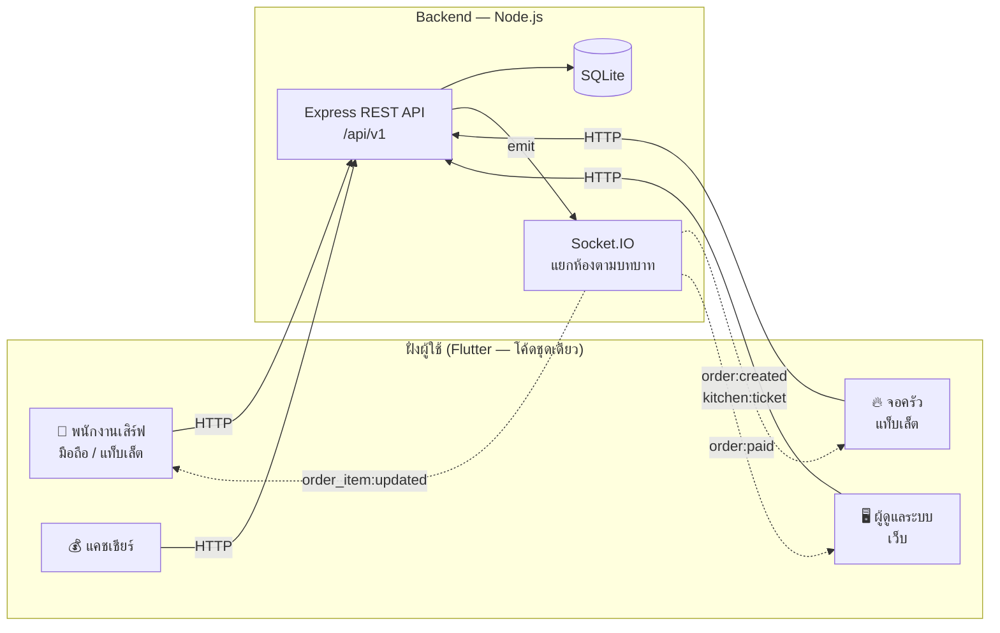
```mermaid
flowchart LR
    subgraph clients["ฝั่งผู้ใช้ (Flutter — โค้ดชุดเดียว)"]
        W["📱 พนักงานเสิร์ฟ<br/>มือถือ / แท็บเล็ต"]
        K["🔥 จอครัว<br/>แท็บเล็ต"]
        C["💰 แคชเชียร์"]
        A["🖥️ ผู้ดูแลระบบ<br/>เว็บ"]
    end

    subgraph server["Backend — Node.js"]
        API["Express REST API<br/>/api/v1"]
        WS["Socket.IO<br/>แยกห้องตามบทบาท"]
        DB[("SQLite")]
    end

    W -->|HTTP| API
    K -->|HTTP| API
    C -->|HTTP| API
    A -->|HTTP| API

    WS -.->|order:created<br/>kitchen:ticket| K
    WS -.->|order_item:updated| W
    WS -.->|order:paid| A

    API --> DB
    API -->|emit| WS
```

### Clean Architecture ฝั่ง Flutter

ทิศทางการพึ่งพาชี้เข้าหา **domain** เสมอ — ชั้นในไม่รู้จักชั้นนอก

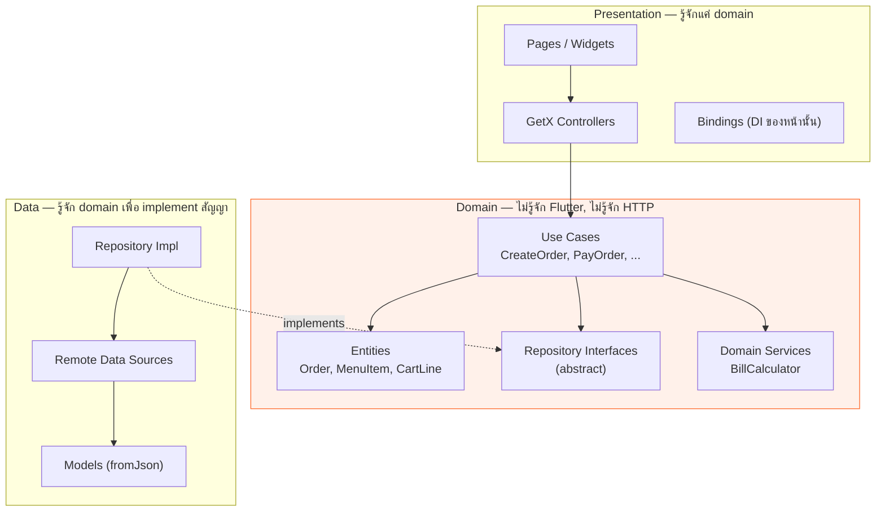
```mermaid
flowchart TB
    subgraph presentation["Presentation — รู้จักแค่ domain"]
        PG["Pages / Widgets"]
        PC["GetX Controllers"]
        PB["Bindings (DI ของหน้านั้น)"]
    end

    subgraph domain["Domain — ไม่รู้จัก Flutter, ไม่รู้จัก HTTP"]
        DE["Entities<br/>Order, MenuItem, CartLine"]
        DU["Use Cases<br/>CreateOrder, PayOrder, ..."]
        DR["Repository Interfaces<br/>(abstract)"]
        DS["Domain Services<br/>BillCalculator"]
    end

    subgraph data["Data — รู้จัก domain เพื่อ implement สัญญา"]
        DM["Models (fromJson)"]
        DD["Remote Data Sources"]
        DI["Repository Impl"]
    end

    PG --> PC --> DU --> DR
    DU --> DE
    DU --> DS
    DI -.implements.-> DR
    DI --> DD --> DM

    style domain fill:#FFF1EA,stroke:#FF6B2C
```

**ประโยชน์ที่เกิดขึ้นจริงจากการแยกชั้น:**

1. **Demo Mode** — สลับ data source เป็นข้อมูลจำลองได้โดยแก้ไขไฟล์เดียว โดยชั้นหน้าจอไม่ต้องเปลี่ยนแปลง
2. **เทสต์ controller ได้โดยไม่ต้องมีเซิร์ฟเวอร์** — ส่ง repository จำลองเข้าไปโดยตรง (ดู `test/presentation/cart_controller_test.dart`)
3. **กฎทางธุรกิจอยู่ในจุดเดียว** — `BillCalculator` ใช้ได้ทั้งพรีวิวในตะกร้าและ Demo Mode
4. **เปลี่ยน backend ได้** — หากย้ายไปใช้ GraphQL หรือ Firebase จะแก้ไขเฉพาะชั้น data

### Backend แบบแยกชั้น

```
routes  →  controller  →  service  →  repository  →  SQLite
   ↑           ↑             ↑             ↑
validate    แปลง req/res  กฎธุรกิจ      SQL ล้วน ๆ
 (Zod)                    + emit socket
```

`service` ไม่รู้จัก `req`/`res` และ `repository` ไม่รู้จักกฎธุรกิจ — แต่ละชั้นเทสต์แยกได้

---

## 📁 โครงสร้างโปรเจกต์

```
PaynEat/
├── app/                              # Flutter (มือถือ + แท็บเล็ต + เว็บ)
│   ├── lib/
│   │   ├── app/                      # ธีม, routing, DI ระดับแอป, config
│   │   ├── core/                     # ของกลางที่ทุกฟีเจอร์ใช้ร่วมกัน
│   │   │   ├── network/              # ApiClient (Dio), SocketClient, endpoints
│   │   │   ├── errors/               # Failure / Exception + ตัวแปลง
│   │   │   ├── usecases/             # Result<T> (sealed class แทน Either)
│   │   │   ├── demo/                 # ⭐ เซิร์ฟเวอร์จำลองสำหรับ Demo Mode
│   │   │   ├── services/             # StorageService, SessionService
│   │   │   ├── utils/                # ตัวจัดรูปแบบ, responsive
│   │   │   └── widgets/              # widget ที่ใช้ซ้ำทั้งแอป
│   │   └── features/                 # แยกตามฟีเจอร์ แต่ละอันมี 3 ชั้นครบ
│   │       ├── auth/  menu/  table/  order/
│   │       ├── kitchen/  payment/  report/
│   │       └── staff/  settings/  home/  customer/  receivable/  scale/ …
│   │           ├── domain/           # entities · repositories · usecases
│   │           ├── data/             # models · datasources · repository impl
│   │           └── presentation/     # controllers · pages · widgets · bindings
│   └── test/                         # เทสต์ domain / controller / widget
│
├── backend/                          # Node.js API
│   ├── src/
│   │   ├── config/  core/  middlewares/  realtime/
│   │   ├── db/                       # migrations/ (มีเวอร์ชัน), migrate, seed
│   │   ├── modules/                  # แยกตาม domain
│   │   │   └── orders/
│   │   │       ├── order.routes.js
│   │   │       ├── order.controller.js
│   │   │       ├── order.service.js
│   │   │       ├── order.repository.js
│   │   │       ├── order.calculator.js   # ⭐ กฎคิดเงิน (pure function)
│   │   │       └── order.schema.js       # Zod
│   │   └── routes.js
│   ├── assets/fonts/                 # ฟอนต์ไทยสำหรับ PDF เอกสารลูกหนี้
│   ├── contracts/erp-pos/            # สำเนาสัญญา POS ↔ PaynEat ERP v1 1.0.0 (ห้ามแก้ — คัดลอกจาก ERP ดู ABOUT-THIS-COPY.md)
│   ├── docs/openapi.yaml
│   └── tests/
│
├── docker-compose.yml                # รันทั้งระบบด้วยคำสั่งเดียว (build จากซอร์สในเครื่อง)
├── deploy/demo/                      # ทางเลือก D: compose + ตัวติดตั้งบรรทัดเดียวบน Docker Desktop
└── .github/workflows/
    ├── ci.yml                        # ตรวจ format, analyze, test ทุกครั้งที่ push
    ├── deploy-pages.yml              # landing + ลิงก์เดโม (โหมดสาธิต) บน GitHub Pages
    └── demo-images.yml               # build image Docker จริง + smoke test → release "demo"
```

---

## 💵 การคำนวณบิล

การคำนวณเงินต้องถูกต้องทุกสตางค์ ระบบจึงกำหนดหลักการ 2 ข้อต่อไปนี้:

### 1. เก็บเงินเป็นจำนวนเต็ม (สตางค์)

```js
// ❌ ปัญหาคลาสสิกของ floating point
0.1 + 0.2 === 0.3   // false

// ✅ ฝั่ง backend เก็บเป็นสตางค์ทั้งหมด แล้วแปลงเป็นบาทตอนส่งออก
120.50 บาท  →  เก็บเป็น  12050
```

### 2. ลำดับการคำนวณชัดเจน และเป็น pure function ที่เทสต์ได้

```
ยอดรวมอาหาร (subtotal)
  − ส่วนลด                       (บาท หรือ %)
  + Service Charge 10%           (คิดจากยอดหลังหักส่วนลด)
  + VAT 7%                       (คิดจากยอดหลังหักส่วนลด + Service Charge)
  = ยอดสุทธิ
```

ตัวอย่างจากเทสต์ — ผัดกะเพรา 75 บาท + ไข่ดาว 15 บาท × 2 จาน:

| รายการ | ยอด |
|---|---:|
| ยอดรวมอาหาร | 180.00 |
| Service Charge 10% | 18.00 |
| VAT 7% (ของ 198) | 13.86 |
| **รวมทั้งสิ้น** | **211.86** |

ตรรกะนี้มี 2 ชุดที่ให้ผลตรงกันทุกกรณี และมีเทสต์ครอบคลุมทั้งสองชุด:

- `backend/src/modules/orders/order.calculator.js` — ยอดจริงที่ใช้เก็บเงิน
- `app/lib/features/order/domain/services/bill_calculator.dart` — พรีวิวในแอปที่แสดงผลทันทีโดยไม่ต้องรอการเชื่อมต่อ

รองรับโหมด "ราคารวม VAT แล้ว" (ระบบจะถอด VAT ออกมาแสดงแทนการบวกเพิ่ม)

---

## ⚡ Realtime

Socket.IO ใช้ JWT ตัวเดียวกับ REST API และจัดผู้ใช้เข้าห้องตามบทบาท เพื่อไม่ให้ครัวได้รับ event ที่ไม่เกี่ยวข้อง

| Event | ผู้รับ | เกิดขึ้นเมื่อ |
|---|---|---|
| `kitchen:ticket` | ห้องครัว | กดส่งออเดอร์เข้าครัว |
| `order_item:updated` | ห้องบริการ | ครัวเปลี่ยนสถานะอาหาร |
| `order:created` / `order:updated` | ทุกคน | เปิดหรือแก้ไขออเดอร์ |
| `order:paid` | ทุกคน | ปิดบิลสำเร็จ |
| `table:updated` | ทุกคน | สถานะโต๊ะเปลี่ยน |
| `scale:reading` | ห้องบริการ + ผู้บริหาร | น้ำหนักบนตาชั่งที่ต่อสายเปลี่ยน (+ heartbeat 1 วินาที) |

ฝั่งแอป `SocketClient` คืนฟังก์ชันยกเลิกการรับ event ทุกครั้ง controller จึงเก็บไว้เรียกใน `onClose()`
เพื่อป้องกัน listener ค้างและ memory leak

```dart
_unsubscribers.add(socket.on(SocketEvents.kitchenTicket, (_) => load()));
```

---

## 📡 API

เปิด **http://localhost:3000/docs** เพื่อดูเอกสารและทดลองเรียก API ได้จริง (Swagger UI)

<details>
<summary><b>สรุป endpoint ทั้งหมด (คลิกเพื่อดู)</b></summary>

| Method | Endpoint | สิทธิ์ | คำอธิบาย |
|---|---|---|---|
| POST | `/auth/login` | — | เข้าสู่ระบบ |
| GET | `/auth/me` | ทุกคน | ข้อมูลผู้ใช้ปัจจุบัน |
| GET | `/menu-items` | ทุกคน | รายการเมนู (ค้นหา/กรองได้) |
| POST | `/menu-items` | admin, manager | เพิ่มเมนู |
| PATCH | `/menu-items/:id/availability` | + kitchen, waiter | เปิด/ปิดขาย (ของหมด) |
| GET | `/tables` | ทุกคน | ผังโต๊ะพร้อมออเดอร์ที่เปิดอยู่ |
| PATCH | `/tables/:id/status` | ทุกคน | เปลี่ยนสถานะโต๊ะ |
| POST | `/orders` | เสิร์ฟขึ้นไป | เปิดออเดอร์ |
| POST | `/orders/:id/items` | เสิร์ฟขึ้นไป | สั่งเพิ่ม |
| PATCH | `/orders/:id/items/:itemId` | เสิร์ฟขึ้นไป | แก้จำนวน (ก่อนครัวเริ่มทำ) |
| PATCH | `/orders/:id/items/:itemId/status` | ครัว, เสิร์ฟ | เดินสถานะอาหาร |
| POST | `/orders/:id/send-to-kitchen` | เสิร์ฟขึ้นไป | ส่งเข้าครัว |
| POST | `/orders/:id/discount` | แคชเชียร์ขึ้นไป | ให้ส่วนลด |
| POST | `/orders/:id/cancel` | admin, manager | ยกเลิกออเดอร์ |
| PATCH | `/orders/:id/move-table` | เสิร์ฟขึ้นไป | ย้ายออเดอร์ไปโต๊ะอื่น |
| POST | `/orders/:id/merge` | เสิร์ฟขึ้นไป | รวมออเดอร์ต้นทางเข้ากับปลายทาง |
| GET | `/orders/kitchen/queue` | ครัว | คิวครัว |
| POST | `/payments` | แคชเชียร์ขึ้นไป | รับชำระเงิน (ทั้งบิล/บางส่วน/แยกบิลรายการอาหาร) |
| POST | `/payments/order/:id/split-preview` | แคชเชียร์ขึ้นไป | ดูยอดล่วงหน้าก่อนแยกบิล |
| GET | `/payments/order/:id/receipt` | ทุกคน | ข้อมูลใบเสร็จ |
| GET | `/reports/dashboard` | ผู้บริหาร | ข้อมูลแดชบอร์ด |
| GET | `/reports/summary` | ผู้บริหาร | สรุปยอดตามช่วงวันที่ |
| GET/PATCH | `/settings` | ทุกคน / admin | ตั้งค่าร้าน |
| GET/POST/PATCH/DELETE | `/users` | admin, manager (DELETE: admin) | จัดการพนักงาน — manager เฉพาะเสิร์ฟ/ครัว/แคชเชียร์ในสาขาของตัวเอง |
| GET | `/audit-logs` | admin | ประวัติการกระทำที่เสี่ยงต่อการทุจริต (filter ได้) |
| GET/POST | `/customers` | เสิร์ฟขึ้นไป | ค้นหา/สร้างลูกค้า (จากชื่อหรือเบอร์โทร) |
| GET | `/customers/:id` | เสิร์ฟขึ้นไป | รายละเอียดลูกค้ารายคน (รวมแต้มคงเหลือ) |
| PATCH | `/customers/:id/credit` | admin, manager | ตั้งวงเงินเครดิต/เครดิตเทอม/เลขผู้เสียภาษี/ที่อยู่ออกเอกสาร |
| GET | `/receivables/customers` · `/receivables/customers/:id` | แคชเชียร์ขึ้นไป | รายชื่อลูกหนี้ / รายการเดินบัญชี (อายุหนี้, บิลขายเชื่อ, ใบวางบิล, ใบเสร็จ) |
| POST | `/receivables/receipts` · `/receivables/billing-notes` | แคชเชียร์ขึ้นไป | รับชำระหนี้ (ตัดบิลเก่าสุดก่อน) / ออกใบวางบิล |
| POST | `/receivables/receipts/:id/void` · `/receivables/billing-notes/:id/void` | admin, manager | ยกเลิกใบเสร็จรับชำระ/ใบวางบิล (ต้องระบุเหตุผล) |
| GET | `/receivables/customers/:id/late-fee-preview` | แคชเชียร์ขึ้นไป | ดูดอกเบี้ยผิดนัดรายบิลก่อนออกใบแจ้ง |
| POST | `/receivables/late-fees` · `/receivables/late-fees/:id/void` | admin, manager | ออกใบแจ้งดอกเบี้ยผิดนัด / ยกเลิก (ยกเว้นดอกเบี้ย) |
| POST | `/receivables/credit-notes` | admin, manager | ลดหนี้บิลขายเชื่อ + ออกใบลดหนี้ (VAT ของผลต่าง) |
| GET | `/receivables/late-fees/:id` · `/receivables/credit-notes/:id` | แคชเชียร์ขึ้นไป | ใบแจ้งดอกเบี้ย / ใบลดหนี้ (พร้อมประวัติส่งอีเมล) |
| GET | `/receivables/{billing-notes,receipts,credit-notes,late-fees}/:id/pdf` | แคชเชียร์ขึ้นไป | ดาวน์โหลดเอกสารเป็น PDF A4 ภาษาไทย |
| POST | `/receivables/{billing-notes,receipts,credit-notes,late-fees}/:id/email` | แคชเชียร์ขึ้นไป | ส่งเอกสารแนบ PDF ทางอีเมล (ต้องตั้ง SMTP) |
| GET | `/scale` | เสิร์ฟขึ้นไป | สถานะตาชั่งที่ต่อสาย + น้ำหนักล่าสุด |
| POST | `/ai/ask` | admin, manager | ถามคำถามภาษาธรรมชาติเกี่ยวกับยอดขาย/เมนู/ออเดอร์/ลูกค้า — AI ตอบผ่าน tool-calling กับข้อมูลจริงเท่านั้น (จำกัดโควตา/วัน) |

</details>

ทุก endpoint ใช้รูปแบบ response เดียวกัน:

```jsonc
// สำเร็จ
{ "success": true, "data": { }, "meta": { "page": 1, "total": 24 } }

// ผิดพลาด
{
  "success": false,
  "error": {
    "code": "VALIDATION_ERROR",
    "message": "ข้อมูลที่ส่งมาไม่ถูกต้อง",
    "details": [{ "field": "quantity", "message": "จำนวนต้องมากกว่า 0" }],
    "requestId": "pos-3fa2c1d09b7e4a55"   // = header x-request-id และ correlation_id ใน log (ticket 24)
  }
}
```

---

## 🧪 การทดสอบ

```bash
cd backend && npm test      # 574 เคส
cd app && flutter test      # 633 เคส
cd app && flutter test test_e2e   # 60 เคส (ต้อง npm ci ใน backend ก่อน)
node --test scripts/android-version.test.mjs   # 3 เคส — versionCode ของ build Google Play (ไม่นับใน badge)
```

badge นับเฉพาะเทสต์ของ backend และแอป (574 + 633 + 60) ส่วนเทสต์ของสคริปต์ `android-version.mjs` ตรวจว่า tag `vX.Y.Z` ให้ค่า `versionCode` ที่เพิ่มขึ้นเสมอ
และหยุดพร้อมแจ้งเหตุผลเมื่อ tag ผิดรูปแบบหรือเกินช่วง — รันก่อน build ทุกครั้งใน workflow `android-release.yml` (ดู `docs/DECISIONS.md` #75)

**E2E — แอปทำงานร่วมกับ backend จริง (60 เคส)** — `app/test_e2e/` เปิด backend จริง
(`node src/server.js`) บนพอร์ตสุ่มพร้อมฐานข้อมูลชั่วคราวใหม่สำหรับทุกไฟล์ แล้วให้โค้ดชั้น data/domain จริงของ
แอป (`ApiClient` → data source → repository ชุดเดียวกับที่แอปประกอบเมื่อเปิดใช้งาน) ทำงานตามสถานการณ์จริง
ของร้าน โดยแต่ละบทบาทใช้ "เครื่อง" ของตนเอง — เป็นชุดเดียวที่แอป**อ่าน JSON จาก backend จริง** (เทสต์
Flutter อื่นทั้งหมดทำงานบนโหมดสาธิต ส่วนเทสต์ backend เป็น JavaScript ทั้งหมด) และมี job แยกใน CI:

> `restaurant_day_e2e_test.dart` (15 ขั้น) — ทุกบทบาทล็อกอิน → ตั้งเลขพร้อมเพย์ → เปิดออเดอร์ที่ยอดตรงกับ
> ตะกร้าที่แอปคำนวณแสดงให้พนักงานทุกสตางค์ → ร่างออเดอร์ยังไม่ถึงครัวและยังไม่ตัดสต๊อกจนกว่าจะกด "ส่งเข้าครัว" → ครัวดำเนินการจน
> เสิร์ฟ → กะที่ค้างอยู่ต้องปิดก่อน และรับเงินไม่ได้จนกว่าจะเปิดกะใหม่ → QR พร้อมเพย์จาก backend ตรงกับอัลกอริทึม Dart
> ทุกตัวอักษรรวม CRC → รับเงินสดและทอนถูกต้อง โต๊ะกลับเป็นว่าง → ใบกำกับภาษีเต็มรูป → คืนเงิน (แคชเชียร์ทำไม่ได้/
> ผู้จัดการทำได้) → ปิดกะโดยส่วนต่างเป็นศูนย์ → Z-report + CSV → รายงานนับบิลเพิ่มขึ้นตรงตามจริง → audit log ครบทุกเหตุการณ์ทางการเงิน
>
> `merge_bills_e2e_test.dart` (2 ขั้น) — บิลที่มีส่วนลด 10 บาทและรับเงินสด 50 แล้ว แอปอ่านหน้าดูตัวอย่างรวมบิลจาก backend จริงได้ครบทั้งสองฝั่ง
> รวมแล้วบิลปลายทางได้ส่วนลดและยอดจ่ายแล้ว บิลต้นทางยอด 0 ไม่มีเงินค้าง
>
> `points_refund_e2e_test.dart` (3 ขั้น) — บิล 100.05 ที่ใช้ 40 แต้ม + เงินสด 60.05: Z-report ของกะนับเงินสดจริงกับบรรทัดแลกแต้มแยกกัน
> ตัวอย่างก่อนคืน 50 บาท (เงิน 31 + 19 แต้ม) ตรงกับที่คืนจริง คืนที่เหลือแล้วแต้มกลับครบ ใบเสร็จแสดงเงินกับแต้มทุกรอบ และปิดกะส่วนต่าง 0
>
> `store_time_zone_e2e_test.dart` (2 ขั้น) — แอปอ่านเขตเวลาเริ่มต้น `Asia/Bangkok` จาก backend จริง ตั้ง `asia/seoul` แล้วได้ `Asia/Seoul`
> กลับมา และชื่อที่ไม่ใช่เขตเวลา IANA ได้ข้อความบอกเหตุผลโดยค่าเดิมไม่เปลี่ยน
>
> `self_order_and_access_e2e_test.dart` (16 เคส) — ลูกค้าสแกน QR สั่งเองจนถึงจอครัว, ลิงก์ที่ใช้งานไม่ได้ทุกรูปแบบ,
> เปลี่ยน QR แล้วลิงก์เก่าใช้งานไม่ได้ทันที, ข้อมูลส่วนบุคคลไม่รั่วไหลไปยังหน้าสาธารณะ, พนักงานหลายสาขา/สลับสาขา, สิทธิ์
> 403 ทุกจุดที่เกี่ยวกับเงิน, token ที่ไม่ถูกต้อง และเครื่องที่ยังล็อกอินค้างอยู่ของพนักงานที่ถูกปิดบัญชีใช้งานต่อไม่ได้
>
> `meat_shop_b2b_e2e_test.dart` (12 ขั้น) — เคาน์เตอร์เนื้อและลูกค้าขายส่ง: สแกนฉลากตาชั่งที่คำนวณ check
> digit เองตามรูปแบบจากการตั้งค่าร้านจริง → ราคาบรรทัดชั่งน้ำหนักในตะกร้าตรงกับ backend ทุกสตางค์ → สินค้าชั่ง
> น้ำหนักที่ไม่ระบุน้ำหนักได้รับ 400 → ขายเชื่อเกินวงเงินได้รับ 409 / พนักงานเสิร์ฟได้รับ 403 → ขายเชื่อครบกำหนด +30 วัน
> และตัดสต๊อกเนื้อเป็นกิโลกรัมแม้ไม่เคยส่งครัว → ใบวางบิลรวมสองบิล (ออกซ้ำได้รับ 409) → รับชำระเงินสดตามใบวางบิล
> โดยตัดบิลที่เก่าที่สุดก่อน (บิลแรกชำระครบ = ลูกค้าได้รับแต้มของบิลนั้นในขั้นนี้ ขายเชื่อไม่ได้รับแต้มล่วงหน้า) → ปิดกะโดยส่วนต่างเป็นศูนย์ +
> Z-report แยกยอดขายเชื่อ/รับชำระหนี้ → รายงานแสดงน้ำหนักรวม (กก.)
>
> `scale_documents_e2e_test.dart` (6 ขั้น) — เทสต์เปิด "ตาชั่ง" เป็น TCP server ของตนเองให้ backend จริงเชื่อมต่อเข้ามา
> (`SCALE_DRIVER=tcp`): น้ำหนักส่งผ่าน ตาชั่ง → parser → socket.io → แอป ค่าที่ยังแกว่งใช้ไม่ได้ ค่าที่นิ่งแล้วใช้ได้ → ขายเชื่อ
> ด้วยน้ำหนักนั้นในราคาที่ตรงกับ backend ทุกสตางค์ → บิลเลยกำหนด 20 วัน ผ่อนผัน 5 วัน คิดดอกเบี้ย 15 วันตรงตามสูตร
> (แคชเชียร์ได้รับ 403) → ใบลดหนี้ 107 บาทแยก VAT และยอดค้างลดลงถูกต้อง → ดาวน์โหลด PDF ทุกประเภทเอกสารได้ไฟล์ `%PDF-` จริง
> → ส่งใบวางบิลทางอีเมล (`MAIL_TRANSPORT=json` สร้างอีเมลและ PDF แนบครบถ้วนแต่ไม่ส่งออกจริง) ลูกค้าที่ไม่มีอีเมลได้รับ 400
>
> `backup_restore_e2e_test.dart` (4 ขั้น) — ขายหนึ่งบิลแล้วปิดกะ → คำตอบของการปิดกะบอกว่าสำรองสำเร็จ → แอปอ่านสถานะการสำรองจาก
> backend จริงได้ (แคชเชียร์ได้รับ 403) → admin กด "สำรองข้อมูลตอนนี้" ได้ไฟล์ใหม่ → กู้ไฟล์หลังปิดกะลงฐานข้อมูลใหม่ด้วยคำสั่ง
> `db:restore` ตัวจริง แล้วเปิด backend บนฐานข้อมูลนั้น → Z-report ของกะตรงกับก่อนกู้ทุกบาท และมี audit `system.restore`

ชุด E2E นี้ตรวจพบ**ข้อบกพร่อง 5 รายการที่เทสต์เดิมทั้ง 659 เคสไม่ตรวจพบ** ซึ่งได้แก้ไขพร้อมเทสต์ป้องกันการถดถอยแล้วทั้งฝั่ง
backend และโหมดสาธิต: ใบกำกับภาษีแสดงสามบรรทัดที่ผลรวมไม่ตรงกัน (`docs/DECISIONS.md` #43), การคืนเงินสดทำให้แคชเชียร์
ถูกบันทึกว่าเงินขาดเมื่อปิดกะ (`docs/DECISIONS.md` #44), ไฟล์ CSV ที่ดาวน์โหลดเมื่อเชื่อมต่อ backend จริงไม่มี BOM ทำให้ภาษาไทย
แสดงผลผิดใน Excel (`docs/DECISIONS.md` #45), รายการที่ลูกค้ากด "ส่งเข้าครัว" ไม่ปรากฏที่ครัว และลิงก์ QR ที่ถูกตัดท้ายแสดงหน้า "ไม่มีอินเทอร์เน็ต"
(`docs/DECISIONS.md` #46) — รายละเอียดการออกแบบชุดเทสต์นี้อยู่ใน `docs/DECISIONS.md` #47

**image Docker — build จริง + smoke test** — [`demo-images.yml`](.github/workflows/demo-images.yml) build image API และเว็บ
จาก Dockerfile จริงทุกครั้งที่ `main` เปลี่ยน (และทุก PR ที่แก้ไข Dockerfile/compose) แล้วรัน `deploy/demo/docker-compose.demo.yml`
เพื่อยืนยันว่า API ตอบ `/health`, เข้าสู่ระบบได้, ตาชั่งจำลองทำงานอยู่ และเว็บตอบ 200 — เมื่อผ่านแล้วจึงอัปโหลดเป็น release `demo` ของทางเลือก D
(job นี้ป้องกันไม่ให้ Dockerfile ที่ build ไม่ผ่านหลุดรอดโดยไม่มีการแจ้งเตือน ดู `docs/DECISIONS.md` #63, #65)

**Backend (574 เคส)** — `node:test` + `supertest` ทดสอบผ่าน HTTP จริงบนฐานข้อมูลที่แยกต่างหาก
เทสต์หลักคือ `tests/order-flow.test.js` ซึ่งครอบคลุมเส้นทางการทำงานของร้านตั้งแต่ต้นจนจบใน 17 ขั้น:

> เลือกโต๊ะ → เปิดออเดอร์พร้อมตัวเลือกเสริม → ตรวจว่ายอดคำนวณถูกต้อง → โต๊ะเปลี่ยนเป็นไม่ว่าง →
> การเปิดซ้ำที่โต๊ะเดิมต้องถูกปฏิเสธ → ส่งครัว → ครัวเปลี่ยนสถานะ (และข้ามขั้นไม่ได้) →
> เมื่อเสิร์ฟครบ ออเดอร์เปลี่ยนสถานะเอง → ให้ส่วนลด → แยกจ่าย 2 ครั้ง → ตรวจเงินทอน →
> การจ่ายซ้ำต้องถูกปฏิเสธ → โต๊ะกลับเป็นว่างอัตโนมัติ → ใบเสร็จครบถ้วน → ยอดเข้ารายงาน

นอกจากนี้มีเทสต์แยกรายโมดูลครบทั้ง 9 module: `menu.test.js` (validation, RBAC, ลบเมนูที่ถูกสั่ง
แล้วไม่ได้), `table.test.js` (ชื่อซ้ำ, เปลี่ยนสถานะ, ลบโต๊ะที่มีออเดอร์ค้าง), `payment.test.js`
(แยกจ่าย, จ่ายเกิน/จ่ายซ้ำ, RBAC), `categories.test.js`, `settings.test.js`, `users.test.js`
(สิทธิ์ลบพนักงานสงวนไว้เฉพาะ admin), `reports.test.js` — เทสต์ค้นหาเมนูตรวจพบข้อบกพร่องใน
`menu.repository.js` ซึ่งแก้ไขแล้ว: `IFNULL(m.name_en, "")` ถูก SQLite ตีความเครื่องหมายคำพูดคู่เป็นชื่อ
คอลัมน์แทน string literal ทำให้การค้นหาล้มเหลวเมื่อมีเมนูที่ไม่มี `nameEn` จึงเปลี่ยนเป็นเครื่องหมาย
คำพูดเดี่ยว

`promotion-engine.test.js` (16 เคส) ทดสอบตรรกะจับคู่โปรโมชันล้วน (percent/amount/bogo, เงื่อนไข
วัน/เวลา/ยอดขั้นต่ำ/เมนู-หมวดหมู่, `findBestAutoPromotion`, `describeIneligibility`) และ
`promotion-flow.test.js` (13 เคส) ทดสอบเส้นทางเต็มผ่าน HTTP: สร้างโปรโมชัน auto → ใช้กับออเดอร์เดิม
อัตโนมัติ → เมื่อลบแล้วระบบใส่กลับให้เนื่องจากยังเข้าเงื่อนไข → ปิดใช้งานแล้วโปรโมชันหายไป → กรอกโค้ดที่ถูกต้อง/ผิด →
โค้ดที่ผูกไว้ไม่ถูกแทนที่ด้วย auto แม้ให้ส่วนลดน้อยกว่า → การลบโปรโมชันที่เคยใช้ไม่กระทบออเดอร์เก่า
(บันทึก snapshot ชื่อ/โค้ดไว้แล้ว)

`order-move-merge-split.test.js` (7 เคส) ครอบคลุมฟีเจอร์ย้ายโต๊ะ/รวมบิล/แยกบิลตามรายการอาหาร:
ย้ายโต๊ะสำเร็จ + ปฏิเสธเมื่อโต๊ะปลายทางไม่ว่าง, รวมบิลสำเร็จ (ยอดรวมถูกต้อง ต้นทางถูกยกเลิกและ
คืนโต๊ะ) + ปฏิเสธการรวมกับตนเอง, พรีวิวยอดแยกบิลตามสัดส่วน, จ่ายทีละรายการจนครบและปิดบิล,
ปฏิเสธการเลือกรายการที่จ่ายไปแล้วซ้ำ

`merge-paid.test.js` (5 เคส) รวมบิลที่รับเงินไว้แล้ว (T09): A (100.05 จ่าย 50) รวมเข้า B (94.16) ตัวอย่างบอกยอดทั้งสองฝั่ง B เหลือจ่าย
144.21 การชำระย้ายไปอยู่ที่ B และ A ปิดโดยยอด 0 ไม่มีเงินค้าง รายงานนับเฉพาะ B, ส่วนลด 10 บาทของ A ตามไป (ยอด 182.44), ยอดคืนเงินของ A
ตามไปด้วย ยอดจ่ายแล้วของ B เป็นยอดสุทธิ, โปรโมชันประเมินใหม่ (โค้ดของปลายทางชนะ ส่วนลดที่หายบอกในตัวอย่าง และโค้ดของต้นทางตามไปเมื่อปลายทาง
ไม่มีโค้ด) และบิลขายเชื่อของลูกค้ารวมเข้าบิลที่ไม่ใช่ลูกค้าคนเดียวกันไม่ได้ (409 `MERGE_CUSTOMER_MISMATCH`) ทั้งตอนดูตัวอย่างและตอนรวม
(ดู `docs/DECISIONS.md` #98)

`points-cash.test.js` (5 เคส) แยกเงินสดจริงออกจากมูลค่าแต้ม (T11): เปิดกะ 2000 รับเงินสด 100.05 กับบิลที่ใช้ 40 แต้ม + เงินสด 60.05 → Z-report
เงินสด 160.10 บรรทัดแลกแต้ม 40 (CSV ด้วย), ตัวอย่างก่อนคืน 50 บาทได้เงิน 31 กับ 19 แต้มโดยไม่เขียนอะไร, คืนเต็มบิลได้เงิน 60.05 กับ 40 แต้มกลับเข้าบัญชี
และปิดกะที่ 2100.05 ส่วนต่าง 0, คืนหลายรอบ (50/30/20.05) ได้ (31, 19), (18, 12), (11.05, 9) และบิลที่ไม่ได้ใช้แต้มคืนเป็นเงินทั้งหมด
`store-time.test.js` (4 เคส) ตัวช่วยวันและเวลาของร้าน (T03): 20:00 UTC ของวันที่ 26 คือวันที่ 27 ของร้าน Asia/Bangkok และวันที่ 27 คือ
[26T17:00Z, 27T17:00Z), วันเปลี่ยนเวลาออมแสงยาว 23/25 ชั่วโมง วันที่ไม่มีเที่ยงคืน (ชิลี) และเลื่อนครึ่งชั่วโมง (Lord Howe), รับเฉพาะชื่อ IANA
และรันซ้ำในโปรเซสลูกที่ตั้ง `TZ=UTC`, `TZ=Asia/Bangkok`, `TZ=America/Los_Angeles` ได้ผลเท่ากันทุกตัวอักษร ส่วน `settings.test.js` เพิ่มเคสตั้ง
เขตเวลาผ่าน API (ค่าเริ่มต้น, เก็บเป็นตัวพิมพ์มาตรฐาน, ชื่อผิดได้ 400 สามภาษา, นาฬิกาของร้านอ่านค่าที่ตั้งไว้) (ดู `docs/DECISIONS.md` #101)
`refund-split.test.js` (7 เคส) ตัวแบ่งยอดคืน: คืนเต็ม, ตัวอย่างของ PO (60/40 คืน 50 = 30 + 20), แต้มปัดลง, เงินที่คืนไม่เกินเงินที่รับจริง,
คืนหลายรอบรวมได้เท่าคืนครั้งเดียว และยอดที่ต้องคืนเป็นแต้มแต่ไม่เต็มแต้มถูกปฏิเสธ (ดู `docs/DECISIONS.md` #100)

`order-transaction.test.js` (6 เคส) ยืนยันว่าการแก้ออเดอร์ทุกแบบอยู่ใน transaction เดียวกับการคำนวณยอดใหม่และ audit (T02): จำลองให้การคำนวณยอด
ล้มระหว่างเปิดออเดอร์, เพิ่ม/แก้/ลบ/ยกเลิกรายการ, ส่วนลด, ใส่/ถอดโค้ดส่วนลด, รวมบิล และยกเลิกออเดอร์ที่ส่งครัวแล้ว — รายการ ยอดรวม สต๊อก
สถานะโต๊ะ และ audit log ต้องเท่าเดิมทุกค่า ส่วนย้ายโต๊ะและส่งครัวไม่คำนวณยอดใหม่ (ดู `docs/DECISIONS.md` #84)

`closed-bill-lock.test.js` (4 เคส) ล็อกรายการในบิลที่ปิดแล้ว (T04): บิลที่จ่ายครบยกเลิกรายการไม่ได้ทั้งพนักงานเสิร์ฟและผู้จัดการ (409 ข้อความตามภาษา)
โดยยอด VAT สถานะรายการ และสต๊อกเท่าเดิม, ออเดอร์ที่ถูกยกเลิกแล้วได้เหตุผลเดียวกัน, รายการที่แยกจ่ายแล้วยกเลิกไม่ได้แต่รายการที่ยังไม่จ่ายยกเลิกได้
และครัวเดินสถานะอาหารของบิลกลับบ้านที่จ่ายก่อนได้ครบรวมเลิกทำ (ดู `docs/DECISIONS.md` #85)

`kitchen-started-void.test.js` (7 เคส) ยกเลิกรายการที่ครัวเคยลงมือทำ (T05): พนักงานเสิร์ฟและครัวได้ 403 เป็นภาษาของผู้ใช้,
พร้อมเสิร์ฟ → กำลังทำ → รอทำ แล้วพนักงานเสิร์ฟยกเลิกยังได้ 403 โดยยอด สถานะ และสต๊อกไม่เปลี่ยน, ลำดับเดียวกันโดยผู้จัดการสำเร็จ คืนสต๊อก และ
audit `order_item.void` บอกขั้นที่เคยถึง, รายการที่ถูกเลิกทำแก้จำนวน/ลบไม่ได้ (409), รายการที่ครัวยังไม่เคยแตะพนักงานยกเลิกเองได้โดยไม่ log
และครัวเลิกทำได้หนึ่งขั้นเหมือนเดิมโดย `kitchenReached` ไม่ถอยลง ส่วน `migrations.test.js` เพิ่มเคสที่ migration 0003 เติมขั้นที่เคยถึงให้รายการเดิม
(ดู `docs/DECISIONS.md` #86)

`refund-open-bill.test.js` (4 เคส) ยอดจ่ายแล้วหักยอดคืนเงิน (T06): จ่าย 50 แล้วคืน 50 บนบิลที่ยังเปิด ยอดคงเหลือกลับเป็นยอดเต็ม จ่ายแค่ส่วนที่เหลือเดิม
(ยอด − 50) ยังไม่ปิดบิล จ่ายเกินยอดสุทธิไม่ได้ และจ่ายครบแล้วบิลปิด, คืนบางส่วนแล้วยอดคงเหลือกับ split-preview ตรงกัน, แยกจ่ายตามรายการแล้วคืน payment
ครบ รายการกลับเป็นยังไม่จ่ายและพนักงานยกเลิกได้ (คืนบางส่วนยังนับว่าจ่ายแล้ว) และคืนเงินหลังปิดบิลบิลยังปิด ไม่มียอดค้างใหม่ ส่วน
`migrations.test.js` เพิ่มเคสที่ migration 0004 คงรายการที่แยกจ่ายไว้ก่อนหน้าเป็นจ่ายแล้ว (ดู `docs/DECISIONS.md` #87)

`bill-covers-paid.test.js` (4 เคส) ยอดบิลต้องไม่ต่ำกว่ายอดที่จ่ายแล้ว (T07): บิล 200.09 จ่าย 150 แล้วใส่ส่วนลด 50% ได้ 409 "ต้องคืนเงิน 49.95
บาทก่อน" (ภาษาอังกฤษด้วย) โดยยอดและส่วนลดไม่เปลี่ยน คืน 49.95 แล้วใส่ได้และบิลปิด โต๊ะว่าง, แยกจ่ายรายการ 160 ×2 แล้วยกเลิก ลบ หรือลดจำนวนรายการนั้น
ไม่ได้ (409 พร้อมยอดที่ต้องคืน) ยกเลิกรายการที่เหลือแล้วบิลปิดเอง, บิลที่ถือเงินเกินยอดอยู่แล้ว (สภาพก่อนแก้) แยกจ่ายชุดสุดท้าย ระบุยอด และดูยอดแยกบิล
ได้ 409 ไม่ใช่ 500 และสรุปยอดส่ง `refundDue` และ property test ที่สุ่มแก้บิล จ่าย และคืนเงิน 25 บิล × 14 ขั้นด้วย seed คงที่ ตรวจว่าไม่มี 500
ยอดบิลที่ยังเปิด ≥ ยอดจ่ายสุทธิ และบิลที่เปิดอยู่พร้อมเงินที่รับไว้ยังมียอดให้เก็บเสมอ (ดู `docs/DECISIONS.md` #95)

`cancel-money-held.test.js` (3 เคส) ยกเลิกออเดอร์ที่ยังถือเงินลูกค้าไว้ไม่ได้ (T08): จ่ายเงินสด 100 แล้วยกเลิกได้ 409 `REFUND_REQUIRED` พร้อมยอดที่ต้องคืน
และ payment ที่ยังคืนได้ ออเดอร์ รายการ และโต๊ะไม่เปลี่ยน คืน 60 ยังยกเลิกไม่ได้ (ต้องคืนอีก 40) คืนครบแล้วยกเลิกได้และเงินสดที่คาดไว้ในลิ้นชักเท่าเดิม,
ข้อความแปลตาม `Accept-Language` และบิลขายเชื่อ 50 ยกเลิกไม่ได้ หนี้ไม่ถูกลดเงียบๆ คืนเงินบิลเชื่อแล้วได้ใบลดหนี้ หนี้เป็น 0 จึงยกเลิกได้ (ดู `docs/DECISIONS.md` #96)

`report-refund-before-close.test.js` (3 เคส) ยอดขายสุทธิหักเฉพาะเงินที่คืนหลังบิลปิด (#143) ตรวจพร้อมกันทั้งสรุปยอดขาย Z-report รายวัน และ Z-report
รายกะ: คืน 50 ตอนบิลยังเปิดแล้วเก็บจนครบ ยอดขายสุทธิเท่ายอดบิล ยอดคืน 0 และช่องทางเงินสดนับเฉพาะ payment ที่เก็บไว้, รับบัตร 50 คืนครบแล้วยกเลิก
ทั้งสามรายงานไม่เปลี่ยนเลย และคืน 30 ก่อนปิดกับ 10 หลังปิดบนบิลเดียว หักเฉพาะ 10 (ดู `docs/DECISIONS.md` #97)

`split-share.test.js` (6 เคส) แยกจ่ายตามรายการ (T10): บิล 160 + 320 มีโปรลด 50% จ่าย 94.16 และ 188.32 ไม่ว่าใครจ่ายก่อน, โหมด VAT รวมในราคา
160 + 80 จ่าย 176.00 และ 88.00, **property test** 2,000 บิลสุ่มทุกชุดค่าผสมของส่วนลด/โปร/SC/โหมด VAT/การแบ่งกลุ่ม/ลำดับ ผลรวมทุกคนเท่ายอดบิล
และแต่ละคนห่างจากสัดส่วนไม่เกิน 3 สตางค์ และผ่าน API จริง: preview แสดงส่วนลดที่ปันแล้ว ตัวเลขรวมเท่ายอดที่เก็บ รวมถึงบิลที่รับเงินแบบระบุยอดไปก่อน
(บรรทัดปรับยอด) (ดู `docs/DECISIONS.md` #88)

`points-rate.test.js` (6 เคส) อัตราแต้มขั้นต่ำ (T15): ตั้งอัตราสะสม 0.004 / 0.009 / 0 / ติดลบ ได้ 400 พร้อมข้อความขั้นต่ำเป็นไทย/อังกฤษ/เกาหลี
และไม่บันทึกช่องอื่นที่ส่งมาพร้อมกัน, มูลค่าแต้ม 0 ได้ 400 ส่วน 0.01 พอดีตั้งได้, อัตราในฐานข้อมูลเป็น 0 หรือ 0.004 อยู่แล้ว ขายเงินสดและรับชำระหนี้
ขายเชื่อครบได้ 0 แต้ม (ไม่มีค่า Infinity ในฐานข้อมูล), มูลค่าแต้มในฐานข้อมูลเป็น 0 แลกแต้มไม่ได้และแต้มไม่ถูกหัก และยอดแต้มที่ไม่ใช่จำนวนเต็ม
ถูกปฏิเสธก่อนถึงฐานข้อมูล ส่วน `migrations.test.js` เพิ่ม 2 เคสที่ migration 0005 ซ่อมยอดแต้มที่เสีย: คิดใหม่จากประวัติ (ได้ − ใช้ ไม่ต่ำกว่า 0),
บิลที่ได้แต้มเสียกลายเป็น 0, ลูกค้าที่ยอดปกติไม่ถูกแตะ และบันทึก audit `customer.points_repair` ต่อลูกค้า (ดู `docs/DECISIONS.md` #89)

`manager-staff-scope.test.js` (5 เคส) ขอบเขตของผู้จัดการในการจัดการพนักงาน (T22): รายการมีเฉพาะเสิร์ฟ/ครัว/แคชเชียร์ที่มีสิทธิ์ในสาขาเดียวกัน
(รวมพนักงานที่มีหลายสาขา) ไม่มีแอดมิน ผู้จัดการ หรือพนักงานที่มีสิทธิ์เฉพาะสาขาอื่น, ตั้งรหัสใหม่/ปิดบัญชี/เปลี่ยน role/แก้ชื่อ/เปิดดูบัญชีผู้จัดการคนอื่น
ได้ 403 ทั้งสาขาเดียวกันและข้ามสาขา (ข้อความเป็นภาษาของผู้ใช้ และบัญชีไม่ถูกแตะ), พนักงานที่มีสิทธิ์เฉพาะสาขาอื่นได้ 404, ผู้จัดการยังสร้าง/เปลี่ยน role/
ตั้งรหัสให้พนักงานในสาขาได้แต่สร้างหรือเลื่อนเป็นผู้จัดการ/แอดมินไม่ได้ และแอดมินยังทำได้ทุกอย่าง (ดู `docs/DECISIONS.md` #92)

`ingredients.test.js` (9 เคส) ทดสอบ CRUD วัตถุดิบ, RBAC (พนักงานเสิร์ฟสร้าง/แก้ไขไม่ได้), validation,
การปรับสต๊อกแล้ว `isLowStock` เปลี่ยนถูกต้อง, filter `lowStockOnly`, ลบไม่ได้หากยังผูกกับเมนูอยู่ และ
`inventory-flow.test.js` (13 ขั้น) ทดสอบเส้นทางเต็ม: สั่งอาหาร → ยังไม่ตัดสต๊อกจนกว่าจะส่งครัว →
ส่งครัวแล้วตัดสต๊อก (กดซ้ำไม่ตัดซ้ำ) → เพิ่มรายการเข้าออเดอร์ที่ส่งครัวแล้วตัดทันที → สต๊อกหมดแล้วเมนูปิดขาย
อัตโนมัติ → สั่งเมนูที่ปิดขายอยู่ได้รับ 409 → ยกเลิกรายการแล้วคืนสต๊อกและเปิดขายกลับอัตโนมัติ → การปรับสต๊อกด้วยมือ
sync เมนูเช่นเดียวกัน → การแก้จำนวน/ลบรายการ/ยกเลิกทั้งบิลคืนสต๊อกถูกต้องครบทุกกรณี

`tax-invoices.test.js` (9 เคส) ทดสอบการออกใบกำกับภาษีอย่างย่อ/เต็มรูป, รูปแบบเลขที่รัน
`INV<ปี พ.ศ.>-<เลขรัน 6 หลัก>` และการเรียงต่อเนื่องข้ามหลายออเดอร์, ปฏิเสธการออกซ้ำให้บิลเดียวกัน/บิลที่
ยังไม่ชำระ/ร้านที่ยังไม่ตั้งค่าเลขผู้เสียภาษี, RBAC (พนักงานครัวออกไม่ได้) และ flow
ยกเลิก (void) แล้วออกใหม่ได้ด้วยเลขที่ใหม่

เทสต์ที่ครอบคลุมช่องโหว่ทั้ง 7 จุดที่พบและแก้ไขแล้วจาก security review เต็มรูปแบบ (OWASP Top 10):
`users.test.js` 7 เคส — manager สร้างบัญชี/เลื่อนสิทธิ์ตนเอง/แก้ไข/รีเซ็ตรหัสผ่านบัญชี admin
ไม่ได้ (privilege escalation), admin ยังทำได้ตามปกติ, token เก่าใช้สิทธิ์เดิมต่อไม่ได้ทันที
หลังบัญชีถูกปิดใช้งานหรือเปลี่ยน role (ไม่ต้องรอ token หมดอายุ) และแอดมินลดสิทธิ์/ปิดบัญชีตนเองไม่ได้ (ดู `docs/DECISIONS.md` #62) — `security-headers.test.js`
(2 เคส) ยืนยันว่า CSP header เปิดอยู่ทุก endpoint ยกเว้น `/docs` (Swagger UI ต้องใช้ inline
script/style) — `seed-production-safety.test.js` (2 เคส) ยืนยันว่า `NODE_ENV=production`
ปฏิเสธการ seed บัญชีด้วยรหัสผ่านเดโมที่เปิดเผยอยู่แล้ว (`admin123` ฯลฯ) ต้องตั้ง `SEED_*_PASSWORD` เองก่อน
เสมอ (ดู `docs/DECISIONS.md` #20)

`production-defaults.test.js` (13 เคส) ตรวจค่าเริ่มต้นสำหรับ production (T19, `docs/DECISIONS.md` #83):
- `NODE_ENV=production` ไม่ยอมเริ่มเมื่อ `JWT_SECRET` เป็นค่าตัวอย่างใน repository หรือสั้นกว่า 32 ตัวอักษร แต่เริ่มได้เมื่อเป็นค่าสุ่มยาวพอ
  และตอนพัฒนายังใช้ค่าเดโมได้;
- `/metrics` ฟังเฉพาะ `127.0.0.1` เป็นค่าเริ่มต้น;
- คำตอบของ error 500 ไม่แนบ stack เว้นแต่ตั้ง `EXPOSE_ERROR_STACK=true` นอก production;
- ลบบัญชีที่เคยเปิดกะได้ 409 โดยไม่มีอะไรถูกลบหรือบันทึก และปิดการใช้งานแทนได้;
- `docker-compose.yml` ไม่มีค่าสำรองของ `JWT_SECRET` และไม่เปิดพอร์ต metrics ส่วน compose เดโมเปิดพอร์ตเฉพาะ `127.0.0.1`

`audit-logs.test.js` (16 เคส) ทดสอบว่าทุก action ที่มีความเสี่ยงถูกบันทึกถูกต้อง: ยกเลิกออเดอร์
(พร้อมเหตุผล/ผู้ทำ), void รายการอาหารเฉพาะหลังครัวทำแล้ว (การยกเลิกขณะยัง pending ต้องไม่ถูกบันทึก),
แก้ไขส่วนลด, ปิดใช้งาน/รีเซ็ตรหัสผ่าน/เปลี่ยนสิทธิ์/ลบพนักงาน (การแก้เฉพาะชื่อต้องไม่ถูกบันทึก), การแก้ VAT
ต้องถูกบันทึกแต่การแก้เฉพาะชื่อร้านไม่ถูกบันทึก, คืนเงิน, ยกเลิกใบกำกับภาษี และ RBAC (เฉพาะ admin)
(ดู `docs/DECISIONS.md` #21) — และอีก 6 เคส (ดู `docs/tickets/13-order-audit-trail.md`,
`docs/DECISIONS.md` #25) สำหรับ audit ระดับ "ผู้สั่ง/ผู้แก้ไขออเดอร์" ที่ผู้จัดการและฝ่ายบัญชี
ใช้ตรวจสอบได้ (ไม่จำกัดเฉพาะเหตุการณ์ที่เสี่ยงต่อการทุจริตเหมือนกลุ่มแรก): เปิดออเดอร์ใหม่ (บันทึกชื่อ
พนักงานเสิร์ฟที่สั่ง), เพิ่มรายการเข้าออเดอร์, แก้ไขจำนวนรายการ (การแก้เฉพาะหมายเหตุไม่ถูกบันทึก), ลบรายการ,
ย้ายโต๊ะ และรวมบิล

`customers.test.js` (11 เคส) ทดสอบครบทั้งลูกค้าและแต้มสะสม: สร้างลูกค้า/ปฏิเสธเบอร์โทรซ้ำ (409),
ค้นหาจากชื่อ/เบอร์โทรบางส่วน, RBAC (ครัวเรียกใช้ไม่ได้), ผูก `customerId` ขณะเปิดออเดอร์ + ปฏิเสธ
`customerId` ที่ไม่มีอยู่จริง, filter `GET /orders?customerId=`, สะสมแต้มอัตโนมัติตามอัตราเริ่มต้น
(25 บาท/แต้ม) เฉพาะเมื่อชำระครบ, ออเดอร์ที่ไม่ผูกลูกค้าไม่ได้รับแต้ม, การแยกจ่ายหลายรอบได้รับแต้มครั้งเดียว
เมื่อชำระครบ, การใช้แต้มแลกส่วนลดแล้วยอด `amount` ที่นับเข้าออเดอร์ไม่เปลี่ยน (ลดเฉพาะ `chargedAmount`)
และปฏิเสธการใช้แต้มทั้ง 2 กรณี (ไม่มีลูกค้าผูกไว้ / มูลค่าเกินยอดที่ต้องชำระในรอบนั้น) (ดู
`docs/DECISIONS.md` #22)

`takeaway-delivery.test.js` (12 เคส) ทดสอบ flow takeaway/delivery เต็มรูปแบบ: เลขคิวรับอาหารมี
เฉพาะออเดอร์ `type=takeaway` (`dine_in`/`delivery` ต้องได้ `null` เสมอ), เลขคิวเรียงต่อเนื่องรายวันแยก
อิสระจากเลขที่บิล (3 ออเดอร์ takeaway ติดกันได้เลข 1, 2, 3), KDS query (`findItemsByStatuses`) ส่ง
`orderType` ถูกต้องครบทั้ง 3 ประเภทเพื่อแยกการแสดงผล และ checkout/ชำระเงินสำหรับออเดอร์ takeaway ทำงาน
ได้ตามปกติโดยไม่มีจุดใดบังคับเลือกโต๊ะ (ดู `docs/DECISIONS.md` #23)

`promptpay.test.js` (8 เคส) ทดสอบ pure function สร้าง payload QR พร้อมเพย์ตามมาตรฐาน EMV QR:
CRC-16/CCITT-FALSE ตรงกับ test vector มาตรฐาน, static QR (ไม่ระบุยอด) เทียบกับ dynamic QR (ระบุยอด),
เลขบัตรประชาชน/ผู้เสียภาษี 13 หลักใช้ tag ต่างจากเบอร์โทร, ตัดอักขระที่ไม่ใช่ตัวเลขออกจาก
promptPayId, โครงสร้าง TLV self-consistent ครบทุก tag และ throw เมื่อ promptPayId ว่างเปล่า —
และอีก 5 เคสใน `settings.test.js`/`payment.test.js` สำหรับ endpoint
`GET /payments/promptpay-qr` และฟิลด์ `promptPayId` ในหน้าตั้งค่า (ดู
`docs/tickets/16-promptpay-qr.md`, `docs/DECISIONS.md` #26)

`audit-logs.test.js` มีอีก 3 เคส (ดู `docs/tickets/14-financial-audit-trail.md`,
`docs/DECISIONS.md` #27) สำหรับ audit ระดับ**บัญชี/การเงิน**: แก้ราคาเมนู (`menu.price_change` —
การแก้เฉพาะชื่อไม่ถูกบันทึก และการส่งราคาเดิมซ้ำไม่ถูกบันทึกซ้ำ), สร้าง/แก้ไข/ลบโปรโมชัน
(`promotion.create`/`update`/`delete`), ปรับสต๊อกวัตถุดิบด้วยมือ (`ingredient.stock_adjust`) —
และอีก 3 เคสสำหรับ `GET /audit-logs/export`: RBAC (เฉพาะ admin), header/เนื้อหา CSV ถูกต้อง
(UTF-8 BOM ป้องกัน Excel อ่านอักษรไทยผิดเพี้ยน) และ filter ตาม action ได้เช่นเดียวกับ list

`audit-logs.test.js` มีอีก 3 เคส (ดู `docs/DECISIONS.md` #28) ครอบคลุมเหตุการณ์ audit log ที่เหลือ: เปิด/ปิดกะ
(`shift.open`/`shift.close` — ตรวจ metadata ส่วนต่างเงินสดเมื่อปิดกะ), รับชำระเงิน (`payment.pay`)
และกรอก/ถอดโค้ดส่วนลด (`order.promotion_redeem`/`order.promotion_remove`)

`audit-summary-args.test.js` (3 เคส, `docs/DECISIONS.md` #74) อ่านซอร์สทุกไฟล์ใน `src/modules` เพื่อยืนยันว่าทุก
`auditLogService.log({…})` ส่ง `summaryArgs` มาด้วย (ยืนยันแล้วว่าเทสต์ล้มเมื่อลบออกเพียงจุดเดียว) และตรวจค่าจริงของการเปิดออเดอร์/ย้ายโต๊ะ
(ชื่อโต๊ะทั้งต้นทางและปลายทาง) กับการแก้ไขการตั้งค่า (`changes` ทีละช่อง) — ประโยคภาษาไทยใน `summary` ต้องเหมือนเดิมทุกตัวอักษร

`ai-assistant.test.js` (9 เคส) ทดสอบผู้ช่วย AI ผ่าน fake Anthropic client (ไม่เรียก API จริงในเทสต์ —
สลับ client ด้วย `setAnthropicClientForTests`): RBAC (เสิร์ฟ/ครัว/แคชเชียร์เข้าถึงไม่ได้), คำถามว่าง
ได้รับ 422, ยังไม่ตั้งค่า `ANTHROPIC_API_KEY` ตอบ 503 พร้อม error code เฉพาะ, เรียก tool จริงแล้วตอบ
พร้อมกราฟและระบุแหล่งข้อมูล, `list_audit_log_entries` เปิดให้เฉพาะ `admin` (manager ไม่เห็น tool นี้
ตั้งแต่ระดับที่ส่งให้โมเดลเลือก ไม่ใช่เพียงกรองผลลัพธ์), พารามิเตอร์ tool ที่ผิด schema ถูกปฏิเสธและ
ให้โมเดลแก้ไขเองแทนการล้มเหลวทั้งคำขอ, เมื่อโมเดลไม่เรียก `submit_answer` เองจะถูกบังคับด้วย `tool_choice`
ในรอบสุดท้ายเสมอ (ป้องกันการวนซ้ำไม่สิ้นสุด) และเมื่อโมเดลปฏิเสธ (`stop_reason: refusal`) ระบบตอบด้วยข้อความสุภาพแทนการล้มเหลว
— แยกอีกไฟล์ `ai-assistant-rate-limit.test.js` (1 เคส) ทดสอบโควตาต่อวันด้วย
`AI_ASSISTANT_DAILY_LIMIT=1` (ตั้ง env ใน process แยก เพื่อไม่กระทบเทสต์ไฟล์อื่นที่ใช้ค่าเริ่มต้น 20)
(ดู `docs/tickets/15-ai-ask-your-data.md`, `docs/DECISIONS.md` #33)

`report-export.test.js` (8 เคส) ทดสอบการส่งออกรายงานเป็น CSV (สรุปยอดขาย/เมนูขายดี/ยอดขายรายวัน
— header/เนื้อหา + UTF-8 BOM ถูกต้อง) และ Z-report ทั้งรายกะ (พร้อมกระทบยอดเงินสด คิดจาก
`payments.shift_id` ไม่ใช่วันที่เปิดออเดอร์ เพื่อรองรับ edge case ออเดอร์ที่เปิดคาบเกี่ยวกะ) และรายวัน (รวมทุกกะ
ไม่มีกระทบยอดเงินสดเนื่องจากอาจมีหลายกะ/หลายแคชเชียร์), 404 เมื่อไม่มีกะนั้นอยู่จริง, การส่งออก Z-report เป็น
CSV และ RBAC (พนักงานเสิร์ฟเรียกใช้ไม่ได้) (ดู `docs/tickets/12-report-export.md`)

`branches.test.js` (16 เคส) ทดสอบ multi-branch เต็มรูปแบบ: login คืน `pendingToken` +
รายชื่อสาขาเมื่อมีสิทธิ์ ≥2 สาขา (ไม่ใช่ admin), login ได้ทันทีเมื่อมีสาขาเดียวหรือเป็น admin
(เลือกสาขาแรกอัตโนมัติเสมอ), `POST /auth/select-branch` แลก pendingToken เป็น token จริง + ใช้สลับสาขา
ภายหลังได้ (แต่ pendingToken ใช้เรียก endpoint อื่นก่อนเลือกสาขาไม่ได้), เฉพาะ admin เลือก
โหมด "ทุกสาขา" (`branchId: null`) ได้, `authenticate` ตรวจสิทธิ์สาขาจาก DB ทุก request (เมื่อปิดสาขาแล้ว
token เก่าใช้ต่อไม่ได้ทันทีแม้เป็นของ admin), รายการโต๊ะ/เมนู/ออเดอร์/วัตถุดิบถูก filter ตาม
`branch_id` ถูกต้อง (โหมดทุกสาขาเห็นข้อมูลทั้งสองสาขารวมกัน), พนักงานใหม่ถูกผูกกับสาขาอัตโนมัติตาม
สาขาที่ผู้สร้างทำงานอยู่ และ RBAC ของ `GET /branches`/`GET /branches/mine`/`PATCH /branches/:id`
ถูกต้อง (ดู `docs/tickets/11-multi-branch.md`, `docs/DECISIONS.md` #36)

`public-order.test.js` (13 เคส) ทดสอบ endpoint สาธารณะสำหรับสั่งอาหารเองผ่าน QR โดยไม่ต้อง login:
ทุกโต๊ะมี `qrToken` ไม่ซ้ำกันตั้งแต่ `GET /tables`, token ผิด/โต๊ะถูกปิดใช้งานได้รับ 404, ดูเมนู/ออเดอร์
ปัจจุบันของโต๊ะได้ถูกต้อง, การเพิ่มรายการครั้งแรกเปิดออเดอร์ใหม่อัตโนมัติ ครั้งต่อไปเพิ่มเข้าออเดอร์เดิม,
สั่งเมนูที่ปิดขายอยู่ได้รับ 409, ส่งเกิน 20 รายการต่อครั้งได้รับ 422, `PATCH /tables/:id/qr-token/regenerate`
ปิด token เก่าทันทีและ RBAC (เฉพาะ admin/manager — พนักงานเสิร์ฟเรียกใช้ไม่ได้) และจำกัดอัตราการเรียก
`POST .../items` ที่ 30 ครั้ง/5 นาทีต่อโต๊ะ เมื่อเกินได้รับ 429 (ดู `docs/tickets/17-qr-self-order.md`,
`docs/DECISIONS.md` #37)

`sell-by-weight.test.js` (10 เคส) ขายตามน้ำหนัก: ราคา = ราคาต่อกก. × กรัม ปัดเป็นสตางค์ (รวมตัวเลือกเสริม
ต่อกก.), ต้องมี/ห้ามมีน้ำหนักตามชนิดเมนู, บรรทัดละ 1 ถุงและแก้จำนวนไม่ได้, ตัดสต๊อกเป็นกิโลกรัม, ตัดสต๊อกเมื่อ
ชำระครบหากไม่เคยส่งครัว (`docs/DECISIONS.md` #51), เมนูชั่งน้ำหนักยังขายได้ตราบที่สต๊อก > 0, รายงาน/CSV แสดงน้ำหนักรวม และ QR
สั่งเองไม่แสดง/สั่งไม่ได้ — `barcode-scale.test.js` (6 เคส) บาร์โค้ด/PLU ซ้ำในสาขาเดียวกันได้รับ 409 (ต่างสาขา
ใช้ได้), PLU ตัด 0 นำหน้าและใช้ได้เฉพาะเมนูชั่งน้ำหนัก, ค้นหาเมนูด้วยบาร์โค้ด, ล้างรหัสได้, รูปแบบฉลากที่เหลือหลัก
น้ำหนักไม่พอถูกปฏิเสธ (รวมกรณีส่งมาเพียงช่องเดียวเทียบกับค่าที่บันทึกไว้) — `receivables.test.js` (10 เคส)
ขายเชื่อ (วงเงิน/ไม่ผูกลูกค้า/พนักงานเสิร์ฟ/ใช้แต้มร่วม), รับชำระโดยตัดบิลที่เก่าที่สุดก่อน/เกินยอดค้างไม่ได้, เงินสด
นับเข้ากะ, ยกเลิกใบเสร็จเงินสดหลังปิดกะไม่ได้, ใบวางบิล (ออกซ้ำ/ยกเลิกแล้วออกใหม่/สถานะ paid), คืนเงินบิล
ขายเชื่อไม่เกินยอดค้าง, อายุหนี้ และ RBAC — `migrate-credit.test.js` (1 เคส) สร้างฐานข้อมูลรุ่นก่อน ticket 20
จริงแล้ว migrate เพื่อยืนยันว่าข้อมูลการเงิน/refund ที่อ้างถึง/index อยู่ครบ (ดู `docs/DECISIONS.md` #48–#51) —
`migrations.test.js` (11 เคส) migration แบบมีเวอร์ชัน (ticket T01): รันครั้งเดียวแม้ boot ซ้ำ, ล้มเหลวระหว่างทางแล้ว rollback ทั้งตัว
(ตาราง/คอลัมน์ที่สร้างระหว่างทางถูกลบทั้งหมดและไม่ถูกบันทึกว่ารันแล้ว), migration ที่ปิด foreign key ต้องผ่าน `foreign_key_check`
ก่อน commit, การแก้ไข migration ที่รันแล้วหรือการย้อนเวอร์ชันแอปทำให้เซิร์ฟเวอร์ไม่เริ่มทำงาน, ไฟล์ migration ตรงกับ `checksums.json`
(CRLF บน Windows ได้ checksum เดียวกัน) และฐานข้อมูลที่สร้างก่อน T01 พร้อมข้อมูล seed/ยอดขาย/คืนเงินอัปเกรดได้โดยจำนวนแถวทุกตาราง
เท่าเดิม (ดู `docs/DECISIONS.md` #79)

`backup-files.test.js` (6 เคส) และ `backups.test.js` (20 เคส) ทดสอบการสำรองข้อมูล (ticket 33): ปิดกะแล้วได้ไฟล์ที่ผ่าน `integrity_check`
และอ่านยอดของกะได้ สิทธิ์ไฟล์ `0600`/โฟลเดอร์ `0700`, สำรองล้มเหลวแล้วการปิดกะยังสำเร็จ, สำรองฐานข้อมูล 40,000 แถวพร้อมการเขียนต่อเนื่อง
แล้วไฟล์ไม่มีรายการครึ่งๆ กลางๆ, รอบ 6 ชั่วโมงด้วยนาฬิกาจำลอง (สำรองเมื่อข้อมูลเปลี่ยนเท่านั้น), สำรองก่อน migration และเมื่อสำรองไม่สำเร็จ
ไม่มี migration ถูกรัน, ที่เก็บชุดที่สองล้มเหลวแยกจากชุดแรก, คำเตือน 26 ชั่วโมง, สิทธิ์ของสถานะและปุ่มสำรอง (cashier/waiter/kitchen ได้ 403),
ไม่มี endpoint ส่งไฟล์สำรองออก, ปฏิเสธที่เก็บในโฟลเดอร์ที่เผยแพร่บนเว็บ, metric, กฎการเก็บย้อนหลัง (ไม่ลบจนเหลือ 0 ไฟล์แม้ `BACKUP_KEEP_DAYS=0`)
และคำสั่งกู้คืนทั้ง 4 กรณี (เซิร์ฟเวอร์ยังทำงาน ไฟล์เสีย ไฟล์จากรุ่นใหม่กว่า ไฟล์ปกติพร้อม `pre-restore` และ audit)

`erp-connection.test.js` (20 เคส) ทดสอบโหมดเชื่อมต่อ PaynEat ERP (ticket 25) กับ ERP จำลอง (`tests/helpers/erpStub.js`) ตั้งแต่ใช้งานเดี่ยว
จนออกจากโหมด:
- ค่าเริ่มต้นไม่มีการเรียก ERP;
- สาขาที่รหัสผิดรูปแบบหรือยังไม่มีรหัสถูกแจ้งชื่อและปัญหา (ภาษาอังกฤษได้เหตุผลเป็นภาษาอังกฤษ);
- credential ผิด, สัญญา major 2 และ ERP ที่ติดต่อไม่ได้ถูกปฏิเสธโดยไม่เข้าโหมด;
- credential ไม่ปรากฏในคำตอบ log audit log CSV หรือการตั้งค่า;
- วัตถุดิบเดิมที่ตั้งรหัสสินค้าไว้ถูกเขียนทับในแถวเดิม (สูตรเมนูไม่หลุด);
- การแก้ไขวัตถุดิบ/สาขาได้รับ 409;
- เมนูที่ระบบสต๊อกปิดไว้ถูกเปิดคืนและขายได้แม้ยอดในเครื่องเป็น 0;
- ดึงทีละหน้าต่อจากเวอร์ชันล่าสุด และการดึงซ้ำไม่ทำให้ข้อมูลซ้ำ;
- 503 ระหว่างทางแล้วรอบถัดไปดึงต่อจากหน้าที่ใช้แล้วพอดี;
- สาขาที่ถูกแทนรหัสย้ายรหัสโดยประวัติการขายตามไปด้วย;
- ปุ่ม "สร้างในเครื่อง": ผู้ที่ไม่ใช่ admin ได้รับ 403, สร้างด้วยชื่อภาษาไทยล่าสุดจาก ERP (ดึงก่อนสร้าง) พร้อมวัตถุดิบและ audit log, การกดซ้ำหรือรหัสที่ ERP
  ไม่ได้มอบหมายได้รับ 409 และ ERP ที่เพิ่งเปลี่ยนรหัสสาขาเดิมทำให้สาขาเดิมย้ายรหัสก่อน จึงไม่เกิดสาขาซ้ำ;
- คำตอบที่ผิดสัญญาเป็น ERROR `unexpected_response` และหยุดดึงตามรอบจนกว่าการกดดึงเองจะสำเร็จ;
- credential ที่ถูกเพิกถอนทำให้หยุดเรียก ERP จนกว่าจะบันทึกใหม่ และดึงต่อจากเวอร์ชันเดิม;
- ทุกบรรทัด log เรื่องการดึงมี `pos_instance` และใช้ event `master_data.pull.completed`/`master_data.pull.failed` พร้อม `reason`;
- ออกจากโหมดแล้วข้อมูลยังอยู่และกลับมาแก้ไขได้

`erp-contract.test.js` (24 เคส) ตรึงสัญญา POS v1 ที่ 1.0.0 (ไฟล์ตรงกับ checksum ที่คัดลอกมาจาก ERP), ตัวอย่างในสัญญาผ่าน schema,
client ของ POS อ่านตัวอย่างได้ครบ ข้ามฟิลด์และ entity ที่ไม่รู้จัก ปฏิเสธ major อื่นก่อนตรวจ schema และแปลงสถานะ 401/429/503/5xx/404/302
และการเชื่อมต่อขาดเป็นสิ่งที่สัญญากำหนด แล้วตรวจทุกกรณีว่าได้ `reason` และ severity ตามสัญญา telemetry v1.2 (`credential_revoked`,
`credential_unknown`, `erp_unreachable`, `rate_limited`, `unexpected_response`, `contract_unsupported` และ reason ที่ ERP ส่งมาเอง;
ERROR เมื่อต้องมีผู้ดำเนินการแก้ไข) (ดู `docs/DECISIONS.md` #80)

`erp-transport.test.js` (22 เคส) ทดสอบกติกา HTTPS ของ credential (ticket 32):
- ตารางที่อยู่ที่รับหรือปฏิเสธ รวมชื่อที่ขึ้นต้นเหมือน loopback หรือ resolve เป็น 127.0.0.1 ซึ่งไม่นับเป็น loopback;
- `ERP_ALLOW_INSECURE_HTTP` ต้องเป็น `true` ตรงตัวเท่านั้น;
- บันทึกที่อยู่ `http://` ได้รับ 400 (ข้อความตามภาษา) โดยไม่มีคำขอออกไป ส่วน loopback ใช้ได้โดยไม่ต้องตั้งค่าเพิ่ม;
- เมื่ออนุญาต http สำหรับเครือข่ายปิด ที่อยู่ `http://erp:3000` ใช้ได้ สถานะบอกให้แอปเตือน และมี log `WARNING` ตอนเปิดเครื่อง;
- การเชื่อมต่อ `http://` ที่บันทึกไว้ก่อนอัปเดตไม่มีคำขอไป ERP เลย ได้ log `master_data.pull.failed` ERROR (`unexpected_response`), หยุดดึงตามรอบ,
  กดดึงเองได้ 409 และบันทึกที่อยู่ที่ส่งได้แล้วกลับมาดึงตามปกติ;
- ERP ปลอมแบบ HTTPS กับ CA ทดสอบที่สร้างใหม่ทุกครั้ง: CA ที่เครื่องไม่เชื่อถูกปฏิเสธก่อนมีคำขอ HTTP (502 บอกให้ตั้ง `NODE_EXTRA_CA_CERTS`),
  เชื่อ CA ผ่าน `NODE_EXTRA_CA_CERTS` แล้วต่อได้ และชื่อในใบรับรองที่ไม่ตรงกับที่อยู่ถูกปฏิเสธ (ดู `docs/DECISIONS.md` #82)

`late-fees-credit-notes.test.js` (7 เคส) เพดานอัตราดอกเบี้ย 15%/แคชเชียร์ตั้งค่าไม่ได้/การเปลี่ยนอัตราถูกบันทึก audit, ยังไม่ตั้ง
อัตราจะไม่คิดดอกเบี้ย, คิดเฉพาะบิลที่เลยวันผ่อนผันนับถึงวันนี้และการกดซ้ำในวันเดิมไม่คิดดอกเบี้ยซ้ำ, รอบถัดไปคิดต่อจากวันที่คิด
ไปแล้วบนเงินต้นที่ยังค้าง, การรับชำระตัดดอกเบี้ยด้วยและยกเลิกใบแจ้งที่ชำระแล้วไม่ได้จนกว่าจะยกเลิกใบเสร็จ, การลดหนี้
ออกใบลดหนี้อัตโนมัติ (มูลค่าเดิม/ที่ถูกต้อง/ผลต่าง/VAT/เลขใบกำกับภาษีเดิม), ใบลดหนี้ใช้ได้เฉพาะบิลขายเชื่อและลดเกิน
ยอดค้างไม่ได้โดยไม่เหลือเอกสารค้างในระบบ — `document-pdf-email.test.js` (7 เคส) BAHTTEXT + วันที่ พ.ศ. เวลา
กรุงเทพฯ, PDF ได้ทุกประเภทเอกสาร, ใบวางบิลหลายบิลขึ้นหน้าใหม่ได้/เอกสารที่ยกเลิกแล้วยังดาวน์โหลดได้, ไม่ตั้ง SMTP =
503, ส่งอีเมลถึงลูกค้าพร้อม PDF แนบ + ประวัติ + audit log, ไม่มีผู้รับ 400 / เอกสารที่ยกเลิก 409 / SMTP ล้มเหลว 502
และไม่บันทึกประวัติ, บันทึกอีเมลลูกค้า — `scale.test.js` (5 เคส) อ่านรูปแบบ A&D/CAS/MT-SICS/ตัวเลข+หน่วย พร้อม
สถานะนิ่ง/แกว่ง/เกินพิกัด, TCP ต่อบรรทัดที่มาไม่ครบ/ส่งคำสั่งถามน้ำหนัก/เชื่อมต่อใหม่เองเมื่อสายหลุด, ค่าที่เก่ากว่า 3 วินาที
ไม่ถูกส่ง, `GET /scale` ปิดเป็นค่าเริ่มต้น/ตาชั่งจำลองส่งน้ำหนักได้/ครัวไม่มีสิทธิ์, ตั้ง serial แต่ไม่ตั้งพอร์ตจะแจ้งสาเหตุ
โดยไม่หยุดทำงาน (ดู `docs/DECISIONS.md` #54–#57)

`credit-points.test.js` (8 เคส) แต้มสะสมของบิลขายเชื่อ: บิลเงินสดยังได้รับแต้มเมื่อปิดบิล, ขายเชื่อ/ชำระบางส่วนยังไม่ได้รับแต้ม
ชำระครบได้รับตามสูตรเดิม + audit, ใบเสร็จเดียวตัดหลายบิลได้รับแต้มเฉพาะบิลที่ครบ, ยกเลิกใบเสร็จแล้วดึงแต้มคืน และรับชำระใหม่ไม่ได้รับ
ซ้ำ, ลูกค้าใช้แต้มไปก่อนที่ใบเสร็จถูกยกเลิก = ดึงคืนเท่าที่มี ไม่ติดลบ ไม่ได้รับซ้ำ, ลดหนี้แล้วคิดจากยอดสุทธิ/ลดหนี้ทั้งบิลไม่ได้รับแต้ม,
ดอกเบี้ยค้างยังไม่ครบ-ยกเว้นดอกเบี้ยแล้วได้รับแต้มโดยไม่นับดอกเบี้ย, บิลแยกจ่ายที่ส่วนขายเชื่อชำระครบก่อนได้รับแต้มเมื่อบิลปิด
(ดู `docs/DECISIONS.md` #59) — `cors.test.js` (2 เคส) `CORS_ORIGIN=*` ตามที่ `.env.example`/docker-compose ตั้งไว้ต้องตอบ
`Access-Control-Allow-Origin: *` เพื่อให้แอปเว็บที่รันคนละพอร์ตกับ API เข้าสู่ระบบได้ (ป้องกันกรณีค่าถูกแปลงเป็น `['*']` ซึ่งไม่ตรงกับ origin ใด
ดู `docs/DECISIONS.md` #61) — `error-i18n.test.js` (5 เคส) สแกนซอร์สทุกไฟล์ ข้อความ error ภาษาไทยที่ไม่มีคำแปลอังกฤษ/เกาหลีในแคตตาล็อก
ถือว่าล้มเหลว, ช่องแทรกค่าตรงกันทุกภาษา และ HTTP จริงตอบตาม `Accept-Language` (ไม่ส่ง/ภาษาที่ไม่รองรับ = ภาษาไทยตามเดิม) —
`kitchen-undo.test.js` จอครัวย้อนสถานะได้ทีละขั้น แต่สถานะ served ย้อนกลับไม่ได้ (ดู `docs/DECISIONS.md` #64)

`telemetry-log-record.test.js` (13 เคส) ทดสอบกฎของสัญญา telemetry เป็น pure function ด้วยชุดตัวอย่างเดียวกับเทสต์ของ
PaynEat ERP (severity ตาม status, latency `"0.231s"`, ตัด query string, แทน QR token ด้วย `:qrToken`, รับ `x-request-id`
ตามรูปแบบ, `traceparent`, labels/trace ทั้งแบบค่าเริ่มต้นและ `LOG_FORMAT=gcp`) และ `telemetry.test.js` (11 เคส) เรียกแอปจริง
แล้วตรวจบรรทัด log ที่แอปเขียนออกมาจริง: รูปแบบทั้งสองแบบ, `x-request-id` ไปกลับ (header/log/error body), severity
401/404 = INFO · 422 = WARNING · 500 = ERROR บรรทัดเดียวพร้อม `error` (stack เฉพาะ `LOG_LEVEL=DEBUG`), `location_code`
ของสาขา, `/metrics` ตาม route template บนพอร์ตแยกและไม่อยู่บนพอร์ต API, login/สร้าง-แก้ไขลูกค้า/ค้นหาด้วยเบอร์ไม่บันทึกชื่อ
เบอร์ อีเมล เลขผู้เสียภาษี ที่อยู่ รหัสผ่าน หรือ token ลงใน log, JSON ที่ไม่ถูกต้องซึ่งมีรหัสผ่านได้รับ 400 (เดิม 500) โดยเนื้อหา body ไม่ถูกบันทึก
และ QR token ของโต๊ะไม่ปรากฏใน log (ดู `docs/DECISIONS.md` #68)

**Flutter (633 เคส)** — แบ่งเป็น 3 ระดับ:

| ระดับ | ไฟล์ | ทดสอบอะไร |
|---|---|---|
| Domain | `bill_calculator_test.dart` | กฎคิดเงินทุกกรณี รวมส่วนลด ส่วนลดโปรโมชัน (รวมกันได้แต่ไม่เกินยอดรวม) และโหมดรวม VAT |
| Domain | `promotion_engine_test.dart` | พอร์ตเทสต์ตรรกะจับคู่โปรโมชันจาก backend มาที่ Dart (percent/amount/bogo, เงื่อนไขต่าง ๆ, `findBestAutoPromotion`, `describeIneligibility`) |
| Domain | `cart_line_test.dart` | การรวมรายการซ้ำในตะกร้า + ราคาบรรทัดชั่งน้ำหนักคิดเป็นสตางค์ก่อนปัดตรงกับ backend (รวมราคาที่มีเศษสตางค์), ตัวเลือกเสริมคิดต่อกก., สองถุงหนักเท่ากันไม่รวมบรรทัด (ticket 18) |
| Domain | `barcode_resolver_test.dart` | อ่านบาร์โค้ดสินค้า/ฉลากตาชั่ง EAN-13: PLU มี 0 นำหน้า, check digit ผิดไม่เดา, รูปแบบฉลากที่ร้านตั้งเอง, ฉลากจับคู่เฉพาะเมนูชั่งน้ำหนัก, บาร์โค้ดที่ลงทะเบียนไว้ตรงตัวมีลำดับความสำคัญเหนือการอ่านเป็นฉลาก (ticket 19) |
| Domain | `entities_test.dart` | สิทธิ์ตามบทบาท, การเดินสถานะอาหาร, รายการที่ครัวเคยทำแล้วถูกเลิกทำยังแก้/ลบไม่ได้ (T05), PaymentSummary/SplitPreview อ่านยอดคืนเงิน โหมด VAT รวมในราคา และบรรทัดปรับยอดจาก backend (T06, T10) |
| Domain | `loyalty_points_test.dart` | แต้มสะสมฝั่งแอป (mirror ของ backend): คิดเป็นสตางค์ ปัดลง, อัตรา 0 / ต่ำกว่า 0.01 / NaN / Infinity ได้ 0 แต้มไม่ใช่ exception, มูลค่าแต้มต่ำกว่า 0.01 บาทแลกไม่ได้ และขั้นต่ำที่ตั้งได้คือ 0.01 บาท (T15) |
| Domain | `split_share_test.dart` | ส่วนแบ่งการแยกจ่ายฝั่งแอป (mirror ของ backend): โปร 50% บน 160 + 320 ได้ 94.16/188.32 ไม่ว่าใครจ่ายก่อน, VAT รวมในราคา 160 + 80 ได้ 176/88 และ property test 2,000 บิลสุ่มผลรวมทุกคนเท่ายอดบิล (T10) |
| Domain | `refund_split_test.dart` | ตัวแบ่งยอดคืนเป็นเงินกับแต้มฝั่งแอป (mirror ของ backend เคสเดียวกัน): คืนเต็ม, ตัวอย่างของ PO, แต้มปัดลง, เงินที่คืนไม่เกินเงินที่รับจริง, คืนหลายรอบรวมได้เท่าคืนครั้งเดียว และยอดที่ไม่เต็มแต้มถูกปฏิเสธ (T11) |
| Domain | `demo_store_test.dart` | ตรวจว่าแยก `demo_store.dart` เป็น 20 ไฟล์แล้วเมธอดข้ามโดเมนยังทำงานถูก รวมถึง flow โปรโมชัน auto/โค้ด/ลบ/eligible list, flow ตัดสต๊อกอัตโนมัติ/ปิด-เปิดขายเมนูตามสต๊อกเต็มรูปแบบ, flow ออก/ยกเลิก/ออกใหม่ใบกำกับภาษีพร้อมเลขที่รัน, flow บันทึก audit log ครบทุก action เสี่ยง (ticket 08), flow ลูกค้า/แต้มสะสม: สร้าง/ค้นหาลูกค้า, ผูก customerId เมื่อเปิดออเดอร์, สะสมแต้มครั้งเดียวเมื่อจ่ายครบ (รวมกรณีแยกจ่ายหลายรอบ), ใช้แต้มแลกส่วนลดโดยยอด amount ไม่เปลี่ยน และปฏิเสธการใช้แต้มที่ไม่ถูกต้องทุกกรณี (ticket 09) และเลขคิวรับอาหารมีเฉพาะ `type=takeaway`, รันต่อวันเรียงถูกต้องแม้มีออเดอร์ dine-in/delivery แทรกกลาง (ticket 10), flow audit ระดับบัญชี/การเงิน: แก้ราคาเมนู log เฉพาะเมื่อราคาเปลี่ยนจริง, สร้าง/แก้ไข/ลบโปรโมชัน, ปรับสต๊อกวัตถุดิบมือ, และ `auditLogExportCsv` คืน CSV ที่กรองตาม action ถูกต้อง (ticket 14), และทุกโต๊ะมี `qrToken` ไม่ซ้ำกัน, `resolveTableByQrToken` หาโต๊ะถูกตัว/ปฏิเสธ token ผิดหรือโต๊ะปิดใช้งาน, `regenerateQrToken` ปิด token เก่าทันที (ticket 17), ขายตามน้ำหนัก/รหัสซ้ำ/ตัดสต๊อกเป็นกก.เมื่อจ่าย/QR สั่งเองไม่เห็นของชั่งน้ำหนัก (ticket 18–19), ขายเชื่อ/รับชำระตัดบิลเก่าก่อน/เงินสดเข้ากะ/ยกเลิกใบเสร็จหลังปิดกะไม่ได้/ใบวางบิล/ลดหนี้/อายุหนี้ (ticket 20) และดอกเบี้ยผิดนัดของบิลที่ seed ไว้ (คิด 8 วันที่ 12% กดซ้ำไม่ซ้ำ)/ยกเลิกใบแจ้งที่จ่ายแล้วไม่ได้/เพดาน 15%/ใบลดหนี้ + VAT ของผลต่าง/ส่งอีเมลจำลองใช้อีเมลลูกค้าเป็นค่าเริ่มต้นและเอกสารยกเลิกส่งไม่ได้ (ticket 21, 23) และแต้มของบิลขายเชื่อได้เมื่อชำระครบ/ยกเลิกใบเสร็จดึงคืนเท่าที่มี/ดอกเบี้ยค้างยังไม่ครบ/ลดหนี้คิดจากยอดสุทธิ (#59) และบิลที่ปิดแล้วหรือรายการที่แยกจ่ายแล้วยกเลิกไม่ได้ แต่ครัวยังเดินสถานะได้ (T04) และรายการที่ครัวเคยทำแล้วถูกเลิกทำ: ยกเลิกได้เฉพาะผู้จัดการ (403 สำหรับพนักงานเสิร์ฟ/ครัว) audit บอกขั้นที่เคยถึงตรงกับ backend ทุกตัวอักษร แก้/ลบไม่ได้ และขั้นที่เคยถึงไม่ถอยลง (T05) และแยกจ่ายตามรายการในโหมดสาธิตได้ยอดเดียวกับ backend ทั้งโปรลด 50% และโหมด VAT รวมในราคา พร้อมบรรทัดปรับยอดเมื่อเคยรับเงินแบบระบุยอด (T10) และตั้งอัตราแต้มต่ำกว่า 0.01 บาทไม่ได้ อัตราที่บันทึกไว้เป็น 0 ขายเงินสด/รับชำระหนี้ขายเชื่อครบได้ 0 แต้ม และมูลค่าแต้ม 0 แลกไม่ได้ (T15) และผู้จัดการเห็นเฉพาะเสิร์ฟ/แคชเชียร์/ครัว แตะบัญชีผู้จัดการ/แอดมิน สร้างหรือเลื่อนเป็นผู้จัดการ และลบบัญชีไม่ได้ (403) แต่ยังจัดการพนักงานได้ (T22) และส่วนลด/ลบ/ลดจำนวนที่ทำให้ยอดบิลต่ำกว่าเงินที่รับไว้ถูกปฏิเสธโดยข้อมูลทั้งร้าน (ออเดอร์ สต๊อก audit) กลับเป็นก่อนกด ยอดที่เท่าเงินที่รับไว้พอดีปิดบิลและโต๊ะว่าง และบิลที่ถือเงินเกินยอดรับเงิน/ดูยอดแยกบิลไม่ได้ (T07) และรายงานรายวัน/รายกะหักเฉพาะเงินที่คืนหลังบิลปิด บิลที่คืนแล้วยกเลิกไม่เปลี่ยนรายงาน และช่องทางชำระเงินนับเงินที่เก็บไว้ตอนบิลปิด (#143) และรวมบิลแล้วเงินที่รับไว้และส่วนลดตามไปที่ปลายทาง ต้นทางยอด 0 ไม่มีเงินค้าง บิลขายเชื่อของลูกค้ารวมเข้าบิลของคนอื่นไม่ได้ (T09) และบิลที่ใช้แต้มจ่าย: Z-report แยกเงินสดจริงกับบรรทัดแลกแต้ม ตัวอย่างก่อนคืนไม่เขียนอะไร คืนหลายรอบได้เงินกับแต้มเท่า backend แต้มกลับครบ และปิดกะส่วนต่าง 0 (T11) และเขตเวลาของร้านค่าเริ่มต้น Asia/Bangkok แก้ได้ ชื่อที่ไม่ใช่รูปแบบ IANA ถูกปฏิเสธโดยค่าเดิมไม่เปลี่ยน (T03) |
| Controller | `cart_controller_test.dart` | ตรรกะตะกร้า โดยใช้ repository จำลอง รวมกรณีไม่มี `Get.arguments` (เปิดจากปุ่ม "สั่งกลับบ้าน/เดลิเวอรี่" โดยตรง) ต้องเป็นออเดอร์กลับบ้านเช่นกัน ไม่ใช่ทานที่ร้าน (ticket 10), สินค้าชั่งน้ำหนักส่ง `weightGrams` ไป backend/แก้จำนวนไม่ได้แต่ชั่งใหม่ได้, สแกนฉลาก/บาร์โค้ดลงตะกร้า และสแกนผิดแล้วตะกร้าไม่เปลี่ยน (ticket 18–19) |
| Controller | `request_id_error_test.dart` | รหัสคำขอบนข้อความ error ผ่านโค้ดจริงตลอดทั้งสาย ApiClient → repository → controller: 500/409 ได้ข้อความที่ backend แปลแล้ว + "รหัสคำขอ: …" ตรงกับที่ส่งไป, 422 ไม่ต่อรหัส, ทุก request ได้ `x-request-id` ใหม่ตามรูปแบบที่ backend รับ, `ServerFailure.requestId` (ticket 24) |
| Controller | `receivable_controllers_test.dart` | รวมยอดค้าง/เกินกำหนด, แยกบิลค้าง/บิลที่ยังไม่วางบิล/ใบวางบิลที่เปิดอยู่, สิทธิ์ยกเลิกเอกสาร (ผู้จัดการขึ้นไป), รับชำระสำเร็จส่งใบวางบิลที่เลือกแล้วโหลดยอดใหม่ / ไม่สำเร็จไม่โหลดซ้ำ (ticket 20), คิดดอกเบี้ย/ออกใบลดหนี้เฉพาะผู้จัดการขึ้นไปและสำเร็จแล้วโหลดยอดใหม่, ส่งอีเมลไม่ระบุผู้รับใช้อีเมลลูกค้า (ticket 21, 23) |
| Widget | `live_scale_test.dart` | แผงตาชั่งสด: ไม่ได้ต่อตาชั่ง/ไม่ได้ผูก DI จะไม่แสดงผล, ใช้น้ำหนักได้เฉพาะเมื่อนิ่ง (แกว่ง/เกินพิกัด/หลุด/0 กรัมกดไม่ได้), กด "ใช้น้ำหนักนี้" ได้น้ำหนักโดยไม่ต้องพิมพ์, ปุ่มกล้องส่งรหัสเข้าเส้นทางเดียวกับเครื่องสแกน/ปิดกล้องโดยไม่สแกนไม่มีผล/เครื่องที่ไม่มีกล้องไม่แสดงปุ่ม, ตาชั่งจำลองวนรอบ ว่าง → แกว่ง → นิ่ง → ยกออก (ticket 22) |
| Controller | `auth_controller_test.dart` | validator, fillDemoAccount, guard เมื่อฟอร์มไม่ผ่าน, `loadMyBranches` สำเร็จเติม `myBranches`, guard clause ของ `submitBranchSelection`/`switchBranch` เมื่อยังไม่มี pendingToken/session token (ticket 11) |
| Controller | `order_list_controller_test.dart` | ตัวกรองสถานะออเดอร์ ส่ง activeOnly/dateFrom ถูกเงื่อนไข |
| Controller | `table_controller_test.dart` | กรองโซน/สถานะพร้อมกัน, นับโต๊ะว่าง/มีลูกค้า, `canManageQrToken` เฉพาะ admin/manager (mirror สิทธิ์ backend ticket 17) |
| Controller | `self_order_controller_test.dart` | โหลดโต๊ะ+เมนูจาก qrToken สำเร็จ/ล้มเหลว, ลิงก์ไม่มี qrToken ตั้ง errorMessage ทันทีโดยไม่เรียก repository, กรองเมนูตามหมวด, เพิ่ม/ลบรายการในตะกร้า, กดเมนูเดิมซ้ำรวมเป็นบรรทัดเดียวแล้วบวกจำนวน (กฎเดียวกับตะกร้าพนักงาน) และปรับจำนวนเหลือ 0 = นำออกจากตะกร้า (ticket 17) |
| Controller | `home_controller_test.dart` | เมนูที่แต่ละบทบาทเห็น, การสลับแท็บ |
| Controller | `menu_browse_controller_test.dart` | กรอง/ค้นหาเมนู (มี debounce), นับตามหมวดหมู่ |
| Controller | `menu_management_controller_test.dart` | กรองเมนูฝั่งจัดการ, นับเมนูที่ปิดขาย |
| Controller | `kitchen_controller_test.dart` | จัดกลุ่มคิวครัวตามสถานะ, นับรายการที่ช้า, เดินสถานะสำเร็จ |
| Controller | `checkout_controller_test.dart` | คำนวณเงินทอน/ยอดคงเหลือ, เงื่อนไข `canPay`, ปัดยอดขึ้นหลักร้อย, ช่องทาง "ขายเชื่อ" แสดงเฉพาะลูกค้าที่มีวงเงิน+ผู้ใช้ที่ไม่ใช่พนักงานเสิร์ฟ, เกินวงเงินจ่ายไม่ได้, เลือกขายเชื่อแล้วแต้มถูกล้าง (ticket 20) และคืนเงินบนบิลที่ยังเปิด: ผู้จัดการคืนได้แคชเชียร์ไม่ได้ ยอดที่คืนได้หักยอดที่คืนแล้ว คืนสำเร็จโหลดยอดคงเหลือใหม่จาก backend และคืนไม่สำเร็จแสดงเหตุผล (T06) และบิลที่ถือเงินเกินยอด: อ่าน `refundDue` จาก API กดรับเงินไม่ได้พร้อมบอกให้คืนก่อน และหน้าชำระเงินแสดง "ต้องคืนเงินลูกค้า" แทน "คงเหลือ 0" (T07) |
| Controller | `receipt_controller_test.dart` | โหลดใบเสร็จจาก orderId, กฎ `Payment.tendered` (ใบเสร็จต้องแสดงเงินที่ลูกค้ายื่นมา ไม่ใช่ยอดที่ตัดเข้าบิล: ยื่นมา − ทอน = ยอดที่ตัดเข้าบิล), โหลดใบกำกับภาษีโดยไม่แจ้ง error หากยังไม่เคยออก (404 ไม่ถือเป็น error) และสิทธิ์ยกเลิกใบกำกับภาษี (manager ขึ้นไป) |
| Controller | `settings_controller_test.dart` | โหลดค่าตั้งค่าร้านเข้าช่องกรอกให้ตรงกัน |
| Widget | `settings_points_form_test.dart` | ฟอร์มตั้งค่าเตือนอัตราสะสม/มูลค่าแต้มต่ำกว่า 0.01 บาทก่อนส่ง (ไม่เรียก API), 0.01 พอดีส่งได้ และอัตรา 0.5 แสดงตามจริงไม่ถูกปัดเป็น 1 แล้วบันทึกทับ (T15) |
| Controller | `erp_connection_controller_test.dart` | หัวข้อการเชื่อมต่อ PaynEat ERP (ticket 25): ตรวจที่อยู่/credential/รหัสสาขาก่อนเรียก backend, เชื่อมต่อสำเร็จแล้วล้างช่อง credential ทันที, รหัสสาขาไม่ผ่านที่ backend แล้วโหลดรายการใหม่, ข้อความของช่องกรอก 422, ดึงทันทีแล้วแจ้งจำนวนและเวอร์ชัน/ล้มเหลวแล้วโหลดสถานะใหม่, ออกจากโหมด, แก้รหัสสาขาส่งเป็นตัวพิมพ์ใหญ่, เหตุผลของการดึงครั้งล่าสุดตามภาษา, แจ้งเมื่อหยุดดึงตามรอบ, ปุ่มสร้างสาขาในเครื่อง (สำเร็จแจ้งชื่อที่สร้างจริง/409 แจ้งเหตุผลแล้วโหลดใหม่/โหมดสาธิตทำไม่ได้), โหมดสาธิตเป็นใช้งานเดี่ยวเสมอ, แปลงสถานะจาก backend (รวมช่องทางของ credential — backend รุ่นก่อนที่ไม่ส่งค่านี้ถือเป็น https) และชื่อหน่วยจาก ERP (รหัสที่ไม่รู้จักแสดงตามที่ได้รับ) |
| Controller | `backup_controllers_test.dart` | ส่วนสำรองข้อมูลและแถบเตือน (ticket 33): แปลงคำตอบของ backend (ที่เก็บสองที่แยกสถานะ, ผลของปุ่มสำรองที่ชุดที่สองล้มเหลว, ฟิลด์ `backup` ในคำตอบของการปิดกะ), โหลดสถานะ, สำรองสำเร็จแล้วแถบเตือนอัปเดตทันที, สำรองล้มเหลวแสดงเหตุผลค้างไว้ในการ์ด, คำขอหมดเวลาแล้วโหลดสถานะจริง, บทบาทที่เห็นแถบเตือน (admin/manager เท่านั้น) และโหลดสถานะใหม่ทุก 15 นาที |
| Widget | `backup_widgets_test.dart` | การ์ดสำรองข้อมูล: เวลา ขนาด จำนวนไฟล์ คำแนะนำให้ตั้งที่เก็บชุดที่สอง ชุดที่สองล้มเหลวแสดงแยกจากชุดแรก คำเตือนพร้อมเหตุผลและดิสก์ใกล้เต็ม ไม่มีปุ่มดาวน์โหลด; แถบเตือน: บทบาทที่ไม่ได้ลงทะเบียนไม่เห็น, admin มีปุ่มไปหน้าตั้งค่า, manager ได้ข้อความให้แจ้งเจ้าของร้าน |
| Widget | `settings_time_zone_test.dart` | เขตเวลาของร้าน (T03): โหลดค่าที่บันทึกไว้ (ค่าเริ่มต้น Asia/Bangkok) และส่งค่าที่แก้ไปบันทึก, ชื่อที่ไม่ใช่รูปแบบ IANA แจ้งเตือนและไม่ส่ง, พิมพ์บางส่วนแล้วเลือกจากรายการแนะนำได้ |
| Widget | `refund_split_dialog_test.dart` | กล่องคืนเงินของบิลที่ใช้แต้ม (T11): กดครั้งแรกแสดงเงินกับแต้มที่จะคืน กดอีกครั้งจึงคืนโดยไม่ถามซ้ำ, แก้ยอดแล้วตัวอย่างเดิมหายต้องดูใหม่ และยอดที่ระบบปฏิเสธแสดงเหตุผลในกล่องโดยไม่ปิดกล่อง |
| Widget | `merge_preview_dialog_test.dart` | หน้ายืนยันรวมบิล (T09): แสดงยอดจ่ายแล้วและส่วนลดของทั้งสองบิลกับยอดหลังรวม กดรวมแล้วได้ผล, ส่วนลดรวมจะลดลงขึ้นคำเตือนพร้อมยอดที่หาย และยอดหลังรวมต่ำกว่าเงินที่รับไว้บอกยอดที่ต้องคืนแล้วกดรวมไม่ได้ |
| Widget | `cancel_refund_required_test.dart` | ยกเลิกออเดอร์ที่ยังถือเงินไว้ (T08): ได้ `REFUND_REQUIRED` แล้วขึ้นหน้าต่าง "ต้องคืนเงินก่อนยกเลิก" พร้อมยอดและวิธีทำ กด "ไปหน้าคืนเงิน" เปิดหน้าชำระเงินแล้วกลับมาโหลดออเดอร์ใหม่ กดปิดแล้วไม่ไปไหน และยกเลิกได้ตามปกติเมื่อไม่มีเงินค้าง |
| Controller | `ingredients_controller_test.dart` | หน้าวัตถุดิบเป็นอ่านอย่างเดียวเมื่อเชื่อมต่อ ERP, อ่านโหมดไม่ได้คงค่าเดิม, ล้างตัวกรอง "ใกล้หมด" ในโหมดเชื่อมต่อ, รหัสสินค้าส่งเป็นตัวพิมพ์ใหญ่และแก้ไขส่ง null เพื่อล้าง (ticket 25) |
| Controller | `checkout_controller_test.dart` | (เพิ่มเติม) ปุ่มลัดเงินสดต้องไม่ซ้ำกับปุ่มปัดขึ้นหลักร้อย |
| Controller | `checkout_controller_test.dart` | (เพิ่มเติม) ปุ่มรับเงินสีเทาต้องแสดงเหตุผลใต้ปุ่มทุกกรณี (ยังไม่เปิดกะ/ยอดไม่ถูกต้อง/เงินสดขาด) และว่างเมื่อจ่ายได้ (ดู `docs/DECISIONS.md` #62) |
| Controller | `staff_controller_test.dart` | กรองพนักงานตามบทบาท, นับจำนวนแยกตามบทบาท, ผู้จัดการตั้งได้เฉพาะเสิร์ฟ/แคชเชียร์/ครัว ไม่มีเมนูของบัญชีผู้จัดการ/แอดมิน และลบไม่ได้ ส่วนแอดมินจัดการได้ทุกบทบาท (T22) |
| Widget | `staff_page_permissions_test.dart` | หน้าจัดการพนักงานของผู้จัดการ: เมนู ⋮ มีเฉพาะแถวพนักงาน ไม่มีปุ่มลบ ไม่มีตัวเลือกเลื่อนเป็นผู้จัดการ/แอดมิน และไม่มีชิปกรองแอดมิน ส่วนแอดมินเห็นเมนูทุกแถวที่ไม่ใช่ตัวเองพร้อมปุ่มลบ (T22) |
| Controller | `order_detail_controller_test.dart` | สิทธิ์จัดการออเดอร์, เดินสถานะรายการอาหาร |
| Controller | `dashboard_controller_test.dart` | โหลดสรุปยอดขายวันนี้ + ตัวนับสด |
| Controller | `report_controller_test.dart` | เลือกช่วงเวลารายงาน, จัดการ error ของ topItems/dailySales โดยไม่แสดงต่อผู้ใช้ |
| Controller | `shift_controller_test.dart` | โหลดกะปัจจุบัน+ประวัติพร้อมกัน, guard ปิดกะโดยไม่มีกะเปิดอยู่, `startNewShift` เคลียร์ผลปิดกะเดิม, `loadZReport` ดึง Z-report ของกะที่ระบุสำเร็จ (ticket 12) |
| Controller | `split_bill_controller_test.dart` | เลือก/ยกเลิกเลือกรายการ, ดึงพรีวิว, `canPay`/`change` |
| Controller | `home_destinations_test.dart` | เมนูที่แต่ละบทบาทเห็น (ป้องกันสิทธิ์รั่วไหล) — รวมถึงยืนยันว่าพนักงานเสิร์ฟเห็นเมนู "ครัว" โดยเจตนา (mirror สิทธิ์ backend), เมนูลูกหนี้แสดงเฉพาะ admin/manager/cashier และ role ที่ไม่รู้จักต้อง fail-safe โดยเห็นเฉพาะบัญชีของตนเอง ไม่ได้รับชุดสิทธิ์กว้างจาก wildcard โดยไม่แจ้ง |
| Controller | `storage_service_test.dart` | เก็บเซสชัน และการถอยไปใช้หน่วยความจำ |
| Controller | `audit_log_controller_test.dart` | ส่ง filter (action/ช่วงวันที่) ไปกับ `load`/`loadMore` ถูกต้อง, `setDateRange` แปลงเป็น ISO date และล้าง filter ได้, `hasMore`/pagination (ticket 14) |
| Controller | `ai_assistant_controller_test.dart` | `ask` trim คำถาม/ล้างช่องพิมพ์/เก็บคำตอบ+กราฟ, ป้องกันคำถามว่าง/ยาวเกิน/ส่งซ้อนกันขณะรอคำตอบเดิม, แยก `errorCode` จาก `ServerFailure` (เช่น `AI_ASSISTANT_DISABLED`) ออกจาก error ทั่วไป (ticket 15) |
| Widget | `widgets_test.dart` | การกดปุ่มและสถานะของ widget รวมถึง `KitchenTicketCard` ต้องแยกไอคอน/ป้ายถูกต้องครบทั้ง 3 ประเภทออเดอร์ (โต๊ะ/กลับบ้าน/เดลิเวอรี) (ticket 10) |
| Widget | `hourly_chart_range_test.dart` | ช่วงเวลาบนกราฟต้องมาจากยอดจริง ไม่ใช่ค่าตายตัว |
| Widget | `weight_entry_dialog_test.dart` | แปลงน้ำหนักที่พิมพ์ (กก. รับจุลภาคแทนจุดได้) เป็นกรัมเต็ม ปัดเศษกรัม และปฏิเสธค่านอกช่วง 1–99,999 กรัม (ticket 18) |
| Core | `destructive_labels_test.dart` | ปุ่มยกเลิกเอกสารลูกหนี้ (void) ต้องไม่ใช้คำเดียวกับปุ่ม "ยกเลิก"/"ปิด" ทั่วไปในทุกภาษา — ป้องกันกรณีฉบับเกาหลีใช้ "취소" ทั้งสองปุ่มวางข้าง "닫기" (ดู `docs/DECISIONS.md` #60) |
| Widget | `uat_affordances_test.dart` | ประเด็นจากการตรวจก่อน UAT แบบไม่มีผู้แนะนำ: ปุ่มลูกโลกแสดงภาษาปัจจุบันด้วยชื่อของภาษานั้นและเมนูมีครบ 3 ภาษา, คำบรรยายยาวของ `StatGrid` ที่จอ 320/360/600 ไม่ล้นและการ์ดในแถวเดียวกันสูงเท่ากัน (ก่อนแก้ไขล้น 36 จุด), การ์ดโต๊ะมีปุ่ม ⋯ ที่มองเห็นได้แทนการกดค้างเพียงอย่างเดียว (ดู `docs/DECISIONS.md` #62) |
| Controller | `kitchen_controller_test.dart` | (เพิ่มเติม) เปลี่ยนสถานะแล้วกด "เลิกทำ" จะส่งสถานะเดิมกลับไปเซิร์ฟเวอร์, รายการที่เสิร์ฟแล้วไม่มีแถบเลิกทำ, แถบหายไปเองเมื่อหมดเวลา (ดู `docs/DECISIONS.md` #64) และเดินสถานะไม่สำเร็จ (409 เช่นบิลปิดแล้ว) จอครัวแสดงเหตุผล คิวเดิมอยู่ครบและไม่มีแถบเลิกทำ (T04) |
| Core | `api_client_test.dart` | (เพิ่มเติม) ทุก request แนบ `Accept-Language` ตามภาษาที่แสดงอยู่ขณะนั้น — เมื่อสลับภาษาระหว่างกะ request ถัดไปจะเปลี่ยนตาม (ดู `docs/DECISIONS.md` #64) |
| Core | `korean_font_coverage_test.dart` | (เพิ่มเติม) นับข้อความ Material ภาษาเกาหลี (ปฏิทิน/นาฬิกา/ปุ่ม) และข้อความ error ภาษาเกาหลีจาก `backend/src/i18n/errorMessages.js` ด้วย — ตรวจพบตัวอักษรที่ขาด 18 ตัวก่อนแสดงผลเป็นกล่องสี่เหลี่ยม (ดู `docs/DECISIONS.md` #64) |
| Core | `korean_font_coverage_test.dart` | (เพิ่มเติม, `docs/DECISIONS.md` #74) ฟอนต์เกาหลีทุกน้ำหนักต้องมีพยางค์ ≥ 2,350 ตัว (KS X 1001) + จาโมที่ปรากฏระหว่างพิมพ์ครบ — เทสต์ล้มเมื่อใช้ฟอนต์ชุดเดิม (มีเพียง 474 ตัว) และนับชื่อ/ที่อยู่ลูกค้าเครดิตภาษาเกาหลีด้วย |
| Domain | `demo_store_test.dart` | (เพิ่มเติม, `docs/DECISIONS.md` #74) หลังทุกเคส ตรวจ audit log **ทุกรายการ**ที่เคสนั้นสร้าง (28 action): ประกอบเป็นภาษาไทยจาก `summaryArgs` แล้วต้องตรงกับประโยคที่บันทึกทุกตัวอักษร และประกอบเป็นภาษาอังกฤษ/เกาหลีได้โดยไม่มีอักษรไทยเหลืออยู่นอกจากค่าที่ผู้ใช้กรอก — ตรวจพบกรณีที่ Demo Mode แสดง "500.0 บาท" ต่างจาก backend |
| Presentation | `audit_summary_text_test.dart` | ประโยค audit ของ action ที่มีแต่ backend (รับชำระ เปิด/ปิดกะ ย้ายโต๊ะ รวมบิล ใช้/ถอดโค้ดส่วนลด สร้างสาขาจาก ERP) ครบทุกภาษา, อีเมลปลายทางที่มี `@` ไม่ถูกแทนซ้ำ, log เก่า/action ที่ไม่รู้จักถอยไปใช้ประโยคเดิม และภาษาไทยแสดงประโยคที่บันทึกไว้เสมอ และ void รายการที่ถูกเลิกทำบอกขั้นที่ครัวเคยทำถึงเป็นภาษาของผู้ดู (T05) และการซ่อมยอดแต้มตอนอัปเดตฐานข้อมูล: ภาษาไทยตรงกับประโยคที่ migration บันทึก (T15) |
| Core | `locale_service_test.dart` | (เพิ่มเติม) การเปิดแอปครั้งแรกใช้ภาษาของเครื่อง (เกาหลี/อังกฤษ) ภาษาที่ไม่รองรับใช้ภาษาไทยแทน (ดู `docs/DECISIONS.md` #62) |
| Widget | `cart_panel_locale_test.dart` | ตะกร้าต้องแสดงชื่อเมนูตามภาษา (อังกฤษ/เกาหลี) เช่นเดียวกับการ์ดที่เพิ่งแตะ — ก่อนแก้ไขใช้ `menuItem.name` ภาษาไทยเสมอ และบรรทัดชั่งน้ำหนักต้องไม่ล้นเมื่อตัวอักษรกว้าง (ดู `docs/DECISIONS.md` #58) |
| Core | `formatters_due_date_test.dart` | วันครบกำหนดชำระแสดงตามภาษา ("11 Oct 2026" / "2026년 10월 11일") ไม่ใช่ `2026-10-11` ดิบ และไม่เลื่อนวันตามโซนเวลาเครื่อง |
| Widget | `customer_picker_dialog_test.dart` | กล่องผูกลูกค้ากับออเดอร์ — เมื่อการเชื่อมต่อขัดข้องครั้งเดียวแล้วค้นหาใหม่สำเร็จต้องกลับมาแสดงรายชื่อ (ป้องกันการค้างที่หน้า error), มีปุ่มลองใหม่สำหรับกู้คืน และ debounce ต้องรวมการพิมพ์ 6 ตัวอักษรเป็นการค้นหาเพียงครั้งเดียว |
| Widget | `erp_transport_warning_test.dart` | หน้าตั้งค่าการเชื่อมต่อ ERP (ticket 32): https และ localhost ไม่มีกรอบเตือน, http ที่ผู้ดูแลเซิร์ฟเวอร์อนุญาตแสดงกรอบเตือนสีแดงพร้อมชื่อค่าตั้งครบ 3 ภาษาและยังดึงได้, การเชื่อมต่อ http เดิมบอกให้เปลี่ยน มีช่องที่อยู่ให้แก้ และปุ่มที่ต้องเรียก ERP กดไม่ได้ |
| Widget | `order_item_tile_test.dart` | รายการที่ครัวเคยทำแล้วถูกเลิกทำกลับไปรอทำไม่มีปุ่มลบ พนักงานเสิร์ฟไม่เห็นปุ่มยกเลิก ส่วนผู้จัดการเห็นปุ่มยกเลิก (void) แทน (T05, `docs/DECISIONS.md` #86) |
| Core | `app_clock_test.dart` | `AppClock` ตรึง/คืนนาฬิกาได้ถูกต้อง — ป้องกันเวลาที่ตรึงไว้รั่วข้ามเทสต์ |
| Core | `app_colors_contrast_test.dart` | คำนวณคอนทราสต์ตามสูตร WCAG จริง เทียบกับ **ทุกพื้นที่ใช้จริง** ไม่เฉพาะพื้นขาว — โหมดปกติต้องผ่าน AA (4.5:1) โหมดคอนทราสต์สูงต้องผ่าน AAA (7:1) และสีที่ใช้เป็นพื้นปุ่ม/ชิปต้องอ่านป้ายสีขาวออก |
| Core | `contrast_service_test.dart` | เส้นทางกดสลับโหมดจริง — เปลี่ยนพาเลตต์ บันทึกลงเครื่อง อ่านกลับมาเมื่อเปิดแอปใหม่ และธีมต้องสร้างสีใหม่ทุกครั้งไม่ใช่คำนวณครั้งเดียวแล้วค้าง |
| Core | `promptpay_test.dart` | mirror อัลกอริทึม QR พร้อมเพย์ (EMV QR + CRC-16/CCITT-FALSE) ของ backend มาที่ Dart สำหรับ Demo Mode — มี golden-value test เทียบ payload กับฝั่ง backend ให้ตรงกันทุกตัวอักษร (ticket 16) |
| Core | `csv_test.dart` | mirror ตัวสร้าง CSV ของ backend มาที่ Dart — header, escape comma/quote/newline, ค่า null เป็นสตริงว่าง, ขึ้นต้นด้วย UTF-8 BOM (ticket 14) |
| Core | `bold_markdown_test.dart` | parse `**ตัวหนา**` แบบ markdown จากคำตอบผู้ช่วย AI เป็น `TextSpan` แยกส่วนตัวหนา/ปกติถูกต้อง รวมกรณีมีหลายจุดในข้อความเดียวและกรณี `**` ไม่ครบคู่ (ก่อนแก้ไข `Text` ธรรมดาแสดง `**` โดยไม่ตีความเป็นตัวหนา) |

> เมธอดที่เกี่ยวกับการนำทาง (`Get.toNamed`, `Get.snackbar`, `Get.dialog`) ไม่อยู่ในขอบเขตของเทสต์ระดับ
> unit นี้ เนื่องจากต้องมี `GetMaterialApp` ที่ pump จริง จึงทดสอบเฉพาะตรรกะ/state ที่ไม่พึ่งการนำทาง
> (ดู `docs/CODING_STANDARDS.md` หัวข้อ 6.2) — เทสต์ชุดนี้ตรวจพบข้อบกพร่องใน
> `OrderDetailController` ซึ่งแก้ไขแล้ว: GetX ข้าม assignment ของ `Rxn<Order>` โดยไม่แจ้งเมื่อออเดอร์ใหม่ที่ได้
> รับมามี id เดิม (เนื่องจาก `Order.==` เทียบเฉพาะ id) ทำให้หน้าจอแสดงข้อมูลเก่าหลังแก้ไขหรือเปลี่ยนสถานะ
> (ดู `docs/CODING_STANDARDS.md` หัวข้อ 3.5)

CI บน GitHub Actions รัน `dart format` → `flutter analyze` → `dart run custom_lint` → `flutter test`
→ `flutter build web` ฝั่ง Flutter และ `prettier --check` → `eslint` → `npm test` ฝั่ง backend ทุกครั้งที่ push
และมี job **E2E** แยกที่ติดตั้ง Node และ Flutter คู่กันแล้วรัน `flutter test test_e2e` กับ backend จริง
(ดูย่อหน้า E2E ด้านบน)

นอกจากนี้มี job แยกชื่อ **Clean Architecture (layer rules)** ที่รัน `tool/check-architecture.sh` เพื่อ
ตรวจทิศทาง dependency 5 ข้อตาม [`CODING_STANDARDS.md` §4.3](docs/CODING_STANDARDS.md) โดยอัตโนมัติ
แทนการพึ่งการรันด้วยตนเองก่อน commit — job นี้ตรวจพบว่า `promotion_engine.dart` ในชั้น domain เรียก `.tr` ของ GetX
เพื่อแปลข้อความสำหรับผู้ใช้ ซึ่งขัดกับข้อกำหนดใน §4.1 จึงได้ย้ายการแปลไปไว้ที่ชั้นที่เรียกใช้
และให้ domain คืน**คีย์คำแปล**แทนข้อความ

---

## 🔭 สิ่งที่จะทำต่อ

รายการงานพัฒนาและสถานะ พร้อมขอบเขตที่ยังไม่ครอบคลุมและเหตุผลประกอบ

- [x] **ย้ายโต๊ะ / รวมบิล / แยกบิลรายคน** — `PATCH /orders/:id/move-table`,
  `POST /orders/:id/merge` และการแยกบิลตามรายการอาหาร (`POST /payments` แบบ `itemIds` +
  `POST /payments/order/:id/split-preview`) พร้อม UI ครบทั้ง 3 ฟีเจอร์ (ดูหัวข้อ ✨ ฟีเจอร์)
- [x] **เปิด-ปิดกะ / นับเงินสด** (cash drawer reconciliation) — เปิดกะพร้อมเงินทอนตั้งต้น
  ปิดกะโดยนับเงินจริงเทียบกับยอดของระบบอัตโนมัติ และต้องเปิดกะก่อนจึงจะรับชำระเงินได้ (ดูหัวข้อ ✨ ฟีเจอร์)
- [x] **คืนเงินหลังชำระเงินแล้ว** — `POST /payments/:id/refund` เต็มจำนวนหรือบางส่วน
  พร้อมเหตุผล และเงินที่คืนหลังบิลปิดหักออกจากยอดขายสุทธิในรายงานอัตโนมัติ (ดูหัวข้อ ✨ ฟีเจอร์)
- [x] **พิมพ์ใบเสร็จผ่านเครื่องพิมพ์ความร้อนจริง** — รองรับการเชื่อมต่อผ่าน LAN/WiFi
  (ยังไม่รองรับ Bluetooth/USB เนื่องจากสภาพแวดล้อมการพัฒนาไม่มีฮาร์ดแวร์จริงสำหรับทดสอบ — ดูเหตุผล
  ใน [`docs/DECISIONS.md`](docs/DECISIONS.md) #11)
- [x] **โหมดออฟไลน์** — รองรับเฉพาะ "สั่งอาหารเพิ่มเข้าออเดอร์เดิม" (ความเสี่ยงข้อมูล
  ขัดแย้งต่ำที่สุด) โดยเก็บคิวไว้ในเครื่องและ sync อัตโนมัติเมื่อการเชื่อมต่อกลับมา — การเปิดออเดอร์ใหม่
  ชำระเงิน เปิด-ปิดกะ ฯลฯ ยังต้องออนไลน์เสมอตามการออกแบบ (ดูขอบเขตทั้งหมดใน
  [`docs/DECISIONS.md`](docs/DECISIONS.md) #13)
- [x] **โปรโมชัน/ส่วนลดแบบมีเงื่อนไข** (happy hour, โค้ดส่วนลด, ซื้อ 1 แถม 1) — admin/manager
  สร้าง แก้ไข และปิดใช้งานโปรโมชันได้ 3 แบบ กำหนดเงื่อนไขวัน/เวลา/เมนู-หมวดหมู่/ยอดขั้นต่ำ/ช่วงวันที่แคมเปญ
  ระบบใช้โปรโมชันอัตโนมัติเมื่อเข้าเงื่อนไขหรือรับโค้ดส่วนลดจากลูกค้า (สูงสุด 1 โปรโมชันต่อบิล รวมกับส่วนลดมือ
  ได้แต่ไม่เกินยอดรวม) และแสดงแยกชัดเจนในบิล/ใบเสร็จ/ใบเสร็จที่พิมพ์ (ดูหัวข้อ ✨ ฟีเจอร์)
- [x] **สต๊อกวัตถุดิบ** — ผูกเมนูกับวัตถุดิบและปริมาณต่อ 1 ที่จากฟอร์มเมนู ตัดสต๊อกอัตโนมัติ
  เมื่อส่งครัว (คืนสต๊อกอัตโนมัติเมื่อยกเลิกหรือลบรายการ) ปิด-เปิดการขายเมนูที่วัตถุดิบหมดโดยอัตโนมัติ พร้อมหน้าจอ
  แจ้งเตือนวัตถุดิบใกล้หมด (ดูหัวข้อ ✨ ฟีเจอร์ และ `docs/DECISIONS.md` #15)
- [x] **โหมดคอนทราสต์สูง** — สลับได้ที่หน้า **บัญชี** (ทุกบทบาทเข้าถึงได้ ไม่จำกัดเฉพาะผู้ดูแลระบบ)
  จำค่าไว้ในเครื่อง ตัวอักษรทั้งหมดยกระดับจากเกณฑ์ AA (4.5:1) เป็น AAA (7:1) และขอบการ์ดจาก
  1.24:1 เป็น 4.10:1 เพื่อให้อ่านได้กลางแดดและบนจอครัว (ดู `docs/DECISIONS.md` #18)
  — พาเลตต์ปกติได้รับการวัดคอนทราสต์กับพื้นหลังที่ใช้จริงทุกแบบ (ไม่เฉพาะพื้นขาว) และปรับ
  `textSecondary` `warningInk` `infoInk` รวมถึงพื้นปุ่มสีเขียว/ส้ม/เหลือง ให้ผ่านเกณฑ์ AA แล้ว
- [x] **รองรับภาษาเกาหลี** — คำแปล 1,233 คีย์ครบทุกฟีเจอร์ (ชุดคีย์ตรงกับ
  ภาษาไทยทุกคีย์), ฝังฟอนต์ NotoSansKR แบบ subset (ครบพยางค์ KS X 1001 2,350 ตัว รองรับการพิมพ์ภาษาเกาหลี ดู `docs/DECISIONS.md` #74), หน้า Landing ฉบับภาษาเกาหลีที่ออกแบบแยกต่างหาก
  พร้อมภาพแอปภาษาเกาหลีจริง 5 ภาพ, ตัวสลับภาษาสามทางทุกหน้า Landing (แสดงบนมือถือด้วย)
  และผู้ช่วย AI ตอบเป็นภาษาเกาหลีได้ — เพิ่มเพื่อรองรับผู้ประกอบการชาวเกาหลีในกรุงเทพฯ
  (ดู `docs/DECISIONS.md` #39) — **ยังไม่มีชื่อเมนูภาษาเกาหลีในฐานข้อมูล** โดยเจตนา
  เนื่องจากเป็นข้อมูลของแต่ละร้าน ไม่ใช่ข้อความของระบบ
- [x] **เทสต์ integration ฝั่ง Flutter กับ backend จริง** — ชุด E2E `app/test_e2e/` (60 เคส)
  เปิด backend จริงบนฐานข้อมูลชั่วคราวใหม่สำหรับทุกไฟล์ แล้วให้โค้ดชั้น data/domain จริงของแอปดำเนินการครบ
  หนึ่งวันทำงานของร้าน + การสแกน QR ของลูกค้า + สาขา/สิทธิ์ โดยใช้ชั้น data/domain แทน `integration_test` ที่ต้องใช้
  อุปกรณ์จริง และมี job แยกใน CI — ชุดนี้ตรวจพบข้อบกพร่อง 5 รายการที่เทสต์เดิมทั้ง 659 เคสไม่ตรวจพบ ซึ่งได้แก้ไขทั้งหมดแล้ว
  (ดูหัวข้อ 🧪 การทดสอบ และ `docs/DECISIONS.md` #43–#47)
- [x] **ใบกำกับภาษี** — ตั้งค่าเลขประจำตัวผู้เสียภาษี/ที่อยู่/สาขาของร้านได้ที่หน้าตั้งค่า ออกใบกำกับ
  ภาษีอย่างย่อหรือเต็มรูปจากหน้าใบเสร็จของบิลที่ชำระครบแล้ว พร้อมเลขที่เรียงต่อเนื่องไม่ซ้ำ
  (`INV<ปี พ.ศ.>-<เลขรัน>` รีเซ็ตทุกปี) และรองรับการยกเลิก (void) ใบที่ออกผิดแล้วออกใหม่
  (ดูหัวข้อ ✨ ฟีเจอร์ และ `docs/DECISIONS.md` #19) — **ยังไม่รองรับ e-Tax invoice** (การยื่นอิเล็กทรอนิกส์
  ต่อกรมสรรพากรโดยตรง) ซึ่งกำหนดไว้ในเฟสถัดไป
- [x] **Audit log** — บันทึก action ที่มีความเสี่ยงต่อการทุจริตหน้าร้านแบบ append-only (ยกเลิกออเดอร์,
  ยกเลิกรายการหลังส่งครัว, แก้ไขส่วนลด, ปิดใช้งาน/ลบ/เปลี่ยนสิทธิ์/ตั้งรหัสผ่านใหม่ให้พนักงาน,
  แก้ VAT/ค่าบริการ, คืนเงิน, ยกเลิกใบกำกับภาษี) พร้อมผู้ทำ/เวลา/เหตุผล หน้าจอดูประวัติเข้าถึงได้เฉพาะ
  admin และกรองตามประเภท action ได้ (ดูหัวข้อ ✨ ฟีเจอร์ และ `docs/DECISIONS.md` #21)
- [x] **ลูกค้า/สมาชิก/แต้มสะสม (Customer & Loyalty)** — ค้นหาลูกค้าด้วยเบอร์โทรหรือสร้างใหม่
  แล้วผูกกับออเดอร์ (ไม่บังคับ) ขณะรับออเดอร์ สะสมแต้มอัตโนมัติตามยอดซื้อครั้งเดียวเมื่อชำระครบ
  (ป้องกันการสะสมซ้ำเมื่อแยกจ่ายหลายรอบ) ใช้แต้มแลกส่วนลดขณะเก็บเงินได้ (ปฏิเสธเมื่อแต้มหรือมูลค่าเกินที่มี
  โดยไม่ปรับลดให้อัตโนมัติ) กำหนดอัตราแลกได้ที่หน้าตั้งค่า และ admin/manager ดูประวัติการซื้อและแต้มสะสมของ
  ลูกค้ารายบุคคลได้ที่แท็บ **ลูกค้า/แต้มสะสม** (ดูหัวข้อ ✨ ฟีเจอร์ และ `docs/DECISIONS.md` #22)
  — **ยังไม่มี UI สำหรับใช้แต้มในหน้าแยกบิลตามรายการอาหาร** (split bill) เนื่องจากอยู่นอก acceptance
  criteria ของ ticket นี้
- [x] **Takeaway/Delivery flow เต็มรูปแบบ** — เปิดออเดอร์กลับบ้าน/เดลิเวอรีได้จากปุ่ม
  "สั่งกลับบ้าน/เดลิเวอรี่" บนหน้าผังโต๊ะโดยไม่ต้องผูกโต๊ะ ออเดอร์ `type=takeaway` ได้รับเลขคิวรับอาหารเรียงต่อเนื่อง
  รายวันโดยอัตโนมัติ (เดลิเวอรีใช้เลขที่บิลเป็นเลขอ้างอิงสำหรับไรเดอร์ และตัวนับคิวแยกจากเลขที่บิล
  โดยสิ้นเชิง), KDS แสดงไอคอน/ป้ายแยกชัดเจนทั้ง 3 ประเภทออเดอร์บนตั๋วแต่ละใบ และได้ตรวจสอบแล้วว่า
  การเช็คบิล/ชำระเงินของ cashier สำหรับ takeaway ไม่ติดขั้นตอนที่บังคับเลือกโต๊ะ (ดูหัวข้อ ✨ ฟีเจอร์ และ
  `docs/DECISIONS.md` #23) — **ยังไม่เชื่อมต่อแพลตฟอร์มเดลิเวอรีภายนอก**
  โดยเจตนาตามที่ ticket กำหนด เนื่องจากขอบเขตกว้างและขึ้นกับ API ภายนอกของแต่ละผู้ให้บริการ ควรแยกเป็น
  ticket ย่อยเมื่อกำหนดผู้ให้บริการที่จะเชื่อมต่อได้แล้ว
- [x] **PromptPay QR จริง** — ช่องทาง `qr` สร้าง QR จริงตามมาตรฐาน EMV QR (แทนการเป็นเพียง label ให้ cashier กดยืนยันเอง)
  ให้ลูกค้าสแกนชำระได้ โดยผูกยอดเงินอัตโนมัติ (ต้องตั้งเลขพร้อมเพย์ของร้านที่หน้า
  ตั้งค่าก่อน) — อัลกอริทึมมีเทสต์ครบทั้งฝั่ง backend (JS) และ Demo Mode (Dart) พร้อม golden value
  ที่ตรงกันทุกตัวอักษร (ดูหัวข้อ ✨ ฟีเจอร์, `docs/tickets/16-promptpay-qr.md`, `docs/DECISIONS.md`
  #26) — **ยังไม่มี payment gateway/callback สำหรับตรวจสอบการชำระอัตโนมัติ** ตามขอบเขตที่กำหนด
  แคชเชียร์ยังต้องตรวจสอบสลิปหรือแอปธนาคารก่อนกดยืนยัน เช่นเดียวกับช่องทางโอนและบัตร
- [x] **Audit ระดับบัญชี/การเงิน** — ขยายจาก `docs/DECISIONS.md` #21/#25 ด้วย action ใหม่ 5 รายการ ได้แก่ แก้ราคา
  เมนู (เฉพาะเมื่อราคาเปลี่ยนจริง), สร้าง/แก้ไข/ลบโปรโมชัน และปรับสต๊อกวัตถุดิบด้วยมือ พร้อมปุ่ม
  **ส่งออก CSV** (`GET /audit-logs/export`) และ **date range picker** บนหน้า "ประวัติการทำรายการ"
  (ดูหัวข้อ ✨ ฟีเจอร์, `docs/tickets/14-financial-audit-trail.md`,
  `docs/DECISIONS.md` #27) — **การส่งออก CSV รองรับเฉพาะเว็บ** เนื่องจากหน้านี้อยู่ในส่วนผู้ดูแลระบบซึ่ง
  ออกแบบให้ใช้บนเว็บเท่านั้นตั้งแต่ ticket 08
- [x] **Export รายงาน + Z-report ปิดกะ/ปิดวัน** — ปุ่ม **ส่งออก CSV** แยกตามประเภทที่หน้า
  รายงาน (สรุปยอดขาย/เมนูขายดี/ยอดขายรายวัน ตามช่วงวันที่ที่กำลังแสดง) และ **ใบสรุปปิดกะ
  (Z-report)** ทั้งรายกะ (พร้อมกระทบยอดเงินสด คิดจาก `payments.shift_id` ไม่ใช่วันที่เปิดออเดอร์
  เพื่อรองรับ edge case ออเดอร์ที่เปิดคาบเกี่ยวกะ) และรายวัน (รวมทุกกะ ไม่มีกระทบยอดเงินสด) ซึ่งส่งออกเป็น CSV ได้
  ทั้งสองแบบ (ดูหัวข้อ ✨ ฟีเจอร์, `docs/tickets/12-report-export.md`) — **ส่งออกเป็น CSV เท่านั้น**
  ยังไม่รองรับ Excel/PDF เนื่องจาก CSV เปิดใน Excel ได้ถูกต้องอยู่แล้ว (มี UTF-8 BOM ป้องกันอักษรไทยผิดเพี้ยน)
  และเป็นไปตาม acceptance criteria ของ ticket (ดู `docs/DECISIONS.md` #35)
- [x] **Multi-branch/multi-store** — เพิ่ม `branches`/`user_branches`, ผูก `branch_id` ให้ 4
  entity ที่เป็นข้อมูลระดับสาขา (โต๊ะ/เมนู/ออเดอร์/วัตถุดิบ) รวมถึงรายงานทุกประเภท, บัญชีที่มีสิทธิ์
  หลายสาขาเลือกสาขาขณะ login และสลับสาขาที่หน้าบัญชีได้ภายหลัง, admin สลับเป็นโหมด "ทุกสาขา"
  เพื่อดูรายงานรวมได้ (ดูหัวข้อ ✨ ฟีเจอร์, `docs/tickets/11-multi-branch.md`, `docs/DECISIONS.md` #36)
  — **ยังไม่มีหน้าจอ "จัดการสาขา"** ใน Flutter (backend มี endpoint ครบแล้ว แต่ไม่อยู่ใน acceptance criteria)
  และ **โหมดสาธิตมีสาขาเดียวโดยเจตนา** (ไม่ได้เพิ่ม `branch_id` ให้ demo store) งานด้านการแยกข้อมูลระหว่างสาขาที่เหลือ
  ติดตามใน ticket ของการตรวจสอบคุณภาพ (T19–T24, T32 — ไม่เผยแพร่รายละเอียดตาม `docs/DECISIONS.md` #81)
- [x] **QR สั่งอาหารเอง (QR Self-Order)** — ทุกโต๊ะมี `qrToken` ไม่ซ้ำกัน ลูกค้าสแกน QR แล้ว
  สั่งอาหารด้วยมือถือของตนเองผ่าน endpoint สาธารณะที่ไม่ต้อง login (ใช้ business logic เดิม —
  ตัดสต๊อก/โปรโมชัน/realtime — 100%) พนักงาน (admin/manager) ดู คัดลอกลิงก์ หรือเปลี่ยน QR ใหม่ได้จาก
  หน้าผังโต๊ะ (ดูหัวข้อ ✨ ฟีเจอร์, `docs/tickets/17-qr-self-order.md`, `docs/DECISIONS.md` #37) —
  **ยังไม่รองรับการชำระเงินเอง (self-checkout)** และ **ยังไม่รองรับการพิมพ์ QR standee จากในแอป** ตาม
  ขอบเขตที่แยกไว้ (ดูรายการ "ไม่อยู่ในขอบเขตโดยเจตนา" ด้านล่าง)
- [x] **ขายตามน้ำหนัก (ราคาต่อกิโลกรัม)** — ตั้งเมนูเป็นขายตามน้ำหนักได้ น้ำหนักเก็บเป็นกรัม (integer
  เช่นเดียวกับเงินที่เก็บเป็นสตางค์) ราคาคำนวณด้วยสูตรเดียวกันที่ตรงกันทุกสตางค์ทั้งในตะกร้า/backend/โหมดสาธิต ตัดสต๊อกเป็นกิโลกรัม
  และตัดเมื่อชำระครบหากบิลไม่เคยส่งครัว (ดู `docs/tickets/18-sell-by-weight.md`, `docs/DECISIONS.md` #48, #51)
- [x] **บาร์โค้ด/ฉลากตาชั่ง** — สแกนบาร์โค้ดสินค้าและฉลากตาชั่ง EAN-13 ที่ฝังน้ำหนัก (กำหนดรูปแบบ
  ฉลากให้ตรงกับตาชั่งของร้านได้) อ่านรหัสภายในเครื่องโดยไม่ต้องรอเซิร์ฟเวอร์ และไม่คาดเดาน้ำหนักเมื่ออ่านฉลากผิด
  (ดู `docs/tickets/19-barcode-scale.md`, `docs/DECISIONS.md` #49)
- [x] **ขายเชื่อ/วางบิลลูกค้าขายส่ง (B2B)** — วงเงิน/เครดิตเทอมรายลูกค้า, ขายเชื่อ, ใบวางบิล,
  ใบเสร็จรับชำระหนี้ที่ตัดบิลเก่าที่สุดก่อน, อายุหนี้, เงินสดที่รับชำระนับเข้าลิ้นชักเมื่อปิดกะ และ migrate ฐานข้อมูล
  เดิมได้โดยข้อมูลการเงินไม่สูญหาย (ดู `docs/tickets/20-b2b-credit.md`, `docs/DECISIONS.md` #50)
- [x] **ดอกเบี้ย/ค่าปรับชำระล่าช้า + ใบลดหนี้แยกเอกสาร** — ร้านกำหนดอัตราดอกเบี้ยผิดนัด (0–15% ต่อปี) และวัน
  ผ่อนผัน ระบบคิดดอกเบี้ยแบบธรรมดารายบิลต่อจากรอบก่อนโดยไม่ซ้อนช่วง ออกใบแจ้งดอกเบี้ย `LF…` ที่บวกเข้ายอดค้าง ยกเลิกได้
  เฉพาะเมื่อยังไม่ถูกชำระ และการลดหนี้บิลขายเชื่อจะออกใบลดหนี้ `CN…` ที่มีมูลค่าเดิม/ที่ถูกต้อง/ผลต่าง + VAT ของผลต่าง
  โดยอัตโนมัติทุกครั้ง (ดู `docs/tickets/21-late-fees-credit-notes.md`, `docs/DECISIONS.md` #55–#56)
- [x] **อ่านน้ำหนักสดจากตาชั่งผ่านสาย + สแกนด้วยกล้องมือถือ** — เชื่อมต่อตาชั่งที่เซิร์ฟเวอร์ร้าน (TCP/serial)
  แทนการต่อเข้าแท็บเล็ตแต่ละเครื่อง อ่านรูปแบบ A&D/CAS/MT-SICS/ตัวเลข+หน่วย กระจายน้ำหนักผ่าน realtime และใช้ได้
  เฉพาะเมื่อค่านิ่ง รวมถึงปุ่มกล้องบนหน้ารับออเดอร์ที่อ่านบาร์โค้ด/ฉลากตาชั่งผ่านเส้นทางเดียวกับเครื่องสแกน (ดู
  `docs/tickets/22-live-scale-camera-scan.md`, `docs/DECISIONS.md` #54)
- [x] **ส่งใบวางบิลเป็น PDF ทางอีเมล** — เอกสารลูกหนี้ทั้ง 4 ประเภทเป็น PDF A4 ภาษาไทย (ยอดเป็นตัวอักษร
  วันที่ พ.ศ.) ดาวน์โหลดได้บนเว็บ และส่งอีเมลแนบ PDF ผ่าน SMTP ของร้านพร้อมประวัติการส่ง (ดู
  `docs/tickets/23-document-pdf-email.md`, `docs/DECISIONS.md` #57)
- [x] **ตรวจ UI ของขายตามน้ำหนัก/สแกน/ขายเชื่อ ทุกภาษา × ทุกขนาดจอ** — ตรวจ 93 หน้าจอโดยไม่มีส่วนที่ล้นจอ แก้ไขตะกร้า/ชีทตัวเลือกที่แสดง
  ภาษาไทยในหน้าจออังกฤษ/เกาหลี, การแสดงวันครบกำหนดแบบข้อมูลดิบ, ช่องสแกนบนมือถือ, ฟอนต์เกาหลีที่ขาด 8 ตัว และเครื่องมือถ่ายภาพที่ทำงานผิดพลาด
  รวมถึงเพิ่มหัวข้อเคาน์เตอร์เนื้อพร้อมฉลากที่สแกนได้จริงในหน้า Landing ทั้งสามภาษา (ดู `docs/DECISIONS.md` #58)
- [x] **กำหนดเวลาที่บิลขายเชื่อได้รับแต้มสะสม** — กำหนดให้ได้รับแต้ม **เมื่อรับชำระครบ** — กรณีลงบัญชี ชำระบางส่วน
  หรือดอกเบี้ยยังค้าง ยังไม่ได้รับแต้ม เมื่อชำระครบจะได้รับแต้มจากยอดสุทธิหลังลดหนี้ (ไม่รวมดอกเบี้ย) การยกเลิกใบเสร็จที่ปิดยอดจะดึงแต้มคืน
  เท่าที่ลูกค้ายังมี และบิลเงินสดยังได้รับแต้มเมื่อปิดบิลตามเดิม (ดู `docs/DECISIONS.md` #58, #59)

- [x] **ตรวจ UX ก่อน UAT แบบไม่มีผู้แนะนำ (ลูกค้าทดลองใช้เอง)** — ตรวจทุกแท็บของทุกบทบาทและหน้าย่อย × 3 ภาษา ×
  4 ขนาดจอ (666 หน้าจอ, `tool/screenshots/uat_walkthrough_test.dart`) แก้ไขส่วนที่ล้นจอจาก 64 จุดเหลือ 0, เพิ่มปุ่มสลับภาษาก่อนล็อกอินและบน
  หน้า QR, บัญชีทดลองที่แตะครั้งเดียวเพื่อเข้าสู่ระบบ, การยืนยันก่อนดำเนินการที่ย้อนกลับไม่ได้ (รวมบิล/เปลี่ยนสิทธิ์/ทิ้งตะกร้า), การแจ้งเหตุผลเมื่อปุ่ม
  กดไม่ได้ และ tooltip สำหรับปุ่มไอคอนทุกปุ่ม (ดู `docs/DECISIONS.md` #62)
- [x] **ปิดประเด็นคงค้างจากรอบ UAT** — ข้อความ error จาก backend แปลตามภาษาของแอป (มีแคตตาล็อกและเทสต์สแกนซอร์สป้องกันการตกหล่น),
  ปฏิทินและข้อความมาตรฐานของ Material ตามภาษา, ชื่อพนักงานในข้อมูลสาธิตตามภาษา, ปุ่มเลิกทำบนจอครัว, หน้า QR แจ้งว่าเนื้อชั่งกิโลต้องสั่งกับ
  พนักงาน และภาพหน้าจอแสดงเงาจริงแทนกรอบดำ (ดู `docs/DECISIONS.md` #64) — สิ่งที่คงไว้โดยเจตนา: ชื่อสาขา/ที่อยู่เป็นภาษาไทย
  (ข้อบังคับของใบกำกับภาษี) และโหมดสาธิตเก็บข้อมูลแยกตามเครื่อง — ส่วนสรุปใน audit log แสดงตามภาษาของผู้ดูแล้ว
  (CSV ยังเป็นภาษาไทย ดู `docs/DECISIONS.md` #74)

- [ ] **เชื่อมต่อกับ [PaynEat ERP](https://github.com/SuruchBoss/PaynEat-ERP) (โหมดเลือกได้)** — ERP ฝั่งซัพพลาย
  สำหรับเชนร้านที่มีโรงงานของตนเอง เมื่อเชื่อมต่อ ERP เป็นเจ้าของข้อมูลวัตถุดิบ/สาขา เมนู ราคา และสูตร และ POS ส่งยอดขาย
  เข้า ERP ผ่าน outbox ครั้งเดียวแน่นอนแม้การเชื่อมต่อขาด — **หากไม่เชื่อมต่อ ระบบทำงานได้ตามเดิมทุกประการ** (ดู tickets 25–28 และ
  `docs/DECISIONS.md` #66) — เสร็จแล้ว: **ticket 25** เชื่อมต่อด้วย credential ดึงวัตถุดิบ/สาขาตามเวอร์ชัน หน้าจัดการเป็นแบบอ่านอย่างเดียว
  ไม่ปิดการขายอัตโนมัติจากสต๊อกในเครื่อง ปุ่มสร้างสาขาที่ ERP มอบหมาย และ log ตามสัญญา telemetry v1.2 (`docs/DECISIONS.md` #80)
  คงเหลือ ticket 26 (ส่งยอดขาย), 27 (เมนู/ราคา/สูตร) และ 28 (ตั้งค่าจากไฟล์) ซึ่งรอผลการตรวจสอบคุณภาพรอบแรกก่อน
- [x] **ช่องทางเผยแพร่บน Google Play (ticket 29a)** — CI build `.aab` ที่ลงนามด้วย upload key จาก GitHub Secrets เมื่อติด tag
  (`versionCode` คำนวณจาก tag และแนบกับ GitHub Release) เป็นโหมดสาธิตสำหรับการทดสอบแบบปิด, ไอคอนแอป PaynEat แทนโลโก้ Flutter,
  หน้านโยบายความเป็นส่วนตัวสามภาษา, คำตอบ Data safety และข้อความ/ภาพหน้า store ภาษาไทย-อังกฤษใน `docs/store/`
  (ดู `docs/DECISIONS.md` #75) ชื่อแอปบน Play (applicationId) คือ `suruch.boss.payneat` (ดู `docs/DECISIONS.md` #78) — งานที่เหลือเป็นขั้นตอนในบัญชีของเจ้าของโปรเจกต์: เปิดบัญชี Play Console, เพิ่ม upload key ใน Secrets
  และจัดหาผู้ทดสอบ 12 คนต่อเนื่อง 14 วัน
- [ ] **แอปบน Google Play ที่ใช้ได้กับทุกร้าน (ticket 29b)** — ระบุที่อยู่เซิร์ฟเวอร์ร้านหรือสแกน QR เมื่อเปิดครั้งแรก และเลือกทดลองโหมดสาธิต
  ได้โดยไม่ต้องมีเซิร์ฟเวอร์ ไม่มีค่าใช้จ่ายเช่นเดิม ดำเนินการหลัง ticket 25 และรอบแรกของการแก้ไขจากการตรวจสอบคุณภาพ (`docs/DECISIONS.md` #77) — App Store จะตามมาเมื่อมีร้านต้องการ ส่วนเซิร์ฟเวอร์ยังติดตั้งภายในร้าน
  (ดู ticket 29 และ `docs/DECISIONS.md` #69)
- [ ] **เว็บโหลดเร็วขึ้นสำหรับผู้ที่ไม่ได้ใช้ภาษาเกาหลี** — โหลดฟอนต์เกาหลีเต็มชุด (3.2MB) เฉพาะเมื่อจำเป็น โดยข้อมูลภาษาเกาหลียังไม่แสดงเป็น
  กล่องสี่เหลี่ยมแม้ในร้านที่ไม่มีอินเทอร์เน็ต (ดู ticket 30)
- [ ] **แก้ไขประเด็นจากการตรวจสอบคุณภาพรอบ ก.ย. 2026 (#79)** — ปิดช่องทางที่ทำให้เงินคลาดเคลื่อน (void บิลที่ชำระแล้ว, แยกจ่ายโดยไม่หักโปรโมชัน, ปิดกะนับแต้มเป็นเงินสด),
  รายงานใช้วันทำการของร้าน และแก้ข้อค้นพบด้านความปลอดภัยเรื่องค่าเริ่มต้น สิทธิ์ และการแยกสาขา (T19–T24, T32 — ไม่เผยแพร่
  รายละเอียดตาม `docs/DECISIONS.md` #81) ภายใน 3 รอบ ตาม ticket T01–T32 (#80–#110, #117) โดยมีข้อตัดสินใจ 12 ข้อที่กำหนดทางเลือกไว้แล้ว
  เช่น การคืนเงินบางส่วนของบิลที่ใช้แต้มให้คืนตามสัดส่วน และห้ามส่งครัวเมื่อสต๊อกไม่พอเว้นแต่ผู้จัดการยืนยัน (ดู `docs/DECISIONS.md` #77)
  — เสร็จแล้ว: T01 migration แบบมีเวอร์ชัน (#80, `docs/DECISIONS.md` #79), T02 การแก้ออเดอร์ทุกแบบใน transaction เดียว (#81, `docs/DECISIONS.md` #84),
  T04 ล็อกรายการในบิลที่ปิดแล้ว (#95, `docs/DECISIONS.md` #85), T05 ยกเลิกรายการที่ครัวเคยทำต้องใช้ผู้จัดการแม้ถูกเลิกทำ (#104,
  `docs/DECISIONS.md` #86), T06 ยอดจ่ายแล้วหักยอดคืนเงิน (#82, `docs/DECISIONS.md` #87), T10 แยกจ่ายปันโปรและ VAT รวมในราคาถูกต้อง
  (#83, `docs/DECISIONS.md` #88), T15 อัตราแต้มขั้นต่ำ 0.01 บาทและซ่อมยอดแต้มที่เสีย (#84, `docs/DECISIONS.md` #89), T19 ค่าเริ่มต้นสำหรับ
  production (`docs/DECISIONS.md` #83) และ T22 ผู้จัดการจัดการได้เฉพาะพนักงานระดับต่ำกว่าในสาขาของตัวเอง (#86, `docs/DECISIONS.md` #92)
  — **รอบ 1 ครบทุกใบแล้ว** · ticket 33 เสร็จแล้ว · รอบ 2: T07 ยอดบิลต้องไม่ต่ำกว่ายอดที่จ่ายแล้ว (#105, `docs/DECISIONS.md` #95) และ T08
  ยกเลิกออเดอร์ที่ยังถือเงินลูกค้าไว้ไม่ได้จนกว่าจะคืนครบ (#100, `docs/DECISIONS.md` #96) และรายงานหักเฉพาะเงินที่คืนหลังบิลปิด
  (#143, `docs/DECISIONS.md` #97) และ T09 รวมบิลแล้วยอดที่จ่ายและส่วนลดตามไป (#96, `docs/DECISIONS.md` #98) และ T11 แยกเงินสดจริงออกจากแต้ม คืนเงินตามสัดส่วนเงินกับแต้ม
  (#101, `docs/DECISIONS.md` #100) และ T03 เขตเวลาของร้าน (#94, `docs/DECISIONS.md` #101) เสร็จแล้ว · ตอนนี้พักงานชั่วคราว
  หลังพักทำ T20, T21, T23 และตัวติดตั้ง Windows (ticket 34) ให้ครบก่อนร้านจริงร้านแรก แล้วปิดด้วยการทดสอบแบบเจ้าของร้านใช้จริงทั้งกะ
  บนเครื่องที่ติดตั้งด้วยตัวติดตั้งนั้น (`docs/DECISIONS.md` #93, #99)
- [ ] **ตัวติดตั้ง Windows สำหรับร้านจริง (ticket 34)** — ดาวน์โหลดไฟล์เดียว ติดตั้งเองโดยไม่ต้องมีคนไอที ไม่ต้องใช้ Docker หรือ Node
  ไม่มีรหัสผ่านหรือ secret ของเดโม ระบบเริ่มเองตอนเปิดเครื่อง และแท็บเล็ตทุกเครื่องในร้านเปิดที่อยู่เดียวกันได้ทันที (ดู `docs/DECISIONS.md` #99)
- [ ] **ภาพแชร์ลิงก์และไอคอนเว็บแอปตรงกับระบบจริง** — ภาพตัวอย่างเมื่อแชร์ลิงก์ไม่มีตัวเลขที่ล้าสมัย และไอคอนเมื่อติดตั้งเว็บแอปเป็นโลโก้ PaynEat (ดู ticket 31)
- [x] **สำรองข้อมูลอัตโนมัติและกู้คืนได้เอง (ticket 33, #145)** — สำรองทุกครั้งที่ปิดกะ ทุก 6 ชั่วโมงเมื่อมีข้อมูลเปลี่ยน และก่อนอัปเดตฐานข้อมูล
  ตรวจความสมบูรณ์ของทุกไฟล์ เก็บชุดที่สองบนอีกดิสก์ได้ ส่วน "สำรองข้อมูล" ในหน้าตั้งค่า แถบเตือนของ admin/manager เมื่อไม่ได้สำรองเกิน 26 ชั่วโมง
  และกู้คืนด้วย `npm run db:restore` ที่สำรองข้อมูลเดิมก่อนแทนที่เสมอ (ดู `docs/DECISIONS.md` #90, #94)
- [x] **เชื่อมต่อ PaynEat ERP ผ่าน HTTPS เท่านั้น** — ที่อยู่ ERP ต้องเป็น `https://` ยกเว้น `localhost` หรือเครือข่ายปิดที่ผู้ดูแลเซิร์ฟเวอร์อนุญาตเอง
  (มีคำเตือนถาวร) การเชื่อมต่อ `http://` เดิมหยุดส่ง credential ทันที ตรวจใบรับรองเสมอและรองรับ CA ภายในของเชนผ่าน `NODE_EXTRA_CA_CERTS`
  และสำเนาสัญญาอัปเดตตาม PaynEat-ERP#61 (ดู ticket 32 และ `docs/DECISIONS.md` #82)
- [x] **log/metric ตามสัญญา telemetry ของระบบนิเวศ** — log แบบ JSON ตามสัญญา v1.1 (ค่าเริ่มต้นไม่มีชื่อ vendor,
  `LOG_FORMAT=gcp` สำหรับ Google Cloud), `x-request-id` ไปกลับครบถ้วนและแอปแสดงรหัสคำขอเมื่อเกิด error, `/metrics` ตาม route
  template บนพอร์ต 9464 ที่ไม่เปิดออกนอกเครื่อง และไม่มีข้อมูลลูกค้า/รหัสผ่าน/QR token ใน log (ดู ticket 24 และ
  `docs/DECISIONS.md` #68) — metric ของ outbox จะมาพร้อม ticket 26
- [x] **นำเสนอระบบเป็น "เมนูแก้ปัญหา" ใน README และหน้า Landing** — คัดเลือก 9 ปัญหาของร้านอาหารขนาดใหญ่ (ออเดอร์ล้น
  คนไม่พอ จ่ายช้า เงินรั่ว ของหมด เคาน์เตอร์เนื้อ/ขายส่ง เจ้าของมองไม่เห็นภาพรวม ลูกค้าไม่กลับมา หน้างานโหด) แต่ละข้อรวม
  หลายฟีเจอร์พร้อมหน้าจอจริงและขั้นตอนทดลองในเดโม, หน้า Landing ใหม่ธีมเว็บสั่งอาหารของร้านขนาดใหญ่ทั้งสามภาษา, ภาพชุดใหม่
  39 ภาพจาก `app/tool/screenshots/story_test.dart` (WebP ไม่ฝัง base64) และ README ทั้งสามภาษาสร้างส่วนนี้จากแหล่งเดียวกับ
  หน้า Landing (`docs/generator/landing/`, `docs/DECISIONS.md` #70)
- [x] **คู่มือติดตั้งในรูปแบบหน้าเว็บ ไม่ต้องเข้า GitHub** — `docs/landing/install*.html` สามภาษา มีให้เลือก 4 วิธีตามผู้ใช้
  (ทดลองในเบราว์เซอร์ / Windows บรรทัดเดียว / Docker ให้ทุกเครื่องในร้านเชื่อมต่อเข้ามา / รันจากซอร์สโค้ด) แต่ละวิธีระบุเวลาที่ใช้ สิ่งที่ต้องมี
  ขั้นตอนพร้อมปุ่มคัดลอกคำสั่ง และลักษณะของผลลัพธ์เมื่อ "สำเร็จแล้ว" ตามด้วยบัญชีทดลอง เช็คลิสต์ก่อนใช้งานจริง และวิธีแก้ไขปัญหาตามข้อความจริง
  ของตัวติดตั้ง ลิงก์ "คู่มือติดตั้ง" ทุกจุดในหน้า Landing ชี้มาที่หน้านี้ (`docs/DECISIONS.md` #72)

**ไม่อยู่ในขอบเขตโดยเจตนา** (ไม่ใช่งานคงค้าง — ดูเหตุผลทั้งหมดใน [`docs/DECISIONS.md`](docs/DECISIONS.md)):

- **ขายแบบร้านค้าปลีก (ร้านหนังสือ ซูเปอร์มาร์เก็ต)** — ยังไม่ดำเนินการจนกว่าจะมีร้านอาหารใช้งานจริง หากดำเนินการจะเป็นโหมด "ประเภทร้าน"
  ใน repo นี้ที่ใช้แกนกลางด้านเงิน ภาษี และกะร่วมกัน ไม่แยกเป็นโปรเจกต์ใหม่ (`docs/DECISIONS.md` #71)
- **พิมพ์ใบเสร็จผ่าน Bluetooth/USB** — ต้องมีอุปกรณ์จริงสำหรับทดสอบ ซึ่งไม่มีในสภาพแวดล้อมการพัฒนานี้
  (LAN/WiFi รองรับแล้วตามรายการด้านบน)
- **โหมดออฟไลน์สำหรับเปิดออเดอร์ใหม่/ชำระเงิน** — มีความเสี่ยงข้อมูลขัดแย้งสูงกว่า (เลขที่ออเดอร์/
  ความถูกต้องของยอดเงินต้องมาจากเซิร์ฟเวอร์โดยตรง)
- **PostgreSQL สำหรับหลายสาขา** — รองรับ multi-branch แล้ว (ดูด้านบน) แต่ยังใช้ SQLite ไฟล์เดียว
  ตามขอบเขตปัจจุบัน (ชั้น repository แยกไว้แล้ว จึงเปลี่ยนได้ไม่ยากหากต้องขยายในอนาคต)
- **PromptPay payment gateway/callback ตรวจสอบการชำระอัตโนมัติ** — เกินความจำเป็นสำหรับร้านอาหาร
  สาขาเดียวขนาดนี้ (ต้องสมัคร merchant กับธนาคารหรือผู้ให้บริการ) การสร้าง QR จริงที่สแกนได้ถือว่า
  เพียงพอสำหรับขอบเขตนี้ (ดู `docs/tickets/16-promptpay-qr.md`)
- **พิมพ์ QR standee/table tent จากในแอป** — ไม่เพิ่ม dependency ใหม่ (`printing`/`pdf`) สำหรับ
  งานที่ไม่ใช่แกนหลักของ POS แต่แสดงภาพ QR ขนาดใหญ่และปุ่มคัดลอกลิงก์บนจอแทน ร้านสามารถบันทึกภาพหน้าจอหรือใช้
  เครื่องมือออกแบบภายนอกเพื่อจัดทำป้ายเอง (ดู `docs/tickets/17-qr-self-order.md`)
- **ชำระเงินเองผ่าน QR (self-checkout)** — ticket QR สั่งอาหารเองรองรับเฉพาะการสั่งอาหาร
  การเก็บเงินยังต้องผ่านแคชเชียร์ เพื่อลดความเสี่ยงเงินสูญหายหรือการทุจริตที่มาพร้อม self-checkout ซึ่ง
  ต้องใช้ payment gateway จริงที่ยังไม่อยู่ในขอบเขตตามข้อก่อนหน้า
- **ต่อตาชั่งเข้าแท็บเล็ต/มือถือโดยตรง และส่งคำสั่ง tare/zero ไปยังตาชั่ง** — Web Serial/Bluetooth ใช้ไม่ได้ในทุก
  แพลตฟอร์ม และคำสั่งของแต่ละยี่ห้อแตกต่างกัน จึงเชื่อมต่อที่เซิร์ฟเวอร์ร้านจุดเดียวแล้วกระจายให้ทุกเครื่องแทน (ดู `docs/DECISIONS.md` #54)
- **ค่าปรับเหมาจ่าย/ส่วนลดชำระเร็ว, คิวส่งอีเมลซ้ำอัตโนมัติ, PDF ของใบเสร็จหน้าร้าน/ใบกำกับภาษี** — ดอกเบี้ยผิดนัด
  เป็นดอกเบี้ยแบบธรรมดา (ไม่ทบต้น) ที่ผู้จัดการเป็นผู้กดออกเอง เพื่อให้ทุกบาทที่บวกเข้าหนี้มีผู้รับผิดชอบ การส่งอีเมลไม่สำเร็จจะแจ้งให้
  ส่งใหม่ทันที และใบเสร็จหน้าร้านยังใช้เครื่องพิมพ์ความร้อนหรือพิมพ์จากจอ (ดู `docs/DECISIONS.md` #55, #57)

---

## 📚 อ่านเพิ่มเติม

- [`docs/PORTFOLIO-SUMMARY.md`](docs/PORTFOLIO-SUMMARY.md) — สรุปโปรเจกต์ 1 หน้าสำหรับ portfolio/การสมัครงาน
  (ตัวเลขสำคัญและจุดเด่น กระชับกว่า README ฉบับนี้)
- [`docs/PaynEat-POS-Features-TH.pdf`](docs/PaynEat-POS-Features-TH.pdf) — เอกสาร 30 หน้า รวมทุกหน้าจอพร้อมคำอธิบาย
- [`docs/PaynEat-POS-Features-EN.pdf`](docs/PaynEat-POS-Features-EN.pdf) — ฉบับภาษาอังกฤษ เรียบเรียงใหม่สำหรับลูกค้าธุรกิจ
- [`docs/DECISIONS.md`](docs/DECISIONS.md) — บันทึกการตัดสินใจเชิงออกแบบ 93 ข้อ พร้อมข้อเสียที่ยอมรับ
  (เช่น เหตุผลที่เก็บเงินเป็นสตางค์, เหตุผลที่เขียนตรรกะคิดบิล 2 ภาษา, เหตุผลที่เลือก SQLite)
- [`docs/CODING_STANDARDS.md`](docs/CODING_STANDARDS.md) — มาตรฐานการเขียนโค้ดจากผลตรวจ Clean Code /
  State Management / Clean Architecture / Technical Debt / โครงสร้างโฟลเดอร์ ใช้เป็นแนวทางการพัฒนาต่อไป
- [`docs/PaynEat-POS-Audit-Report-TH.pdf`](docs/PaynEat-POS-Audit-Report-TH.pdf) — รายงานผลตรวจคุณภาพโค้ด
  ฉบับสรุป 8 หน้า (PDF) ครอบคลุมผลตรวจทั้ง 5 มิติ พร้อมตัวอย่างข้อบกพร่องที่พบและแก้ไขแล้ว
- [`backend/docs/openapi.yaml`](backend/docs/openapi.yaml) — สเปก API ฉบับเต็ม
- [`CONTRIBUTING.md`](CONTRIBUTING.md) — แนวทางสำหรับผู้ร่วมพัฒนา (setup, มาตรฐานโค้ด, PR workflow)
- [`CODE_OF_CONDUCT.md`](CODE_OF_CONDUCT.md) — จรรยาบรรณของผู้มีส่วนร่วมในโปรเจกต์
- [`SECURITY.md`](SECURITY.md) — วิธีรายงานช่องโหว่ด้านความปลอดภัย และข้อควรระวังก่อน deploy ใช้งานจริง

---

## 📄 License

[Apache License 2.0](LICENSE) — อนุญาตให้นำไปใช้ ดัดแปลง และต่อยอดได้ โดยเมื่อ
แจกจ่ายหรือต่อยอด ต้องคงไฟล์ [`NOTICE`](NOTICE) ไว้ตามที่ Apache License กำหนด (Section 4(d))

ลิขสิทธิ์ © 2026 Suruch Chakrapeesirisuk ไฟล์ซอร์สทุกไฟล์ขึ้นต้นด้วยบรรทัดลิขสิทธิ์และตัวระบุ SPDX
(`SPDX-License-Identifier: Apache-2.0`) ซึ่ง CI ตรวจสอบทุกครั้งที่ push และโค้ดที่ผู้ร่วมพัฒนาภายนอกส่งเข้ามาต้อง sign-off ทุก commit
ตาม Developer Certificate of Origin (DCO) — ดูวิธีการใน [`CONTRIBUTING.md`](CONTRIBUTING.md#developer-certificate-of-origin-dco)

**POS ใช้งานได้ฟรีทั้งหมดและจะไม่มีรุ่นที่มีค่าใช้จ่าย** — ไม่มีการล็อกฟีเจอร์ และไม่จำกัดจำนวนเครื่อง สาขา หรือผู้ใช้ สำหรับร้านที่ต้องการความช่วยเหลือ
มีบริการติดตั้ง เชื่อมต่ออุปกรณ์ support และอบรมแบบมีค่าใช้จ่ายให้เลือก (ใช้งานได้ครบโดยไม่ต้องซื้อบริการ) ส่วนรุ่นที่มีค่าใช้จ่ายของระบบนิเวศคือ
[PaynEat ERP Enterprise](https://github.com/SuruchBoss/PaynEat-ERP#editions) สำหรับเชนขนาดใหญ่ — ดู `docs/DECISIONS.md` #67

## 👤 ผู้พัฒนา

โปรเจกต์นี้พัฒนาและดูแลโดย **[SuruchBoss](https://github.com/SuruchBoss)**
([LinkedIn](https://www.linkedin.com/in/suruchboss)) — สำหรับการติดต่อเรื่องการจ้างงาน ความร่วมมือ หรือคำถามเกี่ยวกับ
โปรเจกต์นี้ ติดต่อได้ผ่านช่องทางข้างต้น
